# Tutorial – Data Analysis of Mobility Behaviour Data

---
### September 18, 2019

---
---


# Istruction:

- To be able to work on this tutorial you need to **create your own copy of this notebook**:
  - File --> Save a copy in Drive...
  >

- Open your own copy of the notebook and work on it.

## Goal:

The knowledge of the user preferences, behaviours and needs while traveling is a crucial aspect for administrators, travel companies, and travel related decision makers in general. It allows to study which are the main factors that influence the travel option choice, the time spent for travel preparation and travelling as well as the value proposition of the travel time.


Notice that the findings presented in this tutorial are not exhaustive and reliable to describe insights on Europeans’s perception and use of travel time since they are based only on a reduced 1-day sample.

**The main goal of the Tutorial is to provide an introduction about methods and tools that can be used to analyze mobility behaviour data.** 
The tutorial is a pratical (hands-on) session, where attendees can follow and work on a case study, related to the MoTiV project. Some of the main points we will focus are:
- Expolartory Data Analysis of the dataset;
- Example of outlier detection;
- Transport mode share;
- Worthwhileness satisfaction;
- Factors influencing user trips.


## Dataset description
The analyzed dataset contains a subset of data collected through the woorti app (iOS version - https://colab.research.google.com/drive/17RewF7cjd3jMCllHAt0vVMaxC2YikphL#scrollTo=i8EetPpa-eQp&line=2&uniqifier=1 and android version - https://play.google.com/store/apps/details?id=inesc_id.pt.motivandroid&hl=en_US ).

The dataset is composed of:

- **A set of legs:** a leg is a part of a journey (trip) and is described by the following variables:
  - *tripid*: ID of the trip to which the leg belong;
  - *legid*: unique identifier (ID) of the leg;
  - *class*: this variables contain the value `Leg` when the corresponding leg is a movement and the value `waitingTime` when it is a transfer;
  - *averageSpeed*: average speed of the leg in Km/h;
  - *correctedModeOfTransport*: Code of the corrected mode of transport used during the leg;
  - *legDistance*: distance in meters of the leg;
  - *startDate*: timestamp of the leg's start date and time;
  - *endDate*: timestamp of the leg's end date and time;
  - *wastedTime*: a score from 1 to 5 indicating if the leg was a waste of time (score 1) or if it was worthwhile (score 5).

- **A set of users:** it contains information about the users that perform the trips. Specifically, for each user it contains the following data:
  - userid: ID of the user;
  - country: country of the user;
  - gender: gender of the user;
  - labourStatus: user employment.

- **A set of trip-user associations:** it contains the associations between trips and users and is composed by the following attributes:  
    - *tripid:* ID of the trip;
    - *userid:* ID of the user;

- **A set of Experience factors:** Experience factors are factors associated to each leg that can affect positively or negatively user trips. Each factor is described by the following attributes:

  - *tripid:* ID of the trip to which the factor refer to;
  - *legid:* ID of the leg to which the factor refer to;
  - *factor:*: string indicating the name of the factor;
  - *minus:* it has value `True` if the factor affect negatively the user leg, `False` otherwise;
  - *plus:* it has value `True` if the factor affect positively the user leg, `False` otherwise.
  				
The analysed legs (and related data like the Experience Factors) have been collected during the day 07 of June, 2019 while other data like the trip-user associations (we will use to identify active users) are related to a wider period.

## Tools 
Our data analysis will be performed using the **Python** language. The main used libraries will be:

- [Pandas](https://pandas.pydata.org): a library providing high-performance, easy-to-use data structures and data analysis tools;
- [seaborn](https://seaborn.pydata.org): a Python data visualization library based on matplotlib.

In the respective links (above) you can also find instructions for installations.
Other common libraries will be used to perform data pre-processing and analysis.

## Load data

### Import libraries


```
import io # To work with with stream (files)
import requests # library to make http requests

import pandas as pd #pandas library for data structure and data manipulation

# libraries to work with dates and time
import time 
from datetime import date, datetime
import calendar

#libraries to plot
import seaborn as sns
import matplotlib.pyplot as plt
from matplotlib import rcParams

#used to supress warnings. Warning s may be usefull, in this case
# we want to supress them just for visualization matter
import warnings


```

### Inizialize global variables and settings


```
# table visualization. Show all columns (with a maximum of 500) in the pandas 
# dataframes
pd.set_option('display.max_columns', 500)

#distance plot - titles in plots
rcParams['axes.titlepad'] = 45

# Font size for the plots
rcParams['font.size'] = 16


# display only 2 decimal digits in pandas
pd.set_option('display.float_format', lambda x: '%.2f' % x)

# supress warnings
warnings.filterwarnings('ignore')

# plot inline in the notebook
%matplotlib inline

```

### Read the dataset:

- legs
- users
- user-trip associations
- factors


and show the dimensionality of the data.

The data are stored in `pickle` format, i.e., the python’s serialization format and their URL are provided.

In pandas [`DataFrame.shape`](https://pandas.pydata.org/pandas-docs/stable/reference/api/pandas.DataFrame.shape.html) Return a tuple representing the dimensionality of the DataFrame.

**To load the data, run the following code.**


```
# URLs of the files containing the data
legs_url="https://www.dropbox.com/s/8uxafqwzowqtdtj/original_all_legs1.pkl?dl=1"          
trip_user_url="https://www.dropbox.com/s/m4vaofgnhwhp04p/trips_users_df.pkl?dl=1"
users_url="https://www.dropbox.com/s/dx1obv166i3x7qj/users_df.pkl?dl=1"
factors_url="https://www.dropbox.com/s/dnz7l1f0s0f9xun/all_factors1.pkl?dl=1"
             


# create Pandas' dataframes
s=requests.get(legs_url).content
legs_df=pd.read_pickle(io.BytesIO(s), compression=None)

s=requests.get(trip_user_url).content
trip_user_df=pd.read_pickle(io.BytesIO(s), compression=None)

s=requests.get(users_url).content
users_df=pd.read_pickle(io.BytesIO(s), compression=None)

s=requests.get(factors_url).content
factors_df=pd.read_pickle(io.BytesIO(s), compression=None)


# Check dimensionality
print('Shape of leg dataset',legs_df.shape)
print('Shape of user-trips  dataset',trip_user_df.shape)
print('Shape of users dataset',users_df.shape)
print('Shape of factors dataset',factors_df.shape)

```

    Shape of leg dataset (792, 9)
    Shape of user-trips  dataset (10461, 2)
    Shape of users dataset (476, 4)
    Shape of factors dataset (1237, 5)


```

```

#### Explore the legs dataset
Use the function [`DataFrame.head(self, n=5)`](https://pandas.pydata.org/pandas-docs/stable/reference/api/pandas.DataFrame.head.html)
Return the first `n` rows.

This function returns the first n (by default n=5) rows for the object. It is useful for quickly testing if your object has the right type of data in it.

It also exists the corresponding `DataFrame.tail(self, n=5)` function to explore the last n rows.


```
legs_df.head(3)
```


<div>
<style scoped>
    .dataframe tbody tr th:only-of-type {
        vertical-align: middle;
    }

    .dataframe tbody tr th {
        vertical-align: top;
    }

    .dataframe thead th {
        text-align: right;
    }
</style>
<table border="1" class="dataframe">
  <thead>
    <tr style="text-align: right;">
      <th></th>
      <th>tripid</th>
      <th>legid</th>
      <th>class</th>
      <th>averageSpeed</th>
      <th>correctedModeOfTransport</th>
      <th>legDistance</th>
      <th>startDate</th>
      <th>endDate</th>
      <th>wastedTime</th>
    </tr>
  </thead>
  <tbody>
    <tr>
      <th>1</th>
      <td>#32:3124</td>
      <td>#23:7658</td>
      <td>Leg</td>
      <td>0.24</td>
      <td>7.00</td>
      <td>142.00</td>
      <td>1559882072727</td>
      <td>1559884208192</td>
      <td>2</td>
    </tr>
    <tr>
      <th>0</th>
      <td>#30:3129</td>
      <td>#22:7538</td>
      <td>Leg</td>
      <td>28.67</td>
      <td>15.00</td>
      <td>3922.00</td>
      <td>1559876476234</td>
      <td>1559876968789</td>
      <td>-1</td>
    </tr>
    <tr>
      <th>1</th>
      <td>#30:3129</td>
      <td>#23:7518</td>
      <td>Leg</td>
      <td>73.89</td>
      <td>10.00</td>
      <td>26264.00</td>
      <td>1559877214732</td>
      <td>1559878494386</td>
      <td>-1</td>
    </tr>
  </tbody>
</table>
</div>


#### Explore the user dataset


```
users_df.head(3)
```


<div>
<style scoped>
    .dataframe tbody tr th:only-of-type {
        vertical-align: middle;
    }

    .dataframe tbody tr th {
        vertical-align: top;
    }

    .dataframe thead th {
        text-align: right;
    }
</style>
<table border="1" class="dataframe">
  <thead>
    <tr style="text-align: right;">
      <th></th>
      <th>userid</th>
      <th>country</th>
      <th>gender</th>
      <th>labourStatus</th>
    </tr>
  </thead>
  <tbody>
    <tr>
      <th>1</th>
      <td>x0Ck3t0b78erBIwZSzq6GwGDQzb2</td>
      <td>PRT</td>
      <td>Male</td>
      <td>-</td>
    </tr>
    <tr>
      <th>2</th>
      <td>ABoCGWCiLpdo16uvOfjohJsnaT72</td>
      <td>PRT</td>
      <td>Male</td>
      <td>Student</td>
    </tr>
    <tr>
      <th>6</th>
      <td>pRPAYm5TSmN8I0mUc0LuJdR1zCK2</td>
      <td>SVK</td>
      <td>Male</td>
      <td>-</td>
    </tr>
  </tbody>
</table>
</div>


#### Explore the trip-user association dataset


```
trip_user_df.head(3)
```


<div>
<style scoped>
    .dataframe tbody tr th:only-of-type {
        vertical-align: middle;
    }

    .dataframe tbody tr th {
        vertical-align: top;
    }

    .dataframe thead th {
        text-align: right;
    }
</style>
<table border="1" class="dataframe">
  <thead>
    <tr style="text-align: right;">
      <th></th>
      <th>tripid</th>
      <th>userid</th>
    </tr>
  </thead>
  <tbody>
    <tr>
      <th>3186</th>
      <td>#32:1188</td>
      <td>L93gcTzlEeMm8GwXiSK3TDEsvJJ3</td>
    </tr>
    <tr>
      <th>3187</th>
      <td>#33:1173</td>
      <td>aSzcZ3yAjpTjLKUTCn5nuOTjqKh2</td>
    </tr>
    <tr>
      <th>3188</th>
      <td>#30:1229</td>
      <td>OQVdocMUTjOow8qvnbBqBZ6iynn1</td>
    </tr>
  </tbody>
</table>
</div>


## [Selecting Subsets of Data in Pandas](https://medium.com/dunder-data/selecting-subsets-of-data-in-pandas-6fcd0170be9c)

Create a toy dataframe to explore the functions available to select and slice part of pandas dataframe.


```
toy_df = users_df.head(10)
toy_df
```


<div>
<style scoped>
    .dataframe tbody tr th:only-of-type {
        vertical-align: middle;
    }

    .dataframe tbody tr th {
        vertical-align: top;
    }

    .dataframe thead th {
        text-align: right;
    }
</style>
<table border="1" class="dataframe">
  <thead>
    <tr style="text-align: right;">
      <th></th>
      <th>userid</th>
      <th>country</th>
      <th>gender</th>
      <th>labourStatus</th>
    </tr>
  </thead>
  <tbody>
    <tr>
      <th>1</th>
      <td>x0Ck3t0b78erBIwZSzq6GwGDQzb2</td>
      <td>PRT</td>
      <td>Male</td>
      <td>-</td>
    </tr>
    <tr>
      <th>2</th>
      <td>ABoCGWCiLpdo16uvOfjohJsnaT72</td>
      <td>PRT</td>
      <td>Male</td>
      <td>Student</td>
    </tr>
    <tr>
      <th>6</th>
      <td>pRPAYm5TSmN8I0mUc0LuJdR1zCK2</td>
      <td>SVK</td>
      <td>Male</td>
      <td>-</td>
    </tr>
    <tr>
      <th>8</th>
      <td>pKGhRs0mGJgJuATlf6mIKxgkhfK2</td>
      <td>SVK</td>
      <td>Male</td>
      <td>Employed full Time</td>
    </tr>
    <tr>
      <th>10</th>
      <td>tbfCRzSJnsa7aiwGCRmgby0GR1G3</td>
      <td>PRT</td>
      <td>Male</td>
      <td>-</td>
    </tr>
    <tr>
      <th>30</th>
      <td>qEsHejZtOlOPCEZxaIPJ3lB1xn12</td>
      <td>PRT</td>
      <td>Male</td>
      <td>-</td>
    </tr>
    <tr>
      <th>31</th>
      <td>22mkWBTU8xbsIYBxDAF5gKj0agI2</td>
      <td>BEL</td>
      <td>Female</td>
      <td>-</td>
    </tr>
    <tr>
      <th>32</th>
      <td>SvRLhh4zouPyASLsEaI33vSsg4m1</td>
      <td>FIN</td>
      <td>Male</td>
      <td>-</td>
    </tr>
    <tr>
      <th>34</th>
      <td>yqcd26PfXIRM8PZEToVtfkcQNdg2</td>
      <td>SVK</td>
      <td>Male</td>
      <td>-</td>
    </tr>
    <tr>
      <th>35</th>
      <td>7JWFtgILPmUEgFmnaDol71lyJ1p1</td>
      <td>SVK</td>
      <td>Male</td>
      <td>Employed full Time</td>
    </tr>
  </tbody>
</table>
</div>


```
index = toy_df.index
columns = toy_df.columns
values = toy_df.values

print('Indexes: ', index, '\n')
print('COlumns: ',columns, '\n')
print('Values:\n',values)
```

    Indexes:  Int64Index([1, 2, 6, 8, 10, 30, 31, 32, 34, 35], dtype='int64') 
    
    COlumns:  Index(['userid', 'country', 'gender', 'labourStatus'], dtype='object') 
    
    Values:
     [['x0Ck3t0b78erBIwZSzq6GwGDQzb2' 'PRT' 'Male' '-']
     ['ABoCGWCiLpdo16uvOfjohJsnaT72' 'PRT' 'Male' 'Student']
     ['pRPAYm5TSmN8I0mUc0LuJdR1zCK2' 'SVK' 'Male' '-']
     ['pKGhRs0mGJgJuATlf6mIKxgkhfK2' 'SVK' 'Male' 'Employed full Time']
     ['tbfCRzSJnsa7aiwGCRmgby0GR1G3' 'PRT' 'Male' '-']
     ['qEsHejZtOlOPCEZxaIPJ3lB1xn12' 'PRT' 'Male' '-']
     ['22mkWBTU8xbsIYBxDAF5gKj0agI2' 'BEL' 'Female' '-']
     ['SvRLhh4zouPyASLsEaI33vSsg4m1' 'FIN' 'Male' '-']
     ['yqcd26PfXIRM8PZEToVtfkcQNdg2' 'SVK' 'Male' '-']
     ['7JWFtgILPmUEgFmnaDol71lyJ1p1' 'SVK' 'Male' 'Employed full Time']]


### Selecting multiple columns with just the indexing operator

- Its primary purpose is to select columns by the column names
- Select a single column as a Series by passing the column name directly to it: `df['col_name']`
- Select multiple columns as a DataFrame by passing a list to it: `df[['col_name1', 'col_name2']]`


```
# Select multiple columns: returns a Dataframe
toy_df[['userid','country']]
```


<div>
<style scoped>
    .dataframe tbody tr th:only-of-type {
        vertical-align: middle;
    }

    .dataframe tbody tr th {
        vertical-align: top;
    }

    .dataframe thead th {
        text-align: right;
    }
</style>
<table border="1" class="dataframe">
  <thead>
    <tr style="text-align: right;">
      <th></th>
      <th>userid</th>
      <th>country</th>
    </tr>
  </thead>
  <tbody>
    <tr>
      <th>1</th>
      <td>x0Ck3t0b78erBIwZSzq6GwGDQzb2</td>
      <td>PRT</td>
    </tr>
    <tr>
      <th>2</th>
      <td>ABoCGWCiLpdo16uvOfjohJsnaT72</td>
      <td>PRT</td>
    </tr>
    <tr>
      <th>6</th>
      <td>pRPAYm5TSmN8I0mUc0LuJdR1zCK2</td>
      <td>SVK</td>
    </tr>
    <tr>
      <th>8</th>
      <td>pKGhRs0mGJgJuATlf6mIKxgkhfK2</td>
      <td>SVK</td>
    </tr>
    <tr>
      <th>10</th>
      <td>tbfCRzSJnsa7aiwGCRmgby0GR1G3</td>
      <td>PRT</td>
    </tr>
    <tr>
      <th>30</th>
      <td>qEsHejZtOlOPCEZxaIPJ3lB1xn12</td>
      <td>PRT</td>
    </tr>
    <tr>
      <th>31</th>
      <td>22mkWBTU8xbsIYBxDAF5gKj0agI2</td>
      <td>BEL</td>
    </tr>
    <tr>
      <th>32</th>
      <td>SvRLhh4zouPyASLsEaI33vSsg4m1</td>
      <td>FIN</td>
    </tr>
    <tr>
      <th>34</th>
      <td>yqcd26PfXIRM8PZEToVtfkcQNdg2</td>
      <td>SVK</td>
    </tr>
    <tr>
      <th>35</th>
      <td>7JWFtgILPmUEgFmnaDol71lyJ1p1</td>
      <td>SVK</td>
    </tr>
  </tbody>
</table>
</div>


```
# Select one column: return a series
toy_df['userid']
```


    1     x0Ck3t0b78erBIwZSzq6GwGDQzb2
    2     ABoCGWCiLpdo16uvOfjohJsnaT72
    6     pRPAYm5TSmN8I0mUc0LuJdR1zCK2
    8     pKGhRs0mGJgJuATlf6mIKxgkhfK2
    10    tbfCRzSJnsa7aiwGCRmgby0GR1G3
    30    qEsHejZtOlOPCEZxaIPJ3lB1xn12
    31    22mkWBTU8xbsIYBxDAF5gKj0agI2
    32    SvRLhh4zouPyASLsEaI33vSsg4m1
    34    yqcd26PfXIRM8PZEToVtfkcQNdg2
    35    7JWFtgILPmUEgFmnaDol71lyJ1p1
    Name: userid, dtype: object


### `.loc` Indexer

It can select subsets of rows or columns. It can also simultaneously select subsets of rows and columns. Most importantly, it only selects data by the **LABEL** of the rows and columns.


```
toy_df.loc[[2, 31, 32], ['userid', 'gender']]
```


<div>
<style scoped>
    .dataframe tbody tr th:only-of-type {
        vertical-align: middle;
    }

    .dataframe tbody tr th {
        vertical-align: top;
    }

    .dataframe thead th {
        text-align: right;
    }
</style>
<table border="1" class="dataframe">
  <thead>
    <tr style="text-align: right;">
      <th></th>
      <th>userid</th>
      <th>gender</th>
    </tr>
  </thead>
  <tbody>
    <tr>
      <th>2</th>
      <td>ABoCGWCiLpdo16uvOfjohJsnaT72</td>
      <td>Male</td>
    </tr>
    <tr>
      <th>31</th>
      <td>22mkWBTU8xbsIYBxDAF5gKj0agI2</td>
      <td>Female</td>
    </tr>
    <tr>
      <th>32</th>
      <td>SvRLhh4zouPyASLsEaI33vSsg4m1</td>
      <td>Male</td>
    </tr>
  </tbody>
</table>
</div>


**Note:**  2, 31, 32 are interpreted as labels of the index. This use is not an integer position along the index.

We can also select the row by means of specific **Conditions**. See example below:


```
toy_df.loc[toy_df.userid=='ABoCGWCiLpdo16uvOfjohJsnaT72', ['userid', 'gender']]
```


<div>
<style scoped>
    .dataframe tbody tr th:only-of-type {
        vertical-align: middle;
    }

    .dataframe tbody tr th {
        vertical-align: top;
    }

    .dataframe thead th {
        text-align: right;
    }
</style>
<table border="1" class="dataframe">
  <thead>
    <tr style="text-align: right;">
      <th></th>
      <th>userid</th>
      <th>gender</th>
    </tr>
  </thead>
  <tbody>
    <tr>
      <th>2</th>
      <td>ABoCGWCiLpdo16uvOfjohJsnaT72</td>
      <td>Male</td>
    </tr>
  </tbody>
</table>
</div>


### `.iloc` Indexer

The .iloc indexer is very similar to .loc but only uses integer locations to make its selections.


```
toy_df.iloc[2] # it retrieves the second row
```


    userid          pRPAYm5TSmN8I0mUc0LuJdR1zCK2
    country                                  SVK
    gender                                  Male
    labourStatus                               -
    Name: 6, dtype: object


```
toy_df.iloc[[1, 3]]  # it retrieves first and third rows
# remember, don't do df.iloc[1, 3]
```


<div>
<style scoped>
    .dataframe tbody tr th:only-of-type {
        vertical-align: middle;
    }

    .dataframe tbody tr th {
        vertical-align: top;
    }

    .dataframe thead th {
        text-align: right;
    }
</style>
<table border="1" class="dataframe">
  <thead>
    <tr style="text-align: right;">
      <th></th>
      <th>userid</th>
      <th>country</th>
      <th>gender</th>
      <th>labourStatus</th>
    </tr>
  </thead>
  <tbody>
    <tr>
      <th>2</th>
      <td>ABoCGWCiLpdo16uvOfjohJsnaT72</td>
      <td>PRT</td>
      <td>Male</td>
      <td>Student</td>
    </tr>
    <tr>
      <th>8</th>
      <td>pKGhRs0mGJgJuATlf6mIKxgkhfK2</td>
      <td>SVK</td>
      <td>Male</td>
      <td>Employed full Time</td>
    </tr>
  </tbody>
</table>
</div>


```
#Select two rows and two columns:
toy_df.iloc[[2,3], [0, 3]]
```


<div>
<style scoped>
    .dataframe tbody tr th:only-of-type {
        vertical-align: middle;
    }

    .dataframe tbody tr th {
        vertical-align: top;
    }

    .dataframe thead th {
        text-align: right;
    }
</style>
<table border="1" class="dataframe">
  <thead>
    <tr style="text-align: right;">
      <th></th>
      <th>userid</th>
      <th>labourStatus</th>
    </tr>
  </thead>
  <tbody>
    <tr>
      <th>6</th>
      <td>pRPAYm5TSmN8I0mUc0LuJdR1zCK2</td>
      <td>-</td>
    </tr>
    <tr>
      <th>8</th>
      <td>pKGhRs0mGJgJuATlf6mIKxgkhfK2</td>
      <td>Employed full Time</td>
    </tr>
  </tbody>
</table>
</div>


```
#Select two rows and columns from 0 to 3:
toy_df.iloc[[2,3], 0:3]
```


<div>
<style scoped>
    .dataframe tbody tr th:only-of-type {
        vertical-align: middle;
    }

    .dataframe tbody tr th {
        vertical-align: top;
    }

    .dataframe thead th {
        text-align: right;
    }
</style>
<table border="1" class="dataframe">
  <thead>
    <tr style="text-align: right;">
      <th></th>
      <th>userid</th>
      <th>country</th>
      <th>gender</th>
    </tr>
  </thead>
  <tbody>
    <tr>
      <th>6</th>
      <td>pRPAYm5TSmN8I0mUc0LuJdR1zCK2</td>
      <td>SVK</td>
      <td>Male</td>
    </tr>
    <tr>
      <th>8</th>
      <td>pKGhRs0mGJgJuATlf6mIKxgkhfK2</td>
      <td>SVK</td>
      <td>Male</td>
    </tr>
  </tbody>
</table>
</div>


## Usefull Functions

### [`DataFrame.describe(self, percentiles=None, include=None, exclude=None)`](https://pandas.pydata.org/pandas-docs/stable/reference/api/pandas.DataFrame.describe.html). 

Generate descriptive statistics that summarize the central tendency, dispersion and shape of a dataset’s distribution, excluding NaN values.


```
legs_df.describe()
```


<div>
<style scoped>
    .dataframe tbody tr th:only-of-type {
        vertical-align: middle;
    }

    .dataframe tbody tr th {
        vertical-align: top;
    }

    .dataframe thead th {
        text-align: right;
    }
</style>
<table border="1" class="dataframe">
  <thead>
    <tr style="text-align: right;">
      <th></th>
      <th>averageSpeed</th>
      <th>correctedModeOfTransport</th>
      <th>legDistance</th>
      <th>startDate</th>
      <th>endDate</th>
      <th>wastedTime</th>
    </tr>
  </thead>
  <tbody>
    <tr>
      <th>count</th>
      <td>616.00</td>
      <td>616.00</td>
      <td>616.00</td>
      <td>792.00</td>
      <td>792.00</td>
      <td>792.00</td>
    </tr>
    <tr>
      <th>mean</th>
      <td>18.64</td>
      <td>8.91</td>
      <td>10862.62</td>
      <td>1559910613585.42</td>
      <td>1559911457932.85</td>
      <td>0.68</td>
    </tr>
    <tr>
      <th>std</th>
      <td>43.47</td>
      <td>5.21</td>
      <td>48933.19</td>
      <td>16979818.50</td>
      <td>17053437.34</td>
      <td>2.35</td>
    </tr>
    <tr>
      <th>min</th>
      <td>0.00</td>
      <td>1.00</td>
      <td>0.00</td>
      <td>1559876476234.00</td>
      <td>1559876968789.00</td>
      <td>-1.00</td>
    </tr>
    <tr>
      <th>25%</th>
      <td>3.23</td>
      <td>7.00</td>
      <td>224.90</td>
      <td>1559894050940.50</td>
      <td>1559894810575.25</td>
      <td>-1.00</td>
    </tr>
    <tr>
      <th>50%</th>
      <td>6.19</td>
      <td>7.00</td>
      <td>999.00</td>
      <td>1559911748085.50</td>
      <td>1559912610640.50</td>
      <td>-1.00</td>
    </tr>
    <tr>
      <th>75%</th>
      <td>19.61</td>
      <td>9.00</td>
      <td>4605.30</td>
      <td>1559924131840.75</td>
      <td>1559925315824.50</td>
      <td>3.00</td>
    </tr>
    <tr>
      <th>max</th>
      <td>657.42</td>
      <td>33.00</td>
      <td>1001421.00</td>
      <td>1559951566656.00</td>
      <td>1559952336754.00</td>
      <td>6.00</td>
    </tr>
  </tbody>
</table>
</div>


```
toy_df.describe()
```


<div>
<style scoped>
    .dataframe tbody tr th:only-of-type {
        vertical-align: middle;
    }

    .dataframe tbody tr th {
        vertical-align: top;
    }

    .dataframe thead th {
        text-align: right;
    }
</style>
<table border="1" class="dataframe">
  <thead>
    <tr style="text-align: right;">
      <th></th>
      <th>userid</th>
      <th>country</th>
      <th>gender</th>
      <th>labourStatus</th>
    </tr>
  </thead>
  <tbody>
    <tr>
      <th>count</th>
      <td>10</td>
      <td>10</td>
      <td>10</td>
      <td>10</td>
    </tr>
    <tr>
      <th>unique</th>
      <td>10</td>
      <td>4</td>
      <td>2</td>
      <td>3</td>
    </tr>
    <tr>
      <th>top</th>
      <td>pRPAYm5TSmN8I0mUc0LuJdR1zCK2</td>
      <td>SVK</td>
      <td>Male</td>
      <td>-</td>
    </tr>
    <tr>
      <th>freq</th>
      <td>1</td>
      <td>4</td>
      <td>9</td>
      <td>7</td>
    </tr>
  </tbody>
</table>
</div>


#### Describe a single (or a subset ) column


```
legs_df['legDistance'].describe()
```


    count       616.00
    mean      10862.62
    std       48933.19
    min           0.00
    25%         224.90
    50%         999.00
    75%        4605.30
    max     1001421.00
    Name: legDistance, dtype: float64


### [`DataFrame.groupby(self, by=None, axis=0, level=None, as_index=True, sort=True, group_keys=True, squeeze=False, observed=False, **kwargs)`](https://pandas.pydata.org/pandas-docs/stable/reference/api/pandas.DataFrame.groupby.html#pandas.DataFrame.groupby)

A groupby operation involves some combination of splitting the object, applying a function, and combining the results. This can be used to group large amounts of data and compute operations on these groups.


```
toy_df.groupby('country').size()
```


    country
    BEL    1
    FIN    1
    PRT    4
    SVK    4
    dtype: int64


```
#group by multiple columns
toy_df.groupby(['gender', 'country']).size()
```


    gender  country
    Female  BEL        1
    Male    FIN        1
            PRT        4
            SVK        4
    dtype: int64


```
# To make more readeable we can transform it in a pandas dataframe

group_count = pd.DataFrame(toy_df.groupby(['gender', 'country']).size().reset_index())
group_count.columns = ['gender', 'country', 'count'] # assign name to last column 
group_count
```


<div>
<style scoped>
    .dataframe tbody tr th:only-of-type {
        vertical-align: middle;
    }

    .dataframe tbody tr th {
        vertical-align: top;
    }

    .dataframe thead th {
        text-align: right;
    }
</style>
<table border="1" class="dataframe">
  <thead>
    <tr style="text-align: right;">
      <th></th>
      <th>gender</th>
      <th>country</th>
      <th>count</th>
    </tr>
  </thead>
  <tbody>
    <tr>
      <th>0</th>
      <td>Female</td>
      <td>BEL</td>
      <td>1</td>
    </tr>
    <tr>
      <th>1</th>
      <td>Male</td>
      <td>FIN</td>
      <td>1</td>
    </tr>
    <tr>
      <th>2</th>
      <td>Male</td>
      <td>PRT</td>
      <td>4</td>
    </tr>
    <tr>
      <th>3</th>
      <td>Male</td>
      <td>SVK</td>
      <td>4</td>
    </tr>
  </tbody>
</table>
</div>


#### groupby and aggregate by sum


```
legs_df.groupby('correctedModeOfTransport')['legDistance'].sum()

# we obtain the transport mode code and the corresponding total distance traveled
```


    correctedModeOfTransport
    1.00     177390.08
    4.00      89490.68
    7.00     270711.08
    8.00      11354.70
    9.00    2105097.60
    10.00    775075.35
    11.00      7007.78
    12.00    102455.06
    13.00      5595.00
    14.00   1001421.00
    15.00    130166.28
    16.00     81920.00
    17.00      4345.00
    20.00      2989.00
    22.00   1012647.00
    23.00     12525.00
    27.00     59417.00
    28.00    353309.00
    33.00    488458.00
    Name: legDistance, dtype: float64


### `merge(df_left, df_righr, on=, how=)`

Two or more DataFrames may contain different kinds of information about the same entity and can be linked by some common feature/column. To join these DataFrames, pandas provides multiple functions like concat(), merge() , join(), etc. In this section, we see the `merge()` function of pandas.


```
# Create dataframe 1
dummy_data1 = {
        'id': ['1', '2', '3'],
        'Feature1': ['A', 'C', 'E']}
df1 = pd.DataFrame(dummy_data1, columns = ['id', 'Feature1'])
df1
        

```


<div>
<style scoped>
    .dataframe tbody tr th:only-of-type {
        vertical-align: middle;
    }

    .dataframe tbody tr th {
        vertical-align: top;
    }

    .dataframe thead th {
        text-align: right;
    }
</style>
<table border="1" class="dataframe">
  <thead>
    <tr style="text-align: right;">
      <th></th>
      <th>id</th>
      <th>Feature1</th>
    </tr>
  </thead>
  <tbody>
    <tr>
      <th>0</th>
      <td>1</td>
      <td>A</td>
    </tr>
    <tr>
      <th>1</th>
      <td>2</td>
      <td>C</td>
    </tr>
    <tr>
      <th>2</th>
      <td>3</td>
      <td>E</td>
    </tr>
  </tbody>
</table>
</div>


```
# Create dataframe 1
dummy_data2 = {
        'id': ['1', '3', '2'],
        'Feature2': ['L', 'N', 'P']}
df2 = pd.DataFrame(dummy_data2, columns = ['id', 'Feature2'])
df2
        

```


<div>
<style scoped>
    .dataframe tbody tr th:only-of-type {
        vertical-align: middle;
    }

    .dataframe tbody tr th {
        vertical-align: top;
    }

    .dataframe thead th {
        text-align: right;
    }
</style>
<table border="1" class="dataframe">
  <thead>
    <tr style="text-align: right;">
      <th></th>
      <th>id</th>
      <th>Feature2</th>
    </tr>
  </thead>
  <tbody>
    <tr>
      <th>0</th>
      <td>1</td>
      <td>L</td>
    </tr>
    <tr>
      <th>1</th>
      <td>3</td>
      <td>N</td>
    </tr>
    <tr>
      <th>2</th>
      <td>2</td>
      <td>P</td>
    </tr>
  </tbody>
</table>
</div>


```
merged_df = pd.merge(df1, df2, on='id', how='left')
merged_df
```


<div>
<style scoped>
    .dataframe tbody tr th:only-of-type {
        vertical-align: middle;
    }

    .dataframe tbody tr th {
        vertical-align: top;
    }

    .dataframe thead th {
        text-align: right;
    }
</style>
<table border="1" class="dataframe">
  <thead>
    <tr style="text-align: right;">
      <th></th>
      <th>id</th>
      <th>Feature1</th>
      <th>Feature2</th>
    </tr>
  </thead>
  <tbody>
    <tr>
      <th>0</th>
      <td>1</td>
      <td>A</td>
      <td>L</td>
    </tr>
    <tr>
      <th>1</th>
      <td>2</td>
      <td>C</td>
      <td>P</td>
    </tr>
    <tr>
      <th>2</th>
      <td>3</td>
      <td>E</td>
      <td>N</td>
    </tr>
  </tbody>
</table>
</div>


**Note:** In the above example we cannot use a concat since the order of the id values are different in the two dataframes.

The value `left` in the `how` parameter allows to use the left dataframe (in this case df1) as master dataframe and to add information from the right dataframe (df2) on it. If we do not specify `left`, a inner merge is performed.

##Data Pre-Processing

#### Remove inactive users

- Identify users that have less than 5 reported trips and remove all data associated to them from the legs and users datasets


```
# Number of trip per user
trips_x_users = trip_user_df.groupby('userid')['tripid'].size().reset_index()
trips_x_users.columns = ['userid', 'trip_count']

#filter out users with less than 5 trips
active_users = trips_x_users[trips_x_users['trip_count'] > 4]
print(active_users.shape)
active_users.head(3)
```

    (393, 2)


<div>
<style scoped>
    .dataframe tbody tr th:only-of-type {
        vertical-align: middle;
    }

    .dataframe tbody tr th {
        vertical-align: top;
    }

    .dataframe thead th {
        text-align: right;
    }
</style>
<table border="1" class="dataframe">
  <thead>
    <tr style="text-align: right;">
      <th></th>
      <th>userid</th>
      <th>trip_count</th>
    </tr>
  </thead>
  <tbody>
    <tr>
      <th>0</th>
      <td>022aIMnu1fVUaCNx5joiMKTD9R02</td>
      <td>35</td>
    </tr>
    <tr>
      <th>1</th>
      <td>08UoFnYn6SZXWKAn12orSeFBf6q1</td>
      <td>14</td>
    </tr>
    <tr>
      <th>2</th>
      <td>0QxcRbIPxMYIh0ieJcq8dP7Mxsf2</td>
      <td>48</td>
    </tr>
  </tbody>
</table>
</div>


```
#Number of active users
users_df[users_df['userid'].isin(active_users['userid'])].shape
```


    (393, 4)


- Add the userid to each leg in the legs dataset.


```
trip_user_df.head(2)
```


<div>
<style scoped>
    .dataframe tbody tr th:only-of-type {
        vertical-align: middle;
    }

    .dataframe tbody tr th {
        vertical-align: top;
    }

    .dataframe thead th {
        text-align: right;
    }
</style>
<table border="1" class="dataframe">
  <thead>
    <tr style="text-align: right;">
      <th></th>
      <th>tripid</th>
      <th>userid</th>
    </tr>
  </thead>
  <tbody>
    <tr>
      <th>3186</th>
      <td>#32:1188</td>
      <td>L93gcTzlEeMm8GwXiSK3TDEsvJJ3</td>
    </tr>
    <tr>
      <th>3187</th>
      <td>#33:1173</td>
      <td>aSzcZ3yAjpTjLKUTCn5nuOTjqKh2</td>
    </tr>
  </tbody>
</table>
</div>


```
# add corresponding user to each leg
print(legs_df.shape)
legs_df = pd.merge(legs_df, trip_user_df, on='tripid', how='left')
print(legs_df.shape)
legs_df.head(3)
```

    (792, 9)
    (792, 10)


<div>
<style scoped>
    .dataframe tbody tr th:only-of-type {
        vertical-align: middle;
    }

    .dataframe tbody tr th {
        vertical-align: top;
    }

    .dataframe thead th {
        text-align: right;
    }
</style>
<table border="1" class="dataframe">
  <thead>
    <tr style="text-align: right;">
      <th></th>
      <th>tripid</th>
      <th>legid</th>
      <th>class</th>
      <th>averageSpeed</th>
      <th>correctedModeOfTransport</th>
      <th>legDistance</th>
      <th>startDate</th>
      <th>endDate</th>
      <th>wastedTime</th>
      <th>userid</th>
    </tr>
  </thead>
  <tbody>
    <tr>
      <th>0</th>
      <td>#32:3124</td>
      <td>#23:7658</td>
      <td>Leg</td>
      <td>0.24</td>
      <td>7.00</td>
      <td>142.00</td>
      <td>1559882072727</td>
      <td>1559884208192</td>
      <td>2</td>
      <td>UNGSuZopM6SFnINR42Lh7lmAxRI2</td>
    </tr>
    <tr>
      <th>1</th>
      <td>#30:3129</td>
      <td>#22:7538</td>
      <td>Leg</td>
      <td>28.67</td>
      <td>15.00</td>
      <td>3922.00</td>
      <td>1559876476234</td>
      <td>1559876968789</td>
      <td>-1</td>
      <td>cc0RZphNb4ff9dCHQSSUnOKaa493</td>
    </tr>
    <tr>
      <th>2</th>
      <td>#30:3129</td>
      <td>#23:7518</td>
      <td>Leg</td>
      <td>73.89</td>
      <td>10.00</td>
      <td>26264.00</td>
      <td>1559877214732</td>
      <td>1559878494386</td>
      <td>-1</td>
      <td>cc0RZphNb4ff9dCHQSSUnOKaa493</td>
    </tr>
  </tbody>
</table>
</div>


### Remove legs of inactive users


```
legs_df = legs_df[legs_df['userid'].isin(active_users['userid'])]
print(legs_df.shape)
```

    (761, 10)


### In case there are remove duplicates them


```
print('Remove duplicates...')
legs_df = legs_df.drop_duplicates(['tripid','legid'],keep='first')
print(legs_df.shape)


```

    Remove duplicates...
    (761, 10)


- **There may be cases where the same leg is stored multiple times with different legid. Remove also these duplicates**

<!-- See example: 
- user "MKJorfXu9NQ56wyoe4kltLCFLa42"

  *  leg #22:4921
  *  leg #23:4903
 -->

The main idea is that if two legs belong to the same user and have been performed at the same moment (in addition with the same transport mode), this is the same leg erroneusly registered twice.


```
allcols = list(legs_df.columns)
print('allcols: ' , allcols)
colstoremove = ['legid','tripid', 'activitiesFactors','valueFromTrip']
colsfordup = list(set(allcols) - set(colstoremove))
print('\nWe want to check duplicates based on the following columns: ', colsfordup)
```

    allcols:  ['tripid', 'legid', 'class', 'averageSpeed', 'correctedModeOfTransport', 'legDistance', 'startDate', 'endDate', 'wastedTime', 'userid']
    
    We want to check duplicates based on the following columns:  ['userid', 'wastedTime', 'correctedModeOfTransport', 'class', 'averageSpeed', 'endDate', 'legDistance', 'startDate']


```

shape_before = legs_df.shape
legs_df = legs_df.drop_duplicates(colsfordup,keep='first')   
shape_after = legs_df.shape

print('Found ', shape_after[0]-shape_before[0], ' duplicates')
```

    Found  0  duplicates


### Data transformation
 - The dates are expressed in timestamp format. It makes difficult to understand them.
 - Make date columns readable


```
legs_df['startDate_formated'] = pd.to_datetime(legs_df['startDate'],unit='ms')
legs_df['endDate_formated'] = pd.to_datetime(legs_df['endDate'],unit='ms')
legs_df.head(3)
```


<div>
<style scoped>
    .dataframe tbody tr th:only-of-type {
        vertical-align: middle;
    }

    .dataframe tbody tr th {
        vertical-align: top;
    }

    .dataframe thead th {
        text-align: right;
    }
</style>
<table border="1" class="dataframe">
  <thead>
    <tr style="text-align: right;">
      <th></th>
      <th>tripid</th>
      <th>legid</th>
      <th>class</th>
      <th>averageSpeed</th>
      <th>correctedModeOfTransport</th>
      <th>legDistance</th>
      <th>startDate</th>
      <th>endDate</th>
      <th>wastedTime</th>
      <th>userid</th>
      <th>startDate_formated</th>
      <th>endDate_formated</th>
    </tr>
  </thead>
  <tbody>
    <tr>
      <th>0</th>
      <td>#32:3124</td>
      <td>#23:7658</td>
      <td>Leg</td>
      <td>0.24</td>
      <td>7.00</td>
      <td>142.00</td>
      <td>1559882072727</td>
      <td>1559884208192</td>
      <td>2</td>
      <td>UNGSuZopM6SFnINR42Lh7lmAxRI2</td>
      <td>2019-06-07 04:34:32.727</td>
      <td>2019-06-07 05:10:08.192</td>
    </tr>
    <tr>
      <th>1</th>
      <td>#30:3129</td>
      <td>#22:7538</td>
      <td>Leg</td>
      <td>28.67</td>
      <td>15.00</td>
      <td>3922.00</td>
      <td>1559876476234</td>
      <td>1559876968789</td>
      <td>-1</td>
      <td>cc0RZphNb4ff9dCHQSSUnOKaa493</td>
      <td>2019-06-07 03:01:16.234</td>
      <td>2019-06-07 03:09:28.789</td>
    </tr>
    <tr>
      <th>2</th>
      <td>#30:3129</td>
      <td>#23:7518</td>
      <td>Leg</td>
      <td>73.89</td>
      <td>10.00</td>
      <td>26264.00</td>
      <td>1559877214732</td>
      <td>1559878494386</td>
      <td>-1</td>
      <td>cc0RZphNb4ff9dCHQSSUnOKaa493</td>
      <td>2019-06-07 03:13:34.732</td>
      <td>2019-06-07 03:34:54.386</td>
    </tr>
  </tbody>
</table>
</div>


**Compute leg duration.**

- Use the **`getDuration(date1, date2)`** function already implmented.
- Use the **`apply`** function of pandas. It applies a function along an axis of the DataFrame.
Objects passed to the function are Series objects whose index is either the DataFrame’s index (axis=0) or the DataFrame’s columns (axis=1). 
- Create a **`lambda`** function to be used with the `apply` function. A lambda function is a small anonymous function that can take any number of arguments, but can only have one expression.


```
def getDuration(d1, d2):
    
    fmt = '%Y-%m-%d %H:%M:%S'
    d1 = datetime.strptime(str(d1)[0:19], fmt)
    d2 = datetime.strptime(str(d2)[0:19], fmt)
    duration_in_s = (d2-d1).total_seconds()     
    minutes = divmod(duration_in_s, 60)
    return minutes[0] + minutes[1]/100

  

```


```
legs_df['duration_min'] = legs_df.apply(lambda x: getDuration(x['startDate_formated'], x['endDate_formated']), axis=1)
legs_df.head(3)
```


<div>
<style scoped>
    .dataframe tbody tr th:only-of-type {
        vertical-align: middle;
    }

    .dataframe tbody tr th {
        vertical-align: top;
    }

    .dataframe thead th {
        text-align: right;
    }
</style>
<table border="1" class="dataframe">
  <thead>
    <tr style="text-align: right;">
      <th></th>
      <th>tripid</th>
      <th>legid</th>
      <th>class</th>
      <th>averageSpeed</th>
      <th>correctedModeOfTransport</th>
      <th>legDistance</th>
      <th>startDate</th>
      <th>endDate</th>
      <th>wastedTime</th>
      <th>userid</th>
      <th>startDate_formated</th>
      <th>endDate_formated</th>
      <th>duration_min</th>
    </tr>
  </thead>
  <tbody>
    <tr>
      <th>0</th>
      <td>#32:3124</td>
      <td>#23:7658</td>
      <td>Leg</td>
      <td>0.24</td>
      <td>7.00</td>
      <td>142.00</td>
      <td>1559882072727</td>
      <td>1559884208192</td>
      <td>2</td>
      <td>UNGSuZopM6SFnINR42Lh7lmAxRI2</td>
      <td>2019-06-07 04:34:32.727</td>
      <td>2019-06-07 05:10:08.192</td>
      <td>35.36</td>
    </tr>
    <tr>
      <th>1</th>
      <td>#30:3129</td>
      <td>#22:7538</td>
      <td>Leg</td>
      <td>28.67</td>
      <td>15.00</td>
      <td>3922.00</td>
      <td>1559876476234</td>
      <td>1559876968789</td>
      <td>-1</td>
      <td>cc0RZphNb4ff9dCHQSSUnOKaa493</td>
      <td>2019-06-07 03:01:16.234</td>
      <td>2019-06-07 03:09:28.789</td>
      <td>8.12</td>
    </tr>
    <tr>
      <th>2</th>
      <td>#30:3129</td>
      <td>#23:7518</td>
      <td>Leg</td>
      <td>73.89</td>
      <td>10.00</td>
      <td>26264.00</td>
      <td>1559877214732</td>
      <td>1559878494386</td>
      <td>-1</td>
      <td>cc0RZphNb4ff9dCHQSSUnOKaa493</td>
      <td>2019-06-07 03:13:34.732</td>
      <td>2019-06-07 03:34:54.386</td>
      <td>21.20</td>
    </tr>
  </tbody>
</table>
</div>


- To make data more interpretable now we decode the transport mode code


```
transport_mode_input_file = "https://www.dropbox.com/s/9zqxhzf8trgzfz8/transport_mode.csv?dl=1"
trasp_mode = pd.read_csv(transport_mode_input_file, sep=';')
trasp_mode.head()

```


<div>
<style scoped>
    .dataframe tbody tr th:only-of-type {
        vertical-align: middle;
    }

    .dataframe tbody tr th {
        vertical-align: top;
    }

    .dataframe thead th {
        text-align: right;
    }
</style>
<table border="1" class="dataframe">
  <thead>
    <tr style="text-align: right;">
      <th></th>
      <th>transport_code</th>
      <th>transport_str</th>
    </tr>
  </thead>
  <tbody>
    <tr>
      <th>0</th>
      <td>0</td>
      <td>vehicle</td>
    </tr>
    <tr>
      <th>1</th>
      <td>1</td>
      <td>bicycle</td>
    </tr>
    <tr>
      <th>2</th>
      <td>2</td>
      <td>onfoot</td>
    </tr>
    <tr>
      <th>3</th>
      <td>3</td>
      <td>still</td>
    </tr>
    <tr>
      <th>4</th>
      <td>4</td>
      <td>unknown</td>
    </tr>
  </tbody>
</table>
</div>


```
# Use a dictionary to decode transport mode codes
trasp_mode_dict = trasp_mode.set_index('transport_code').to_dict()['transport_str']
print(trasp_mode_dict)
```

    {0: 'vehicle', 1: 'bicycle', 2: 'onfoot', 3: 'still', 4: 'unknown', 5: 'tilting', 6: 'inexistent', 7: 'walking', 8: 'running', 9: 'car', 10: 'train', 11: 'tram', 12: 'subway', 13: 'ferry', 14: 'plane', 15: 'bus', 16: 'electricBike', 17: 'bikeSharing', 18: 'microScooter', 19: 'skate', 20: 'motorcycle', 21: 'moped', 22: 'carPassenger', 23: 'taxi', 24: 'rideHailing', 25: 'carSharing', 26: 'carpooling', 27: 'busLongDistance', 28: 'highSpeedTrain', 29: 'other', 30: 'otherPublic', 31: 'otherActive', 32: 'otherPrivate', 33: 'intercityTrain', 34: 'wheelChair', 35: 'cargoBike', 36: 'carSharingPassenger', 37: 'electricWheelchair'}


Add the transport mode in string format to the legs dataframe


```
try:
  legs_df['ModeOfTransport'] = legs_df['correctedModeOfTransport'].apply(lambda x:trasp_mode_dict[x])
except Exception as e:
  print('Error: ', e)
```

    Error:  nan


We obtained an error since the column **correctedModeOfTransport** contain missing values. 
Moreover, it contains -1 values.
Drop legs having -1 and missing and try again to add the mode of transport in string format.


```
legs_df[['correctedModeOfTransport']] = legs_df[['correctedModeOfTransport']].fillna(value=4)
legs_df = legs_df[(legs_df['correctedModeOfTransport'] != -1 )]
try:
  legs_df['ModeOfTransport'] = legs_df['correctedModeOfTransport'].apply(lambda x:trasp_mode_dict[x])
except Exception as e:
  print('Error: ', e)
legs_df.head(3)
```


<div>
<style scoped>
    .dataframe tbody tr th:only-of-type {
        vertical-align: middle;
    }

    .dataframe tbody tr th {
        vertical-align: top;
    }

    .dataframe thead th {
        text-align: right;
    }
</style>
<table border="1" class="dataframe">
  <thead>
    <tr style="text-align: right;">
      <th></th>
      <th>tripid</th>
      <th>legid</th>
      <th>class</th>
      <th>averageSpeed</th>
      <th>correctedModeOfTransport</th>
      <th>legDistance</th>
      <th>startDate</th>
      <th>endDate</th>
      <th>wastedTime</th>
      <th>userid</th>
      <th>startDate_formated</th>
      <th>endDate_formated</th>
      <th>duration_min</th>
      <th>ModeOfTransport</th>
    </tr>
  </thead>
  <tbody>
    <tr>
      <th>0</th>
      <td>#32:3124</td>
      <td>#23:7658</td>
      <td>Leg</td>
      <td>0.24</td>
      <td>7.00</td>
      <td>142.00</td>
      <td>1559882072727</td>
      <td>1559884208192</td>
      <td>2</td>
      <td>UNGSuZopM6SFnINR42Lh7lmAxRI2</td>
      <td>2019-06-07 04:34:32.727</td>
      <td>2019-06-07 05:10:08.192</td>
      <td>35.36</td>
      <td>walking</td>
    </tr>
    <tr>
      <th>1</th>
      <td>#30:3129</td>
      <td>#22:7538</td>
      <td>Leg</td>
      <td>28.67</td>
      <td>15.00</td>
      <td>3922.00</td>
      <td>1559876476234</td>
      <td>1559876968789</td>
      <td>-1</td>
      <td>cc0RZphNb4ff9dCHQSSUnOKaa493</td>
      <td>2019-06-07 03:01:16.234</td>
      <td>2019-06-07 03:09:28.789</td>
      <td>8.12</td>
      <td>bus</td>
    </tr>
    <tr>
      <th>2</th>
      <td>#30:3129</td>
      <td>#23:7518</td>
      <td>Leg</td>
      <td>73.89</td>
      <td>10.00</td>
      <td>26264.00</td>
      <td>1559877214732</td>
      <td>1559878494386</td>
      <td>-1</td>
      <td>cc0RZphNb4ff9dCHQSSUnOKaa493</td>
      <td>2019-06-07 03:13:34.732</td>
      <td>2019-06-07 03:34:54.386</td>
      <td>21.20</td>
      <td>train</td>
    </tr>
  </tbody>
</table>
</div>


### Outliers Detection

 **Definition:** Observation which deviates so much from other observations as to arouse suspicion it was generated by a different mechanism” - *Hawkins(1980)*.


To detect (and later remove) outliers we will use the same methodology used by box plots.
A boxplot shows the distribution of data based on a five number summary (“minimum”, first quartile (Q1), median, third quartile (Q3), and “maximum”).


We will detect outliers for the **duration** and **distance** variables for each trasnport mode.


``
The best way to handle outliers depends on “domain knowledge”; that is, information about where the data come from and what they mean. And it depends on what analysis you are planning to perform.
`` [book: Think Stats Exploratory Data Analysis in Python]


>
https://towardsdatascience.com/understanding-boxplots-5e2df7bcbd51


#### Duration

- Analyze statistics for each transport mode and compute the upper bound value for the duration (expressed in minutes) as:

$up\_bound\_time = Q3 + 1.5*(IQR)$

Where

$IQR = Q3 - Q1$


```
duration_stats = legs_df.groupby('ModeOfTransport')['duration_min'].describe().reset_index()
duration_stats
```


<div>
<style scoped>
    .dataframe tbody tr th:only-of-type {
        vertical-align: middle;
    }

    .dataframe tbody tr th {
        vertical-align: top;
    }

    .dataframe thead th {
        text-align: right;
    }
</style>
<table border="1" class="dataframe">
  <thead>
    <tr style="text-align: right;">
      <th></th>
      <th>ModeOfTransport</th>
      <th>count</th>
      <th>mean</th>
      <th>std</th>
      <th>min</th>
      <th>25%</th>
      <th>50%</th>
      <th>75%</th>
      <th>max</th>
    </tr>
  </thead>
  <tbody>
    <tr>
      <th>0</th>
      <td>bicycle</td>
      <td>58.00</td>
      <td>12.82</td>
      <td>20.44</td>
      <td>0.00</td>
      <td>4.46</td>
      <td>8.16</td>
      <td>14.51</td>
      <td>124.20</td>
    </tr>
    <tr>
      <th>1</th>
      <td>bikeSharing</td>
      <td>2.00</td>
      <td>7.77</td>
      <td>0.60</td>
      <td>7.35</td>
      <td>7.56</td>
      <td>7.77</td>
      <td>7.99</td>
      <td>8.20</td>
    </tr>
    <tr>
      <th>2</th>
      <td>bus</td>
      <td>31.00</td>
      <td>13.31</td>
      <td>8.47</td>
      <td>1.06</td>
      <td>6.17</td>
      <td>11.47</td>
      <td>19.37</td>
      <td>30.55</td>
    </tr>
    <tr>
      <th>3</th>
      <td>busLongDistance</td>
      <td>1.00</td>
      <td>57.09</td>
      <td>nan</td>
      <td>57.09</td>
      <td>57.09</td>
      <td>57.09</td>
      <td>57.09</td>
      <td>57.09</td>
    </tr>
    <tr>
      <th>4</th>
      <td>car</td>
      <td>120.00</td>
      <td>22.62</td>
      <td>26.12</td>
      <td>-4.62</td>
      <td>7.05</td>
      <td>14.12</td>
      <td>28.09</td>
      <td>151.26</td>
    </tr>
    <tr>
      <th>5</th>
      <td>carPassenger</td>
      <td>28.00</td>
      <td>30.81</td>
      <td>38.60</td>
      <td>1.47</td>
      <td>9.03</td>
      <td>18.10</td>
      <td>31.79</td>
      <td>180.27</td>
    </tr>
    <tr>
      <th>6</th>
      <td>electricBike</td>
      <td>11.00</td>
      <td>24.70</td>
      <td>16.86</td>
      <td>1.32</td>
      <td>12.75</td>
      <td>16.08</td>
      <td>41.27</td>
      <td>46.13</td>
    </tr>
    <tr>
      <th>7</th>
      <td>ferry</td>
      <td>1.00</td>
      <td>27.49</td>
      <td>nan</td>
      <td>27.49</td>
      <td>27.49</td>
      <td>27.49</td>
      <td>27.49</td>
      <td>27.49</td>
    </tr>
    <tr>
      <th>8</th>
      <td>highSpeedTrain</td>
      <td>5.00</td>
      <td>33.87</td>
      <td>24.17</td>
      <td>3.48</td>
      <td>13.42</td>
      <td>45.22</td>
      <td>47.03</td>
      <td>60.21</td>
    </tr>
    <tr>
      <th>9</th>
      <td>intercityTrain</td>
      <td>3.00</td>
      <td>95.86</td>
      <td>81.93</td>
      <td>47.58</td>
      <td>48.55</td>
      <td>49.53</td>
      <td>120.00</td>
      <td>190.46</td>
    </tr>
    <tr>
      <th>10</th>
      <td>motorcycle</td>
      <td>2.00</td>
      <td>8.62</td>
      <td>0.62</td>
      <td>8.18</td>
      <td>8.40</td>
      <td>8.62</td>
      <td>8.84</td>
      <td>9.06</td>
    </tr>
    <tr>
      <th>11</th>
      <td>plane</td>
      <td>1.00</td>
      <td>102.07</td>
      <td>nan</td>
      <td>102.07</td>
      <td>102.07</td>
      <td>102.07</td>
      <td>102.07</td>
      <td>102.07</td>
    </tr>
    <tr>
      <th>12</th>
      <td>subway</td>
      <td>17.00</td>
      <td>11.71</td>
      <td>6.43</td>
      <td>1.31</td>
      <td>8.37</td>
      <td>11.11</td>
      <td>15.17</td>
      <td>26.59</td>
    </tr>
    <tr>
      <th>13</th>
      <td>taxi</td>
      <td>3.00</td>
      <td>59.62</td>
      <td>83.06</td>
      <td>9.20</td>
      <td>11.68</td>
      <td>14.17</td>
      <td>84.82</td>
      <td>155.48</td>
    </tr>
    <tr>
      <th>14</th>
      <td>train</td>
      <td>34.00</td>
      <td>25.36</td>
      <td>26.91</td>
      <td>1.31</td>
      <td>6.47</td>
      <td>19.70</td>
      <td>30.07</td>
      <td>126.42</td>
    </tr>
    <tr>
      <th>15</th>
      <td>tram</td>
      <td>5.00</td>
      <td>7.83</td>
      <td>6.27</td>
      <td>2.16</td>
      <td>5.09</td>
      <td>6.33</td>
      <td>7.05</td>
      <td>18.54</td>
    </tr>
    <tr>
      <th>16</th>
      <td>unknown</td>
      <td>172.00</td>
      <td>9.58</td>
      <td>8.22</td>
      <td>0.00</td>
      <td>4.33</td>
      <td>7.15</td>
      <td>12.54</td>
      <td>76.27</td>
    </tr>
    <tr>
      <th>17</th>
      <td>walking</td>
      <td>267.00</td>
      <td>7.18</td>
      <td>8.50</td>
      <td>-4.62</td>
      <td>2.19</td>
      <td>4.41</td>
      <td>9.07</td>
      <td>70.21</td>
    </tr>
  </tbody>
</table>
</div>


```
duration_stats['up_bound_time'] = duration_stats['75%'] + 1.5*(duration_stats['75%'] - duration_stats['25%'])
duration_stats.head()
```


<div>
<style scoped>
    .dataframe tbody tr th:only-of-type {
        vertical-align: middle;
    }

    .dataframe tbody tr th {
        vertical-align: top;
    }

    .dataframe thead th {
        text-align: right;
    }
</style>
<table border="1" class="dataframe">
  <thead>
    <tr style="text-align: right;">
      <th></th>
      <th>ModeOfTransport</th>
      <th>count</th>
      <th>mean</th>
      <th>std</th>
      <th>min</th>
      <th>25%</th>
      <th>50%</th>
      <th>75%</th>
      <th>max</th>
      <th>up_bound_time</th>
    </tr>
  </thead>
  <tbody>
    <tr>
      <th>0</th>
      <td>bicycle</td>
      <td>58.00</td>
      <td>12.82</td>
      <td>20.44</td>
      <td>0.00</td>
      <td>4.46</td>
      <td>8.16</td>
      <td>14.51</td>
      <td>124.20</td>
      <td>29.59</td>
    </tr>
    <tr>
      <th>1</th>
      <td>bikeSharing</td>
      <td>2.00</td>
      <td>7.77</td>
      <td>0.60</td>
      <td>7.35</td>
      <td>7.56</td>
      <td>7.77</td>
      <td>7.99</td>
      <td>8.20</td>
      <td>8.62</td>
    </tr>
    <tr>
      <th>2</th>
      <td>bus</td>
      <td>31.00</td>
      <td>13.31</td>
      <td>8.47</td>
      <td>1.06</td>
      <td>6.17</td>
      <td>11.47</td>
      <td>19.37</td>
      <td>30.55</td>
      <td>39.17</td>
    </tr>
    <tr>
      <th>3</th>
      <td>busLongDistance</td>
      <td>1.00</td>
      <td>57.09</td>
      <td>nan</td>
      <td>57.09</td>
      <td>57.09</td>
      <td>57.09</td>
      <td>57.09</td>
      <td>57.09</td>
      <td>57.09</td>
    </tr>
    <tr>
      <th>4</th>
      <td>car</td>
      <td>120.00</td>
      <td>22.62</td>
      <td>26.12</td>
      <td>-4.62</td>
      <td>7.05</td>
      <td>14.12</td>
      <td>28.09</td>
      <td>151.26</td>
      <td>59.64</td>
    </tr>
  </tbody>
</table>
</div>


#### Distance

- Analyze statistics for each transport mode and compute the upper bound value for the distance (expressed in meters) as:

$up\_bound\_dist = Q3 + 1.5*(IQR)$

Where

$IQR = Q3 - Q1$


```
distance_stats = legs_df.groupby('ModeOfTransport')['legDistance'].describe().reset_index()
distance_stats
```


<div>
<style scoped>
    .dataframe tbody tr th:only-of-type {
        vertical-align: middle;
    }

    .dataframe tbody tr th {
        vertical-align: top;
    }

    .dataframe thead th {
        text-align: right;
    }
</style>
<table border="1" class="dataframe">
  <thead>
    <tr style="text-align: right;">
      <th></th>
      <th>ModeOfTransport</th>
      <th>count</th>
      <th>mean</th>
      <th>std</th>
      <th>min</th>
      <th>25%</th>
      <th>50%</th>
      <th>75%</th>
      <th>max</th>
    </tr>
  </thead>
  <tbody>
    <tr>
      <th>0</th>
      <td>bicycle</td>
      <td>58.00</td>
      <td>2658.33</td>
      <td>5533.02</td>
      <td>0.00</td>
      <td>453.28</td>
      <td>1315.50</td>
      <td>2584.50</td>
      <td>35163.00</td>
    </tr>
    <tr>
      <th>1</th>
      <td>bikeSharing</td>
      <td>2.00</td>
      <td>2172.50</td>
      <td>505.58</td>
      <td>1815.00</td>
      <td>1993.75</td>
      <td>2172.50</td>
      <td>2351.25</td>
      <td>2530.00</td>
    </tr>
    <tr>
      <th>2</th>
      <td>bus</td>
      <td>31.00</td>
      <td>4198.91</td>
      <td>8557.60</td>
      <td>0.00</td>
      <td>1121.50</td>
      <td>2417.00</td>
      <td>4914.00</td>
      <td>48963.00</td>
    </tr>
    <tr>
      <th>3</th>
      <td>busLongDistance</td>
      <td>1.00</td>
      <td>59417.00</td>
      <td>nan</td>
      <td>59417.00</td>
      <td>59417.00</td>
      <td>59417.00</td>
      <td>59417.00</td>
      <td>59417.00</td>
    </tr>
    <tr>
      <th>4</th>
      <td>car</td>
      <td>120.00</td>
      <td>17529.00</td>
      <td>29067.35</td>
      <td>0.00</td>
      <td>1783.75</td>
      <td>4642.00</td>
      <td>16154.25</td>
      <td>153065.00</td>
    </tr>
    <tr>
      <th>5</th>
      <td>carPassenger</td>
      <td>28.00</td>
      <td>36165.96</td>
      <td>60228.99</td>
      <td>20.00</td>
      <td>2649.25</td>
      <td>10264.00</td>
      <td>35120.00</td>
      <td>265102.00</td>
    </tr>
    <tr>
      <th>6</th>
      <td>electricBike</td>
      <td>11.00</td>
      <td>7219.73</td>
      <td>5479.53</td>
      <td>116.00</td>
      <td>3442.50</td>
      <td>4474.00</td>
      <td>12748.50</td>
      <td>15259.00</td>
    </tr>
    <tr>
      <th>7</th>
      <td>ferry</td>
      <td>1.00</td>
      <td>5595.00</td>
      <td>nan</td>
      <td>5595.00</td>
      <td>5595.00</td>
      <td>5595.00</td>
      <td>5595.00</td>
      <td>5595.00</td>
    </tr>
    <tr>
      <th>8</th>
      <td>highSpeedTrain</td>
      <td>5.00</td>
      <td>70661.80</td>
      <td>91164.51</td>
      <td>230.00</td>
      <td>832.00</td>
      <td>61898.00</td>
      <td>66989.00</td>
      <td>223360.00</td>
    </tr>
    <tr>
      <th>9</th>
      <td>intercityTrain</td>
      <td>3.00</td>
      <td>162819.33</td>
      <td>167590.35</td>
      <td>66047.00</td>
      <td>66061.00</td>
      <td>66075.00</td>
      <td>211205.50</td>
      <td>356336.00</td>
    </tr>
    <tr>
      <th>10</th>
      <td>motorcycle</td>
      <td>2.00</td>
      <td>1494.50</td>
      <td>108.19</td>
      <td>1418.00</td>
      <td>1456.25</td>
      <td>1494.50</td>
      <td>1532.75</td>
      <td>1571.00</td>
    </tr>
    <tr>
      <th>11</th>
      <td>plane</td>
      <td>1.00</td>
      <td>1001421.00</td>
      <td>nan</td>
      <td>1001421.00</td>
      <td>1001421.00</td>
      <td>1001421.00</td>
      <td>1001421.00</td>
      <td>1001421.00</td>
    </tr>
    <tr>
      <th>12</th>
      <td>subway</td>
      <td>17.00</td>
      <td>6026.77</td>
      <td>7961.43</td>
      <td>32.00</td>
      <td>1476.00</td>
      <td>4327.00</td>
      <td>8132.89</td>
      <td>33774.00</td>
    </tr>
    <tr>
      <th>13</th>
      <td>taxi</td>
      <td>3.00</td>
      <td>4175.00</td>
      <td>3142.49</td>
      <td>1695.00</td>
      <td>2408.00</td>
      <td>3121.00</td>
      <td>5415.00</td>
      <td>7709.00</td>
    </tr>
    <tr>
      <th>14</th>
      <td>train</td>
      <td>34.00</td>
      <td>22796.33</td>
      <td>31702.51</td>
      <td>245.00</td>
      <td>6706.25</td>
      <td>14282.50</td>
      <td>25237.25</td>
      <td>152775.00</td>
    </tr>
    <tr>
      <th>15</th>
      <td>tram</td>
      <td>5.00</td>
      <td>1401.56</td>
      <td>896.19</td>
      <td>213.00</td>
      <td>1139.00</td>
      <td>1285.78</td>
      <td>1690.00</td>
      <td>2680.00</td>
    </tr>
    <tr>
      <th>16</th>
      <td>unknown</td>
      <td>1.00</td>
      <td>89490.68</td>
      <td>nan</td>
      <td>89490.68</td>
      <td>89490.68</td>
      <td>89490.68</td>
      <td>89490.68</td>
      <td>89490.68</td>
    </tr>
    <tr>
      <th>17</th>
      <td>walking</td>
      <td>267.00</td>
      <td>975.63</td>
      <td>4775.27</td>
      <td>0.00</td>
      <td>93.50</td>
      <td>258.00</td>
      <td>672.14</td>
      <td>69033.00</td>
    </tr>
  </tbody>
</table>
</div>


```
distance_stats['up_bound_dist'] = distance_stats['75%'] + 1.5*(distance_stats['75%'] - distance_stats['25%'])
distance_stats.head()
```


<div>
<style scoped>
    .dataframe tbody tr th:only-of-type {
        vertical-align: middle;
    }

    .dataframe tbody tr th {
        vertical-align: top;
    }

    .dataframe thead th {
        text-align: right;
    }
</style>
<table border="1" class="dataframe">
  <thead>
    <tr style="text-align: right;">
      <th></th>
      <th>ModeOfTransport</th>
      <th>count</th>
      <th>mean</th>
      <th>std</th>
      <th>min</th>
      <th>25%</th>
      <th>50%</th>
      <th>75%</th>
      <th>max</th>
      <th>up_bound_dist</th>
    </tr>
  </thead>
  <tbody>
    <tr>
      <th>0</th>
      <td>bicycle</td>
      <td>58.00</td>
      <td>2658.33</td>
      <td>5533.02</td>
      <td>0.00</td>
      <td>453.28</td>
      <td>1315.50</td>
      <td>2584.50</td>
      <td>35163.00</td>
      <td>5781.33</td>
    </tr>
    <tr>
      <th>1</th>
      <td>bikeSharing</td>
      <td>2.00</td>
      <td>2172.50</td>
      <td>505.58</td>
      <td>1815.00</td>
      <td>1993.75</td>
      <td>2172.50</td>
      <td>2351.25</td>
      <td>2530.00</td>
      <td>2887.50</td>
    </tr>
    <tr>
      <th>2</th>
      <td>bus</td>
      <td>31.00</td>
      <td>4198.91</td>
      <td>8557.60</td>
      <td>0.00</td>
      <td>1121.50</td>
      <td>2417.00</td>
      <td>4914.00</td>
      <td>48963.00</td>
      <td>10602.75</td>
    </tr>
    <tr>
      <th>3</th>
      <td>busLongDistance</td>
      <td>1.00</td>
      <td>59417.00</td>
      <td>nan</td>
      <td>59417.00</td>
      <td>59417.00</td>
      <td>59417.00</td>
      <td>59417.00</td>
      <td>59417.00</td>
      <td>59417.00</td>
    </tr>
    <tr>
      <th>4</th>
      <td>car</td>
      <td>120.00</td>
      <td>17529.00</td>
      <td>29067.35</td>
      <td>0.00</td>
      <td>1783.75</td>
      <td>4642.00</td>
      <td>16154.25</td>
      <td>153065.00</td>
      <td>37710.00</td>
    </tr>
  </tbody>
</table>
</div>


- add max_out_time values to legs df


```
print(legs_df.shape)
legs_df = pd.merge(legs_df,duration_stats[['ModeOfTransport','up_bound_time']], on='ModeOfTransport', how='left')
print(legs_df.shape)
legs_df.head(3)
```

    (761, 14)
    (761, 15)


<div>
<style scoped>
    .dataframe tbody tr th:only-of-type {
        vertical-align: middle;
    }

    .dataframe tbody tr th {
        vertical-align: top;
    }

    .dataframe thead th {
        text-align: right;
    }
</style>
<table border="1" class="dataframe">
  <thead>
    <tr style="text-align: right;">
      <th></th>
      <th>tripid</th>
      <th>legid</th>
      <th>class</th>
      <th>averageSpeed</th>
      <th>correctedModeOfTransport</th>
      <th>legDistance</th>
      <th>startDate</th>
      <th>endDate</th>
      <th>wastedTime</th>
      <th>userid</th>
      <th>startDate_formated</th>
      <th>endDate_formated</th>
      <th>duration_min</th>
      <th>ModeOfTransport</th>
      <th>up_bound_time</th>
    </tr>
  </thead>
  <tbody>
    <tr>
      <th>0</th>
      <td>#32:3124</td>
      <td>#23:7658</td>
      <td>Leg</td>
      <td>0.24</td>
      <td>7.00</td>
      <td>142.00</td>
      <td>1559882072727</td>
      <td>1559884208192</td>
      <td>2</td>
      <td>UNGSuZopM6SFnINR42Lh7lmAxRI2</td>
      <td>2019-06-07 04:34:32.727</td>
      <td>2019-06-07 05:10:08.192</td>
      <td>35.36</td>
      <td>walking</td>
      <td>19.40</td>
    </tr>
    <tr>
      <th>1</th>
      <td>#30:3129</td>
      <td>#22:7538</td>
      <td>Leg</td>
      <td>28.67</td>
      <td>15.00</td>
      <td>3922.00</td>
      <td>1559876476234</td>
      <td>1559876968789</td>
      <td>-1</td>
      <td>cc0RZphNb4ff9dCHQSSUnOKaa493</td>
      <td>2019-06-07 03:01:16.234</td>
      <td>2019-06-07 03:09:28.789</td>
      <td>8.12</td>
      <td>bus</td>
      <td>39.17</td>
    </tr>
    <tr>
      <th>2</th>
      <td>#30:3129</td>
      <td>#23:7518</td>
      <td>Leg</td>
      <td>73.89</td>
      <td>10.00</td>
      <td>26264.00</td>
      <td>1559877214732</td>
      <td>1559878494386</td>
      <td>-1</td>
      <td>cc0RZphNb4ff9dCHQSSUnOKaa493</td>
      <td>2019-06-07 03:13:34.732</td>
      <td>2019-06-07 03:34:54.386</td>
      <td>21.20</td>
      <td>train</td>
      <td>65.47</td>
    </tr>
  </tbody>
</table>
</div>


- Add max_out_dist to legs


```
print(legs_df.shape)
legs_df = pd.merge(legs_df,distance_stats[['ModeOfTransport','up_bound_dist']], on='ModeOfTransport', how='left')
print(legs_df.shape)
legs_df.head(3)
```

    (761, 15)
    (761, 16)


<div>
<style scoped>
    .dataframe tbody tr th:only-of-type {
        vertical-align: middle;
    }

    .dataframe tbody tr th {
        vertical-align: top;
    }

    .dataframe thead th {
        text-align: right;
    }
</style>
<table border="1" class="dataframe">
  <thead>
    <tr style="text-align: right;">
      <th></th>
      <th>tripid</th>
      <th>legid</th>
      <th>class</th>
      <th>averageSpeed</th>
      <th>correctedModeOfTransport</th>
      <th>legDistance</th>
      <th>startDate</th>
      <th>endDate</th>
      <th>wastedTime</th>
      <th>userid</th>
      <th>startDate_formated</th>
      <th>endDate_formated</th>
      <th>duration_min</th>
      <th>ModeOfTransport</th>
      <th>up_bound_time</th>
      <th>up_bound_dist</th>
    </tr>
  </thead>
  <tbody>
    <tr>
      <th>0</th>
      <td>#32:3124</td>
      <td>#23:7658</td>
      <td>Leg</td>
      <td>0.24</td>
      <td>7.00</td>
      <td>142.00</td>
      <td>1559882072727</td>
      <td>1559884208192</td>
      <td>2</td>
      <td>UNGSuZopM6SFnINR42Lh7lmAxRI2</td>
      <td>2019-06-07 04:34:32.727</td>
      <td>2019-06-07 05:10:08.192</td>
      <td>35.36</td>
      <td>walking</td>
      <td>19.40</td>
      <td>1540.10</td>
    </tr>
    <tr>
      <th>1</th>
      <td>#30:3129</td>
      <td>#22:7538</td>
      <td>Leg</td>
      <td>28.67</td>
      <td>15.00</td>
      <td>3922.00</td>
      <td>1559876476234</td>
      <td>1559876968789</td>
      <td>-1</td>
      <td>cc0RZphNb4ff9dCHQSSUnOKaa493</td>
      <td>2019-06-07 03:01:16.234</td>
      <td>2019-06-07 03:09:28.789</td>
      <td>8.12</td>
      <td>bus</td>
      <td>39.17</td>
      <td>10602.75</td>
    </tr>
    <tr>
      <th>2</th>
      <td>#30:3129</td>
      <td>#23:7518</td>
      <td>Leg</td>
      <td>73.89</td>
      <td>10.00</td>
      <td>26264.00</td>
      <td>1559877214732</td>
      <td>1559878494386</td>
      <td>-1</td>
      <td>cc0RZphNb4ff9dCHQSSUnOKaa493</td>
      <td>2019-06-07 03:13:34.732</td>
      <td>2019-06-07 03:34:54.386</td>
      <td>21.20</td>
      <td>train</td>
      <td>65.47</td>
      <td>53033.75</td>
    </tr>
  </tbody>
</table>
</div>


Filter out outliers:
- duration < 1or > of the computed upper bound
- distance > of the computed upper bound


```
print(legs_df.shape)
legs_df = legs_df[legs_df['duration_min'] >= 1]
legs_df = legs_df[(legs_df['legDistance'] <= legs_df['up_bound_dist']) & (legs_df['duration_min'] <= legs_df['up_bound_time'])]
print(legs_df.shape)
```

    (761, 16)
    (507, 16)


Notice that the above approach to detect outliers makes sense where the data follow a normal distribution (or at least almost normal). In this case we did not make this check. 

In cases data do not follow a normal distribution, outliers detection depends on the domain knowledge, i.e., where the data come from and what they mean. And it depends on what analysis you are planning to perform. For instance quantiles can be used to remove the n% lowest and highest values.

## Exploratory Data Analysis

### Tranport mode share

#### Travel time minutes per mode


```
transport_mode_share = legs_df.groupby('ModeOfTransport')['duration_min'].sum().reset_index().sort_values(by='duration_min', ascending=False)
transport_mode_share['frel'] = transport_mode_share['duration_min']/transport_mode_share['duration_min'].sum() *100
transport_mode_share.head()
```


<div>
<style scoped>
    .dataframe tbody tr th:only-of-type {
        vertical-align: middle;
    }

    .dataframe tbody tr th {
        vertical-align: top;
    }

    .dataframe thead th {
        text-align: right;
    }
</style>
<table border="1" class="dataframe">
  <thead>
    <tr style="text-align: right;">
      <th></th>
      <th>ModeOfTransport</th>
      <th>duration_min</th>
      <th>frel</th>
    </tr>
  </thead>
  <tbody>
    <tr>
      <th>4</th>
      <td>car</td>
      <td>1368.71</td>
      <td>23.40</td>
    </tr>
    <tr>
      <th>16</th>
      <td>walking</td>
      <td>1253.99</td>
      <td>21.44</td>
    </tr>
    <tr>
      <th>14</th>
      <td>train</td>
      <td>579.01</td>
      <td>9.90</td>
    </tr>
    <tr>
      <th>0</th>
      <td>bicycle</td>
      <td>515.16</td>
      <td>8.81</td>
    </tr>
    <tr>
      <th>5</th>
      <td>carPassenger</td>
      <td>484.90</td>
      <td>8.29</td>
    </tr>
  </tbody>
</table>
</div>


```
fig = plt.figure(figsize=(12,12))
ax = plt.gca()


sns.set_style("whitegrid")


g = sns.barplot(data = transport_mode_share, x="ModeOfTransport", y='duration_min').set(
    xlabel='Transport mode', 
    ylabel = 'time (min)'
)


plt.title('Total travel time minutes per mode', y=1.)
plt.xticks(rotation=90)

for p in ax.patches:
             ax.annotate("%.0f" % p.get_height(), (p.get_x() + p.get_width() / 2., p.get_height()),
                 ha='center', va='center', fontsize=14, color='black', rotation=90, xytext=(0, 20),
                 textcoords='offset points')  

plt.tight_layout()
```


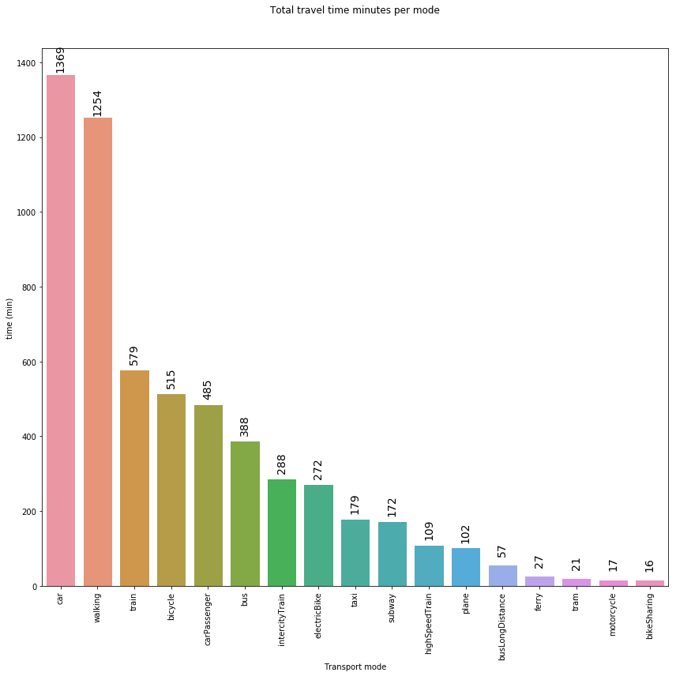


- **Group all transport modes < 1 in a unique set named "other" and all train types in "Train"
and show percentage instead of absolute values**


```
#Use apply function to replace "intercityTrain" and "highSpeedTrain" with "train" and group them together
transport_mode_share['ModeOfTransport'] = transport_mode_share.apply(lambda x: "train" if x['ModeOfTransport'] in (['intercityTrain','highSpeedTrain']) else x['ModeOfTransport'], axis=1)
transport_mode_share = transport_mode_share.groupby('ModeOfTransport').sum().reset_index().sort_values('frel', ascending=False)

#Group all trasport modes that have freq < 1
transport_mode_share['ModeOfTransport'] = transport_mode_share.apply(lambda x: x['ModeOfTransport'] if x['frel'] >= 1 else "other", axis=1)
transport_mode_share = transport_mode_share.groupby('ModeOfTransport').sum().reset_index().sort_values('frel', ascending=False)
transport_mode_share
```


<div>
<style scoped>
    .dataframe tbody tr th:only-of-type {
        vertical-align: middle;
    }

    .dataframe tbody tr th {
        vertical-align: top;
    }

    .dataframe thead th {
        text-align: right;
    }
</style>
<table border="1" class="dataframe">
  <thead>
    <tr style="text-align: right;">
      <th></th>
      <th>ModeOfTransport</th>
      <th>duration_min</th>
      <th>frel</th>
    </tr>
  </thead>
  <tbody>
    <tr>
      <th>2</th>
      <td>car</td>
      <td>1368.71</td>
      <td>23.40</td>
    </tr>
    <tr>
      <th>10</th>
      <td>walking</td>
      <td>1253.99</td>
      <td>21.44</td>
    </tr>
    <tr>
      <th>9</th>
      <td>train</td>
      <td>975.73</td>
      <td>16.68</td>
    </tr>
    <tr>
      <th>0</th>
      <td>bicycle</td>
      <td>515.16</td>
      <td>8.81</td>
    </tr>
    <tr>
      <th>3</th>
      <td>carPassenger</td>
      <td>484.90</td>
      <td>8.29</td>
    </tr>
    <tr>
      <th>1</th>
      <td>bus</td>
      <td>388.49</td>
      <td>6.64</td>
    </tr>
    <tr>
      <th>4</th>
      <td>electricBike</td>
      <td>271.66</td>
      <td>4.64</td>
    </tr>
    <tr>
      <th>8</th>
      <td>taxi</td>
      <td>178.85</td>
      <td>3.06</td>
    </tr>
    <tr>
      <th>7</th>
      <td>subway</td>
      <td>172.47</td>
      <td>2.95</td>
    </tr>
    <tr>
      <th>5</th>
      <td>other</td>
      <td>138.00</td>
      <td>2.36</td>
    </tr>
    <tr>
      <th>6</th>
      <td>plane</td>
      <td>102.07</td>
      <td>1.74</td>
    </tr>
  </tbody>
</table>
</div>


```
fig = plt.figure(figsize=(12,12))
ax = plt.gca()


sns.set_style("whitegrid")
rcParams['figure.figsize'] = 12,8

g = sns.barplot(data = transport_mode_share, x="ModeOfTransport", y='frel').set(
    xlabel='Transport mode', 
    ylabel = 'Percentage of time'
)

plt.title('Percentage of total travel time per mode', y=1.)
plt.xticks(rotation=90)

for p in ax.patches:
             ax.annotate("%.2f" % p.get_height(), (p.get_x() + p.get_width() / 2., p.get_height()),
                 ha='center', va='center', fontsize=14, color='black', rotation=90, xytext=(0, 20),
                 textcoords='offset points')  

plt.tight_layout()
```


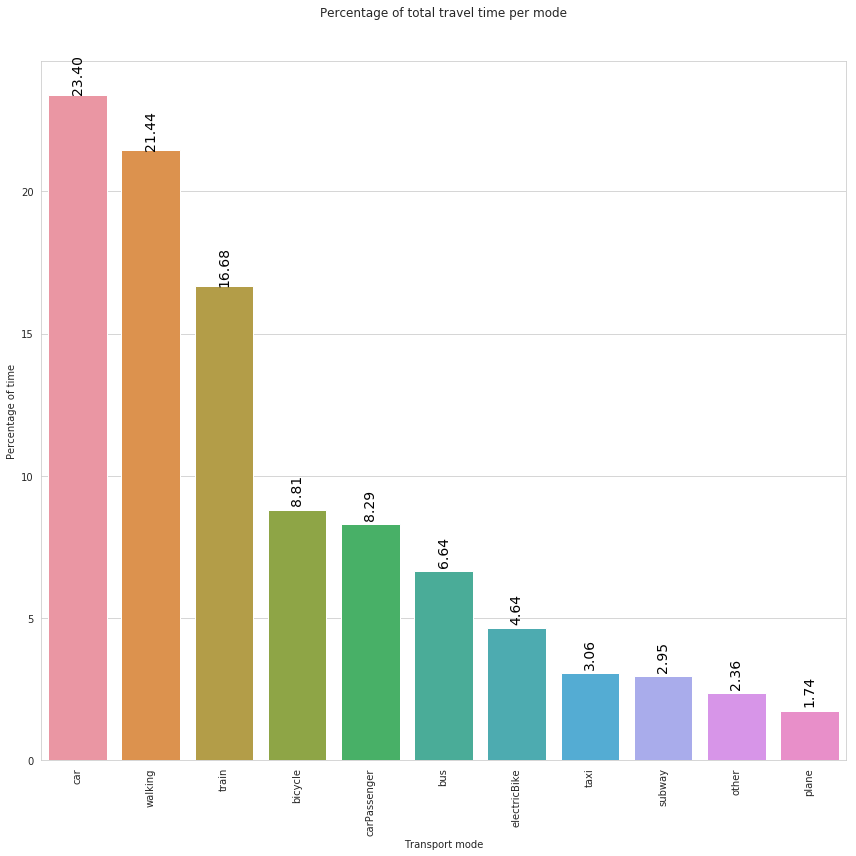


In the above plot we can observe that, during the analyzed 1-day period, users reported to spend more time traveling by car, walking or by train.

#### Exercise 1:
**Show the total travel distance per mode:**
- Use relative values (percentages)
- Group all transport modes < 1 in a unique set named "other" and all train types in "Train"
- Since distances are expressed in meters, transform them in km


```
# PUT YOUR CODE HERE

# transport_mode_share = ...


# merge all train types and transport modes whith low frequency (< 1). USE APPLY FUNCTION
#transport_mode_share['transportMode'] = transport_mode_share.apply(lambda x:...

```


```
fig = plt.figure(figsize=(12,12))
ax = plt.gca()


sns.set_style("whitegrid")


g = sns.barplot(data = transport_mode_share, x="transportMode", y='frel').set(
    xlabel='Transport mode', 
    ylabel = 'Percentage of distance'
)


# plt.legend(bbox_to_anchor=(1.05, 1), loc=2, borderaxespad=0.)
plt.title('Percentage of total travel distance per mode', y=1.)
plt.xticks(rotation=90)

for p in ax.patches:
             ax.annotate("%.2f" % p.get_height(), (p.get_x() + p.get_width() / 2., p.get_height()),
                 ha='center', va='center', fontsize=14, color='black', rotation=90, xytext=(0, 20),
                 textcoords='offset points')  

plt.tight_layout()
```


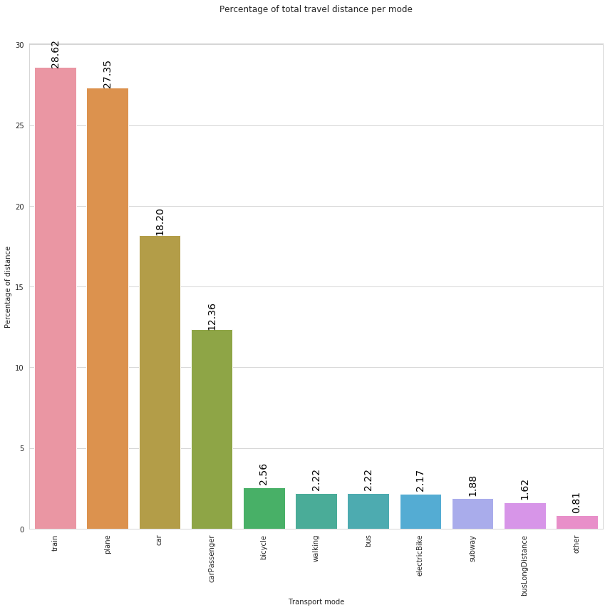


In the above plot we can observe that, during the analyzed 1-day period, the most used transport mode in terms of distance is the train, followed by plane and car.

### Worthwhileness satisfaction

- The corresponding variable is **`wastedTime`**;
- The Worthwhileness satisfaction value must be a value between 1 and 5, so any other value not in this range must be considered an error and discarded


```
#Check if there are values that are not in the correct range
legs_df['wastedTime'].unique()
```


    array([-1,  5,  4,  3,  2,  1,  0,  6])


```
# filter out legs with an incorrect value of wastedTime
legs_df_wast = legs_df[legs_df['wastedTime'].isin([1,2,3,4,5])]
print(legs_df_wast['wastedTime'].unique())

# compute the wastedTime mean by transport mode
wasted_x_transp = legs_df_wast.groupby('ModeOfTransport')['wastedTime'].mean().reset_index()
wasted_x_transp.sort_values(by='wastedTime', ascending=False, inplace=True)
wasted_x_transp.head()
```

    [5 4 3 2 1]


<div>
<style scoped>
    .dataframe tbody tr th:only-of-type {
        vertical-align: middle;
    }

    .dataframe tbody tr th {
        vertical-align: top;
    }

    .dataframe thead th {
        text-align: right;
    }
</style>
<table border="1" class="dataframe">
  <thead>
    <tr style="text-align: right;">
      <th></th>
      <th>ModeOfTransport</th>
      <th>wastedTime</th>
    </tr>
  </thead>
  <tbody>
    <tr>
      <th>8</th>
      <td>motorcycle</td>
      <td>5.00</td>
    </tr>
    <tr>
      <th>5</th>
      <td>electricBike</td>
      <td>4.50</td>
    </tr>
    <tr>
      <th>12</th>
      <td>train</td>
      <td>4.18</td>
    </tr>
    <tr>
      <th>13</th>
      <td>walking</td>
      <td>4.14</td>
    </tr>
    <tr>
      <th>1</th>
      <td>bikeSharing</td>
      <td>4.00</td>
    </tr>
  </tbody>
</table>
</div>


- As before, group all train types in "Train"


```
# use aplly function to loop through all rows of the dataframe
wasted_x_transp['ModeOfTransport'] = wasted_x_transp.apply(lambda x: "train" if x['ModeOfTransport'] in (['intercityTrain','highSpeedTrain']) else x['ModeOfTransport'], axis=1)
wasted_x_transp = wasted_x_transp.groupby('ModeOfTransport').mean().reset_index().sort_values('wastedTime', ascending=False)
wasted_x_transp.head()
```


<div>
<style scoped>
    .dataframe tbody tr th:only-of-type {
        vertical-align: middle;
    }

    .dataframe tbody tr th {
        vertical-align: top;
    }

    .dataframe thead th {
        text-align: right;
    }
</style>
<table border="1" class="dataframe">
  <thead>
    <tr style="text-align: right;">
      <th></th>
      <th>ModeOfTransport</th>
      <th>wastedTime</th>
    </tr>
  </thead>
  <tbody>
    <tr>
      <th>6</th>
      <td>motorcycle</td>
      <td>5.00</td>
    </tr>
    <tr>
      <th>5</th>
      <td>electricBike</td>
      <td>4.50</td>
    </tr>
    <tr>
      <th>11</th>
      <td>walking</td>
      <td>4.14</td>
    </tr>
    <tr>
      <th>10</th>
      <td>train</td>
      <td>4.06</td>
    </tr>
    <tr>
      <th>1</th>
      <td>bikeSharing</td>
      <td>4.00</td>
    </tr>
  </tbody>
</table>
</div>


```
fig = plt.figure(figsize=(12,12))
ax = plt.gca()


sns.set_style("whitegrid")

g = sns.barplot(data = wasted_x_transp, x="ModeOfTransport", y='wastedTime').set(
    xlabel='Transport mode', 
    ylabel = 'Average assessment '
)


plt.title('Average assessment per mode of wasted vs worthwhileness', y=1.)
plt.xticks(rotation=90)

for p in ax.patches:
             ax.annotate("%.2f" % p.get_height(), (p.get_x() + p.get_width() / 2., p.get_height()),
                 ha='center', va='center', fontsize=14, color='black', rotation=90, xytext=(0, 20),
                 textcoords='offset points')  

plt.tight_layout()
```


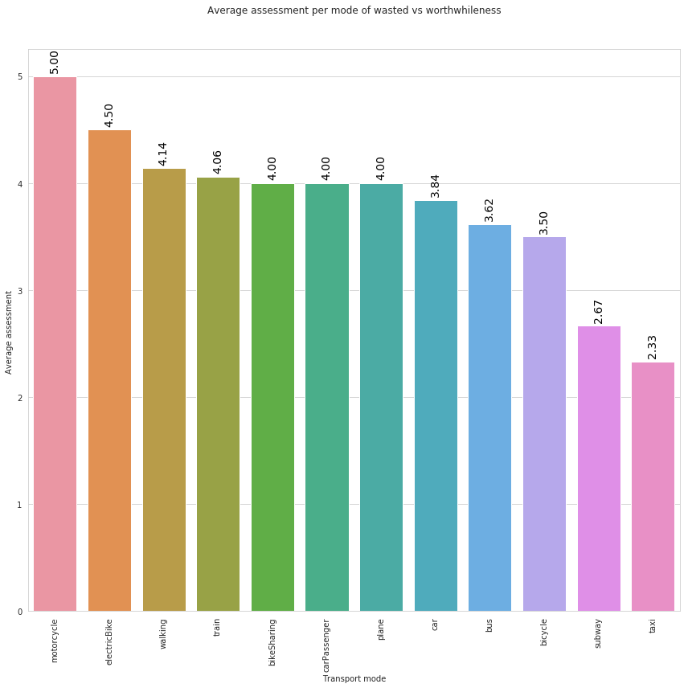


In the above plot we can observe that, during the analyzed 1-day period, users reported as the most worthwhile transport mode motocycle, followed by electricbike and walking. Of course, these values are not exhaustive and reliable since, from one hand they are based only on 1-day sample, on the other hand we are not considering the number of trips/legs per mode. This means, for instance, that if we have one travel performed by `motocycle` with `wastedTime=5`, and let's say 5 trips performed by car with the following values for `wastedTime = [5,5,5,5,4]`, motocycle will have a higher score than car even if we don't have enough information to evaluate if motocycle is really more worthwhile than car.

### Percentage mode share counting only the longest “main mode” based on distance


```
legs_df.head()

# Select only leg of type "Leg" not transfer (WaitingTime)
legs_df_1 = legs_df[legs_df['class'] == 'Leg']
print(legs_df.shape)
print(legs_df_1.shape)


# Add a ranking to each leg within the corresponding trip, based on distances (cumcount function)

legs_df_1 = legs_df_1.sort_values(['tripid', 'legDistance'], ascending=[True, False])
legs_df_1['rank'] = legs_df_1.groupby(['tripid']).cumcount()+1; 


legs_df_1.head()[['tripid','legDistance','ModeOfTransport','rank']] # Select just these columns for a better visualization


```

    (507, 16)
    (507, 16)


<div>
<style scoped>
    .dataframe tbody tr th:only-of-type {
        vertical-align: middle;
    }

    .dataframe tbody tr th {
        vertical-align: top;
    }

    .dataframe thead th {
        text-align: right;
    }
</style>
<table border="1" class="dataframe">
  <thead>
    <tr style="text-align: right;">
      <th></th>
      <th>tripid</th>
      <th>legDistance</th>
      <th>ModeOfTransport</th>
      <th>rank</th>
    </tr>
  </thead>
  <tbody>
    <tr>
      <th>2</th>
      <td>#30:3129</td>
      <td>26264.00</td>
      <td>train</td>
      <td>1</td>
    </tr>
    <tr>
      <th>1</th>
      <td>#30:3129</td>
      <td>3922.00</td>
      <td>bus</td>
      <td>2</td>
    </tr>
    <tr>
      <th>70</th>
      <td>#30:3131</td>
      <td>2580.00</td>
      <td>bicycle</td>
      <td>1</td>
    </tr>
    <tr>
      <th>69</th>
      <td>#30:3131</td>
      <td>952.00</td>
      <td>bicycle</td>
      <td>2</td>
    </tr>
    <tr>
      <th>53</th>
      <td>#30:3134</td>
      <td>833.00</td>
      <td>walking</td>
      <td>1</td>
    </tr>
  </tbody>
</table>
</div>


Select only the longest legs (rank==1)


```
longest_legs = legs_df_1[legs_df_1['rank'] == 1]

# Check: We selected onle leg per trip (the longest one). So, we expect the number of legs
# to be equal to the number of trips.
print('Is the number of legs equal to the number of trips? ' , len(longest_legs['legid'].unique()) == len(longest_legs['tripid'].unique()) )
print('------------- ------------- ------------- ------------- -------------')
longest_legs.head(3)
```

    Is the number of legs equal to the number of trips?  True
    ------------- ------------- ------------- ------------- -------------


<div>
<style scoped>
    .dataframe tbody tr th:only-of-type {
        vertical-align: middle;
    }

    .dataframe tbody tr th {
        vertical-align: top;
    }

    .dataframe thead th {
        text-align: right;
    }
</style>
<table border="1" class="dataframe">
  <thead>
    <tr style="text-align: right;">
      <th></th>
      <th>tripid</th>
      <th>legid</th>
      <th>class</th>
      <th>averageSpeed</th>
      <th>correctedModeOfTransport</th>
      <th>legDistance</th>
      <th>startDate</th>
      <th>endDate</th>
      <th>wastedTime</th>
      <th>userid</th>
      <th>startDate_formated</th>
      <th>endDate_formated</th>
      <th>duration_min</th>
      <th>ModeOfTransport</th>
      <th>up_bound_time</th>
      <th>up_bound_dist</th>
      <th>rank</th>
    </tr>
  </thead>
  <tbody>
    <tr>
      <th>2</th>
      <td>#30:3129</td>
      <td>#23:7518</td>
      <td>Leg</td>
      <td>73.89</td>
      <td>10.00</td>
      <td>26264.00</td>
      <td>1559877214732</td>
      <td>1559878494386</td>
      <td>-1</td>
      <td>cc0RZphNb4ff9dCHQSSUnOKaa493</td>
      <td>2019-06-07 03:13:34.732</td>
      <td>2019-06-07 03:34:54.386</td>
      <td>21.20</td>
      <td>train</td>
      <td>65.47</td>
      <td>53033.75</td>
      <td>1</td>
    </tr>
    <tr>
      <th>70</th>
      <td>#30:3131</td>
      <td>#23:7525</td>
      <td>Leg</td>
      <td>9.65</td>
      <td>1.00</td>
      <td>2580.00</td>
      <td>1559885937507</td>
      <td>1559886907422</td>
      <td>-1</td>
      <td>98RrGdM2ZCfgSOSEoImUXE91PiX2</td>
      <td>2019-06-07 05:38:57.507</td>
      <td>2019-06-07 05:55:07.422</td>
      <td>16.10</td>
      <td>bicycle</td>
      <td>29.59</td>
      <td>5781.33</td>
      <td>1</td>
    </tr>
    <tr>
      <th>53</th>
      <td>#30:3134</td>
      <td>#24:7500</td>
      <td>Leg</td>
      <td>8.51</td>
      <td>7.00</td>
      <td>833.00</td>
      <td>1559883461163</td>
      <td>1559883813731</td>
      <td>3</td>
      <td>XYeosrLCLohPhv9G10AE1OIvW8V2</td>
      <td>2019-06-07 04:57:41.163</td>
      <td>2019-06-07 05:03:33.731</td>
      <td>5.52</td>
      <td>walking</td>
      <td>19.40</td>
      <td>1540.10</td>
      <td>1</td>
    </tr>
  </tbody>
</table>
</div>


```
# compute relative frequency by transport mode
longest_transport_mode_share = longest_legs.groupby('ModeOfTransport')['legid'].size().reset_index().sort_values(by='legid', ascending=False)
longest_transport_mode_share.columns = ['transportMode', '#legs']

# multiply by 100 to obtain percentage
longest_transport_mode_share['frel'] = longest_transport_mode_share['#legs']/longest_transport_mode_share['#legs'].sum()*100

#Check if sum of frel == 100
print(longest_transport_mode_share['frel'].sum())
longest_transport_mode_share.head()
```

    100.0


<div>
<style scoped>
    .dataframe tbody tr th:only-of-type {
        vertical-align: middle;
    }

    .dataframe tbody tr th {
        vertical-align: top;
    }

    .dataframe thead th {
        text-align: right;
    }
</style>
<table border="1" class="dataframe">
  <thead>
    <tr style="text-align: right;">
      <th></th>
      <th>transportMode</th>
      <th>#legs</th>
      <th>frel</th>
    </tr>
  </thead>
  <tbody>
    <tr>
      <th>15</th>
      <td>walking</td>
      <td>65</td>
      <td>28.14</td>
    </tr>
    <tr>
      <th>4</th>
      <td>car</td>
      <td>57</td>
      <td>24.68</td>
    </tr>
    <tr>
      <th>0</th>
      <td>bicycle</td>
      <td>29</td>
      <td>12.55</td>
    </tr>
    <tr>
      <th>13</th>
      <td>train</td>
      <td>20</td>
      <td>8.66</td>
    </tr>
    <tr>
      <th>2</th>
      <td>bus</td>
      <td>19</td>
      <td>8.23</td>
    </tr>
  </tbody>
</table>
</div>


```
fig = plt.figure(figsize=(12,12))
ax = plt.gca()


sns.set_style("whitegrid")
rcParams['figure.figsize'] = 12,8

g = sns.barplot(data = longest_transport_mode_share, x="transportMode", y='frel').set(
    xlabel='Transport mode', 
    ylabel = 'Percentage of legs'
)


plt.title('Percentage mode share based on the total count for each mode\ncounting only the longest (in distance) “main” mode ', y=1.)
plt.xticks(rotation=90)

for p in ax.patches:
             ax.annotate("%.2f" % p.get_height(), (p.get_x() + p.get_width() / 2., p.get_height()),
                 ha='center', va='center', fontsize=14, color='black', rotation=90, xytext=(0, 20),
                 textcoords='offset points')  

plt.tight_layout()


```


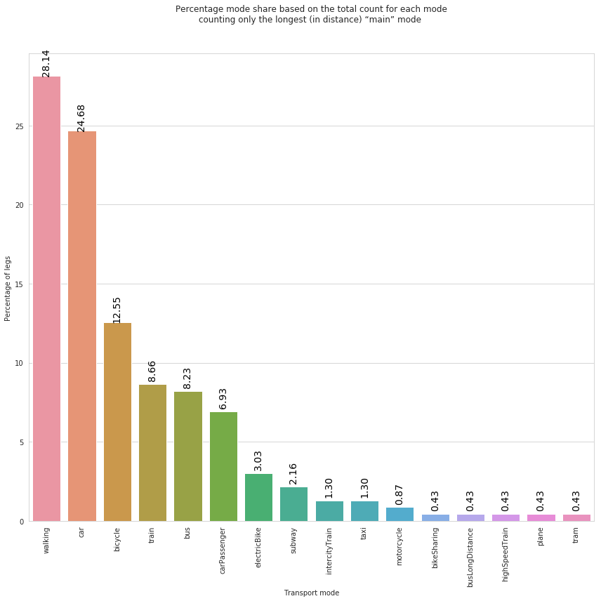


Remember, a trip may be composed of multiple legs. The above plot consider only the longest leg of each trip a report the corresponding mode share. We can observe that, during the analyzed 1-day period, walking and car are the 'stand-out' winner.

### Exercise 2: 

**Percentage mode share counting only the longest “main mode” based on duration (variable *duration_min*)**


```
# PUT YOUR CODE HERE

# Select only leg of type "Leg" not transfer (WaitingTime)
#legs_df_1 = ...


# Add a ranking to each leg within the corresponding trip, based on distances


```

    (507, 16)
    (507, 16)


<div>
<style scoped>
    .dataframe tbody tr th:only-of-type {
        vertical-align: middle;
    }

    .dataframe tbody tr th {
        vertical-align: top;
    }

    .dataframe thead th {
        text-align: right;
    }
</style>
<table border="1" class="dataframe">
  <thead>
    <tr style="text-align: right;">
      <th></th>
      <th>tripid</th>
      <th>duration_min</th>
      <th>ModeOfTransport</th>
      <th>rank</th>
    </tr>
  </thead>
  <tbody>
    <tr>
      <th>2</th>
      <td>#30:3129</td>
      <td>21.20</td>
      <td>train</td>
      <td>1</td>
    </tr>
    <tr>
      <th>1</th>
      <td>#30:3129</td>
      <td>8.12</td>
      <td>bus</td>
      <td>2</td>
    </tr>
    <tr>
      <th>70</th>
      <td>#30:3131</td>
      <td>16.10</td>
      <td>bicycle</td>
      <td>1</td>
    </tr>
    <tr>
      <th>69</th>
      <td>#30:3131</td>
      <td>8.28</td>
      <td>bicycle</td>
      <td>2</td>
    </tr>
    <tr>
      <th>53</th>
      <td>#30:3134</td>
      <td>5.52</td>
      <td>walking</td>
      <td>1</td>
    </tr>
  </tbody>
</table>
</div>


```
#select longets legs

# PUT YOUR CODE HERE
# longest_legs = ....

# Check: We selected onle leg per trip (the longest one). So, we expect the number of legs
# to be equal to the number of trips.


```


```
# PUT YOUR CODE HERE

# compute frequency by transport mode

#longest_transport_mode_share = ...


```


```
fig = plt.figure(figsize=(12,12))
ax = plt.gca()


sns.set_style("whitegrid")
rcParams['figure.figsize'] = 12,8

g = sns.barplot(data = longest_transport_mode_share, x="transportMode", y='frel').set(
    xlabel='Transport mode', 
    ylabel = 'Percentage of legs'
)


plt.title('Percentage mode share based on the total count for each mode\ncounting only the longest (in duration) “main” mode ', y=1.)
plt.xticks(rotation=90)

for p in ax.patches:
             ax.annotate("%.2f" % p.get_height(), (p.get_x() + p.get_width() / 2., p.get_height()),
                 ha='center', va='center', fontsize=14, color='black', rotation=90, xytext=(0, 20),
                 textcoords='offset points')  

plt.tight_layout()


```


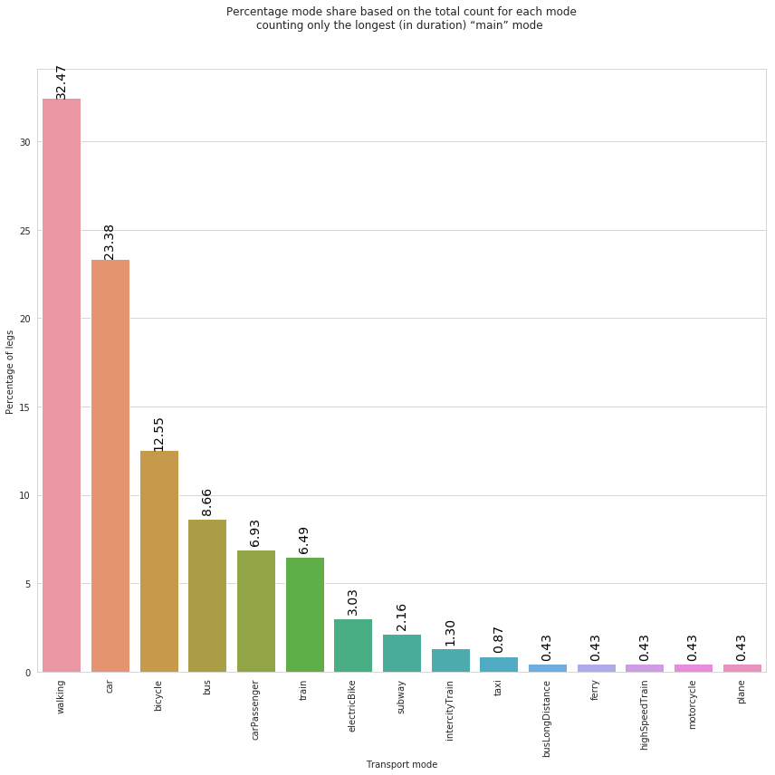


### Experience Factors

#### Experience factor associated to each leg


```
#factors_url="https://www.dropbox.com/s/dnz7l1f0s0f9xun/all_factors1.pkl?dl=1"

#s=requests.get(factors_url).content
#factors_df=pd.read_pickle(io.BytesIO(s), compression=None)

# show sample of factor dataframe
factors_df.head()

```


<div>
<style scoped>
    .dataframe tbody tr th:only-of-type {
        vertical-align: middle;
    }

    .dataframe tbody tr th {
        vertical-align: top;
    }

    .dataframe thead th {
        text-align: right;
    }
</style>
<table border="1" class="dataframe">
  <thead>
    <tr style="text-align: right;">
      <th></th>
      <th>tripid</th>
      <th>legid</th>
      <th>factor</th>
      <th>minus</th>
      <th>plus</th>
    </tr>
  </thead>
  <tbody>
    <tr>
      <th>38373</th>
      <td>#33:3216</td>
      <td>#22:7937</td>
      <td>Simplicity/difficulty of the route</td>
      <td>False</td>
      <td>True</td>
    </tr>
    <tr>
      <th>38374</th>
      <td>#33:3216</td>
      <td>#22:7937</td>
      <td>Parking at end points</td>
      <td>False</td>
      <td>True</td>
    </tr>
    <tr>
      <th>38375</th>
      <td>#33:3216</td>
      <td>#22:7937</td>
      <td>Ability to do what I want while I travel</td>
      <td>False</td>
      <td>True</td>
    </tr>
    <tr>
      <th>38376</th>
      <td>#33:3216</td>
      <td>#22:7937</td>
      <td>Road quality/vehicle ride smoothness</td>
      <td>False</td>
      <td>True</td>
    </tr>
    <tr>
      <th>38377</th>
      <td>#33:3112</td>
      <td>#24:7646</td>
      <td>Ability to do what I want while I travel</td>
      <td>False</td>
      <td>True</td>
    </tr>
  </tbody>
</table>
</div>


#### Top-10 most frequent factors reported by users


```
# for each factor compute how many times has been reported by users and select the top-10
factors_df_freq = factors_df.groupby('factor').size().reset_index()
factors_df_freq.columns = ['factor', 'count']
factors_df_freq.sort_values('count', ascending=False, inplace=True)
top_10_factors = factors_df_freq.head(10)
top_10_factors
```


<div>
<style scoped>
    .dataframe tbody tr th:only-of-type {
        vertical-align: middle;
    }

    .dataframe tbody tr th {
        vertical-align: top;
    }

    .dataframe thead th {
        text-align: right;
    }
</style>
<table border="1" class="dataframe">
  <thead>
    <tr style="text-align: right;">
      <th></th>
      <th>factor</th>
      <th>count</th>
    </tr>
  </thead>
  <tbody>
    <tr>
      <th>40</th>
      <td>Simplicity/difficulty of the route</td>
      <td>113</td>
    </tr>
    <tr>
      <th>43</th>
      <td>Today’s weather</td>
      <td>91</td>
    </tr>
    <tr>
      <th>1</th>
      <td>Ability to do what I want while I travel</td>
      <td>87</td>
    </tr>
    <tr>
      <th>21</th>
      <td>Nature and scenery</td>
      <td>49</td>
    </tr>
    <tr>
      <th>22</th>
      <td>Noise level</td>
      <td>47</td>
    </tr>
    <tr>
      <th>25</th>
      <td>Other people</td>
      <td>41</td>
    </tr>
    <tr>
      <th>32</th>
      <td>Road/path availability and safety</td>
      <td>41</td>
    </tr>
    <tr>
      <th>18</th>
      <td>Information and signs</td>
      <td>40</td>
    </tr>
    <tr>
      <th>35</th>
      <td>Route planning/navigation tools</td>
      <td>40</td>
    </tr>
    <tr>
      <th>30</th>
      <td>Reliability of travel time</td>
      <td>40</td>
    </tr>
  </tbody>
</table>
</div>


The experience factors shown above are the most frequent; anyway it is relevant to take into account that each experience factor can affect positively (plus=true) or negatively (minus=true) the user trip

### Top-10 most frequent experience factors that affect negatively user trips


```
# Select factors that have been reported to affect negatively user trip (minus==True)
minus_factors = factors_df[factors_df['minus'] == True]
print(minus_factors.shape)
minus_factors.head(3)


```

    (216, 5)


<div>
<style scoped>
    .dataframe tbody tr th:only-of-type {
        vertical-align: middle;
    }

    .dataframe tbody tr th {
        vertical-align: top;
    }

    .dataframe thead th {
        text-align: right;
    }
</style>
<table border="1" class="dataframe">
  <thead>
    <tr style="text-align: right;">
      <th></th>
      <th>tripid</th>
      <th>legid</th>
      <th>factor</th>
      <th>minus</th>
      <th>plus</th>
    </tr>
  </thead>
  <tbody>
    <tr>
      <th>38379</th>
      <td>#31:3125</td>
      <td>#24:7522</td>
      <td>Road/path availability and safety</td>
      <td>True</td>
      <td>True</td>
    </tr>
    <tr>
      <th>38380</th>
      <td>#31:3125</td>
      <td>#24:7522</td>
      <td>Good accessibility (lifts, ramps, etc.)</td>
      <td>True</td>
      <td>True</td>
    </tr>
    <tr>
      <th>38382</th>
      <td>#31:3125</td>
      <td>#24:7522</td>
      <td>Route planning/navigation tools</td>
      <td>True</td>
      <td>False</td>
    </tr>
  </tbody>
</table>
</div>


```
# Compute frequency of negative factors
minus_factors_df_freq = minus_factors.groupby('factor').size().reset_index()
minus_factors_df_freq.columns = ['minus_factor', 'count']
minus_factors_df_freq.sort_values('count', ascending=False, inplace=True)
top_10_minus_factors = minus_factors_df_freq.head(10)
top_10_minus_factors['frel'] = top_10_minus_factors['count']/top_10_minus_factors['count'].sum()
top_10_minus_factors
```


<div>
<style scoped>
    .dataframe tbody tr th:only-of-type {
        vertical-align: middle;
    }

    .dataframe tbody tr th {
        vertical-align: top;
    }

    .dataframe thead th {
        text-align: right;
    }
</style>
<table border="1" class="dataframe">
  <thead>
    <tr style="text-align: right;">
      <th></th>
      <th>minus_factor</th>
      <th>count</th>
      <th>frel</th>
    </tr>
  </thead>
  <tbody>
    <tr>
      <th>7</th>
      <td>Cars/other vehicles</td>
      <td>17</td>
      <td>0.18</td>
    </tr>
    <tr>
      <th>21</th>
      <td>Noise level</td>
      <td>13</td>
      <td>0.14</td>
    </tr>
    <tr>
      <th>37</th>
      <td>Simplicity/difficulty of the route</td>
      <td>11</td>
      <td>0.12</td>
    </tr>
    <tr>
      <th>27</th>
      <td>Reliability of travel time</td>
      <td>10</td>
      <td>0.11</td>
    </tr>
    <tr>
      <th>23</th>
      <td>Other people</td>
      <td>8</td>
      <td>0.09</td>
    </tr>
    <tr>
      <th>3</th>
      <td>Air quality</td>
      <td>8</td>
      <td>0.09</td>
    </tr>
    <tr>
      <th>40</th>
      <td>Today’s weather</td>
      <td>7</td>
      <td>0.08</td>
    </tr>
    <tr>
      <th>29</th>
      <td>Road/path availability and safety</td>
      <td>7</td>
      <td>0.08</td>
    </tr>
    <tr>
      <th>16</th>
      <td>Good accessibility (lifts, ramps, etc.)</td>
      <td>6</td>
      <td>0.06</td>
    </tr>
    <tr>
      <th>43</th>
      <td>Traffic signals/crossings</td>
      <td>6</td>
      <td>0.06</td>
    </tr>
  </tbody>
</table>
</div>


```
fig = plt.figure(figsize=(12,12))
ax = plt.gca()


sns.set_style("whitegrid")
rcParams['figure.figsize'] = 12,8

g = sns.barplot(data = top_10_minus_factors, x="minus_factor", y='frel').set(
    xlabel='Experience factor', 
    ylabel = 'Percentage of legs'
)


plt.title('Percentage of legs that are affected negatively by the top-10 negative experience factors ', y=1.)
plt.xticks(rotation=90)

for p in ax.patches:
             ax.annotate("%.2f" % p.get_height(), (p.get_x() + p.get_width() / 2., p.get_height()),
                 ha='center', va='center', fontsize=14, color='black', rotation=90, xytext=(0, 20),
                 textcoords='offset points')  

plt.tight_layout()


```


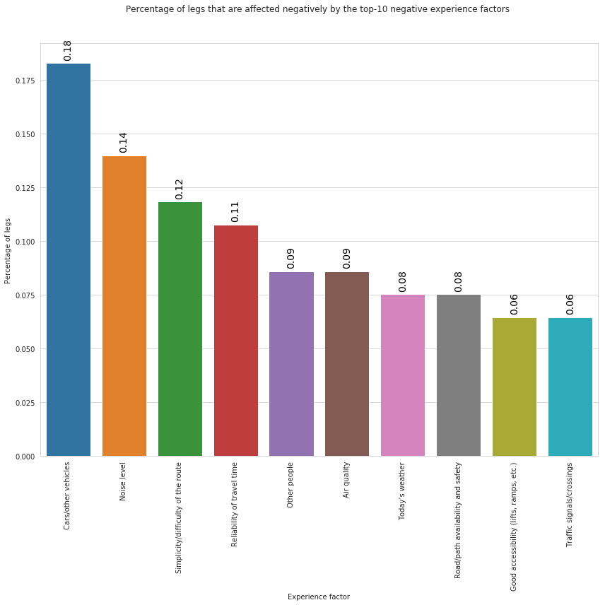


In the above plot we can observe that, the factor that affects negatively users' trips is the presence of other cars and vehicles follwoed by noise and Simplicity/difficulty of the route.

### Exercise 3: Top-10 most frequent experience factors that affect positively user trips


```
# From factor_df select only factors that affect positively (plus==True)
# PUT YOUR CODE HERE


#plus_factors = ...


```

    (808, 5)


<div>
<style scoped>
    .dataframe tbody tr th:only-of-type {
        vertical-align: middle;
    }

    .dataframe tbody tr th {
        vertical-align: top;
    }

    .dataframe thead th {
        text-align: right;
    }
</style>
<table border="1" class="dataframe">
  <thead>
    <tr style="text-align: right;">
      <th></th>
      <th>tripid</th>
      <th>legid</th>
      <th>factor</th>
      <th>minus</th>
      <th>plus</th>
    </tr>
  </thead>
  <tbody>
    <tr>
      <th>38373</th>
      <td>#33:3216</td>
      <td>#22:7937</td>
      <td>Simplicity/difficulty of the route</td>
      <td>False</td>
      <td>True</td>
    </tr>
    <tr>
      <th>38374</th>
      <td>#33:3216</td>
      <td>#22:7937</td>
      <td>Parking at end points</td>
      <td>False</td>
      <td>True</td>
    </tr>
    <tr>
      <th>38375</th>
      <td>#33:3216</td>
      <td>#22:7937</td>
      <td>Ability to do what I want while I travel</td>
      <td>False</td>
      <td>True</td>
    </tr>
  </tbody>
</table>
</div>


```
# Compute frequany of each factor and select top-10
# PUT YOUR CODE HERE


```


<div>
<style scoped>
    .dataframe tbody tr th:only-of-type {
        vertical-align: middle;
    }

    .dataframe tbody tr th {
        vertical-align: top;
    }

    .dataframe thead th {
        text-align: right;
    }
</style>
<table border="1" class="dataframe">
  <thead>
    <tr style="text-align: right;">
      <th></th>
      <th>plus_factor</th>
      <th>count</th>
      <th>frel</th>
    </tr>
  </thead>
  <tbody>
    <tr>
      <th>1</th>
      <td>Ability to do what I want while I travel</td>
      <td>84</td>
      <td>0.19</td>
    </tr>
    <tr>
      <th>39</th>
      <td>Simplicity/difficulty of the route</td>
      <td>77</td>
      <td>0.18</td>
    </tr>
    <tr>
      <th>42</th>
      <td>Today’s weather</td>
      <td>67</td>
      <td>0.15</td>
    </tr>
    <tr>
      <th>21</th>
      <td>Nature and scenery</td>
      <td>34</td>
      <td>0.08</td>
    </tr>
    <tr>
      <th>32</th>
      <td>Road/path availability and safety</td>
      <td>34</td>
      <td>0.08</td>
    </tr>
    <tr>
      <th>22</th>
      <td>Noise level</td>
      <td>31</td>
      <td>0.07</td>
    </tr>
    <tr>
      <th>34</th>
      <td>Road/path quality</td>
      <td>30</td>
      <td>0.07</td>
    </tr>
    <tr>
      <th>30</th>
      <td>Reliability of travel time</td>
      <td>30</td>
      <td>0.07</td>
    </tr>
    <tr>
      <th>25</th>
      <td>Other people</td>
      <td>26</td>
      <td>0.06</td>
    </tr>
    <tr>
      <th>18</th>
      <td>Information and signs</td>
      <td>25</td>
      <td>0.06</td>
    </tr>
  </tbody>
</table>
</div>


```
fig = plt.figure(figsize=(12,12))
ax = plt.gca()


sns.set_style("whitegrid")
rcParams['figure.figsize'] = 12,8

g = sns.barplot(data = top_10_plus_factors, x="plus_factor", y='frel').set(
    xlabel='Experience factor', 
    ylabel = 'Percentage of legs'
)


plt.title('Percentage of legs that are affected positively by the top-10 positive experience factors ', y=1.)
plt.xticks(rotation=90)

for p in ax.patches:
             ax.annotate("%.2f" % p.get_height(), (p.get_x() + p.get_width() / 2., p.get_height()),
                 ha='center', va='center', fontsize=14, color='black', rotation=90, xytext=(0, 20),
                 textcoords='offset points')  

plt.tight_layout()


```


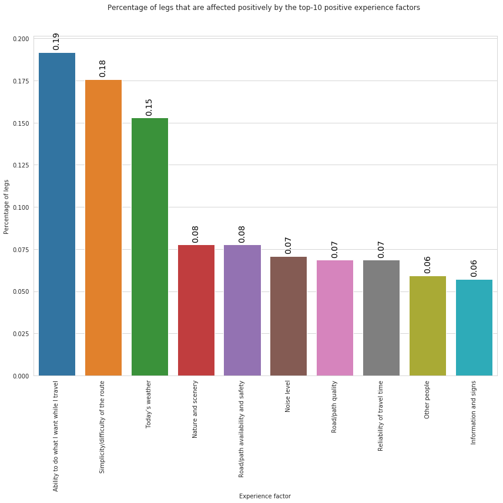


In the above plot we can observe that, the factor that affects positively users' trips is the ability to do waht the traveller wants followed by Simplicuty/difficulty of the route and the weather conditions.

### Exercise: Analyse experience factors by gender

#### To simplify the analysis let's create a new dataframe containing information of legs, users and experience factors.

Tips: 
- You will create the new dataframe as result of the merge among the following dataframes `factors_df`, `legs_df` and `users_df`.
- Use the pandas function [pd.merge(df_1, df_2, on='column', how='left')](https://colab.research.google.com/drive/17RewF7cjd3jMCllHAt0vVMaxC2YikphL#scrollTo=cTYUJUaEqYle). 

  (Here, an [example](https://colab.research.google.com/drive/17RewF7cjd3jMCllHAt0vVMaxC2YikphL#scrollTo=DyelqmF_BemU))
- Consider that the master table (dataframe) is `factors_df` since we want to consider only legs with experience factors. In `factors_df` the same leg may be repeated multiple times.
- Create the new dataframe in 2 steps and after each step check if the result is what you expect:
  - Consider that after the pre-processing the `legs_df` dataset contains less legs that `factors_df`.
  - create a dataframe `legs_temp` as the result of the **merge between `factors_df` and `legs_df`**;
  - From `legs_temp` remove records where the information of the leg is missing : 
  
  **`legs_temp = legs_temp[~legs_temp['up_bound_dist'].isnull()]`**
  
  We decided to use `up_bound_dist` column just becouse we are sure that this column has not `null` values in the `legs_df` dataframe, other columns could be used.
  - Perform the last **merge between `legs_temp` and `users_df`** datasets.


```


# PUT YOUR CODE HERE
#legs_df_complete_temp = pd.merge( ...

 # Remove records where the information of the leg is missing :

 # PUT YOUR CODE HERE
#legs_df_complete_temp = ...
#print(legs_df_complete_temp.shape)


# PUT YOUR CODE HERE
#legs_df_complete = pd.merge(...


#legs_df_complete.head(3)


```

    (1237, 5)
    (1237, 20)
    (1008, 20)
    (1008, 23)


<div>
<style scoped>
    .dataframe tbody tr th:only-of-type {
        vertical-align: middle;
    }

    .dataframe tbody tr th {
        vertical-align: top;
    }

    .dataframe thead th {
        text-align: right;
    }
</style>
<table border="1" class="dataframe">
  <thead>
    <tr style="text-align: right;">
      <th></th>
      <th>tripid_x</th>
      <th>legid</th>
      <th>factor</th>
      <th>minus</th>
      <th>plus</th>
      <th>tripid_y</th>
      <th>class</th>
      <th>averageSpeed</th>
      <th>correctedModeOfTransport</th>
      <th>legDistance</th>
      <th>startDate</th>
      <th>endDate</th>
      <th>wastedTime</th>
      <th>userid</th>
      <th>startDate_formated</th>
      <th>endDate_formated</th>
      <th>duration_min</th>
      <th>ModeOfTransport</th>
      <th>up_bound_time</th>
      <th>up_bound_dist</th>
      <th>country</th>
      <th>gender</th>
      <th>labourStatus</th>
    </tr>
  </thead>
  <tbody>
    <tr>
      <th>0</th>
      <td>#33:3216</td>
      <td>#22:7937</td>
      <td>Simplicity/difficulty of the route</td>
      <td>False</td>
      <td>True</td>
      <td>#33:3216</td>
      <td>Leg</td>
      <td>36.23</td>
      <td>9.00</td>
      <td>3791.00</td>
      <td>1559878993637.00</td>
      <td>1559879370396.00</td>
      <td>5.00</td>
      <td>L93gcTzlEeMm8GwXiSK3TDEsvJJ3</td>
      <td>2019-06-07 03:43:13.637</td>
      <td>2019-06-07 03:49:30.396</td>
      <td>6.17</td>
      <td>car</td>
      <td>59.64</td>
      <td>37710.00</td>
      <td>SVK</td>
      <td>Male</td>
      <td>Student</td>
    </tr>
    <tr>
      <th>1</th>
      <td>#33:3216</td>
      <td>#22:7937</td>
      <td>Parking at end points</td>
      <td>False</td>
      <td>True</td>
      <td>#33:3216</td>
      <td>Leg</td>
      <td>36.23</td>
      <td>9.00</td>
      <td>3791.00</td>
      <td>1559878993637.00</td>
      <td>1559879370396.00</td>
      <td>5.00</td>
      <td>L93gcTzlEeMm8GwXiSK3TDEsvJJ3</td>
      <td>2019-06-07 03:43:13.637</td>
      <td>2019-06-07 03:49:30.396</td>
      <td>6.17</td>
      <td>car</td>
      <td>59.64</td>
      <td>37710.00</td>
      <td>SVK</td>
      <td>Male</td>
      <td>Student</td>
    </tr>
    <tr>
      <th>2</th>
      <td>#33:3216</td>
      <td>#22:7937</td>
      <td>Ability to do what I want while I travel</td>
      <td>False</td>
      <td>True</td>
      <td>#33:3216</td>
      <td>Leg</td>
      <td>36.23</td>
      <td>9.00</td>
      <td>3791.00</td>
      <td>1559878993637.00</td>
      <td>1559879370396.00</td>
      <td>5.00</td>
      <td>L93gcTzlEeMm8GwXiSK3TDEsvJJ3</td>
      <td>2019-06-07 03:43:13.637</td>
      <td>2019-06-07 03:49:30.396</td>
      <td>6.17</td>
      <td>car</td>
      <td>59.64</td>
      <td>37710.00</td>
      <td>SVK</td>
      <td>Male</td>
      <td>Student</td>
    </tr>
  </tbody>
</table>
</div>


```
legs_df_complete[legs_df_complete['up_bound_dist'].isnull()].shape

```


    (0, 23)


#### Gender distribution


```
gender_dist = legs_df_complete.groupby('gender').size().reset_index()
gender_dist.columns = ['gender', 'count']
gender_dist['frel'] = gender_dist['count']/gender_dist['count'].sum()
gender_dist

```


<div>
<style scoped>
    .dataframe tbody tr th:only-of-type {
        vertical-align: middle;
    }

    .dataframe tbody tr th {
        vertical-align: top;
    }

    .dataframe thead th {
        text-align: right;
    }
</style>
<table border="1" class="dataframe">
  <thead>
    <tr style="text-align: right;">
      <th></th>
      <th>gender</th>
      <th>count</th>
      <th>frel</th>
    </tr>
  </thead>
  <tbody>
    <tr>
      <th>0</th>
      <td>Female</td>
      <td>487</td>
      <td>0.48</td>
    </tr>
    <tr>
      <th>1</th>
      <td>Male</td>
      <td>521</td>
      <td>0.52</td>
    </tr>
  </tbody>
</table>
</div>


```
# plot gender distribution
fig = plt.figure(figsize=(6,6))
ax = plt.gca()


sns.set_style("whitegrid")


g = sns.barplot(data = gender_dist, x="gender", y='frel').set(
    xlabel='Gender', 
    ylabel = 'Percentage of users'
)


plt.title('Percentage of users per gender', y=1.)
plt.xticks(rotation=90)

for p in ax.patches:
             ax.annotate("%.2f" % p.get_height(), (p.get_x() + p.get_width() / 2., p.get_height()),
                 ha='center', va='center', fontsize=14, color='black', rotation=90, xytext=(0, 20),
                 textcoords='offset points')  

plt.tight_layout()


```


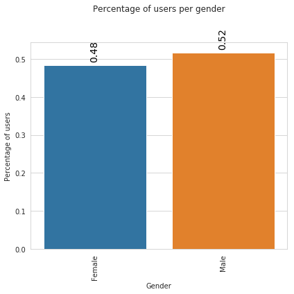


### Top-10 most frequent experience factors by gender


```
legs_df_complete.head(3)

#top-10 most frequent experience factors (positive and negative)
top_10_factors = legs_df_complete.groupby('factor').size().reset_index()
top_10_factors.columns = ['factor', 'count']
top_10_factors.sort_values('count', ascending=False, inplace=True)
top_10_factors = top_10_factors.head(10)
top_10_factors
```


<div>
<style scoped>
    .dataframe tbody tr th:only-of-type {
        vertical-align: middle;
    }

    .dataframe tbody tr th {
        vertical-align: top;
    }

    .dataframe thead th {
        text-align: right;
    }
</style>
<table border="1" class="dataframe">
  <thead>
    <tr style="text-align: right;">
      <th></th>
      <th>factor</th>
      <th>count</th>
    </tr>
  </thead>
  <tbody>
    <tr>
      <th>40</th>
      <td>Simplicity/difficulty of the route</td>
      <td>91</td>
    </tr>
    <tr>
      <th>43</th>
      <td>Today’s weather</td>
      <td>77</td>
    </tr>
    <tr>
      <th>1</th>
      <td>Ability to do what I want while I travel</td>
      <td>71</td>
    </tr>
    <tr>
      <th>22</th>
      <td>Noise level</td>
      <td>38</td>
    </tr>
    <tr>
      <th>21</th>
      <td>Nature and scenery</td>
      <td>37</td>
    </tr>
    <tr>
      <th>25</th>
      <td>Other people</td>
      <td>34</td>
    </tr>
    <tr>
      <th>35</th>
      <td>Route planning/navigation tools</td>
      <td>33</td>
    </tr>
    <tr>
      <th>30</th>
      <td>Reliability of travel time</td>
      <td>33</td>
    </tr>
    <tr>
      <th>18</th>
      <td>Information and signs</td>
      <td>32</td>
    </tr>
    <tr>
      <th>32</th>
      <td>Road/path availability and safety</td>
      <td>28</td>
    </tr>
  </tbody>
</table>
</div>


Notice that the above list of top-10 most reported experience factors differs from that previously computed since before we considered all reported factors, i.e., all factors in the original `legs_df` dataframe, while now we are only considering factors of the `legs_df` after the post-procecssing phase.


```
#top_10_factors['count'].sum()
```

Filter out legs that do not have any of the top-10 experience factor


```
print(legs_df_complete.shape)
legs_df_complete_top_factors = legs_df_complete[legs_df_complete['factor'].isin(top_10_factors['factor'])]
print(legs_df_complete_top_factors.shape)
```

    (1008, 23)
    (474, 23)


```
factors_gender = legs_df_complete_top_factors.groupby(['factor','gender' ]).size().reset_index()
factors_gender.columns = ['factor', 'gender', 'count']
factors_gender.head(4)
```


<div>
<style scoped>
    .dataframe tbody tr th:only-of-type {
        vertical-align: middle;
    }

    .dataframe tbody tr th {
        vertical-align: top;
    }

    .dataframe thead th {
        text-align: right;
    }
</style>
<table border="1" class="dataframe">
  <thead>
    <tr style="text-align: right;">
      <th></th>
      <th>factor</th>
      <th>gender</th>
      <th>count</th>
    </tr>
  </thead>
  <tbody>
    <tr>
      <th>0</th>
      <td>Ability to do what I want while I travel</td>
      <td>Female</td>
      <td>30</td>
    </tr>
    <tr>
      <th>1</th>
      <td>Ability to do what I want while I travel</td>
      <td>Male</td>
      <td>41</td>
    </tr>
    <tr>
      <th>2</th>
      <td>Information and signs</td>
      <td>Female</td>
      <td>17</td>
    </tr>
    <tr>
      <th>3</th>
      <td>Information and signs</td>
      <td>Male</td>
      <td>15</td>
    </tr>
  </tbody>
</table>
</div>


```
#compute gender distribution
fact_gend_dist = factors_gender.groupby('gender')['count'].sum().reset_index()
fact_gend_dist.columns = ['gender', 'total_count']
fact_gend_dist

```


<div>
<style scoped>
    .dataframe tbody tr th:only-of-type {
        vertical-align: middle;
    }

    .dataframe tbody tr th {
        vertical-align: top;
    }

    .dataframe thead th {
        text-align: right;
    }
</style>
<table border="1" class="dataframe">
  <thead>
    <tr style="text-align: right;">
      <th></th>
      <th>gender</th>
      <th>total_count</th>
    </tr>
  </thead>
  <tbody>
    <tr>
      <th>0</th>
      <td>Female</td>
      <td>219</td>
    </tr>
    <tr>
      <th>1</th>
      <td>Male</td>
      <td>255</td>
    </tr>
  </tbody>
</table>
</div>


```
# compute relative freq of each factor in the top-10 by gender
factors_gender = pd.merge(factors_gender, fact_gend_dist, on='gender', how='left')
factors_gender.head(4)


```


<div>
<style scoped>
    .dataframe tbody tr th:only-of-type {
        vertical-align: middle;
    }

    .dataframe tbody tr th {
        vertical-align: top;
    }

    .dataframe thead th {
        text-align: right;
    }
</style>
<table border="1" class="dataframe">
  <thead>
    <tr style="text-align: right;">
      <th></th>
      <th>factor</th>
      <th>gender</th>
      <th>count</th>
      <th>total_count</th>
    </tr>
  </thead>
  <tbody>
    <tr>
      <th>0</th>
      <td>Ability to do what I want while I travel</td>
      <td>Female</td>
      <td>30</td>
      <td>219</td>
    </tr>
    <tr>
      <th>1</th>
      <td>Ability to do what I want while I travel</td>
      <td>Male</td>
      <td>41</td>
      <td>255</td>
    </tr>
    <tr>
      <th>2</th>
      <td>Information and signs</td>
      <td>Female</td>
      <td>17</td>
      <td>219</td>
    </tr>
    <tr>
      <th>3</th>
      <td>Information and signs</td>
      <td>Male</td>
      <td>15</td>
      <td>255</td>
    </tr>
  </tbody>
</table>
</div>


```
factors_gender['frel'] = factors_gender['count']/factors_gender['total_count']
factors_gender.head(4)
```


<div>
<style scoped>
    .dataframe tbody tr th:only-of-type {
        vertical-align: middle;
    }

    .dataframe tbody tr th {
        vertical-align: top;
    }

    .dataframe thead th {
        text-align: right;
    }
</style>
<table border="1" class="dataframe">
  <thead>
    <tr style="text-align: right;">
      <th></th>
      <th>factor</th>
      <th>gender</th>
      <th>count</th>
      <th>total_count</th>
      <th>frel</th>
    </tr>
  </thead>
  <tbody>
    <tr>
      <th>0</th>
      <td>Ability to do what I want while I travel</td>
      <td>Female</td>
      <td>30</td>
      <td>219</td>
      <td>0.14</td>
    </tr>
    <tr>
      <th>1</th>
      <td>Ability to do what I want while I travel</td>
      <td>Male</td>
      <td>41</td>
      <td>255</td>
      <td>0.16</td>
    </tr>
    <tr>
      <th>2</th>
      <td>Information and signs</td>
      <td>Female</td>
      <td>17</td>
      <td>219</td>
      <td>0.08</td>
    </tr>
    <tr>
      <th>3</th>
      <td>Information and signs</td>
      <td>Male</td>
      <td>15</td>
      <td>255</td>
      <td>0.06</td>
    </tr>
  </tbody>
</table>
</div>


```
fig = plt.figure(figsize=(16,10))
ax = plt.gca()

rcParams['font.size'] = 16
sns.set_style("whitegrid")
# rcParams['figure.figsize'] = 16,8

g = sns.barplot(data = factors_gender, x="gender", y='frel', hue='factor').set(
    xlabel='Gender', 
    ylabel = 'Percentage of legs'
)

plt.xticks(rotation=90)
plt.legend(bbox_to_anchor=(1.05, 1), loc=2, borderaxespad=0.)
plt.title('Percentage of legs per factor by gender', y=1.)

for p in ax.patches:
             ax.annotate("%.2f" % p.get_height(), (p.get_x() + p.get_width() / 2., p.get_height()),
                 ha='center', va='center', fontsize=14, color='black', rotation=90, xytext=(0, 20),
                 textcoords='offset points')  

plt.tight_layout()
```


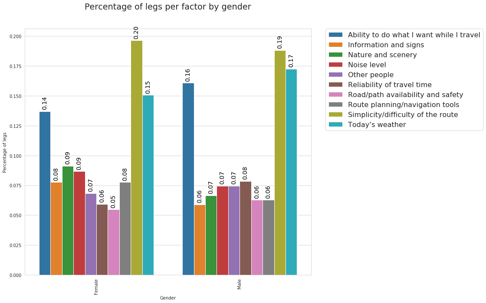


From the above plotwe can observe similar patterns in the factors reported by male and females. Indeed, in both cases, the most reported factor is "Simplicity/difficulty of the route" followed by "Today's weather" and "Ability to do what I want while I travel".

Note that in the above plot we use the **`hue`** parameter. It allows to  define subsets of the data, which will be drawn on separate facets.

### Exercise 4: explore distribution of Top-2 experience factors in each country


Tips:
- Similar at what we have done above with gender.
- Use he `legs_df_complete` dataset already created.
- The column for the country is `country`.


```


#top-2 most frequent experience factors (positive and negative)

# PUT YOUR CODE HERE
#top_2_factors = ...


```


<div>
<style scoped>
    .dataframe tbody tr th:only-of-type {
        vertical-align: middle;
    }

    .dataframe tbody tr th {
        vertical-align: top;
    }

    .dataframe thead th {
        text-align: right;
    }
</style>
<table border="1" class="dataframe">
  <thead>
    <tr style="text-align: right;">
      <th></th>
      <th>factor</th>
      <th>count</th>
    </tr>
  </thead>
  <tbody>
    <tr>
      <th>40</th>
      <td>Simplicity/difficulty of the route</td>
      <td>91</td>
    </tr>
    <tr>
      <th>43</th>
      <td>Today’s weather</td>
      <td>77</td>
    </tr>
  </tbody>
</table>
</div>


```
## From legs_df_complete select legs having factors in top_2_factors

# PUT YOUR CODE HERE
#legs_df_complete_top_factors = ...

```


```
# PUT YOUR CODE HERE
#factors_country = legs_df_complete_top_factors.groupby(...


```


```
#Compute distribution of 2 factors by country

# PUT YOUR CODE HERE
#fact_country_dist = ...


```


```

```


```

```


```
fig = plt.figure(figsize=(16,10))
ax = plt.gca()

rcParams['font.size'] = 16
sns.set_style("whitegrid")
# rcParams['figure.figsize'] = 16,8

g = sns.barplot(data = factors_country, x="country", y='frel', hue='factor').set(
    xlabel='Contry', 
    ylabel = 'Percentage of legs'
)

plt.xticks(rotation=90)
plt.legend(bbox_to_anchor=(1.05, 1), loc=2, borderaxespad=0.)
plt.title('Percentage of legs per factor by country', y=1.)

for p in ax.patches:
             ax.annotate("%.2f" % p.get_height(), (p.get_x() + p.get_width() / 2., p.get_height()),
                 ha='center', va='center', fontsize=14, color='black', rotation=90, xytext=(0, 20),
                 textcoords='offset points')  

plt.tight_layout()
```


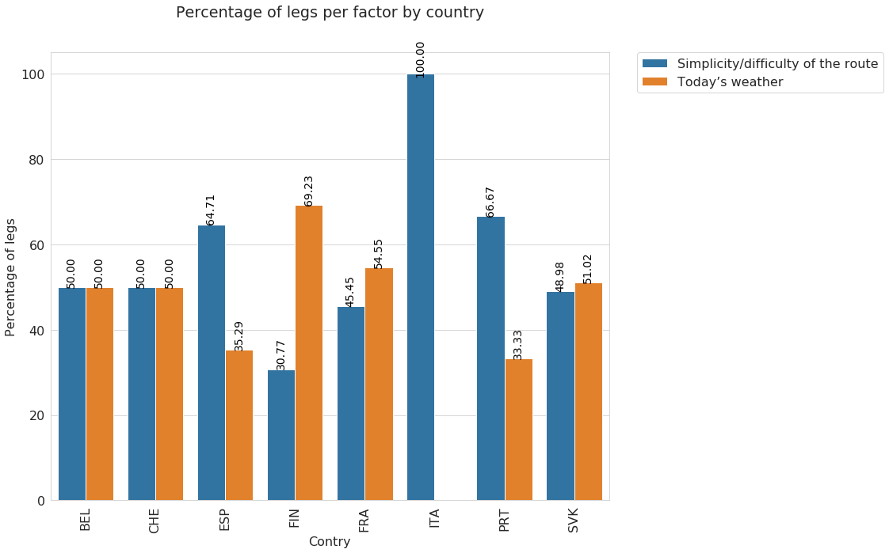


From the above plot different patterns for different cities. Interesting the case of Italy where Today's weather has not been reported at all. 

Again, it is important to remember that the analysis we are performing is based on o very limited sample of data so these results are not exhaustive and informative (Our goal here is to show how these data could be explored and analyzed).

### Exercise 5: Analyze which experience factors affect negatively females' trips

Tips:
- From all legs (`legs_df_complete`) select only legs where gender attribute is *Female*
- Select top-5 factors that affect negatively (`minus=True`) Females's legs.
- Plot percentage of legs per factor


```
# Select legs with gender==female and minus=true from legs_df_complete

# PUT YOUR CODE HERE
#legs_df_complete_f = legs_df_complete[...


```


```
# compute frequency

# PUT YOUR CODE HERE
# top_neg_fact_fem = ...
```


```
fig = plt.figure(figsize=(10,10))
ax = plt.gca()

rcParams['font.size'] = 16
sns.set_style("whitegrid")


g = sns.barplot(data = top_neg_fact_fem, x="factor", y='perc').set(
    xlabel='Factor', 
    ylabel = 'Percentage of legs'
)

plt.xticks(rotation=90)
plt.title('Percentage of legs per factor that affect negatively females\' trips', y=1.)

for p in ax.patches:
             ax.annotate("%.2f" % p.get_height(), (p.get_x() + p.get_width() / 2., p.get_height()),
                 ha='center', va='center', fontsize=14, color='black', rotation=90, xytext=(0, 20),
                 textcoords='offset points')  

plt.tight_layout()
```


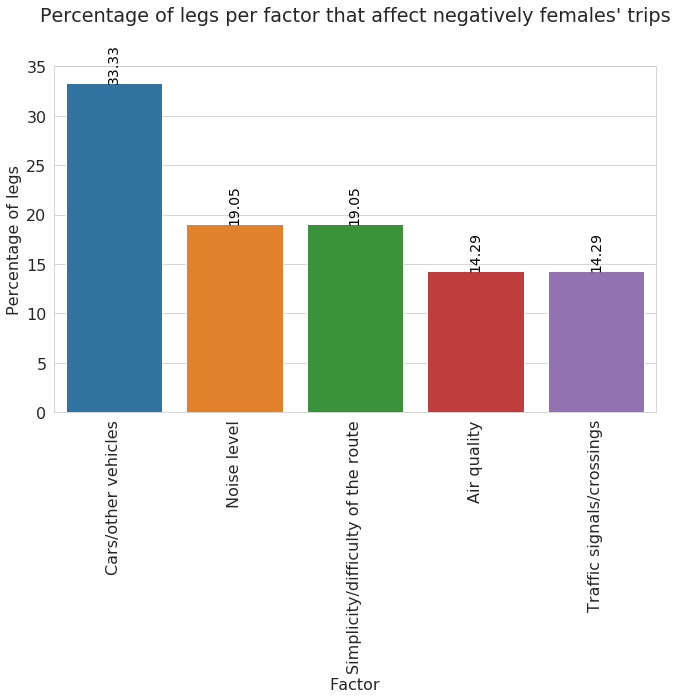


An importan aspect when analyzing user mobility is the time variable.

### Time distribution of Top-5 most frequent experience factors that affect negatively females' trips

Tips:
- In this case we do not want to count the number of legs but we are interested on the total time. for each factor.
- Group by `factor` and use the function **`sum()`**


```
# Notice: For each factor we are computing the sum of the duration_min column
top_time_neg_fact_fem = legs_df_complete_f.groupby('factor')['duration_min'].sum().reset_index()
top_time_neg_fact_fem.columns = ['factor', 'tot_time']
top_time_neg_fact_fem.sort_values('tot_time',ascending=False, inplace=True)

# Select top-5
top_time_neg_fact_fem = top_time_neg_fact_fem.head(5)
top_time_neg_fact_fem['perc'] = top_time_neg_fact_fem['tot_time']/top_time_neg_fact_fem['tot_time'].sum()*100
top_time_neg_fact_fem
```


<div>
<style scoped>
    .dataframe tbody tr th:only-of-type {
        vertical-align: middle;
    }

    .dataframe tbody tr th {
        vertical-align: top;
    }

    .dataframe thead th {
        text-align: right;
    }
</style>
<table border="1" class="dataframe">
  <thead>
    <tr style="text-align: right;">
      <th></th>
      <th>factor</th>
      <th>tot_time</th>
      <th>perc</th>
    </tr>
  </thead>
  <tbody>
    <tr>
      <th>4</th>
      <td>Cars/other vehicles</td>
      <td>152.73</td>
      <td>24.85</td>
    </tr>
    <tr>
      <th>9</th>
      <td>Information and signs</td>
      <td>126.38</td>
      <td>20.56</td>
    </tr>
    <tr>
      <th>17</th>
      <td>Seating quality/personal space</td>
      <td>117.24</td>
      <td>19.08</td>
    </tr>
    <tr>
      <th>5</th>
      <td>Charging opportunity</td>
      <td>110.36</td>
      <td>17.96</td>
    </tr>
    <tr>
      <th>2</th>
      <td>Air quality</td>
      <td>107.83</td>
      <td>17.55</td>
    </tr>
  </tbody>
</table>
</div>


```
fig = plt.figure(figsize=(10,10))
ax = plt.gca()

rcParams['font.size'] = 16
sns.set_style("whitegrid")


g = sns.barplot(data = top_time_neg_fact_fem, x="factor", y='perc').set(
    xlabel='Factor', 
    ylabel = 'Percentage of time'
)

plt.xticks(rotation=90)
plt.title('Percentage of time per factor that affect negatively females\' trips', y=1.)

for p in ax.patches:
             ax.annotate("%.2f" % p.get_height(), (p.get_x() + p.get_width() / 2., p.get_height()),
                 ha='center', va='center', fontsize=14, color='black', rotation=90, xytext=(0, 20),
                 textcoords='offset points')  

plt.tight_layout()
```


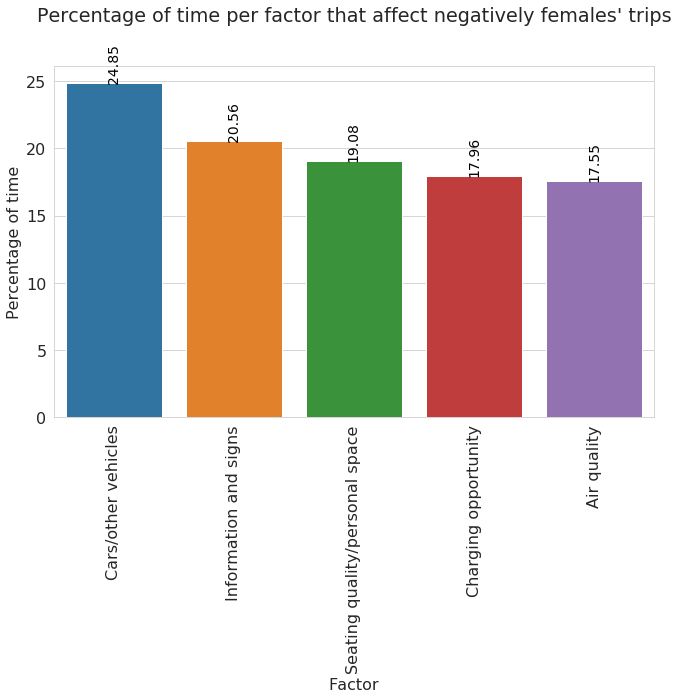


The above plot reports the percentage of time per factor, considering factors that affect negatively females'trip. We can observe that "Car/other vehicles" and "Information and signs" are the most reported factors in this context.

### Exercise 6: Analize the percentage of time of the top-5 factors for car legs

Tips:
- From all legs select only legs performed by car
- Select top-5 factors that affect positively (plus=True) and negatively (minus=True) car legs and store them in 2 different dataframes.
- Plot percentage of legs per factor


```
# PUT YOUR CODE HERE
#car_legs_plus = ...
#car_legs_minus = ...


```


```
# Compute frequency of positive factors

# PUT YOUR CODE HERE
#plus_factor_min = 


```


```
# Compute frequency of negative factors

# PUT YOUR CODE HERE
# minus_factor_min = ....

```


```
# Generate two plot in 1 figure
#subplot(nrows, ncols, index of plot)

plt.subplot(1, 2, 1) # grid of 1 row, 2 column and put next plot in position 1

ax = plt.gca()

rcParams['font.size'] = 11
sns.set_style("whitegrid")


g = sns.barplot(data = plus_factor_min, x="factor", y='perc').set(
    xlabel='Factor', 
    ylabel = 'Percentage of time'
)

plt.xticks(rotation=90)
plt.title('Percentage of time of the top-5 positive factors for car legs', y=1.)

for p in ax.patches:
             ax.annotate("%.2f" % p.get_height(), (p.get_x() + p.get_width() / 2., p.get_height()),
                 ha='center', va='center', fontsize=14, color='black', rotation=90, xytext=(0, 20),
                 textcoords='offset points')  

plt.tight_layout()


plt.subplot(1, 2, 2) # grid of 1 row, 2 column and put next plot in position 2

ax = plt.gca()

rcParams['font.size'] = 11
sns.set_style("whitegrid")


g = sns.barplot(data = minus_factor_min, x="factor", y='perc').set(
    xlabel='Factor', 
    ylabel = 'Percentage of time'
)

plt.xticks(rotation=90)
plt.title('Percentage of time of the top-5 negative factors for car legs', y=1.)

for p in ax.patches:
             ax.annotate("%.2f" % p.get_height(), (p.get_x() + p.get_width() / 2., p.get_height()),
                 ha='center', va='center', fontsize=14, color='black', rotation=90, xytext=(0, 20),
                 textcoords='offset points')  

plt.tight_layout()
```


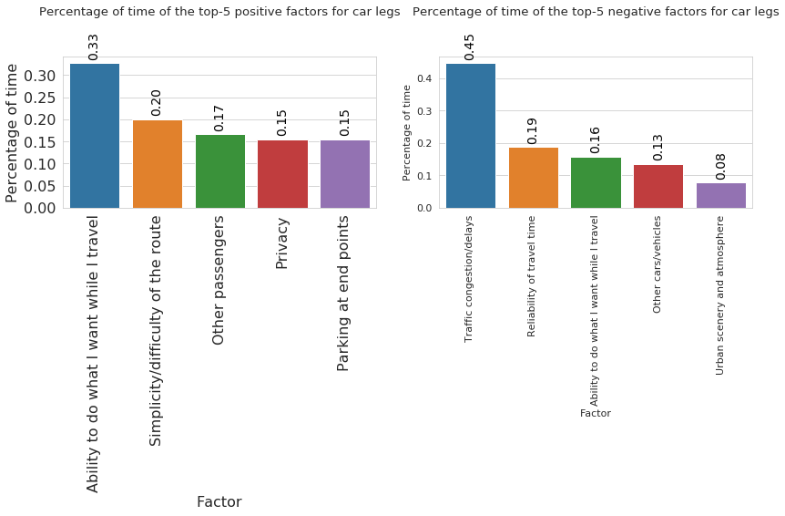


In the above plots we can observe respectively the factors the affect positively and negatively trips perfmed by car. As positive factors, the most reported are "Ability to do what I want while I travel" and "Simplicity/Difficulty of the route". On the other side the factors that affect negatively car's trip are "Traffic congestion/ delays" and "Reliability of travel time".

### Analyze Worthwhileness satisfaction by transport mode and country

- Consider top-5 transport modes
- Consider top-5 transport countries


```
legs_df_user = pd.merge(legs_df, users_df, on='userid', how='left')
legs_df_user.head(3)
```


<div>
<style scoped>
    .dataframe tbody tr th:only-of-type {
        vertical-align: middle;
    }

    .dataframe tbody tr th {
        vertical-align: top;
    }

    .dataframe thead th {
        text-align: right;
    }
</style>
<table border="1" class="dataframe">
  <thead>
    <tr style="text-align: right;">
      <th></th>
      <th>tripid</th>
      <th>legid</th>
      <th>class</th>
      <th>averageSpeed</th>
      <th>correctedModeOfTransport</th>
      <th>legDistance</th>
      <th>startDate</th>
      <th>endDate</th>
      <th>wastedTime</th>
      <th>userid</th>
      <th>startDate_formated</th>
      <th>endDate_formated</th>
      <th>duration_min</th>
      <th>ModeOfTransport</th>
      <th>up_bound_time</th>
      <th>up_bound_dist</th>
      <th>country</th>
      <th>gender</th>
      <th>labourStatus</th>
    </tr>
  </thead>
  <tbody>
    <tr>
      <th>0</th>
      <td>#30:3129</td>
      <td>#22:7538</td>
      <td>Leg</td>
      <td>28.67</td>
      <td>15.00</td>
      <td>3922.00</td>
      <td>1559876476234</td>
      <td>1559876968789</td>
      <td>-1</td>
      <td>cc0RZphNb4ff9dCHQSSUnOKaa493</td>
      <td>2019-06-07 03:01:16.234</td>
      <td>2019-06-07 03:09:28.789</td>
      <td>8.12</td>
      <td>bus</td>
      <td>39.17</td>
      <td>10602.75</td>
      <td>SVK</td>
      <td>Male</td>
      <td>-</td>
    </tr>
    <tr>
      <th>1</th>
      <td>#30:3129</td>
      <td>#23:7518</td>
      <td>Leg</td>
      <td>73.89</td>
      <td>10.00</td>
      <td>26264.00</td>
      <td>1559877214732</td>
      <td>1559878494386</td>
      <td>-1</td>
      <td>cc0RZphNb4ff9dCHQSSUnOKaa493</td>
      <td>2019-06-07 03:13:34.732</td>
      <td>2019-06-07 03:34:54.386</td>
      <td>21.20</td>
      <td>train</td>
      <td>65.47</td>
      <td>53033.75</td>
      <td>SVK</td>
      <td>Male</td>
      <td>-</td>
    </tr>
    <tr>
      <th>2</th>
      <td>#33:3216</td>
      <td>#22:7937</td>
      <td>Leg</td>
      <td>36.23</td>
      <td>9.00</td>
      <td>3791.00</td>
      <td>1559878993637</td>
      <td>1559879370396</td>
      <td>5</td>
      <td>L93gcTzlEeMm8GwXiSK3TDEsvJJ3</td>
      <td>2019-06-07 03:43:13.637</td>
      <td>2019-06-07 03:49:30.396</td>
      <td>6.17</td>
      <td>car</td>
      <td>59.64</td>
      <td>37710.00</td>
      <td>SVK</td>
      <td>Male</td>
      <td>Student</td>
    </tr>
  </tbody>
</table>
</div>


```
# find top-5 most frequent countries
country_count = legs_df_user.groupby('country').size().reset_index()
country_count.columns = ['country','count']
country_count.sort_values('count', ascending=False, inplace=True)
country_count = country_count.head(5)
country_count
```


<div>
<style scoped>
    .dataframe tbody tr th:only-of-type {
        vertical-align: middle;
    }

    .dataframe tbody tr th {
        vertical-align: top;
    }

    .dataframe thead th {
        text-align: right;
    }
</style>
<table border="1" class="dataframe">
  <thead>
    <tr style="text-align: right;">
      <th></th>
      <th>country</th>
      <th>count</th>
    </tr>
  </thead>
  <tbody>
    <tr>
      <th>2</th>
      <td>ESP</td>
      <td>125</td>
    </tr>
    <tr>
      <th>8</th>
      <td>SVK</td>
      <td>124</td>
    </tr>
    <tr>
      <th>7</th>
      <td>PRT</td>
      <td>70</td>
    </tr>
    <tr>
      <th>0</th>
      <td>BEL</td>
      <td>56</td>
    </tr>
    <tr>
      <th>4</th>
      <td>FRA</td>
      <td>44</td>
    </tr>
  </tbody>
</table>
</div>


```
# find top-5 most frequent transport modes
mode_count = legs_df_user.groupby('ModeOfTransport').size().reset_index()
mode_count.columns = ['mode','count']
mode_count.sort_values('count', ascending=False, inplace=True)
mode_count = mode_count.head(5)
mode_count
```


<div>
<style scoped>
    .dataframe tbody tr th:only-of-type {
        vertical-align: middle;
    }

    .dataframe tbody tr th {
        vertical-align: top;
    }

    .dataframe thead th {
        text-align: right;
    }
</style>
<table border="1" class="dataframe">
  <thead>
    <tr style="text-align: right;">
      <th></th>
      <th>mode</th>
      <th>count</th>
    </tr>
  </thead>
  <tbody>
    <tr>
      <th>16</th>
      <td>walking</td>
      <td>221</td>
    </tr>
    <tr>
      <th>4</th>
      <td>car</td>
      <td>97</td>
    </tr>
    <tr>
      <th>0</th>
      <td>bicycle</td>
      <td>55</td>
    </tr>
    <tr>
      <th>14</th>
      <td>train</td>
      <td>31</td>
    </tr>
    <tr>
      <th>2</th>
      <td>bus</td>
      <td>30</td>
    </tr>
  </tbody>
</table>
</div>


```
# select only legs with transport mode and country that are in the respective top-5
trnsp_country_worth_temp = legs_df_user[(legs_df_user['country'].isin(country_count['country']) ) &
                                       (legs_df_user['ModeOfTransport'].isin(mode_count['mode']) )]

print(trnsp_country_worth_temp.shape)                                       
trnsp_country_worth_temp.head(3)
```

    (354, 19)


<div>
<style scoped>
    .dataframe tbody tr th:only-of-type {
        vertical-align: middle;
    }

    .dataframe tbody tr th {
        vertical-align: top;
    }

    .dataframe thead th {
        text-align: right;
    }
</style>
<table border="1" class="dataframe">
  <thead>
    <tr style="text-align: right;">
      <th></th>
      <th>tripid</th>
      <th>legid</th>
      <th>class</th>
      <th>averageSpeed</th>
      <th>correctedModeOfTransport</th>
      <th>legDistance</th>
      <th>startDate</th>
      <th>endDate</th>
      <th>wastedTime</th>
      <th>userid</th>
      <th>startDate_formated</th>
      <th>endDate_formated</th>
      <th>duration_min</th>
      <th>ModeOfTransport</th>
      <th>up_bound_time</th>
      <th>up_bound_dist</th>
      <th>country</th>
      <th>gender</th>
      <th>labourStatus</th>
    </tr>
  </thead>
  <tbody>
    <tr>
      <th>0</th>
      <td>#30:3129</td>
      <td>#22:7538</td>
      <td>Leg</td>
      <td>28.67</td>
      <td>15.00</td>
      <td>3922.00</td>
      <td>1559876476234</td>
      <td>1559876968789</td>
      <td>-1</td>
      <td>cc0RZphNb4ff9dCHQSSUnOKaa493</td>
      <td>2019-06-07 03:01:16.234</td>
      <td>2019-06-07 03:09:28.789</td>
      <td>8.12</td>
      <td>bus</td>
      <td>39.17</td>
      <td>10602.75</td>
      <td>SVK</td>
      <td>Male</td>
      <td>-</td>
    </tr>
    <tr>
      <th>1</th>
      <td>#30:3129</td>
      <td>#23:7518</td>
      <td>Leg</td>
      <td>73.89</td>
      <td>10.00</td>
      <td>26264.00</td>
      <td>1559877214732</td>
      <td>1559878494386</td>
      <td>-1</td>
      <td>cc0RZphNb4ff9dCHQSSUnOKaa493</td>
      <td>2019-06-07 03:13:34.732</td>
      <td>2019-06-07 03:34:54.386</td>
      <td>21.20</td>
      <td>train</td>
      <td>65.47</td>
      <td>53033.75</td>
      <td>SVK</td>
      <td>Male</td>
      <td>-</td>
    </tr>
    <tr>
      <th>2</th>
      <td>#33:3216</td>
      <td>#22:7937</td>
      <td>Leg</td>
      <td>36.23</td>
      <td>9.00</td>
      <td>3791.00</td>
      <td>1559878993637</td>
      <td>1559879370396</td>
      <td>5</td>
      <td>L93gcTzlEeMm8GwXiSK3TDEsvJJ3</td>
      <td>2019-06-07 03:43:13.637</td>
      <td>2019-06-07 03:49:30.396</td>
      <td>6.17</td>
      <td>car</td>
      <td>59.64</td>
      <td>37710.00</td>
      <td>SVK</td>
      <td>Male</td>
      <td>Student</td>
    </tr>
  </tbody>
</table>
</div>


```
# Remove values of wastedTime that are not in the range 1-5
trnsp_country_worth_temp = trnsp_country_worth_temp[trnsp_country_worth_temp['wastedTime'].isin([1,2,3,4,5])]
trnsp_country_worth = trnsp_country_worth_temp.groupby(['ModeOfTransport', 'country'])['wastedTime'].mean().reset_index()
trnsp_country_worth.head()
```


<div>
<style scoped>
    .dataframe tbody tr th:only-of-type {
        vertical-align: middle;
    }

    .dataframe tbody tr th {
        vertical-align: top;
    }

    .dataframe thead th {
        text-align: right;
    }
</style>
<table border="1" class="dataframe">
  <thead>
    <tr style="text-align: right;">
      <th></th>
      <th>ModeOfTransport</th>
      <th>country</th>
      <th>wastedTime</th>
    </tr>
  </thead>
  <tbody>
    <tr>
      <th>0</th>
      <td>bicycle</td>
      <td>BEL</td>
      <td>2.75</td>
    </tr>
    <tr>
      <th>1</th>
      <td>bicycle</td>
      <td>ESP</td>
      <td>3.50</td>
    </tr>
    <tr>
      <th>2</th>
      <td>bicycle</td>
      <td>FRA</td>
      <td>4.00</td>
    </tr>
    <tr>
      <th>3</th>
      <td>bicycle</td>
      <td>PRT</td>
      <td>4.00</td>
    </tr>
    <tr>
      <th>4</th>
      <td>bicycle</td>
      <td>SVK</td>
      <td>5.00</td>
    </tr>
  </tbody>
</table>
</div>


```


# starting from the above dataframe we want toreshape data to obtain a matrix. Use PIVOT function 
# (it Reshape data, and produce a “pivot” table, based on column values.)
heat_df = trnsp_country_worth.pivot(index='ModeOfTransport', columns='country', values='wastedTime')
heat_df.sort_index(level=0, ascending=False, inplace=True)
heat_df

```


<div>
<style scoped>
    .dataframe tbody tr th:only-of-type {
        vertical-align: middle;
    }

    .dataframe tbody tr th {
        vertical-align: top;
    }

    .dataframe thead th {
        text-align: right;
    }
</style>
<table border="1" class="dataframe">
  <thead>
    <tr style="text-align: right;">
      <th>country</th>
      <th>BEL</th>
      <th>ESP</th>
      <th>FRA</th>
      <th>PRT</th>
      <th>SVK</th>
    </tr>
    <tr>
      <th>ModeOfTransport</th>
      <th></th>
      <th></th>
      <th></th>
      <th></th>
      <th></th>
    </tr>
  </thead>
  <tbody>
    <tr>
      <th>walking</th>
      <td>4.50</td>
      <td>4.00</td>
      <td>3.50</td>
      <td>4.30</td>
      <td>4.36</td>
    </tr>
    <tr>
      <th>train</th>
      <td>5.00</td>
      <td>3.50</td>
      <td>nan</td>
      <td>4.00</td>
      <td>5.00</td>
    </tr>
    <tr>
      <th>car</th>
      <td>2.00</td>
      <td>4.27</td>
      <td>3.50</td>
      <td>3.36</td>
      <td>4.40</td>
    </tr>
    <tr>
      <th>bus</th>
      <td>1.50</td>
      <td>3.67</td>
      <td>nan</td>
      <td>4.00</td>
      <td>nan</td>
    </tr>
    <tr>
      <th>bicycle</th>
      <td>2.75</td>
      <td>3.50</td>
      <td>4.00</td>
      <td>4.00</td>
      <td>5.00</td>
    </tr>
  </tbody>
</table>
</div>


```
sns.set(font_scale=1.5)
sns.set_style("whitegrid")
rcParams['figure.figsize'] = 11.7,8.27


sns.heatmap(heat_df, annot=True, fmt="g", cmap='viridis').set(
    xlabel='Country', 
    ylabel = 'Mode Of Transport'
)

# Bigger than normal fonts
plt.xticks(rotation=90) 

plt.title(' Worthwhileness satisfaction by transport mode and country',  y=1)


plt.tight_layout()
plt.show()
```


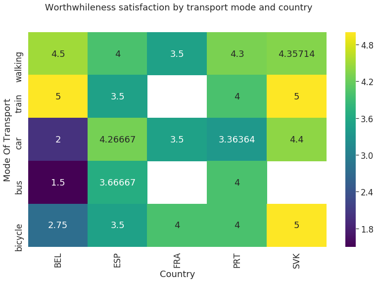


From the above plot we can observe that the most satisfied travelers are Slovakians when traveling by bicycle and train and Belgians when traveling by train.

## Other Tools

Mobility data may also contain geo-spatial information, i.e. the coordinates (latitude and longitude) of the starting and arrival points. 

#### Folium: Python library for the interactive visualization of geo-spatial data.


Read a toy dataset containing:
- Starting and arrival points coordinates of some legs;
- duration in seconds.


```
import pandas as pd
import io # To work with with stream (files)
import requests # library to make http requests

import folium

```


```
s=requests.get('https://www.dropbox.com/s/zufk87nlz216b23/coords.csv?dl=1').content
coords=pd.read_csv(io.BytesIO(s), compression=None)
coords.head(3)


```


<div>
<style scoped>
    .dataframe tbody tr th:only-of-type {
        vertical-align: middle;
    }

    .dataframe tbody tr th {
        vertical-align: top;
    }

    .dataframe thead th {
        text-align: right;
    }
</style>
<table border="1" class="dataframe">
  <thead>
    <tr style="text-align: right;">
      <th></th>
      <th>Unnamed: 0</th>
      <th>start_long</th>
      <th>start_lat</th>
      <th>end_long</th>
      <th>end_lat</th>
      <th>duration_sec</th>
    </tr>
  </thead>
  <tbody>
    <tr>
      <th>0</th>
      <td>0</td>
      <td>-73.982155</td>
      <td>40.767937</td>
      <td>-73.964630</td>
      <td>40.765602</td>
      <td>455</td>
    </tr>
    <tr>
      <th>1</th>
      <td>1</td>
      <td>-73.980415</td>
      <td>40.738564</td>
      <td>-73.999481</td>
      <td>40.731152</td>
      <td>663</td>
    </tr>
    <tr>
      <th>2</th>
      <td>2</td>
      <td>-73.979027</td>
      <td>40.763939</td>
      <td>-74.005333</td>
      <td>40.710087</td>
      <td>2124</td>
    </tr>
  </tbody>
</table>
</div>


#### Dipslay the starting latitude and longitude of each leg


```


mymap = folium.Map(location=[coords["start_lat"].mean(), coords["start_long"].mean()], zoom_start=12 )
for each in coords[:100].iterrows():
    folium.CircleMarker([each[1]['start_lat'],each[1]['start_long']],
                        radius=3,
                        color='blue',
                        popup=str('Trip duration:\n'  + str(each[1]['duration_sec']) + ' Seconds'),
                        fill_color='#FD8A6C'
                        ).add_to(mymap)
mymap
```


<div style="width:100%;"><div style="position:relative;width:100%;height:0;padding-bottom:60%;"><iframe src="data:text/html;charset=utf-8;base64,PCFET0NUWVBFIGh0bWw+CjxoZWFkPiAgICAKICAgIDxtZXRhIGh0dHAtZXF1aXY9ImNvbnRlbnQtdHlwZSIgY29udGVudD0idGV4dC9odG1sOyBjaGFyc2V0PVVURi04IiAvPgogICAgPHNjcmlwdD5MX1BSRUZFUl9DQU5WQVM9ZmFsc2U7IExfTk9fVE9VQ0g9ZmFsc2U7IExfRElTQUJMRV8zRD1mYWxzZTs8L3NjcmlwdD4KICAgIDxzY3JpcHQgc3JjPSJodHRwczovL2Nkbi5qc2RlbGl2ci5uZXQvbnBtL2xlYWZsZXRAMS40LjAvZGlzdC9sZWFmbGV0LmpzIj48L3NjcmlwdD4KICAgIDxzY3JpcHQgc3JjPSJodHRwczovL2NvZGUuanF1ZXJ5LmNvbS9qcXVlcnktMS4xMi40Lm1pbi5qcyI+PC9zY3JpcHQ+CiAgICA8c2NyaXB0IHNyYz0iaHR0cHM6Ly9tYXhjZG4uYm9vdHN0cmFwY2RuLmNvbS9ib290c3RyYXAvMy4yLjAvanMvYm9vdHN0cmFwLm1pbi5qcyI+PC9zY3JpcHQ+CiAgICA8c2NyaXB0IHNyYz0iaHR0cHM6Ly9jZG5qcy5jbG91ZGZsYXJlLmNvbS9hamF4L2xpYnMvTGVhZmxldC5hd2Vzb21lLW1hcmtlcnMvMi4wLjIvbGVhZmxldC5hd2Vzb21lLW1hcmtlcnMuanMiPjwvc2NyaXB0PgogICAgPGxpbmsgcmVsPSJzdHlsZXNoZWV0IiBocmVmPSJodHRwczovL2Nkbi5qc2RlbGl2ci5uZXQvbnBtL2xlYWZsZXRAMS40LjAvZGlzdC9sZWFmbGV0LmNzcyIvPgogICAgPGxpbmsgcmVsPSJzdHlsZXNoZWV0IiBocmVmPSJodHRwczovL21heGNkbi5ib290c3RyYXBjZG4uY29tL2Jvb3RzdHJhcC8zLjIuMC9jc3MvYm9vdHN0cmFwLm1pbi5jc3MiLz4KICAgIDxsaW5rIHJlbD0ic3R5bGVzaGVldCIgaHJlZj0iaHR0cHM6Ly9tYXhjZG4uYm9vdHN0cmFwY2RuLmNvbS9ib290c3RyYXAvMy4yLjAvY3NzL2Jvb3RzdHJhcC10aGVtZS5taW4uY3NzIi8+CiAgICA8bGluayByZWw9InN0eWxlc2hlZXQiIGhyZWY9Imh0dHBzOi8vbWF4Y2RuLmJvb3RzdHJhcGNkbi5jb20vZm9udC1hd2Vzb21lLzQuNi4zL2Nzcy9mb250LWF3ZXNvbWUubWluLmNzcyIvPgogICAgPGxpbmsgcmVsPSJzdHlsZXNoZWV0IiBocmVmPSJodHRwczovL2NkbmpzLmNsb3VkZmxhcmUuY29tL2FqYXgvbGlicy9MZWFmbGV0LmF3ZXNvbWUtbWFya2Vycy8yLjAuMi9sZWFmbGV0LmF3ZXNvbWUtbWFya2Vycy5jc3MiLz4KICAgIDxsaW5rIHJlbD0ic3R5bGVzaGVldCIgaHJlZj0iaHR0cHM6Ly9yYXdjZG4uZ2l0aGFjay5jb20vcHl0aG9uLXZpc3VhbGl6YXRpb24vZm9saXVtL21hc3Rlci9mb2xpdW0vdGVtcGxhdGVzL2xlYWZsZXQuYXdlc29tZS5yb3RhdGUuY3NzIi8+CiAgICA8c3R5bGU+aHRtbCwgYm9keSB7d2lkdGg6IDEwMCU7aGVpZ2h0OiAxMDAlO21hcmdpbjogMDtwYWRkaW5nOiAwO308L3N0eWxlPgogICAgPHN0eWxlPiNtYXAge3Bvc2l0aW9uOmFic29sdXRlO3RvcDowO2JvdHRvbTowO3JpZ2h0OjA7bGVmdDowO308L3N0eWxlPgogICAgCiAgICA8bWV0YSBuYW1lPSJ2aWV3cG9ydCIgY29udGVudD0id2lkdGg9ZGV2aWNlLXdpZHRoLAogICAgICAgIGluaXRpYWwtc2NhbGU9MS4wLCBtYXhpbXVtLXNjYWxlPTEuMCwgdXNlci1zY2FsYWJsZT1ubyIgLz4KICAgIDxzdHlsZT4jbWFwXzEzNjdjMWJhYjU1ODRhZjdiZGZkNjFjNDYyYjIwZWY5IHsKICAgICAgICBwb3NpdGlvbjogcmVsYXRpdmU7CiAgICAgICAgd2lkdGg6IDEwMC4wJTsKICAgICAgICBoZWlnaHQ6IDEwMC4wJTsKICAgICAgICBsZWZ0OiAwLjAlOwogICAgICAgIHRvcDogMC4wJTsKICAgICAgICB9CiAgICA8L3N0eWxlPgo8L2hlYWQ+Cjxib2R5PiAgICAKICAgIAogICAgPGRpdiBjbGFzcz0iZm9saXVtLW1hcCIgaWQ9Im1hcF8xMzY3YzFiYWI1NTg0YWY3YmRmZDYxYzQ2MmIyMGVmOSIgPjwvZGl2Pgo8L2JvZHk+CjxzY3JpcHQ+ICAgIAogICAgCiAgICAKICAgICAgICB2YXIgYm91bmRzID0gbnVsbDsKICAgIAoKICAgIHZhciBtYXBfMTM2N2MxYmFiNTU4NGFmN2JkZmQ2MWM0NjJiMjBlZjkgPSBMLm1hcCgKICAgICAgICAnbWFwXzEzNjdjMWJhYjU1ODRhZjdiZGZkNjFjNDYyYjIwZWY5JywgewogICAgICAgIGNlbnRlcjogWzQwLjc1MTA1Mzc5MTA0NjE0LCAtNzMuOTcyNTM0OTM0OTk3NTVdLAogICAgICAgIHpvb206IDEyLAogICAgICAgIG1heEJvdW5kczogYm91bmRzLAogICAgICAgIGxheWVyczogW10sCiAgICAgICAgd29ybGRDb3B5SnVtcDogZmFsc2UsCiAgICAgICAgY3JzOiBMLkNSUy5FUFNHMzg1NywKICAgICAgICB6b29tQ29udHJvbDogdHJ1ZSwKICAgICAgICB9KTsKCgogICAgCiAgICB2YXIgdGlsZV9sYXllcl9iOTdhMTQzMmFlZTA0YzBmOGU3OTMzZDcwYTI2NmNlMyA9IEwudGlsZUxheWVyKAogICAgICAgICdodHRwczovL3tzfS50aWxlLm9wZW5zdHJlZXRtYXAub3JnL3t6fS97eH0ve3l9LnBuZycsCiAgICAgICAgewogICAgICAgICJhdHRyaWJ1dGlvbiI6IG51bGwsCiAgICAgICAgImRldGVjdFJldGluYSI6IGZhbHNlLAogICAgICAgICJtYXhOYXRpdmVab29tIjogMTgsCiAgICAgICAgIm1heFpvb20iOiAxOCwKICAgICAgICAibWluWm9vbSI6IDAsCiAgICAgICAgIm5vV3JhcCI6IGZhbHNlLAogICAgICAgICJvcGFjaXR5IjogMSwKICAgICAgICAic3ViZG9tYWlucyI6ICJhYmMiLAogICAgICAgICJ0bXMiOiBmYWxzZQp9KS5hZGRUbyhtYXBfMTM2N2MxYmFiNTU4NGFmN2JkZmQ2MWM0NjJiMjBlZjkpOwogICAgCiAgICAgICAgICAgIHZhciBjaXJjbGVfbWFya2VyX2YxNzc4ZTNjZmY2ODQwOWU5N2UxZTY2ODc4YTQ2YTE0ID0gTC5jaXJjbGVNYXJrZXIoCiAgICAgICAgICAgICAgICBbNDAuNzY3OTM2NzA2NTQyOTcsIC03My45ODIxNTQ4NDYxOTEzOV0sCiAgICAgICAgICAgICAgICB7CiAgImJ1YmJsaW5nTW91c2VFdmVudHMiOiB0cnVlLAogICJjb2xvciI6ICJibHVlIiwKICAiZGFzaEFycmF5IjogbnVsbCwKICAiZGFzaE9mZnNldCI6IG51bGwsCiAgImZpbGwiOiB0cnVlLAogICJmaWxsQ29sb3IiOiAiI0ZEOEE2QyIsCiAgImZpbGxPcGFjaXR5IjogMC4yLAogICJmaWxsUnVsZSI6ICJldmVub2RkIiwKICAibGluZUNhcCI6ICJyb3VuZCIsCiAgImxpbmVKb2luIjogInJvdW5kIiwKICAib3BhY2l0eSI6IDEuMCwKICAicmFkaXVzIjogMywKICAic3Ryb2tlIjogdHJ1ZSwKICAid2VpZ2h0IjogMwp9CiAgICAgICAgICAgICAgICApCiAgICAgICAgICAgICAgICAuYWRkVG8obWFwXzEzNjdjMWJhYjU1ODRhZjdiZGZkNjFjNDYyYjIwZWY5KTsKICAgICAgICAgICAgCiAgICAKICAgICAgICAgICAgdmFyIHBvcHVwX2NiMzdiN2RlODVjYzRhNGFhMmQ5ZWY4YmE3OTI4NjE1ID0gTC5wb3B1cCh7bWF4V2lkdGg6ICcxMDAlJwogICAgICAgICAgICAKICAgICAgICAgICAgfSk7CgogICAgICAgICAgICAKICAgICAgICAgICAgICAgIHZhciBodG1sXzA2NGEyMDkzOGI1MTQxZTVhYmE3MDFhNWVlNGRhZmNiID0gJChgPGRpdiBpZD0iaHRtbF8wNjRhMjA5MzhiNTE0MWU1YWJhNzAxYTVlZTRkYWZjYiIgc3R5bGU9IndpZHRoOiAxMDAuMCU7IGhlaWdodDogMTAwLjAlOyI+VHJpcCBkdXJhdGlvbjogNDU1LjAgU2Vjb25kczwvZGl2PmApWzBdOwogICAgICAgICAgICAgICAgcG9wdXBfY2IzN2I3ZGU4NWNjNGE0YWEyZDllZjhiYTc5Mjg2MTUuc2V0Q29udGVudChodG1sXzA2NGEyMDkzOGI1MTQxZTVhYmE3MDFhNWVlNGRhZmNiKTsKICAgICAgICAgICAgCgogICAgICAgICAgICBjaXJjbGVfbWFya2VyX2YxNzc4ZTNjZmY2ODQwOWU5N2UxZTY2ODc4YTQ2YTE0LmJpbmRQb3B1cChwb3B1cF9jYjM3YjdkZTg1Y2M0YTRhYTJkOWVmOGJhNzkyODYxNSkKICAgICAgICAgICAgOwoKICAgICAgICAgICAgCiAgICAgICAgCiAgICAKICAgICAgICAgICAgdmFyIGNpcmNsZV9tYXJrZXJfMjQ5YTExMTQ3OTFlNDcxMGJjMDhmZmIyMTk3YTg3YjIgPSBMLmNpcmNsZU1hcmtlcigKICAgICAgICAgICAgICAgIFs0MC43Mzg1NjM1Mzc1OTc2NTYsIC03My45ODA0MTUzNDQyMzgyN10sCiAgICAgICAgICAgICAgICB7CiAgImJ1YmJsaW5nTW91c2VFdmVudHMiOiB0cnVlLAogICJjb2xvciI6ICJibHVlIiwKICAiZGFzaEFycmF5IjogbnVsbCwKICAiZGFzaE9mZnNldCI6IG51bGwsCiAgImZpbGwiOiB0cnVlLAogICJmaWxsQ29sb3IiOiAiI0ZEOEE2QyIsCiAgImZpbGxPcGFjaXR5IjogMC4yLAogICJmaWxsUnVsZSI6ICJldmVub2RkIiwKICAibGluZUNhcCI6ICJyb3VuZCIsCiAgImxpbmVKb2luIjogInJvdW5kIiwKICAib3BhY2l0eSI6IDEuMCwKICAicmFkaXVzIjogMywKICAic3Ryb2tlIjogdHJ1ZSwKICAid2VpZ2h0IjogMwp9CiAgICAgICAgICAgICAgICApCiAgICAgICAgICAgICAgICAuYWRkVG8obWFwXzEzNjdjMWJhYjU1ODRhZjdiZGZkNjFjNDYyYjIwZWY5KTsKICAgICAgICAgICAgCiAgICAKICAgICAgICAgICAgdmFyIHBvcHVwXzAyNmY1OTM5NzFlNDRmYTZhMGE0NDFlMzdiNTVhYTM3ID0gTC5wb3B1cCh7bWF4V2lkdGg6ICcxMDAlJwogICAgICAgICAgICAKICAgICAgICAgICAgfSk7CgogICAgICAgICAgICAKICAgICAgICAgICAgICAgIHZhciBodG1sX2ZmZDlmNThlYjg2ODRlYmNhZGEwY2RkMDFmMjhkMjRlID0gJChgPGRpdiBpZD0iaHRtbF9mZmQ5ZjU4ZWI4Njg0ZWJjYWRhMGNkZDAxZjI4ZDI0ZSIgc3R5bGU9IndpZHRoOiAxMDAuMCU7IGhlaWdodDogMTAwLjAlOyI+VHJpcCBkdXJhdGlvbjogNjYzLjAgU2Vjb25kczwvZGl2PmApWzBdOwogICAgICAgICAgICAgICAgcG9wdXBfMDI2ZjU5Mzk3MWU0NGZhNmEwYTQ0MWUzN2I1NWFhMzcuc2V0Q29udGVudChodG1sX2ZmZDlmNThlYjg2ODRlYmNhZGEwY2RkMDFmMjhkMjRlKTsKICAgICAgICAgICAgCgogICAgICAgICAgICBjaXJjbGVfbWFya2VyXzI0OWExMTE0NzkxZTQ3MTBiYzA4ZmZiMjE5N2E4N2IyLmJpbmRQb3B1cChwb3B1cF8wMjZmNTkzOTcxZTQ0ZmE2YTBhNDQxZTM3YjU1YWEzNykKICAgICAgICAgICAgOwoKICAgICAgICAgICAgCiAgICAgICAgCiAgICAKICAgICAgICAgICAgdmFyIGNpcmNsZV9tYXJrZXJfMmZkY2MxMzU0MWU4NDY5YThhODE3MWMxODRkMmM3NDMgPSBMLmNpcmNsZU1hcmtlcigKICAgICAgICAgICAgICAgIFs0MC43NjM5Mzg5MDM4MDg1OTQsIC03My45NzkwMjY3OTQ0MzM1OF0sCiAgICAgICAgICAgICAgICB7CiAgImJ1YmJsaW5nTW91c2VFdmVudHMiOiB0cnVlLAogICJjb2xvciI6ICJibHVlIiwKICAiZGFzaEFycmF5IjogbnVsbCwKICAiZGFzaE9mZnNldCI6IG51bGwsCiAgImZpbGwiOiB0cnVlLAogICJmaWxsQ29sb3IiOiAiI0ZEOEE2QyIsCiAgImZpbGxPcGFjaXR5IjogMC4yLAogICJmaWxsUnVsZSI6ICJldmVub2RkIiwKICAibGluZUNhcCI6ICJyb3VuZCIsCiAgImxpbmVKb2luIjogInJvdW5kIiwKICAib3BhY2l0eSI6IDEuMCwKICAicmFkaXVzIjogMywKICAic3Ryb2tlIjogdHJ1ZSwKICAid2VpZ2h0IjogMwp9CiAgICAgICAgICAgICAgICApCiAgICAgICAgICAgICAgICAuYWRkVG8obWFwXzEzNjdjMWJhYjU1ODRhZjdiZGZkNjFjNDYyYjIwZWY5KTsKICAgICAgICAgICAgCiAgICAKICAgICAgICAgICAgdmFyIHBvcHVwXzMzZjUxNmE1ODc1NTQ5Yjc5MjkzY2YxMDI2MGViM2Y3ID0gTC5wb3B1cCh7bWF4V2lkdGg6ICcxMDAlJwogICAgICAgICAgICAKICAgICAgICAgICAgfSk7CgogICAgICAgICAgICAKICAgICAgICAgICAgICAgIHZhciBodG1sX2FkMWUyNWFlNWM0NDQ5YjQ5NDZmNGYyMjcwMDc1YzFhID0gJChgPGRpdiBpZD0iaHRtbF9hZDFlMjVhZTVjNDQ0OWI0OTQ2ZjRmMjI3MDA3NWMxYSIgc3R5bGU9IndpZHRoOiAxMDAuMCU7IGhlaWdodDogMTAwLjAlOyI+VHJpcCBkdXJhdGlvbjogMjEyNC4wIFNlY29uZHM8L2Rpdj5gKVswXTsKICAgICAgICAgICAgICAgIHBvcHVwXzMzZjUxNmE1ODc1NTQ5Yjc5MjkzY2YxMDI2MGViM2Y3LnNldENvbnRlbnQoaHRtbF9hZDFlMjVhZTVjNDQ0OWI0OTQ2ZjRmMjI3MDA3NWMxYSk7CiAgICAgICAgICAgIAoKICAgICAgICAgICAgY2lyY2xlX21hcmtlcl8yZmRjYzEzNTQxZTg0NjlhOGE4MTcxYzE4NGQyYzc0My5iaW5kUG9wdXAocG9wdXBfMzNmNTE2YTU4NzU1NDliNzkyOTNjZjEwMjYwZWIzZjcpCiAgICAgICAgICAgIDsKCiAgICAgICAgICAgIAogICAgICAgIAogICAgCiAgICAgICAgICAgIHZhciBjaXJjbGVfbWFya2VyX2E1MDY3ZWE3Y2M2YzRkY2ZiODU1YzJlZTNkOTQ1NzA5ID0gTC5jaXJjbGVNYXJrZXIoCiAgICAgICAgICAgICAgICBbNDAuNzE5OTcwNzAzMTI1LCAtNzQuMDEwMDQwMjgzMjAzMTJdLAogICAgICAgICAgICAgICAgewogICJidWJibGluZ01vdXNlRXZlbnRzIjogdHJ1ZSwKICAiY29sb3IiOiAiYmx1ZSIsCiAgImRhc2hBcnJheSI6IG51bGwsCiAgImRhc2hPZmZzZXQiOiBudWxsLAogICJmaWxsIjogdHJ1ZSwKICAiZmlsbENvbG9yIjogIiNGRDhBNkMiLAogICJmaWxsT3BhY2l0eSI6IDAuMiwKICAiZmlsbFJ1bGUiOiAiZXZlbm9kZCIsCiAgImxpbmVDYXAiOiAicm91bmQiLAogICJsaW5lSm9pbiI6ICJyb3VuZCIsCiAgIm9wYWNpdHkiOiAxLjAsCiAgInJhZGl1cyI6IDMsCiAgInN0cm9rZSI6IHRydWUsCiAgIndlaWdodCI6IDMKfQogICAgICAgICAgICAgICAgKQogICAgICAgICAgICAgICAgLmFkZFRvKG1hcF8xMzY3YzFiYWI1NTg0YWY3YmRmZDYxYzQ2MmIyMGVmOSk7CiAgICAgICAgICAgIAogICAgCiAgICAgICAgICAgIHZhciBwb3B1cF8xN2M2MjVjOTI3NjM0ODU0ODljYWE3MTk5NGI0OTI4ZSA9IEwucG9wdXAoe21heFdpZHRoOiAnMTAwJScKICAgICAgICAgICAgCiAgICAgICAgICAgIH0pOwoKICAgICAgICAgICAgCiAgICAgICAgICAgICAgICB2YXIgaHRtbF84ZWY0NDJiNmEyZjA0YzZjOGVjMTljZjc4MTIyZTA2YSA9ICQoYDxkaXYgaWQ9Imh0bWxfOGVmNDQyYjZhMmYwNGM2YzhlYzE5Y2Y3ODEyMmUwNmEiIHN0eWxlPSJ3aWR0aDogMTAwLjAlOyBoZWlnaHQ6IDEwMC4wJTsiPlRyaXAgZHVyYXRpb246IDQyOS4wIFNlY29uZHM8L2Rpdj5gKVswXTsKICAgICAgICAgICAgICAgIHBvcHVwXzE3YzYyNWM5Mjc2MzQ4NTQ4OWNhYTcxOTk0YjQ5MjhlLnNldENvbnRlbnQoaHRtbF84ZWY0NDJiNmEyZjA0YzZjOGVjMTljZjc4MTIyZTA2YSk7CiAgICAgICAgICAgIAoKICAgICAgICAgICAgY2lyY2xlX21hcmtlcl9hNTA2N2VhN2NjNmM0ZGNmYjg1NWMyZWUzZDk0NTcwOS5iaW5kUG9wdXAocG9wdXBfMTdjNjI1YzkyNzYzNDg1NDg5Y2FhNzE5OTRiNDkyOGUpCiAgICAgICAgICAgIDsKCiAgICAgICAgICAgIAogICAgICAgIAogICAgCiAgICAgICAgICAgIHZhciBjaXJjbGVfbWFya2VyXzBlNTRjNTA2MzU2ODQ2N2Y5NjgzOTE4Y2M2ZTg5NjdjID0gTC5jaXJjbGVNYXJrZXIoCiAgICAgICAgICAgICAgICBbNDAuNzkzMjA5MDc1OTI3NzMsIC03My45NzMwNTI5Nzg1MTU2Ml0sCiAgICAgICAgICAgICAgICB7CiAgImJ1YmJsaW5nTW91c2VFdmVudHMiOiB0cnVlLAogICJjb2xvciI6ICJibHVlIiwKICAiZGFzaEFycmF5IjogbnVsbCwKICAiZGFzaE9mZnNldCI6IG51bGwsCiAgImZpbGwiOiB0cnVlLAogICJmaWxsQ29sb3IiOiAiI0ZEOEE2QyIsCiAgImZpbGxPcGFjaXR5IjogMC4yLAogICJmaWxsUnVsZSI6ICJldmVub2RkIiwKICAibGluZUNhcCI6ICJyb3VuZCIsCiAgImxpbmVKb2luIjogInJvdW5kIiwKICAib3BhY2l0eSI6IDEuMCwKICAicmFkaXVzIjogMywKICAic3Ryb2tlIjogdHJ1ZSwKICAid2VpZ2h0IjogMwp9CiAgICAgICAgICAgICAgICApCiAgICAgICAgICAgICAgICAuYWRkVG8obWFwXzEzNjdjMWJhYjU1ODRhZjdiZGZkNjFjNDYyYjIwZWY5KTsKICAgICAgICAgICAgCiAgICAKICAgICAgICAgICAgdmFyIHBvcHVwX2NjNzI4YjMwMGFkNjQ1MjZiMGQ5N2NmODJjYTVjMGZkID0gTC5wb3B1cCh7bWF4V2lkdGg6ICcxMDAlJwogICAgICAgICAgICAKICAgICAgICAgICAgfSk7CgogICAgICAgICAgICAKICAgICAgICAgICAgICAgIHZhciBodG1sX2Y4MDA1NjQwNzFkOTRkYmU4MmM1OTFmYzY2MmI5MzM2ID0gJChgPGRpdiBpZD0iaHRtbF9mODAwNTY0MDcxZDk0ZGJlODJjNTkxZmM2NjJiOTMzNiIgc3R5bGU9IndpZHRoOiAxMDAuMCU7IGhlaWdodDogMTAwLjAlOyI+VHJpcCBkdXJhdGlvbjogNDM1LjAgU2Vjb25kczwvZGl2PmApWzBdOwogICAgICAgICAgICAgICAgcG9wdXBfY2M3MjhiMzAwYWQ2NDUyNmIwZDk3Y2Y4MmNhNWMwZmQuc2V0Q29udGVudChodG1sX2Y4MDA1NjQwNzFkOTRkYmU4MmM1OTFmYzY2MmI5MzM2KTsKICAgICAgICAgICAgCgogICAgICAgICAgICBjaXJjbGVfbWFya2VyXzBlNTRjNTA2MzU2ODQ2N2Y5NjgzOTE4Y2M2ZTg5NjdjLmJpbmRQb3B1cChwb3B1cF9jYzcyOGIzMDBhZDY0NTI2YjBkOTdjZjgyY2E1YzBmZCkKICAgICAgICAgICAgOwoKICAgICAgICAgICAgCiAgICAgICAgCiAgICAKICAgICAgICAgICAgdmFyIGNpcmNsZV9tYXJrZXJfODJkZDRlNmY5ZmQ5NDUxNWFjZGY2MDU3MmU4N2VjOWUgPSBMLmNpcmNsZU1hcmtlcigKICAgICAgICAgICAgICAgIFs0MC43NDIxOTUxMjkzOTQ1MywgLTczLjk4Mjg1Njc1MDQ4ODNdLAogICAgICAgICAgICAgICAgewogICJidWJibGluZ01vdXNlRXZlbnRzIjogdHJ1ZSwKICAiY29sb3IiOiAiYmx1ZSIsCiAgImRhc2hBcnJheSI6IG51bGwsCiAgImRhc2hPZmZzZXQiOiBudWxsLAogICJmaWxsIjogdHJ1ZSwKICAiZmlsbENvbG9yIjogIiNGRDhBNkMiLAogICJmaWxsT3BhY2l0eSI6IDAuMiwKICAiZmlsbFJ1bGUiOiAiZXZlbm9kZCIsCiAgImxpbmVDYXAiOiAicm91bmQiLAogICJsaW5lSm9pbiI6ICJyb3VuZCIsCiAgIm9wYWNpdHkiOiAxLjAsCiAgInJhZGl1cyI6IDMsCiAgInN0cm9rZSI6IHRydWUsCiAgIndlaWdodCI6IDMKfQogICAgICAgICAgICAgICAgKQogICAgICAgICAgICAgICAgLmFkZFRvKG1hcF8xMzY3YzFiYWI1NTg0YWY3YmRmZDYxYzQ2MmIyMGVmOSk7CiAgICAgICAgICAgIAogICAgCiAgICAgICAgICAgIHZhciBwb3B1cF80MGZlYzVkZjgzNmU0OGEwYjQ0MmE0YzNmMmNlM2E0OSA9IEwucG9wdXAoe21heFdpZHRoOiAnMTAwJScKICAgICAgICAgICAgCiAgICAgICAgICAgIH0pOwoKICAgICAgICAgICAgCiAgICAgICAgICAgICAgICB2YXIgaHRtbF9lMGMxNDQ4NDM5OGI0YzY4ODY3YmY1M2I1MjZiMDg0NSA9ICQoYDxkaXYgaWQ9Imh0bWxfZTBjMTQ0ODQzOThiNGM2ODg2N2JmNTNiNTI2YjA4NDUiIHN0eWxlPSJ3aWR0aDogMTAwLjAlOyBoZWlnaHQ6IDEwMC4wJTsiPlRyaXAgZHVyYXRpb246IDQ0My4wIFNlY29uZHM8L2Rpdj5gKVswXTsKICAgICAgICAgICAgICAgIHBvcHVwXzQwZmVjNWRmODM2ZTQ4YTBiNDQyYTRjM2YyY2UzYTQ5LnNldENvbnRlbnQoaHRtbF9lMGMxNDQ4NDM5OGI0YzY4ODY3YmY1M2I1MjZiMDg0NSk7CiAgICAgICAgICAgIAoKICAgICAgICAgICAgY2lyY2xlX21hcmtlcl84MmRkNGU2ZjlmZDk0NTE1YWNkZjYwNTcyZTg3ZWM5ZS5iaW5kUG9wdXAocG9wdXBfNDBmZWM1ZGY4MzZlNDhhMGI0NDJhNGMzZjJjZTNhNDkpCiAgICAgICAgICAgIDsKCiAgICAgICAgICAgIAogICAgICAgIAogICAgCiAgICAgICAgICAgIHZhciBjaXJjbGVfbWFya2VyX2M1NjU3NDY3OTE0YzRmNmQ5ZjU2ZDI4OGRhN2U3MmQ5ID0gTC5jaXJjbGVNYXJrZXIoCiAgICAgICAgICAgICAgICBbNDAuNzU3ODM5MjAyODgwODUsIC03My45NjkwMTcwMjg4MDg2XSwKICAgICAgICAgICAgICAgIHsKICAiYnViYmxpbmdNb3VzZUV2ZW50cyI6IHRydWUsCiAgImNvbG9yIjogImJsdWUiLAogICJkYXNoQXJyYXkiOiBudWxsLAogICJkYXNoT2Zmc2V0IjogbnVsbCwKICAiZmlsbCI6IHRydWUsCiAgImZpbGxDb2xvciI6ICIjRkQ4QTZDIiwKICAiZmlsbE9wYWNpdHkiOiAwLjIsCiAgImZpbGxSdWxlIjogImV2ZW5vZGQiLAogICJsaW5lQ2FwIjogInJvdW5kIiwKICAibGluZUpvaW4iOiAicm91bmQiLAogICJvcGFjaXR5IjogMS4wLAogICJyYWRpdXMiOiAzLAogICJzdHJva2UiOiB0cnVlLAogICJ3ZWlnaHQiOiAzCn0KICAgICAgICAgICAgICAgICkKICAgICAgICAgICAgICAgIC5hZGRUbyhtYXBfMTM2N2MxYmFiNTU4NGFmN2JkZmQ2MWM0NjJiMjBlZjkpOwogICAgICAgICAgICAKICAgIAogICAgICAgICAgICB2YXIgcG9wdXBfMTg2NTk0MjljODYyNGE5ZGEwZjRlZjU5YWNjMThlOTUgPSBMLnBvcHVwKHttYXhXaWR0aDogJzEwMCUnCiAgICAgICAgICAgIAogICAgICAgICAgICB9KTsKCiAgICAgICAgICAgIAogICAgICAgICAgICAgICAgdmFyIGh0bWxfN2RiNGM3ZjIxZmYyNGUyN2EwZDQ2NmRjNzlmMjcwNGIgPSAkKGA8ZGl2IGlkPSJodG1sXzdkYjRjN2YyMWZmMjRlMjdhMGQ0NjZkYzc5ZjI3MDRiIiBzdHlsZT0id2lkdGg6IDEwMC4wJTsgaGVpZ2h0OiAxMDAuMCU7Ij5UcmlwIGR1cmF0aW9uOiAzNDEuMCBTZWNvbmRzPC9kaXY+YClbMF07CiAgICAgICAgICAgICAgICBwb3B1cF8xODY1OTQyOWM4NjI0YTlkYTBmNGVmNTlhY2MxOGU5NS5zZXRDb250ZW50KGh0bWxfN2RiNGM3ZjIxZmYyNGUyN2EwZDQ2NmRjNzlmMjcwNGIpOwogICAgICAgICAgICAKCiAgICAgICAgICAgIGNpcmNsZV9tYXJrZXJfYzU2NTc0Njc5MTRjNGY2ZDlmNTZkMjg4ZGE3ZTcyZDkuYmluZFBvcHVwKHBvcHVwXzE4NjU5NDI5Yzg2MjRhOWRhMGY0ZWY1OWFjYzE4ZTk1KQogICAgICAgICAgICA7CgogICAgICAgICAgICAKICAgICAgICAKICAgIAogICAgICAgICAgICB2YXIgY2lyY2xlX21hcmtlcl84YmU4NWVhNDgwYWE0MTMxYjc3ZjhlM2YxNGE0MjliZSA9IEwuY2lyY2xlTWFya2VyKAogICAgICAgICAgICAgICAgWzQwLjc5Nzc3OTA4MzI1MTk1LCAtNzMuOTY5Mjc2NDI4MjIyNjZdLAogICAgICAgICAgICAgICAgewogICJidWJibGluZ01vdXNlRXZlbnRzIjogdHJ1ZSwKICAiY29sb3IiOiAiYmx1ZSIsCiAgImRhc2hBcnJheSI6IG51bGwsCiAgImRhc2hPZmZzZXQiOiBudWxsLAogICJmaWxsIjogdHJ1ZSwKICAiZmlsbENvbG9yIjogIiNGRDhBNkMiLAogICJmaWxsT3BhY2l0eSI6IDAuMiwKICAiZmlsbFJ1bGUiOiAiZXZlbm9kZCIsCiAgImxpbmVDYXAiOiAicm91bmQiLAogICJsaW5lSm9pbiI6ICJyb3VuZCIsCiAgIm9wYWNpdHkiOiAxLjAsCiAgInJhZGl1cyI6IDMsCiAgInN0cm9rZSI6IHRydWUsCiAgIndlaWdodCI6IDMKfQogICAgICAgICAgICAgICAgKQogICAgICAgICAgICAgICAgLmFkZFRvKG1hcF8xMzY3YzFiYWI1NTg0YWY3YmRmZDYxYzQ2MmIyMGVmOSk7CiAgICAgICAgICAgIAogICAgCiAgICAgICAgICAgIHZhciBwb3B1cF8xMzVkZjlkYmYwYzc0ZjMyYmEwOTkwNDhhZjNlNjAzMyA9IEwucG9wdXAoe21heFdpZHRoOiAnMTAwJScKICAgICAgICAgICAgCiAgICAgICAgICAgIH0pOwoKICAgICAgICAgICAgCiAgICAgICAgICAgICAgICB2YXIgaHRtbF9iY2M2MjQyYWMxMGM0ZTMwOGIwMjBjN2IzMmYzMjkzMyA9ICQoYDxkaXYgaWQ9Imh0bWxfYmNjNjI0MmFjMTBjNGUzMDhiMDIwYzdiMzJmMzI5MzMiIHN0eWxlPSJ3aWR0aDogMTAwLjAlOyBoZWlnaHQ6IDEwMC4wJTsiPlRyaXAgZHVyYXRpb246IDE1NTEuMCBTZWNvbmRzPC9kaXY+YClbMF07CiAgICAgICAgICAgICAgICBwb3B1cF8xMzVkZjlkYmYwYzc0ZjMyYmEwOTkwNDhhZjNlNjAzMy5zZXRDb250ZW50KGh0bWxfYmNjNjI0MmFjMTBjNGUzMDhiMDIwYzdiMzJmMzI5MzMpOwogICAgICAgICAgICAKCiAgICAgICAgICAgIGNpcmNsZV9tYXJrZXJfOGJlODVlYTQ4MGFhNDEzMWI3N2Y4ZTNmMTRhNDI5YmUuYmluZFBvcHVwKHBvcHVwXzEzNWRmOWRiZjBjNzRmMzJiYTA5OTA0OGFmM2U2MDMzKQogICAgICAgICAgICA7CgogICAgICAgICAgICAKICAgICAgICAKICAgIAogICAgICAgICAgICB2YXIgY2lyY2xlX21hcmtlcl9mMzljMDQ0NGZkZGQ0MzI1OGI4NDI2YjBlZDE1NzJlYiA9IEwuY2lyY2xlTWFya2VyKAogICAgICAgICAgICAgICAgWzQwLjczODM5OTUwNTYxNTIzLCAtNzMuOTk5NDgxMjAxMTcxODhdLAogICAgICAgICAgICAgICAgewogICJidWJibGluZ01vdXNlRXZlbnRzIjogdHJ1ZSwKICAiY29sb3IiOiAiYmx1ZSIsCiAgImRhc2hBcnJheSI6IG51bGwsCiAgImRhc2hPZmZzZXQiOiBudWxsLAogICJmaWxsIjogdHJ1ZSwKICAiZmlsbENvbG9yIjogIiNGRDhBNkMiLAogICJmaWxsT3BhY2l0eSI6IDAuMiwKICAiZmlsbFJ1bGUiOiAiZXZlbm9kZCIsCiAgImxpbmVDYXAiOiAicm91bmQiLAogICJsaW5lSm9pbiI6ICJyb3VuZCIsCiAgIm9wYWNpdHkiOiAxLjAsCiAgInJhZGl1cyI6IDMsCiAgInN0cm9rZSI6IHRydWUsCiAgIndlaWdodCI6IDMKfQogICAgICAgICAgICAgICAgKQogICAgICAgICAgICAgICAgLmFkZFRvKG1hcF8xMzY3YzFiYWI1NTg0YWY3YmRmZDYxYzQ2MmIyMGVmOSk7CiAgICAgICAgICAgIAogICAgCiAgICAgICAgICAgIHZhciBwb3B1cF85MTMwMzI2ZGZmMDY0NTdkOWI5NjkwMTQ4YzBkZjY5ZSA9IEwucG9wdXAoe21heFdpZHRoOiAnMTAwJScKICAgICAgICAgICAgCiAgICAgICAgICAgIH0pOwoKICAgICAgICAgICAgCiAgICAgICAgICAgICAgICB2YXIgaHRtbF9jMGYzNjBkZThlNDI0ZDBjODc3MmNkMTkwYjdiZTMyZCA9ICQoYDxkaXYgaWQ9Imh0bWxfYzBmMzYwZGU4ZTQyNGQwYzg3NzJjZDE5MGI3YmUzMmQiIHN0eWxlPSJ3aWR0aDogMTAwLjAlOyBoZWlnaHQ6IDEwMC4wJTsiPlRyaXAgZHVyYXRpb246IDI1NS4wIFNlY29uZHM8L2Rpdj5gKVswXTsKICAgICAgICAgICAgICAgIHBvcHVwXzkxMzAzMjZkZmYwNjQ1N2Q5Yjk2OTAxNDhjMGRmNjllLnNldENvbnRlbnQoaHRtbF9jMGYzNjBkZThlNDI0ZDBjODc3MmNkMTkwYjdiZTMyZCk7CiAgICAgICAgICAgIAoKICAgICAgICAgICAgY2lyY2xlX21hcmtlcl9mMzljMDQ0NGZkZGQ0MzI1OGI4NDI2YjBlZDE1NzJlYi5iaW5kUG9wdXAocG9wdXBfOTEzMDMyNmRmZjA2NDU3ZDliOTY5MDE0OGMwZGY2OWUpCiAgICAgICAgICAgIDsKCiAgICAgICAgICAgIAogICAgICAgIAogICAgCiAgICAgICAgICAgIHZhciBjaXJjbGVfbWFya2VyXzMwZTg3OTY1MmZmMzRkMWJiOTM1OTgzYzEwOGI1MjNkID0gTC5jaXJjbGVNYXJrZXIoCiAgICAgICAgICAgICAgICBbNDAuNzQ0MzM4OTg5MjU3ODEsIC03My45ODEwNDg1ODM5ODQzOF0sCiAgICAgICAgICAgICAgICB7CiAgImJ1YmJsaW5nTW91c2VFdmVudHMiOiB0cnVlLAogICJjb2xvciI6ICJibHVlIiwKICAiZGFzaEFycmF5IjogbnVsbCwKICAiZGFzaE9mZnNldCI6IG51bGwsCiAgImZpbGwiOiB0cnVlLAogICJmaWxsQ29sb3IiOiAiI0ZEOEE2QyIsCiAgImZpbGxPcGFjaXR5IjogMC4yLAogICJmaWxsUnVsZSI6ICJldmVub2RkIiwKICAibGluZUNhcCI6ICJyb3VuZCIsCiAgImxpbmVKb2luIjogInJvdW5kIiwKICAib3BhY2l0eSI6IDEuMCwKICAicmFkaXVzIjogMywKICAic3Ryb2tlIjogdHJ1ZSwKICAid2VpZ2h0IjogMwp9CiAgICAgICAgICAgICAgICApCiAgICAgICAgICAgICAgICAuYWRkVG8obWFwXzEzNjdjMWJhYjU1ODRhZjdiZGZkNjFjNDYyYjIwZWY5KTsKICAgICAgICAgICAgCiAgICAKICAgICAgICAgICAgdmFyIHBvcHVwXzMyNzIyMzMyOTdiNDRmMzg4ZGQyNjgzMjVhNGFiZTI2ID0gTC5wb3B1cCh7bWF4V2lkdGg6ICcxMDAlJwogICAgICAgICAgICAKICAgICAgICAgICAgfSk7CgogICAgICAgICAgICAKICAgICAgICAgICAgICAgIHZhciBodG1sXzcyZDU2YTNhMWM3YzQ5YmI5OWMyOWNmNWQyOTM0ZDg0ID0gJChgPGRpdiBpZD0iaHRtbF83MmQ1NmEzYTFjN2M0OWJiOTljMjljZjVkMjkzNGQ4NCIgc3R5bGU9IndpZHRoOiAxMDAuMCU7IGhlaWdodDogMTAwLjAlOyI+VHJpcCBkdXJhdGlvbjogMTIyNS4wIFNlY29uZHM8L2Rpdj5gKVswXTsKICAgICAgICAgICAgICAgIHBvcHVwXzMyNzIyMzMyOTdiNDRmMzg4ZGQyNjgzMjVhNGFiZTI2LnNldENvbnRlbnQoaHRtbF83MmQ1NmEzYTFjN2M0OWJiOTljMjljZjVkMjkzNGQ4NCk7CiAgICAgICAgICAgIAoKICAgICAgICAgICAgY2lyY2xlX21hcmtlcl8zMGU4Nzk2NTJmZjM0ZDFiYjkzNTk4M2MxMDhiNTIzZC5iaW5kUG9wdXAocG9wdXBfMzI3MjIzMzI5N2I0NGYzODhkZDI2ODMyNWE0YWJlMjYpCiAgICAgICAgICAgIDsKCiAgICAgICAgICAgIAogICAgICAgIAogICAgCiAgICAgICAgICAgIHZhciBjaXJjbGVfbWFya2VyX2NmYTI2NjM4ZmYwZjQwNzU5ZTAyMzA3ODIzMDA3MzAyID0gTC5jaXJjbGVNYXJrZXIoCiAgICAgICAgICAgICAgICBbNDAuNzYzODM5NzIxNjc5NjksIC03My45ODI2NTA3NTY4MzU5NF0sCiAgICAgICAgICAgICAgICB7CiAgImJ1YmJsaW5nTW91c2VFdmVudHMiOiB0cnVlLAogICJjb2xvciI6ICJibHVlIiwKICAiZGFzaEFycmF5IjogbnVsbCwKICAiZGFzaE9mZnNldCI6IG51bGwsCiAgImZpbGwiOiB0cnVlLAogICJmaWxsQ29sb3IiOiAiI0ZEOEE2QyIsCiAgImZpbGxPcGFjaXR5IjogMC4yLAogICJmaWxsUnVsZSI6ICJldmVub2RkIiwKICAibGluZUNhcCI6ICJyb3VuZCIsCiAgImxpbmVKb2luIjogInJvdW5kIiwKICAib3BhY2l0eSI6IDEuMCwKICAicmFkaXVzIjogMywKICAic3Ryb2tlIjogdHJ1ZSwKICAid2VpZ2h0IjogMwp9CiAgICAgICAgICAgICAgICApCiAgICAgICAgICAgICAgICAuYWRkVG8obWFwXzEzNjdjMWJhYjU1ODRhZjdiZGZkNjFjNDYyYjIwZWY5KTsKICAgICAgICAgICAgCiAgICAKICAgICAgICAgICAgdmFyIHBvcHVwX2Q0MTMzYTJlMzBkNTQ2YzY4ZDZjNGNlOWIyZmRhNWFkID0gTC5wb3B1cCh7bWF4V2lkdGg6ICcxMDAlJwogICAgICAgICAgICAKICAgICAgICAgICAgfSk7CgogICAgICAgICAgICAKICAgICAgICAgICAgICAgIHZhciBodG1sX2M2ZmE0NDFiNjk0ZTRlMDVhZjRmNGU5ZDVjMjYwOTEzID0gJChgPGRpdiBpZD0iaHRtbF9jNmZhNDQxYjY5NGU0ZTA1YWY0ZjRlOWQ1YzI2MDkxMyIgc3R5bGU9IndpZHRoOiAxMDAuMCU7IGhlaWdodDogMTAwLjAlOyI+VHJpcCBkdXJhdGlvbjogMTI3NC4wIFNlY29uZHM8L2Rpdj5gKVswXTsKICAgICAgICAgICAgICAgIHBvcHVwX2Q0MTMzYTJlMzBkNTQ2YzY4ZDZjNGNlOWIyZmRhNWFkLnNldENvbnRlbnQoaHRtbF9jNmZhNDQxYjY5NGU0ZTA1YWY0ZjRlOWQ1YzI2MDkxMyk7CiAgICAgICAgICAgIAoKICAgICAgICAgICAgY2lyY2xlX21hcmtlcl9jZmEyNjYzOGZmMGY0MDc1OWUwMjMwNzgyMzAwNzMwMi5iaW5kUG9wdXAocG9wdXBfZDQxMzNhMmUzMGQ1NDZjNjhkNmM0Y2U5YjJmZGE1YWQpCiAgICAgICAgICAgIDsKCiAgICAgICAgICAgIAogICAgICAgIAogICAgCiAgICAgICAgICAgIHZhciBjaXJjbGVfbWFya2VyX2YyYWRkNjczNzY5YzRkOTdhYjRlN2I5NDhmZjZkZmNmID0gTC5jaXJjbGVNYXJrZXIoCiAgICAgICAgICAgICAgICBbNDAuNzQ5NDM5MjM5NTAxOTUsIC03My45OTE1MzEzNzIwNzAzXSwKICAgICAgICAgICAgICAgIHsKICAiYnViYmxpbmdNb3VzZUV2ZW50cyI6IHRydWUsCiAgImNvbG9yIjogImJsdWUiLAogICJkYXNoQXJyYXkiOiBudWxsLAogICJkYXNoT2Zmc2V0IjogbnVsbCwKICAiZmlsbCI6IHRydWUsCiAgImZpbGxDb2xvciI6ICIjRkQ4QTZDIiwKICAiZmlsbE9wYWNpdHkiOiAwLjIsCiAgImZpbGxSdWxlIjogImV2ZW5vZGQiLAogICJsaW5lQ2FwIjogInJvdW5kIiwKICAibGluZUpvaW4iOiAicm91bmQiLAogICJvcGFjaXR5IjogMS4wLAogICJyYWRpdXMiOiAzLAogICJzdHJva2UiOiB0cnVlLAogICJ3ZWlnaHQiOiAzCn0KICAgICAgICAgICAgICAgICkKICAgICAgICAgICAgICAgIC5hZGRUbyhtYXBfMTM2N2MxYmFiNTU4NGFmN2JkZmQ2MWM0NjJiMjBlZjkpOwogICAgICAgICAgICAKICAgIAogICAgICAgICAgICB2YXIgcG9wdXBfYjgyOWY5NDViNzljNDFkMDg1NDM0ZjgxY2U5ZDI2YWQgPSBMLnBvcHVwKHttYXhXaWR0aDogJzEwMCUnCiAgICAgICAgICAgIAogICAgICAgICAgICB9KTsKCiAgICAgICAgICAgIAogICAgICAgICAgICAgICAgdmFyIGh0bWxfNzg4NTQzMTQyMDlmNGI4N2IwYzQ2ZmM0MmZiNzFlMTYgPSAkKGA8ZGl2IGlkPSJodG1sXzc4ODU0MzE0MjA5ZjRiODdiMGM0NmZjNDJmYjcxZTE2IiBzdHlsZT0id2lkdGg6IDEwMC4wJTsgaGVpZ2h0OiAxMDAuMCU7Ij5UcmlwIGR1cmF0aW9uOiAxMTI4LjAgU2Vjb25kczwvZGl2PmApWzBdOwogICAgICAgICAgICAgICAgcG9wdXBfYjgyOWY5NDViNzljNDFkMDg1NDM0ZjgxY2U5ZDI2YWQuc2V0Q29udGVudChodG1sXzc4ODU0MzE0MjA5ZjRiODdiMGM0NmZjNDJmYjcxZTE2KTsKICAgICAgICAgICAgCgogICAgICAgICAgICBjaXJjbGVfbWFya2VyX2YyYWRkNjczNzY5YzRkOTdhYjRlN2I5NDhmZjZkZmNmLmJpbmRQb3B1cChwb3B1cF9iODI5Zjk0NWI3OWM0MWQwODU0MzRmODFjZTlkMjZhZCkKICAgICAgICAgICAgOwoKICAgICAgICAgICAgCiAgICAgICAgCiAgICAKICAgICAgICAgICAgdmFyIGNpcmNsZV9tYXJrZXJfNjU5OTdhMDEzMTE1NDJlMWI4NWFlMjgwMGU4Mzg4YTEgPSBMLmNpcmNsZU1hcmtlcigKICAgICAgICAgICAgICAgIFs0MC43NTY2Nzk1MzQ5MTIxLCAtNzMuOTYyOTgyMTc3NzM0MzhdLAogICAgICAgICAgICAgICAgewogICJidWJibGluZ01vdXNlRXZlbnRzIjogdHJ1ZSwKICAiY29sb3IiOiAiYmx1ZSIsCiAgImRhc2hBcnJheSI6IG51bGwsCiAgImRhc2hPZmZzZXQiOiBudWxsLAogICJmaWxsIjogdHJ1ZSwKICAiZmlsbENvbG9yIjogIiNGRDhBNkMiLAogICJmaWxsT3BhY2l0eSI6IDAuMiwKICAiZmlsbFJ1bGUiOiAiZXZlbm9kZCIsCiAgImxpbmVDYXAiOiAicm91bmQiLAogICJsaW5lSm9pbiI6ICJyb3VuZCIsCiAgIm9wYWNpdHkiOiAxLjAsCiAgInJhZGl1cyI6IDMsCiAgInN0cm9rZSI6IHRydWUsCiAgIndlaWdodCI6IDMKfQogICAgICAgICAgICAgICAgKQogICAgICAgICAgICAgICAgLmFkZFRvKG1hcF8xMzY3YzFiYWI1NTg0YWY3YmRmZDYxYzQ2MmIyMGVmOSk7CiAgICAgICAgICAgIAogICAgCiAgICAgICAgICAgIHZhciBwb3B1cF8xZjkzMGI3MTA2N2E0OWZhYWFmYjYyZjJiMGNhODJmZCA9IEwucG9wdXAoe21heFdpZHRoOiAnMTAwJScKICAgICAgICAgICAgCiAgICAgICAgICAgIH0pOwoKICAgICAgICAgICAgCiAgICAgICAgICAgICAgICB2YXIgaHRtbF83ZjQwMDg5NWU3OWY0NjQ3YWE5NzQ4YjVjNjc1MDUwNSA9ICQoYDxkaXYgaWQ9Imh0bWxfN2Y0MDA4OTVlNzlmNDY0N2FhOTc0OGI1YzY3NTA1MDUiIHN0eWxlPSJ3aWR0aDogMTAwLjAlOyBoZWlnaHQ6IDEwMC4wJTsiPlRyaXAgZHVyYXRpb246IDExMTQuMCBTZWNvbmRzPC9kaXY+YClbMF07CiAgICAgICAgICAgICAgICBwb3B1cF8xZjkzMGI3MTA2N2E0OWZhYWFmYjYyZjJiMGNhODJmZC5zZXRDb250ZW50KGh0bWxfN2Y0MDA4OTVlNzlmNDY0N2FhOTc0OGI1YzY3NTA1MDUpOwogICAgICAgICAgICAKCiAgICAgICAgICAgIGNpcmNsZV9tYXJrZXJfNjU5OTdhMDEzMTE1NDJlMWI4NWFlMjgwMGU4Mzg4YTEuYmluZFBvcHVwKHBvcHVwXzFmOTMwYjcxMDY3YTQ5ZmFhYWZiNjJmMmIwY2E4MmZkKQogICAgICAgICAgICA7CgogICAgICAgICAgICAKICAgICAgICAKICAgIAogICAgICAgICAgICB2YXIgY2lyY2xlX21hcmtlcl8wN2JkZGIzYzUzYWY0ZWFiODY0ODA2MDY3MDYxMWZjNCA9IEwuY2lyY2xlTWFya2VyKAogICAgICAgICAgICAgICAgWzQwLjc2Nzk0MDUyMTI0MDI0LCAtNzMuOTU2MzA2NDU3NTE5NTVdLAogICAgICAgICAgICAgICAgewogICJidWJibGluZ01vdXNlRXZlbnRzIjogdHJ1ZSwKICAiY29sb3IiOiAiYmx1ZSIsCiAgImRhc2hBcnJheSI6IG51bGwsCiAgImRhc2hPZmZzZXQiOiBudWxsLAogICJmaWxsIjogdHJ1ZSwKICAiZmlsbENvbG9yIjogIiNGRDhBNkMiLAogICJmaWxsT3BhY2l0eSI6IDAuMiwKICAiZmlsbFJ1bGUiOiAiZXZlbm9kZCIsCiAgImxpbmVDYXAiOiAicm91bmQiLAogICJsaW5lSm9pbiI6ICJyb3VuZCIsCiAgIm9wYWNpdHkiOiAxLjAsCiAgInJhZGl1cyI6IDMsCiAgInN0cm9rZSI6IHRydWUsCiAgIndlaWdodCI6IDMKfQogICAgICAgICAgICAgICAgKQogICAgICAgICAgICAgICAgLmFkZFRvKG1hcF8xMzY3YzFiYWI1NTg0YWY3YmRmZDYxYzQ2MmIyMGVmOSk7CiAgICAgICAgICAgIAogICAgCiAgICAgICAgICAgIHZhciBwb3B1cF8wOTM1NjEzNDg3Mzk0Y2E3OThkZmIyZDEzYzE4MjAwOCA9IEwucG9wdXAoe21heFdpZHRoOiAnMTAwJScKICAgICAgICAgICAgCiAgICAgICAgICAgIH0pOwoKICAgICAgICAgICAgCiAgICAgICAgICAgICAgICB2YXIgaHRtbF8zMjE2YzE5NWU1ZDA0OWIxYTMxOTg2YzBhOWYwNzI3MSA9ICQoYDxkaXYgaWQ9Imh0bWxfMzIxNmMxOTVlNWQwNDliMWEzMTk4NmMwYTlmMDcyNzEiIHN0eWxlPSJ3aWR0aDogMTAwLjAlOyBoZWlnaHQ6IDEwMC4wJTsiPlRyaXAgZHVyYXRpb246IDI2MC4wIFNlY29uZHM8L2Rpdj5gKVswXTsKICAgICAgICAgICAgICAgIHBvcHVwXzA5MzU2MTM0ODczOTRjYTc5OGRmYjJkMTNjMTgyMDA4LnNldENvbnRlbnQoaHRtbF8zMjE2YzE5NWU1ZDA0OWIxYTMxOTg2YzBhOWYwNzI3MSk7CiAgICAgICAgICAgIAoKICAgICAgICAgICAgY2lyY2xlX21hcmtlcl8wN2JkZGIzYzUzYWY0ZWFiODY0ODA2MDY3MDYxMWZjNC5iaW5kUG9wdXAocG9wdXBfMDkzNTYxMzQ4NzM5NGNhNzk4ZGZiMmQxM2MxODIwMDgpCiAgICAgICAgICAgIDsKCiAgICAgICAgICAgIAogICAgICAgIAogICAgCiAgICAgICAgICAgIHZhciBjaXJjbGVfbWFya2VyXzBkZDFlYWMxZWEyZDQxMTk4NTJhZjQxMGE0NmRiMWQwID0gTC5jaXJjbGVNYXJrZXIoCiAgICAgICAgICAgICAgICBbNDAuNzI3MjI2MjU3MzI0MjIsIC03My45OTIxOTUxMjkzOTQ1M10sCiAgICAgICAgICAgICAgICB7CiAgImJ1YmJsaW5nTW91c2VFdmVudHMiOiB0cnVlLAogICJjb2xvciI6ICJibHVlIiwKICAiZGFzaEFycmF5IjogbnVsbCwKICAiZGFzaE9mZnNldCI6IG51bGwsCiAgImZpbGwiOiB0cnVlLAogICJmaWxsQ29sb3IiOiAiI0ZEOEE2QyIsCiAgImZpbGxPcGFjaXR5IjogMC4yLAogICJmaWxsUnVsZSI6ICJldmVub2RkIiwKICAibGluZUNhcCI6ICJyb3VuZCIsCiAgImxpbmVKb2luIjogInJvdW5kIiwKICAib3BhY2l0eSI6IDEuMCwKICAicmFkaXVzIjogMywKICAic3Ryb2tlIjogdHJ1ZSwKICAid2VpZ2h0IjogMwp9CiAgICAgICAgICAgICAgICApCiAgICAgICAgICAgICAgICAuYWRkVG8obWFwXzEzNjdjMWJhYjU1ODRhZjdiZGZkNjFjNDYyYjIwZWY5KTsKICAgICAgICAgICAgCiAgICAKICAgICAgICAgICAgdmFyIHBvcHVwXzE4MTc5M2YzMmM5MjRmZTQ5YTljMzVhODlhMjVmOTQ0ID0gTC5wb3B1cCh7bWF4V2lkdGg6ICcxMDAlJwogICAgICAgICAgICAKICAgICAgICAgICAgfSk7CgogICAgICAgICAgICAKICAgICAgICAgICAgICAgIHZhciBodG1sXzc2Yjg4ZjkwZjU3ZTQ1YzE4NDYxOTI4MjMwZmNkNDZjID0gJChgPGRpdiBpZD0iaHRtbF83NmI4OGY5MGY1N2U0NWMxODQ2MTkyODIzMGZjZDQ2YyIgc3R5bGU9IndpZHRoOiAxMDAuMCU7IGhlaWdodDogMTAwLjAlOyI+VHJpcCBkdXJhdGlvbjogMTQxNC4wIFNlY29uZHM8L2Rpdj5gKVswXTsKICAgICAgICAgICAgICAgIHBvcHVwXzE4MTc5M2YzMmM5MjRmZTQ5YTljMzVhODlhMjVmOTQ0LnNldENvbnRlbnQoaHRtbF83NmI4OGY5MGY1N2U0NWMxODQ2MTkyODIzMGZjZDQ2Yyk7CiAgICAgICAgICAgIAoKICAgICAgICAgICAgY2lyY2xlX21hcmtlcl8wZGQxZWFjMWVhMmQ0MTE5ODUyYWY0MTBhNDZkYjFkMC5iaW5kUG9wdXAocG9wdXBfMTgxNzkzZjMyYzkyNGZlNDlhOWMzNWE4OWEyNWY5NDQpCiAgICAgICAgICAgIDsKCiAgICAgICAgICAgIAogICAgICAgIAogICAgCiAgICAgICAgICAgIHZhciBjaXJjbGVfbWFya2VyXzBlZmE3ZTI4YjZiYTRkZDliYTBkNzZiNDE1OTYxZDk4ID0gTC5jaXJjbGVNYXJrZXIoCiAgICAgICAgICAgICAgICBbNDAuNzY4NTkyODM0NDcyNjU2LCAtNzMuOTU1NTEzMDAwNDg4M10sCiAgICAgICAgICAgICAgICB7CiAgImJ1YmJsaW5nTW91c2VFdmVudHMiOiB0cnVlLAogICJjb2xvciI6ICJibHVlIiwKICAiZGFzaEFycmF5IjogbnVsbCwKICAiZGFzaE9mZnNldCI6IG51bGwsCiAgImZpbGwiOiB0cnVlLAogICJmaWxsQ29sb3IiOiAiI0ZEOEE2QyIsCiAgImZpbGxPcGFjaXR5IjogMC4yLAogICJmaWxsUnVsZSI6ICJldmVub2RkIiwKICAibGluZUNhcCI6ICJyb3VuZCIsCiAgImxpbmVKb2luIjogInJvdW5kIiwKICAib3BhY2l0eSI6IDEuMCwKICAicmFkaXVzIjogMywKICAic3Ryb2tlIjogdHJ1ZSwKICAid2VpZ2h0IjogMwp9CiAgICAgICAgICAgICAgICApCiAgICAgICAgICAgICAgICAuYWRkVG8obWFwXzEzNjdjMWJhYjU1ODRhZjdiZGZkNjFjNDYyYjIwZWY5KTsKICAgICAgICAgICAgCiAgICAKICAgICAgICAgICAgdmFyIHBvcHVwXzNhYzE2YWU4NWI0NzQ5YmFhOTI1ZWRlNTJmMzUyM2RiID0gTC5wb3B1cCh7bWF4V2lkdGg6ICcxMDAlJwogICAgICAgICAgICAKICAgICAgICAgICAgfSk7CgogICAgICAgICAgICAKICAgICAgICAgICAgICAgIHZhciBodG1sXzE1ZGI2ZjA1ODA0ZTRkZWY4ZDY5OGU2MTg5OGFlNDA3ID0gJChgPGRpdiBpZD0iaHRtbF8xNWRiNmYwNTgwNGU0ZGVmOGQ2OThlNjE4OThhZTQwNyIgc3R5bGU9IndpZHRoOiAxMDAuMCU7IGhlaWdodDogMTAwLjAlOyI+VHJpcCBkdXJhdGlvbjogMjExLjAgU2Vjb25kczwvZGl2PmApWzBdOwogICAgICAgICAgICAgICAgcG9wdXBfM2FjMTZhZTg1YjQ3NDliYWE5MjVlZGU1MmYzNTIzZGIuc2V0Q29udGVudChodG1sXzE1ZGI2ZjA1ODA0ZTRkZWY4ZDY5OGU2MTg5OGFlNDA3KTsKICAgICAgICAgICAgCgogICAgICAgICAgICBjaXJjbGVfbWFya2VyXzBlZmE3ZTI4YjZiYTRkZDliYTBkNzZiNDE1OTYxZDk4LmJpbmRQb3B1cChwb3B1cF8zYWMxNmFlODViNDc0OWJhYTkyNWVkZTUyZjM1MjNkYikKICAgICAgICAgICAgOwoKICAgICAgICAgICAgCiAgICAgICAgCiAgICAKICAgICAgICAgICAgdmFyIGNpcmNsZV9tYXJrZXJfZDBjNmYyM2M4MDcyNDVmYzk1YjBkMTNmZjc3OTQyMDcgPSBMLmNpcmNsZU1hcmtlcigKICAgICAgICAgICAgICAgIFs0MC43NTU1NjE4Mjg2MTMyOCwgLTczLjk5MTE2NTE2MTEzMjgxXSwKICAgICAgICAgICAgICAgIHsKICAiYnViYmxpbmdNb3VzZUV2ZW50cyI6IHRydWUsCiAgImNvbG9yIjogImJsdWUiLAogICJkYXNoQXJyYXkiOiBudWxsLAogICJkYXNoT2Zmc2V0IjogbnVsbCwKICAiZmlsbCI6IHRydWUsCiAgImZpbGxDb2xvciI6ICIjRkQ4QTZDIiwKICAiZmlsbE9wYWNpdHkiOiAwLjIsCiAgImZpbGxSdWxlIjogImV2ZW5vZGQiLAogICJsaW5lQ2FwIjogInJvdW5kIiwKICAibGluZUpvaW4iOiAicm91bmQiLAogICJvcGFjaXR5IjogMS4wLAogICJyYWRpdXMiOiAzLAogICJzdHJva2UiOiB0cnVlLAogICJ3ZWlnaHQiOiAzCn0KICAgICAgICAgICAgICAgICkKICAgICAgICAgICAgICAgIC5hZGRUbyhtYXBfMTM2N2MxYmFiNTU4NGFmN2JkZmQ2MWM0NjJiMjBlZjkpOwogICAgICAgICAgICAKICAgIAogICAgICAgICAgICB2YXIgcG9wdXBfYTI3ZWQwZjgyNzBiNDI2MWJmMWU4NWUyZjc1NzM2YzcgPSBMLnBvcHVwKHttYXhXaWR0aDogJzEwMCUnCiAgICAgICAgICAgIAogICAgICAgICAgICB9KTsKCiAgICAgICAgICAgIAogICAgICAgICAgICAgICAgdmFyIGh0bWxfYTMyNTI4ZjU2NDA0NDFjMWI0OTc3ZjAxZDBiOWZlMTkgPSAkKGA8ZGl2IGlkPSJodG1sX2EzMjUyOGY1NjQwNDQxYzFiNDk3N2YwMWQwYjlmZTE5IiBzdHlsZT0id2lkdGg6IDEwMC4wJTsgaGVpZ2h0OiAxMDAuMCU7Ij5UcmlwIGR1cmF0aW9uOiAyMzE2LjAgU2Vjb25kczwvZGl2PmApWzBdOwogICAgICAgICAgICAgICAgcG9wdXBfYTI3ZWQwZjgyNzBiNDI2MWJmMWU4NWUyZjc1NzM2Yzcuc2V0Q29udGVudChodG1sX2EzMjUyOGY1NjQwNDQxYzFiNDk3N2YwMWQwYjlmZTE5KTsKICAgICAgICAgICAgCgogICAgICAgICAgICBjaXJjbGVfbWFya2VyX2QwYzZmMjNjODA3MjQ1ZmM5NWIwZDEzZmY3Nzk0MjA3LmJpbmRQb3B1cChwb3B1cF9hMjdlZDBmODI3MGI0MjYxYmYxZTg1ZTJmNzU3MzZjNykKICAgICAgICAgICAgOwoKICAgICAgICAgICAgCiAgICAgICAgCiAgICAKICAgICAgICAgICAgdmFyIGNpcmNsZV9tYXJrZXJfNjQ2NzIxMjVmYTdkNGI4MThlODU3MjUzN2FkYmEyNTUgPSBMLmNpcmNsZU1hcmtlcigKICAgICAgICAgICAgICAgIFs0MC43NDU4MDM4MzMwMDc4MSwgLTczLjk5NDI1NTA2NTkxNzk3XSwKICAgICAgICAgICAgICAgIHsKICAiYnViYmxpbmdNb3VzZUV2ZW50cyI6IHRydWUsCiAgImNvbG9yIjogImJsdWUiLAogICJkYXNoQXJyYXkiOiBudWxsLAogICJkYXNoT2Zmc2V0IjogbnVsbCwKICAiZmlsbCI6IHRydWUsCiAgImZpbGxDb2xvciI6ICIjRkQ4QTZDIiwKICAiZmlsbE9wYWNpdHkiOiAwLjIsCiAgImZpbGxSdWxlIjogImV2ZW5vZGQiLAogICJsaW5lQ2FwIjogInJvdW5kIiwKICAibGluZUpvaW4iOiAicm91bmQiLAogICJvcGFjaXR5IjogMS4wLAogICJyYWRpdXMiOiAzLAogICJzdHJva2UiOiB0cnVlLAogICJ3ZWlnaHQiOiAzCn0KICAgICAgICAgICAgICAgICkKICAgICAgICAgICAgICAgIC5hZGRUbyhtYXBfMTM2N2MxYmFiNTU4NGFmN2JkZmQ2MWM0NjJiMjBlZjkpOwogICAgICAgICAgICAKICAgIAogICAgICAgICAgICB2YXIgcG9wdXBfZmNhOGRmMjVkZTQyNDk3MGJmZDgxNzllY2I3MTFlYzEgPSBMLnBvcHVwKHttYXhXaWR0aDogJzEwMCUnCiAgICAgICAgICAgIAogICAgICAgICAgICB9KTsKCiAgICAgICAgICAgIAogICAgICAgICAgICAgICAgdmFyIGh0bWxfM2E1MzFiYzc1ZTI5NGI3YWJmYWRjY2QxZTE0Yzg2OTEgPSAkKGA8ZGl2IGlkPSJodG1sXzNhNTMxYmM3NWUyOTRiN2FiZmFkY2NkMWUxNGM4NjkxIiBzdHlsZT0id2lkdGg6IDEwMC4wJTsgaGVpZ2h0OiAxMDAuMCU7Ij5UcmlwIGR1cmF0aW9uOiA3MzEuMCBTZWNvbmRzPC9kaXY+YClbMF07CiAgICAgICAgICAgICAgICBwb3B1cF9mY2E4ZGYyNWRlNDI0OTcwYmZkODE3OWVjYjcxMWVjMS5zZXRDb250ZW50KGh0bWxfM2E1MzFiYzc1ZTI5NGI3YWJmYWRjY2QxZTE0Yzg2OTEpOwogICAgICAgICAgICAKCiAgICAgICAgICAgIGNpcmNsZV9tYXJrZXJfNjQ2NzIxMjVmYTdkNGI4MThlODU3MjUzN2FkYmEyNTUuYmluZFBvcHVwKHBvcHVwX2ZjYThkZjI1ZGU0MjQ5NzBiZmQ4MTc5ZWNiNzExZWMxKQogICAgICAgICAgICA7CgogICAgICAgICAgICAKICAgICAgICAKICAgIAogICAgICAgICAgICB2YXIgY2lyY2xlX21hcmtlcl9mOWQwYTZlMTEzNGI0MWJjYWJiMzQzYTMxMzFmYWY0MCA9IEwuY2lyY2xlTWFya2VyKAogICAgICAgICAgICAgICAgWzQwLjcxMzAxMjY5NTMxMjUsIC03NC4wMDM5ODI1NDM5NDUzMV0sCiAgICAgICAgICAgICAgICB7CiAgImJ1YmJsaW5nTW91c2VFdmVudHMiOiB0cnVlLAogICJjb2xvciI6ICJibHVlIiwKICAiZGFzaEFycmF5IjogbnVsbCwKICAiZGFzaE9mZnNldCI6IG51bGwsCiAgImZpbGwiOiB0cnVlLAogICJmaWxsQ29sb3IiOiAiI0ZEOEE2QyIsCiAgImZpbGxPcGFjaXR5IjogMC4yLAogICJmaWxsUnVsZSI6ICJldmVub2RkIiwKICAibGluZUNhcCI6ICJyb3VuZCIsCiAgImxpbmVKb2luIjogInJvdW5kIiwKICAib3BhY2l0eSI6IDEuMCwKICAicmFkaXVzIjogMywKICAic3Ryb2tlIjogdHJ1ZSwKICAid2VpZ2h0IjogMwp9CiAgICAgICAgICAgICAgICApCiAgICAgICAgICAgICAgICAuYWRkVG8obWFwXzEzNjdjMWJhYjU1ODRhZjdiZGZkNjFjNDYyYjIwZWY5KTsKICAgICAgICAgICAgCiAgICAKICAgICAgICAgICAgdmFyIHBvcHVwXzVlODliZTE3MTZhNDRiNTdiYWZmNTQ0NGQ4YjllYTRiID0gTC5wb3B1cCh7bWF4V2lkdGg6ICcxMDAlJwogICAgICAgICAgICAKICAgICAgICAgICAgfSk7CgogICAgICAgICAgICAKICAgICAgICAgICAgICAgIHZhciBodG1sXzE3NGZhMTUwMzRmNzRjNjQ5ZTk5ZmQwMWQwNTgzN2FmID0gJChgPGRpdiBpZD0iaHRtbF8xNzRmYTE1MDM0Zjc0YzY0OWU5OWZkMDFkMDU4MzdhZiIgc3R5bGU9IndpZHRoOiAxMDAuMCU7IGhlaWdodDogMTAwLjAlOyI+VHJpcCBkdXJhdGlvbjogMTMxNy4wIFNlY29uZHM8L2Rpdj5gKVswXTsKICAgICAgICAgICAgICAgIHBvcHVwXzVlODliZTE3MTZhNDRiNTdiYWZmNTQ0NGQ4YjllYTRiLnNldENvbnRlbnQoaHRtbF8xNzRmYTE1MDM0Zjc0YzY0OWU5OWZkMDFkMDU4MzdhZik7CiAgICAgICAgICAgIAoKICAgICAgICAgICAgY2lyY2xlX21hcmtlcl9mOWQwYTZlMTEzNGI0MWJjYWJiMzQzYTMxMzFmYWY0MC5iaW5kUG9wdXAocG9wdXBfNWU4OWJlMTcxNmE0NGI1N2JhZmY1NDQ0ZDhiOWVhNGIpCiAgICAgICAgICAgIDsKCiAgICAgICAgICAgIAogICAgICAgIAogICAgCiAgICAgICAgICAgIHZhciBjaXJjbGVfbWFya2VyXzliYzc5OWU0NDhkODQ1YzliMzgyZWM4NmU0NmVhYjIxID0gTC5jaXJjbGVNYXJrZXIoCiAgICAgICAgICAgICAgICBbNDAuNzM4MTk3MzI2NjYwMTU2LCAtNzMuOTgzODg2NzE4NzVdLAogICAgICAgICAgICAgICAgewogICJidWJibGluZ01vdXNlRXZlbnRzIjogdHJ1ZSwKICAiY29sb3IiOiAiYmx1ZSIsCiAgImRhc2hBcnJheSI6IG51bGwsCiAgImRhc2hPZmZzZXQiOiBudWxsLAogICJmaWxsIjogdHJ1ZSwKICAiZmlsbENvbG9yIjogIiNGRDhBNkMiLAogICJmaWxsT3BhY2l0eSI6IDAuMiwKICAiZmlsbFJ1bGUiOiAiZXZlbm9kZCIsCiAgImxpbmVDYXAiOiAicm91bmQiLAogICJsaW5lSm9pbiI6ICJyb3VuZCIsCiAgIm9wYWNpdHkiOiAxLjAsCiAgInJhZGl1cyI6IDMsCiAgInN0cm9rZSI6IHRydWUsCiAgIndlaWdodCI6IDMKfQogICAgICAgICAgICAgICAgKQogICAgICAgICAgICAgICAgLmFkZFRvKG1hcF8xMzY3YzFiYWI1NTg0YWY3YmRmZDYxYzQ2MmIyMGVmOSk7CiAgICAgICAgICAgIAogICAgCiAgICAgICAgICAgIHZhciBwb3B1cF9lNzg5NDE1YjU4Nzg0OGFlOTZmYThhZTNhYzY2MzAzOSA9IEwucG9wdXAoe21heFdpZHRoOiAnMTAwJScKICAgICAgICAgICAgCiAgICAgICAgICAgIH0pOwoKICAgICAgICAgICAgCiAgICAgICAgICAgICAgICB2YXIgaHRtbF84ODNiZTgzNDc3ZWU0Y2Q1YmI2YzU2MTE4ZjkzNzBlNyA9ICQoYDxkaXYgaWQ9Imh0bWxfODgzYmU4MzQ3N2VlNGNkNWJiNmM1NjExOGY5MzcwZTciIHN0eWxlPSJ3aWR0aDogMTAwLjAlOyBoZWlnaHQ6IDEwMC4wJTsiPlRyaXAgZHVyYXRpb246IDI1MS4wIFNlY29uZHM8L2Rpdj5gKVswXTsKICAgICAgICAgICAgICAgIHBvcHVwX2U3ODk0MTViNTg3ODQ4YWU5NmZhOGFlM2FjNjYzMDM5LnNldENvbnRlbnQoaHRtbF84ODNiZTgzNDc3ZWU0Y2Q1YmI2YzU2MTE4ZjkzNzBlNyk7CiAgICAgICAgICAgIAoKICAgICAgICAgICAgY2lyY2xlX21hcmtlcl85YmM3OTllNDQ4ZDg0NWM5YjM4MmVjODZlNDZlYWIyMS5iaW5kUG9wdXAocG9wdXBfZTc4OTQxNWI1ODc4NDhhZTk2ZmE4YWUzYWM2NjMwMzkpCiAgICAgICAgICAgIDsKCiAgICAgICAgICAgIAogICAgICAgIAogICAgCiAgICAgICAgICAgIHZhciBjaXJjbGVfbWFya2VyXzJmZTc4MTA4ZjBkMzRkYzA5MzcwYzZiMTM4NTdhZTE2ID0gTC5jaXJjbGVNYXJrZXIoCiAgICAgICAgICAgICAgICBbNDAuNzQyNDIwMTk2NTMzMiwgLTczLjk4MDM2OTU2Nzg3MTFdLAogICAgICAgICAgICAgICAgewogICJidWJibGluZ01vdXNlRXZlbnRzIjogdHJ1ZSwKICAiY29sb3IiOiAiYmx1ZSIsCiAgImRhc2hBcnJheSI6IG51bGwsCiAgImRhc2hPZmZzZXQiOiBudWxsLAogICJmaWxsIjogdHJ1ZSwKICAiZmlsbENvbG9yIjogIiNGRDhBNkMiLAogICJmaWxsT3BhY2l0eSI6IDAuMiwKICAiZmlsbFJ1bGUiOiAiZXZlbm9kZCIsCiAgImxpbmVDYXAiOiAicm91bmQiLAogICJsaW5lSm9pbiI6ICJyb3VuZCIsCiAgIm9wYWNpdHkiOiAxLjAsCiAgInJhZGl1cyI6IDMsCiAgInN0cm9rZSI6IHRydWUsCiAgIndlaWdodCI6IDMKfQogICAgICAgICAgICAgICAgKQogICAgICAgICAgICAgICAgLmFkZFRvKG1hcF8xMzY3YzFiYWI1NTg0YWY3YmRmZDYxYzQ2MmIyMGVmOSk7CiAgICAgICAgICAgIAogICAgCiAgICAgICAgICAgIHZhciBwb3B1cF9hM2FhOTJjZTlkYWI0NTVmOGI4ZmYzNTg2MTdmYTE2MCA9IEwucG9wdXAoe21heFdpZHRoOiAnMTAwJScKICAgICAgICAgICAgCiAgICAgICAgICAgIH0pOwoKICAgICAgICAgICAgCiAgICAgICAgICAgICAgICB2YXIgaHRtbF81YTZkZjAwZTAyZjk0M2I2ODAwNTFmNDk4OTkyNTJiYSA9ICQoYDxkaXYgaWQ9Imh0bWxfNWE2ZGYwMGUwMmY5NDNiNjgwMDUxZjQ5ODk5MjUyYmEiIHN0eWxlPSJ3aWR0aDogMTAwLjAlOyBoZWlnaHQ6IDEwMC4wJTsiPlRyaXAgZHVyYXRpb246IDQ4Ni4wIFNlY29uZHM8L2Rpdj5gKVswXTsKICAgICAgICAgICAgICAgIHBvcHVwX2EzYWE5MmNlOWRhYjQ1NWY4YjhmZjM1ODYxN2ZhMTYwLnNldENvbnRlbnQoaHRtbF81YTZkZjAwZTAyZjk0M2I2ODAwNTFmNDk4OTkyNTJiYSk7CiAgICAgICAgICAgIAoKICAgICAgICAgICAgY2lyY2xlX21hcmtlcl8yZmU3ODEwOGYwZDM0ZGMwOTM3MGM2YjEzODU3YWUxNi5iaW5kUG9wdXAocG9wdXBfYTNhYTkyY2U5ZGFiNDU1ZjhiOGZmMzU4NjE3ZmExNjApCiAgICAgICAgICAgIDsKCiAgICAgICAgICAgIAogICAgICAgIAogICAgCiAgICAgICAgICAgIHZhciBjaXJjbGVfbWFya2VyX2IzODg4ZDY0ODU2YjRiMWI5NmJiNDFhMmI5NWI3Nzc4ID0gTC5jaXJjbGVNYXJrZXIoCiAgICAgICAgICAgICAgICBbNDAuNzUzMzYwNzQ4MjkxMDE2LCAtNzMuOTc5NTM3OTYzODY3Ml0sCiAgICAgICAgICAgICAgICB7CiAgImJ1YmJsaW5nTW91c2VFdmVudHMiOiB0cnVlLAogICJjb2xvciI6ICJibHVlIiwKICAiZGFzaEFycmF5IjogbnVsbCwKICAiZGFzaE9mZnNldCI6IG51bGwsCiAgImZpbGwiOiB0cnVlLAogICJmaWxsQ29sb3IiOiAiI0ZEOEE2QyIsCiAgImZpbGxPcGFjaXR5IjogMC4yLAogICJmaWxsUnVsZSI6ICJldmVub2RkIiwKICAibGluZUNhcCI6ICJyb3VuZCIsCiAgImxpbmVKb2luIjogInJvdW5kIiwKICAib3BhY2l0eSI6IDEuMCwKICAicmFkaXVzIjogMywKICAic3Ryb2tlIjogdHJ1ZSwKICAid2VpZ2h0IjogMwp9CiAgICAgICAgICAgICAgICApCiAgICAgICAgICAgICAgICAuYWRkVG8obWFwXzEzNjdjMWJhYjU1ODRhZjdiZGZkNjFjNDYyYjIwZWY5KTsKICAgICAgICAgICAgCiAgICAKICAgICAgICAgICAgdmFyIHBvcHVwX2VhYzM3NzExNDk2ODRmODg5ZGU4NWNlOWQyMGE4OWE0ID0gTC5wb3B1cCh7bWF4V2lkdGg6ICcxMDAlJwogICAgICAgICAgICAKICAgICAgICAgICAgfSk7CgogICAgICAgICAgICAKICAgICAgICAgICAgICAgIHZhciBodG1sX2FlZmEzZGMxZjAxMzRiY2E5ODBhODQ1NDFkZjgwOGM5ID0gJChgPGRpdiBpZD0iaHRtbF9hZWZhM2RjMWYwMTM0YmNhOTgwYTg0NTQxZGY4MDhjOSIgc3R5bGU9IndpZHRoOiAxMDAuMCU7IGhlaWdodDogMTAwLjAlOyI+VHJpcCBkdXJhdGlvbjogNjUyLjAgU2Vjb25kczwvZGl2PmApWzBdOwogICAgICAgICAgICAgICAgcG9wdXBfZWFjMzc3MTE0OTY4NGY4ODlkZTg1Y2U5ZDIwYTg5YTQuc2V0Q29udGVudChodG1sX2FlZmEzZGMxZjAxMzRiY2E5ODBhODQ1NDFkZjgwOGM5KTsKICAgICAgICAgICAgCgogICAgICAgICAgICBjaXJjbGVfbWFya2VyX2IzODg4ZDY0ODU2YjRiMWI5NmJiNDFhMmI5NWI3Nzc4LmJpbmRQb3B1cChwb3B1cF9lYWMzNzcxMTQ5Njg0Zjg4OWRlODVjZTlkMjBhODlhNCkKICAgICAgICAgICAgOwoKICAgICAgICAgICAgCiAgICAgICAgCiAgICAKICAgICAgICAgICAgdmFyIGNpcmNsZV9tYXJrZXJfYzUxN2IyZmM4NTE2NGQ2YWExZGRhZGUyYzk3YWVkYjMgPSBMLmNpcmNsZU1hcmtlcigKICAgICAgICAgICAgICAgIFs0MC43NTg4MTE5NTA2ODM2LCAtNzMuOTk1ODY0ODY4MTY0MDZdLAogICAgICAgICAgICAgICAgewogICJidWJibGluZ01vdXNlRXZlbnRzIjogdHJ1ZSwKICAiY29sb3IiOiAiYmx1ZSIsCiAgImRhc2hBcnJheSI6IG51bGwsCiAgImRhc2hPZmZzZXQiOiBudWxsLAogICJmaWxsIjogdHJ1ZSwKICAiZmlsbENvbG9yIjogIiNGRDhBNkMiLAogICJmaWxsT3BhY2l0eSI6IDAuMiwKICAiZmlsbFJ1bGUiOiAiZXZlbm9kZCIsCiAgImxpbmVDYXAiOiAicm91bmQiLAogICJsaW5lSm9pbiI6ICJyb3VuZCIsCiAgIm9wYWNpdHkiOiAxLjAsCiAgInJhZGl1cyI6IDMsCiAgInN0cm9rZSI6IHRydWUsCiAgIndlaWdodCI6IDMKfQogICAgICAgICAgICAgICAgKQogICAgICAgICAgICAgICAgLmFkZFRvKG1hcF8xMzY3YzFiYWI1NTg0YWY3YmRmZDYxYzQ2MmIyMGVmOSk7CiAgICAgICAgICAgIAogICAgCiAgICAgICAgICAgIHZhciBwb3B1cF9mNjdjN2I5ODFlOWQ0ZTZjOGFlZWEyOTVlM2NmYTg5YSA9IEwucG9wdXAoe21heFdpZHRoOiAnMTAwJScKICAgICAgICAgICAgCiAgICAgICAgICAgIH0pOwoKICAgICAgICAgICAgCiAgICAgICAgICAgICAgICB2YXIgaHRtbF8wZDRjNDhlYzM5Mjc0NjViOTVlYmIwNzJiZjNmYzg5MSA9ICQoYDxkaXYgaWQ9Imh0bWxfMGQ0YzQ4ZWMzOTI3NDY1Yjk1ZWJiMDcyYmYzZmM4OTEiIHN0eWxlPSJ3aWR0aDogMTAwLjAlOyBoZWlnaHQ6IDEwMC4wJTsiPlRyaXAgZHVyYXRpb246IDQyMy4wIFNlY29uZHM8L2Rpdj5gKVswXTsKICAgICAgICAgICAgICAgIHBvcHVwX2Y2N2M3Yjk4MWU5ZDRlNmM4YWVlYTI5NWUzY2ZhODlhLnNldENvbnRlbnQoaHRtbF8wZDRjNDhlYzM5Mjc0NjViOTVlYmIwNzJiZjNmYzg5MSk7CiAgICAgICAgICAgIAoKICAgICAgICAgICAgY2lyY2xlX21hcmtlcl9jNTE3YjJmYzg1MTY0ZDZhYTFkZGFkZTJjOTdhZWRiMy5iaW5kUG9wdXAocG9wdXBfZjY3YzdiOTgxZTlkNGU2YzhhZWVhMjk1ZTNjZmE4OWEpCiAgICAgICAgICAgIDsKCiAgICAgICAgICAgIAogICAgICAgIAogICAgCiAgICAgICAgICAgIHZhciBjaXJjbGVfbWFya2VyXzBkOGQxNmU1YjgwMDQwMzFhYTRkYmM0NmFmNzQwMmYzID0gTC5jaXJjbGVNYXJrZXIoCiAgICAgICAgICAgICAgICBbNDAuNzQ3MTczMzA5MzI2MTcsIC03My45OTM1NTMxNjE2MjExXSwKICAgICAgICAgICAgICAgIHsKICAiYnViYmxpbmdNb3VzZUV2ZW50cyI6IHRydWUsCiAgImNvbG9yIjogImJsdWUiLAogICJkYXNoQXJyYXkiOiBudWxsLAogICJkYXNoT2Zmc2V0IjogbnVsbCwKICAiZmlsbCI6IHRydWUsCiAgImZpbGxDb2xvciI6ICIjRkQ4QTZDIiwKICAiZmlsbE9wYWNpdHkiOiAwLjIsCiAgImZpbGxSdWxlIjogImV2ZW5vZGQiLAogICJsaW5lQ2FwIjogInJvdW5kIiwKICAibGluZUpvaW4iOiAicm91bmQiLAogICJvcGFjaXR5IjogMS4wLAogICJyYWRpdXMiOiAzLAogICJzdHJva2UiOiB0cnVlLAogICJ3ZWlnaHQiOiAzCn0KICAgICAgICAgICAgICAgICkKICAgICAgICAgICAgICAgIC5hZGRUbyhtYXBfMTM2N2MxYmFiNTU4NGFmN2JkZmQ2MWM0NjJiMjBlZjkpOwogICAgICAgICAgICAKICAgIAogICAgICAgICAgICB2YXIgcG9wdXBfMDQyMDZiMWVjM2Y4NGM2NTk3Y2M5ODNkYzQxZGJiYTEgPSBMLnBvcHVwKHttYXhXaWR0aDogJzEwMCUnCiAgICAgICAgICAgIAogICAgICAgICAgICB9KTsKCiAgICAgICAgICAgIAogICAgICAgICAgICAgICAgdmFyIGh0bWxfMjI1MTdkN2Y2YTY3NGFhYmFkNjRhOGM0MDNlN2UzYjkgPSAkKGA8ZGl2IGlkPSJodG1sXzIyNTE3ZDdmNmE2NzRhYWJhZDY0YThjNDAzZTdlM2I5IiBzdHlsZT0id2lkdGg6IDEwMC4wJTsgaGVpZ2h0OiAxMDAuMCU7Ij5UcmlwIGR1cmF0aW9uOiAxMTYzLjAgU2Vjb25kczwvZGl2PmApWzBdOwogICAgICAgICAgICAgICAgcG9wdXBfMDQyMDZiMWVjM2Y4NGM2NTk3Y2M5ODNkYzQxZGJiYTEuc2V0Q29udGVudChodG1sXzIyNTE3ZDdmNmE2NzRhYWJhZDY0YThjNDAzZTdlM2I5KTsKICAgICAgICAgICAgCgogICAgICAgICAgICBjaXJjbGVfbWFya2VyXzBkOGQxNmU1YjgwMDQwMzFhYTRkYmM0NmFmNzQwMmYzLmJpbmRQb3B1cChwb3B1cF8wNDIwNmIxZWMzZjg0YzY1OTdjYzk4M2RjNDFkYmJhMSkKICAgICAgICAgICAgOwoKICAgICAgICAgICAgCiAgICAgICAgCiAgICAKICAgICAgICAgICAgdmFyIGNpcmNsZV9tYXJrZXJfYzA3OTQzYWM1ZDIyNDU2NGI5ZmNkMTkxMWQ5ZDEwZGMgPSBMLmNpcmNsZU1hcmtlcigKICAgICAgICAgICAgICAgIFs0MC43NzcxMzM5NDE2NTAzOSwgLTczLjk1NTIzMDcxMjg5MDYyXSwKICAgICAgICAgICAgICAgIHsKICAiYnViYmxpbmdNb3VzZUV2ZW50cyI6IHRydWUsCiAgImNvbG9yIjogImJsdWUiLAogICJkYXNoQXJyYXkiOiBudWxsLAogICJkYXNoT2Zmc2V0IjogbnVsbCwKICAiZmlsbCI6IHRydWUsCiAgImZpbGxDb2xvciI6ICIjRkQ4QTZDIiwKICAiZmlsbE9wYWNpdHkiOiAwLjIsCiAgImZpbGxSdWxlIjogImV2ZW5vZGQiLAogICJsaW5lQ2FwIjogInJvdW5kIiwKICAibGluZUpvaW4iOiAicm91bmQiLAogICJvcGFjaXR5IjogMS4wLAogICJyYWRpdXMiOiAzLAogICJzdHJva2UiOiB0cnVlLAogICJ3ZWlnaHQiOiAzCn0KICAgICAgICAgICAgICAgICkKICAgICAgICAgICAgICAgIC5hZGRUbyhtYXBfMTM2N2MxYmFiNTU4NGFmN2JkZmQ2MWM0NjJiMjBlZjkpOwogICAgICAgICAgICAKICAgIAogICAgICAgICAgICB2YXIgcG9wdXBfNTNlMTA1NzFjZTkyNDE0Nzk2N2I4MDU2NDhmY2FjNjUgPSBMLnBvcHVwKHttYXhXaWR0aDogJzEwMCUnCiAgICAgICAgICAgIAogICAgICAgICAgICB9KTsKCiAgICAgICAgICAgIAogICAgICAgICAgICAgICAgdmFyIGh0bWxfYmEzZmU2NTdjNTcwNDFlNGE5YjUxNjVjZTAyZWJkNDEgPSAkKGA8ZGl2IGlkPSJodG1sX2JhM2ZlNjU3YzU3MDQxZTRhOWI1MTY1Y2UwMmViZDQxIiBzdHlsZT0id2lkdGg6IDEwMC4wJTsgaGVpZ2h0OiAxMDAuMCU7Ij5UcmlwIGR1cmF0aW9uOiAyNDg1LjAgU2Vjb25kczwvZGl2PmApWzBdOwogICAgICAgICAgICAgICAgcG9wdXBfNTNlMTA1NzFjZTkyNDE0Nzk2N2I4MDU2NDhmY2FjNjUuc2V0Q29udGVudChodG1sX2JhM2ZlNjU3YzU3MDQxZTRhOWI1MTY1Y2UwMmViZDQxKTsKICAgICAgICAgICAgCgogICAgICAgICAgICBjaXJjbGVfbWFya2VyX2MwNzk0M2FjNWQyMjQ1NjRiOWZjZDE5MTFkOWQxMGRjLmJpbmRQb3B1cChwb3B1cF81M2UxMDU3MWNlOTI0MTQ3OTY3YjgwNTY0OGZjYWM2NSkKICAgICAgICAgICAgOwoKICAgICAgICAgICAgCiAgICAgICAgCiAgICAKICAgICAgICAgICAgdmFyIGNpcmNsZV9tYXJrZXJfZGMwY2NjZTU3YmZkNGYzY2I5Mjc0MDM1MTU3MWYyYmQgPSBMLmNpcmNsZU1hcmtlcigKICAgICAgICAgICAgICAgIFs0MC43NzEzNTg0ODk5OTAyNCwgLTczLjk1NjU4MTExNTcyMjY2XSwKICAgICAgICAgICAgICAgIHsKICAiYnViYmxpbmdNb3VzZUV2ZW50cyI6IHRydWUsCiAgImNvbG9yIjogImJsdWUiLAogICJkYXNoQXJyYXkiOiBudWxsLAogICJkYXNoT2Zmc2V0IjogbnVsbCwKICAiZmlsbCI6IHRydWUsCiAgImZpbGxDb2xvciI6ICIjRkQ4QTZDIiwKICAiZmlsbE9wYWNpdHkiOiAwLjIsCiAgImZpbGxSdWxlIjogImV2ZW5vZGQiLAogICJsaW5lQ2FwIjogInJvdW5kIiwKICAibGluZUpvaW4iOiAicm91bmQiLAogICJvcGFjaXR5IjogMS4wLAogICJyYWRpdXMiOiAzLAogICJzdHJva2UiOiB0cnVlLAogICJ3ZWlnaHQiOiAzCn0KICAgICAgICAgICAgICAgICkKICAgICAgICAgICAgICAgIC5hZGRUbyhtYXBfMTM2N2MxYmFiNTU4NGFmN2JkZmQ2MWM0NjJiMjBlZjkpOwogICAgICAgICAgICAKICAgIAogICAgICAgICAgICB2YXIgcG9wdXBfNDI4YjE5ZTBkODBhNDY1NGFkNTMwOTYzMjlmMzM3YTAgPSBMLnBvcHVwKHttYXhXaWR0aDogJzEwMCUnCiAgICAgICAgICAgIAogICAgICAgICAgICB9KTsKCiAgICAgICAgICAgIAogICAgICAgICAgICAgICAgdmFyIGh0bWxfNTU1ZDdjZDJmMGQ3NGFlYzljYTc2OWM5ZDQwOTIzNjAgPSAkKGA8ZGl2IGlkPSJodG1sXzU1NWQ3Y2QyZjBkNzRhZWM5Y2E3NjljOWQ0MDkyMzYwIiBzdHlsZT0id2lkdGg6IDEwMC4wJTsgaGVpZ2h0OiAxMDAuMCU7Ij5UcmlwIGR1cmF0aW9uOiAxMjgzLjAgU2Vjb25kczwvZGl2PmApWzBdOwogICAgICAgICAgICAgICAgcG9wdXBfNDI4YjE5ZTBkODBhNDY1NGFkNTMwOTYzMjlmMzM3YTAuc2V0Q29udGVudChodG1sXzU1NWQ3Y2QyZjBkNzRhZWM5Y2E3NjljOWQ0MDkyMzYwKTsKICAgICAgICAgICAgCgogICAgICAgICAgICBjaXJjbGVfbWFya2VyX2RjMGNjY2U1N2JmZDRmM2NiOTI3NDAzNTE1NzFmMmJkLmJpbmRQb3B1cChwb3B1cF80MjhiMTllMGQ4MGE0NjU0YWQ1MzA5NjMyOWYzMzdhMCkKICAgICAgICAgICAgOwoKICAgICAgICAgICAgCiAgICAgICAgCiAgICAKICAgICAgICAgICAgdmFyIGNpcmNsZV9tYXJrZXJfNzIwNGI2NDdhZGRmNDJkZGJjYjQwODI1NTk1ODNmOTIgPSBMLmNpcmNsZU1hcmtlcigKICAgICAgICAgICAgICAgIFs0MC43NDk4NzQxMTQ5OTAyNCwgLTczLjk4Mzc2NDY0ODQzNzVdLAogICAgICAgICAgICAgICAgewogICJidWJibGluZ01vdXNlRXZlbnRzIjogdHJ1ZSwKICAiY29sb3IiOiAiYmx1ZSIsCiAgImRhc2hBcnJheSI6IG51bGwsCiAgImRhc2hPZmZzZXQiOiBudWxsLAogICJmaWxsIjogdHJ1ZSwKICAiZmlsbENvbG9yIjogIiNGRDhBNkMiLAogICJmaWxsT3BhY2l0eSI6IDAuMiwKICAiZmlsbFJ1bGUiOiAiZXZlbm9kZCIsCiAgImxpbmVDYXAiOiAicm91bmQiLAogICJsaW5lSm9pbiI6ICJyb3VuZCIsCiAgIm9wYWNpdHkiOiAxLjAsCiAgInJhZGl1cyI6IDMsCiAgInN0cm9rZSI6IHRydWUsCiAgIndlaWdodCI6IDMKfQogICAgICAgICAgICAgICAgKQogICAgICAgICAgICAgICAgLmFkZFRvKG1hcF8xMzY3YzFiYWI1NTg0YWY3YmRmZDYxYzQ2MmIyMGVmOSk7CiAgICAgICAgICAgIAogICAgCiAgICAgICAgICAgIHZhciBwb3B1cF81MjA0MWI0MjZiMzY0MzBkODIwMmM4NTVkNzY3OGM0MyA9IEwucG9wdXAoe21heFdpZHRoOiAnMTAwJScKICAgICAgICAgICAgCiAgICAgICAgICAgIH0pOwoKICAgICAgICAgICAgCiAgICAgICAgICAgICAgICB2YXIgaHRtbF82ZGE2YWJhZWZjYzM0OWUwOGQ5NDBkZmM3NTE3NTk5ZCA9ICQoYDxkaXYgaWQ9Imh0bWxfNmRhNmFiYWVmY2MzNDllMDhkOTQwZGZjNzUxNzU5OWQiIHN0eWxlPSJ3aWR0aDogMTAwLjAlOyBoZWlnaHQ6IDEwMC4wJTsiPlRyaXAgZHVyYXRpb246IDExMzAuMCBTZWNvbmRzPC9kaXY+YClbMF07CiAgICAgICAgICAgICAgICBwb3B1cF81MjA0MWI0MjZiMzY0MzBkODIwMmM4NTVkNzY3OGM0My5zZXRDb250ZW50KGh0bWxfNmRhNmFiYWVmY2MzNDllMDhkOTQwZGZjNzUxNzU5OWQpOwogICAgICAgICAgICAKCiAgICAgICAgICAgIGNpcmNsZV9tYXJrZXJfNzIwNGI2NDdhZGRmNDJkZGJjYjQwODI1NTk1ODNmOTIuYmluZFBvcHVwKHBvcHVwXzUyMDQxYjQyNmIzNjQzMGQ4MjAyYzg1NWQ3Njc4YzQzKQogICAgICAgICAgICA7CgogICAgICAgICAgICAKICAgICAgICAKICAgIAogICAgICAgICAgICB2YXIgY2lyY2xlX21hcmtlcl9kMzMzN2M5MDE4ZTc0ZGRkYTZiN2ExNzBmNmEyMjVjMyA9IEwuY2lyY2xlTWFya2VyKAogICAgICAgICAgICAgICAgWzQwLjcxMzE5MTk4NjA4Mzk4NCwgLTczLjk1ODQzNTA1ODU5Mzc1XSwKICAgICAgICAgICAgICAgIHsKICAiYnViYmxpbmdNb3VzZUV2ZW50cyI6IHRydWUsCiAgImNvbG9yIjogImJsdWUiLAogICJkYXNoQXJyYXkiOiBudWxsLAogICJkYXNoT2Zmc2V0IjogbnVsbCwKICAiZmlsbCI6IHRydWUsCiAgImZpbGxDb2xvciI6ICIjRkQ4QTZDIiwKICAiZmlsbE9wYWNpdHkiOiAwLjIsCiAgImZpbGxSdWxlIjogImV2ZW5vZGQiLAogICJsaW5lQ2FwIjogInJvdW5kIiwKICAibGluZUpvaW4iOiAicm91bmQiLAogICJvcGFjaXR5IjogMS4wLAogICJyYWRpdXMiOiAzLAogICJzdHJva2UiOiB0cnVlLAogICJ3ZWlnaHQiOiAzCn0KICAgICAgICAgICAgICAgICkKICAgICAgICAgICAgICAgIC5hZGRUbyhtYXBfMTM2N2MxYmFiNTU4NGFmN2JkZmQ2MWM0NjJiMjBlZjkpOwogICAgICAgICAgICAKICAgIAogICAgICAgICAgICB2YXIgcG9wdXBfZjllOTk5ZjE2YTAzNDQ4ZTg5OWFiY2ZkYTE4YTRlNTQgPSBMLnBvcHVwKHttYXhXaWR0aDogJzEwMCUnCiAgICAgICAgICAgIAogICAgICAgICAgICB9KTsKCiAgICAgICAgICAgIAogICAgICAgICAgICAgICAgdmFyIGh0bWxfYmYyODA0Zjc1YzIyNDdkMWE5NTg2NjE0NjllM2M2YjYgPSAkKGA8ZGl2IGlkPSJodG1sX2JmMjgwNGY3NWMyMjQ3ZDFhOTU4NjYxNDY5ZTNjNmI2IiBzdHlsZT0id2lkdGg6IDEwMC4wJTsgaGVpZ2h0OiAxMDAuMCU7Ij5UcmlwIGR1cmF0aW9uOiA2OTQuMCBTZWNvbmRzPC9kaXY+YClbMF07CiAgICAgICAgICAgICAgICBwb3B1cF9mOWU5OTlmMTZhMDM0NDhlODk5YWJjZmRhMThhNGU1NC5zZXRDb250ZW50KGh0bWxfYmYyODA0Zjc1YzIyNDdkMWE5NTg2NjE0NjllM2M2YjYpOwogICAgICAgICAgICAKCiAgICAgICAgICAgIGNpcmNsZV9tYXJrZXJfZDMzMzdjOTAxOGU3NGRkZGE2YjdhMTcwZjZhMjI1YzMuYmluZFBvcHVwKHBvcHVwX2Y5ZTk5OWYxNmEwMzQ0OGU4OTlhYmNmZGExOGE0ZTU0KQogICAgICAgICAgICA7CgogICAgICAgICAgICAKICAgICAgICAKICAgIAogICAgICAgICAgICB2YXIgY2lyY2xlX21hcmtlcl8xNmE1MTNlNjcwNTg0YzRjYWE2NWM1ZDNhYmViOWMxMCA9IEwuY2lyY2xlTWFya2VyKAogICAgICAgICAgICAgICAgWzQwLjcxMzMwNjQyNzAwMTk1LCAtNzMuOTk0MjE2OTE4OTQ1MzFdLAogICAgICAgICAgICAgICAgewogICJidWJibGluZ01vdXNlRXZlbnRzIjogdHJ1ZSwKICAiY29sb3IiOiAiYmx1ZSIsCiAgImRhc2hBcnJheSI6IG51bGwsCiAgImRhc2hPZmZzZXQiOiBudWxsLAogICJmaWxsIjogdHJ1ZSwKICAiZmlsbENvbG9yIjogIiNGRDhBNkMiLAogICJmaWxsT3BhY2l0eSI6IDAuMiwKICAiZmlsbFJ1bGUiOiAiZXZlbm9kZCIsCiAgImxpbmVDYXAiOiAicm91bmQiLAogICJsaW5lSm9pbiI6ICJyb3VuZCIsCiAgIm9wYWNpdHkiOiAxLjAsCiAgInJhZGl1cyI6IDMsCiAgInN0cm9rZSI6IHRydWUsCiAgIndlaWdodCI6IDMKfQogICAgICAgICAgICAgICAgKQogICAgICAgICAgICAgICAgLmFkZFRvKG1hcF8xMzY3YzFiYWI1NTg0YWY3YmRmZDYxYzQ2MmIyMGVmOSk7CiAgICAgICAgICAgIAogICAgCiAgICAgICAgICAgIHZhciBwb3B1cF9iMDgwYmM4NGNmYjI0YjA2YjEwYzEwY2Y4ODIzMmRmMSA9IEwucG9wdXAoe21heFdpZHRoOiAnMTAwJScKICAgICAgICAgICAgCiAgICAgICAgICAgIH0pOwoKICAgICAgICAgICAgCiAgICAgICAgICAgICAgICB2YXIgaHRtbF9iNTViODg4ZmQ5Nzk0NGM1OGQ0NTY2MWQzODNmNDc3NiA9ICQoYDxkaXYgaWQ9Imh0bWxfYjU1Yjg4OGZkOTc5NDRjNThkNDU2NjFkMzgzZjQ3NzYiIHN0eWxlPSJ3aWR0aDogMTAwLjAlOyBoZWlnaHQ6IDEwMC4wJTsiPlRyaXAgZHVyYXRpb246IDg5Mi4wIFNlY29uZHM8L2Rpdj5gKVswXTsKICAgICAgICAgICAgICAgIHBvcHVwX2IwODBiYzg0Y2ZiMjRiMDZiMTBjMTBjZjg4MjMyZGYxLnNldENvbnRlbnQoaHRtbF9iNTViODg4ZmQ5Nzk0NGM1OGQ0NTY2MWQzODNmNDc3Nik7CiAgICAgICAgICAgIAoKICAgICAgICAgICAgY2lyY2xlX21hcmtlcl8xNmE1MTNlNjcwNTg0YzRjYWE2NWM1ZDNhYmViOWMxMC5iaW5kUG9wdXAocG9wdXBfYjA4MGJjODRjZmIyNGIwNmIxMGMxMGNmODgyMzJkZjEpCiAgICAgICAgICAgIDsKCiAgICAgICAgICAgIAogICAgICAgIAogICAgCiAgICAgICAgICAgIHZhciBjaXJjbGVfbWFya2VyXzhlMWRlMDcyNjk4MjQ3MDI4N2ViNDc0NzZhMTVjODNhID0gTC5jaXJjbGVNYXJrZXIoCiAgICAgICAgICAgICAgICBbNDAuNzU2MzUxNDcwOTQ3MjcsIC03My45ODIxMTY2OTkyMTg3NV0sCiAgICAgICAgICAgICAgICB7CiAgImJ1YmJsaW5nTW91c2VFdmVudHMiOiB0cnVlLAogICJjb2xvciI6ICJibHVlIiwKICAiZGFzaEFycmF5IjogbnVsbCwKICAiZGFzaE9mZnNldCI6IG51bGwsCiAgImZpbGwiOiB0cnVlLAogICJmaWxsQ29sb3IiOiAiI0ZEOEE2QyIsCiAgImZpbGxPcGFjaXR5IjogMC4yLAogICJmaWxsUnVsZSI6ICJldmVub2RkIiwKICAibGluZUNhcCI6ICJyb3VuZCIsCiAgImxpbmVKb2luIjogInJvdW5kIiwKICAib3BhY2l0eSI6IDEuMCwKICAicmFkaXVzIjogMywKICAic3Ryb2tlIjogdHJ1ZSwKICAid2VpZ2h0IjogMwp9CiAgICAgICAgICAgICAgICApCiAgICAgICAgICAgICAgICAuYWRkVG8obWFwXzEzNjdjMWJhYjU1ODRhZjdiZGZkNjFjNDYyYjIwZWY5KTsKICAgICAgICAgICAgCiAgICAKICAgICAgICAgICAgdmFyIHBvcHVwXzQ5NDIyMzgzNzYzYzQ0YzVhODYxYzAzZGU2NjQ5ZTM1ID0gTC5wb3B1cCh7bWF4V2lkdGg6ICcxMDAlJwogICAgICAgICAgICAKICAgICAgICAgICAgfSk7CgogICAgICAgICAgICAKICAgICAgICAgICAgICAgIHZhciBodG1sX2ZmNDUyZjU2NzQwYjQ4YTk4ZWQ3ZDA0NjEyNzNlZTlkID0gJChgPGRpdiBpZD0iaHRtbF9mZjQ1MmY1Njc0MGI0OGE5OGVkN2QwNDYxMjczZWU5ZCIgc3R5bGU9IndpZHRoOiAxMDAuMCU7IGhlaWdodDogMTAwLjAlOyI+VHJpcCBkdXJhdGlvbjogMjMzMS4wIFNlY29uZHM8L2Rpdj5gKVswXTsKICAgICAgICAgICAgICAgIHBvcHVwXzQ5NDIyMzgzNzYzYzQ0YzVhODYxYzAzZGU2NjQ5ZTM1LnNldENvbnRlbnQoaHRtbF9mZjQ1MmY1Njc0MGI0OGE5OGVkN2QwNDYxMjczZWU5ZCk7CiAgICAgICAgICAgIAoKICAgICAgICAgICAgY2lyY2xlX21hcmtlcl84ZTFkZTA3MjY5ODI0NzAyODdlYjQ3NDc2YTE1YzgzYS5iaW5kUG9wdXAocG9wdXBfNDk0MjIzODM3NjNjNDRjNWE4NjFjMDNkZTY2NDllMzUpCiAgICAgICAgICAgIDsKCiAgICAgICAgICAgIAogICAgICAgIAogICAgCiAgICAgICAgICAgIHZhciBjaXJjbGVfbWFya2VyXzA1ODVhMWYzMWM4ZTRlZGU4NDM0M2I1MDQxNmVjYjJjID0gTC5jaXJjbGVNYXJrZXIoCiAgICAgICAgICAgICAgICBbNDAuNzYxNjY5MTU4OTM1NTUsIC03My45NzA5Mzk2MzYyMzA0OF0sCiAgICAgICAgICAgICAgICB7CiAgImJ1YmJsaW5nTW91c2VFdmVudHMiOiB0cnVlLAogICJjb2xvciI6ICJibHVlIiwKICAiZGFzaEFycmF5IjogbnVsbCwKICAiZGFzaE9mZnNldCI6IG51bGwsCiAgImZpbGwiOiB0cnVlLAogICJmaWxsQ29sb3IiOiAiI0ZEOEE2QyIsCiAgImZpbGxPcGFjaXR5IjogMC4yLAogICJmaWxsUnVsZSI6ICJldmVub2RkIiwKICAibGluZUNhcCI6ICJyb3VuZCIsCiAgImxpbmVKb2luIjogInJvdW5kIiwKICAib3BhY2l0eSI6IDEuMCwKICAicmFkaXVzIjogMywKICAic3Ryb2tlIjogdHJ1ZSwKICAid2VpZ2h0IjogMwp9CiAgICAgICAgICAgICAgICApCiAgICAgICAgICAgICAgICAuYWRkVG8obWFwXzEzNjdjMWJhYjU1ODRhZjdiZGZkNjFjNDYyYjIwZWY5KTsKICAgICAgICAgICAgCiAgICAKICAgICAgICAgICAgdmFyIHBvcHVwX2M3NmVmMDI5MGE3ZTQxYWZhODM2ZDJlOTNmZTE3YTI3ID0gTC5wb3B1cCh7bWF4V2lkdGg6ICcxMDAlJwogICAgICAgICAgICAKICAgICAgICAgICAgfSk7CgogICAgICAgICAgICAKICAgICAgICAgICAgICAgIHZhciBodG1sXzJjOGViODhjNzAzYzQ2Yjg5MzBjODBmZTY1MTY3YjU5ID0gJChgPGRpdiBpZD0iaHRtbF8yYzhlYjg4YzcwM2M0NmI4OTMwYzgwZmU2NTE2N2I1OSIgc3R5bGU9IndpZHRoOiAxMDAuMCU7IGhlaWdodDogMTAwLjAlOyI+VHJpcCBkdXJhdGlvbjogMTQ3OS4wIFNlY29uZHM8L2Rpdj5gKVswXTsKICAgICAgICAgICAgICAgIHBvcHVwX2M3NmVmMDI5MGE3ZTQxYWZhODM2ZDJlOTNmZTE3YTI3LnNldENvbnRlbnQoaHRtbF8yYzhlYjg4YzcwM2M0NmI4OTMwYzgwZmU2NTE2N2I1OSk7CiAgICAgICAgICAgIAoKICAgICAgICAgICAgY2lyY2xlX21hcmtlcl8wNTg1YTFmMzFjOGU0ZWRlODQzNDNiNTA0MTZlY2IyYy5iaW5kUG9wdXAocG9wdXBfYzc2ZWYwMjkwYTdlNDFhZmE4MzZkMmU5M2ZlMTdhMjcpCiAgICAgICAgICAgIDsKCiAgICAgICAgICAgIAogICAgICAgIAogICAgCiAgICAgICAgICAgIHZhciBjaXJjbGVfbWFya2VyX2FkMWVmYTZhMmI3ODRkZjdiY2ZlZGNmNDYwNDY5Mjc5ID0gTC5jaXJjbGVNYXJrZXIoCiAgICAgICAgICAgICAgICBbNDAuNzIwMDM5MzY3Njc1Nzc0LCAtNzMuOTk4MjY4MTI3NDQxNF0sCiAgICAgICAgICAgICAgICB7CiAgImJ1YmJsaW5nTW91c2VFdmVudHMiOiB0cnVlLAogICJjb2xvciI6ICJibHVlIiwKICAiZGFzaEFycmF5IjogbnVsbCwKICAiZGFzaE9mZnNldCI6IG51bGwsCiAgImZpbGwiOiB0cnVlLAogICJmaWxsQ29sb3IiOiAiI0ZEOEE2QyIsCiAgImZpbGxPcGFjaXR5IjogMC4yLAogICJmaWxsUnVsZSI6ICJldmVub2RkIiwKICAibGluZUNhcCI6ICJyb3VuZCIsCiAgImxpbmVKb2luIjogInJvdW5kIiwKICAib3BhY2l0eSI6IDEuMCwKICAicmFkaXVzIjogMywKICAic3Ryb2tlIjogdHJ1ZSwKICAid2VpZ2h0IjogMwp9CiAgICAgICAgICAgICAgICApCiAgICAgICAgICAgICAgICAuYWRkVG8obWFwXzEzNjdjMWJhYjU1ODRhZjdiZGZkNjFjNDYyYjIwZWY5KTsKICAgICAgICAgICAgCiAgICAKICAgICAgICAgICAgdmFyIHBvcHVwXzlkMmVlZGUxNDhiNzQxNDBhOTc0YmNkYzkyMmM2ZTVhID0gTC5wb3B1cCh7bWF4V2lkdGg6ICcxMDAlJwogICAgICAgICAgICAKICAgICAgICAgICAgfSk7CgogICAgICAgICAgICAKICAgICAgICAgICAgICAgIHZhciBodG1sXzY5YmFiZTg1OWIxYjRmN2Q5ZWViYjE2NDRjZGIwODkzID0gJChgPGRpdiBpZD0iaHRtbF82OWJhYmU4NTliMWI0ZjdkOWVlYmIxNjQ0Y2RiMDg5MyIgc3R5bGU9IndpZHRoOiAxMDAuMCU7IGhlaWdodDogMTAwLjAlOyI+VHJpcCBkdXJhdGlvbjogMTA0OC4wIFNlY29uZHM8L2Rpdj5gKVswXTsKICAgICAgICAgICAgICAgIHBvcHVwXzlkMmVlZGUxNDhiNzQxNDBhOTc0YmNkYzkyMmM2ZTVhLnNldENvbnRlbnQoaHRtbF82OWJhYmU4NTliMWI0ZjdkOWVlYmIxNjQ0Y2RiMDg5Myk7CiAgICAgICAgICAgIAoKICAgICAgICAgICAgY2lyY2xlX21hcmtlcl9hZDFlZmE2YTJiNzg0ZGY3YmNmZWRjZjQ2MDQ2OTI3OS5iaW5kUG9wdXAocG9wdXBfOWQyZWVkZTE0OGI3NDE0MGE5NzRiY2RjOTIyYzZlNWEpCiAgICAgICAgICAgIDsKCiAgICAgICAgICAgIAogICAgICAgIAogICAgCiAgICAgICAgICAgIHZhciBjaXJjbGVfbWFya2VyXzFmMDZiYmU0MDMwYzQyNzlhZTdlYTVkODQzNzI4MmY5ID0gTC5jaXJjbGVNYXJrZXIoCiAgICAgICAgICAgICAgICBbNDAuNzA2NTg4NzQ1MTE3MTksIC03NC4wMDU1MDA3OTM0NTcwMl0sCiAgICAgICAgICAgICAgICB7CiAgImJ1YmJsaW5nTW91c2VFdmVudHMiOiB0cnVlLAogICJjb2xvciI6ICJibHVlIiwKICAiZGFzaEFycmF5IjogbnVsbCwKICAiZGFzaE9mZnNldCI6IG51bGwsCiAgImZpbGwiOiB0cnVlLAogICJmaWxsQ29sb3IiOiAiI0ZEOEE2QyIsCiAgImZpbGxPcGFjaXR5IjogMC4yLAogICJmaWxsUnVsZSI6ICJldmVub2RkIiwKICAibGluZUNhcCI6ICJyb3VuZCIsCiAgImxpbmVKb2luIjogInJvdW5kIiwKICAib3BhY2l0eSI6IDEuMCwKICAicmFkaXVzIjogMywKICAic3Ryb2tlIjogdHJ1ZSwKICAid2VpZ2h0IjogMwp9CiAgICAgICAgICAgICAgICApCiAgICAgICAgICAgICAgICAuYWRkVG8obWFwXzEzNjdjMWJhYjU1ODRhZjdiZGZkNjFjNDYyYjIwZWY5KTsKICAgICAgICAgICAgCiAgICAKICAgICAgICAgICAgdmFyIHBvcHVwXzZhMTIxODQ1OWZhODQ4ODRiZWIyNmJhNDgwNThjNzQ3ID0gTC5wb3B1cCh7bWF4V2lkdGg6ICcxMDAlJwogICAgICAgICAgICAKICAgICAgICAgICAgfSk7CgogICAgICAgICAgICAKICAgICAgICAgICAgICAgIHZhciBodG1sXzQ1NGQ5OTJiNzg2ZDRlYjBiMGMxM2EzMTBkNWRhNjEyID0gJChgPGRpdiBpZD0iaHRtbF80NTRkOTkyYjc4NmQ0ZWIwYjBjMTNhMzEwZDVkYTYxMiIgc3R5bGU9IndpZHRoOiAxMDAuMCU7IGhlaWdodDogMTAwLjAlOyI+VHJpcCBkdXJhdGlvbjogMTAyMi4wIFNlY29uZHM8L2Rpdj5gKVswXTsKICAgICAgICAgICAgICAgIHBvcHVwXzZhMTIxODQ1OWZhODQ4ODRiZWIyNmJhNDgwNThjNzQ3LnNldENvbnRlbnQoaHRtbF80NTRkOTkyYjc4NmQ0ZWIwYjBjMTNhMzEwZDVkYTYxMik7CiAgICAgICAgICAgIAoKICAgICAgICAgICAgY2lyY2xlX21hcmtlcl8xZjA2YmJlNDAzMGM0Mjc5YWU3ZWE1ZDg0MzcyODJmOS5iaW5kUG9wdXAocG9wdXBfNmExMjE4NDU5ZmE4NDg4NGJlYjI2YmE0ODA1OGM3NDcpCiAgICAgICAgICAgIDsKCiAgICAgICAgICAgIAogICAgICAgIAogICAgCiAgICAgICAgICAgIHZhciBjaXJjbGVfbWFya2VyXzlhYzkyOWQxNjU5ODRkMDNhNTM1YTc0Njc3MmE3ZWU0ID0gTC5jaXJjbGVNYXJrZXIoCiAgICAgICAgICAgICAgICBbNDAuNzU2NTgwMzUyNzgzMiwgLTczLjk5MDMxMDY2ODk0NTMxXSwKICAgICAgICAgICAgICAgIHsKICAiYnViYmxpbmdNb3VzZUV2ZW50cyI6IHRydWUsCiAgImNvbG9yIjogImJsdWUiLAogICJkYXNoQXJyYXkiOiBudWxsLAogICJkYXNoT2Zmc2V0IjogbnVsbCwKICAiZmlsbCI6IHRydWUsCiAgImZpbGxDb2xvciI6ICIjRkQ4QTZDIiwKICAiZmlsbE9wYWNpdHkiOiAwLjIsCiAgImZpbGxSdWxlIjogImV2ZW5vZGQiLAogICJsaW5lQ2FwIjogInJvdW5kIiwKICAibGluZUpvaW4iOiAicm91bmQiLAogICJvcGFjaXR5IjogMS4wLAogICJyYWRpdXMiOiAzLAogICJzdHJva2UiOiB0cnVlLAogICJ3ZWlnaHQiOiAzCn0KICAgICAgICAgICAgICAgICkKICAgICAgICAgICAgICAgIC5hZGRUbyhtYXBfMTM2N2MxYmFiNTU4NGFmN2JkZmQ2MWM0NjJiMjBlZjkpOwogICAgICAgICAgICAKICAgIAogICAgICAgICAgICB2YXIgcG9wdXBfMWU1Mjg3ZGNlODUzNDZiMDg2MTU1Zjg3MTkyMTdmZTEgPSBMLnBvcHVwKHttYXhXaWR0aDogJzEwMCUnCiAgICAgICAgICAgIAogICAgICAgICAgICB9KTsKCiAgICAgICAgICAgIAogICAgICAgICAgICAgICAgdmFyIGh0bWxfZmRjODI0ZjNlZTFjNDM4ZWFjOTU4MWVhNGRjOTA3MzggPSAkKGA8ZGl2IGlkPSJodG1sX2ZkYzgyNGYzZWUxYzQzOGVhYzk1ODFlYTRkYzkwNzM4IiBzdHlsZT0id2lkdGg6IDEwMC4wJTsgaGVpZ2h0OiAxMDAuMCU7Ij5UcmlwIGR1cmF0aW9uOiAyMjY5LjAgU2Vjb25kczwvZGl2PmApWzBdOwogICAgICAgICAgICAgICAgcG9wdXBfMWU1Mjg3ZGNlODUzNDZiMDg2MTU1Zjg3MTkyMTdmZTEuc2V0Q29udGVudChodG1sX2ZkYzgyNGYzZWUxYzQzOGVhYzk1ODFlYTRkYzkwNzM4KTsKICAgICAgICAgICAgCgogICAgICAgICAgICBjaXJjbGVfbWFya2VyXzlhYzkyOWQxNjU5ODRkMDNhNTM1YTc0Njc3MmE3ZWU0LmJpbmRQb3B1cChwb3B1cF8xZTUyODdkY2U4NTM0NmIwODYxNTVmODcxOTIxN2ZlMSkKICAgICAgICAgICAgOwoKICAgICAgICAgICAgCiAgICAgICAgCiAgICAKICAgICAgICAgICAgdmFyIGNpcmNsZV9tYXJrZXJfN2RjOWNkMTk2OTBlNGM2Yjg2ZmVmNjI2OTFjZmM3ZjggPSBMLmNpcmNsZU1hcmtlcigKICAgICAgICAgICAgICAgIFs0MC43MTI1ODkyNjM5MTYwMTYsIC03NC4wMDg5OTUwNTYxNTIzNF0sCiAgICAgICAgICAgICAgICB7CiAgImJ1YmJsaW5nTW91c2VFdmVudHMiOiB0cnVlLAogICJjb2xvciI6ICJibHVlIiwKICAiZGFzaEFycmF5IjogbnVsbCwKICAiZGFzaE9mZnNldCI6IG51bGwsCiAgImZpbGwiOiB0cnVlLAogICJmaWxsQ29sb3IiOiAiI0ZEOEE2QyIsCiAgImZpbGxPcGFjaXR5IjogMC4yLAogICJmaWxsUnVsZSI6ICJldmVub2RkIiwKICAibGluZUNhcCI6ICJyb3VuZCIsCiAgImxpbmVKb2luIjogInJvdW5kIiwKICAib3BhY2l0eSI6IDEuMCwKICAicmFkaXVzIjogMywKICAic3Ryb2tlIjogdHJ1ZSwKICAid2VpZ2h0IjogMwp9CiAgICAgICAgICAgICAgICApCiAgICAgICAgICAgICAgICAuYWRkVG8obWFwXzEzNjdjMWJhYjU1ODRhZjdiZGZkNjFjNDYyYjIwZWY5KTsKICAgICAgICAgICAgCiAgICAKICAgICAgICAgICAgdmFyIHBvcHVwX2RiNTBjYTZkMzMyYTQ2MmI5MWQ4MjFhMzJkNDg5ZDcyID0gTC5wb3B1cCh7bWF4V2lkdGg6ICcxMDAlJwogICAgICAgICAgICAKICAgICAgICAgICAgfSk7CgogICAgICAgICAgICAKICAgICAgICAgICAgICAgIHZhciBodG1sXzFiZGU3ZWQ2ZjhkZTQ1NDViNjU0Njc2OWQyY2FmNzM1ID0gJChgPGRpdiBpZD0iaHRtbF8xYmRlN2VkNmY4ZGU0NTQ1YjY1NDY3NjlkMmNhZjczNSIgc3R5bGU9IndpZHRoOiAxMDAuMCU7IGhlaWdodDogMTAwLjAlOyI+VHJpcCBkdXJhdGlvbjogNzA3LjAgU2Vjb25kczwvZGl2PmApWzBdOwogICAgICAgICAgICAgICAgcG9wdXBfZGI1MGNhNmQzMzJhNDYyYjkxZDgyMWEzMmQ0ODlkNzIuc2V0Q29udGVudChodG1sXzFiZGU3ZWQ2ZjhkZTQ1NDViNjU0Njc2OWQyY2FmNzM1KTsKICAgICAgICAgICAgCgogICAgICAgICAgICBjaXJjbGVfbWFya2VyXzdkYzljZDE5NjkwZTRjNmI4NmZlZjYyNjkxY2ZjN2Y4LmJpbmRQb3B1cChwb3B1cF9kYjUwY2E2ZDMzMmE0NjJiOTFkODIxYTMyZDQ4OWQ3MikKICAgICAgICAgICAgOwoKICAgICAgICAgICAgCiAgICAgICAgCiAgICAKICAgICAgICAgICAgdmFyIGNpcmNsZV9tYXJrZXJfN2U5YTI2ZWRhNmYwNDZhMmFkMTk3M2FmOGMwNTVkZGYgPSBMLmNpcmNsZU1hcmtlcigKICAgICAgICAgICAgICAgIFs0MC43NTA1MjY0MjgyMjI2NTYsIC03My45OTQ1NjAyNDE2OTkyM10sCiAgICAgICAgICAgICAgICB7CiAgImJ1YmJsaW5nTW91c2VFdmVudHMiOiB0cnVlLAogICJjb2xvciI6ICJibHVlIiwKICAiZGFzaEFycmF5IjogbnVsbCwKICAiZGFzaE9mZnNldCI6IG51bGwsCiAgImZpbGwiOiB0cnVlLAogICJmaWxsQ29sb3IiOiAiI0ZEOEE2QyIsCiAgImZpbGxPcGFjaXR5IjogMC4yLAogICJmaWxsUnVsZSI6ICJldmVub2RkIiwKICAibGluZUNhcCI6ICJyb3VuZCIsCiAgImxpbmVKb2luIjogInJvdW5kIiwKICAib3BhY2l0eSI6IDEuMCwKICAicmFkaXVzIjogMywKICAic3Ryb2tlIjogdHJ1ZSwKICAid2VpZ2h0IjogMwp9CiAgICAgICAgICAgICAgICApCiAgICAgICAgICAgICAgICAuYWRkVG8obWFwXzEzNjdjMWJhYjU1ODRhZjdiZGZkNjFjNDYyYjIwZWY5KTsKICAgICAgICAgICAgCiAgICAKICAgICAgICAgICAgdmFyIHBvcHVwXzY2OGJlZDY1NzcyYjRhYmZhMGMxYTA4YTE4ZjFkZWVmID0gTC5wb3B1cCh7bWF4V2lkdGg6ICcxMDAlJwogICAgICAgICAgICAKICAgICAgICAgICAgfSk7CgogICAgICAgICAgICAKICAgICAgICAgICAgICAgIHZhciBodG1sXzY4ZjdhZTMwOGMwNDRjYzBiOGIxY2ZhNTQ3YTk3NTc5ID0gJChgPGRpdiBpZD0iaHRtbF82OGY3YWUzMDhjMDQ0Y2MwYjhiMWNmYTU0N2E5NzU3OSIgc3R5bGU9IndpZHRoOiAxMDAuMCU7IGhlaWdodDogMTAwLjAlOyI+VHJpcCBkdXJhdGlvbjogNTI2LjAgU2Vjb25kczwvZGl2PmApWzBdOwogICAgICAgICAgICAgICAgcG9wdXBfNjY4YmVkNjU3NzJiNGFiZmEwYzFhMDhhMThmMWRlZWYuc2V0Q29udGVudChodG1sXzY4ZjdhZTMwOGMwNDRjYzBiOGIxY2ZhNTQ3YTk3NTc5KTsKICAgICAgICAgICAgCgogICAgICAgICAgICBjaXJjbGVfbWFya2VyXzdlOWEyNmVkYTZmMDQ2YTJhZDE5NzNhZjhjMDU1ZGRmLmJpbmRQb3B1cChwb3B1cF82NjhiZWQ2NTc3MmI0YWJmYTBjMWEwOGExOGYxZGVlZikKICAgICAgICAgICAgOwoKICAgICAgICAgICAgCiAgICAgICAgCiAgICAKICAgICAgICAgICAgdmFyIGNpcmNsZV9tYXJrZXJfZTJmMTBiMWUwMGM5NGIwMWFiNDQyZTYxZjQxZTdhNGIgPSBMLmNpcmNsZU1hcmtlcigKICAgICAgICAgICAgICAgIFs0MC43NzAyNDg0MTMwODU5NCwgLTczLjk1MTUxNTE5Nzc1MzldLAogICAgICAgICAgICAgICAgewogICJidWJibGluZ01vdXNlRXZlbnRzIjogdHJ1ZSwKICAiY29sb3IiOiAiYmx1ZSIsCiAgImRhc2hBcnJheSI6IG51bGwsCiAgImRhc2hPZmZzZXQiOiBudWxsLAogICJmaWxsIjogdHJ1ZSwKICAiZmlsbENvbG9yIjogIiNGRDhBNkMiLAogICJmaWxsT3BhY2l0eSI6IDAuMiwKICAiZmlsbFJ1bGUiOiAiZXZlbm9kZCIsCiAgImxpbmVDYXAiOiAicm91bmQiLAogICJsaW5lSm9pbiI6ICJyb3VuZCIsCiAgIm9wYWNpdHkiOiAxLjAsCiAgInJhZGl1cyI6IDMsCiAgInN0cm9rZSI6IHRydWUsCiAgIndlaWdodCI6IDMKfQogICAgICAgICAgICAgICAgKQogICAgICAgICAgICAgICAgLmFkZFRvKG1hcF8xMzY3YzFiYWI1NTg0YWY3YmRmZDYxYzQ2MmIyMGVmOSk7CiAgICAgICAgICAgIAogICAgCiAgICAgICAgICAgIHZhciBwb3B1cF82OWY3NmNmOTVkYzU0N2FmYjRlYWM1ZTVkOWE2OGE1OSA9IEwucG9wdXAoe21heFdpZHRoOiAnMTAwJScKICAgICAgICAgICAgCiAgICAgICAgICAgIH0pOwoKICAgICAgICAgICAgCiAgICAgICAgICAgICAgICB2YXIgaHRtbF80OGEwMTQ1MWZlY2U0ZmVhOTY2YTkyMGQ2ZTY5MmM5YiA9ICQoYDxkaXYgaWQ9Imh0bWxfNDhhMDE0NTFmZWNlNGZlYTk2NmE5MjBkNmU2OTJjOWIiIHN0eWxlPSJ3aWR0aDogMTAwLjAlOyBoZWlnaHQ6IDEwMC4wJTsiPlRyaXAgZHVyYXRpb246IDU1My4wIFNlY29uZHM8L2Rpdj5gKVswXTsKICAgICAgICAgICAgICAgIHBvcHVwXzY5Zjc2Y2Y5NWRjNTQ3YWZiNGVhYzVlNWQ5YTY4YTU5LnNldENvbnRlbnQoaHRtbF80OGEwMTQ1MWZlY2U0ZmVhOTY2YTkyMGQ2ZTY5MmM5Yik7CiAgICAgICAgICAgIAoKICAgICAgICAgICAgY2lyY2xlX21hcmtlcl9lMmYxMGIxZTAwYzk0YjAxYWI0NDJlNjFmNDFlN2E0Yi5iaW5kUG9wdXAocG9wdXBfNjlmNzZjZjk1ZGM1NDdhZmI0ZWFjNWU1ZDlhNjhhNTkpCiAgICAgICAgICAgIDsKCiAgICAgICAgICAgIAogICAgICAgIAogICAgCiAgICAgICAgICAgIHZhciBjaXJjbGVfbWFya2VyX2YyYTQzMGQwNjBjZTQyZGFiYjRiMzRlMjE4MjRjNDJjID0gTC5jaXJjbGVNYXJrZXIoCiAgICAgICAgICAgICAgICBbNDAuNzI4MDgwNzQ5NTExNzIsIC03My45ODgwNjc2MjY5NTMxMl0sCiAgICAgICAgICAgICAgICB7CiAgImJ1YmJsaW5nTW91c2VFdmVudHMiOiB0cnVlLAogICJjb2xvciI6ICJibHVlIiwKICAiZGFzaEFycmF5IjogbnVsbCwKICAiZGFzaE9mZnNldCI6IG51bGwsCiAgImZpbGwiOiB0cnVlLAogICJmaWxsQ29sb3IiOiAiI0ZEOEE2QyIsCiAgImZpbGxPcGFjaXR5IjogMC4yLAogICJmaWxsUnVsZSI6ICJldmVub2RkIiwKICAibGluZUNhcCI6ICJyb3VuZCIsCiAgImxpbmVKb2luIjogInJvdW5kIiwKICAib3BhY2l0eSI6IDEuMCwKICAicmFkaXVzIjogMywKICAic3Ryb2tlIjogdHJ1ZSwKICAid2VpZ2h0IjogMwp9CiAgICAgICAgICAgICAgICApCiAgICAgICAgICAgICAgICAuYWRkVG8obWFwXzEzNjdjMWJhYjU1ODRhZjdiZGZkNjFjNDYyYjIwZWY5KTsKICAgICAgICAgICAgCiAgICAKICAgICAgICAgICAgdmFyIHBvcHVwXzE4YWM1ODBmODJmYzQzMDNhZGFiN2RjMzdjMzlmYjdjID0gTC5wb3B1cCh7bWF4V2lkdGg6ICcxMDAlJwogICAgICAgICAgICAKICAgICAgICAgICAgfSk7CgogICAgICAgICAgICAKICAgICAgICAgICAgICAgIHZhciBodG1sX2FiMmVjMWFjYzNkNjRmYjc4YjJlN2UyODRjN2JjMWY3ID0gJChgPGRpdiBpZD0iaHRtbF9hYjJlYzFhY2MzZDY0ZmI3OGIyZTdlMjg0YzdiYzFmNyIgc3R5bGU9IndpZHRoOiAxMDAuMCU7IGhlaWdodDogMTAwLjAlOyI+VHJpcCBkdXJhdGlvbjogMjc3LjAgU2Vjb25kczwvZGl2PmApWzBdOwogICAgICAgICAgICAgICAgcG9wdXBfMThhYzU4MGY4MmZjNDMwM2FkYWI3ZGMzN2MzOWZiN2Muc2V0Q29udGVudChodG1sX2FiMmVjMWFjYzNkNjRmYjc4YjJlN2UyODRjN2JjMWY3KTsKICAgICAgICAgICAgCgogICAgICAgICAgICBjaXJjbGVfbWFya2VyX2YyYTQzMGQwNjBjZTQyZGFiYjRiMzRlMjE4MjRjNDJjLmJpbmRQb3B1cChwb3B1cF8xOGFjNTgwZjgyZmM0MzAzYWRhYjdkYzM3YzM5ZmI3YykKICAgICAgICAgICAgOwoKICAgICAgICAgICAgCiAgICAgICAgCiAgICAKICAgICAgICAgICAgdmFyIGNpcmNsZV9tYXJrZXJfZDJhYTBiOGY2MDhjNDIzOWJkYjk2YTY1MWRhN2ZiYTUgPSBMLmNpcmNsZU1hcmtlcigKICAgICAgICAgICAgICAgIFs0MC43NTgzNDI3NDI5MTk5MiwgLTczLjk3ODEyNjUyNTg3ODldLAogICAgICAgICAgICAgICAgewogICJidWJibGluZ01vdXNlRXZlbnRzIjogdHJ1ZSwKICAiY29sb3IiOiAiYmx1ZSIsCiAgImRhc2hBcnJheSI6IG51bGwsCiAgImRhc2hPZmZzZXQiOiBudWxsLAogICJmaWxsIjogdHJ1ZSwKICAiZmlsbENvbG9yIjogIiNGRDhBNkMiLAogICJmaWxsT3BhY2l0eSI6IDAuMiwKICAiZmlsbFJ1bGUiOiAiZXZlbm9kZCIsCiAgImxpbmVDYXAiOiAicm91bmQiLAogICJsaW5lSm9pbiI6ICJyb3VuZCIsCiAgIm9wYWNpdHkiOiAxLjAsCiAgInJhZGl1cyI6IDMsCiAgInN0cm9rZSI6IHRydWUsCiAgIndlaWdodCI6IDMKfQogICAgICAgICAgICAgICAgKQogICAgICAgICAgICAgICAgLmFkZFRvKG1hcF8xMzY3YzFiYWI1NTg0YWY3YmRmZDYxYzQ2MmIyMGVmOSk7CiAgICAgICAgICAgIAogICAgCiAgICAgICAgICAgIHZhciBwb3B1cF9mMTFkNTFlMmI1MTk0ZWM1YjQ5ODExM2JkZTYyZDRmZiA9IEwucG9wdXAoe21heFdpZHRoOiAnMTAwJScKICAgICAgICAgICAgCiAgICAgICAgICAgIH0pOwoKICAgICAgICAgICAgCiAgICAgICAgICAgICAgICB2YXIgaHRtbF80YjkxNDc5ZDQ2MWI0MTVmYjg0ODZjNGQxN2Q5NzY5NiA9ICQoYDxkaXYgaWQ9Imh0bWxfNGI5MTQ3OWQ0NjFiNDE1ZmI4NDg2YzRkMTdkOTc2OTYiIHN0eWxlPSJ3aWR0aDogMTAwLjAlOyBoZWlnaHQ6IDEwMC4wJTsiPlRyaXAgZHVyYXRpb246IDExODkuMCBTZWNvbmRzPC9kaXY+YClbMF07CiAgICAgICAgICAgICAgICBwb3B1cF9mMTFkNTFlMmI1MTk0ZWM1YjQ5ODExM2JkZTYyZDRmZi5zZXRDb250ZW50KGh0bWxfNGI5MTQ3OWQ0NjFiNDE1ZmI4NDg2YzRkMTdkOTc2OTYpOwogICAgICAgICAgICAKCiAgICAgICAgICAgIGNpcmNsZV9tYXJrZXJfZDJhYTBiOGY2MDhjNDIzOWJkYjk2YTY1MWRhN2ZiYTUuYmluZFBvcHVwKHBvcHVwX2YxMWQ1MWUyYjUxOTRlYzViNDk4MTEzYmRlNjJkNGZmKQogICAgICAgICAgICA7CgogICAgICAgICAgICAKICAgICAgICAKICAgIAogICAgICAgICAgICB2YXIgY2lyY2xlX21hcmtlcl8zYTRlZGFiY2EwMWM0NGU1OTMwMWFjYTRjYWE3ZjcyNyA9IEwuY2lyY2xlTWFya2VyKAogICAgICAgICAgICAgICAgWzQwLjc3NDA3ODM2OTE0MDYzLCAtNzMuOTc3NzY3OTQ0MzM1OTRdLAogICAgICAgICAgICAgICAgewogICJidWJibGluZ01vdXNlRXZlbnRzIjogdHJ1ZSwKICAiY29sb3IiOiAiYmx1ZSIsCiAgImRhc2hBcnJheSI6IG51bGwsCiAgImRhc2hPZmZzZXQiOiBudWxsLAogICJmaWxsIjogdHJ1ZSwKICAiZmlsbENvbG9yIjogIiNGRDhBNkMiLAogICJmaWxsT3BhY2l0eSI6IDAuMiwKICAiZmlsbFJ1bGUiOiAiZXZlbm9kZCIsCiAgImxpbmVDYXAiOiAicm91bmQiLAogICJsaW5lSm9pbiI6ICJyb3VuZCIsCiAgIm9wYWNpdHkiOiAxLjAsCiAgInJhZGl1cyI6IDMsCiAgInN0cm9rZSI6IHRydWUsCiAgIndlaWdodCI6IDMKfQogICAgICAgICAgICAgICAgKQogICAgICAgICAgICAgICAgLmFkZFRvKG1hcF8xMzY3YzFiYWI1NTg0YWY3YmRmZDYxYzQ2MmIyMGVmOSk7CiAgICAgICAgICAgIAogICAgCiAgICAgICAgICAgIHZhciBwb3B1cF9iZjE5OGMxNDM3M2M0N2NkYWFiYWE0YjM1M2I5Y2IwZiA9IEwucG9wdXAoe21heFdpZHRoOiAnMTAwJScKICAgICAgICAgICAgCiAgICAgICAgICAgIH0pOwoKICAgICAgICAgICAgCiAgICAgICAgICAgICAgICB2YXIgaHRtbF9jYjQxNDNkYmU1ZGU0OWFiYjZmNDJiOGU5MDgzOGQ0OSA9ICQoYDxkaXYgaWQ9Imh0bWxfY2I0MTQzZGJlNWRlNDlhYmI2ZjQyYjhlOTA4MzhkNDkiIHN0eWxlPSJ3aWR0aDogMTAwLjAlOyBoZWlnaHQ6IDEwMC4wJTsiPlRyaXAgZHVyYXRpb246IDE1MjMuMCBTZWNvbmRzPC9kaXY+YClbMF07CiAgICAgICAgICAgICAgICBwb3B1cF9iZjE5OGMxNDM3M2M0N2NkYWFiYWE0YjM1M2I5Y2IwZi5zZXRDb250ZW50KGh0bWxfY2I0MTQzZGJlNWRlNDlhYmI2ZjQyYjhlOTA4MzhkNDkpOwogICAgICAgICAgICAKCiAgICAgICAgICAgIGNpcmNsZV9tYXJrZXJfM2E0ZWRhYmNhMDFjNDRlNTkzMDFhY2E0Y2FhN2Y3MjcuYmluZFBvcHVwKHBvcHVwX2JmMTk4YzE0MzczYzQ3Y2RhYWJhYTRiMzUzYjljYjBmKQogICAgICAgICAgICA7CgogICAgICAgICAgICAKICAgICAgICAKICAgIAogICAgICAgICAgICB2YXIgY2lyY2xlX21hcmtlcl9lNzcxMDU4YjFkMDU0NjkxYjQ2ZDFkNmJlODVlYjBkZCA9IEwuY2lyY2xlTWFya2VyKAogICAgICAgICAgICAgICAgWzQwLjc0NTk3OTMwOTA4MjAzLCAtNzMuOTg4NTQ4Mjc4ODA4Nl0sCiAgICAgICAgICAgICAgICB7CiAgImJ1YmJsaW5nTW91c2VFdmVudHMiOiB0cnVlLAogICJjb2xvciI6ICJibHVlIiwKICAiZGFzaEFycmF5IjogbnVsbCwKICAiZGFzaE9mZnNldCI6IG51bGwsCiAgImZpbGwiOiB0cnVlLAogICJmaWxsQ29sb3IiOiAiI0ZEOEE2QyIsCiAgImZpbGxPcGFjaXR5IjogMC4yLAogICJmaWxsUnVsZSI6ICJldmVub2RkIiwKICAibGluZUNhcCI6ICJyb3VuZCIsCiAgImxpbmVKb2luIjogInJvdW5kIiwKICAib3BhY2l0eSI6IDEuMCwKICAicmFkaXVzIjogMywKICAic3Ryb2tlIjogdHJ1ZSwKICAid2VpZ2h0IjogMwp9CiAgICAgICAgICAgICAgICApCiAgICAgICAgICAgICAgICAuYWRkVG8obWFwXzEzNjdjMWJhYjU1ODRhZjdiZGZkNjFjNDYyYjIwZWY5KTsKICAgICAgICAgICAgCiAgICAKICAgICAgICAgICAgdmFyIHBvcHVwXzkxYWQ0NWJiZDBmNjQzYThiMWVkZTQ4YzcyY2YzMmFkID0gTC5wb3B1cCh7bWF4V2lkdGg6ICcxMDAlJwogICAgICAgICAgICAKICAgICAgICAgICAgfSk7CgogICAgICAgICAgICAKICAgICAgICAgICAgICAgIHZhciBodG1sX2RiOTVkZDI4YWYzNzQyYjdhZmYzMTMzMzc5YmNmYmEwID0gJChgPGRpdiBpZD0iaHRtbF9kYjk1ZGQyOGFmMzc0MmI3YWZmMzEzMzM3OWJjZmJhMCIgc3R5bGU9IndpZHRoOiAxMDAuMCU7IGhlaWdodDogMTAwLjAlOyI+VHJpcCBkdXJhdGlvbjogMTQ1MC4wIFNlY29uZHM8L2Rpdj5gKVswXTsKICAgICAgICAgICAgICAgIHBvcHVwXzkxYWQ0NWJiZDBmNjQzYThiMWVkZTQ4YzcyY2YzMmFkLnNldENvbnRlbnQoaHRtbF9kYjk1ZGQyOGFmMzc0MmI3YWZmMzEzMzM3OWJjZmJhMCk7CiAgICAgICAgICAgIAoKICAgICAgICAgICAgY2lyY2xlX21hcmtlcl9lNzcxMDU4YjFkMDU0NjkxYjQ2ZDFkNmJlODVlYjBkZC5iaW5kUG9wdXAocG9wdXBfOTFhZDQ1YmJkMGY2NDNhOGIxZWRlNDhjNzJjZjMyYWQpCiAgICAgICAgICAgIDsKCiAgICAgICAgICAgIAogICAgICAgIAogICAgCiAgICAgICAgICAgIHZhciBjaXJjbGVfbWFya2VyXzRjZDZlZjIyZmNmYTQwMmFiNjY1YTJjNmM5ODQ2NDNhID0gTC5jaXJjbGVNYXJrZXIoCiAgICAgICAgICAgICAgICBbNDAuNzUxMTM2Nzc5Nzg1MTU2LCAtNzMuOTc0NzIzODE1OTE3OTddLAogICAgICAgICAgICAgICAgewogICJidWJibGluZ01vdXNlRXZlbnRzIjogdHJ1ZSwKICAiY29sb3IiOiAiYmx1ZSIsCiAgImRhc2hBcnJheSI6IG51bGwsCiAgImRhc2hPZmZzZXQiOiBudWxsLAogICJmaWxsIjogdHJ1ZSwKICAiZmlsbENvbG9yIjogIiNGRDhBNkMiLAogICJmaWxsT3BhY2l0eSI6IDAuMiwKICAiZmlsbFJ1bGUiOiAiZXZlbm9kZCIsCiAgImxpbmVDYXAiOiAicm91bmQiLAogICJsaW5lSm9pbiI6ICJyb3VuZCIsCiAgIm9wYWNpdHkiOiAxLjAsCiAgInJhZGl1cyI6IDMsCiAgInN0cm9rZSI6IHRydWUsCiAgIndlaWdodCI6IDMKfQogICAgICAgICAgICAgICAgKQogICAgICAgICAgICAgICAgLmFkZFRvKG1hcF8xMzY3YzFiYWI1NTg0YWY3YmRmZDYxYzQ2MmIyMGVmOSk7CiAgICAgICAgICAgIAogICAgCiAgICAgICAgICAgIHZhciBwb3B1cF85YTI2NjhjNzU1NTE0ZDVmYjMwYmZiNzZlM2I0ZjBiMSA9IEwucG9wdXAoe21heFdpZHRoOiAnMTAwJScKICAgICAgICAgICAgCiAgICAgICAgICAgIH0pOwoKICAgICAgICAgICAgCiAgICAgICAgICAgICAgICB2YXIgaHRtbF85NDYyODI3NDQ5YTg0Yjg1OWMzZGU3ZWI0NmZhY2I4MCA9ICQoYDxkaXYgaWQ9Imh0bWxfOTQ2MjgyNzQ0OWE4NGI4NTljM2RlN2ViNDZmYWNiODAiIHN0eWxlPSJ3aWR0aDogMTAwLjAlOyBoZWlnaHQ6IDEwMC4wJTsiPlRyaXAgZHVyYXRpb246IDExMDIuMCBTZWNvbmRzPC9kaXY+YClbMF07CiAgICAgICAgICAgICAgICBwb3B1cF85YTI2NjhjNzU1NTE0ZDVmYjMwYmZiNzZlM2I0ZjBiMS5zZXRDb250ZW50KGh0bWxfOTQ2MjgyNzQ0OWE4NGI4NTljM2RlN2ViNDZmYWNiODApOwogICAgICAgICAgICAKCiAgICAgICAgICAgIGNpcmNsZV9tYXJrZXJfNGNkNmVmMjJmY2ZhNDAyYWI2NjVhMmM2Yzk4NDY0M2EuYmluZFBvcHVwKHBvcHVwXzlhMjY2OGM3NTU1MTRkNWZiMzBiZmI3NmUzYjRmMGIxKQogICAgICAgICAgICA7CgogICAgICAgICAgICAKICAgICAgICAKICAgIAogICAgICAgICAgICB2YXIgY2lyY2xlX21hcmtlcl85ZDc2ZmFhYWRkMjM0MTZkYTI3YWQ5OWM2YWZjMDc0MyA9IEwuY2lyY2xlTWFya2VyKAogICAgICAgICAgICAgICAgWzQwLjc1ODc2NjE3NDMxNjQwNiwgLTczLjk3NTA5MDAyNjg1NTQ3XSwKICAgICAgICAgICAgICAgIHsKICAiYnViYmxpbmdNb3VzZUV2ZW50cyI6IHRydWUsCiAgImNvbG9yIjogImJsdWUiLAogICJkYXNoQXJyYXkiOiBudWxsLAogICJkYXNoT2Zmc2V0IjogbnVsbCwKICAiZmlsbCI6IHRydWUsCiAgImZpbGxDb2xvciI6ICIjRkQ4QTZDIiwKICAiZmlsbE9wYWNpdHkiOiAwLjIsCiAgImZpbGxSdWxlIjogImV2ZW5vZGQiLAogICJsaW5lQ2FwIjogInJvdW5kIiwKICAibGluZUpvaW4iOiAicm91bmQiLAogICJvcGFjaXR5IjogMS4wLAogICJyYWRpdXMiOiAzLAogICJzdHJva2UiOiB0cnVlLAogICJ3ZWlnaHQiOiAzCn0KICAgICAgICAgICAgICAgICkKICAgICAgICAgICAgICAgIC5hZGRUbyhtYXBfMTM2N2MxYmFiNTU4NGFmN2JkZmQ2MWM0NjJiMjBlZjkpOwogICAgICAgICAgICAKICAgIAogICAgICAgICAgICB2YXIgcG9wdXBfNmZiYzAxZWI2MDAxNGIzNzk0NjUzN2EyNTM1ZWY5OTMgPSBMLnBvcHVwKHttYXhXaWR0aDogJzEwMCUnCiAgICAgICAgICAgIAogICAgICAgICAgICB9KTsKCiAgICAgICAgICAgIAogICAgICAgICAgICAgICAgdmFyIGh0bWxfNWIyNDU1ZjMxODY0NDM5ODkxZDk3ZGJlOTU5ZDRlMGQgPSAkKGA8ZGl2IGlkPSJodG1sXzViMjQ1NWYzMTg2NDQzOTg5MWQ5N2RiZTk1OWQ0ZTBkIiBzdHlsZT0id2lkdGg6IDEwMC4wJTsgaGVpZ2h0OiAxMDAuMCU7Ij5UcmlwIGR1cmF0aW9uOiAxMzQ2LjAgU2Vjb25kczwvZGl2PmApWzBdOwogICAgICAgICAgICAgICAgcG9wdXBfNmZiYzAxZWI2MDAxNGIzNzk0NjUzN2EyNTM1ZWY5OTMuc2V0Q29udGVudChodG1sXzViMjQ1NWYzMTg2NDQzOTg5MWQ5N2RiZTk1OWQ0ZTBkKTsKICAgICAgICAgICAgCgogICAgICAgICAgICBjaXJjbGVfbWFya2VyXzlkNzZmYWFhZGQyMzQxNmRhMjdhZDk5YzZhZmMwNzQzLmJpbmRQb3B1cChwb3B1cF82ZmJjMDFlYjYwMDE0YjM3OTQ2NTM3YTI1MzVlZjk5MykKICAgICAgICAgICAgOwoKICAgICAgICAgICAgCiAgICAgICAgCiAgICAKICAgICAgICAgICAgdmFyIGNpcmNsZV9tYXJrZXJfNTMwZTFhMmYzYTkxNGY5NmIyNzE0Nzk5YjgzZTIyYzMgPSBMLmNpcmNsZU1hcmtlcigKICAgICAgICAgICAgICAgIFs0MC43Mzk3ODA0MjYwMjUzOSwgLTczLjk3NjQ3MDk0NzI2NTYyXSwKICAgICAgICAgICAgICAgIHsKICAiYnViYmxpbmdNb3VzZUV2ZW50cyI6IHRydWUsCiAgImNvbG9yIjogImJsdWUiLAogICJkYXNoQXJyYXkiOiBudWxsLAogICJkYXNoT2Zmc2V0IjogbnVsbCwKICAiZmlsbCI6IHRydWUsCiAgImZpbGxDb2xvciI6ICIjRkQ4QTZDIiwKICAiZmlsbE9wYWNpdHkiOiAwLjIsCiAgImZpbGxSdWxlIjogImV2ZW5vZGQiLAogICJsaW5lQ2FwIjogInJvdW5kIiwKICAibGluZUpvaW4iOiAicm91bmQiLAogICJvcGFjaXR5IjogMS4wLAogICJyYWRpdXMiOiAzLAogICJzdHJva2UiOiB0cnVlLAogICJ3ZWlnaHQiOiAzCn0KICAgICAgICAgICAgICAgICkKICAgICAgICAgICAgICAgIC5hZGRUbyhtYXBfMTM2N2MxYmFiNTU4NGFmN2JkZmQ2MWM0NjJiMjBlZjkpOwogICAgICAgICAgICAKICAgIAogICAgICAgICAgICB2YXIgcG9wdXBfMzQ0MzNkYzM2OGI3NGI5NWI2ZjlkMWE0YzhjMGUzOTggPSBMLnBvcHVwKHttYXhXaWR0aDogJzEwMCUnCiAgICAgICAgICAgIAogICAgICAgICAgICB9KTsKCiAgICAgICAgICAgIAogICAgICAgICAgICAgICAgdmFyIGh0bWxfZmJhZmRjZDM1MWEyNGE3MGE1OWE2YmQ1MjUwMzg0NDggPSAkKGA8ZGl2IGlkPSJodG1sX2ZiYWZkY2QzNTFhMjRhNzBhNTlhNmJkNTI1MDM4NDQ4IiBzdHlsZT0id2lkdGg6IDEwMC4wJTsgaGVpZ2h0OiAxMDAuMCU7Ij5UcmlwIGR1cmF0aW9uOiAzNjMuMCBTZWNvbmRzPC9kaXY+YClbMF07CiAgICAgICAgICAgICAgICBwb3B1cF8zNDQzM2RjMzY4Yjc0Yjk1YjZmOWQxYTRjOGMwZTM5OC5zZXRDb250ZW50KGh0bWxfZmJhZmRjZDM1MWEyNGE3MGE1OWE2YmQ1MjUwMzg0NDgpOwogICAgICAgICAgICAKCiAgICAgICAgICAgIGNpcmNsZV9tYXJrZXJfNTMwZTFhMmYzYTkxNGY5NmIyNzE0Nzk5YjgzZTIyYzMuYmluZFBvcHVwKHBvcHVwXzM0NDMzZGMzNjhiNzRiOTViNmY5ZDFhNGM4YzBlMzk4KQogICAgICAgICAgICA7CgogICAgICAgICAgICAKICAgICAgICAKICAgIAogICAgICAgICAgICB2YXIgY2lyY2xlX21hcmtlcl8xMzNmN2EyMWFhYjY0YmFiYTVmY2IzMmJhY2NhYmZkYSA9IEwuY2lyY2xlTWFya2VyKAogICAgICAgICAgICAgICAgWzQwLjczOTYzMTY1MjgzMjAzLCAtNzMuOTc5NjQ0Nzc1MzkwNjJdLAogICAgICAgICAgICAgICAgewogICJidWJibGluZ01vdXNlRXZlbnRzIjogdHJ1ZSwKICAiY29sb3IiOiAiYmx1ZSIsCiAgImRhc2hBcnJheSI6IG51bGwsCiAgImRhc2hPZmZzZXQiOiBudWxsLAogICJmaWxsIjogdHJ1ZSwKICAiZmlsbENvbG9yIjogIiNGRDhBNkMiLAogICJmaWxsT3BhY2l0eSI6IDAuMiwKICAiZmlsbFJ1bGUiOiAiZXZlbm9kZCIsCiAgImxpbmVDYXAiOiAicm91bmQiLAogICJsaW5lSm9pbiI6ICJyb3VuZCIsCiAgIm9wYWNpdHkiOiAxLjAsCiAgInJhZGl1cyI6IDMsCiAgInN0cm9rZSI6IHRydWUsCiAgIndlaWdodCI6IDMKfQogICAgICAgICAgICAgICAgKQogICAgICAgICAgICAgICAgLmFkZFRvKG1hcF8xMzY3YzFiYWI1NTg0YWY3YmRmZDYxYzQ2MmIyMGVmOSk7CiAgICAgICAgICAgIAogICAgCiAgICAgICAgICAgIHZhciBwb3B1cF8xYmMwMWQzMjdhYTM0NmVhYWY3ZjFjMjBkZDg1NDhmMyA9IEwucG9wdXAoe21heFdpZHRoOiAnMTAwJScKICAgICAgICAgICAgCiAgICAgICAgICAgIH0pOwoKICAgICAgICAgICAgCiAgICAgICAgICAgICAgICB2YXIgaHRtbF84NWUxMzY1YzlhMGM0NDFhOWE1YjdiY2IyMDYwNWQwMyA9ICQoYDxkaXYgaWQ9Imh0bWxfODVlMTM2NWM5YTBjNDQxYTlhNWI3YmNiMjA2MDVkMDMiIHN0eWxlPSJ3aWR0aDogMTAwLjAlOyBoZWlnaHQ6IDEwMC4wJTsiPlRyaXAgZHVyYXRpb246IDU1OS4wIFNlY29uZHM8L2Rpdj5gKVswXTsKICAgICAgICAgICAgICAgIHBvcHVwXzFiYzAxZDMyN2FhMzQ2ZWFhZjdmMWMyMGRkODU0OGYzLnNldENvbnRlbnQoaHRtbF84NWUxMzY1YzlhMGM0NDFhOWE1YjdiY2IyMDYwNWQwMyk7CiAgICAgICAgICAgIAoKICAgICAgICAgICAgY2lyY2xlX21hcmtlcl8xMzNmN2EyMWFhYjY0YmFiYTVmY2IzMmJhY2NhYmZkYS5iaW5kUG9wdXAocG9wdXBfMWJjMDFkMzI3YWEzNDZlYWFmN2YxYzIwZGQ4NTQ4ZjMpCiAgICAgICAgICAgIDsKCiAgICAgICAgICAgIAogICAgICAgIAogICAgCiAgICAgICAgICAgIHZhciBjaXJjbGVfbWFya2VyXzZlNWFmZDE4NWNhNzQ1YjI5YWQ5NTFhZTY4M2FjNzM2ID0gTC5jaXJjbGVNYXJrZXIoCiAgICAgICAgICAgICAgICBbNDAuNzA0OTkwMzg2OTYyODksIC03NC4wMTYzMjY5MDQyOTY4Nl0sCiAgICAgICAgICAgICAgICB7CiAgImJ1YmJsaW5nTW91c2VFdmVudHMiOiB0cnVlLAogICJjb2xvciI6ICJibHVlIiwKICAiZGFzaEFycmF5IjogbnVsbCwKICAiZGFzaE9mZnNldCI6IG51bGwsCiAgImZpbGwiOiB0cnVlLAogICJmaWxsQ29sb3IiOiAiI0ZEOEE2QyIsCiAgImZpbGxPcGFjaXR5IjogMC4yLAogICJmaWxsUnVsZSI6ICJldmVub2RkIiwKICAibGluZUNhcCI6ICJyb3VuZCIsCiAgImxpbmVKb2luIjogInJvdW5kIiwKICAib3BhY2l0eSI6IDEuMCwKICAicmFkaXVzIjogMywKICAic3Ryb2tlIjogdHJ1ZSwKICAid2VpZ2h0IjogMwp9CiAgICAgICAgICAgICAgICApCiAgICAgICAgICAgICAgICAuYWRkVG8obWFwXzEzNjdjMWJhYjU1ODRhZjdiZGZkNjFjNDYyYjIwZWY5KTsKICAgICAgICAgICAgCiAgICAKICAgICAgICAgICAgdmFyIHBvcHVwX2IwYWU0M2M2OGIyZjQ1MTQ5MTAyZmE3YjdmNzkwNDI4ID0gTC5wb3B1cCh7bWF4V2lkdGg6ICcxMDAlJwogICAgICAgICAgICAKICAgICAgICAgICAgfSk7CgogICAgICAgICAgICAKICAgICAgICAgICAgICAgIHZhciBodG1sX2NjZmVhMTdiNmYzMDQyNmViMjRkNGQyMDc2MmE0YzVlID0gJChgPGRpdiBpZD0iaHRtbF9jY2ZlYTE3YjZmMzA0MjZlYjI0ZDRkMjA3NjJhNGM1ZSIgc3R5bGU9IndpZHRoOiAxMDAuMCU7IGhlaWdodDogMTAwLjAlOyI+VHJpcCBkdXJhdGlvbjogMTQ3OC4wIFNlY29uZHM8L2Rpdj5gKVswXTsKICAgICAgICAgICAgICAgIHBvcHVwX2IwYWU0M2M2OGIyZjQ1MTQ5MTAyZmE3YjdmNzkwNDI4LnNldENvbnRlbnQoaHRtbF9jY2ZlYTE3YjZmMzA0MjZlYjI0ZDRkMjA3NjJhNGM1ZSk7CiAgICAgICAgICAgIAoKICAgICAgICAgICAgY2lyY2xlX21hcmtlcl82ZTVhZmQxODVjYTc0NWIyOWFkOTUxYWU2ODNhYzczNi5iaW5kUG9wdXAocG9wdXBfYjBhZTQzYzY4YjJmNDUxNDkxMDJmYTdiN2Y3OTA0MjgpCiAgICAgICAgICAgIDsKCiAgICAgICAgICAgIAogICAgICAgIAogICAgCiAgICAgICAgICAgIHZhciBjaXJjbGVfbWFya2VyX2IwYmE3MGUyZmM0OTQ5ZDlhZDc5Yzc4OGZlMzRkN2FiID0gTC5jaXJjbGVNYXJrZXIoCiAgICAgICAgICAgICAgICBbNDAuNzMyMTkyOTkzMTY0MDYsIC03My45ODUxMzc5Mzk0NTMxMl0sCiAgICAgICAgICAgICAgICB7CiAgImJ1YmJsaW5nTW91c2VFdmVudHMiOiB0cnVlLAogICJjb2xvciI6ICJibHVlIiwKICAiZGFzaEFycmF5IjogbnVsbCwKICAiZGFzaE9mZnNldCI6IG51bGwsCiAgImZpbGwiOiB0cnVlLAogICJmaWxsQ29sb3IiOiAiI0ZEOEE2QyIsCiAgImZpbGxPcGFjaXR5IjogMC4yLAogICJmaWxsUnVsZSI6ICJldmVub2RkIiwKICAibGluZUNhcCI6ICJyb3VuZCIsCiAgImxpbmVKb2luIjogInJvdW5kIiwKICAib3BhY2l0eSI6IDEuMCwKICAicmFkaXVzIjogMywKICAic3Ryb2tlIjogdHJ1ZSwKICAid2VpZ2h0IjogMwp9CiAgICAgICAgICAgICAgICApCiAgICAgICAgICAgICAgICAuYWRkVG8obWFwXzEzNjdjMWJhYjU1ODRhZjdiZGZkNjFjNDYyYjIwZWY5KTsKICAgICAgICAgICAgCiAgICAKICAgICAgICAgICAgdmFyIHBvcHVwXzVjODlhNGEyN2I2YTRjMmNiYTMxNDM4OWFkNjZjZDlmID0gTC5wb3B1cCh7bWF4V2lkdGg6ICcxMDAlJwogICAgICAgICAgICAKICAgICAgICAgICAgfSk7CgogICAgICAgICAgICAKICAgICAgICAgICAgICAgIHZhciBodG1sXzBmZDVkZWJhYmY2NDQ4YWRiOTdmZTFkNzRlZmNkMDJkID0gJChgPGRpdiBpZD0iaHRtbF8wZmQ1ZGViYWJmNjQ0OGFkYjk3ZmUxZDc0ZWZjZDAyZCIgc3R5bGU9IndpZHRoOiAxMDAuMCU7IGhlaWdodDogMTAwLjAlOyI+VHJpcCBkdXJhdGlvbjogMzQ4LjAgU2Vjb25kczwvZGl2PmApWzBdOwogICAgICAgICAgICAgICAgcG9wdXBfNWM4OWE0YTI3YjZhNGMyY2JhMzE0Mzg5YWQ2NmNkOWYuc2V0Q29udGVudChodG1sXzBmZDVkZWJhYmY2NDQ4YWRiOTdmZTFkNzRlZmNkMDJkKTsKICAgICAgICAgICAgCgogICAgICAgICAgICBjaXJjbGVfbWFya2VyX2IwYmE3MGUyZmM0OTQ5ZDlhZDc5Yzc4OGZlMzRkN2FiLmJpbmRQb3B1cChwb3B1cF81Yzg5YTRhMjdiNmE0YzJjYmEzMTQzODlhZDY2Y2Q5ZikKICAgICAgICAgICAgOwoKICAgICAgICAgICAgCiAgICAgICAgCiAgICAKICAgICAgICAgICAgdmFyIGNpcmNsZV9tYXJrZXJfZjVhNzI1MDNlOGVmNDMwYmFlYzBhN2IyMDMyMDFhNzEgPSBMLmNpcmNsZU1hcmtlcigKICAgICAgICAgICAgICAgIFs0MC43Nzg5NzI2MjU3MzI0MTUsIC03My45ODE2NTg5MzU1NDY4Nl0sCiAgICAgICAgICAgICAgICB7CiAgImJ1YmJsaW5nTW91c2VFdmVudHMiOiB0cnVlLAogICJjb2xvciI6ICJibHVlIiwKICAiZGFzaEFycmF5IjogbnVsbCwKICAiZGFzaE9mZnNldCI6IG51bGwsCiAgImZpbGwiOiB0cnVlLAogICJmaWxsQ29sb3IiOiAiI0ZEOEE2QyIsCiAgImZpbGxPcGFjaXR5IjogMC4yLAogICJmaWxsUnVsZSI6ICJldmVub2RkIiwKICAibGluZUNhcCI6ICJyb3VuZCIsCiAgImxpbmVKb2luIjogInJvdW5kIiwKICAib3BhY2l0eSI6IDEuMCwKICAicmFkaXVzIjogMywKICAic3Ryb2tlIjogdHJ1ZSwKICAid2VpZ2h0IjogMwp9CiAgICAgICAgICAgICAgICApCiAgICAgICAgICAgICAgICAuYWRkVG8obWFwXzEzNjdjMWJhYjU1ODRhZjdiZGZkNjFjNDYyYjIwZWY5KTsKICAgICAgICAgICAgCiAgICAKICAgICAgICAgICAgdmFyIHBvcHVwXzQzOGM5MmQwZDc0MTRiMTg4MDI4MWRhYzg2OGJkYjI5ID0gTC5wb3B1cCh7bWF4V2lkdGg6ICcxMDAlJwogICAgICAgICAgICAKICAgICAgICAgICAgfSk7CgogICAgICAgICAgICAKICAgICAgICAgICAgICAgIHZhciBodG1sXzNmZjI2MTBmMDNmNDRjNzI5NWI0ZjM2ZGViOGFhNTg0ID0gJChgPGRpdiBpZD0iaHRtbF8zZmYyNjEwZjAzZjQ0YzcyOTViNGYzNmRlYjhhYTU4NCIgc3R5bGU9IndpZHRoOiAxMDAuMCU7IGhlaWdodDogMTAwLjAlOyI+VHJpcCBkdXJhdGlvbjogMzc1LjAgU2Vjb25kczwvZGl2PmApWzBdOwogICAgICAgICAgICAgICAgcG9wdXBfNDM4YzkyZDBkNzQxNGIxODgwMjgxZGFjODY4YmRiMjkuc2V0Q29udGVudChodG1sXzNmZjI2MTBmMDNmNDRjNzI5NWI0ZjM2ZGViOGFhNTg0KTsKICAgICAgICAgICAgCgogICAgICAgICAgICBjaXJjbGVfbWFya2VyX2Y1YTcyNTAzZThlZjQzMGJhZWMwYTdiMjAzMjAxYTcxLmJpbmRQb3B1cChwb3B1cF80MzhjOTJkMGQ3NDE0YjE4ODAyODFkYWM4NjhiZGIyOSkKICAgICAgICAgICAgOwoKICAgICAgICAgICAgCiAgICAgICAgCiAgICAKICAgICAgICAgICAgdmFyIGNpcmNsZV9tYXJrZXJfOTZiYzcyZDE3M2IzNDlmOTgxYjVjYjFkNzM1NzZjNDEgPSBMLmNpcmNsZU1hcmtlcigKICAgICAgICAgICAgICAgIFs0MC43NjY5MTQzNjc2NzU3NzQsIC03My45NjYxNjM2MzUyNTM5XSwKICAgICAgICAgICAgICAgIHsKICAiYnViYmxpbmdNb3VzZUV2ZW50cyI6IHRydWUsCiAgImNvbG9yIjogImJsdWUiLAogICJkYXNoQXJyYXkiOiBudWxsLAogICJkYXNoT2Zmc2V0IjogbnVsbCwKICAiZmlsbCI6IHRydWUsCiAgImZpbGxDb2xvciI6ICIjRkQ4QTZDIiwKICAiZmlsbE9wYWNpdHkiOiAwLjIsCiAgImZpbGxSdWxlIjogImV2ZW5vZGQiLAogICJsaW5lQ2FwIjogInJvdW5kIiwKICAibGluZUpvaW4iOiAicm91bmQiLAogICJvcGFjaXR5IjogMS4wLAogICJyYWRpdXMiOiAzLAogICJzdHJva2UiOiB0cnVlLAogICJ3ZWlnaHQiOiAzCn0KICAgICAgICAgICAgICAgICkKICAgICAgICAgICAgICAgIC5hZGRUbyhtYXBfMTM2N2MxYmFiNTU4NGFmN2JkZmQ2MWM0NjJiMjBlZjkpOwogICAgICAgICAgICAKICAgIAogICAgICAgICAgICB2YXIgcG9wdXBfZjA1NTUxNzU5ZmFmNDllMjhkNzc3ZmVlYTFlZjFmYmIgPSBMLnBvcHVwKHttYXhXaWR0aDogJzEwMCUnCiAgICAgICAgICAgIAogICAgICAgICAgICB9KTsKCiAgICAgICAgICAgIAogICAgICAgICAgICAgICAgdmFyIGh0bWxfZTJmYjEyNzdlYzFiNGRmM2I3ZmNkYzFhYjNmNmJhNTEgPSAkKGA8ZGl2IGlkPSJodG1sX2UyZmIxMjc3ZWMxYjRkZjNiN2ZjZGMxYWIzZjZiYTUxIiBzdHlsZT0id2lkdGg6IDEwMC4wJTsgaGVpZ2h0OiAxMDAuMCU7Ij5UcmlwIGR1cmF0aW9uOiAxMjE3LjAgU2Vjb25kczwvZGl2PmApWzBdOwogICAgICAgICAgICAgICAgcG9wdXBfZjA1NTUxNzU5ZmFmNDllMjhkNzc3ZmVlYTFlZjFmYmIuc2V0Q29udGVudChodG1sX2UyZmIxMjc3ZWMxYjRkZjNiN2ZjZGMxYWIzZjZiYTUxKTsKICAgICAgICAgICAgCgogICAgICAgICAgICBjaXJjbGVfbWFya2VyXzk2YmM3MmQxNzNiMzQ5Zjk4MWI1Y2IxZDczNTc2YzQxLmJpbmRQb3B1cChwb3B1cF9mMDU1NTE3NTlmYWY0OWUyOGQ3NzdmZWVhMWVmMWZiYikKICAgICAgICAgICAgOwoKICAgICAgICAgICAgCiAgICAgICAgCiAgICAKICAgICAgICAgICAgdmFyIGNpcmNsZV9tYXJrZXJfNDEwNmExOTVmN2YzNDc3NjgxZDUyMjNkZjcxNmY2YjUgPSBMLmNpcmNsZU1hcmtlcigKICAgICAgICAgICAgICAgIFs0MC43NjU4NDYyNTI0NDE0MDYsIC03My45NjU0NjkzNjAzNTE1NV0sCiAgICAgICAgICAgICAgICB7CiAgImJ1YmJsaW5nTW91c2VFdmVudHMiOiB0cnVlLAogICJjb2xvciI6ICJibHVlIiwKICAiZGFzaEFycmF5IjogbnVsbCwKICAiZGFzaE9mZnNldCI6IG51bGwsCiAgImZpbGwiOiB0cnVlLAogICJmaWxsQ29sb3IiOiAiI0ZEOEE2QyIsCiAgImZpbGxPcGFjaXR5IjogMC4yLAogICJmaWxsUnVsZSI6ICJldmVub2RkIiwKICAibGluZUNhcCI6ICJyb3VuZCIsCiAgImxpbmVKb2luIjogInJvdW5kIiwKICAib3BhY2l0eSI6IDEuMCwKICAicmFkaXVzIjogMywKICAic3Ryb2tlIjogdHJ1ZSwKICAid2VpZ2h0IjogMwp9CiAgICAgICAgICAgICAgICApCiAgICAgICAgICAgICAgICAuYWRkVG8obWFwXzEzNjdjMWJhYjU1ODRhZjdiZGZkNjFjNDYyYjIwZWY5KTsKICAgICAgICAgICAgCiAgICAKICAgICAgICAgICAgdmFyIHBvcHVwXzg3NzRhNzdmZDg1YzQxOTZhZmVkZjAzOTNmNWJkOWE0ID0gTC5wb3B1cCh7bWF4V2lkdGg6ICcxMDAlJwogICAgICAgICAgICAKICAgICAgICAgICAgfSk7CgogICAgICAgICAgICAKICAgICAgICAgICAgICAgIHZhciBodG1sXzk0M2NhMzNmNWRkMTRiNzM5OWZlYWQ2YWQ0OGM1ZmI4ID0gJChgPGRpdiBpZD0iaHRtbF85NDNjYTMzZjVkZDE0YjczOTlmZWFkNmFkNDhjNWZiOCIgc3R5bGU9IndpZHRoOiAxMDAuMCU7IGhlaWdodDogMTAwLjAlOyI+VHJpcCBkdXJhdGlvbjogODc2LjAgU2Vjb25kczwvZGl2PmApWzBdOwogICAgICAgICAgICAgICAgcG9wdXBfODc3NGE3N2ZkODVjNDE5NmFmZWRmMDM5M2Y1YmQ5YTQuc2V0Q29udGVudChodG1sXzk0M2NhMzNmNWRkMTRiNzM5OWZlYWQ2YWQ0OGM1ZmI4KTsKICAgICAgICAgICAgCgogICAgICAgICAgICBjaXJjbGVfbWFya2VyXzQxMDZhMTk1ZjdmMzQ3NzY4MWQ1MjIzZGY3MTZmNmI1LmJpbmRQb3B1cChwb3B1cF84Nzc0YTc3ZmQ4NWM0MTk2YWZlZGYwMzkzZjViZDlhNCkKICAgICAgICAgICAgOwoKICAgICAgICAgICAgCiAgICAgICAgCiAgICAKICAgICAgICAgICAgdmFyIGNpcmNsZV9tYXJrZXJfMDUyYjBjYmI4ZGUyNDZjNmJkOWI1ZmNkYWUzYzMwYTAgPSBMLmNpcmNsZU1hcmtlcigKICAgICAgICAgICAgICAgIFs0MC43NTI4NjEwMjI5NDkyMiwgLTczLjk5NjgxODU0MjQ4MDQ4XSwKICAgICAgICAgICAgICAgIHsKICAiYnViYmxpbmdNb3VzZUV2ZW50cyI6IHRydWUsCiAgImNvbG9yIjogImJsdWUiLAogICJkYXNoQXJyYXkiOiBudWxsLAogICJkYXNoT2Zmc2V0IjogbnVsbCwKICAiZmlsbCI6IHRydWUsCiAgImZpbGxDb2xvciI6ICIjRkQ4QTZDIiwKICAiZmlsbE9wYWNpdHkiOiAwLjIsCiAgImZpbGxSdWxlIjogImV2ZW5vZGQiLAogICJsaW5lQ2FwIjogInJvdW5kIiwKICAibGluZUpvaW4iOiAicm91bmQiLAogICJvcGFjaXR5IjogMS4wLAogICJyYWRpdXMiOiAzLAogICJzdHJva2UiOiB0cnVlLAogICJ3ZWlnaHQiOiAzCn0KICAgICAgICAgICAgICAgICkKICAgICAgICAgICAgICAgIC5hZGRUbyhtYXBfMTM2N2MxYmFiNTU4NGFmN2JkZmQ2MWM0NjJiMjBlZjkpOwogICAgICAgICAgICAKICAgIAogICAgICAgICAgICB2YXIgcG9wdXBfZWQ1MGY2ZTUzMGE3NDIxMmJiNTEzMDczMWUzYjFiODMgPSBMLnBvcHVwKHttYXhXaWR0aDogJzEwMCUnCiAgICAgICAgICAgIAogICAgICAgICAgICB9KTsKCiAgICAgICAgICAgIAogICAgICAgICAgICAgICAgdmFyIGh0bWxfNDAzMzM4ZWY5YzllNDA4OGI1NmJiZDZlZDI5NzIzOTggPSAkKGA8ZGl2IGlkPSJodG1sXzQwMzMzOGVmOWM5ZTQwODhiNTZiYmQ2ZWQyOTcyMzk4IiBzdHlsZT0id2lkdGg6IDEwMC4wJTsgaGVpZ2h0OiAxMDAuMCU7Ij5UcmlwIGR1cmF0aW9uOiAxNTU3LjAgU2Vjb25kczwvZGl2PmApWzBdOwogICAgICAgICAgICAgICAgcG9wdXBfZWQ1MGY2ZTUzMGE3NDIxMmJiNTEzMDczMWUzYjFiODMuc2V0Q29udGVudChodG1sXzQwMzMzOGVmOWM5ZTQwODhiNTZiYmQ2ZWQyOTcyMzk4KTsKICAgICAgICAgICAgCgogICAgICAgICAgICBjaXJjbGVfbWFya2VyXzA1MmIwY2JiOGRlMjQ2YzZiZDliNWZjZGFlM2MzMGEwLmJpbmRQb3B1cChwb3B1cF9lZDUwZjZlNTMwYTc0MjEyYmI1MTMwNzMxZTNiMWI4MykKICAgICAgICAgICAgOwoKICAgICAgICAgICAgCiAgICAgICAgCiAgICAKICAgICAgICAgICAgdmFyIGNpcmNsZV9tYXJrZXJfNGZlMDE5YjQ3OGFjNDgzYWI5ZjZhNWRkOWJjYTU2NmEgPSBMLmNpcmNsZU1hcmtlcigKICAgICAgICAgICAgICAgIFs0MC43NzQyNDYyMTU4MjAzMSwgLTczLjk3NzI1Njc3NDkwMjM0XSwKICAgICAgICAgICAgICAgIHsKICAiYnViYmxpbmdNb3VzZUV2ZW50cyI6IHRydWUsCiAgImNvbG9yIjogImJsdWUiLAogICJkYXNoQXJyYXkiOiBudWxsLAogICJkYXNoT2Zmc2V0IjogbnVsbCwKICAiZmlsbCI6IHRydWUsCiAgImZpbGxDb2xvciI6ICIjRkQ4QTZDIiwKICAiZmlsbE9wYWNpdHkiOiAwLjIsCiAgImZpbGxSdWxlIjogImV2ZW5vZGQiLAogICJsaW5lQ2FwIjogInJvdW5kIiwKICAibGluZUpvaW4iOiAicm91bmQiLAogICJvcGFjaXR5IjogMS4wLAogICJyYWRpdXMiOiAzLAogICJzdHJva2UiOiB0cnVlLAogICJ3ZWlnaHQiOiAzCn0KICAgICAgICAgICAgICAgICkKICAgICAgICAgICAgICAgIC5hZGRUbyhtYXBfMTM2N2MxYmFiNTU4NGFmN2JkZmQ2MWM0NjJiMjBlZjkpOwogICAgICAgICAgICAKICAgIAogICAgICAgICAgICB2YXIgcG9wdXBfYTU2ODY2MTBmMDIwNGU3NDk3NzQyYWNlMGFlZTJmNDcgPSBMLnBvcHVwKHttYXhXaWR0aDogJzEwMCUnCiAgICAgICAgICAgIAogICAgICAgICAgICB9KTsKCiAgICAgICAgICAgIAogICAgICAgICAgICAgICAgdmFyIGh0bWxfZTEwYzY0MDc5YjY5NGMzOWFlOGQ0ZjQ0ZDc2ZjgzYmEgPSAkKGA8ZGl2IGlkPSJodG1sX2UxMGM2NDA3OWI2OTRjMzlhZThkNGY0NGQ3NmY4M2JhIiBzdHlsZT0id2lkdGg6IDEwMC4wJTsgaGVpZ2h0OiAxMDAuMCU7Ij5UcmlwIGR1cmF0aW9uOiAxNjQ3LjAgU2Vjb25kczwvZGl2PmApWzBdOwogICAgICAgICAgICAgICAgcG9wdXBfYTU2ODY2MTBmMDIwNGU3NDk3NzQyYWNlMGFlZTJmNDcuc2V0Q29udGVudChodG1sX2UxMGM2NDA3OWI2OTRjMzlhZThkNGY0NGQ3NmY4M2JhKTsKICAgICAgICAgICAgCgogICAgICAgICAgICBjaXJjbGVfbWFya2VyXzRmZTAxOWI0NzhhYzQ4M2FiOWY2YTVkZDliY2E1NjZhLmJpbmRQb3B1cChwb3B1cF9hNTY4NjYxMGYwMjA0ZTc0OTc3NDJhY2UwYWVlMmY0NykKICAgICAgICAgICAgOwoKICAgICAgICAgICAgCiAgICAgICAgCiAgICAKICAgICAgICAgICAgdmFyIGNpcmNsZV9tYXJrZXJfOGQzY2IzZGJjMTc1NGM4YmIwY2MxMjg0MWY2NzQyZGIgPSBMLmNpcmNsZU1hcmtlcigKICAgICAgICAgICAgICAgIFs0MC43NTQ2MzEwNDI0ODA0NywgLTczLjk3Nzc1MjY4NTU0Njg2XSwKICAgICAgICAgICAgICAgIHsKICAiYnViYmxpbmdNb3VzZUV2ZW50cyI6IHRydWUsCiAgImNvbG9yIjogImJsdWUiLAogICJkYXNoQXJyYXkiOiBudWxsLAogICJkYXNoT2Zmc2V0IjogbnVsbCwKICAiZmlsbCI6IHRydWUsCiAgImZpbGxDb2xvciI6ICIjRkQ4QTZDIiwKICAiZmlsbE9wYWNpdHkiOiAwLjIsCiAgImZpbGxSdWxlIjogImV2ZW5vZGQiLAogICJsaW5lQ2FwIjogInJvdW5kIiwKICAibGluZUpvaW4iOiAicm91bmQiLAogICJvcGFjaXR5IjogMS4wLAogICJyYWRpdXMiOiAzLAogICJzdHJva2UiOiB0cnVlLAogICJ3ZWlnaHQiOiAzCn0KICAgICAgICAgICAgICAgICkKICAgICAgICAgICAgICAgIC5hZGRUbyhtYXBfMTM2N2MxYmFiNTU4NGFmN2JkZmQ2MWM0NjJiMjBlZjkpOwogICAgICAgICAgICAKICAgIAogICAgICAgICAgICB2YXIgcG9wdXBfNGE0YjQwOWNiYzJkNDg5MzgxZmIyZGU4MGVjMmFlZjcgPSBMLnBvcHVwKHttYXhXaWR0aDogJzEwMCUnCiAgICAgICAgICAgIAogICAgICAgICAgICB9KTsKCiAgICAgICAgICAgIAogICAgICAgICAgICAgICAgdmFyIGh0bWxfMDJjN2RkOTE1MGRlNDA1OTg4NDI0M2VmYjE0M2VjOTEgPSAkKGA8ZGl2IGlkPSJodG1sXzAyYzdkZDkxNTBkZTQwNTk4ODQyNDNlZmIxNDNlYzkxIiBzdHlsZT0id2lkdGg6IDEwMC4wJTsgaGVpZ2h0OiAxMDAuMCU7Ij5UcmlwIGR1cmF0aW9uOiA2MzQuMCBTZWNvbmRzPC9kaXY+YClbMF07CiAgICAgICAgICAgICAgICBwb3B1cF80YTRiNDA5Y2JjMmQ0ODkzODFmYjJkZTgwZWMyYWVmNy5zZXRDb250ZW50KGh0bWxfMDJjN2RkOTE1MGRlNDA1OTg4NDI0M2VmYjE0M2VjOTEpOwogICAgICAgICAgICAKCiAgICAgICAgICAgIGNpcmNsZV9tYXJrZXJfOGQzY2IzZGJjMTc1NGM4YmIwY2MxMjg0MWY2NzQyZGIuYmluZFBvcHVwKHBvcHVwXzRhNGI0MDljYmMyZDQ4OTM4MWZiMmRlODBlYzJhZWY3KQogICAgICAgICAgICA7CgogICAgICAgICAgICAKICAgICAgICAKICAgIAogICAgICAgICAgICB2YXIgY2lyY2xlX21hcmtlcl80M2FiYjA5N2ZlZDE0ZGIzYWU5MzE0YjcyMzk2NWM2NyA9IEwuY2lyY2xlTWFya2VyKAogICAgICAgICAgICAgICAgWzQwLjc4NjQzNzk4ODI4MTI1LCAtNzMuOTY4NzI3MTExODE2NF0sCiAgICAgICAgICAgICAgICB7CiAgImJ1YmJsaW5nTW91c2VFdmVudHMiOiB0cnVlLAogICJjb2xvciI6ICJibHVlIiwKICAiZGFzaEFycmF5IjogbnVsbCwKICAiZGFzaE9mZnNldCI6IG51bGwsCiAgImZpbGwiOiB0cnVlLAogICJmaWxsQ29sb3IiOiAiI0ZEOEE2QyIsCiAgImZpbGxPcGFjaXR5IjogMC4yLAogICJmaWxsUnVsZSI6ICJldmVub2RkIiwKICAibGluZUNhcCI6ICJyb3VuZCIsCiAgImxpbmVKb2luIjogInJvdW5kIiwKICAib3BhY2l0eSI6IDEuMCwKICAicmFkaXVzIjogMywKICAic3Ryb2tlIjogdHJ1ZSwKICAid2VpZ2h0IjogMwp9CiAgICAgICAgICAgICAgICApCiAgICAgICAgICAgICAgICAuYWRkVG8obWFwXzEzNjdjMWJhYjU1ODRhZjdiZGZkNjFjNDYyYjIwZWY5KTsKICAgICAgICAgICAgCiAgICAKICAgICAgICAgICAgdmFyIHBvcHVwXzY2MDMzMzQ0OWMyOTQ5NmNiMmYyOTM5YWVlYjU5NmI5ID0gTC5wb3B1cCh7bWF4V2lkdGg6ICcxMDAlJwogICAgICAgICAgICAKICAgICAgICAgICAgfSk7CgogICAgICAgICAgICAKICAgICAgICAgICAgICAgIHZhciBodG1sXzcyOTgyY2MyNzA2NDQ5NzA4NTIwNTdjNDA3YTdjMWVjID0gJChgPGRpdiBpZD0iaHRtbF83Mjk4MmNjMjcwNjQ0OTcwODUyMDU3YzQwN2E3YzFlYyIgc3R5bGU9IndpZHRoOiAxMDAuMCU7IGhlaWdodDogMTAwLjAlOyI+VHJpcCBkdXJhdGlvbjogMzY1LjAgU2Vjb25kczwvZGl2PmApWzBdOwogICAgICAgICAgICAgICAgcG9wdXBfNjYwMzMzNDQ5YzI5NDk2Y2IyZjI5MzlhZWViNTk2Yjkuc2V0Q29udGVudChodG1sXzcyOTgyY2MyNzA2NDQ5NzA4NTIwNTdjNDA3YTdjMWVjKTsKICAgICAgICAgICAgCgogICAgICAgICAgICBjaXJjbGVfbWFya2VyXzQzYWJiMDk3ZmVkMTRkYjNhZTkzMTRiNzIzOTY1YzY3LmJpbmRQb3B1cChwb3B1cF82NjAzMzM0NDljMjk0OTZjYjJmMjkzOWFlZWI1OTZiOSkKICAgICAgICAgICAgOwoKICAgICAgICAgICAgCiAgICAgICAgCiAgICAKICAgICAgICAgICAgdmFyIGNpcmNsZV9tYXJrZXJfYzI2ZjM0NzVhOWM5NDc3Y2FkNzdlNjFlYTA4NDkyOWEgPSBMLmNpcmNsZU1hcmtlcigKICAgICAgICAgICAgICAgIFs0MC44MDEwMTAxMzE4MzU5NCwgLTczLjkzNDg4MzExNzY3NTc4XSwKICAgICAgICAgICAgICAgIHsKICAiYnViYmxpbmdNb3VzZUV2ZW50cyI6IHRydWUsCiAgImNvbG9yIjogImJsdWUiLAogICJkYXNoQXJyYXkiOiBudWxsLAogICJkYXNoT2Zmc2V0IjogbnVsbCwKICAiZmlsbCI6IHRydWUsCiAgImZpbGxDb2xvciI6ICIjRkQ4QTZDIiwKICAiZmlsbE9wYWNpdHkiOiAwLjIsCiAgImZpbGxSdWxlIjogImV2ZW5vZGQiLAogICJsaW5lQ2FwIjogInJvdW5kIiwKICAibGluZUpvaW4iOiAicm91bmQiLAogICJvcGFjaXR5IjogMS4wLAogICJyYWRpdXMiOiAzLAogICJzdHJva2UiOiB0cnVlLAogICJ3ZWlnaHQiOiAzCn0KICAgICAgICAgICAgICAgICkKICAgICAgICAgICAgICAgIC5hZGRUbyhtYXBfMTM2N2MxYmFiNTU4NGFmN2JkZmQ2MWM0NjJiMjBlZjkpOwogICAgICAgICAgICAKICAgIAogICAgICAgICAgICB2YXIgcG9wdXBfZmQ0MGU2ODcyYzcxNGMwNmIxNzcwZWIwZDkyNWM5ZWMgPSBMLnBvcHVwKHttYXhXaWR0aDogJzEwMCUnCiAgICAgICAgICAgIAogICAgICAgICAgICB9KTsKCiAgICAgICAgICAgIAogICAgICAgICAgICAgICAgdmFyIGh0bWxfNWVmMDMxNzNiNDhiNGM5YThlNzU0ODEzMmNmMDg2OTkgPSAkKGA8ZGl2IGlkPSJodG1sXzVlZjAzMTczYjQ4YjRjOWE4ZTc1NDgxMzJjZjA4Njk5IiBzdHlsZT0id2lkdGg6IDEwMC4wJTsgaGVpZ2h0OiAxMDAuMCU7Ij5UcmlwIGR1cmF0aW9uOiA4MTkuMCBTZWNvbmRzPC9kaXY+YClbMF07CiAgICAgICAgICAgICAgICBwb3B1cF9mZDQwZTY4NzJjNzE0YzA2YjE3NzBlYjBkOTI1YzllYy5zZXRDb250ZW50KGh0bWxfNWVmMDMxNzNiNDhiNGM5YThlNzU0ODEzMmNmMDg2OTkpOwogICAgICAgICAgICAKCiAgICAgICAgICAgIGNpcmNsZV9tYXJrZXJfYzI2ZjM0NzVhOWM5NDc3Y2FkNzdlNjFlYTA4NDkyOWEuYmluZFBvcHVwKHBvcHVwX2ZkNDBlNjg3MmM3MTRjMDZiMTc3MGViMGQ5MjVjOWVjKQogICAgICAgICAgICA7CgogICAgICAgICAgICAKICAgICAgICAKICAgIAogICAgICAgICAgICB2YXIgY2lyY2xlX21hcmtlcl8yYzM2ZjIwYjAzNjA0NWRkYmVlZGQ2YmE3ZjIzZGY0YSA9IEwuY2lyY2xlTWFya2VyKAogICAgICAgICAgICAgICAgWzQwLjY1Nzg3ODg3NTczMjQxNSwgLTczLjc5Mjg5MjQ1NjA1NDY5XSwKICAgICAgICAgICAgICAgIHsKICAiYnViYmxpbmdNb3VzZUV2ZW50cyI6IHRydWUsCiAgImNvbG9yIjogImJsdWUiLAogICJkYXNoQXJyYXkiOiBudWxsLAogICJkYXNoT2Zmc2V0IjogbnVsbCwKICAiZmlsbCI6IHRydWUsCiAgImZpbGxDb2xvciI6ICIjRkQ4QTZDIiwKICAiZmlsbE9wYWNpdHkiOiAwLjIsCiAgImZpbGxSdWxlIjogImV2ZW5vZGQiLAogICJsaW5lQ2FwIjogInJvdW5kIiwKICAibGluZUpvaW4iOiAicm91bmQiLAogICJvcGFjaXR5IjogMS4wLAogICJyYWRpdXMiOiAzLAogICJzdHJva2UiOiB0cnVlLAogICJ3ZWlnaHQiOiAzCn0KICAgICAgICAgICAgICAgICkKICAgICAgICAgICAgICAgIC5hZGRUbyhtYXBfMTM2N2MxYmFiNTU4NGFmN2JkZmQ2MWM0NjJiMjBlZjkpOwogICAgICAgICAgICAKICAgIAogICAgICAgICAgICB2YXIgcG9wdXBfZTFhNmM2M2Q4ZjM3NDhiOTlhZWZlNjcyNzQ5YWQ3Y2EgPSBMLnBvcHVwKHttYXhXaWR0aDogJzEwMCUnCiAgICAgICAgICAgIAogICAgICAgICAgICB9KTsKCiAgICAgICAgICAgIAogICAgICAgICAgICAgICAgdmFyIGh0bWxfNDUwNzdhYTA4NTc4NGUzYTk4NGM0NzE4MjM1OGU1M2QgPSAkKGA8ZGl2IGlkPSJodG1sXzQ1MDc3YWEwODU3ODRlM2E5ODRjNDcxODIzNThlNTNkIiBzdHlsZT0id2lkdGg6IDEwMC4wJTsgaGVpZ2h0OiAxMDAuMCU7Ij5UcmlwIGR1cmF0aW9uOiAzNTI4LjAgU2Vjb25kczwvZGl2PmApWzBdOwogICAgICAgICAgICAgICAgcG9wdXBfZTFhNmM2M2Q4ZjM3NDhiOTlhZWZlNjcyNzQ5YWQ3Y2Euc2V0Q29udGVudChodG1sXzQ1MDc3YWEwODU3ODRlM2E5ODRjNDcxODIzNThlNTNkKTsKICAgICAgICAgICAgCgogICAgICAgICAgICBjaXJjbGVfbWFya2VyXzJjMzZmMjBiMDM2MDQ1ZGRiZWVkZDZiYTdmMjNkZjRhLmJpbmRQb3B1cChwb3B1cF9lMWE2YzYzZDhmMzc0OGI5OWFlZmU2NzI3NDlhZDdjYSkKICAgICAgICAgICAgOwoKICAgICAgICAgICAgCiAgICAgICAgCiAgICAKICAgICAgICAgICAgdmFyIGNpcmNsZV9tYXJrZXJfOWFhNmMzYTVjODEzNDIzMWI3MjM2OTNkNDBkYjYxMTQgPSBMLmNpcmNsZU1hcmtlcigKICAgICAgICAgICAgICAgIFs0MC43NjI4MDk3NTM0MTc5NywgLTczLjk4MjMzNzk1MTY2MDE0XSwKICAgICAgICAgICAgICAgIHsKICAiYnViYmxpbmdNb3VzZUV2ZW50cyI6IHRydWUsCiAgImNvbG9yIjogImJsdWUiLAogICJkYXNoQXJyYXkiOiBudWxsLAogICJkYXNoT2Zmc2V0IjogbnVsbCwKICAiZmlsbCI6IHRydWUsCiAgImZpbGxDb2xvciI6ICIjRkQ4QTZDIiwKICAiZmlsbE9wYWNpdHkiOiAwLjIsCiAgImZpbGxSdWxlIjogImV2ZW5vZGQiLAogICJsaW5lQ2FwIjogInJvdW5kIiwKICAibGluZUpvaW4iOiAicm91bmQiLAogICJvcGFjaXR5IjogMS4wLAogICJyYWRpdXMiOiAzLAogICJzdHJva2UiOiB0cnVlLAogICJ3ZWlnaHQiOiAzCn0KICAgICAgICAgICAgICAgICkKICAgICAgICAgICAgICAgIC5hZGRUbyhtYXBfMTM2N2MxYmFiNTU4NGFmN2JkZmQ2MWM0NjJiMjBlZjkpOwogICAgICAgICAgICAKICAgIAogICAgICAgICAgICB2YXIgcG9wdXBfMDNhYTVmMjcyMTE3NGFkOGJhZmY1OTdmODcyZGI3NjAgPSBMLnBvcHVwKHttYXhXaWR0aDogJzEwMCUnCiAgICAgICAgICAgIAogICAgICAgICAgICB9KTsKCiAgICAgICAgICAgIAogICAgICAgICAgICAgICAgdmFyIGh0bWxfNzY4N2JhMWM2MjFkNDUzMmJkNmIwNTE1NTU4ZGFiNWUgPSAkKGA8ZGl2IGlkPSJodG1sXzc2ODdiYTFjNjIxZDQ1MzJiZDZiMDUxNTU1OGRhYjVlIiBzdHlsZT0id2lkdGg6IDEwMC4wJTsgaGVpZ2h0OiAxMDAuMCU7Ij5UcmlwIGR1cmF0aW9uOiAxMjI4LjAgU2Vjb25kczwvZGl2PmApWzBdOwogICAgICAgICAgICAgICAgcG9wdXBfMDNhYTVmMjcyMTE3NGFkOGJhZmY1OTdmODcyZGI3NjAuc2V0Q29udGVudChodG1sXzc2ODdiYTFjNjIxZDQ1MzJiZDZiMDUxNTU1OGRhYjVlKTsKICAgICAgICAgICAgCgogICAgICAgICAgICBjaXJjbGVfbWFya2VyXzlhYTZjM2E1YzgxMzQyMzFiNzIzNjkzZDQwZGI2MTE0LmJpbmRQb3B1cChwb3B1cF8wM2FhNWYyNzIxMTc0YWQ4YmFmZjU5N2Y4NzJkYjc2MCkKICAgICAgICAgICAgOwoKICAgICAgICAgICAgCiAgICAgICAgCiAgICAKICAgICAgICAgICAgdmFyIGNpcmNsZV9tYXJrZXJfODhjNDJiNmU0ZDkyNGIwNThmOGI2NjhiMTI1YmE2ODIgPSBMLmNpcmNsZU1hcmtlcigKICAgICAgICAgICAgICAgIFs0MC43MTg3ODA1MTc1NzgxMywgLTczLjk5NDg1MDE1ODY5MTM5XSwKICAgICAgICAgICAgICAgIHsKICAiYnViYmxpbmdNb3VzZUV2ZW50cyI6IHRydWUsCiAgImNvbG9yIjogImJsdWUiLAogICJkYXNoQXJyYXkiOiBudWxsLAogICJkYXNoT2Zmc2V0IjogbnVsbCwKICAiZmlsbCI6IHRydWUsCiAgImZpbGxDb2xvciI6ICIjRkQ4QTZDIiwKICAiZmlsbE9wYWNpdHkiOiAwLjIsCiAgImZpbGxSdWxlIjogImV2ZW5vZGQiLAogICJsaW5lQ2FwIjogInJvdW5kIiwKICAibGluZUpvaW4iOiAicm91bmQiLAogICJvcGFjaXR5IjogMS4wLAogICJyYWRpdXMiOiAzLAogICJzdHJva2UiOiB0cnVlLAogICJ3ZWlnaHQiOiAzCn0KICAgICAgICAgICAgICAgICkKICAgICAgICAgICAgICAgIC5hZGRUbyhtYXBfMTM2N2MxYmFiNTU4NGFmN2JkZmQ2MWM0NjJiMjBlZjkpOwogICAgICAgICAgICAKICAgIAogICAgICAgICAgICB2YXIgcG9wdXBfNDJhYWI4MDQwNWMyNDUyNGIwMmQzNjIxMTBlNzkyMmYgPSBMLnBvcHVwKHttYXhXaWR0aDogJzEwMCUnCiAgICAgICAgICAgIAogICAgICAgICAgICB9KTsKCiAgICAgICAgICAgIAogICAgICAgICAgICAgICAgdmFyIGh0bWxfNmM1OWNmNmJhMzczNGEyYzk2NmU2NmVlNjA1ZjgxY2MgPSAkKGA8ZGl2IGlkPSJodG1sXzZjNTljZjZiYTM3MzRhMmM5NjZlNjZlZTYwNWY4MWNjIiBzdHlsZT0id2lkdGg6IDEwMC4wJTsgaGVpZ2h0OiAxMDAuMCU7Ij5UcmlwIGR1cmF0aW9uOiAyNjA3LjAgU2Vjb25kczwvZGl2PmApWzBdOwogICAgICAgICAgICAgICAgcG9wdXBfNDJhYWI4MDQwNWMyNDUyNGIwMmQzNjIxMTBlNzkyMmYuc2V0Q29udGVudChodG1sXzZjNTljZjZiYTM3MzRhMmM5NjZlNjZlZTYwNWY4MWNjKTsKICAgICAgICAgICAgCgogICAgICAgICAgICBjaXJjbGVfbWFya2VyXzg4YzQyYjZlNGQ5MjRiMDU4ZjhiNjY4YjEyNWJhNjgyLmJpbmRQb3B1cChwb3B1cF80MmFhYjgwNDA1YzI0NTI0YjAyZDM2MjExMGU3OTIyZikKICAgICAgICAgICAgOwoKICAgICAgICAgICAgCiAgICAgICAgCiAgICAKICAgICAgICAgICAgdmFyIGNpcmNsZV9tYXJrZXJfYTdjMmIzOWY4YmVmNGIwYmIxMTEwNmIyYjgwNmIyYTkgPSBMLmNpcmNsZU1hcmtlcigKICAgICAgICAgICAgICAgIFs0MC43NDUwODY2Njk5MjE4OCwgLTczLjk5NDQ4Mzk0Nzc1MzldLAogICAgICAgICAgICAgICAgewogICJidWJibGluZ01vdXNlRXZlbnRzIjogdHJ1ZSwKICAiY29sb3IiOiAiYmx1ZSIsCiAgImRhc2hBcnJheSI6IG51bGwsCiAgImRhc2hPZmZzZXQiOiBudWxsLAogICJmaWxsIjogdHJ1ZSwKICAiZmlsbENvbG9yIjogIiNGRDhBNkMiLAogICJmaWxsT3BhY2l0eSI6IDAuMiwKICAiZmlsbFJ1bGUiOiAiZXZlbm9kZCIsCiAgImxpbmVDYXAiOiAicm91bmQiLAogICJsaW5lSm9pbiI6ICJyb3VuZCIsCiAgIm9wYWNpdHkiOiAxLjAsCiAgInJhZGl1cyI6IDMsCiAgInN0cm9rZSI6IHRydWUsCiAgIndlaWdodCI6IDMKfQogICAgICAgICAgICAgICAgKQogICAgICAgICAgICAgICAgLmFkZFRvKG1hcF8xMzY3YzFiYWI1NTg0YWY3YmRmZDYxYzQ2MmIyMGVmOSk7CiAgICAgICAgICAgIAogICAgCiAgICAgICAgICAgIHZhciBwb3B1cF8zYjM4MmZlNzg4MGM0ZTMwODc0YTYwODBjNWNkYWY3NyA9IEwucG9wdXAoe21heFdpZHRoOiAnMTAwJScKICAgICAgICAgICAgCiAgICAgICAgICAgIH0pOwoKICAgICAgICAgICAgCiAgICAgICAgICAgICAgICB2YXIgaHRtbF84ZTRmZTYyMGQ0ODA0ODdmYjAzNWM0YzdkZTQ3Nzc2NCA9ICQoYDxkaXYgaWQ9Imh0bWxfOGU0ZmU2MjBkNDgwNDg3ZmIwMzVjNGM3ZGU0Nzc3NjQiIHN0eWxlPSJ3aWR0aDogMTAwLjAlOyBoZWlnaHQ6IDEwMC4wJTsiPlRyaXAgZHVyYXRpb246IDY5NS4wIFNlY29uZHM8L2Rpdj5gKVswXTsKICAgICAgICAgICAgICAgIHBvcHVwXzNiMzgyZmU3ODgwYzRlMzA4NzRhNjA4MGM1Y2RhZjc3LnNldENvbnRlbnQoaHRtbF84ZTRmZTYyMGQ0ODA0ODdmYjAzNWM0YzdkZTQ3Nzc2NCk7CiAgICAgICAgICAgIAoKICAgICAgICAgICAgY2lyY2xlX21hcmtlcl9hN2MyYjM5ZjhiZWY0YjBiYjExMTA2YjJiODA2YjJhOS5iaW5kUG9wdXAocG9wdXBfM2IzODJmZTc4ODBjNGUzMDg3NGE2MDgwYzVjZGFmNzcpCiAgICAgICAgICAgIDsKCiAgICAgICAgICAgIAogICAgICAgIAogICAgCiAgICAgICAgICAgIHZhciBjaXJjbGVfbWFya2VyXzc1N2M3ZDI0OWQ0OTQ0OGM5ODViZTliZTI0N2RkOTQwID0gTC5jaXJjbGVNYXJrZXIoCiAgICAgICAgICAgICAgICBbNDAuNzY3NjU4MjMzNjQyNTgsIC03My45NTM0MjI1NDYzODY3Ml0sCiAgICAgICAgICAgICAgICB7CiAgImJ1YmJsaW5nTW91c2VFdmVudHMiOiB0cnVlLAogICJjb2xvciI6ICJibHVlIiwKICAiZGFzaEFycmF5IjogbnVsbCwKICAiZGFzaE9mZnNldCI6IG51bGwsCiAgImZpbGwiOiB0cnVlLAogICJmaWxsQ29sb3IiOiAiI0ZEOEE2QyIsCiAgImZpbGxPcGFjaXR5IjogMC4yLAogICJmaWxsUnVsZSI6ICJldmVub2RkIiwKICAibGluZUNhcCI6ICJyb3VuZCIsCiAgImxpbmVKb2luIjogInJvdW5kIiwKICAib3BhY2l0eSI6IDEuMCwKICAicmFkaXVzIjogMywKICAic3Ryb2tlIjogdHJ1ZSwKICAid2VpZ2h0IjogMwp9CiAgICAgICAgICAgICAgICApCiAgICAgICAgICAgICAgICAuYWRkVG8obWFwXzEzNjdjMWJhYjU1ODRhZjdiZGZkNjFjNDYyYjIwZWY5KTsKICAgICAgICAgICAgCiAgICAKICAgICAgICAgICAgdmFyIHBvcHVwXzBkNmNlNzBhZjMzYTQ2MWRiMzI2MjY5YTk4ODg0MGFhID0gTC5wb3B1cCh7bWF4V2lkdGg6ICcxMDAlJwogICAgICAgICAgICAKICAgICAgICAgICAgfSk7CgogICAgICAgICAgICAKICAgICAgICAgICAgICAgIHZhciBodG1sXzQyYWFlNzJjYmU2ZjQ0YjQ4NzdiZDRlODIwZWFlNTNlID0gJChgPGRpdiBpZD0iaHRtbF80MmFhZTcyY2JlNmY0NGI0ODc3YmQ0ZTgyMGVhZTUzZSIgc3R5bGU9IndpZHRoOiAxMDAuMCU7IGhlaWdodDogMTAwLjAlOyI+VHJpcCBkdXJhdGlvbjogNDcyLjAgU2Vjb25kczwvZGl2PmApWzBdOwogICAgICAgICAgICAgICAgcG9wdXBfMGQ2Y2U3MGFmMzNhNDYxZGIzMjYyNjlhOTg4ODQwYWEuc2V0Q29udGVudChodG1sXzQyYWFlNzJjYmU2ZjQ0YjQ4NzdiZDRlODIwZWFlNTNlKTsKICAgICAgICAgICAgCgogICAgICAgICAgICBjaXJjbGVfbWFya2VyXzc1N2M3ZDI0OWQ0OTQ0OGM5ODViZTliZTI0N2RkOTQwLmJpbmRQb3B1cChwb3B1cF8wZDZjZTcwYWYzM2E0NjFkYjMyNjI2OWE5ODg4NDBhYSkKICAgICAgICAgICAgOwoKICAgICAgICAgICAgCiAgICAgICAgCiAgICAKICAgICAgICAgICAgdmFyIGNpcmNsZV9tYXJrZXJfODJiNzY3ZjBmOWNhNGE2ZDg3YTAzMjRkNmY1NmQwMmYgPSBMLmNpcmNsZU1hcmtlcigKICAgICAgICAgICAgICAgIFs0MC43MTQwNjkzNjY0NTUwOCwgLTczLjk1MTg1MDg5MTExMzI4XSwKICAgICAgICAgICAgICAgIHsKICAiYnViYmxpbmdNb3VzZUV2ZW50cyI6IHRydWUsCiAgImNvbG9yIjogImJsdWUiLAogICJkYXNoQXJyYXkiOiBudWxsLAogICJkYXNoT2Zmc2V0IjogbnVsbCwKICAiZmlsbCI6IHRydWUsCiAgImZpbGxDb2xvciI6ICIjRkQ4QTZDIiwKICAiZmlsbE9wYWNpdHkiOiAwLjIsCiAgImZpbGxSdWxlIjogImV2ZW5vZGQiLAogICJsaW5lQ2FwIjogInJvdW5kIiwKICAibGluZUpvaW4iOiAicm91bmQiLAogICJvcGFjaXR5IjogMS4wLAogICJyYWRpdXMiOiAzLAogICJzdHJva2UiOiB0cnVlLAogICJ3ZWlnaHQiOiAzCn0KICAgICAgICAgICAgICAgICkKICAgICAgICAgICAgICAgIC5hZGRUbyhtYXBfMTM2N2MxYmFiNTU4NGFmN2JkZmQ2MWM0NjJiMjBlZjkpOwogICAgICAgICAgICAKICAgIAogICAgICAgICAgICB2YXIgcG9wdXBfMmMxNWVjNmU4Nzg2NDliNTkxMTFlZTM3ZTViNzYxNmMgPSBMLnBvcHVwKHttYXhXaWR0aDogJzEwMCUnCiAgICAgICAgICAgIAogICAgICAgICAgICB9KTsKCiAgICAgICAgICAgIAogICAgICAgICAgICAgICAgdmFyIGh0bWxfNjFkOTExZjM2MWFlNDEyOTkyZDMwY2M2MWIyYzFkODIgPSAkKGA8ZGl2IGlkPSJodG1sXzYxZDkxMWYzNjFhZTQxMjk5MmQzMGNjNjFiMmMxZDgyIiBzdHlsZT0id2lkdGg6IDEwMC4wJTsgaGVpZ2h0OiAxMDAuMCU7Ij5UcmlwIGR1cmF0aW9uOiA1MjYuMCBTZWNvbmRzPC9kaXY+YClbMF07CiAgICAgICAgICAgICAgICBwb3B1cF8yYzE1ZWM2ZTg3ODY0OWI1OTExMWVlMzdlNWI3NjE2Yy5zZXRDb250ZW50KGh0bWxfNjFkOTExZjM2MWFlNDEyOTkyZDMwY2M2MWIyYzFkODIpOwogICAgICAgICAgICAKCiAgICAgICAgICAgIGNpcmNsZV9tYXJrZXJfODJiNzY3ZjBmOWNhNGE2ZDg3YTAzMjRkNmY1NmQwMmYuYmluZFBvcHVwKHBvcHVwXzJjMTVlYzZlODc4NjQ5YjU5MTExZWUzN2U1Yjc2MTZjKQogICAgICAgICAgICA7CgogICAgICAgICAgICAKICAgICAgICAKICAgIAogICAgICAgICAgICB2YXIgY2lyY2xlX21hcmtlcl81MTgxMTNiMmE1NjY0ZjBiYmM3NjY5OTE1OTI2MzYxYyA9IEwuY2lyY2xlTWFya2VyKAogICAgICAgICAgICAgICAgWzQwLjc1MjAyMTc4OTU1MDc4LCAtNzMuOTc2OTUxNTk5MTIxMV0sCiAgICAgICAgICAgICAgICB7CiAgImJ1YmJsaW5nTW91c2VFdmVudHMiOiB0cnVlLAogICJjb2xvciI6ICJibHVlIiwKICAiZGFzaEFycmF5IjogbnVsbCwKICAiZGFzaE9mZnNldCI6IG51bGwsCiAgImZpbGwiOiB0cnVlLAogICJmaWxsQ29sb3IiOiAiI0ZEOEE2QyIsCiAgImZpbGxPcGFjaXR5IjogMC4yLAogICJmaWxsUnVsZSI6ICJldmVub2RkIiwKICAibGluZUNhcCI6ICJyb3VuZCIsCiAgImxpbmVKb2luIjogInJvdW5kIiwKICAib3BhY2l0eSI6IDEuMCwKICAicmFkaXVzIjogMywKICAic3Ryb2tlIjogdHJ1ZSwKICAid2VpZ2h0IjogMwp9CiAgICAgICAgICAgICAgICApCiAgICAgICAgICAgICAgICAuYWRkVG8obWFwXzEzNjdjMWJhYjU1ODRhZjdiZGZkNjFjNDYyYjIwZWY5KTsKICAgICAgICAgICAgCiAgICAKICAgICAgICAgICAgdmFyIHBvcHVwX2IxMzU0MTEwZGJiZTQyNzA5NTFjYzU5OWI5Y2ZiYTI5ID0gTC5wb3B1cCh7bWF4V2lkdGg6ICcxMDAlJwogICAgICAgICAgICAKICAgICAgICAgICAgfSk7CgogICAgICAgICAgICAKICAgICAgICAgICAgICAgIHZhciBodG1sXzkzMjQ2YTk5MTE4NzQzZTc4ZWU0NGZlMTdiYTEzYjFkID0gJChgPGRpdiBpZD0iaHRtbF85MzI0NmE5OTExODc0M2U3OGVlNDRmZTE3YmExM2IxZCIgc3R5bGU9IndpZHRoOiAxMDAuMCU7IGhlaWdodDogMTAwLjAlOyI+VHJpcCBkdXJhdGlvbjogNzIxLjAgU2Vjb25kczwvZGl2PmApWzBdOwogICAgICAgICAgICAgICAgcG9wdXBfYjEzNTQxMTBkYmJlNDI3MDk1MWNjNTk5YjljZmJhMjkuc2V0Q29udGVudChodG1sXzkzMjQ2YTk5MTE4NzQzZTc4ZWU0NGZlMTdiYTEzYjFkKTsKICAgICAgICAgICAgCgogICAgICAgICAgICBjaXJjbGVfbWFya2VyXzUxODExM2IyYTU2NjRmMGJiYzc2Njk5MTU5MjYzNjFjLmJpbmRQb3B1cChwb3B1cF9iMTM1NDExMGRiYmU0MjcwOTUxY2M1OTliOWNmYmEyOSkKICAgICAgICAgICAgOwoKICAgICAgICAgICAgCiAgICAgICAgCiAgICAKICAgICAgICAgICAgdmFyIGNpcmNsZV9tYXJrZXJfYTAwOGI1NTAxZjcxNGVkOWE4NDI0NDU1MmFiMWVlYzggPSBMLmNpcmNsZU1hcmtlcigKICAgICAgICAgICAgICAgIFs0MC43MjYxMzUyNTM5MDYyNSwgLTc0LjAwMTgwMDUzNzEwOTM4XSwKICAgICAgICAgICAgICAgIHsKICAiYnViYmxpbmdNb3VzZUV2ZW50cyI6IHRydWUsCiAgImNvbG9yIjogImJsdWUiLAogICJkYXNoQXJyYXkiOiBudWxsLAogICJkYXNoT2Zmc2V0IjogbnVsbCwKICAiZmlsbCI6IHRydWUsCiAgImZpbGxDb2xvciI6ICIjRkQ4QTZDIiwKICAiZmlsbE9wYWNpdHkiOiAwLjIsCiAgImZpbGxSdWxlIjogImV2ZW5vZGQiLAogICJsaW5lQ2FwIjogInJvdW5kIiwKICAibGluZUpvaW4iOiAicm91bmQiLAogICJvcGFjaXR5IjogMS4wLAogICJyYWRpdXMiOiAzLAogICJzdHJva2UiOiB0cnVlLAogICJ3ZWlnaHQiOiAzCn0KICAgICAgICAgICAgICAgICkKICAgICAgICAgICAgICAgIC5hZGRUbyhtYXBfMTM2N2MxYmFiNTU4NGFmN2JkZmQ2MWM0NjJiMjBlZjkpOwogICAgICAgICAgICAKICAgIAogICAgICAgICAgICB2YXIgcG9wdXBfYjU5NTBhZWVhZGEzNGFkYWFlOTcxNjI2ZWQ5YzlkMTQgPSBMLnBvcHVwKHttYXhXaWR0aDogJzEwMCUnCiAgICAgICAgICAgIAogICAgICAgICAgICB9KTsKCiAgICAgICAgICAgIAogICAgICAgICAgICAgICAgdmFyIGh0bWxfNDZlNzJkNGFlNzJmNGEyN2FkNDEwYTRhODE1YWZhYTIgPSAkKGA8ZGl2IGlkPSJodG1sXzQ2ZTcyZDRhZTcyZjRhMjdhZDQxMGE0YTgxNWFmYWEyIiBzdHlsZT0id2lkdGg6IDEwMC4wJTsgaGVpZ2h0OiAxMDAuMCU7Ij5UcmlwIGR1cmF0aW9uOiA1MTIuMCBTZWNvbmRzPC9kaXY+YClbMF07CiAgICAgICAgICAgICAgICBwb3B1cF9iNTk1MGFlZWFkYTM0YWRhYWU5NzE2MjZlZDljOWQxNC5zZXRDb250ZW50KGh0bWxfNDZlNzJkNGFlNzJmNGEyN2FkNDEwYTRhODE1YWZhYTIpOwogICAgICAgICAgICAKCiAgICAgICAgICAgIGNpcmNsZV9tYXJrZXJfYTAwOGI1NTAxZjcxNGVkOWE4NDI0NDU1MmFiMWVlYzguYmluZFBvcHVwKHBvcHVwX2I1OTUwYWVlYWRhMzRhZGFhZTk3MTYyNmVkOWM5ZDE0KQogICAgICAgICAgICA7CgogICAgICAgICAgICAKICAgICAgICAKICAgIAogICAgICAgICAgICB2YXIgY2lyY2xlX21hcmtlcl9lODlkNzgzZDY1NTM0ZWM1YmFkZWRmMzBmNjA5NzBmNiA9IEwuY2lyY2xlTWFya2VyKAogICAgICAgICAgICAgICAgWzQwLjc2MTU1MDkwMzMyMDMxLCAtNzMuOTk0MDk0ODQ4NjMyODFdLAogICAgICAgICAgICAgICAgewogICJidWJibGluZ01vdXNlRXZlbnRzIjogdHJ1ZSwKICAiY29sb3IiOiAiYmx1ZSIsCiAgImRhc2hBcnJheSI6IG51bGwsCiAgImRhc2hPZmZzZXQiOiBudWxsLAogICJmaWxsIjogdHJ1ZSwKICAiZmlsbENvbG9yIjogIiNGRDhBNkMiLAogICJmaWxsT3BhY2l0eSI6IDAuMiwKICAiZmlsbFJ1bGUiOiAiZXZlbm9kZCIsCiAgImxpbmVDYXAiOiAicm91bmQiLAogICJsaW5lSm9pbiI6ICJyb3VuZCIsCiAgIm9wYWNpdHkiOiAxLjAsCiAgInJhZGl1cyI6IDMsCiAgInN0cm9rZSI6IHRydWUsCiAgIndlaWdodCI6IDMKfQogICAgICAgICAgICAgICAgKQogICAgICAgICAgICAgICAgLmFkZFRvKG1hcF8xMzY3YzFiYWI1NTg0YWY3YmRmZDYxYzQ2MmIyMGVmOSk7CiAgICAgICAgICAgIAogICAgCiAgICAgICAgICAgIHZhciBwb3B1cF9kMTJmZTM5NjJlMGE0NzVkOTcyMTVlOTk5NzdjYjZlYSA9IEwucG9wdXAoe21heFdpZHRoOiAnMTAwJScKICAgICAgICAgICAgCiAgICAgICAgICAgIH0pOwoKICAgICAgICAgICAgCiAgICAgICAgICAgICAgICB2YXIgaHRtbF80Yzc1NDgzNGJhYjM0YzBmYWI1MTc2ZmM1YTU5YWQ0MyA9ICQoYDxkaXYgaWQ9Imh0bWxfNGM3NTQ4MzRiYWIzNGMwZmFiNTE3NmZjNWE1OWFkNDMiIHN0eWxlPSJ3aWR0aDogMTAwLjAlOyBoZWlnaHQ6IDEwMC4wJTsiPlRyaXAgZHVyYXRpb246IDcyMC4wIFNlY29uZHM8L2Rpdj5gKVswXTsKICAgICAgICAgICAgICAgIHBvcHVwX2QxMmZlMzk2MmUwYTQ3NWQ5NzIxNWU5OTk3N2NiNmVhLnNldENvbnRlbnQoaHRtbF80Yzc1NDgzNGJhYjM0YzBmYWI1MTc2ZmM1YTU5YWQ0Myk7CiAgICAgICAgICAgIAoKICAgICAgICAgICAgY2lyY2xlX21hcmtlcl9lODlkNzgzZDY1NTM0ZWM1YmFkZWRmMzBmNjA5NzBmNi5iaW5kUG9wdXAocG9wdXBfZDEyZmUzOTYyZTBhNDc1ZDk3MjE1ZTk5OTc3Y2I2ZWEpCiAgICAgICAgICAgIDsKCiAgICAgICAgICAgIAogICAgICAgIAogICAgCiAgICAgICAgICAgIHZhciBjaXJjbGVfbWFya2VyXzg3YjA3ZGY2OGJhYTQyZTU4NjNhN2RmNDljNjM0MWE0ID0gTC5jaXJjbGVNYXJrZXIoCiAgICAgICAgICAgICAgICBbNDAuNzMzMzkwODA4MTA1NDcsIC03NC4wMDYzMjQ3NjgwNjY0XSwKICAgICAgICAgICAgICAgIHsKICAiYnViYmxpbmdNb3VzZUV2ZW50cyI6IHRydWUsCiAgImNvbG9yIjogImJsdWUiLAogICJkYXNoQXJyYXkiOiBudWxsLAogICJkYXNoT2Zmc2V0IjogbnVsbCwKICAiZmlsbCI6IHRydWUsCiAgImZpbGxDb2xvciI6ICIjRkQ4QTZDIiwKICAiZmlsbE9wYWNpdHkiOiAwLjIsCiAgImZpbGxSdWxlIjogImV2ZW5vZGQiLAogICJsaW5lQ2FwIjogInJvdW5kIiwKICAibGluZUpvaW4iOiAicm91bmQiLAogICJvcGFjaXR5IjogMS4wLAogICJyYWRpdXMiOiAzLAogICJzdHJva2UiOiB0cnVlLAogICJ3ZWlnaHQiOiAzCn0KICAgICAgICAgICAgICAgICkKICAgICAgICAgICAgICAgIC5hZGRUbyhtYXBfMTM2N2MxYmFiNTU4NGFmN2JkZmQ2MWM0NjJiMjBlZjkpOwogICAgICAgICAgICAKICAgIAogICAgICAgICAgICB2YXIgcG9wdXBfZTM5ZjcxNzgwNDQxNDFhYWJjYzU4YjhiZjQ3ZjA4YzAgPSBMLnBvcHVwKHttYXhXaWR0aDogJzEwMCUnCiAgICAgICAgICAgIAogICAgICAgICAgICB9KTsKCiAgICAgICAgICAgIAogICAgICAgICAgICAgICAgdmFyIGh0bWxfZDhiYzMxZDllYzQ3NDRhOWFmZGE1NTFlOTJhZjZjOWMgPSAkKGA8ZGl2IGlkPSJodG1sX2Q4YmMzMWQ5ZWM0NzQ0YTlhZmRhNTUxZTkyYWY2YzljIiBzdHlsZT0id2lkdGg6IDEwMC4wJTsgaGVpZ2h0OiAxMDAuMCU7Ij5UcmlwIGR1cmF0aW9uOiAxNzQuMCBTZWNvbmRzPC9kaXY+YClbMF07CiAgICAgICAgICAgICAgICBwb3B1cF9lMzlmNzE3ODA0NDE0MWFhYmNjNThiOGJmNDdmMDhjMC5zZXRDb250ZW50KGh0bWxfZDhiYzMxZDllYzQ3NDRhOWFmZGE1NTFlOTJhZjZjOWMpOwogICAgICAgICAgICAKCiAgICAgICAgICAgIGNpcmNsZV9tYXJrZXJfODdiMDdkZjY4YmFhNDJlNTg2M2E3ZGY0OWM2MzQxYTQuYmluZFBvcHVwKHBvcHVwX2UzOWY3MTc4MDQ0MTQxYWFiY2M1OGI4YmY0N2YwOGMwKQogICAgICAgICAgICA7CgogICAgICAgICAgICAKICAgICAgICAKICAgIAogICAgICAgICAgICB2YXIgY2lyY2xlX21hcmtlcl8yODUwNGNkZWUyNWU0NDg4ODQwOWY2YTM1MDQxN2I5ZCA9IEwuY2lyY2xlTWFya2VyKAogICAgICAgICAgICAgICAgWzQwLjczOTMxMTIxODI2MTcyLCAtNzQuMDAyNTcxMTA1OTU3MDJdLAogICAgICAgICAgICAgICAgewogICJidWJibGluZ01vdXNlRXZlbnRzIjogdHJ1ZSwKICAiY29sb3IiOiAiYmx1ZSIsCiAgImRhc2hBcnJheSI6IG51bGwsCiAgImRhc2hPZmZzZXQiOiBudWxsLAogICJmaWxsIjogdHJ1ZSwKICAiZmlsbENvbG9yIjogIiNGRDhBNkMiLAogICJmaWxsT3BhY2l0eSI6IDAuMiwKICAiZmlsbFJ1bGUiOiAiZXZlbm9kZCIsCiAgImxpbmVDYXAiOiAicm91bmQiLAogICJsaW5lSm9pbiI6ICJyb3VuZCIsCiAgIm9wYWNpdHkiOiAxLjAsCiAgInJhZGl1cyI6IDMsCiAgInN0cm9rZSI6IHRydWUsCiAgIndlaWdodCI6IDMKfQogICAgICAgICAgICAgICAgKQogICAgICAgICAgICAgICAgLmFkZFRvKG1hcF8xMzY3YzFiYWI1NTg0YWY3YmRmZDYxYzQ2MmIyMGVmOSk7CiAgICAgICAgICAgIAogICAgCiAgICAgICAgICAgIHZhciBwb3B1cF85MjU5ZDAxMDk4NjA0MjhmOGQ3Yjc4MmEzYTljYzJmYSA9IEwucG9wdXAoe21heFdpZHRoOiAnMTAwJScKICAgICAgICAgICAgCiAgICAgICAgICAgIH0pOwoKICAgICAgICAgICAgCiAgICAgICAgICAgICAgICB2YXIgaHRtbF81MmU4Mzg4ODUzZjc0ZjY2OTc4YTgzZWE4MTlmODhjNCA9ICQoYDxkaXYgaWQ9Imh0bWxfNTJlODM4ODg1M2Y3NGY2Njk3OGE4M2VhODE5Zjg4YzQiIHN0eWxlPSJ3aWR0aDogMTAwLjAlOyBoZWlnaHQ6IDEwMC4wJTsiPlRyaXAgZHVyYXRpb246IDQ3OC4wIFNlY29uZHM8L2Rpdj5gKVswXTsKICAgICAgICAgICAgICAgIHBvcHVwXzkyNTlkMDEwOTg2MDQyOGY4ZDdiNzgyYTNhOWNjMmZhLnNldENvbnRlbnQoaHRtbF81MmU4Mzg4ODUzZjc0ZjY2OTc4YTgzZWE4MTlmODhjNCk7CiAgICAgICAgICAgIAoKICAgICAgICAgICAgY2lyY2xlX21hcmtlcl8yODUwNGNkZWUyNWU0NDg4ODQwOWY2YTM1MDQxN2I5ZC5iaW5kUG9wdXAocG9wdXBfOTI1OWQwMTA5ODYwNDI4ZjhkN2I3ODJhM2E5Y2MyZmEpCiAgICAgICAgICAgIDsKCiAgICAgICAgICAgIAogICAgICAgIAogICAgCiAgICAgICAgICAgIHZhciBjaXJjbGVfbWFya2VyX2JjMTRmNGI2OTQ3OTRhMjhhYzkxNGFmZjhhYWNiZjhiID0gTC5jaXJjbGVNYXJrZXIoCiAgICAgICAgICAgICAgICBbNDAuNzc0NDM2OTUwNjgzNiwgLTczLjk0ODMwMzIyMjY1NjI1XSwKICAgICAgICAgICAgICAgIHsKICAiYnViYmxpbmdNb3VzZUV2ZW50cyI6IHRydWUsCiAgImNvbG9yIjogImJsdWUiLAogICJkYXNoQXJyYXkiOiBudWxsLAogICJkYXNoT2Zmc2V0IjogbnVsbCwKICAiZmlsbCI6IHRydWUsCiAgImZpbGxDb2xvciI6ICIjRkQ4QTZDIiwKICAiZmlsbE9wYWNpdHkiOiAwLjIsCiAgImZpbGxSdWxlIjogImV2ZW5vZGQiLAogICJsaW5lQ2FwIjogInJvdW5kIiwKICAibGluZUpvaW4iOiAicm91bmQiLAogICJvcGFjaXR5IjogMS4wLAogICJyYWRpdXMiOiAzLAogICJzdHJva2UiOiB0cnVlLAogICJ3ZWlnaHQiOiAzCn0KICAgICAgICAgICAgICAgICkKICAgICAgICAgICAgICAgIC5hZGRUbyhtYXBfMTM2N2MxYmFiNTU4NGFmN2JkZmQ2MWM0NjJiMjBlZjkpOwogICAgICAgICAgICAKICAgIAogICAgICAgICAgICB2YXIgcG9wdXBfM2M2YmViYTExYTE3NDMxMzlhMzExODM3ZWRhYjg0ZGQgPSBMLnBvcHVwKHttYXhXaWR0aDogJzEwMCUnCiAgICAgICAgICAgIAogICAgICAgICAgICB9KTsKCiAgICAgICAgICAgIAogICAgICAgICAgICAgICAgdmFyIGh0bWxfMjBiYjliZDdlYzQ2NDcwNWEwOGRhMWQ5Yzk2ZmRhZjMgPSAkKGA8ZGl2IGlkPSJodG1sXzIwYmI5YmQ3ZWM0NjQ3MDVhMDhkYTFkOWM5NmZkYWYzIiBzdHlsZT0id2lkdGg6IDEwMC4wJTsgaGVpZ2h0OiAxMDAuMCU7Ij5UcmlwIGR1cmF0aW9uOiA3ODguMCBTZWNvbmRzPC9kaXY+YClbMF07CiAgICAgICAgICAgICAgICBwb3B1cF8zYzZiZWJhMTFhMTc0MzEzOWEzMTE4MzdlZGFiODRkZC5zZXRDb250ZW50KGh0bWxfMjBiYjliZDdlYzQ2NDcwNWEwOGRhMWQ5Yzk2ZmRhZjMpOwogICAgICAgICAgICAKCiAgICAgICAgICAgIGNpcmNsZV9tYXJrZXJfYmMxNGY0YjY5NDc5NGEyOGFjOTE0YWZmOGFhY2JmOGIuYmluZFBvcHVwKHBvcHVwXzNjNmJlYmExMWExNzQzMTM5YTMxMTgzN2VkYWI4NGRkKQogICAgICAgICAgICA7CgogICAgICAgICAgICAKICAgICAgICAKICAgIAogICAgICAgICAgICB2YXIgY2lyY2xlX21hcmtlcl9jOGVjOTRlYmEyM2M0ODkzOWI2YWYwOGFiYTFmNjVkZiA9IEwuY2lyY2xlTWFya2VyKAogICAgICAgICAgICAgICAgWzQwLjc2MTQzMjY0NzcwNTA4LCAtNzQuMDAxNDExNDM3OTg4M10sCiAgICAgICAgICAgICAgICB7CiAgImJ1YmJsaW5nTW91c2VFdmVudHMiOiB0cnVlLAogICJjb2xvciI6ICJibHVlIiwKICAiZGFzaEFycmF5IjogbnVsbCwKICAiZGFzaE9mZnNldCI6IG51bGwsCiAgImZpbGwiOiB0cnVlLAogICJmaWxsQ29sb3IiOiAiI0ZEOEE2QyIsCiAgImZpbGxPcGFjaXR5IjogMC4yLAogICJmaWxsUnVsZSI6ICJldmVub2RkIiwKICAibGluZUNhcCI6ICJyb3VuZCIsCiAgImxpbmVKb2luIjogInJvdW5kIiwKICAib3BhY2l0eSI6IDEuMCwKICAicmFkaXVzIjogMywKICAic3Ryb2tlIjogdHJ1ZSwKICAid2VpZ2h0IjogMwp9CiAgICAgICAgICAgICAgICApCiAgICAgICAgICAgICAgICAuYWRkVG8obWFwXzEzNjdjMWJhYjU1ODRhZjdiZGZkNjFjNDYyYjIwZWY5KTsKICAgICAgICAgICAgCiAgICAKICAgICAgICAgICAgdmFyIHBvcHVwX2YxNWQzNDQ2MDBmYTRiZmE4MzA1Y2EzMGYwZmViMDdiID0gTC5wb3B1cCh7bWF4V2lkdGg6ICcxMDAlJwogICAgICAgICAgICAKICAgICAgICAgICAgfSk7CgogICAgICAgICAgICAKICAgICAgICAgICAgICAgIHZhciBodG1sX2ZlZWI5MzkxMTg5MzRiNjU4NDAxZTIzZDlmYzFjMjE0ID0gJChgPGRpdiBpZD0iaHRtbF9mZWViOTM5MTE4OTM0YjY1ODQwMWUyM2Q5ZmMxYzIxNCIgc3R5bGU9IndpZHRoOiAxMDAuMCU7IGhlaWdodDogMTAwLjAlOyI+VHJpcCBkdXJhdGlvbjogMTAwMy4wIFNlY29uZHM8L2Rpdj5gKVswXTsKICAgICAgICAgICAgICAgIHBvcHVwX2YxNWQzNDQ2MDBmYTRiZmE4MzA1Y2EzMGYwZmViMDdiLnNldENvbnRlbnQoaHRtbF9mZWViOTM5MTE4OTM0YjY1ODQwMWUyM2Q5ZmMxYzIxNCk7CiAgICAgICAgICAgIAoKICAgICAgICAgICAgY2lyY2xlX21hcmtlcl9jOGVjOTRlYmEyM2M0ODkzOWI2YWYwOGFiYTFmNjVkZi5iaW5kUG9wdXAocG9wdXBfZjE1ZDM0NDYwMGZhNGJmYTgzMDVjYTMwZjBmZWIwN2IpCiAgICAgICAgICAgIDsKCiAgICAgICAgICAgIAogICAgICAgIAogICAgCiAgICAgICAgICAgIHZhciBjaXJjbGVfbWFya2VyXzE2NzBjOTM2ZGEwOTQ3MmE5MDYxMjM1OTkwYjU3ZGYwID0gTC5jaXJjbGVNYXJrZXIoCiAgICAgICAgICAgICAgICBbNDAuNzIzMzEyMzc3OTI5NjksIC03NC4wMDI5ODMwOTMyNjE3M10sCiAgICAgICAgICAgICAgICB7CiAgImJ1YmJsaW5nTW91c2VFdmVudHMiOiB0cnVlLAogICJjb2xvciI6ICJibHVlIiwKICAiZGFzaEFycmF5IjogbnVsbCwKICAiZGFzaE9mZnNldCI6IG51bGwsCiAgImZpbGwiOiB0cnVlLAogICJmaWxsQ29sb3IiOiAiI0ZEOEE2QyIsCiAgImZpbGxPcGFjaXR5IjogMC4yLAogICJmaWxsUnVsZSI6ICJldmVub2RkIiwKICAibGluZUNhcCI6ICJyb3VuZCIsCiAgImxpbmVKb2luIjogInJvdW5kIiwKICAib3BhY2l0eSI6IDEuMCwKICAicmFkaXVzIjogMywKICAic3Ryb2tlIjogdHJ1ZSwKICAid2VpZ2h0IjogMwp9CiAgICAgICAgICAgICAgICApCiAgICAgICAgICAgICAgICAuYWRkVG8obWFwXzEzNjdjMWJhYjU1ODRhZjdiZGZkNjFjNDYyYjIwZWY5KTsKICAgICAgICAgICAgCiAgICAKICAgICAgICAgICAgdmFyIHBvcHVwX2U3OTY0ZmU0YjJmMDRhOGViYTUzNGVkYTE1YzQ5MzliID0gTC5wb3B1cCh7bWF4V2lkdGg6ICcxMDAlJwogICAgICAgICAgICAKICAgICAgICAgICAgfSk7CgogICAgICAgICAgICAKICAgICAgICAgICAgICAgIHZhciBodG1sXzM5NDFkMjA3MzZlOTQ2MTE5Y2Q4NmVhNzg4OTEwYWRhID0gJChgPGRpdiBpZD0iaHRtbF8zOTQxZDIwNzM2ZTk0NjExOWNkODZlYTc4ODkxMGFkYSIgc3R5bGU9IndpZHRoOiAxMDAuMCU7IGhlaWdodDogMTAwLjAlOyI+VHJpcCBkdXJhdGlvbjogMjE1LjAgU2Vjb25kczwvZGl2PmApWzBdOwogICAgICAgICAgICAgICAgcG9wdXBfZTc5NjRmZTRiMmYwNGE4ZWJhNTM0ZWRhMTVjNDkzOWIuc2V0Q29udGVudChodG1sXzM5NDFkMjA3MzZlOTQ2MTE5Y2Q4NmVhNzg4OTEwYWRhKTsKICAgICAgICAgICAgCgogICAgICAgICAgICBjaXJjbGVfbWFya2VyXzE2NzBjOTM2ZGEwOTQ3MmE5MDYxMjM1OTkwYjU3ZGYwLmJpbmRQb3B1cChwb3B1cF9lNzk2NGZlNGIyZjA0YThlYmE1MzRlZGExNWM0OTM5YikKICAgICAgICAgICAgOwoKICAgICAgICAgICAgCiAgICAgICAgCiAgICAKICAgICAgICAgICAgdmFyIGNpcmNsZV9tYXJrZXJfOTU1ODA3MmY0ZWVjNDlmNGI2YzBmZDJlMjhiNzA3ZTIgPSBMLmNpcmNsZU1hcmtlcigKICAgICAgICAgICAgICAgIFs0MC43NTQwNzAyODE5ODI0MTUsIC03My45NzgzMzI1MTk1MzEyNV0sCiAgICAgICAgICAgICAgICB7CiAgImJ1YmJsaW5nTW91c2VFdmVudHMiOiB0cnVlLAogICJjb2xvciI6ICJibHVlIiwKICAiZGFzaEFycmF5IjogbnVsbCwKICAiZGFzaE9mZnNldCI6IG51bGwsCiAgImZpbGwiOiB0cnVlLAogICJmaWxsQ29sb3IiOiAiI0ZEOEE2QyIsCiAgImZpbGxPcGFjaXR5IjogMC4yLAogICJmaWxsUnVsZSI6ICJldmVub2RkIiwKICAibGluZUNhcCI6ICJyb3VuZCIsCiAgImxpbmVKb2luIjogInJvdW5kIiwKICAib3BhY2l0eSI6IDEuMCwKICAicmFkaXVzIjogMywKICAic3Ryb2tlIjogdHJ1ZSwKICAid2VpZ2h0IjogMwp9CiAgICAgICAgICAgICAgICApCiAgICAgICAgICAgICAgICAuYWRkVG8obWFwXzEzNjdjMWJhYjU1ODRhZjdiZGZkNjFjNDYyYjIwZWY5KTsKICAgICAgICAgICAgCiAgICAKICAgICAgICAgICAgdmFyIHBvcHVwXzM1M2FkMGQ3MGRhMDQ4YTZhMDZlNDVlOTExMDJiNmViID0gTC5wb3B1cCh7bWF4V2lkdGg6ICcxMDAlJwogICAgICAgICAgICAKICAgICAgICAgICAgfSk7CgogICAgICAgICAgICAKICAgICAgICAgICAgICAgIHZhciBodG1sX2M0ZGM5ODVkZjU2YTQzY2U4YzU3NTM3YjE0M2RhMzhlID0gJChgPGRpdiBpZD0iaHRtbF9jNGRjOTg1ZGY1NmE0M2NlOGM1NzUzN2IxNDNkYTM4ZSIgc3R5bGU9IndpZHRoOiAxMDAuMCU7IGhlaWdodDogMTAwLjAlOyI+VHJpcCBkdXJhdGlvbjogODcwLjAgU2Vjb25kczwvZGl2PmApWzBdOwogICAgICAgICAgICAgICAgcG9wdXBfMzUzYWQwZDcwZGEwNDhhNmEwNmU0NWU5MTEwMmI2ZWIuc2V0Q29udGVudChodG1sX2M0ZGM5ODVkZjU2YTQzY2U4YzU3NTM3YjE0M2RhMzhlKTsKICAgICAgICAgICAgCgogICAgICAgICAgICBjaXJjbGVfbWFya2VyXzk1NTgwNzJmNGVlYzQ5ZjRiNmMwZmQyZTI4YjcwN2UyLmJpbmRQb3B1cChwb3B1cF8zNTNhZDBkNzBkYTA0OGE2YTA2ZTQ1ZTkxMTAyYjZlYikKICAgICAgICAgICAgOwoKICAgICAgICAgICAgCiAgICAgICAgCiAgICAKICAgICAgICAgICAgdmFyIGNpcmNsZV9tYXJrZXJfYmNjYzM1NDM0NjkyNDc3ZGFkNWE4OTdmMzhiNDgyNTQgPSBMLmNpcmNsZU1hcmtlcigKICAgICAgICAgICAgICAgIFs0MC43Njk4ODk4MzE1NDI5NywgLTczLjg2MzM4MDQzMjEyODldLAogICAgICAgICAgICAgICAgewogICJidWJibGluZ01vdXNlRXZlbnRzIjogdHJ1ZSwKICAiY29sb3IiOiAiYmx1ZSIsCiAgImRhc2hBcnJheSI6IG51bGwsCiAgImRhc2hPZmZzZXQiOiBudWxsLAogICJmaWxsIjogdHJ1ZSwKICAiZmlsbENvbG9yIjogIiNGRDhBNkMiLAogICJmaWxsT3BhY2l0eSI6IDAuMiwKICAiZmlsbFJ1bGUiOiAiZXZlbm9kZCIsCiAgImxpbmVDYXAiOiAicm91bmQiLAogICJsaW5lSm9pbiI6ICJyb3VuZCIsCiAgIm9wYWNpdHkiOiAxLjAsCiAgInJhZGl1cyI6IDMsCiAgInN0cm9rZSI6IHRydWUsCiAgIndlaWdodCI6IDMKfQogICAgICAgICAgICAgICAgKQogICAgICAgICAgICAgICAgLmFkZFRvKG1hcF8xMzY3YzFiYWI1NTg0YWY3YmRmZDYxYzQ2MmIyMGVmOSk7CiAgICAgICAgICAgIAogICAgCiAgICAgICAgICAgIHZhciBwb3B1cF9iMmNjYjAxZTNiYjY0MGJjODE5ZjljZDRhYTNlMDFlMiA9IEwucG9wdXAoe21heFdpZHRoOiAnMTAwJScKICAgICAgICAgICAgCiAgICAgICAgICAgIH0pOwoKICAgICAgICAgICAgCiAgICAgICAgICAgICAgICB2YXIgaHRtbF84YzZkNzg4YjM2MDY0M2MxYWI0Nzk1ZmRiNDhjZmFiOCA9ICQoYDxkaXYgaWQ9Imh0bWxfOGM2ZDc4OGIzNjA2NDNjMWFiNDc5NWZkYjQ4Y2ZhYjgiIHN0eWxlPSJ3aWR0aDogMTAwLjAlOyBoZWlnaHQ6IDEwMC4wJTsiPlRyaXAgZHVyYXRpb246IDgxNC4wIFNlY29uZHM8L2Rpdj5gKVswXTsKICAgICAgICAgICAgICAgIHBvcHVwX2IyY2NiMDFlM2JiNjQwYmM4MTlmOWNkNGFhM2UwMWUyLnNldENvbnRlbnQoaHRtbF84YzZkNzg4YjM2MDY0M2MxYWI0Nzk1ZmRiNDhjZmFiOCk7CiAgICAgICAgICAgIAoKICAgICAgICAgICAgY2lyY2xlX21hcmtlcl9iY2NjMzU0MzQ2OTI0NzdkYWQ1YTg5N2YzOGI0ODI1NC5iaW5kUG9wdXAocG9wdXBfYjJjY2IwMWUzYmI2NDBiYzgxOWY5Y2Q0YWEzZTAxZTIpCiAgICAgICAgICAgIDsKCiAgICAgICAgICAgIAogICAgICAgIAogICAgCiAgICAgICAgICAgIHZhciBjaXJjbGVfbWFya2VyX2Y0MmM5OWIzODY3ZjRlNzdhMDM1ZWUzYzMwZWI5Mzc3ID0gTC5jaXJjbGVNYXJrZXIoCiAgICAgICAgICAgICAgICBbNDAuNzE3OTYwMzU3NjY2MDE2LCAtNzMuOTk3MjUzNDE3OTY4NzVdLAogICAgICAgICAgICAgICAgewogICJidWJibGluZ01vdXNlRXZlbnRzIjogdHJ1ZSwKICAiY29sb3IiOiAiYmx1ZSIsCiAgImRhc2hBcnJheSI6IG51bGwsCiAgImRhc2hPZmZzZXQiOiBudWxsLAogICJmaWxsIjogdHJ1ZSwKICAiZmlsbENvbG9yIjogIiNGRDhBNkMiLAogICJmaWxsT3BhY2l0eSI6IDAuMiwKICAiZmlsbFJ1bGUiOiAiZXZlbm9kZCIsCiAgImxpbmVDYXAiOiAicm91bmQiLAogICJsaW5lSm9pbiI6ICJyb3VuZCIsCiAgIm9wYWNpdHkiOiAxLjAsCiAgInJhZGl1cyI6IDMsCiAgInN0cm9rZSI6IHRydWUsCiAgIndlaWdodCI6IDMKfQogICAgICAgICAgICAgICAgKQogICAgICAgICAgICAgICAgLmFkZFRvKG1hcF8xMzY3YzFiYWI1NTg0YWY3YmRmZDYxYzQ2MmIyMGVmOSk7CiAgICAgICAgICAgIAogICAgCiAgICAgICAgICAgIHZhciBwb3B1cF9mZjZhYmU5MTQ5MTQ0NmQ0YTFiMDQwNzVlYWMzYTBkOCA9IEwucG9wdXAoe21heFdpZHRoOiAnMTAwJScKICAgICAgICAgICAgCiAgICAgICAgICAgIH0pOwoKICAgICAgICAgICAgCiAgICAgICAgICAgICAgICB2YXIgaHRtbF9iMTdlNWY3YmFiNjE0NjhkYTEwYzAzNjJmZjllNWVhNyA9ICQoYDxkaXYgaWQ9Imh0bWxfYjE3ZTVmN2JhYjYxNDY4ZGExMGMwMzYyZmY5ZTVlYTciIHN0eWxlPSJ3aWR0aDogMTAwLjAlOyBoZWlnaHQ6IDEwMC4wJTsiPlRyaXAgZHVyYXRpb246IDYzNy4wIFNlY29uZHM8L2Rpdj5gKVswXTsKICAgICAgICAgICAgICAgIHBvcHVwX2ZmNmFiZTkxNDkxNDQ2ZDRhMWIwNDA3NWVhYzNhMGQ4LnNldENvbnRlbnQoaHRtbF9iMTdlNWY3YmFiNjE0NjhkYTEwYzAzNjJmZjllNWVhNyk7CiAgICAgICAgICAgIAoKICAgICAgICAgICAgY2lyY2xlX21hcmtlcl9mNDJjOTliMzg2N2Y0ZTc3YTAzNWVlM2MzMGViOTM3Ny5iaW5kUG9wdXAocG9wdXBfZmY2YWJlOTE0OTE0NDZkNGExYjA0MDc1ZWFjM2EwZDgpCiAgICAgICAgICAgIDsKCiAgICAgICAgICAgIAogICAgICAgIAogICAgCiAgICAgICAgICAgIHZhciBjaXJjbGVfbWFya2VyXzc4MDdmMGVkZDg0ZTQ4NTJhYTQ1Njg0MzM0NmNlMWI4ID0gTC5jaXJjbGVNYXJrZXIoCiAgICAgICAgICAgICAgICBbNDAuNzcyNjI4Nzg0MTc5NjksIC03My45NTgzOTY5MTE2MjExXSwKICAgICAgICAgICAgICAgIHsKICAiYnViYmxpbmdNb3VzZUV2ZW50cyI6IHRydWUsCiAgImNvbG9yIjogImJsdWUiLAogICJkYXNoQXJyYXkiOiBudWxsLAogICJkYXNoT2Zmc2V0IjogbnVsbCwKICAiZmlsbCI6IHRydWUsCiAgImZpbGxDb2xvciI6ICIjRkQ4QTZDIiwKICAiZmlsbE9wYWNpdHkiOiAwLjIsCiAgImZpbGxSdWxlIjogImV2ZW5vZGQiLAogICJsaW5lQ2FwIjogInJvdW5kIiwKICAibGluZUpvaW4iOiAicm91bmQiLAogICJvcGFjaXR5IjogMS4wLAogICJyYWRpdXMiOiAzLAogICJzdHJva2UiOiB0cnVlLAogICJ3ZWlnaHQiOiAzCn0KICAgICAgICAgICAgICAgICkKICAgICAgICAgICAgICAgIC5hZGRUbyhtYXBfMTM2N2MxYmFiNTU4NGFmN2JkZmQ2MWM0NjJiMjBlZjkpOwogICAgICAgICAgICAKICAgIAogICAgICAgICAgICB2YXIgcG9wdXBfNTBhNWJmNDdlZTdkNDVlNThlYmJlNjgwYWNhMDZhYjEgPSBMLnBvcHVwKHttYXhXaWR0aDogJzEwMCUnCiAgICAgICAgICAgIAogICAgICAgICAgICB9KTsKCiAgICAgICAgICAgIAogICAgICAgICAgICAgICAgdmFyIGh0bWxfMGNiNjU3YzRjMTRhNGU3MGJjN2ZiNzQ5ZGVhMTJmNDEgPSAkKGA8ZGl2IGlkPSJodG1sXzBjYjY1N2M0YzE0YTRlNzBiYzdmYjc0OWRlYTEyZjQxIiBzdHlsZT0id2lkdGg6IDEwMC4wJTsgaGVpZ2h0OiAxMDAuMCU7Ij5UcmlwIGR1cmF0aW9uOiA1Ny4wIFNlY29uZHM8L2Rpdj5gKVswXTsKICAgICAgICAgICAgICAgIHBvcHVwXzUwYTViZjQ3ZWU3ZDQ1ZTU4ZWJiZTY4MGFjYTA2YWIxLnNldENvbnRlbnQoaHRtbF8wY2I2NTdjNGMxNGE0ZTcwYmM3ZmI3NDlkZWExMmY0MSk7CiAgICAgICAgICAgIAoKICAgICAgICAgICAgY2lyY2xlX21hcmtlcl83ODA3ZjBlZGQ4NGU0ODUyYWE0NTY4NDMzNDZjZTFiOC5iaW5kUG9wdXAocG9wdXBfNTBhNWJmNDdlZTdkNDVlNThlYmJlNjgwYWNhMDZhYjEpCiAgICAgICAgICAgIDsKCiAgICAgICAgICAgIAogICAgICAgIAogICAgCiAgICAgICAgICAgIHZhciBjaXJjbGVfbWFya2VyXzRiN2Q2OGU3Mzc3ZjRhZWNhM2NiMmM1Mzc0ZTY1OThiID0gTC5jaXJjbGVNYXJrZXIoCiAgICAgICAgICAgICAgICBbNDAuNzQ5NTUzNjgwNDE5OTIsIC03My45OTEyMDMzMDgxMDU0N10sCiAgICAgICAgICAgICAgICB7CiAgImJ1YmJsaW5nTW91c2VFdmVudHMiOiB0cnVlLAogICJjb2xvciI6ICJibHVlIiwKICAiZGFzaEFycmF5IjogbnVsbCwKICAiZGFzaE9mZnNldCI6IG51bGwsCiAgImZpbGwiOiB0cnVlLAogICJmaWxsQ29sb3IiOiAiI0ZEOEE2QyIsCiAgImZpbGxPcGFjaXR5IjogMC4yLAogICJmaWxsUnVsZSI6ICJldmVub2RkIiwKICAibGluZUNhcCI6ICJyb3VuZCIsCiAgImxpbmVKb2luIjogInJvdW5kIiwKICAib3BhY2l0eSI6IDEuMCwKICAicmFkaXVzIjogMywKICAic3Ryb2tlIjogdHJ1ZSwKICAid2VpZ2h0IjogMwp9CiAgICAgICAgICAgICAgICApCiAgICAgICAgICAgICAgICAuYWRkVG8obWFwXzEzNjdjMWJhYjU1ODRhZjdiZGZkNjFjNDYyYjIwZWY5KTsKICAgICAgICAgICAgCiAgICAKICAgICAgICAgICAgdmFyIHBvcHVwXzI1MzE1N2U4OWY1MjRjMWY4OGQ3MTZhMzhiMTg5NTg5ID0gTC5wb3B1cCh7bWF4V2lkdGg6ICcxMDAlJwogICAgICAgICAgICAKICAgICAgICAgICAgfSk7CgogICAgICAgICAgICAKICAgICAgICAgICAgICAgIHZhciBodG1sX2QxMDhmNWY1ODgzNDQ3MjA4Nzk0M2FmNzhmM2M2NWRlID0gJChgPGRpdiBpZD0iaHRtbF9kMTA4ZjVmNTg4MzQ0NzIwODc5NDNhZjc4ZjNjNjVkZSIgc3R5bGU9IndpZHRoOiAxMDAuMCU7IGhlaWdodDogMTAwLjAlOyI+VHJpcCBkdXJhdGlvbjogNTg5LjAgU2Vjb25kczwvZGl2PmApWzBdOwogICAgICAgICAgICAgICAgcG9wdXBfMjUzMTU3ZTg5ZjUyNGMxZjg4ZDcxNmEzOGIxODk1ODkuc2V0Q29udGVudChodG1sX2QxMDhmNWY1ODgzNDQ3MjA4Nzk0M2FmNzhmM2M2NWRlKTsKICAgICAgICAgICAgCgogICAgICAgICAgICBjaXJjbGVfbWFya2VyXzRiN2Q2OGU3Mzc3ZjRhZWNhM2NiMmM1Mzc0ZTY1OThiLmJpbmRQb3B1cChwb3B1cF8yNTMxNTdlODlmNTI0YzFmODhkNzE2YTM4YjE4OTU4OSkKICAgICAgICAgICAgOwoKICAgICAgICAgICAgCiAgICAgICAgCiAgICAKICAgICAgICAgICAgdmFyIGNpcmNsZV9tYXJrZXJfNzg1MjNhYTNlNWMxNGRjMDg4ZDlmMWJhZDc2ZmE3ZTIgPSBMLmNpcmNsZU1hcmtlcigKICAgICAgICAgICAgICAgIFs0MC43MzA3MjA1MjAwMTk1MywgLTczLjk5MjMyNDgyOTEwMTU2XSwKICAgICAgICAgICAgICAgIHsKICAiYnViYmxpbmdNb3VzZUV2ZW50cyI6IHRydWUsCiAgImNvbG9yIjogImJsdWUiLAogICJkYXNoQXJyYXkiOiBudWxsLAogICJkYXNoT2Zmc2V0IjogbnVsbCwKICAiZmlsbCI6IHRydWUsCiAgImZpbGxDb2xvciI6ICIjRkQ4QTZDIiwKICAiZmlsbE9wYWNpdHkiOiAwLjIsCiAgImZpbGxSdWxlIjogImV2ZW5vZGQiLAogICJsaW5lQ2FwIjogInJvdW5kIiwKICAibGluZUpvaW4iOiAicm91bmQiLAogICJvcGFjaXR5IjogMS4wLAogICJyYWRpdXMiOiAzLAogICJzdHJva2UiOiB0cnVlLAogICJ3ZWlnaHQiOiAzCn0KICAgICAgICAgICAgICAgICkKICAgICAgICAgICAgICAgIC5hZGRUbyhtYXBfMTM2N2MxYmFiNTU4NGFmN2JkZmQ2MWM0NjJiMjBlZjkpOwogICAgICAgICAgICAKICAgIAogICAgICAgICAgICB2YXIgcG9wdXBfNjk0MDVhMzNkYWNlNGNmYmIxOGFmZGUxNzllOGU3MGMgPSBMLnBvcHVwKHttYXhXaWR0aDogJzEwMCUnCiAgICAgICAgICAgIAogICAgICAgICAgICB9KTsKCiAgICAgICAgICAgIAogICAgICAgICAgICAgICAgdmFyIGh0bWxfMjhmYzE5YTc4NTFlNDIxYWExYWI4M2JkZjk4YTNmMmIgPSAkKGA8ZGl2IGlkPSJodG1sXzI4ZmMxOWE3ODUxZTQyMWFhMWFiODNiZGY5OGEzZjJiIiBzdHlsZT0id2lkdGg6IDEwMC4wJTsgaGVpZ2h0OiAxMDAuMCU7Ij5UcmlwIGR1cmF0aW9uOiAyMjc1LjAgU2Vjb25kczwvZGl2PmApWzBdOwogICAgICAgICAgICAgICAgcG9wdXBfNjk0MDVhMzNkYWNlNGNmYmIxOGFmZGUxNzllOGU3MGMuc2V0Q29udGVudChodG1sXzI4ZmMxOWE3ODUxZTQyMWFhMWFiODNiZGY5OGEzZjJiKTsKICAgICAgICAgICAgCgogICAgICAgICAgICBjaXJjbGVfbWFya2VyXzc4NTIzYWEzZTVjMTRkYzA4OGQ5ZjFiYWQ3NmZhN2UyLmJpbmRQb3B1cChwb3B1cF82OTQwNWEzM2RhY2U0Y2ZiYjE4YWZkZTE3OWU4ZTcwYykKICAgICAgICAgICAgOwoKICAgICAgICAgICAgCiAgICAgICAgCiAgICAKICAgICAgICAgICAgdmFyIGNpcmNsZV9tYXJrZXJfMjhlMjAxMzhlMTFlNGI2YWI0ZmYxMzZmOWY5OGRiMTkgPSBMLmNpcmNsZU1hcmtlcigKICAgICAgICAgICAgICAgIFs0MC43Njg5MDE4MjQ5NTExNywgLTczLjk4ODgzODE5NTgwMDc4XSwKICAgICAgICAgICAgICAgIHsKICAiYnViYmxpbmdNb3VzZUV2ZW50cyI6IHRydWUsCiAgImNvbG9yIjogImJsdWUiLAogICJkYXNoQXJyYXkiOiBudWxsLAogICJkYXNoT2Zmc2V0IjogbnVsbCwKICAiZmlsbCI6IHRydWUsCiAgImZpbGxDb2xvciI6ICIjRkQ4QTZDIiwKICAiZmlsbE9wYWNpdHkiOiAwLjIsCiAgImZpbGxSdWxlIjogImV2ZW5vZGQiLAogICJsaW5lQ2FwIjogInJvdW5kIiwKICAibGluZUpvaW4iOiAicm91bmQiLAogICJvcGFjaXR5IjogMS4wLAogICJyYWRpdXMiOiAzLAogICJzdHJva2UiOiB0cnVlLAogICJ3ZWlnaHQiOiAzCn0KICAgICAgICAgICAgICAgICkKICAgICAgICAgICAgICAgIC5hZGRUbyhtYXBfMTM2N2MxYmFiNTU4NGFmN2JkZmQ2MWM0NjJiMjBlZjkpOwogICAgICAgICAgICAKICAgIAogICAgICAgICAgICB2YXIgcG9wdXBfMmJiNzhkYmNlNzE2NDNjMTg0ZTUwMzE0ZTg3NWM4MjcgPSBMLnBvcHVwKHttYXhXaWR0aDogJzEwMCUnCiAgICAgICAgICAgIAogICAgICAgICAgICB9KTsKCiAgICAgICAgICAgIAogICAgICAgICAgICAgICAgdmFyIGh0bWxfYWNmNTYwZDIxODNhNDNmZmE3OWIxZmVlMWNlYjY1ZGEgPSAkKGA8ZGl2IGlkPSJodG1sX2FjZjU2MGQyMTgzYTQzZmZhNzliMWZlZTFjZWI2NWRhIiBzdHlsZT0id2lkdGg6IDEwMC4wJTsgaGVpZ2h0OiAxMDAuMCU7Ij5UcmlwIGR1cmF0aW9uOiA2NDcuMCBTZWNvbmRzPC9kaXY+YClbMF07CiAgICAgICAgICAgICAgICBwb3B1cF8yYmI3OGRiY2U3MTY0M2MxODRlNTAzMTRlODc1YzgyNy5zZXRDb250ZW50KGh0bWxfYWNmNTYwZDIxODNhNDNmZmE3OWIxZmVlMWNlYjY1ZGEpOwogICAgICAgICAgICAKCiAgICAgICAgICAgIGNpcmNsZV9tYXJrZXJfMjhlMjAxMzhlMTFlNGI2YWI0ZmYxMzZmOWY5OGRiMTkuYmluZFBvcHVwKHBvcHVwXzJiYjc4ZGJjZTcxNjQzYzE4NGU1MDMxNGU4NzVjODI3KQogICAgICAgICAgICA7CgogICAgICAgICAgICAKICAgICAgICAKICAgIAogICAgICAgICAgICB2YXIgY2lyY2xlX21hcmtlcl9iYjNkMGViYmU0NGE0YmM0YTc3NmJmMzRjNmVlZmM2MyA9IEwuY2lyY2xlTWFya2VyKAogICAgICAgICAgICAgICAgWzQwLjgwNjYwNjI5MjcyNDYxLCAtNzMuOTY0NzIxNjc5Njg3NV0sCiAgICAgICAgICAgICAgICB7CiAgImJ1YmJsaW5nTW91c2VFdmVudHMiOiB0cnVlLAogICJjb2xvciI6ICJibHVlIiwKICAiZGFzaEFycmF5IjogbnVsbCwKICAiZGFzaE9mZnNldCI6IG51bGwsCiAgImZpbGwiOiB0cnVlLAogICJmaWxsQ29sb3IiOiAiI0ZEOEE2QyIsCiAgImZpbGxPcGFjaXR5IjogMC4yLAogICJmaWxsUnVsZSI6ICJldmVub2RkIiwKICAibGluZUNhcCI6ICJyb3VuZCIsCiAgImxpbmVKb2luIjogInJvdW5kIiwKICAib3BhY2l0eSI6IDEuMCwKICAicmFkaXVzIjogMywKICAic3Ryb2tlIjogdHJ1ZSwKICAid2VpZ2h0IjogMwp9CiAgICAgICAgICAgICAgICApCiAgICAgICAgICAgICAgICAuYWRkVG8obWFwXzEzNjdjMWJhYjU1ODRhZjdiZGZkNjFjNDYyYjIwZWY5KTsKICAgICAgICAgICAgCiAgICAKICAgICAgICAgICAgdmFyIHBvcHVwXzNhNDc0MjM4YTJiYzQ0ZTliYTAxNDU5ZTQ4MTJkNzEzID0gTC5wb3B1cCh7bWF4V2lkdGg6ICcxMDAlJwogICAgICAgICAgICAKICAgICAgICAgICAgfSk7CgogICAgICAgICAgICAKICAgICAgICAgICAgICAgIHZhciBodG1sX2ViMjM3NWUyYzk1YjQ3NDk4ODE0MDQ0ODcyZWRkYzNmID0gJChgPGRpdiBpZD0iaHRtbF9lYjIzNzVlMmM5NWI0NzQ5ODgxNDA0NDg3MmVkZGMzZiIgc3R5bGU9IndpZHRoOiAxMDAuMCU7IGhlaWdodDogMTAwLjAlOyI+VHJpcCBkdXJhdGlvbjogMTYyOC4wIFNlY29uZHM8L2Rpdj5gKVswXTsKICAgICAgICAgICAgICAgIHBvcHVwXzNhNDc0MjM4YTJiYzQ0ZTliYTAxNDU5ZTQ4MTJkNzEzLnNldENvbnRlbnQoaHRtbF9lYjIzNzVlMmM5NWI0NzQ5ODgxNDA0NDg3MmVkZGMzZik7CiAgICAgICAgICAgIAoKICAgICAgICAgICAgY2lyY2xlX21hcmtlcl9iYjNkMGViYmU0NGE0YmM0YTc3NmJmMzRjNmVlZmM2My5iaW5kUG9wdXAocG9wdXBfM2E0NzQyMzhhMmJjNDRlOWJhMDE0NTllNDgxMmQ3MTMpCiAgICAgICAgICAgIDsKCiAgICAgICAgICAgIAogICAgICAgIAogICAgCiAgICAgICAgICAgIHZhciBjaXJjbGVfbWFya2VyX2MzNWRkZTE2ZWMwYzQwM2ViMDM3OGVkNTFmNWRkMDU4ID0gTC5jaXJjbGVNYXJrZXIoCiAgICAgICAgICAgICAgICBbNDAuNzg5NjMwODg5ODkyNTgsIC03My45NDMxNDU3NTE5NTMxMl0sCiAgICAgICAgICAgICAgICB7CiAgImJ1YmJsaW5nTW91c2VFdmVudHMiOiB0cnVlLAogICJjb2xvciI6ICJibHVlIiwKICAiZGFzaEFycmF5IjogbnVsbCwKICAiZGFzaE9mZnNldCI6IG51bGwsCiAgImZpbGwiOiB0cnVlLAogICJmaWxsQ29sb3IiOiAiI0ZEOEE2QyIsCiAgImZpbGxPcGFjaXR5IjogMC4yLAogICJmaWxsUnVsZSI6ICJldmVub2RkIiwKICAibGluZUNhcCI6ICJyb3VuZCIsCiAgImxpbmVKb2luIjogInJvdW5kIiwKICAib3BhY2l0eSI6IDEuMCwKICAicmFkaXVzIjogMywKICAic3Ryb2tlIjogdHJ1ZSwKICAid2VpZ2h0IjogMwp9CiAgICAgICAgICAgICAgICApCiAgICAgICAgICAgICAgICAuYWRkVG8obWFwXzEzNjdjMWJhYjU1ODRhZjdiZGZkNjFjNDYyYjIwZWY5KTsKICAgICAgICAgICAgCiAgICAKICAgICAgICAgICAgdmFyIHBvcHVwXzcyNDE3ODYyNGUyZDRmNWRhMWY2ZTI1MjA2NzExNTQ1ID0gTC5wb3B1cCh7bWF4V2lkdGg6ICcxMDAlJwogICAgICAgICAgICAKICAgICAgICAgICAgfSk7CgogICAgICAgICAgICAKICAgICAgICAgICAgICAgIHZhciBodG1sXzg5NjM2MTg3ZGRkNzRhZjg5NWZiZjg3ZWExMDkzZmExID0gJChgPGRpdiBpZD0iaHRtbF84OTYzNjE4N2RkZDc0YWY4OTVmYmY4N2VhMTA5M2ZhMSIgc3R5bGU9IndpZHRoOiAxMDAuMCU7IGhlaWdodDogMTAwLjAlOyI+VHJpcCBkdXJhdGlvbjogMjMzNy4wIFNlY29uZHM8L2Rpdj5gKVswXTsKICAgICAgICAgICAgICAgIHBvcHVwXzcyNDE3ODYyNGUyZDRmNWRhMWY2ZTI1MjA2NzExNTQ1LnNldENvbnRlbnQoaHRtbF84OTYzNjE4N2RkZDc0YWY4OTVmYmY4N2VhMTA5M2ZhMSk7CiAgICAgICAgICAgIAoKICAgICAgICAgICAgY2lyY2xlX21hcmtlcl9jMzVkZGUxNmVjMGM0MDNlYjAzNzhlZDUxZjVkZDA1OC5iaW5kUG9wdXAocG9wdXBfNzI0MTc4NjI0ZTJkNGY1ZGExZjZlMjUyMDY3MTE1NDUpCiAgICAgICAgICAgIDsKCiAgICAgICAgICAgIAogICAgICAgIAogICAgCiAgICAgICAgICAgIHZhciBjaXJjbGVfbWFya2VyXzFiZDljNjAxZWI1NjQ4ZTE5OWQyOGQ1NTlkOGUzOGRjID0gTC5jaXJjbGVNYXJrZXIoCiAgICAgICAgICAgICAgICBbNDAuNzAzNjA1NjUxODU1NDcsIC03NC4wMTExNjk0MzM1OTM3NV0sCiAgICAgICAgICAgICAgICB7CiAgImJ1YmJsaW5nTW91c2VFdmVudHMiOiB0cnVlLAogICJjb2xvciI6ICJibHVlIiwKICAiZGFzaEFycmF5IjogbnVsbCwKICAiZGFzaE9mZnNldCI6IG51bGwsCiAgImZpbGwiOiB0cnVlLAogICJmaWxsQ29sb3IiOiAiI0ZEOEE2QyIsCiAgImZpbGxPcGFjaXR5IjogMC4yLAogICJmaWxsUnVsZSI6ICJldmVub2RkIiwKICAibGluZUNhcCI6ICJyb3VuZCIsCiAgImxpbmVKb2luIjogInJvdW5kIiwKICAib3BhY2l0eSI6IDEuMCwKICAicmFkaXVzIjogMywKICAic3Ryb2tlIjogdHJ1ZSwKICAid2VpZ2h0IjogMwp9CiAgICAgICAgICAgICAgICApCiAgICAgICAgICAgICAgICAuYWRkVG8obWFwXzEzNjdjMWJhYjU1ODRhZjdiZGZkNjFjNDYyYjIwZWY5KTsKICAgICAgICAgICAgCiAgICAKICAgICAgICAgICAgdmFyIHBvcHVwXzVmOTI4ODUxMDZkNzQ3OTA4M2E2YzA3N2U4ZjE2ZDg2ID0gTC5wb3B1cCh7bWF4V2lkdGg6ICcxMDAlJwogICAgICAgICAgICAKICAgICAgICAgICAgfSk7CgogICAgICAgICAgICAKICAgICAgICAgICAgICAgIHZhciBodG1sXzVlNjBmNWMxZjI1NDQ2MWI5ZmE3NzQxNzZhNDE3NmIyID0gJChgPGRpdiBpZD0iaHRtbF81ZTYwZjVjMWYyNTQ0NjFiOWZhNzc0MTc2YTQxNzZiMiIgc3R5bGU9IndpZHRoOiAxMDAuMCU7IGhlaWdodDogMTAwLjAlOyI+VHJpcCBkdXJhdGlvbjogNjc0LjAgU2Vjb25kczwvZGl2PmApWzBdOwogICAgICAgICAgICAgICAgcG9wdXBfNWY5Mjg4NTEwNmQ3NDc5MDgzYTZjMDc3ZThmMTZkODYuc2V0Q29udGVudChodG1sXzVlNjBmNWMxZjI1NDQ2MWI5ZmE3NzQxNzZhNDE3NmIyKTsKICAgICAgICAgICAgCgogICAgICAgICAgICBjaXJjbGVfbWFya2VyXzFiZDljNjAxZWI1NjQ4ZTE5OWQyOGQ1NTlkOGUzOGRjLmJpbmRQb3B1cChwb3B1cF81ZjkyODg1MTA2ZDc0NzkwODNhNmMwNzdlOGYxNmQ4NikKICAgICAgICAgICAgOwoKICAgICAgICAgICAgCiAgICAgICAgCiAgICAKICAgICAgICAgICAgdmFyIGNpcmNsZV9tYXJrZXJfYWFjMTYzNzdiZGQ0NDc0NGI5MDRkYzdlMWYyZWVkMTkgPSBMLmNpcmNsZU1hcmtlcigKICAgICAgICAgICAgICAgIFs0MC43NTg4NTAwOTc2NTYyNSwgLTczLjk4MDMxNjE2MjEwOTM4XSwKICAgICAgICAgICAgICAgIHsKICAiYnViYmxpbmdNb3VzZUV2ZW50cyI6IHRydWUsCiAgImNvbG9yIjogImJsdWUiLAogICJkYXNoQXJyYXkiOiBudWxsLAogICJkYXNoT2Zmc2V0IjogbnVsbCwKICAiZmlsbCI6IHRydWUsCiAgImZpbGxDb2xvciI6ICIjRkQ4QTZDIiwKICAiZmlsbE9wYWNpdHkiOiAwLjIsCiAgImZpbGxSdWxlIjogImV2ZW5vZGQiLAogICJsaW5lQ2FwIjogInJvdW5kIiwKICAibGluZUpvaW4iOiAicm91bmQiLAogICJvcGFjaXR5IjogMS4wLAogICJyYWRpdXMiOiAzLAogICJzdHJva2UiOiB0cnVlLAogICJ3ZWlnaHQiOiAzCn0KICAgICAgICAgICAgICAgICkKICAgICAgICAgICAgICAgIC5hZGRUbyhtYXBfMTM2N2MxYmFiNTU4NGFmN2JkZmQ2MWM0NjJiMjBlZjkpOwogICAgICAgICAgICAKICAgIAogICAgICAgICAgICB2YXIgcG9wdXBfYjliMGY4MDdiYzljNGRjY2E2OTE5YjA5YjY5MzkwZTkgPSBMLnBvcHVwKHttYXhXaWR0aDogJzEwMCUnCiAgICAgICAgICAgIAogICAgICAgICAgICB9KTsKCiAgICAgICAgICAgIAogICAgICAgICAgICAgICAgdmFyIGh0bWxfYjRhNzE2M2FhMTVjNDRkNmI3NGJiMDllOTRlMzIyMTEgPSAkKGA8ZGl2IGlkPSJodG1sX2I0YTcxNjNhYTE1YzQ0ZDZiNzRiYjA5ZTk0ZTMyMjExIiBzdHlsZT0id2lkdGg6IDEwMC4wJTsgaGVpZ2h0OiAxMDAuMCU7Ij5UcmlwIGR1cmF0aW9uOiAxMTkwLjAgU2Vjb25kczwvZGl2PmApWzBdOwogICAgICAgICAgICAgICAgcG9wdXBfYjliMGY4MDdiYzljNGRjY2E2OTE5YjA5YjY5MzkwZTkuc2V0Q29udGVudChodG1sX2I0YTcxNjNhYTE1YzQ0ZDZiNzRiYjA5ZTk0ZTMyMjExKTsKICAgICAgICAgICAgCgogICAgICAgICAgICBjaXJjbGVfbWFya2VyX2FhYzE2Mzc3YmRkNDQ3NDRiOTA0ZGM3ZTFmMmVlZDE5LmJpbmRQb3B1cChwb3B1cF9iOWIwZjgwN2JjOWM0ZGNjYTY5MTliMDliNjkzOTBlOSkKICAgICAgICAgICAgOwoKICAgICAgICAgICAgCiAgICAgICAgCiAgICAKICAgICAgICAgICAgdmFyIGNpcmNsZV9tYXJrZXJfYzc2NjFkMWZlZGQwNGM2NGE1ZGNiNzcxYzcyZjRmNzUgPSBMLmNpcmNsZU1hcmtlcigKICAgICAgICAgICAgICAgIFs0MC43NzEyNjY5MzcyNTU4NSwgLTczLjk1MDQ5Mjg1ODg4NjcyXSwKICAgICAgICAgICAgICAgIHsKICAiYnViYmxpbmdNb3VzZUV2ZW50cyI6IHRydWUsCiAgImNvbG9yIjogImJsdWUiLAogICJkYXNoQXJyYXkiOiBudWxsLAogICJkYXNoT2Zmc2V0IjogbnVsbCwKICAiZmlsbCI6IHRydWUsCiAgImZpbGxDb2xvciI6ICIjRkQ4QTZDIiwKICAiZmlsbE9wYWNpdHkiOiAwLjIsCiAgImZpbGxSdWxlIjogImV2ZW5vZGQiLAogICJsaW5lQ2FwIjogInJvdW5kIiwKICAibGluZUpvaW4iOiAicm91bmQiLAogICJvcGFjaXR5IjogMS4wLAogICJyYWRpdXMiOiAzLAogICJzdHJva2UiOiB0cnVlLAogICJ3ZWlnaHQiOiAzCn0KICAgICAgICAgICAgICAgICkKICAgICAgICAgICAgICAgIC5hZGRUbyhtYXBfMTM2N2MxYmFiNTU4NGFmN2JkZmQ2MWM0NjJiMjBlZjkpOwogICAgICAgICAgICAKICAgIAogICAgICAgICAgICB2YXIgcG9wdXBfYjFlNzRiMjJhODY5NGE3MWJiOWI1MmFhODhjZjRkMWMgPSBMLnBvcHVwKHttYXhXaWR0aDogJzEwMCUnCiAgICAgICAgICAgIAogICAgICAgICAgICB9KTsKCiAgICAgICAgICAgIAogICAgICAgICAgICAgICAgdmFyIGh0bWxfMzQ2N2ExMzFkNTM2NDg3YmI2MGJjNzhkMWE5YzRlNGEgPSAkKGA8ZGl2IGlkPSJodG1sXzM0NjdhMTMxZDUzNjQ4N2JiNjBiYzc4ZDFhOWM0ZTRhIiBzdHlsZT0id2lkdGg6IDEwMC4wJTsgaGVpZ2h0OiAxMDAuMCU7Ij5UcmlwIGR1cmF0aW9uOiAxMTkxLjAgU2Vjb25kczwvZGl2PmApWzBdOwogICAgICAgICAgICAgICAgcG9wdXBfYjFlNzRiMjJhODY5NGE3MWJiOWI1MmFhODhjZjRkMWMuc2V0Q29udGVudChodG1sXzM0NjdhMTMxZDUzNjQ4N2JiNjBiYzc4ZDFhOWM0ZTRhKTsKICAgICAgICAgICAgCgogICAgICAgICAgICBjaXJjbGVfbWFya2VyX2M3NjYxZDFmZWRkMDRjNjRhNWRjYjc3MWM3MmY0Zjc1LmJpbmRQb3B1cChwb3B1cF9iMWU3NGIyMmE4Njk0YTcxYmI5YjUyYWE4OGNmNGQxYykKICAgICAgICAgICAgOwoKICAgICAgICAgICAgCiAgICAgICAgCiAgICAKICAgICAgICAgICAgdmFyIGNpcmNsZV9tYXJrZXJfZGM2Yzk4YWM0ZjE2NDQ4MGEzNDVhYjRkMTIyZGIwNWEgPSBMLmNpcmNsZU1hcmtlcigKICAgICAgICAgICAgICAgIFs0MC43Njg0NzQ1Nzg4NTc0MiwgLTczLjk4NzEyMTU4MjAzMTI1XSwKICAgICAgICAgICAgICAgIHsKICAiYnViYmxpbmdNb3VzZUV2ZW50cyI6IHRydWUsCiAgImNvbG9yIjogImJsdWUiLAogICJkYXNoQXJyYXkiOiBudWxsLAogICJkYXNoT2Zmc2V0IjogbnVsbCwKICAiZmlsbCI6IHRydWUsCiAgImZpbGxDb2xvciI6ICIjRkQ4QTZDIiwKICAiZmlsbE9wYWNpdHkiOiAwLjIsCiAgImZpbGxSdWxlIjogImV2ZW5vZGQiLAogICJsaW5lQ2FwIjogInJvdW5kIiwKICAibGluZUpvaW4iOiAicm91bmQiLAogICJvcGFjaXR5IjogMS4wLAogICJyYWRpdXMiOiAzLAogICJzdHJva2UiOiB0cnVlLAogICJ3ZWlnaHQiOiAzCn0KICAgICAgICAgICAgICAgICkKICAgICAgICAgICAgICAgIC5hZGRUbyhtYXBfMTM2N2MxYmFiNTU4NGFmN2JkZmQ2MWM0NjJiMjBlZjkpOwogICAgICAgICAgICAKICAgIAogICAgICAgICAgICB2YXIgcG9wdXBfZDEyNTc4ZTNhYmE4NDQ5ZGE2ZWNjNjE2N2Q5MGViZTIgPSBMLnBvcHVwKHttYXhXaWR0aDogJzEwMCUnCiAgICAgICAgICAgIAogICAgICAgICAgICB9KTsKCiAgICAgICAgICAgIAogICAgICAgICAgICAgICAgdmFyIGh0bWxfYTZlZjFhNWIxZjQyNGY0ZWE5ZWVjNDFiNTc1ODQ4ODIgPSAkKGA8ZGl2IGlkPSJodG1sX2E2ZWYxYTViMWY0MjRmNGVhOWVlYzQxYjU3NTg0ODgyIiBzdHlsZT0id2lkdGg6IDEwMC4wJTsgaGVpZ2h0OiAxMDAuMCU7Ij5UcmlwIGR1cmF0aW9uOiA3ODUuMCBTZWNvbmRzPC9kaXY+YClbMF07CiAgICAgICAgICAgICAgICBwb3B1cF9kMTI1NzhlM2FiYTg0NDlkYTZlY2M2MTY3ZDkwZWJlMi5zZXRDb250ZW50KGh0bWxfYTZlZjFhNWIxZjQyNGY0ZWE5ZWVjNDFiNTc1ODQ4ODIpOwogICAgICAgICAgICAKCiAgICAgICAgICAgIGNpcmNsZV9tYXJrZXJfZGM2Yzk4YWM0ZjE2NDQ4MGEzNDVhYjRkMTIyZGIwNWEuYmluZFBvcHVwKHBvcHVwX2QxMjU3OGUzYWJhODQ0OWRhNmVjYzYxNjdkOTBlYmUyKQogICAgICAgICAgICA7CgogICAgICAgICAgICAKICAgICAgICAKICAgIAogICAgICAgICAgICB2YXIgY2lyY2xlX21hcmtlcl9mMjMzMTFkNzk4ZTc0NzVmYjYxYTg3Y2JhYzBmZGVhMCA9IEwuY2lyY2xlTWFya2VyKAogICAgICAgICAgICAgICAgWzQwLjc1NjYxNDY4NTA1ODU5NCwgLTczLjk4NjM4OTE2MDE1NjI1XSwKICAgICAgICAgICAgICAgIHsKICAiYnViYmxpbmdNb3VzZUV2ZW50cyI6IHRydWUsCiAgImNvbG9yIjogImJsdWUiLAogICJkYXNoQXJyYXkiOiBudWxsLAogICJkYXNoT2Zmc2V0IjogbnVsbCwKICAiZmlsbCI6IHRydWUsCiAgImZpbGxDb2xvciI6ICIjRkQ4QTZDIiwKICAiZmlsbE9wYWNpdHkiOiAwLjIsCiAgImZpbGxSdWxlIjogImV2ZW5vZGQiLAogICJsaW5lQ2FwIjogInJvdW5kIiwKICAibGluZUpvaW4iOiAicm91bmQiLAogICJvcGFjaXR5IjogMS4wLAogICJyYWRpdXMiOiAzLAogICJzdHJva2UiOiB0cnVlLAogICJ3ZWlnaHQiOiAzCn0KICAgICAgICAgICAgICAgICkKICAgICAgICAgICAgICAgIC5hZGRUbyhtYXBfMTM2N2MxYmFiNTU4NGFmN2JkZmQ2MWM0NjJiMjBlZjkpOwogICAgICAgICAgICAKICAgIAogICAgICAgICAgICB2YXIgcG9wdXBfZDY0Nzk3MmU0OThlNGZkNGFkNGUwZjhlY2JhOTJlZGUgPSBMLnBvcHVwKHttYXhXaWR0aDogJzEwMCUnCiAgICAgICAgICAgIAogICAgICAgICAgICB9KTsKCiAgICAgICAgICAgIAogICAgICAgICAgICAgICAgdmFyIGh0bWxfYTdlYjRkMWUyZjJmNGU5N2E4Mjk0YzBmOGE3ZDMxODcgPSAkKGA8ZGl2IGlkPSJodG1sX2E3ZWI0ZDFlMmYyZjRlOTdhODI5NGMwZjhhN2QzMTg3IiBzdHlsZT0id2lkdGg6IDEwMC4wJTsgaGVpZ2h0OiAxMDAuMCU7Ij5UcmlwIGR1cmF0aW9uOiA1MjAuMCBTZWNvbmRzPC9kaXY+YClbMF07CiAgICAgICAgICAgICAgICBwb3B1cF9kNjQ3OTcyZTQ5OGU0ZmQ0YWQ0ZTBmOGVjYmE5MmVkZS5zZXRDb250ZW50KGh0bWxfYTdlYjRkMWUyZjJmNGU5N2E4Mjk0YzBmOGE3ZDMxODcpOwogICAgICAgICAgICAKCiAgICAgICAgICAgIGNpcmNsZV9tYXJrZXJfZjIzMzExZDc5OGU3NDc1ZmI2MWE4N2NiYWMwZmRlYTAuYmluZFBvcHVwKHBvcHVwX2Q2NDc5NzJlNDk4ZTRmZDRhZDRlMGY4ZWNiYTkyZWRlKQogICAgICAgICAgICA7CgogICAgICAgICAgICAKICAgICAgICAKICAgIAogICAgICAgICAgICB2YXIgY2lyY2xlX21hcmtlcl80NTdiZTg2NzVkZjU0MWEyYTI3NDJlZWMzY2FiNjM1ZiA9IEwuY2lyY2xlTWFya2VyKAogICAgICAgICAgICAgICAgWzQwLjc1ODgyNzIwOTQ3MjY1NiwgLTczLjk2MjYwODMzNzQwMjM0XSwKICAgICAgICAgICAgICAgIHsKICAiYnViYmxpbmdNb3VzZUV2ZW50cyI6IHRydWUsCiAgImNvbG9yIjogImJsdWUiLAogICJkYXNoQXJyYXkiOiBudWxsLAogICJkYXNoT2Zmc2V0IjogbnVsbCwKICAiZmlsbCI6IHRydWUsCiAgImZpbGxDb2xvciI6ICIjRkQ4QTZDIiwKICAiZmlsbE9wYWNpdHkiOiAwLjIsCiAgImZpbGxSdWxlIjogImV2ZW5vZGQiLAogICJsaW5lQ2FwIjogInJvdW5kIiwKICAibGluZUpvaW4iOiAicm91bmQiLAogICJvcGFjaXR5IjogMS4wLAogICJyYWRpdXMiOiAzLAogICJzdHJva2UiOiB0cnVlLAogICJ3ZWlnaHQiOiAzCn0KICAgICAgICAgICAgICAgICkKICAgICAgICAgICAgICAgIC5hZGRUbyhtYXBfMTM2N2MxYmFiNTU4NGFmN2JkZmQ2MWM0NjJiMjBlZjkpOwogICAgICAgICAgICAKICAgIAogICAgICAgICAgICB2YXIgcG9wdXBfZDdkMzUxYmFjNTlkNDU1YmI3N2YzYTA3ZTcyOGI2NWYgPSBMLnBvcHVwKHttYXhXaWR0aDogJzEwMCUnCiAgICAgICAgICAgIAogICAgICAgICAgICB9KTsKCiAgICAgICAgICAgIAogICAgICAgICAgICAgICAgdmFyIGh0bWxfZDcyOWY4Mzk1ZmEwNDhjOGFkMTc0ZTMxOWFjMDU4MzkgPSAkKGA8ZGl2IGlkPSJodG1sX2Q3MjlmODM5NWZhMDQ4YzhhZDE3NGUzMTlhYzA1ODM5IiBzdHlsZT0id2lkdGg6IDEwMC4wJTsgaGVpZ2h0OiAxMDAuMCU7Ij5UcmlwIGR1cmF0aW9uOiAyMTguMCBTZWNvbmRzPC9kaXY+YClbMF07CiAgICAgICAgICAgICAgICBwb3B1cF9kN2QzNTFiYWM1OWQ0NTViYjc3ZjNhMDdlNzI4YjY1Zi5zZXRDb250ZW50KGh0bWxfZDcyOWY4Mzk1ZmEwNDhjOGFkMTc0ZTMxOWFjMDU4MzkpOwogICAgICAgICAgICAKCiAgICAgICAgICAgIGNpcmNsZV9tYXJrZXJfNDU3YmU4Njc1ZGY1NDFhMmEyNzQyZWVjM2NhYjYzNWYuYmluZFBvcHVwKHBvcHVwX2Q3ZDM1MWJhYzU5ZDQ1NWJiNzdmM2EwN2U3MjhiNjVmKQogICAgICAgICAgICA7CgogICAgICAgICAgICAKICAgICAgICAKICAgIAogICAgICAgICAgICB2YXIgY2lyY2xlX21hcmtlcl9iNzg5OTMxM2Q1Njg0ZDQ1YTRjOGQ1MmUzMjcyYjA3ZSA9IEwuY2lyY2xlTWFya2VyKAogICAgICAgICAgICAgICAgWzQwLjc1Njg4MTcxMzg2NzE5LCAtNzMuOTkwNDE3NDgwNDY4NzVdLAogICAgICAgICAgICAgICAgewogICJidWJibGluZ01vdXNlRXZlbnRzIjogdHJ1ZSwKICAiY29sb3IiOiAiYmx1ZSIsCiAgImRhc2hBcnJheSI6IG51bGwsCiAgImRhc2hPZmZzZXQiOiBudWxsLAogICJmaWxsIjogdHJ1ZSwKICAiZmlsbENvbG9yIjogIiNGRDhBNkMiLAogICJmaWxsT3BhY2l0eSI6IDAuMiwKICAiZmlsbFJ1bGUiOiAiZXZlbm9kZCIsCiAgImxpbmVDYXAiOiAicm91bmQiLAogICJsaW5lSm9pbiI6ICJyb3VuZCIsCiAgIm9wYWNpdHkiOiAxLjAsCiAgInJhZGl1cyI6IDMsCiAgInN0cm9rZSI6IHRydWUsCiAgIndlaWdodCI6IDMKfQogICAgICAgICAgICAgICAgKQogICAgICAgICAgICAgICAgLmFkZFRvKG1hcF8xMzY3YzFiYWI1NTg0YWY3YmRmZDYxYzQ2MmIyMGVmOSk7CiAgICAgICAgICAgIAogICAgCiAgICAgICAgICAgIHZhciBwb3B1cF9hYWI3MGMyOGFkNmI0YmQ3YjcxOTA3MGRlOTA4MTBkMSA9IEwucG9wdXAoe21heFdpZHRoOiAnMTAwJScKICAgICAgICAgICAgCiAgICAgICAgICAgIH0pOwoKICAgICAgICAgICAgCiAgICAgICAgICAgICAgICB2YXIgaHRtbF8xMDg2YTIyNDY5NmE0MzJlYTI4N2VjNTNlYTQwMTYxOCA9ICQoYDxkaXYgaWQ9Imh0bWxfMTA4NmEyMjQ2OTZhNDMyZWEyODdlYzUzZWE0MDE2MTgiIHN0eWxlPSJ3aWR0aDogMTAwLjAlOyBoZWlnaHQ6IDEwMC4wJTsiPlRyaXAgZHVyYXRpb246IDIyMi4wIFNlY29uZHM8L2Rpdj5gKVswXTsKICAgICAgICAgICAgICAgIHBvcHVwX2FhYjcwYzI4YWQ2YjRiZDdiNzE5MDcwZGU5MDgxMGQxLnNldENvbnRlbnQoaHRtbF8xMDg2YTIyNDY5NmE0MzJlYTI4N2VjNTNlYTQwMTYxOCk7CiAgICAgICAgICAgIAoKICAgICAgICAgICAgY2lyY2xlX21hcmtlcl9iNzg5OTMxM2Q1Njg0ZDQ1YTRjOGQ1MmUzMjcyYjA3ZS5iaW5kUG9wdXAocG9wdXBfYWFiNzBjMjhhZDZiNGJkN2I3MTkwNzBkZTkwODEwZDEpCiAgICAgICAgICAgIDsKCiAgICAgICAgICAgIAogICAgICAgIAogICAgCiAgICAgICAgICAgIHZhciBjaXJjbGVfbWFya2VyXzUyNjkzMDI1YTJlZjRkODBiNjYzNTJmM2Y1NGM2ZTUwID0gTC5jaXJjbGVNYXJrZXIoCiAgICAgICAgICAgICAgICBbNDAuNzM0MjE4NTk3NDEyMSwgLTczLjk5MzYzNzA4NDk2MDk0XSwKICAgICAgICAgICAgICAgIHsKICAiYnViYmxpbmdNb3VzZUV2ZW50cyI6IHRydWUsCiAgImNvbG9yIjogImJsdWUiLAogICJkYXNoQXJyYXkiOiBudWxsLAogICJkYXNoT2Zmc2V0IjogbnVsbCwKICAiZmlsbCI6IHRydWUsCiAgImZpbGxDb2xvciI6ICIjRkQ4QTZDIiwKICAiZmlsbE9wYWNpdHkiOiAwLjIsCiAgImZpbGxSdWxlIjogImV2ZW5vZGQiLAogICJsaW5lQ2FwIjogInJvdW5kIiwKICAibGluZUpvaW4iOiAicm91bmQiLAogICJvcGFjaXR5IjogMS4wLAogICJyYWRpdXMiOiAzLAogICJzdHJva2UiOiB0cnVlLAogICJ3ZWlnaHQiOiAzCn0KICAgICAgICAgICAgICAgICkKICAgICAgICAgICAgICAgIC5hZGRUbyhtYXBfMTM2N2MxYmFiNTU4NGFmN2JkZmQ2MWM0NjJiMjBlZjkpOwogICAgICAgICAgICAKICAgIAogICAgICAgICAgICB2YXIgcG9wdXBfODFkYTJhZTVhODA2NGY2ZWFjZDNmNzkwYmYyZTg1ZTAgPSBMLnBvcHVwKHttYXhXaWR0aDogJzEwMCUnCiAgICAgICAgICAgIAogICAgICAgICAgICB9KTsKCiAgICAgICAgICAgIAogICAgICAgICAgICAgICAgdmFyIGh0bWxfYmMzY2UzYTAzN2QzNGQ5ZWJhMmQ2MzE5ZDU1ZDhmZGYgPSAkKGA8ZGl2IGlkPSJodG1sX2JjM2NlM2EwMzdkMzRkOWViYTJkNjMxOWQ1NWQ4ZmRmIiBzdHlsZT0id2lkdGg6IDEwMC4wJTsgaGVpZ2h0OiAxMDAuMCU7Ij5UcmlwIGR1cmF0aW9uOiAxMjA0LjAgU2Vjb25kczwvZGl2PmApWzBdOwogICAgICAgICAgICAgICAgcG9wdXBfODFkYTJhZTVhODA2NGY2ZWFjZDNmNzkwYmYyZTg1ZTAuc2V0Q29udGVudChodG1sX2JjM2NlM2EwMzdkMzRkOWViYTJkNjMxOWQ1NWQ4ZmRmKTsKICAgICAgICAgICAgCgogICAgICAgICAgICBjaXJjbGVfbWFya2VyXzUyNjkzMDI1YTJlZjRkODBiNjYzNTJmM2Y1NGM2ZTUwLmJpbmRQb3B1cChwb3B1cF84MWRhMmFlNWE4MDY0ZjZlYWNkM2Y3OTBiZjJlODVlMCkKICAgICAgICAgICAgOwoKICAgICAgICAgICAgCiAgICAgICAgCiAgICAKICAgICAgICAgICAgdmFyIGNpcmNsZV9tYXJrZXJfZmY1YzFmMzdiOTA3NDQ2M2E2YmIzZWNjOGY4NGY4OWYgPSBMLmNpcmNsZU1hcmtlcigKICAgICAgICAgICAgICAgIFs0MC42NDQ2NDU2OTA5MTc5NywgLTczLjc4MjQ3ODMzMjUxOTU1XSwKICAgICAgICAgICAgICAgIHsKICAiYnViYmxpbmdNb3VzZUV2ZW50cyI6IHRydWUsCiAgImNvbG9yIjogImJsdWUiLAogICJkYXNoQXJyYXkiOiBudWxsLAogICJkYXNoT2Zmc2V0IjogbnVsbCwKICAiZmlsbCI6IHRydWUsCiAgImZpbGxDb2xvciI6ICIjRkQ4QTZDIiwKICAiZmlsbE9wYWNpdHkiOiAwLjIsCiAgImZpbGxSdWxlIjogImV2ZW5vZGQiLAogICJsaW5lQ2FwIjogInJvdW5kIiwKICAibGluZUpvaW4iOiAicm91bmQiLAogICJvcGFjaXR5IjogMS4wLAogICJyYWRpdXMiOiAzLAogICJzdHJva2UiOiB0cnVlLAogICJ3ZWlnaHQiOiAzCn0KICAgICAgICAgICAgICAgICkKICAgICAgICAgICAgICAgIC5hZGRUbyhtYXBfMTM2N2MxYmFiNTU4NGFmN2JkZmQ2MWM0NjJiMjBlZjkpOwogICAgICAgICAgICAKICAgIAogICAgICAgICAgICB2YXIgcG9wdXBfOTFjZWQ4M2IzNWMzNGU2N2EzNGJiOGRjZTMyYmJhNjEgPSBMLnBvcHVwKHttYXhXaWR0aDogJzEwMCUnCiAgICAgICAgICAgIAogICAgICAgICAgICB9KTsKCiAgICAgICAgICAgIAogICAgICAgICAgICAgICAgdmFyIGh0bWxfODk4MDQ3NDhkYTVhNDBkMGI1MmI2Y2NjZTZiNWEzM2IgPSAkKGA8ZGl2IGlkPSJodG1sXzg5ODA0NzQ4ZGE1YTQwZDBiNTJiNmNjY2U2YjVhMzNiIiBzdHlsZT0id2lkdGg6IDEwMC4wJTsgaGVpZ2h0OiAxMDAuMCU7Ij5UcmlwIGR1cmF0aW9uOiAxNzgyLjAgU2Vjb25kczwvZGl2PmApWzBdOwogICAgICAgICAgICAgICAgcG9wdXBfOTFjZWQ4M2IzNWMzNGU2N2EzNGJiOGRjZTMyYmJhNjEuc2V0Q29udGVudChodG1sXzg5ODA0NzQ4ZGE1YTQwZDBiNTJiNmNjY2U2YjVhMzNiKTsKICAgICAgICAgICAgCgogICAgICAgICAgICBjaXJjbGVfbWFya2VyX2ZmNWMxZjM3YjkwNzQ0NjNhNmJiM2VjYzhmODRmODlmLmJpbmRQb3B1cChwb3B1cF85MWNlZDgzYjM1YzM0ZTY3YTM0YmI4ZGNlMzJiYmE2MSkKICAgICAgICAgICAgOwoKICAgICAgICAgICAgCiAgICAgICAgCiAgICAKICAgICAgICAgICAgdmFyIGNpcmNsZV9tYXJrZXJfZTE0ZTJjY2YzZDUxNGFhOGIxYzE5NjAwYTk0NWIzNTkgPSBMLmNpcmNsZU1hcmtlcigKICAgICAgICAgICAgICAgIFs0MC43MTI4MzM0MDQ1NDEwMTYsIC03NC4wMTM5NTQxNjI1OTc2Nl0sCiAgICAgICAgICAgICAgICB7CiAgImJ1YmJsaW5nTW91c2VFdmVudHMiOiB0cnVlLAogICJjb2xvciI6ICJibHVlIiwKICAiZGFzaEFycmF5IjogbnVsbCwKICAiZGFzaE9mZnNldCI6IG51bGwsCiAgImZpbGwiOiB0cnVlLAogICJmaWxsQ29sb3IiOiAiI0ZEOEE2QyIsCiAgImZpbGxPcGFjaXR5IjogMC4yLAogICJmaWxsUnVsZSI6ICJldmVub2RkIiwKICAibGluZUNhcCI6ICJyb3VuZCIsCiAgImxpbmVKb2luIjogInJvdW5kIiwKICAib3BhY2l0eSI6IDEuMCwKICAicmFkaXVzIjogMywKICAic3Ryb2tlIjogdHJ1ZSwKICAid2VpZ2h0IjogMwp9CiAgICAgICAgICAgICAgICApCiAgICAgICAgICAgICAgICAuYWRkVG8obWFwXzEzNjdjMWJhYjU1ODRhZjdiZGZkNjFjNDYyYjIwZWY5KTsKICAgICAgICAgICAgCiAgICAKICAgICAgICAgICAgdmFyIHBvcHVwXzVhM2I2YTkwOTkyNTRlODA4YzMxMWFiNzhiMjdmOTQyID0gTC5wb3B1cCh7bWF4V2lkdGg6ICcxMDAlJwogICAgICAgICAgICAKICAgICAgICAgICAgfSk7CgogICAgICAgICAgICAKICAgICAgICAgICAgICAgIHZhciBodG1sXzIwMzY2NjZjZGQyNDRlOTVhMTIyYzRhNjhjZDJhMGY4ID0gJChgPGRpdiBpZD0iaHRtbF8yMDM2NjY2Y2RkMjQ0ZTk1YTEyMmM0YTY4Y2QyYTBmOCIgc3R5bGU9IndpZHRoOiAxMDAuMCU7IGhlaWdodDogMTAwLjAlOyI+VHJpcCBkdXJhdGlvbjogMTE3NC4wIFNlY29uZHM8L2Rpdj5gKVswXTsKICAgICAgICAgICAgICAgIHBvcHVwXzVhM2I2YTkwOTkyNTRlODA4YzMxMWFiNzhiMjdmOTQyLnNldENvbnRlbnQoaHRtbF8yMDM2NjY2Y2RkMjQ0ZTk1YTEyMmM0YTY4Y2QyYTBmOCk7CiAgICAgICAgICAgIAoKICAgICAgICAgICAgY2lyY2xlX21hcmtlcl9lMTRlMmNjZjNkNTE0YWE4YjFjMTk2MDBhOTQ1YjM1OS5iaW5kUG9wdXAocG9wdXBfNWEzYjZhOTA5OTI1NGU4MDhjMzExYWI3OGIyN2Y5NDIpCiAgICAgICAgICAgIDsKCiAgICAgICAgICAgIAogICAgICAgIAogICAgCiAgICAgICAgICAgIHZhciBjaXJjbGVfbWFya2VyX2YxMGRlYjVmYjU0ZTQxN2E4YTM5NzY1NjcwN2IyY2JhID0gTC5jaXJjbGVNYXJrZXIoCiAgICAgICAgICAgICAgICBbNDAuNzU0MTk2MTY2OTkyMTksIC03My45Njg4MjYyOTM5NDUzMV0sCiAgICAgICAgICAgICAgICB7CiAgImJ1YmJsaW5nTW91c2VFdmVudHMiOiB0cnVlLAogICJjb2xvciI6ICJibHVlIiwKICAiZGFzaEFycmF5IjogbnVsbCwKICAiZGFzaE9mZnNldCI6IG51bGwsCiAgImZpbGwiOiB0cnVlLAogICJmaWxsQ29sb3IiOiAiI0ZEOEE2QyIsCiAgImZpbGxPcGFjaXR5IjogMC4yLAogICJmaWxsUnVsZSI6ICJldmVub2RkIiwKICAibGluZUNhcCI6ICJyb3VuZCIsCiAgImxpbmVKb2luIjogInJvdW5kIiwKICAib3BhY2l0eSI6IDEuMCwKICAicmFkaXVzIjogMywKICAic3Ryb2tlIjogdHJ1ZSwKICAid2VpZ2h0IjogMwp9CiAgICAgICAgICAgICAgICApCiAgICAgICAgICAgICAgICAuYWRkVG8obWFwXzEzNjdjMWJhYjU1ODRhZjdiZGZkNjFjNDYyYjIwZWY5KTsKICAgICAgICAgICAgCiAgICAKICAgICAgICAgICAgdmFyIHBvcHVwXzQwNDVlODgxMDRmNjRmMjE5MzY5NTlkZmRkNmFhOGNhID0gTC5wb3B1cCh7bWF4V2lkdGg6ICcxMDAlJwogICAgICAgICAgICAKICAgICAgICAgICAgfSk7CgogICAgICAgICAgICAKICAgICAgICAgICAgICAgIHZhciBodG1sX2FiYTc4MDk4MmFmMTQ4ODJhYTliMmYxODU1YzBlNGVlID0gJChgPGRpdiBpZD0iaHRtbF9hYmE3ODA5ODJhZjE0ODgyYWE5YjJmMTg1NWMwZTRlZSIgc3R5bGU9IndpZHRoOiAxMDAuMCU7IGhlaWdodDogMTAwLjAlOyI+VHJpcCBkdXJhdGlvbjogMzM2LjAgU2Vjb25kczwvZGl2PmApWzBdOwogICAgICAgICAgICAgICAgcG9wdXBfNDA0NWU4ODEwNGY2NGYyMTkzNjk1OWRmZGQ2YWE4Y2Euc2V0Q29udGVudChodG1sX2FiYTc4MDk4MmFmMTQ4ODJhYTliMmYxODU1YzBlNGVlKTsKICAgICAgICAgICAgCgogICAgICAgICAgICBjaXJjbGVfbWFya2VyX2YxMGRlYjVmYjU0ZTQxN2E4YTM5NzY1NjcwN2IyY2JhLmJpbmRQb3B1cChwb3B1cF80MDQ1ZTg4MTA0ZjY0ZjIxOTM2OTU5ZGZkZDZhYThjYSkKICAgICAgICAgICAgOwoKICAgICAgICAgICAgCiAgICAgICAgCiAgICAKICAgICAgICAgICAgdmFyIGNpcmNsZV9tYXJrZXJfZjQ2NTY1NjM5YjA1NDYzODkwYmRkY2I4NzAyMDA2YjYgPSBMLmNpcmNsZU1hcmtlcigKICAgICAgICAgICAgICAgIFs0MC43MjY5NzA2NzI2MDc0MiwgLTc0LjAwMzI4ODI2OTA0Mjk4XSwKICAgICAgICAgICAgICAgIHsKICAiYnViYmxpbmdNb3VzZUV2ZW50cyI6IHRydWUsCiAgImNvbG9yIjogImJsdWUiLAogICJkYXNoQXJyYXkiOiBudWxsLAogICJkYXNoT2Zmc2V0IjogbnVsbCwKICAiZmlsbCI6IHRydWUsCiAgImZpbGxDb2xvciI6ICIjRkQ4QTZDIiwKICAiZmlsbE9wYWNpdHkiOiAwLjIsCiAgImZpbGxSdWxlIjogImV2ZW5vZGQiLAogICJsaW5lQ2FwIjogInJvdW5kIiwKICAibGluZUpvaW4iOiAicm91bmQiLAogICJvcGFjaXR5IjogMS4wLAogICJyYWRpdXMiOiAzLAogICJzdHJva2UiOiB0cnVlLAogICJ3ZWlnaHQiOiAzCn0KICAgICAgICAgICAgICAgICkKICAgICAgICAgICAgICAgIC5hZGRUbyhtYXBfMTM2N2MxYmFiNTU4NGFmN2JkZmQ2MWM0NjJiMjBlZjkpOwogICAgICAgICAgICAKICAgIAogICAgICAgICAgICB2YXIgcG9wdXBfMjIwM2EzNDRlNDc1NDY3NzllOTBlMDAxNjU4NWFmZWIgPSBMLnBvcHVwKHttYXhXaWR0aDogJzEwMCUnCiAgICAgICAgICAgIAogICAgICAgICAgICB9KTsKCiAgICAgICAgICAgIAogICAgICAgICAgICAgICAgdmFyIGh0bWxfOTZhN2EwYzY4YjQzNDNjZmIzOGJhNDM3ZGY4MDhhMDQgPSAkKGA8ZGl2IGlkPSJodG1sXzk2YTdhMGM2OGI0MzQzY2ZiMzhiYTQzN2RmODA4YTA0IiBzdHlsZT0id2lkdGg6IDEwMC4wJTsgaGVpZ2h0OiAxMDAuMCU7Ij5UcmlwIGR1cmF0aW9uOiA0NzAuMCBTZWNvbmRzPC9kaXY+YClbMF07CiAgICAgICAgICAgICAgICBwb3B1cF8yMjAzYTM0NGU0NzU0Njc3OWU5MGUwMDE2NTg1YWZlYi5zZXRDb250ZW50KGh0bWxfOTZhN2EwYzY4YjQzNDNjZmIzOGJhNDM3ZGY4MDhhMDQpOwogICAgICAgICAgICAKCiAgICAgICAgICAgIGNpcmNsZV9tYXJrZXJfZjQ2NTY1NjM5YjA1NDYzODkwYmRkY2I4NzAyMDA2YjYuYmluZFBvcHVwKHBvcHVwXzIyMDNhMzQ0ZTQ3NTQ2Nzc5ZTkwZTAwMTY1ODVhZmViKQogICAgICAgICAgICA7CgogICAgICAgICAgICAKICAgICAgICAKICAgIAogICAgICAgICAgICB2YXIgY2lyY2xlX21hcmtlcl80MTM3NTZmZjBhZDc0NGI1OTg4ZGRhODljZGUxNWY2YyA9IEwuY2lyY2xlTWFya2VyKAogICAgICAgICAgICAgICAgWzQwLjczOTU3MDYxNzY3NTc3NCwgLTczLjk5MTA1ODM0OTYwOTM4XSwKICAgICAgICAgICAgICAgIHsKICAiYnViYmxpbmdNb3VzZUV2ZW50cyI6IHRydWUsCiAgImNvbG9yIjogImJsdWUiLAogICJkYXNoQXJyYXkiOiBudWxsLAogICJkYXNoT2Zmc2V0IjogbnVsbCwKICAiZmlsbCI6IHRydWUsCiAgImZpbGxDb2xvciI6ICIjRkQ4QTZDIiwKICAiZmlsbE9wYWNpdHkiOiAwLjIsCiAgImZpbGxSdWxlIjogImV2ZW5vZGQiLAogICJsaW5lQ2FwIjogInJvdW5kIiwKICAibGluZUpvaW4iOiAicm91bmQiLAogICJvcGFjaXR5IjogMS4wLAogICJyYWRpdXMiOiAzLAogICJzdHJva2UiOiB0cnVlLAogICJ3ZWlnaHQiOiAzCn0KICAgICAgICAgICAgICAgICkKICAgICAgICAgICAgICAgIC5hZGRUbyhtYXBfMTM2N2MxYmFiNTU4NGFmN2JkZmQ2MWM0NjJiMjBlZjkpOwogICAgICAgICAgICAKICAgIAogICAgICAgICAgICB2YXIgcG9wdXBfZTUxNGVhZGRmYmU2NDVlZGIyYTFkNTY4MmMyZjE0NjQgPSBMLnBvcHVwKHttYXhXaWR0aDogJzEwMCUnCiAgICAgICAgICAgIAogICAgICAgICAgICB9KTsKCiAgICAgICAgICAgIAogICAgICAgICAgICAgICAgdmFyIGh0bWxfZmU2YzkxZjAwMGJhNDZiZGE0ODgwOTNmOTk0Y2FjYTggPSAkKGA8ZGl2IGlkPSJodG1sX2ZlNmM5MWYwMDBiYTQ2YmRhNDg4MDkzZjk5NGNhY2E4IiBzdHlsZT0id2lkdGg6IDEwMC4wJTsgaGVpZ2h0OiAxMDAuMCU7Ij5UcmlwIGR1cmF0aW9uOiAzNDYuMCBTZWNvbmRzPC9kaXY+YClbMF07CiAgICAgICAgICAgICAgICBwb3B1cF9lNTE0ZWFkZGZiZTY0NWVkYjJhMWQ1NjgyYzJmMTQ2NC5zZXRDb250ZW50KGh0bWxfZmU2YzkxZjAwMGJhNDZiZGE0ODgwOTNmOTk0Y2FjYTgpOwogICAgICAgICAgICAKCiAgICAgICAgICAgIGNpcmNsZV9tYXJrZXJfNDEzNzU2ZmYwYWQ3NDRiNTk4OGRkYTg5Y2RlMTVmNmMuYmluZFBvcHVwKHBvcHVwX2U1MTRlYWRkZmJlNjQ1ZWRiMmExZDU2ODJjMmYxNDY0KQogICAgICAgICAgICA7CgogICAgICAgICAgICAKICAgICAgICAKICAgIAogICAgICAgICAgICB2YXIgY2lyY2xlX21hcmtlcl8xYzhlMzFjZWI5ZjA0N2FlODJmNmM5M2MwOWZhMDgwMyA9IEwuY2lyY2xlTWFya2VyKAogICAgICAgICAgICAgICAgWzQwLjc4ODY4MTAzMDI3MzQ0LCAtNzMuOTY2ODgwNzk4MzM5ODRdLAogICAgICAgICAgICAgICAgewogICJidWJibGluZ01vdXNlRXZlbnRzIjogdHJ1ZSwKICAiY29sb3IiOiAiYmx1ZSIsCiAgImRhc2hBcnJheSI6IG51bGwsCiAgImRhc2hPZmZzZXQiOiBudWxsLAogICJmaWxsIjogdHJ1ZSwKICAiZmlsbENvbG9yIjogIiNGRDhBNkMiLAogICJmaWxsT3BhY2l0eSI6IDAuMiwKICAiZmlsbFJ1bGUiOiAiZXZlbm9kZCIsCiAgImxpbmVDYXAiOiAicm91bmQiLAogICJsaW5lSm9pbiI6ICJyb3VuZCIsCiAgIm9wYWNpdHkiOiAxLjAsCiAgInJhZGl1cyI6IDMsCiAgInN0cm9rZSI6IHRydWUsCiAgIndlaWdodCI6IDMKfQogICAgICAgICAgICAgICAgKQogICAgICAgICAgICAgICAgLmFkZFRvKG1hcF8xMzY3YzFiYWI1NTg0YWY3YmRmZDYxYzQ2MmIyMGVmOSk7CiAgICAgICAgICAgIAogICAgCiAgICAgICAgICAgIHZhciBwb3B1cF9jYTEyNTNiZWRlMzg0YTU2YWFmMzNiNzA1ZDE0YWExNyA9IEwucG9wdXAoe21heFdpZHRoOiAnMTAwJScKICAgICAgICAgICAgCiAgICAgICAgICAgIH0pOwoKICAgICAgICAgICAgCiAgICAgICAgICAgICAgICB2YXIgaHRtbF9jNjE5MzQxZjRhN2Y0YWQ1YmNmNzEwMjE3OWNlY2UyZiA9ICQoYDxkaXYgaWQ9Imh0bWxfYzYxOTM0MWY0YTdmNGFkNWJjZjcxMDIxNzljZWNlMmYiIHN0eWxlPSJ3aWR0aDogMTAwLjAlOyBoZWlnaHQ6IDEwMC4wJTsiPlRyaXAgZHVyYXRpb246IDQxOS4wIFNlY29uZHM8L2Rpdj5gKVswXTsKICAgICAgICAgICAgICAgIHBvcHVwX2NhMTI1M2JlZGUzODRhNTZhYWYzM2I3MDVkMTRhYTE3LnNldENvbnRlbnQoaHRtbF9jNjE5MzQxZjRhN2Y0YWQ1YmNmNzEwMjE3OWNlY2UyZik7CiAgICAgICAgICAgIAoKICAgICAgICAgICAgY2lyY2xlX21hcmtlcl8xYzhlMzFjZWI5ZjA0N2FlODJmNmM5M2MwOWZhMDgwMy5iaW5kUG9wdXAocG9wdXBfY2ExMjUzYmVkZTM4NGE1NmFhZjMzYjcwNWQxNGFhMTcpCiAgICAgICAgICAgIDsKCiAgICAgICAgICAgIAogICAgICAgIAogICAgCiAgICAgICAgICAgIHZhciBjaXJjbGVfbWFya2VyX2Q3MzMxYTc2OWNlZTQ4Njc5YTgyM2Q4OTg3YjFmODZmID0gTC5jaXJjbGVNYXJrZXIoCiAgICAgICAgICAgICAgICBbNDAuNzc1OTY2NjQ0Mjg3MTEsIC03My45NjE2Nzc1NTEyNjk1NV0sCiAgICAgICAgICAgICAgICB7CiAgImJ1YmJsaW5nTW91c2VFdmVudHMiOiB0cnVlLAogICJjb2xvciI6ICJibHVlIiwKICAiZGFzaEFycmF5IjogbnVsbCwKICAiZGFzaE9mZnNldCI6IG51bGwsCiAgImZpbGwiOiB0cnVlLAogICJmaWxsQ29sb3IiOiAiI0ZEOEE2QyIsCiAgImZpbGxPcGFjaXR5IjogMC4yLAogICJmaWxsUnVsZSI6ICJldmVub2RkIiwKICAibGluZUNhcCI6ICJyb3VuZCIsCiAgImxpbmVKb2luIjogInJvdW5kIiwKICAib3BhY2l0eSI6IDEuMCwKICAicmFkaXVzIjogMywKICAic3Ryb2tlIjogdHJ1ZSwKICAid2VpZ2h0IjogMwp9CiAgICAgICAgICAgICAgICApCiAgICAgICAgICAgICAgICAuYWRkVG8obWFwXzEzNjdjMWJhYjU1ODRhZjdiZGZkNjFjNDYyYjIwZWY5KTsKICAgICAgICAgICAgCiAgICAKICAgICAgICAgICAgdmFyIHBvcHVwXzI0ZDU3MjA0YTA3NTQ4NzNhMjRkYzdlOGJhNTYxNWNiID0gTC5wb3B1cCh7bWF4V2lkdGg6ICcxMDAlJwogICAgICAgICAgICAKICAgICAgICAgICAgfSk7CgogICAgICAgICAgICAKICAgICAgICAgICAgICAgIHZhciBodG1sX2E3ZjczNTUxZTY4OTRlYmRiNDQ4MDczMjIzNTc3YTFkID0gJChgPGRpdiBpZD0iaHRtbF9hN2Y3MzU1MWU2ODk0ZWJkYjQ0ODA3MzIyMzU3N2ExZCIgc3R5bGU9IndpZHRoOiAxMDAuMCU7IGhlaWdodDogMTAwLjAlOyI+VHJpcCBkdXJhdGlvbjogMTc2Mi4wIFNlY29uZHM8L2Rpdj5gKVswXTsKICAgICAgICAgICAgICAgIHBvcHVwXzI0ZDU3MjA0YTA3NTQ4NzNhMjRkYzdlOGJhNTYxNWNiLnNldENvbnRlbnQoaHRtbF9hN2Y3MzU1MWU2ODk0ZWJkYjQ0ODA3MzIyMzU3N2ExZCk7CiAgICAgICAgICAgIAoKICAgICAgICAgICAgY2lyY2xlX21hcmtlcl9kNzMzMWE3NjljZWU0ODY3OWE4MjNkODk4N2IxZjg2Zi5iaW5kUG9wdXAocG9wdXBfMjRkNTcyMDRhMDc1NDg3M2EyNGRjN2U4YmE1NjE1Y2IpCiAgICAgICAgICAgIDsKCiAgICAgICAgICAgIAogICAgICAgIAogICAgCiAgICAgICAgICAgIHZhciBjaXJjbGVfbWFya2VyXzZkMzk0NjRlNGQ0YTQ2ODZiMWE0NTE1NzY4NjVhMGJkID0gTC5jaXJjbGVNYXJrZXIoCiAgICAgICAgICAgICAgICBbNDAuNzY5ODI4Nzk2Mzg2NzIsIC03My44NjQzMTg4NDc2NTYyNV0sCiAgICAgICAgICAgICAgICB7CiAgImJ1YmJsaW5nTW91c2VFdmVudHMiOiB0cnVlLAogICJjb2xvciI6ICJibHVlIiwKICAiZGFzaEFycmF5IjogbnVsbCwKICAiZGFzaE9mZnNldCI6IG51bGwsCiAgImZpbGwiOiB0cnVlLAogICJmaWxsQ29sb3IiOiAiI0ZEOEE2QyIsCiAgImZpbGxPcGFjaXR5IjogMC4yLAogICJmaWxsUnVsZSI6ICJldmVub2RkIiwKICAibGluZUNhcCI6ICJyb3VuZCIsCiAgImxpbmVKb2luIjogInJvdW5kIiwKICAib3BhY2l0eSI6IDEuMCwKICAicmFkaXVzIjogMywKICAic3Ryb2tlIjogdHJ1ZSwKICAid2VpZ2h0IjogMwp9CiAgICAgICAgICAgICAgICApCiAgICAgICAgICAgICAgICAuYWRkVG8obWFwXzEzNjdjMWJhYjU1ODRhZjdiZGZkNjFjNDYyYjIwZWY5KTsKICAgICAgICAgICAgCiAgICAKICAgICAgICAgICAgdmFyIHBvcHVwX2E2ZTYxNGViOTVhODRlMTY5M2UwYWQzZDQ3ODE4ODAzID0gTC5wb3B1cCh7bWF4V2lkdGg6ICcxMDAlJwogICAgICAgICAgICAKICAgICAgICAgICAgfSk7CgogICAgICAgICAgICAKICAgICAgICAgICAgICAgIHZhciBodG1sXzdlZWJkZjk1MTllMjQzYjU5YjUzMGYyNzExMzJkZjhjID0gJChgPGRpdiBpZD0iaHRtbF83ZWViZGY5NTE5ZTI0M2I1OWI1MzBmMjcxMTMyZGY4YyIgc3R5bGU9IndpZHRoOiAxMDAuMCU7IGhlaWdodDogMTAwLjAlOyI+VHJpcCBkdXJhdGlvbjogMjM0MS4wIFNlY29uZHM8L2Rpdj5gKVswXTsKICAgICAgICAgICAgICAgIHBvcHVwX2E2ZTYxNGViOTVhODRlMTY5M2UwYWQzZDQ3ODE4ODAzLnNldENvbnRlbnQoaHRtbF83ZWViZGY5NTE5ZTI0M2I1OWI1MzBmMjcxMTMyZGY4Yyk7CiAgICAgICAgICAgIAoKICAgICAgICAgICAgY2lyY2xlX21hcmtlcl82ZDM5NDY0ZTRkNGE0Njg2YjFhNDUxNTc2ODY1YTBiZC5iaW5kUG9wdXAocG9wdXBfYTZlNjE0ZWI5NWE4NGUxNjkzZTBhZDNkNDc4MTg4MDMpCiAgICAgICAgICAgIDsKCiAgICAgICAgICAgIAogICAgICAgIAogICAgCiAgICAgICAgICAgIHZhciBjaXJjbGVfbWFya2VyXzg0ZDM3YmY0ZWZiMjQ3ODc4MGY3YWVhZjY3YzgyMTE4ID0gTC5jaXJjbGVNYXJrZXIoCiAgICAgICAgICAgICAgICBbNDAuNzQ0MjgxNzY4Nzk4ODMsIC03My45OTIyMzMyNzYzNjcyXSwKICAgICAgICAgICAgICAgIHsKICAiYnViYmxpbmdNb3VzZUV2ZW50cyI6IHRydWUsCiAgImNvbG9yIjogImJsdWUiLAogICJkYXNoQXJyYXkiOiBudWxsLAogICJkYXNoT2Zmc2V0IjogbnVsbCwKICAiZmlsbCI6IHRydWUsCiAgImZpbGxDb2xvciI6ICIjRkQ4QTZDIiwKICAiZmlsbE9wYWNpdHkiOiAwLjIsCiAgImZpbGxSdWxlIjogImV2ZW5vZGQiLAogICJsaW5lQ2FwIjogInJvdW5kIiwKICAibGluZUpvaW4iOiAicm91bmQiLAogICJvcGFjaXR5IjogMS4wLAogICJyYWRpdXMiOiAzLAogICJzdHJva2UiOiB0cnVlLAogICJ3ZWlnaHQiOiAzCn0KICAgICAgICAgICAgICAgICkKICAgICAgICAgICAgICAgIC5hZGRUbyhtYXBfMTM2N2MxYmFiNTU4NGFmN2JkZmQ2MWM0NjJiMjBlZjkpOwogICAgICAgICAgICAKICAgIAogICAgICAgICAgICB2YXIgcG9wdXBfNzY1YmFiZWRkMzMxNGE3ZWFkYWM4MTQ4OTdlY2Y3YWEgPSBMLnBvcHVwKHttYXhXaWR0aDogJzEwMCUnCiAgICAgICAgICAgIAogICAgICAgICAgICB9KTsKCiAgICAgICAgICAgIAogICAgICAgICAgICAgICAgdmFyIGh0bWxfMWQ2OTBiNWIwZDQyNDcyNTg0MjUzNTgzNGQ2NGM5ZDEgPSAkKGA8ZGl2IGlkPSJodG1sXzFkNjkwYjViMGQ0MjQ3MjU4NDI1MzU4MzRkNjRjOWQxIiBzdHlsZT0id2lkdGg6IDEwMC4wJTsgaGVpZ2h0OiAxMDAuMCU7Ij5UcmlwIGR1cmF0aW9uOiA0MDYuMCBTZWNvbmRzPC9kaXY+YClbMF07CiAgICAgICAgICAgICAgICBwb3B1cF83NjViYWJlZGQzMzE0YTdlYWRhYzgxNDg5N2VjZjdhYS5zZXRDb250ZW50KGh0bWxfMWQ2OTBiNWIwZDQyNDcyNTg0MjUzNTgzNGQ2NGM5ZDEpOwogICAgICAgICAgICAKCiAgICAgICAgICAgIGNpcmNsZV9tYXJrZXJfODRkMzdiZjRlZmIyNDc4NzgwZjdhZWFmNjdjODIxMTguYmluZFBvcHVwKHBvcHVwXzc2NWJhYmVkZDMzMTRhN2VhZGFjODE0ODk3ZWNmN2FhKQogICAgICAgICAgICA7CgogICAgICAgICAgICAKICAgICAgICAKICAgIAogICAgICAgICAgICB2YXIgY2lyY2xlX21hcmtlcl8yMmViOGIwMmNmNDM0OTc5OTkwNzNiMjFiNTJjODI1YyA9IEwuY2lyY2xlTWFya2VyKAogICAgICAgICAgICAgICAgWzQwLjc1MDMwMTM2MTA4Mzk4NCwgLTczLjk3Njk4MjExNjY5OTIzXSwKICAgICAgICAgICAgICAgIHsKICAiYnViYmxpbmdNb3VzZUV2ZW50cyI6IHRydWUsCiAgImNvbG9yIjogImJsdWUiLAogICJkYXNoQXJyYXkiOiBudWxsLAogICJkYXNoT2Zmc2V0IjogbnVsbCwKICAiZmlsbCI6IHRydWUsCiAgImZpbGxDb2xvciI6ICIjRkQ4QTZDIiwKICAiZmlsbE9wYWNpdHkiOiAwLjIsCiAgImZpbGxSdWxlIjogImV2ZW5vZGQiLAogICJsaW5lQ2FwIjogInJvdW5kIiwKICAibGluZUpvaW4iOiAicm91bmQiLAogICJvcGFjaXR5IjogMS4wLAogICJyYWRpdXMiOiAzLAogICJzdHJva2UiOiB0cnVlLAogICJ3ZWlnaHQiOiAzCn0KICAgICAgICAgICAgICAgICkKICAgICAgICAgICAgICAgIC5hZGRUbyhtYXBfMTM2N2MxYmFiNTU4NGFmN2JkZmQ2MWM0NjJiMjBlZjkpOwogICAgICAgICAgICAKICAgIAogICAgICAgICAgICB2YXIgcG9wdXBfMzVhOGJlYTcyNjg1NDU5NzhkNTljYjIwY2M2Njk4Y2UgPSBMLnBvcHVwKHttYXhXaWR0aDogJzEwMCUnCiAgICAgICAgICAgIAogICAgICAgICAgICB9KTsKCiAgICAgICAgICAgIAogICAgICAgICAgICAgICAgdmFyIGh0bWxfNmEwYjM2MzYwZGRjNDlkYmJjZjkxMWRjNWUxMThlOTMgPSAkKGA8ZGl2IGlkPSJodG1sXzZhMGIzNjM2MGRkYzQ5ZGJiY2Y5MTFkYzVlMTE4ZTkzIiBzdHlsZT0id2lkdGg6IDEwMC4wJTsgaGVpZ2h0OiAxMDAuMCU7Ij5UcmlwIGR1cmF0aW9uOiA1OTYuMCBTZWNvbmRzPC9kaXY+YClbMF07CiAgICAgICAgICAgICAgICBwb3B1cF8zNWE4YmVhNzI2ODU0NTk3OGQ1OWNiMjBjYzY2OThjZS5zZXRDb250ZW50KGh0bWxfNmEwYjM2MzYwZGRjNDlkYmJjZjkxMWRjNWUxMThlOTMpOwogICAgICAgICAgICAKCiAgICAgICAgICAgIGNpcmNsZV9tYXJrZXJfMjJlYjhiMDJjZjQzNDk3OTk5MDczYjIxYjUyYzgyNWMuYmluZFBvcHVwKHBvcHVwXzM1YThiZWE3MjY4NTQ1OTc4ZDU5Y2IyMGNjNjY5OGNlKQogICAgICAgICAgICA7CgogICAgICAgICAgICAKICAgICAgICAKICAgIAogICAgICAgICAgICB2YXIgY2lyY2xlX21hcmtlcl85NmJkMjJhN2ZiMWI0ZmRiYWVlZGUxYWQ3OGI3MjNmZSA9IEwuY2lyY2xlTWFya2VyKAogICAgICAgICAgICAgICAgWzQwLjc1NTIyOTk0OTk1MTE3LCAtNzMuOTczNDY0OTY1ODIwM10sCiAgICAgICAgICAgICAgICB7CiAgImJ1YmJsaW5nTW91c2VFdmVudHMiOiB0cnVlLAogICJjb2xvciI6ICJibHVlIiwKICAiZGFzaEFycmF5IjogbnVsbCwKICAiZGFzaE9mZnNldCI6IG51bGwsCiAgImZpbGwiOiB0cnVlLAogICJmaWxsQ29sb3IiOiAiI0ZEOEE2QyIsCiAgImZpbGxPcGFjaXR5IjogMC4yLAogICJmaWxsUnVsZSI6ICJldmVub2RkIiwKICAibGluZUNhcCI6ICJyb3VuZCIsCiAgImxpbmVKb2luIjogInJvdW5kIiwKICAib3BhY2l0eSI6IDEuMCwKICAicmFkaXVzIjogMywKICAic3Ryb2tlIjogdHJ1ZSwKICAid2VpZ2h0IjogMwp9CiAgICAgICAgICAgICAgICApCiAgICAgICAgICAgICAgICAuYWRkVG8obWFwXzEzNjdjMWJhYjU1ODRhZjdiZGZkNjFjNDYyYjIwZWY5KTsKICAgICAgICAgICAgCiAgICAKICAgICAgICAgICAgdmFyIHBvcHVwXzZhYTllMGExMzNhZDQwMmQ4NWRkZTY3NDIwMmMxYWNkID0gTC5wb3B1cCh7bWF4V2lkdGg6ICcxMDAlJwogICAgICAgICAgICAKICAgICAgICAgICAgfSk7CgogICAgICAgICAgICAKICAgICAgICAgICAgICAgIHZhciBodG1sXzRlZmFmMjk4NWNmYTQxYThhZTk2ZTY2OGQ4M2RhMmJhID0gJChgPGRpdiBpZD0iaHRtbF80ZWZhZjI5ODVjZmE0MWE4YWU5NmU2NjhkODNkYTJiYSIgc3R5bGU9IndpZHRoOiAxMDAuMCU7IGhlaWdodDogMTAwLjAlOyI+VHJpcCBkdXJhdGlvbjogNDM1LjAgU2Vjb25kczwvZGl2PmApWzBdOwogICAgICAgICAgICAgICAgcG9wdXBfNmFhOWUwYTEzM2FkNDAyZDg1ZGRlNjc0MjAyYzFhY2Quc2V0Q29udGVudChodG1sXzRlZmFmMjk4NWNmYTQxYThhZTk2ZTY2OGQ4M2RhMmJhKTsKICAgICAgICAgICAgCgogICAgICAgICAgICBjaXJjbGVfbWFya2VyXzk2YmQyMmE3ZmIxYjRmZGJhZWVkZTFhZDc4YjcyM2ZlLmJpbmRQb3B1cChwb3B1cF82YWE5ZTBhMTMzYWQ0MDJkODVkZGU2NzQyMDJjMWFjZCkKICAgICAgICAgICAgOwoKICAgICAgICAgICAgCiAgICAgICAgCiAgICAKICAgICAgICAgICAgdmFyIGNpcmNsZV9tYXJrZXJfYTQyYmMxMDUzMGRjNDRkOWFmYTk0NzI5NDA3OWZlM2MgPSBMLmNpcmNsZU1hcmtlcigKICAgICAgICAgICAgICAgIFs0MC43NTg3NzM4MDM3MTA5NCwgLTczLjk4MTg2NDkyOTE5OTIzXSwKICAgICAgICAgICAgICAgIHsKICAiYnViYmxpbmdNb3VzZUV2ZW50cyI6IHRydWUsCiAgImNvbG9yIjogImJsdWUiLAogICJkYXNoQXJyYXkiOiBudWxsLAogICJkYXNoT2Zmc2V0IjogbnVsbCwKICAiZmlsbCI6IHRydWUsCiAgImZpbGxDb2xvciI6ICIjRkQ4QTZDIiwKICAiZmlsbE9wYWNpdHkiOiAwLjIsCiAgImZpbGxSdWxlIjogImV2ZW5vZGQiLAogICJsaW5lQ2FwIjogInJvdW5kIiwKICAibGluZUpvaW4iOiAicm91bmQiLAogICJvcGFjaXR5IjogMS4wLAogICJyYWRpdXMiOiAzLAogICJzdHJva2UiOiB0cnVlLAogICJ3ZWlnaHQiOiAzCn0KICAgICAgICAgICAgICAgICkKICAgICAgICAgICAgICAgIC5hZGRUbyhtYXBfMTM2N2MxYmFiNTU4NGFmN2JkZmQ2MWM0NjJiMjBlZjkpOwogICAgICAgICAgICAKICAgIAogICAgICAgICAgICB2YXIgcG9wdXBfNThhMjVmNzI0MThlNGVkOWE3NjY0ZWUyZjJlYjBiMDIgPSBMLnBvcHVwKHttYXhXaWR0aDogJzEwMCUnCiAgICAgICAgICAgIAogICAgICAgICAgICB9KTsKCiAgICAgICAgICAgIAogICAgICAgICAgICAgICAgdmFyIGh0bWxfYTJmOWJjZjkxNzQwNDhhZmE0Zjc2NWRlNDhkNjlmMzQgPSAkKGA8ZGl2IGlkPSJodG1sX2EyZjliY2Y5MTc0MDQ4YWZhNGY3NjVkZTQ4ZDY5ZjM0IiBzdHlsZT0id2lkdGg6IDEwMC4wJTsgaGVpZ2h0OiAxMDAuMCU7Ij5UcmlwIGR1cmF0aW9uOiAxMTA4LjAgU2Vjb25kczwvZGl2PmApWzBdOwogICAgICAgICAgICAgICAgcG9wdXBfNThhMjVmNzI0MThlNGVkOWE3NjY0ZWUyZjJlYjBiMDIuc2V0Q29udGVudChodG1sX2EyZjliY2Y5MTc0MDQ4YWZhNGY3NjVkZTQ4ZDY5ZjM0KTsKICAgICAgICAgICAgCgogICAgICAgICAgICBjaXJjbGVfbWFya2VyX2E0MmJjMTA1MzBkYzQ0ZDlhZmE5NDcyOTQwNzlmZTNjLmJpbmRQb3B1cChwb3B1cF81OGEyNWY3MjQxOGU0ZWQ5YTc2NjRlZTJmMmViMGIwMikKICAgICAgICAgICAgOwoKICAgICAgICAgICAgCiAgICAgICAgCiAgICAKICAgICAgICAgICAgdmFyIGNpcmNsZV9tYXJrZXJfYTE3MjIyMTIxYzQ1NDdkN2FkNjJhNjE5MTJmMWFlMTcgPSBMLmNpcmNsZU1hcmtlcigKICAgICAgICAgICAgICAgIFs0MC42NDM1NTg1MDIxOTcyNywgLTczLjc4OTg0MDY5ODI0MjE5XSwKICAgICAgICAgICAgICAgIHsKICAiYnViYmxpbmdNb3VzZUV2ZW50cyI6IHRydWUsCiAgImNvbG9yIjogImJsdWUiLAogICJkYXNoQXJyYXkiOiBudWxsLAogICJkYXNoT2Zmc2V0IjogbnVsbCwKICAiZmlsbCI6IHRydWUsCiAgImZpbGxDb2xvciI6ICIjRkQ4QTZDIiwKICAiZmlsbE9wYWNpdHkiOiAwLjIsCiAgImZpbGxSdWxlIjogImV2ZW5vZGQiLAogICJsaW5lQ2FwIjogInJvdW5kIiwKICAibGluZUpvaW4iOiAicm91bmQiLAogICJvcGFjaXR5IjogMS4wLAogICJyYWRpdXMiOiAzLAogICJzdHJva2UiOiB0cnVlLAogICJ3ZWlnaHQiOiAzCn0KICAgICAgICAgICAgICAgICkKICAgICAgICAgICAgICAgIC5hZGRUbyhtYXBfMTM2N2MxYmFiNTU4NGFmN2JkZmQ2MWM0NjJiMjBlZjkpOwogICAgICAgICAgICAKICAgIAogICAgICAgICAgICB2YXIgcG9wdXBfNzA0MTU1MjI3NTA2NGVlMzhkYjhkNWMzMGE0OWUwODEgPSBMLnBvcHVwKHttYXhXaWR0aDogJzEwMCUnCiAgICAgICAgICAgIAogICAgICAgICAgICB9KTsKCiAgICAgICAgICAgIAogICAgICAgICAgICAgICAgdmFyIGh0bWxfN2EwZjlmMzY3MjcwNGI4N2JkNWUyM2Y0ZWNiODk5MzkgPSAkKGA8ZGl2IGlkPSJodG1sXzdhMGY5ZjM2NzI3MDRiODdiZDVlMjNmNGVjYjg5OTM5IiBzdHlsZT0id2lkdGg6IDEwMC4wJTsgaGVpZ2h0OiAxMDAuMCU7Ij5UcmlwIGR1cmF0aW9uOiAyODI0LjAgU2Vjb25kczwvZGl2PmApWzBdOwogICAgICAgICAgICAgICAgcG9wdXBfNzA0MTU1MjI3NTA2NGVlMzhkYjhkNWMzMGE0OWUwODEuc2V0Q29udGVudChodG1sXzdhMGY5ZjM2NzI3MDRiODdiZDVlMjNmNGVjYjg5OTM5KTsKICAgICAgICAgICAgCgogICAgICAgICAgICBjaXJjbGVfbWFya2VyX2ExNzIyMjEyMWM0NTQ3ZDdhZDYyYTYxOTEyZjFhZTE3LmJpbmRQb3B1cChwb3B1cF83MDQxNTUyMjc1MDY0ZWUzOGRiOGQ1YzMwYTQ5ZTA4MSkKICAgICAgICAgICAgOwoKICAgICAgICAgICAgCiAgICAgICAgCiAgICAKICAgICAgICAgICAgdmFyIGNpcmNsZV9tYXJrZXJfODJmN2UyMTQzMTRlNDI2ZGIwZmMzY2E2YmYyM2RjZDAgPSBMLmNpcmNsZU1hcmtlcigKICAgICAgICAgICAgICAgIFs0MC43NDk5OTYxODUzMDI3MzQsIC03My45OTE5NzM4NzY5NTMxMl0sCiAgICAgICAgICAgICAgICB7CiAgImJ1YmJsaW5nTW91c2VFdmVudHMiOiB0cnVlLAogICJjb2xvciI6ICJibHVlIiwKICAiZGFzaEFycmF5IjogbnVsbCwKICAiZGFzaE9mZnNldCI6IG51bGwsCiAgImZpbGwiOiB0cnVlLAogICJmaWxsQ29sb3IiOiAiI0ZEOEE2QyIsCiAgImZpbGxPcGFjaXR5IjogMC4yLAogICJmaWxsUnVsZSI6ICJldmVub2RkIiwKICAibGluZUNhcCI6ICJyb3VuZCIsCiAgImxpbmVKb2luIjogInJvdW5kIiwKICAib3BhY2l0eSI6IDEuMCwKICAicmFkaXVzIjogMywKICAic3Ryb2tlIjogdHJ1ZSwKICAid2VpZ2h0IjogMwp9CiAgICAgICAgICAgICAgICApCiAgICAgICAgICAgICAgICAuYWRkVG8obWFwXzEzNjdjMWJhYjU1ODRhZjdiZGZkNjFjNDYyYjIwZWY5KTsKICAgICAgICAgICAgCiAgICAKICAgICAgICAgICAgdmFyIHBvcHVwXzZkOTZhYmYwNTA3ZjQ4M2JhY2I3ZWU2MDIxZWYyNjEyID0gTC5wb3B1cCh7bWF4V2lkdGg6ICcxMDAlJwogICAgICAgICAgICAKICAgICAgICAgICAgfSk7CgogICAgICAgICAgICAKICAgICAgICAgICAgICAgIHZhciBodG1sXzRmZjE0YzI1YjgxZTQwNWViNzY0ZDViYzk4OTZhMzQ2ID0gJChgPGRpdiBpZD0iaHRtbF80ZmYxNGMyNWI4MWU0MDVlYjc2NGQ1YmM5ODk2YTM0NiIgc3R5bGU9IndpZHRoOiAxMDAuMCU7IGhlaWdodDogMTAwLjAlOyI+VHJpcCBkdXJhdGlvbjogNzY5LjAgU2Vjb25kczwvZGl2PmApWzBdOwogICAgICAgICAgICAgICAgcG9wdXBfNmQ5NmFiZjA1MDdmNDgzYmFjYjdlZTYwMjFlZjI2MTIuc2V0Q29udGVudChodG1sXzRmZjE0YzI1YjgxZTQwNWViNzY0ZDViYzk4OTZhMzQ2KTsKICAgICAgICAgICAgCgogICAgICAgICAgICBjaXJjbGVfbWFya2VyXzgyZjdlMjE0MzE0ZTQyNmRiMGZjM2NhNmJmMjNkY2QwLmJpbmRQb3B1cChwb3B1cF82ZDk2YWJmMDUwN2Y0ODNiYWNiN2VlNjAyMWVmMjYxMikKICAgICAgICAgICAgOwoKICAgICAgICAgICAgCiAgICAgICAgCjwvc2NyaXB0Pg==" style="position:absolute;width:100%;height:100%;left:0;top:0;border:none !important;" allowfullscreen webkitallowfullscreen mozallowfullscreen></iframe></div></div>


#### Cluster the points: FastMarkerCluster


```
from folium.plugins import FastMarkerCluster

mymap = folium.Map(location=[coords["start_lat"].mean(), coords["start_long"].mean()], zoom_start=6 )
folium.TileLayer('openstreetmap').add_to(mymap)
folium.TileLayer('cartodbdark_matter').add_to(mymap)

callback = ('function (row) { var circle = L.circle(new L.LatLng(row[0], row[1],{color: \"red\", radius: 20000}));  return circle}')

FastMarkerCluster(data=list(zip(coords["start_lat"], coords["start_long"])), callback=callback).add_to(mymap)

folium.LayerControl().add_to(mymap)

mymap


```


<div style="width:100%;"><div style="position:relative;width:100%;height:0;padding-bottom:60%;"><iframe src="data:text/html;charset=utf-8;base64,PCFET0NUWVBFIGh0bWw+CjxoZWFkPiAgICAKICAgIDxtZXRhIGh0dHAtZXF1aXY9ImNvbnRlbnQtdHlwZSIgY29udGVudD0idGV4dC9odG1sOyBjaGFyc2V0PVVURi04IiAvPgogICAgPHNjcmlwdD5MX1BSRUZFUl9DQU5WQVM9ZmFsc2U7IExfTk9fVE9VQ0g9ZmFsc2U7IExfRElTQUJMRV8zRD1mYWxzZTs8L3NjcmlwdD4KICAgIDxzY3JpcHQgc3JjPSJodHRwczovL2Nkbi5qc2RlbGl2ci5uZXQvbnBtL2xlYWZsZXRAMS40LjAvZGlzdC9sZWFmbGV0LmpzIj48L3NjcmlwdD4KICAgIDxzY3JpcHQgc3JjPSJodHRwczovL2NvZGUuanF1ZXJ5LmNvbS9qcXVlcnktMS4xMi40Lm1pbi5qcyI+PC9zY3JpcHQ+CiAgICA8c2NyaXB0IHNyYz0iaHR0cHM6Ly9tYXhjZG4uYm9vdHN0cmFwY2RuLmNvbS9ib290c3RyYXAvMy4yLjAvanMvYm9vdHN0cmFwLm1pbi5qcyI+PC9zY3JpcHQ+CiAgICA8c2NyaXB0IHNyYz0iaHR0cHM6Ly9jZG5qcy5jbG91ZGZsYXJlLmNvbS9hamF4L2xpYnMvTGVhZmxldC5hd2Vzb21lLW1hcmtlcnMvMi4wLjIvbGVhZmxldC5hd2Vzb21lLW1hcmtlcnMuanMiPjwvc2NyaXB0PgogICAgPGxpbmsgcmVsPSJzdHlsZXNoZWV0IiBocmVmPSJodHRwczovL2Nkbi5qc2RlbGl2ci5uZXQvbnBtL2xlYWZsZXRAMS40LjAvZGlzdC9sZWFmbGV0LmNzcyIvPgogICAgPGxpbmsgcmVsPSJzdHlsZXNoZWV0IiBocmVmPSJodHRwczovL21heGNkbi5ib290c3RyYXBjZG4uY29tL2Jvb3RzdHJhcC8zLjIuMC9jc3MvYm9vdHN0cmFwLm1pbi5jc3MiLz4KICAgIDxsaW5rIHJlbD0ic3R5bGVzaGVldCIgaHJlZj0iaHR0cHM6Ly9tYXhjZG4uYm9vdHN0cmFwY2RuLmNvbS9ib290c3RyYXAvMy4yLjAvY3NzL2Jvb3RzdHJhcC10aGVtZS5taW4uY3NzIi8+CiAgICA8bGluayByZWw9InN0eWxlc2hlZXQiIGhyZWY9Imh0dHBzOi8vbWF4Y2RuLmJvb3RzdHJhcGNkbi5jb20vZm9udC1hd2Vzb21lLzQuNi4zL2Nzcy9mb250LWF3ZXNvbWUubWluLmNzcyIvPgogICAgPGxpbmsgcmVsPSJzdHlsZXNoZWV0IiBocmVmPSJodHRwczovL2NkbmpzLmNsb3VkZmxhcmUuY29tL2FqYXgvbGlicy9MZWFmbGV0LmF3ZXNvbWUtbWFya2Vycy8yLjAuMi9sZWFmbGV0LmF3ZXNvbWUtbWFya2Vycy5jc3MiLz4KICAgIDxsaW5rIHJlbD0ic3R5bGVzaGVldCIgaHJlZj0iaHR0cHM6Ly9yYXdjZG4uZ2l0aGFjay5jb20vcHl0aG9uLXZpc3VhbGl6YXRpb24vZm9saXVtL21hc3Rlci9mb2xpdW0vdGVtcGxhdGVzL2xlYWZsZXQuYXdlc29tZS5yb3RhdGUuY3NzIi8+CiAgICA8c3R5bGU+aHRtbCwgYm9keSB7d2lkdGg6IDEwMCU7aGVpZ2h0OiAxMDAlO21hcmdpbjogMDtwYWRkaW5nOiAwO308L3N0eWxlPgogICAgPHN0eWxlPiNtYXAge3Bvc2l0aW9uOmFic29sdXRlO3RvcDowO2JvdHRvbTowO3JpZ2h0OjA7bGVmdDowO308L3N0eWxlPgogICAgCiAgICA8bWV0YSBuYW1lPSJ2aWV3cG9ydCIgY29udGVudD0id2lkdGg9ZGV2aWNlLXdpZHRoLAogICAgICAgIGluaXRpYWwtc2NhbGU9MS4wLCBtYXhpbXVtLXNjYWxlPTEuMCwgdXNlci1zY2FsYWJsZT1ubyIgLz4KICAgIDxzdHlsZT4jbWFwXzY4ZGY5ZjAwMTgzMzRmMzdhZjRiNzcwMTEwYTEwZmRlIHsKICAgICAgICBwb3NpdGlvbjogcmVsYXRpdmU7CiAgICAgICAgd2lkdGg6IDEwMC4wJTsKICAgICAgICBoZWlnaHQ6IDEwMC4wJTsKICAgICAgICBsZWZ0OiAwLjAlOwogICAgICAgIHRvcDogMC4wJTsKICAgICAgICB9CiAgICA8L3N0eWxlPgogICAgPHNjcmlwdCBzcmM9Imh0dHBzOi8vY2RuanMuY2xvdWRmbGFyZS5jb20vYWpheC9saWJzL2xlYWZsZXQubWFya2VyY2x1c3Rlci8xLjEuMC9sZWFmbGV0Lm1hcmtlcmNsdXN0ZXIuanMiPjwvc2NyaXB0PgogICAgPGxpbmsgcmVsPSJzdHlsZXNoZWV0IiBocmVmPSJodHRwczovL2NkbmpzLmNsb3VkZmxhcmUuY29tL2FqYXgvbGlicy9sZWFmbGV0Lm1hcmtlcmNsdXN0ZXIvMS4xLjAvTWFya2VyQ2x1c3Rlci5jc3MiLz4KICAgIDxsaW5rIHJlbD0ic3R5bGVzaGVldCIgaHJlZj0iaHR0cHM6Ly9jZG5qcy5jbG91ZGZsYXJlLmNvbS9hamF4L2xpYnMvbGVhZmxldC5tYXJrZXJjbHVzdGVyLzEuMS4wL01hcmtlckNsdXN0ZXIuRGVmYXVsdC5jc3MiLz4KPC9oZWFkPgo8Ym9keT4gICAgCiAgICAKICAgIDxkaXYgY2xhc3M9ImZvbGl1bS1tYXAiIGlkPSJtYXBfNjhkZjlmMDAxODMzNGYzN2FmNGI3NzAxMTBhMTBmZGUiID48L2Rpdj4KPC9ib2R5Pgo8c2NyaXB0PiAgICAKICAgIAogICAgCiAgICAgICAgdmFyIGJvdW5kcyA9IG51bGw7CiAgICAKCiAgICB2YXIgbWFwXzY4ZGY5ZjAwMTgzMzRmMzdhZjRiNzcwMTEwYTEwZmRlID0gTC5tYXAoCiAgICAgICAgJ21hcF82OGRmOWYwMDE4MzM0ZjM3YWY0Yjc3MDExMGExMGZkZScsIHsKICAgICAgICBjZW50ZXI6IFs0MC43NTEwNTM3OTEwNDYxNCwgLTczLjk3MjUzNDkzNDk5NzU1XSwKICAgICAgICB6b29tOiA2LAogICAgICAgIG1heEJvdW5kczogYm91bmRzLAogICAgICAgIGxheWVyczogW10sCiAgICAgICAgd29ybGRDb3B5SnVtcDogZmFsc2UsCiAgICAgICAgY3JzOiBMLkNSUy5FUFNHMzg1NywKICAgICAgICB6b29tQ29udHJvbDogdHJ1ZSwKICAgICAgICB9KTsKCgogICAgCiAgICB2YXIgdGlsZV9sYXllcl83MDcwMTkwMmI5N2I0OGJhYmI3MzRkMzZiZDJlMGM4NiA9IEwudGlsZUxheWVyKAogICAgICAgICdodHRwczovL3tzfS50aWxlLm9wZW5zdHJlZXRtYXAub3JnL3t6fS97eH0ve3l9LnBuZycsCiAgICAgICAgewogICAgICAgICJhdHRyaWJ1dGlvbiI6IG51bGwsCiAgICAgICAgImRldGVjdFJldGluYSI6IGZhbHNlLAogICAgICAgICJtYXhOYXRpdmVab29tIjogMTgsCiAgICAgICAgIm1heFpvb20iOiAxOCwKICAgICAgICAibWluWm9vbSI6IDAsCiAgICAgICAgIm5vV3JhcCI6IGZhbHNlLAogICAgICAgICJvcGFjaXR5IjogMSwKICAgICAgICAic3ViZG9tYWlucyI6ICJhYmMiLAogICAgICAgICJ0bXMiOiBmYWxzZQp9KS5hZGRUbyhtYXBfNjhkZjlmMDAxODMzNGYzN2FmNGI3NzAxMTBhMTBmZGUpOwogICAgdmFyIHRpbGVfbGF5ZXJfYjZjN2U1ZGEwNmJlNDQyZGEwZGM1YTEwZTIxYmQ5YjMgPSBMLnRpbGVMYXllcigKICAgICAgICAnaHR0cHM6Ly97c30udGlsZS5vcGVuc3RyZWV0bWFwLm9yZy97en0ve3h9L3t5fS5wbmcnLAogICAgICAgIHsKICAgICAgICAiYXR0cmlidXRpb24iOiBudWxsLAogICAgICAgICJkZXRlY3RSZXRpbmEiOiBmYWxzZSwKICAgICAgICAibWF4TmF0aXZlWm9vbSI6IDE4LAogICAgICAgICJtYXhab29tIjogMTgsCiAgICAgICAgIm1pblpvb20iOiAwLAogICAgICAgICJub1dyYXAiOiBmYWxzZSwKICAgICAgICAib3BhY2l0eSI6IDEsCiAgICAgICAgInN1YmRvbWFpbnMiOiAiYWJjIiwKICAgICAgICAidG1zIjogZmFsc2UKfSkuYWRkVG8obWFwXzY4ZGY5ZjAwMTgzMzRmMzdhZjRiNzcwMTEwYTEwZmRlKTsKICAgIHZhciB0aWxlX2xheWVyXzg4N2NjMTcyOTA2MTQ5YmViZmFiNGRlZDlmYjE1YzY3ID0gTC50aWxlTGF5ZXIoCiAgICAgICAgJ2h0dHBzOi8vY2FydG9kYi1iYXNlbWFwcy17c30uZ2xvYmFsLnNzbC5mYXN0bHkubmV0L2RhcmtfYWxsL3t6fS97eH0ve3l9LnBuZycsCiAgICAgICAgewogICAgICAgICJhdHRyaWJ1dGlvbiI6IG51bGwsCiAgICAgICAgImRldGVjdFJldGluYSI6IGZhbHNlLAogICAgICAgICJtYXhOYXRpdmVab29tIjogMTgsCiAgICAgICAgIm1heFpvb20iOiAxOCwKICAgICAgICAibWluWm9vbSI6IDAsCiAgICAgICAgIm5vV3JhcCI6IGZhbHNlLAogICAgICAgICJvcGFjaXR5IjogMSwKICAgICAgICAic3ViZG9tYWlucyI6ICJhYmMiLAogICAgICAgICJ0bXMiOiBmYWxzZQp9KS5hZGRUbyhtYXBfNjhkZjlmMDAxODMzNGYzN2FmNGI3NzAxMTBhMTBmZGUpOwogICAgCgogICAgICAgICAgICB2YXIgZmFzdF9tYXJrZXJfY2x1c3Rlcl81NmQ4OTlkNzhjYmU0MjM0YTQxYzA4NDRiYTI2NzBmOCA9IChmdW5jdGlvbigpewogICAgICAgICAgICAgICAgdmFyIGNhbGxiYWNrID0gZnVuY3Rpb24gKHJvdykgeyB2YXIgY2lyY2xlID0gTC5jaXJjbGUobmV3IEwuTGF0TG5nKHJvd1swXSwgcm93WzFdLHtjb2xvcjogInJlZCIsIHJhZGl1czogMjAwMDB9KSk7ICByZXR1cm4gY2lyY2xlfTsKCiAgICAgICAgICAgICAgICB2YXIgZGF0YSA9IFtbNDAuNzY3OTM2NzA2NTQyOTcsIC03My45ODIxNTQ4NDYxOTEzOV0sIFs0MC43Mzg1NjM1Mzc1OTc2NTYsIC03My45ODA0MTUzNDQyMzgyN10sIFs0MC43NjM5Mzg5MDM4MDg1OTQsIC03My45NzkwMjY3OTQ0MzM1OF0sIFs0MC43MTk5NzA3MDMxMjUsIC03NC4wMTAwNDAyODMyMDMxMl0sIFs0MC43OTMyMDkwNzU5Mjc3MywgLTczLjk3MzA1Mjk3ODUxNTYyXSwgWzQwLjc0MjE5NTEyOTM5NDUzLCAtNzMuOTgyODU2NzUwNDg4M10sIFs0MC43NTc4MzkyMDI4ODA4NSwgLTczLjk2OTAxNzAyODgwODZdLCBbNDAuNzk3Nzc5MDgzMjUxOTUsIC03My45NjkyNzY0MjgyMjI2Nl0sIFs0MC43MzgzOTk1MDU2MTUyMywgLTczLjk5OTQ4MTIwMTE3MTg4XSwgWzQwLjc0NDMzODk4OTI1NzgxLCAtNzMuOTgxMDQ4NTgzOTg0MzhdLCBbNDAuNzYzODM5NzIxNjc5NjksIC03My45ODI2NTA3NTY4MzU5NF0sIFs0MC43NDk0MzkyMzk1MDE5NSwgLTczLjk5MTUzMTM3MjA3MDNdLCBbNDAuNzU2Njc5NTM0OTEyMSwgLTczLjk2Mjk4MjE3NzczNDM4XSwgWzQwLjc2Nzk0MDUyMTI0MDI0LCAtNzMuOTU2MzA2NDU3NTE5NTVdLCBbNDAuNzI3MjI2MjU3MzI0MjIsIC03My45OTIxOTUxMjkzOTQ1M10sIFs0MC43Njg1OTI4MzQ0NzI2NTYsIC03My45NTU1MTMwMDA0ODgzXSwgWzQwLjc1NTU2MTgyODYxMzI4LCAtNzMuOTkxMTY1MTYxMTMyODFdLCBbNDAuNzQ1ODAzODMzMDA3ODEsIC03My45OTQyNTUwNjU5MTc5N10sIFs0MC43MTMwMTI2OTUzMTI1LCAtNzQuMDAzOTgyNTQzOTQ1MzFdLCBbNDAuNzM4MTk3MzI2NjYwMTU2LCAtNzMuOTgzODg2NzE4NzVdLCBbNDAuNzQyNDIwMTk2NTMzMiwgLTczLjk4MDM2OTU2Nzg3MTFdLCBbNDAuNzUzMzYwNzQ4MjkxMDE2LCAtNzMuOTc5NTM3OTYzODY3Ml0sIFs0MC43NTg4MTE5NTA2ODM2LCAtNzMuOTk1ODY0ODY4MTY0MDZdLCBbNDAuNzQ3MTczMzA5MzI2MTcsIC03My45OTM1NTMxNjE2MjExXSwgWzQwLjc3NzEzMzk0MTY1MDM5LCAtNzMuOTU1MjMwNzEyODkwNjJdLCBbNDAuNzcxMzU4NDg5OTkwMjQsIC03My45NTY1ODExMTU3MjI2Nl0sIFs0MC43NDk4NzQxMTQ5OTAyNCwgLTczLjk4Mzc2NDY0ODQzNzVdLCBbNDAuNzEzMTkxOTg2MDgzOTg0LCAtNzMuOTU4NDM1MDU4NTkzNzVdLCBbNDAuNzEzMzA2NDI3MDAxOTUsIC03My45OTQyMTY5MTg5NDUzMV0sIFs0MC43NTYzNTE0NzA5NDcyNywgLTczLjk4MjExNjY5OTIxODc1XSwgWzQwLjc2MTY2OTE1ODkzNTU1LCAtNzMuOTcwOTM5NjM2MjMwNDhdLCBbNDAuNzIwMDM5MzY3Njc1Nzc0LCAtNzMuOTk4MjY4MTI3NDQxNF0sIFs0MC43MDY1ODg3NDUxMTcxOSwgLTc0LjAwNTUwMDc5MzQ1NzAyXSwgWzQwLjc1NjU4MDM1Mjc4MzIsIC03My45OTAzMTA2Njg5NDUzMV0sIFs0MC43MTI1ODkyNjM5MTYwMTYsIC03NC4wMDg5OTUwNTYxNTIzNF0sIFs0MC43NTA1MjY0MjgyMjI2NTYsIC03My45OTQ1NjAyNDE2OTkyM10sIFs0MC43NzAyNDg0MTMwODU5NCwgLTczLjk1MTUxNTE5Nzc1MzldLCBbNDAuNzI4MDgwNzQ5NTExNzIsIC03My45ODgwNjc2MjY5NTMxMl0sIFs0MC43NTgzNDI3NDI5MTk5MiwgLTczLjk3ODEyNjUyNTg3ODldLCBbNDAuNzc0MDc4MzY5MTQwNjMsIC03My45Nzc3Njc5NDQzMzU5NF0sIFs0MC43NDU5NzkzMDkwODIwMywgLTczLjk4ODU0ODI3ODgwODZdLCBbNDAuNzUxMTM2Nzc5Nzg1MTU2LCAtNzMuOTc0NzIzODE1OTE3OTddLCBbNDAuNzU4NzY2MTc0MzE2NDA2LCAtNzMuOTc1MDkwMDI2ODU1NDddLCBbNDAuNzM5NzgwNDI2MDI1MzksIC03My45NzY0NzA5NDcyNjU2Ml0sIFs0MC43Mzk2MzE2NTI4MzIwMywgLTczLjk3OTY0NDc3NTM5MDYyXSwgWzQwLjcwNDk5MDM4Njk2Mjg5LCAtNzQuMDE2MzI2OTA0Mjk2ODZdLCBbNDAuNzMyMTkyOTkzMTY0MDYsIC03My45ODUxMzc5Mzk0NTMxMl0sIFs0MC43Nzg5NzI2MjU3MzI0MTUsIC03My45ODE2NTg5MzU1NDY4Nl0sIFs0MC43NjY5MTQzNjc2NzU3NzQsIC03My45NjYxNjM2MzUyNTM5XSwgWzQwLjc2NTg0NjI1MjQ0MTQwNiwgLTczLjk2NTQ2OTM2MDM1MTU1XSwgWzQwLjc1Mjg2MTAyMjk0OTIyLCAtNzMuOTk2ODE4NTQyNDgwNDhdLCBbNDAuNzc0MjQ2MjE1ODIwMzEsIC03My45NzcyNTY3NzQ5MDIzNF0sIFs0MC43NTQ2MzEwNDI0ODA0NywgLTczLjk3Nzc1MjY4NTU0Njg2XSwgWzQwLjc4NjQzNzk4ODI4MTI1LCAtNzMuOTY4NzI3MTExODE2NF0sIFs0MC44MDEwMTAxMzE4MzU5NCwgLTczLjkzNDg4MzExNzY3NTc4XSwgWzQwLjY1Nzg3ODg3NTczMjQxNSwgLTczLjc5Mjg5MjQ1NjA1NDY5XSwgWzQwLjc2MjgwOTc1MzQxNzk3LCAtNzMuOTgyMzM3OTUxNjYwMTRdLCBbNDAuNzE4NzgwNTE3NTc4MTMsIC03My45OTQ4NTAxNTg2OTEzOV0sIFs0MC43NDUwODY2Njk5MjE4OCwgLTczLjk5NDQ4Mzk0Nzc1MzldLCBbNDAuNzY3NjU4MjMzNjQyNTgsIC03My45NTM0MjI1NDYzODY3Ml0sIFs0MC43MTQwNjkzNjY0NTUwOCwgLTczLjk1MTg1MDg5MTExMzI4XSwgWzQwLjc1MjAyMTc4OTU1MDc4LCAtNzMuOTc2OTUxNTk5MTIxMV0sIFs0MC43MjYxMzUyNTM5MDYyNSwgLTc0LjAwMTgwMDUzNzEwOTM4XSwgWzQwLjc2MTU1MDkwMzMyMDMxLCAtNzMuOTk0MDk0ODQ4NjMyODFdLCBbNDAuNzMzMzkwODA4MTA1NDcsIC03NC4wMDYzMjQ3NjgwNjY0XSwgWzQwLjczOTMxMTIxODI2MTcyLCAtNzQuMDAyNTcxMTA1OTU3MDJdLCBbNDAuNzc0NDM2OTUwNjgzNiwgLTczLjk0ODMwMzIyMjY1NjI1XSwgWzQwLjc2MTQzMjY0NzcwNTA4LCAtNzQuMDAxNDExNDM3OTg4M10sIFs0MC43MjMzMTIzNzc5Mjk2OSwgLTc0LjAwMjk4MzA5MzI2MTczXSwgWzQwLjc1NDA3MDI4MTk4MjQxNSwgLTczLjk3ODMzMjUxOTUzMTI1XSwgWzQwLjc2OTg4OTgzMTU0Mjk3LCAtNzMuODYzMzgwNDMyMTI4OV0sIFs0MC43MTc5NjAzNTc2NjYwMTYsIC03My45OTcyNTM0MTc5Njg3NV0sIFs0MC43NzI2Mjg3ODQxNzk2OSwgLTczLjk1ODM5NjkxMTYyMTFdLCBbNDAuNzQ5NTUzNjgwNDE5OTIsIC03My45OTEyMDMzMDgxMDU0N10sIFs0MC43MzA3MjA1MjAwMTk1MywgLTczLjk5MjMyNDgyOTEwMTU2XSwgWzQwLjc2ODkwMTgyNDk1MTE3LCAtNzMuOTg4ODM4MTk1ODAwNzhdLCBbNDAuODA2NjA2MjkyNzI0NjEsIC03My45NjQ3MjE2Nzk2ODc1XSwgWzQwLjc4OTYzMDg4OTg5MjU4LCAtNzMuOTQzMTQ1NzUxOTUzMTJdLCBbNDAuNzAzNjA1NjUxODU1NDcsIC03NC4wMTExNjk0MzM1OTM3NV0sIFs0MC43NTg4NTAwOTc2NTYyNSwgLTczLjk4MDMxNjE2MjEwOTM4XSwgWzQwLjc3MTI2NjkzNzI1NTg1LCAtNzMuOTUwNDkyODU4ODg2NzJdLCBbNDAuNzY4NDc0NTc4ODU3NDIsIC03My45ODcxMjE1ODIwMzEyNV0sIFs0MC43NTY2MTQ2ODUwNTg1OTQsIC03My45ODYzODkxNjAxNTYyNV0sIFs0MC43NTg4MjcyMDk0NzI2NTYsIC03My45NjI2MDgzMzc0MDIzNF0sIFs0MC43NTY4ODE3MTM4NjcxOSwgLTczLjk5MDQxNzQ4MDQ2ODc1XSwgWzQwLjczNDIxODU5NzQxMjEsIC03My45OTM2MzcwODQ5NjA5NF0sIFs0MC42NDQ2NDU2OTA5MTc5NywgLTczLjc4MjQ3ODMzMjUxOTU1XSwgWzQwLjcxMjgzMzQwNDU0MTAxNiwgLTc0LjAxMzk1NDE2MjU5NzY2XSwgWzQwLjc1NDE5NjE2Njk5MjE5LCAtNzMuOTY4ODI2MjkzOTQ1MzFdLCBbNDAuNzI2OTcwNjcyNjA3NDIsIC03NC4wMDMyODgyNjkwNDI5OF0sIFs0MC43Mzk1NzA2MTc2NzU3NzQsIC03My45OTEwNTgzNDk2MDkzOF0sIFs0MC43ODg2ODEwMzAyNzM0NCwgLTczLjk2Njg4MDc5ODMzOTg0XSwgWzQwLjc3NTk2NjY0NDI4NzExLCAtNzMuOTYxNjc3NTUxMjY5NTVdLCBbNDAuNzY5ODI4Nzk2Mzg2NzIsIC03My44NjQzMTg4NDc2NTYyNV0sIFs0MC43NDQyODE3Njg3OTg4MywgLTczLjk5MjIzMzI3NjM2NzJdLCBbNDAuNzUwMzAxMzYxMDgzOTg0LCAtNzMuOTc2OTgyMTE2Njk5MjNdLCBbNDAuNzU1MjI5OTQ5OTUxMTcsIC03My45NzM0NjQ5NjU4MjAzXSwgWzQwLjc1ODc3MzgwMzcxMDk0LCAtNzMuOTgxODY0OTI5MTk5MjNdLCBbNDAuNjQzNTU4NTAyMTk3MjcsIC03My43ODk4NDA2OTgyNDIxOV0sIFs0MC43NDk5OTYxODUzMDI3MzQsIC03My45OTE5NzM4NzY5NTMxMl0sIFs0MC43NDY0NTIzMzE1NDI5NywgLTc0LjAwNTAyNzc3MDk5NjFdLCBbNDAuNzU2NzMyOTQwNjczODMsIC03My45ODE0MTQ3OTQ5MjE4OF0sIFs0MC42NDM3MDcyNzUzOTA2MywgLTczLjc4OTcxODYyNzkyOTddLCBbNDAuNzU3MTUyNTU3MzczMDUsIC03My45NzQwMTQyODIyMjY1Nl0sIFs0MC42NDE0NjA0MTg3MDExNywgLTczLjc4ODEzMTcxMzg2NzJdLCBbNDAuNzY3NjA4NjQyNTc4MTMsIC03My45NTYwMzk0Mjg3MTA5NF0sIFs0MC43NTU2OTkxNTc3MTQ4NSwgLTczLjk3MzE2NzQxOTQzMzU4XSwgWzQwLjc2MDYyNzc0NjU4MjAzLCAtNzMuOTc1ODA3MTg5OTQxNF0sIFs0MC43NjI4NDAyNzA5OTYwOTQsIC03My45NjU4ODEzNDc2NTYyNV0sIFs0MC43NTY0ODg4MDAwNDg4MywgLTczLjk4OTI3MzA3MTI4OTA2XSwgWzQwLjc3MzY4MTY0MDYyNSwgLTczLjk0NTc1NTAwNDg4MjgxXSwgWzQwLjc2OTc3MTU3NTkyNzczLCAtNzMuODYzNjc3OTc4NTE1NjJdLCBbNDAuNzQ3MzUyNjAwMDk3NjU2LCAtNzQuMDA4MjQ3Mzc1NDg4M10sIFs0MC43MDYwNzM3NjA5ODYzMywgLTc0LjAwNjc5Nzc5MDUyNzM0XSwgWzQwLjc1NzM1MDkyMTYzMDg1LCAtNzMuOTc3MjcyMDMzNjkxMzldLCBbNDAuNzczNzM4ODYxMDgzOTg0LCAtNzMuODcwODE5MDkxNzk2ODZdLCBbNDAuNzQ1NDkxMDI3ODMyMDMsIC03My45OTkwOTIxMDIwNTA3OF0sIFs0MC43NDI3MTAxMTM1MjUzOSwgLTczLjk4NDM1OTc0MTIxMDk0XSwgWzQwLjc3MTE3OTE5OTIxODc1LCAtNzMuOTYxNjc3NTUxMjY5NTVdLCBbNDAuNzM1Nzk3ODgyMDgwMDgsIC03My45OTM4NTgzMzc0MDIzNF0sIFs0MC43ODAwODY1MTczMzM5ODQsIC03My45NTAxMjY2NDc5NDkyM10sIFs0MC43NjY0NjgwNDgwOTU2OTYsIC03My45NTE1NzYyMzI5MTAxNF0sIFs0MC43NDk1MzQ2MDY5MzM2LCAtNzMuOTk5Mjk4MDk1NzAzMTJdLCBbNDAuNzc1Mjk1MjU3NTY4MzYsIC03My45NTM3MjAwOTI3NzM0NF0sIFs0MC43NDk5NTA0MDg5MzU1NSwgLTczLjk3Njc5OTAxMTIzMDQ4XSwgWzQwLjgwMDQ0NTU1NjY0MDYzLCAtNzMuOTYxOTUyMjA5NDcyNjZdLCBbNDAuNzczNjUxMTIzMDQ2ODgsIC03My45NjM4OTAwNzU2ODM1OF0sIFs0MC43MzAzNjE5Mzg0NzY1NiwgLTc0LjAwNjkxMjIzMTQ0NTMxXSwgWzQwLjc0ODAzNTQzMDkwODIsIC03My45Nzg2NDUzMjQ3MDcwMl0sIFs0MC43ODgyMTE4MjI1MDk3NywgLTczLjk3NjgyOTUyODgwODZdLCBbNDAuNzk4MjMzMDMyMjI2NTYsIC03My45MzY5NDMwNTQxOTkyM10sIFs0MC43MzgwMTA0MDY0OTQxNSwgLTczLjk5MDA1MTI2OTUzMTI1XSwgWzQwLjc1MjgwMzgwMjQ5MDI0LCAtNzMuOTc4ODI4NDMwMTc1NzhdLCBbNDAuNzU1NTYxODI4NjEzMjgsIC03My45ODM1NjYyODQxNzk2OV0sIFs0MC43NTg5NjA3MjM4NzY5NSwgLTczLjk4ODQxMDk0OTcwNzAyXSwgWzQwLjc2MjIyOTkxOTQzMzYsIC03My45NjAyMzU1OTU3MDMxMl0sIFs0MC43NjQ4MzE1NDI5Njg3NSwgLTczLjk3MDI4MzUwODMwMDc4XSwgWzQwLjc2NDUwNzI5MzcwMTE3LCAtNzMuOTY4NjU4NDQ3MjY1NjJdLCBbNDAuNzQwMjM0Mzc1LCAtNzMuOTk0NTM3MzUzNTE1NjJdLCBbNDAuNzY4NzI2MzQ4ODc2OTUsIC03My45ODUxMTUwNTEyNjk1NV0sIFs0MC43NTE4NTc3NTc1NjgzNiwgLTczLjk4NDkzOTU3NTE5NTMxXSwgWzQwLjczMTc4MTAwNTg1OTM3NSwgLTc0LjAwMTAwNzA4MDA3ODExXSwgWzQwLjc2NDQwMDQ4MjE3NzczLCAtNzMuOTcyODU0NjE0MjU3ODFdLCBbNDAuNzIwNjM4Mjc1MTQ2NDgsIC03My45OTcwNzc5NDE4OTQ1M10sIFs0MC43OTQwMTc3OTE3NDgwNSwgLTczLjk3MjU0OTQzODQ3NjU2XSwgWzQwLjcxMDU3MTI4OTA2MjUsIC03My45ODQ3NzE3Mjg1MTU2Ml0sIFs0MC43NDMwMTUyODkzMDY2NCwgLTczLjk4NDc4Njk4NzMwNDY3XSwgWzQwLjc1MDA3NjI5Mzk0NTMxLCAtNzMuOTkxODIxMjg5MDYyNV0sIFs0MC43NDg1ODA5MzI2MTcxOSwgLTczLjk4NDk4NTM1MTU2MjVdLCBbNDAuNzQxODc4NTA5NTIxNDksIC03My45OTM2Njc2MDI1MzkwNl0sIFs0MC43NjkxNjUwMzkwNjI1LCAtNzMuOTY5NTY2MzQ1MjE0ODRdLCBbNDAuNzQxMDgxMjM3NzkyOTcsIC03My45ODk5NTk3MTY3OTY4Nl0sIFs0MC43NzUwMjA1OTkzNjUyMywgLTczLjk4OTEzNTc0MjE4NzVdLCBbNDAuNzU5ODExNDAxMzY3MTksIC03My45Njc4ODAyNDkwMjM0Ml0sIFs0MC43MDU1NTQ5NjIxNTgyLCAtNzQuMDA2NzA2MjM3NzkyOThdLCBbNDAuNzQ5ODUxMjI2ODA2NjQsIC03My45OTYyNjkyMjYwNzQyMl0sIFs0MC43NTA2NDA4NjkxNDA2MywgLTczLjk4NzMxOTk0NjI4OTA2XSwgWzQwLjc1MjEzMjQxNTc3MTQ5LCAtNzMuOTc1NDMzMzQ5NjA5MzhdLCBbNDAuNzM3ODQ2Mzc0NTExNzIsIC03NC4wMDAyMDU5OTM2NTIzNF0sIFs0MC43NjczMDcyODE0OTQxNSwgLTczLjk1NTQ1OTU5NDcyNjU2XSwgWzQwLjc1NTc5MDcxMDQ0OTIyLCAtNzMuOTY0ODY2NjM4MTgzNThdLCBbNDAuNzQ0MzY5NTA2ODM1OTQsIC03My45OTkxNjA3NjY2MDE1Nl0sIFs0MC43NjM1NzI2OTI4NzEwOTQsIC03My45Nzc2MTUzNTY0NDUzMV0sIFs0MC43NzE4MDA5OTQ4NzMwNSwgLTczLjk1MzExNzM3MDYwNTQ3XSwgWzQwLjc0MDgxMDM5NDI4NzExLCAtNzQuMDAxNjA5ODAyMjQ2MV0sIFs0MC44MTA3MjYxNjU3NzE0OSwgLTczLjk2MjE4MTA5MTMwODZdLCBbNDAuNzQyODUxMjU3MzI0MjIsIC03My45ODY5Njg5OTQxNDA2Ml0sIFs0MC43NTA2Mjk0MjUwNDg4MywgLTczLjk3MTU1NzYxNzE4NzVdLCBbNDAuNzc0ODcxODI2MTcxODgsIC03My45NTY4Nzg2NjIxMDkzOF0sIFs0MC43MTQ0ODg5ODMxNTQzLCAtNzMuOTQ0MzU4ODI1NjgzNThdLCBbNDAuNzU1NTk2MTYwODg4NjcsIC03My45NzI3OTM1NzkxMDE1Nl0sIFs0MC43MDkyNjI4NDc5MDAzOSwgLTc0LjAwNTU0NjU2OTgyNDIyXSwgWzQwLjc0NTk3OTMwOTA4MjAzLCAtNzMuOTg0NjQ5NjU4MjAzMTJdLCBbNDAuNzcwMDgwNTY2NDA2MjUsIC03My45NjE5Njc0NjgyNjE3M10sIFs0MC44MDAwMzM1NjkzMzU5NCwgLTczLjk2OTQyMTM4NjcxODc1XSwgWzQwLjc2MjExMTY2MzgxODM2LCAtNzMuOTgyNjI3ODY4NjUyMzRdLCBbNDAuNzQyNTY4OTY5NzI2NTYsIC03My45OTU3NzMzMTU0Mjk3XSwgWzQwLjc0ODI5ODY0NTAxOTUzLCAtNzQuMDAwMDc2MjkzOTQ1MzFdLCBbNDAuNzM0MjMzODU2MjAxMTcsIC03My45OTkxNjgzOTU5OTYxXSwgWzQwLjcxMzkxMjk2Mzg2NzE5LCAtNzQuMDE0MjUxNzA4OTg0MzhdLCBbNDAuNzUwNjYzNzU3MzI0MjIsIC03My45OTA4OTgxMzIzMjQyMl0sIFs0MC43NTU2OTE1MjgzMjAzMSwgLTczLjk3NTEwNTI4NTY0NDUzXSwgWzQwLjc1OTM0OTgyMjk5ODA1LCAtNzMuOTY3NDM3NzQ0MTQwNjJdLCBbNDAuNzUxMTM2Nzc5Nzg1MTU2LCAtNzMuOTc1OTk3OTI0ODA0NjddLCBbNDAuNzUwOTMwNzg2MTMyODEsIC03My45Nzg5NTA1MDA0ODgzXSwgWzQwLjc4MTI2NTI1ODc4OTA1NSwgLTczLjk3OTc4OTczMzg4NjcyXSwgWzQwLjc1MDk2MTMwMzcxMDk0LCAtNzMuOTg2ODYyMTgyNjE3MTldLCBbNDAuNzUzMDA1OTgxNDQ1MzEsIC03My45NjcwMTgxMjc0NDE0XSwgWzQwLjc2NDk5MTc2MDI1MzkwNiwgLTczLjk3MDM4MjY5MDQyOTddLCBbNDAuNzE3MTY2OTAwNjM0NzcsIC03NC4wMDI0MzM3NzY4NTU0N10sIFs0MC43NDA5NTE1MzgwODU5NCwgLTc0LjAwNzQ5OTY5NDgyNDIyXSwgWzQwLjc0OTI5ODA5NTcwMzEzLCAtNzMuOTk1Mzg0MjE2MzA4Nl0sIFs0MC43MjU4NDkxNTE2MTEzMywgLTczLjk4NjY3OTA3NzE0ODQ1XSwgWzQwLjc2NTk2ODMyMjc1MzkwNiwgLTczLjk4MDAyNjI0NTExNzE5XSwgWzQwLjc2NjgwNzU1NjE1MjM0LCAtNzMuOTU0NDk4MjkxMDE1NjJdLCBbNDAuNzQwNjA4MjE1MzMyMDMsIC03NC4wMDc3Mjg1NzY2NjAxNF0sIFs0MC43MzEwNzE0NzIxNjc5NywgLTc0LjAwNjc5Nzc5MDUyNzM0XSwgWzQwLjc1NTI0MTM5NDA0Mjk3LCAtNzMuOTgwOTI2NTEzNjcxODhdLCBbNDAuNzY5MzEzODEyMjU1ODUsIC03My44NjI3Nzc3MDk5NjA5NF0sIFs0MC43NjUwOTg1NzE3NzczNDQsIC03My45ODc4NjkyNjI2OTUzMV0sIFs0MC43NzQ3ODQwODgxMzQ3NywgLTczLjk1NDEzMjA4MDA3ODExXSwgWzQwLjc4MjIwNzQ4OTAxMzY3LCAtNzMuOTcyMDk5MzA0MTk5MjNdLCBbNDAuNzc3MTYwNjQ0NTMxMjUsIC03My45NzgyMTA0NDkyMTg3NV0sIFs0MC43Mzg0MTg1NzkxMDE1NiwgLTczLjk4MzU3MzkxMzU3NDIyXSwgWzQwLjc2MDE4MTQyNzAwMTk1LCAtNzMuOTg0NzEwNjkzMzU5MzhdLCBbNDAuNzQ3MTU4MDUwNTM3MTEsIC03My45ODk4OTEwNTIyNDYxXSwgWzQwLjc2OTgxNzM1MjI5NDkyLCAtNzMuODYzNDcxOTg0ODYzMjhdLCBbNDAuNzU3MjQwMjk1NDEwMTU2LCAtNzMuOTc1ODYwNTk1NzAzMTJdLCBbNDAuNzgwNzY5MzQ4MTQ0NTMsIC03My45NTY2NTc0MDk2Njc5OF0sIFs0MC43NzQxMjAzMzA4MTA1NSwgLTczLjg3MzAwODcyODAyNzM0XSwgWzQwLjc4MTk2MzM0ODM4ODY3LCAtNzMuOTcxNjMzOTExMTMyODFdLCBbNDAuNzQ4OTg1MjkwNTI3MzQ0LCAtNzMuOTg0MzU5NzQxMjEwOTRdLCBbNDAuNzY0MTI1ODIzOTc0NjEsIC03My45NzA5NzAxNTM4MDg2XSwgWzQwLjc3MTg3NzI4ODgxODM2LCAtNzMuODY2OTEyODQxNzk2ODZdLCBbNDAuNzgwMjQ2NzM0NjE5MTMsIC03My45NTUyMTU0NTQxMDE1Nl0sIFs0MC43NzIyNTg3NTg1NDQ5MiwgLTczLjk1Mjc0MzUzMDI3MzQ0XSwgWzQwLjc0ODkwNTE4MTg4NDc3LCAtNzMuOTcyNTc5OTU2MDU0NjldLCBbNDAuNzgwMjQyOTE5OTIxODgsIC03My45NTUyNjEyMzA0Njg3NV0sIFs0MC43NjAzNjA3MTc3NzM0NCwgLTc0LjAwMjgzODEzNDc2NTYyXSwgWzQwLjc1MTkzNDA1MTUxMzY3LCAtNzMuOTkwMDY2NTI4MzIwM10sIFs0MC43NTY3MzY3NTUzNzEwOTQsIC03My45OTAwODE3ODcxMDkzOF0sIFs0MC43NzY2MTEzMjgxMjUsIC03My45NDk1MjM5MjU3ODEyNV0sIFs0MC43NSwgLTczLjk5NTE0MDA3NTY4MzU4XSwgWzQwLjc4MTk1MTkwNDI5Njg4LCAtNzMuOTYwMTIxMTU0Nzg1MTZdLCBbNDAuNzIxMjQwOTk3MzE0NDUsIC03My45OTc1MjA0NDY3NzczNF0sIFs0MC43MjU5MjU0NDU1NTY2NCwgLTczLjk5ODM3NDkzODk2NDgzXSwgWzQwLjczNzE1OTcyOTAwMzkwNiwgLTczLjk3ODMwOTYzMTM0NzY2XSwgWzQwLjc3NTA4OTI2MzkxNjAxNiwgLTczLjk2NTExMDc3ODgwODZdLCBbNDAuNzQwNDQ0MTgzMzQ5NjEsIC03My45OTI1MDAzMDUxNzU3OF0sIFs0MC43MTc5MTgzOTU5OTYwOTQsIC03NC4wMDYxMTg3NzQ0MTQwNl0sIFs0MC43NDIxNjg0MjY1MTM2NywgLTczLjk1ODEwNjk5NDYyODldLCBbNDAuNjQ0NjgzODM3ODkwNjMsIC03My43ODE4NjAzNTE1NjI1XSwgWzQwLjc2NzczNDUyNzU4Nzg5LCAtNzMuOTYxOTc1MDk3NjU2MjVdLCBbNDAuNjc0ODA4NTAyMTk3MjcsIC03My45OTgwNjIxMzM3ODkwNl0sIFs0MC43MTEwNjMzODUwMDk3NywgLTczLjk1MTA4Nzk1MTY2MDE0XSwgWzQwLjc1MzcwNDA3MTA0NDkyLCAtNzMuOTgwMTAyNTM5MDYyNV0sIFs0MC43NjYzMjY5MDQyOTY4OCwgLTczLjk4MTU1OTc1MzQxNzk3XSwgWzQwLjcxODg2NDQ0MDkxNzk3LCAtNzMuOTkwMzEwNjY4OTQ1MzFdLCBbNDAuNzk5MTc1MjYyNDUxMTcsIC03My45NzA0NjY2MTM3Njk1NV0sIFs0MC43NDk1NTM2ODA0MTk5MiwgLTc0LjAwMjM4ODAwMDQ4ODNdLCBbNDAuNzU2MjcxMzYyMzA0NjksIC03My45OTA5MDU3NjE3MTg3NV0sIFs0MC43NjE2MDgxMjM3NzkzLCAtNzMuOTg2OTA3OTU4OTg0MzhdLCBbNDAuNzQ1MDAyNzQ2NTgyMDMsIC03NC4wMDgxNzEwODE1NDI5OF0sIFs0MC43NTAyMTM2MjMwNDY4OCwgLTczLjk5NDg4MDY3NjI2OTU1XSwgWzQwLjc3NDIzMDk1NzAzMTI1LCAtNzMuOTYzMTgwNTQxOTkyMTldLCBbNDAuNzI0MzM0NzE2Nzk2ODgsIC03My45ODQ4NDgwMjI0NjA5NF0sIFs0MC43Njg5NjI4NjAxMDc0MiwgLTczLjk4MTgxOTE1MjgzMjAzXSwgWzQwLjc3NjEyNjg2MTU3MjI2NiwgLTczLjk3NjAyODQ0MjM4MjgxXSwgWzQwLjc1MDcwNTcxODk5NDE1LCAtNzMuOTgzNzk1MTY2MDE1NjJdLCBbNDAuNzYwODc5NTE2NjAxNTYsIC03My45NzM0NjQ5NjU4MjAzXSwgWzQwLjc0NzI2ODY3Njc1NzgxLCAtNzMuOTgxMzMwODcxNTgyMDNdLCBbNDAuNzI0MTkzNTcyOTk4MDUsIC03NC4wMDQ1MjQyMzA5NTcwMl0sIFs0MC43NzU2NjE0Njg1MDU4NSwgLTczLjk4MjUzNjMxNTkxNzk3XSwgWzQwLjc2MjY5OTEyNzE5NzI3LCAtNzMuOTY3Nzg4Njk2Mjg5MDZdLCBbNDAuNzU2NjMzNzU4NTQ0OTIsIC03My45ODcwNjgxNzYyNjk1NV0sIFs0MC43MTk0ODYyMzY1NzIyNjYsIC03My45ODYwOTkyNDMxNjQwNl0sIFs0MC43NDA5NDM5MDg2OTE0MDYsIC03NC4wMDc3ODE5ODI0MjE4OF0sIFs0MC43MzIyMDQ0MzcyNTU4NSwgLTczLjk4NTA2OTI3NDkwMjM0XSwgWzQwLjczMTY4MTgyMzczMDQ3LCAtNzMuOTgzNDM2NTg0NDcyNjZdLCBbNDAuNzQ1NzgwOTQ0ODI0MjIsIC03My45OTExNTc1MzE3MzgyN10sIFs0MC43NTk2Nzc4ODY5NjI4OSwgLTczLjk4MjA0MDQwNTI3MzQ0XSwgWzQwLjc2MDU1OTA4MjAzMTI1LCAtNzMuOTYxMjA0NTI4ODA4Nl0sIFs0MC43OTkwNDU1NjI3NDQxNSwgLTczLjk3MDU4MTA1NDY4NzVdLCBbNDAuNzgwNTY3MTY5MTg5NDUsIC03My45NDk3ODMzMjUxOTUzMV0sIFs0MC43NjAxMzk0NjUzMzIwMywgLTczLjk4NzQzNDM4NzIwNzAyXSwgWzQwLjc1NjkyNzQ5MDIzNDM3NSwgLTczLjk3NDQ1Njc4NzEwOTM4XSwgWzQwLjc4NzA3NTA0MjcyNDYxLCAtNzMuOTc1NDE4MDkwODIwM10sIFs0MC43NTExMzY3Nzk3ODUxNTYsIC03My45OTQwNDE0NDI4NzExXSwgWzQwLjY0NjYxNDA3NDcwNzAzLCAtNzMuNzkwMTUzNTAzNDE3OTddLCBbNDAuNzM3NjQwMzgwODU5Mzc1LCAtNzQuMDA2NjkwOTc5MDAzOV0sIFs0MC43Mzc4MTk2NzE2MzA4NSwgLTczLjk4ODAyOTQ3OTk4MDQ4XSwgWzQwLjc2NjI2OTY4MzgzNzg5LCAtNzMuOTUyNTIyMjc3ODMyMDNdLCBbNDAuNzY5NzQ0ODczMDQ2ODgsIC03My44NjM3ODQ3OTAwMzkwNl0sIFs0MC43NTA5MzA3ODYxMzI4MSwgLTczLjk4NjkzMDg0NzE2Nzk4XSwgWzQwLjc2ODIyNjYyMzUzNTE1NiwgLTczLjk2MjYzODg1NDk4MDQ4XSwgWzQwLjcxNzg0OTczMTQ0NTMxLCAtNzQuMDAwMTIyMDcwMzEyNV0sIFs0MC43NzI1NDg2NzU1MzcxMSwgLTczLjg2OTY4MjMxMjAxMTczXSwgWzQwLjc2MTgyOTM3NjIyMDcsIC03My45ODY4MzE2NjUwMzkwNl0sIFs0MC43MjU3OTU3NDU4NDk2MSwgLTc0LjAwMzkyOTEzODE4MzU4XSwgWzQwLjc2MDU2Mjg5NjcyODUyLCAtNzMuOTc5NzEzNDM5OTQxNF0sIFs0MC43NjYwMjE3Mjg1MTU2MjUsIC03My45NjE1MTczMzM5ODQzOF0sIFs0MC43ODAzNjExNzU1MzcxMSwgLTczLjk4MTI3NzQ2NTgyMDNdLCBbNDAuNzY0MTUyNTI2ODU1NDcsIC03My45NTYwNjIzMTY4OTQ1M10sIFs0MC43NDM3OTM0ODc1NDg4MywgLTczLjk5MTk4OTEzNTc0MjE5XSwgWzQwLjczNjk3NjYyMzUzNTE1NiwgLTczLjk4ODcyMzc1NDg4MjgxXSwgWzQwLjcwNTM2MDQxMjU5NzY1NiwgLTc0LjAxNzMwMzQ2Njc5Njg2XSwgWzQwLjc0ODQ3MDMwNjM5NjQ4LCAtNzQuMDAzOTgyNTQzOTQ1MzFdLCBbNDAuNzQwOTMyNDY0NTk5NjEsIC03My45Nzg2NDUzMjQ3MDcwMl0sIFs0MC43NDc2MDgxODQ4MTQ0NSwgLTczLjg4NDA0MDgzMjUxOTU1XSwgWzQwLjc1NjI0MDg0NDcyNjU2LCAtNzMuOTkwMzY0MDc0NzA3MDJdLCBbNDAuNzIxNjgzNTAyMTk3MjcsIC03My45ODY2NjM4MTgzNTkzOF0sIFs0MC43NzU2NjE0Njg1MDU4NSwgLTczLjk1OTA2ODI5ODMzOTg0XSwgWzQwLjc1Nzc0NzY1MDE0NjQ4LCAtNzMuOTc1OTgyNjY2MDE1NjJdLCBbNDAuNzgzMjk4NDkyNDMxNjQsIC03My45NDc2OTI4NzEwOTM3NV0sIFs0MC43Nzc5NjU1NDU2NTQzLCAtNzMuOTU0Nzg4MjA4MDA3ODFdLCBbNDAuNzcyOTQxNTg5MzU1NDcsIC03My44ODUyMzEwMTgwNjY0XSwgWzQwLjc1MTU5ODM1ODE1NDMsIC03My45ODk5ODI2MDQ5ODA0OF0sIFs0MC43NDIzNDc3MTcyODUxNTYsIC03NC4wMDQzNzE2NDMwNjY0XSwgWzQwLjc2OTExOTI2MjY5NTMxLCAtNzMuOTYxMDgyNDU4NDk2MV0sIFs0MC43NzAxOTExOTI2MjY5NSwgLTczLjk4MDI3ODAxNTEzNjcyXSwgWzQwLjc3NTMyNTc3NTE0NjQ4LCAtNzMuOTgyMTM5NTg3NDAyMzRdLCBbNDAuNzE5ODI1NzQ0NjI4OTA2LCAtNzMuOTg5Mzc5ODgyODEyNV0sIFs0MC43NDM1NzIyMzUxMDc0MiwgLTczLjkxOTk4MjkxMDE1NjI1XSwgWzQwLjc3NDM0OTIxMjY0NjQ4LCAtNzMuOTQ1Mjk3MjQxMjEwOTRdLCBbNDAuNzkxOTA0NDQ5NDYyODksIC03My45NzE5MjM4MjgxMjVdLCBbNDAuNzU2MzAxODc5ODgyODEsIC03My45Nzg2NjA1ODM0OTYxXSwgWzQwLjcyNjkwMjAwODA1NjY0LCAtNzMuOTg1ODM5ODQzNzVdLCBbNDAuNzQzMDAzODQ1MjE0ODUsIC03NC4wMDc3MjA5NDcyNjU2Ml0sIFs0MC43MDI5OTkxMTQ5OTAyNCwgLTczLjk5NDU4MzEyOTg4MjgxXSwgWzQwLjc1NjE5MTI1MzY2MjEsIC03My45NzkzNTQ4NTgzOTg0NF0sIFs0MC43NTUyMTg1MDU4NTkzNzUsIC03My45Njk1MzU4Mjc2MzY3Ml0sIFs0MC43MjQwNzE1MDI2ODU1NSwgLTczLjk5NzIwNzY0MTYwMTU2XSwgWzQwLjcxODc5NTc3NjM2NzE5LCAtNzMuOTkwNDA5ODUxMDc0MjJdLCBbNDAuNzI5NDk5ODE2ODk0NTMsIC03My45ODcxNDQ0NzAyMTQ4NF0sIFs0MC43NTkxMzIzODUyNTM5MDYsIC03My45NjIxODg3MjA3MDMxMl0sIFs0MC43NDc0NTE3ODIyMjY1NiwgLTczLjk4NTQ5NjUyMDk5NjFdLCBbNDAuNzE1NDA4MzI1MTk1MzEsIC03NC4wMTY0Nzk0OTIxODc1XSwgWzQwLjc3OTk5MTE0OTkwMjM0LCAtNzMuOTU1MTkyNTY1OTE3OTddLCBbNDAuNzc3ODMyMDMxMjUsIC03My45NjExNjYzODE4MzU5NF0sIFs0MC42NDUyODY1NjAwNTg1OTQsIC03My43ODYyMTY3MzU4Mzk4NF0sIFs0MC43Mzg0MTA5NDk3MDcwMywgLTczLjk4NTM1OTE5MTg5NDUzXSwgWzQwLjc3ODc5MzMzNDk2MDk0LCAtNzMuOTgxMzk5NTM2MTMyODFdLCBbNDAuNzE4OTEwMjE3Mjg1MTU2LCAtNzMuOTg5MDIxMzAxMjY5NTVdLCBbNDAuNzU2NjUyODMyMDMxMjUsIC03NC4wMDEwMjk5NjgyNjE3M10sIFs0MC43NjkwMDEwMDcwODAwOCwgLTczLjk1NTExNjI3MTk3MjY2XSwgWzQwLjczNzg3MzA3NzM5MjU4LCAtNzMuOTgzOTg1OTAwODc4OV0sIFs0MC43NTQwODE3MjYwNzQyMiwgLTczLjk5NTcyNzUzOTA2MjVdLCBbNDAuODEwNzY4MTI3NDQxNDA2LCAtNzMuOTUyMzc3MzE5MzM1OTRdLCBbNDAuNzYzODU4Nzk1MTY2MDE2LCAtNzMuOTUzOTc5NDkyMTg3NV0sIFs0MC42OTk1NjIwNzI3NTM5MDYsIC03My45Mzk4MjY5NjUzMzIwM10sIFs0MC43NTk0OTg1OTYxOTE0MDYsIC03My45NzkwODc4Mjk1ODk4NF0sIFs0MC43NTk1NzQ4OTAxMzY3MiwgLTczLjk2NTc1MTY0Nzk0OTIzXSwgWzQwLjc1ODkzMDIwNjI5ODgzLCAtNzMuOTMyODA3OTIyMzYzMjhdLCBbNDAuNzY4NzMwMTYzNTc0MjIsIC03My45NjU3Mjg3NTk3NjU2Ml0sIFs0MC43ODQzMzYwOTAwODc4OSwgLTczLjk4MDg4MDczNzMwNDY3XSwgWzQwLjcwMzI4NTIxNzI4NTE1NiwgLTczLjkyNjI4NDc5MDAzOTA2XSwgWzQwLjc1NDk4OTYyNDAyMzQ0LCAtNzMuOTc2NDg2MjA2MDU0NjldLCBbNDAuNzc3MDIzMzE1NDI5NjksIC03My45ODYzMDUyMzY4MTY0XSwgWzQwLjc0MjgwOTI5NTY1NDMsIC03NC4wMDQxMzUxMzE4MzU5NF0sIFs0MC43NzUwODE2MzQ1MjE0OSwgLTczLjk4MjUzNjMxNTkxNzk3XSwgWzQwLjc3Mzk3OTE4NzAxMTcyLCAtNzMuOTU0Njk2NjU1MjczNDJdLCBbNDAuNzQ0ODkyMTIwMzYxMzMsIC03My45OTE1MDA4NTQ0OTIxOV0sIFs0MC43Mzk2NTQ1NDEwMTU2MjUsIC03NC4wMDk3MDQ1ODk4NDM3NV0sIFs0MC43NjQyODk4NTU5NTcwMywgLTczLjk4ODE5NzMyNjY2MDE0XSwgWzQwLjczMTk3NTU1NTQxOTkyLCAtNzMuOTk2NTY2NzcyNDYwOTRdLCBbNDAuNzkzNDY0NjYwNjQ0NTMsIC03My45NjcxMzI1NjgzNTkzOF0sIFs0MC43NTcyODYwNzE3NzczNDQsIC03My45OTAyNDk2MzM3ODkwNl0sIFs0MC43NjYwMjU1NDMyMTI4OSwgLTczLjk5NDUzNzM1MzUxNTYyXSwgWzQwLjc1NDg3MTM2ODQwODIsIC03My45Nzc5MDUyNzM0Mzc1XSwgWzQwLjc2NjE1NTI0MjkxOTkyLCAtNzMuOTY3NTE0MDM4MDg1OTVdLCBbNDAuODEwMTg4MjkzNDU3MDMsIC03My45NTI5NDE4OTQ1MzEyNV0sIFs0MC43Njk2MjI4MDI3MzQzNzUsIC03My44NjM2NTUwOTAzMzIwM10sIFs0MC44MDgzMDc2NDc3MDUwOCwgLTczLjk0NDM1ODgyNTY4MzU4XSwgWzQwLjc0NDk2ODQxNDMwNjY0LCAtNzMuOTkyMjAyNzU4Nzg5MDZdLCBbNDAuNjQ0NzcxNTc1OTI3NzMsIC03My43ODE4OTg0OTg1MzUxNl0sIFs0MC43NTkzNzY1MjU4Nzg5MDYsIC03My45NjgwNzg2MTMyODEyNV0sIFs0MC43MjI2OTA1ODIyNzUzOSwgLTc0LjAwNDQ3ODQ1NDU4OTg0XSwgWzQwLjc3Mzc0MjY3NTc4MTI1LCAtNzMuOTgzMjgzOTk2NTgyMDNdLCBbNDAuNzQ0OTg3NDg3NzkyOTcsIC03My45ODI4NzIwMDkyNzczNF0sIFs0MC43NjcwMDk3MzUxMDc0MiwgLTczLjk2Njc5Njg3NV0sIFs0MC43NTQxNTQyMDUzMjIyNjYsIC03My45ODI3NDk5Mzg5NjQ4M10sIFs0MC43NDIzNTE1MzE5ODI0MTUsIC03My45ODI1NTkyMDQxMDE1Nl0sIFs0MC43Njk2MTg5ODgwMzcxMSwgLTczLjk1NDU5NzQ3MzE0NDUzXSwgWzQwLjc0NDAxMDkyNTI5Mjk3LCAtNzMuOTk1NTQ0NDMzNTkzNzVdLCBbNDAuNzgzNjk1MjIwOTQ3MjcsIC03My45NTQ0NzU0MDI4MzIwM10sIFs0MC43MTk2MDgzMDY4ODQ3NywgLTc0LjAwODY1OTM2Mjc5Mjk4XSwgWzQwLjczNjMyNDMxMDMwMjczNCwgLTc0LjAwMTI1MTIyMDcwMzEyXSwgWzQwLjcyMDAyNDEwODg4NjcyLCAtNzMuOTg4Mzg4MDYxNTIzNDJdLCBbNDAuNzM1NjMwMDM1NDAwMzksIC03My45NzU1NDAxNjExMzI4MV0sIFs0MC43NjU2NDQwNzM0ODYzMywgLTczLjk4MDM4NDgyNjY2MDE0XSwgWzQwLjY0NDI4NzEwOTM3NSwgLTczLjc4MjQyNDkyNjc1NzgxXSwgWzQwLjc1ODI1ODgxOTU4MDA4LCAtNzQuMDAwNjcxMzg2NzE4NzVdLCBbNDAuNzY0NTQxNjI1OTc2NTYsIC03My45NjE5NDQ1ODAwNzgxMV0sIFs0MC43NDE1MTk5Mjc5Nzg1MiwgLTc0LjAwMTAzNzU5NzY1NjI1XSwgWzQwLjc2NjQ2ODA0ODA5NTY5NiwgLTczLjk1Mjg4MDg1OTM3NV0sIFs0MC44MDA0Mzc5MjcyNDYwOTQsIC03My45NjgxMjQzODk2NDg0NV0sIFs0MC43MjA5MDE0ODkyNTc4MSwgLTczLjk4MTE3ODI4MzY5MTM5XSwgWzQwLjc0NTQ3NTc2OTA0Mjk3LCAtNzQuMDA1ODM2NDg2ODE2NF0sIFs0MC43NzQyMjcxNDIzMzM5ODQsIC03My45NTk0MTE2MjEwOTM3NV0sIFs0MC43NzM2NTg3NTI0NDE0MDYsIC03My44NzA3MzUxNjg0NTcwMl0sIFs0MC43NDU2NTUwNTk4MTQ0NSwgLTczLjk3ODI3MTQ4NDM3NV0sIFs0MC43OTQ2OTY4MDc4NjEzMywgLTczLjk3MzcxNjczNTgzOTg0XSwgWzQwLjcwMjQzODM1NDQ5MjE5LCAtNzQuMDEzMDAwNDg4MjgxMjVdLCBbNDAuNzQzNzc4MjI4NzU5NzcsIC03My45OTE4MTM2NTk2Njc5OF0sIFs0MC43NTc0OTU4ODAxMjY5NSwgLTczLjk3NDE5NzM4NzY5NTMxXSwgWzQwLjc3NjE4Nzg5NjcyODUyLCAtNzMuOTQ3MTUxMTg0MDgyMDNdLCBbNDAuNzcyNzI3OTY2MzA4NTk0LCAtNzMuODg1MjIzMzg4NjcxODhdLCBbNDAuNzUxMDgzMzc0MDIzNDQsIC03My45OTQxMTc3MzY4MTY0XSwgWzQwLjc0MTk3Mzg3Njk1MzEzLCAtNzQuMDA0MDM1OTQ5NzA3MDJdLCBbNDAuNzE1MDk5MzM0NzE2OCwgLTc0LjAwNzk2NTA4Nzg5MDYyXSwgWzQwLjc3ODgxMjQwODQ0NzI3LCAtNzMuOTgyMjg0NTQ1ODk4NDRdLCBbNDAuNzU1ODYzMTg5Njk3MjcsIC03My45NzI2ODY3Njc1NzgxMV0sIFs0MC43NTYyOTA0MzU3OTEwMTYsIC03My45NjE4ODM1NDQ5MjE4OF0sIFs0MC43NTAzMzU2OTMzNTkzNzUsIC03My45OTIzMDE5NDA5MTc5N10sIFs0MC43NzMyOTYzNTYyMDExNywgLTczLjk1NDg4NzM5MDEzNjcyXSwgWzQwLjcxOTkyMTExMjA2MDU1LCAtNzQuMDEwMTYyMzUzNTE1NjJdLCBbNDAuNzMzNTEyODc4NDE3OTcsIC03NC4wMDc0NDYyODkwNjI1XSwgWzQwLjc2MDg5NDc3NTM5MDYzLCAtNzMuOTc1ODc1ODU0NDkyMTldLCBbNDAuNzg0NTUzNTI3ODMyMDMsIC03My45NzM0NjQ5NjU4MjAzXSwgWzQwLjc2OTA2NTg1NjkzMzYsIC03My44NjI4NDYzNzQ1MTE3M10sIFs0MC43MjI4ODEzMTcxMzg2NywgLTczLjk5OTIyOTQzMTE1MjM0XSwgWzQwLjc3NjE3MjYzNzkzOTQ1LCAtNzMuOTc2MDM2MDcxNzc3MzRdLCBbNDAuNzU1ODc4NDQ4NDg2MzMsIC03My45NzcxMjcwNzUxOTUzMV0sIFs0MC42NDY0OTk2MzM3ODkwNTUsIC03My43NzcxODM1MzI3MTQ4NF0sIFs0MC43MTk3NjA4OTQ3NzUzOSwgLTczLjk4OTk5Nzg2Mzc2OTU1XSwgWzQwLjcyODIyNTcwODAwNzgxLCAtNzMuOTg3OTY4NDQ0ODI0MjJdLCBbNDAuNzYzOTUwMzQ3OTAwMzksIC03My45NjQ0OTI3OTc4NTE1NV0sIFs0MC42ODczMzU5NjgwMTc1OCwgLTczLjgwODQ4NjkzODQ3NjU2XSwgWzQwLjc3NTAzOTY3Mjg1MTU2LCAtNzMuOTgyMzA3NDM0MDgyMDNdLCBbNDAuNzgzOTA4ODQzOTk0MTUsIC03My45NTIzMDEwMjUzOTA2Ml0sIFs0MC43ODY5MjI0NTQ4MzM5ODQsIC03My45NTQzNDU3MDMxMjVdLCBbNDAuNzM5OTE3NzU1MTI2OTUsIC03My45OTUwMDI3NDY1ODIwM10sIFs0MC42Nzc4ODMxNDgxOTMzNiwgLTczLjk2OTY0MjYzOTE2MDE0XSwgWzQwLjc3MTI3ODM4MTM0NzY1NiwgLTczLjk1NjUwNDgyMTc3NzM0XSwgWzQwLjc0MDAyNDU2NjY1MDM5LCAtNzMuOTk1MDAyNzQ2NTgyMDNdLCBbNDAuNjQ0NTczMjExNjY5OTIsIC03My43ODIyMzQxOTE4OTQ1M10sIFs0MC43NDg4Mjg4ODc5Mzk0NSwgLTc0LjAwMzM3MjE5MjM4MjgxXSwgWzQwLjc2NDcxMzI4NzM1MzUyLCAtNzMuOTkxNzE0NDc3NTM5MDZdLCBbNDAuNzU1MDAxMDY4MTE1MjMsIC03My45Nzg1MDc5OTU2MDU0N10sIFs0MC43ODI3NzU4Nzg5MDYyNSwgLTczLjk1MzA3MTU5NDIzODI3XSwgWzQwLjcyMDk1MTA4MDMyMjI2NiwgLTc0LjAxMDA3ODQzMDE3NTc4XSwgWzQwLjc4NTIwNTg0MTA2NDQ1LCAtNzMuOTUzNzUwNjEwMzUxNTVdLCBbNDAuNzA5ODU3OTQwNjczODMsIC03NC4wMTY2Mzk3MDk0NzI2Nl0sIFs0MC43MzEwMDY2MjIzMTQ0NSwgLTc0LjAwMTQyNjY5Njc3NzM0XSwgWzQwLjc2NTA3MTg2ODg5NjQ4LCAtNzMuOTc1MTg5MjA4OTg0MzhdLCBbNDAuNzU1MjEwODc2NDY0ODUsIC03My45Nzg2OTg3MzA0Njg3NV0sIFs0MC43MTM2MTkyMzIxNzc3MywgLTc0LjAwMzYzOTIyMTE5MTM5XSwgWzQwLjc0MjE4MzY4NTMwMjczNCwgLTc0LjAwNDM3MTY0MzA2NjRdLCBbNDAuNzU5NzYxODEwMzAyNzM0LCAtNzMuOTkxNjE1Mjk1NDEwMTRdLCBbNDAuNzQ1ODYxMDUzNDY2OCwgLTczLjk5MDU0NzE4MDE3NTc4XSwgWzQwLjczNDA4MTI2ODMxMDU1LCAtNzMuOTkxMTU3NTMxNzM4MjddLCBbNDAuNzY5Njg3NjUyNTg3ODksIC03My45ODQzNzVdLCBbNDAuNzU2NjQ5MDE3MzMzOTg0LCAtNzMuOTk3NzQ5MzI4NjEzMjhdLCBbNDAuNzM0ODYzMjgxMjUsIC03NC4wMDAwMzgxNDY5NzI2Nl0sIFs0MC43MjQ5Njc5NTY1NDI5NywgLTczLjk4NDQ1MTI5Mzk0NTMxXSwgWzQwLjc1NzY5NDI0NDM4NDc3LCAtNzMuOTkzMTY0MDYyNV0sIFs0MC43NDQ2Mjg5MDYyNSwgLTczLjk4Mjg0OTEyMTA5Mzc1XSwgWzQwLjc3NTY2MTQ2ODUwNTg1LCAtNzMuOTYyNjc3MDAxOTUzMTJdLCBbNDAuNzU4NTEwNTg5NTk5NjEsIC03My45NTk5MjI3OTA1MjczNF0sIFs0MC43NTQwOTMxNzAxNjYwMTYsIC03My45NjkyMTUzOTMwNjY0XSwgWzQwLjc2ODc0MTYwNzY2NjAxNiwgLTczLjk2Nzk1NjU0Mjk2ODc1XSwgWzQwLjc0NzE2NTY3OTkzMTY0LCAtNzMuOTg1NTQ5OTI2NzU3ODFdLCBbNDAuNzcwMTI2MzQyNzczNDQsIC03My45ODQzODI2MjkzOTQ1M10sIFs0MC43MTM2NjExOTM4NDc2NTYsIC03NC4wMDg4NDI0NjgyNjE3M10sIFs0MC43NDk5MzEzMzU0NDkyMiwgLTczLjk5MTM2MzUyNTM5MDYyXSwgWzQwLjcyNTQ0ODYwODM5ODQ0LCAtNzMuOTk0OTExMTkzODQ3NjZdLCBbNDAuNzQ5NjEwOTAwODc4OTA2LCAtNzMuOTk5MTY4Mzk1OTk2MV0sIFs0MC43NTkyMDQ4NjQ1MDE5NSwgLTczLjk4ODk3NTUyNDkwMjM0XSwgWzQwLjc3NjEwMDE1ODY5MTQwNiwgLTczLjk2MjExMjQyNjc1NzgxXSwgWzQwLjc2Njg5OTEwODg4NjcyLCAtNzMuOTY5MjQ1OTEwNjQ0NTNdLCBbNDAuNzIzMjY2NjAxNTYyNSwgLTczLjk5OTQ4MTIwMTE3MTg4XSwgWzQwLjc1NDk3MDU1MDUzNzExLCAtNzMuOTk0NzczODY0NzQ2MV0sIFs0MC43NTc4NTA2NDY5NzI2NTYsIC03My45Njg5Nzg4ODE4MzU5NF0sIFs0MC43MTMwMzE3Njg3OTg4MywgLTc0LjAwNzE0ODc0MjY3NTc4XSwgWzQwLjcyOTk0NjEzNjQ3NDYxLCAtNzMuOTgwNjk3NjMxODM1OTRdLCBbNDAuNzY2NzMxMjYyMjA3MDMsIC03My45Nzg3OTc5MTI1OTc2Nl0sIFs0MC43MjM3MDkxMDY0NDUzMSwgLTczLjk5MTI4NzIzMTQ0NTMxXSwgWzQwLjc2MjU2OTQyNzQ5MDI0LCAtNzMuOTgyNDkwNTM5NTUwNzhdLCBbNDAuNzY2ODgwMDM1NDAwMzksIC03My45ODE5MTA3MDU1NjY0XSwgWzQwLjc1OTE4MTk3NjMxODM2LCAtNzMuOTc1MTU4NjkxNDA2MjVdLCBbNDAuNzU5NzE5ODQ4NjMyODEsIC03My45ODYxMjk3NjA3NDIxOV0sIFs0MC43NDA4MTAzOTQyODcxMSwgLTc0LjAwNTM5Mzk4MTkzMzU4XSwgWzQwLjczNzUxNDQ5NTg0OTYxLCAtNzMuOTkyMzcwNjA1NDY4NzVdLCBbNDAuNzg2MDE4MzcxNTgyMDMsIC03My45ODAwMTg2MTU3MjI2Nl0sIFs0MC43NTA3NDM4NjU5NjY4LCAtNzMuOTg3MTkwMjQ2NTgyMDNdLCBbNDAuNzY2MjI3NzIyMTY3OTcsIC03My45OTA3Mzc5MTUwMzkwNl0sIFs0MC43OTUzNzk2Mzg2NzE4OCwgLTczLjk2NTQwODMyNTE5NTMxXSwgWzQwLjcyOTA5MTY0NDI4NzExLCAtNzMuOTg1MTkxMzQ1MjE0ODRdLCBbNDAuNzc5NjkzNjAzNTE1NjI1LCAtNzMuOTU1NTM1ODg4NjcxODhdLCBbNDAuNzIwMzkwMzE5ODI0MjIsIC03NC4wMDk3MTIyMTkyMzgyN10sIFs0MC43NTM2NzczNjgxNjQwNiwgLTczLjk4OTQ5NDMyMzczMDQ4XSwgWzQwLjcxMTU3ODM2OTE0MDYzLCAtNzMuOTQ0MDM4MzkxMTEzMjhdLCBbNDAuNzMwNTc5Mzc2MjIwNywgLTczLjk5MDUxNjY2MjU5NzY2XSwgWzQwLjc0NDY4MjMxMjAxMTcyLCAtNzQuMDA2MzA5NTA5Mjc3MzRdLCBbNDAuNzY4NTY5OTQ2Mjg5MDU1LCAtNzMuOTgxNzUwNDg4MjgxMjVdLCBbNDAuNzYxNTk2Njc5Njg3NSwgLTczLjk4Nzk3NjA3NDIxODc1XSwgWzQwLjcyNTUwOTY0MzU1NDY5LCAtNzMuOTk3MjUzNDE3OTY4NzVdLCBbNDAuNzQ4ODQwMzMyMDMxMjUsIC03My45ODg3MzEzODQyNzczNF0sIFs0MC43OTUzOTg3MTIxNTgyLCAtNzMuOTcxNTI3MDk5NjA5MzhdLCBbNDAuNzIxMzMyNTUwMDQ4ODMsIC03My45OTIyMDI3NTg3ODkwNl0sIFs0MC43NzE5Njg4NDE1NTI3MzQsIC03My45NjExMjA2MDU0Njg3NV0sIFs0MC42ODQ3ODAxMjA4NDk2MSwgLTczLjk3Nzk4MTU2NzM4MjgxXSwgWzQwLjc2ODAwOTE4NTc5MTAxNiwgLTczLjk1ODk2OTExNjIxMDk0XSwgWzQwLjc3OTY5NzQxODIxMjg5LCAtNzMuOTgwOTI2NTEzNjcxODhdLCBbNDAuNzU4NzMxODQyMDQxMDE2LCAtNzMuOTcwNTgxMDU0Njg3NV0sIFs0MC43NDAxOTYyMjgwMjczNDQsIC03My44Nzg4MjIzMjY2NjAxNF0sIFs0MC43NDk5MDQ2MzI1NjgzNiwgLTc0LjAwNjI5NDI1MDQ4ODNdLCBbNDAuNzc2MTQ5NzQ5NzU1ODUsIC03My45NzYxMTIzNjU3MjI2Nl0sIFs0MC43NTU3NTI1NjM0NzY1NiwgLTczLjk5MDgyMTgzODM3ODldLCBbNDAuNzUwMjUxNzcwMDE5NTMsIC03My45ODUzODIwODAwNzgxMV0sIFs0MC43MjY0Mjg5ODU1OTU2OTYsIC03My45ODYxMjIxMzEzNDc2Nl0sIFs0MC43NTY1MTkzMTc2MjY5NSwgLTczLjk3ODk4MTAxODA2NjRdLCBbNDAuNzY1NTE0MzczNzc5MywgLTczLjk1NDc1MDA2MTAzNTE2XSwgWzQwLjc3OTI3NzgwMTUxMzY3LCAtNzMuOTU1NTIwNjI5ODgyODFdLCBbNDAuNzgyNTU0NjI2NDY0ODUsIC03My45NTUxNDY3ODk1NTA3OF0sIFs0MC43Njg3NjgzMTA1NDY4OCwgLTczLjg2MjY2MzI2OTA0Mjk4XSwgWzQwLjc1NjA2NTM2ODY1MjM0LCAtNzMuOTcyMjk3NjY4NDU3MDJdLCBbNDAuNzUyMTY2NzQ4MDQ2ODgsIC03My45NzM1NzE3NzczNDM3NV0sIFs0MC43MzQ0Mjg0MDU3NjE3MiwgLTczLjk4MDI4NTY0NDUzMTI1XSwgWzQwLjc0MTQwOTMwMTc1NzgxLCAtNzMuOTc1NjQ2OTcyNjU2MjVdLCBbNDAuNzQxNjk5MjE4NzUsIC03My45ODk0NDg1NDczNjMyOF0sIFs0MC43NDE5MzE5MTUyODMyLCAtNzQuMDAzOTA2MjVdLCBbNDAuNzU4MTg2MzQwMzMyMDMsIC03My45NzcyNzk2NjMwODU5NV0sIFs0MC43NDExMTE3NTUzNzEwOTQsIC03My45OTQwNzE5NjA0NDkyM10sIFs0MC43Mjg1NDk5NTcyNzUzOSwgLTczLjk4NDM5Nzg4ODE4MzU4XSwgWzQwLjczOTg3MTk3ODc1OTc3LCAtNzQuMDA3MDAzNzg0MTc5NjldLCBbNDAuNzg4MjM4NTI1MzkwNjMsIC03My45NzY2ODQ1NzAzMTI1XSwgWzQwLjc1NzgzMTU3MzQ4NjMzLCAtNzMuOTgwOTQxNzcyNDYwOTRdLCBbNDAuNzU4ODA4MTM1OTg2MzMsIC03My45NzA3MTgzODM3ODkwNl0sIFs0MC43MzI3MTU2MDY2ODk0NSwgLTc0LjAwNzU2ODM1OTM3NV0sIFs0MC43MDYxMjMzNTIwNTA3OCwgLTc0LjAwOTQwNzA0MzQ1NzAyXSwgWzQwLjc2OTI5MDkyNDA3MjI2NiwgLTczLjk1ODEwNjk5NDYyODldLCBbNDAuNzQ3NzY0NTg3NDAyMzQsIC03My45OTE3MDY4NDgxNDQ1M10sIFs0MC43MzI3MTk0MjEzODY3MiwgLTczLjk5Mzc1OTE1NTI3MzQ0XSwgWzQwLjc2Nzc5NTU2Mjc0NDE1LCAtNzMuOTYyMTk2MzUwMDk3NjZdLCBbNDAuNzM2OTk1Njk3MDIxNDksIC03My45Nzg1NTM3NzE5NzI2Nl0sIFs0MC43NjA2MzE1NjEyNzkzLCAtNzMuOTkwOTc0NDI2MjY5NTVdLCBbNDAuNjQ0NjQxODc2MjIwNywgLTczLjc4MjA1MTA4NjQyNTc4XSwgWzQwLjc5ODAwMDMzNTY5MzM2LCAtNzMuOTYwMjIwMzM2OTE0MDZdLCBbNDAuNzgxODE4Mzg5ODkyNTgsIC03My45NzU1NjMwNDkzMTY0XSwgWzQwLjc2MjE0NTk5NjA5Mzc1LCAtNzMuOTY2MTQwNzQ3MDcwM10sIFs0MC43ODgzMDcxODk5NDE0MDYsIC03My45NjcxMDIwNTA3ODEyNV0sIFs0MC43ODQ1OTE2NzQ4MDQ2OSwgLTczLjk0OTk4OTMxODg0NzY2XSwgWzQwLjc2ODMyNTgwNTY2NDA2LCAtNzMuOTYxOTY3NDY4MjYxNzNdLCBbNDAuNzY4OTAxODI0OTUxMTcsIC03My44NjI2Nzg1Mjc4MzIwM10sIFs0MC43NTgxMjE0OTA0Nzg1MiwgLTczLjk4NTQ4MTI2MjIwNzAyXSwgWzQwLjc2MzkxOTgzMDMyMjI2NiwgLTczLjk5NjExNjYzODE4MzU4XSwgWzQwLjc1NDEwODQyODk1NTA4LCAtNzMuOTY5MDE3MDI4ODA4Nl0sIFs0MC43NzIyNzc4MzIwMzEyNSwgLTczLjk5MDE2NTcxMDQ0OTIzXSwgWzQwLjcyOTMzMTk3MDIxNDg1LCAtNzMuOTg5OTIxNTY5ODI0MjJdLCBbNDAuNzQ5MTIyNjE5NjI4OTA2LCAtNzMuOTg4NDAzMzIwMzEyNV0sIFs0MC43NDE0ODk0MTA0MDAzOSwgLTc0LjAwODEwMjQxNjk5MjE5XSwgWzQwLjc3OTI5MzA2MDMwMjczNCwgLTczLjk0NDQ2NTYzNzIwNzAyXSwgWzQwLjcwOTA2NDQ4MzY0MjU4LCAtNzQuMDA0ODkwNDQxODk0NTNdLCBbNDAuNzM2NjcxNDQ3NzUzOTA2LCAtNzMuOTg4OTc1NTI0OTAyMzRdLCBbNDAuNzM5NDU5OTkxNDU1MDgsIC03NC4wMDg2Mjg4NDUyMTQ4NF0sIFs0MC43NDIzNDAwODc4OTA2MywgLTc0LjAwNDM4NjkwMTg1NTQ3XSwgWzQwLjc5MzM5NTk5NjA5Mzc1LCAtNzMuOTcyNjk0Mzk2OTcyNjZdLCBbNDAuNzUyMzE5MzM1OTM3NSwgLTczLjk3NzcwNjkwOTE3OTY5XSwgWzQwLjgxNDQxMTE2MzMzMDA4LCAtNzMuOTM2NDc3NjYxMTMyODFdLCBbNDAuNzQ5NzY3MzAzNDY2OCwgLTczLjk5NTMyMzE4MTE1MjM0XSwgWzQwLjc2NzkyMTQ0Nzc1MzkwNiwgLTczLjk2NjI0NzU1ODU5Mzc1XSwgWzQwLjc2ODUwMTI4MTczODI4LCAtNzMuOTYxNjMxNzc0OTAyMzRdLCBbNDAuNzY2NjIwNjM1OTg2MzMsIC03My45NTY4NDgxNDQ1MzEyNV0sIFs0MC43OTE2MTgzNDcxNjc5NywgLTczLjk1MzE0Nzg4ODE4MzU4XSwgWzQwLjc0Mzg2OTc4MTQ5NDE1LCAtNzQuMDA2NDYyMDk3MTY3OThdLCBbNDAuNzEzNTU0MzgyMzI0MjIsIC03NC4wMDM2MzE1OTE3OTY4Nl0sIFs0MC43NTE5NTMxMjUsIC03My45NzU5MzY4ODk2NDg0NV0sIFs0MC43NzIyMDE1MzgwODU5NCwgLTczLjk4MjUzNjMxNTkxNzk3XSwgWzQwLjc0MTMwNjMwNDkzMTY0LCAtNzMuOTc4NDU0NTg5ODQzNzVdLCBbNDAuNzc3OTQ2NDcyMTY3OTcsIC03My45NTU3MTg5OTQxNDA2Ml0sIFs0MC43NjEwNzAyNTE0NjQ4NSwgLTczLjk5ODkwODk5NjU4MjAzXSwgWzQwLjcyNTUwOTY0MzU1NDY5LCAtNzMuOTk2NjA0OTE5NDMzNThdLCBbNDAuNzg1NjY3NDE5NDMzNiwgLTczLjk4MDAwMzM1NjkzMzU4XSwgWzQwLjc1NjE3OTgwOTU3MDMxLCAtNzMuOTkwODc1MjQ0MTQwNjJdLCBbNDAuNzczMjQyOTUwNDM5NDUsIC03My45NTUxNDY3ODk1NTA3OF0sIFs0MC43NjM3NjcyNDI0MzE2NCwgLTczLjk3MzgzMTE3Njc1NzgxXSwgWzQwLjczOTgxODU3Mjk5ODA1LCAtNzQuMDAyMzI2OTY1MzMyMDNdLCBbNDAuNzIyMzM5NjMwMTI2OTUsIC03NC4wMDUzNjM0NjQzNTU0N10sIFs0MC43MjgwMTU4OTk2NTgyLCAtNzMuOTk5MDA4MTc4NzEwOTRdLCBbNDAuNzY4NDQwMjQ2NTgyMDMsIC03My45ODQ2NTcyODc1OTc2Nl0sIFs0MC43MzQ1MzE0MDI1ODc4OSwgLTc0LjAwMDE2Nzg0NjY3OTY5XSwgWzQwLjcxODY4MTMzNTQ0OTIyLCAtNzMuOTkwNjAwNTg1OTM3NV0sIFs0MC43MDg0NzcwMjAyNjM2NywgLTc0LjAxNzI1MDA2MTAzNTE2XSwgWzQwLjc2NDg4ODc2MzQyNzczLCAtNzMuOTY4NDk4MjI5OTgwNDhdLCBbNDAuNzY5MjMzNzAzNjEzMjgsIC03My45NjA5Mjk4NzA2MDU0N10sIFs0MC43NzQxMjAzMzA4MTA1NSwgLTczLjk0NTMwNDg3MDYwNTQ3XSwgWzQwLjc3MzU5MzkwMjU4Nzg5LCAtNzMuOTY0MzI0OTUxMTcxODhdLCBbNDAuNzQ3NzQ5MzI4NjEzMjgsIC03My45ODY5NDYxMDU5NTcwMl0sIFs0MC43Nzg2MjU0ODgyODEyNSwgLTczLjk2MDQyNjMzMDU2NjRdLCBbNDAuNzI4ODA5MzU2Njg5NDUsIC03My45ODgzOTU2OTA5MTc5N10sIFs0MC43NDU3Mzg5ODMxNTQzLCAtNzMuOTc3NzUyNjg1NTQ2ODZdLCBbNDAuNzk0NDI5Nzc5MDUyNzM0LCAtNzMuOTYyNzk5MDcyMjY1NjJdLCBbNDAuNzg5OTAxNzMzMzk4NDQsIC03My45NTQzMjI4MTQ5NDE0XSwgWzQwLjc5NDEzOTg2MjA2MDU1LCAtNzMuOTcyMzg5MjIxMTkxMzldLCBbNDAuNzQxNjAwMDM2NjIxMDk0LCAtNzMuOTc4MzMyNTE5NTMxMjVdLCBbNDAuNzMyOTg2NDUwMTk1MzEsIC03NC4wMDMxNzM4MjgxMjVdLCBbNDAuNzM5NTg5NjkxMTYyMSwgLTc0LjAwMjc1NDIxMTQyNTc4XSwgWzQwLjc3NDc1NzM4NTI1MzkwNiwgLTczLjk2MDgzODMxNzg3MTFdLCBbNDAuNzY0NjkwMzk5MTY5OTIsIC03My45NTgyMjkwNjQ5NDE0XSwgWzQwLjc1ODI0MzU2MDc5MTAxNiwgLTczLjk4NTI3NTI2ODU1NDY5XSwgWzQwLjc3MjU4NjgyMjUwOTc3LCAtNzMuOTgxOTg2OTk5NTExNzNdLCBbNDAuNzU5MTg5NjA1NzEyODksIC03My45OTU4ODAxMjY5NTMxMl0sIFs0MC43NDcxNjE4NjUyMzQzNzUsIC03My45ODYwNjEwOTYxOTEzOV0sIFs0MC43MDgxNzk0NzM4NzY5NSwgLTc0LjAxMjgwOTc1MzQxNzk3XSwgWzQwLjc1NDA5MzE3MDE2NjAxNiwgLTczLjk3ODA1MDIzMTkzMzU4XSwgWzQwLjc1NTY5OTE1NzcxNDg1LCAtNzMuOTkwODM3MDk3MTY3OThdLCBbNDAuNzQ4MDU0NTA0Mzk0NTMsIC03My45NzA5NTQ4OTUwMTk1NV0sIFs0MC43NzQyMDA0Mzk0NTMxMywgLTczLjg3Mjg3OTAyODMyMDNdLCBbNDAuNzgxNTU4OTkwNDc4NTIsIC03My45ODAzMDg1MzI3MTQ4NF0sIFs0MC43NzM4MTEzNDAzMzIwMywgLTczLjg3MDg4Nzc1NjM0NzY2XSwgWzQwLjcxODYzMTc0NDM4NDc3LCAtNzQuMDA5MDEwMzE0OTQxNF0sIFs0MC43OTAwNTA1MDY1OTE4LCAtNzMuOTM5NzgxMTg4OTY0ODNdLCBbNDAuNzQ1OTAzMDE1MTM2NzIsIC03My45ODIxMDE0NDA0Mjk3XSwgWzQwLjc1NTY2ODY0MDEzNjcyLCAtNzMuOTY0NzY3NDU2MDU0NjldLCBbNDAuNzY3MTMxODA1NDE5OTIsIC03My45NzkzNzc3NDY1ODIwM10sIFs0MC43MjM1ODcwMzYxMzI4MSwgLTc0LjAwMjgwNzYxNzE4NzVdLCBbNDAuNzg1MjU5MjQ2ODI2MTcsIC03My45NDkxMTk1Njc4NzExXSwgWzQwLjc1NDYzODY3MTg3NSwgLTczLjk3NTA5NzY1NjI1XSwgWzQwLjc1ODQ2ODYyNzkyOTY5LCAtNzMuOTg0Njk1NDM0NTcwM10sIFs0MC43NDkzODk2NDg0Mzc1LCAtNzMuOTcyNzE3Mjg1MTU2MjVdLCBbNDAuNzY4NTA1MDk2NDM1NTUsIC03My45ODczMTk5NDYyODkwNl0sIFs0MC43NTMyODA2Mzk2NDg0NCwgLTczLjk4NTA1NDAxNjExMzI4XSwgWzQwLjc2Nzg1NjU5NzkwMDM5LCAtNzMuOTkzMTMzNTQ0OTIxODhdLCBbNDAuNzUzNDcxMzc0NTExNzIsIC03My45NzgzMDk2MzEzNDc2Nl0sIFs0MC43NjIyMTg0NzUzNDE4LCAtNzMuOTgyMjQ2Mzk4OTI1NzhdLCBbNDAuNzIyMDE1MzgwODU5Mzc1LCAtNzMuOTk3MTc3MTI0MDIzNDJdLCBbNDAuNjQ3MzYxNzU1MzcxMDk0LCAtNzMuNzg4MjYxNDEzNTc0MjJdLCBbNDAuNzY1MTIxNDU5OTYwOTQsIC03My45NzUwOTc2NTYyNV0sIFs0MC43NDQ5MTUwMDg1NDQ5MiwgLTczLjk5MTA0MzA5MDgyMDNdLCBbNDAuNzQyOTM1MTgwNjY0MDYsIC03My45ODg1MTAxMzE4MzU5NF0sIFs0MC43MjgzMjEwNzU0Mzk0NSwgLTc0LjAwMjkzNzMxNjg5NDUzXSwgWzQwLjczMjQyMTg3NSwgLTc0LjAwMDM4OTA5OTEyMTFdLCBbNDAuNzk2Nzg3MjYxOTYyODksIC03My45NjgyOTIyMzYzMjgxMl0sIFs0MC43MTYxODI3MDg3NDAyNCwgLTc0LjAwNjc3NDkwMjM0Mzc1XSwgWzQwLjc0NzM1NjQxNDc5NDkyLCAtNzMuOTcxOTIzODI4MTI1XSwgWzQwLjcxNzc5NjMyNTY4MzYsIC03NC4wMDU2Njg2NDAxMzY3Ml0sIFs0MC43NDQ3Nzc2Nzk0NDMzNiwgLTc0LjAwMjg5MTU0MDUyNzM0XSwgWzQwLjc3MzgxODk2OTcyNjU2LCAtNzMuODcwOTEwNjQ0NTMxMjVdLCBbNDAuNzA5Mzg4NzMyOTEwMTU2LCAtNzQuMDA1NTAwNzkzNDU3MDJdLCBbNDAuNzIzOTYwODc2NDY0ODUsIC03My45Nzg4ODE4MzU5Mzc1XSwgWzQwLjczNDEzMDg1OTM3NSwgLTc0LjAwNjIwMjY5Nzc1MzldLCBbNDAuNzUxODU3NzU3NTY4MzYsIC03My45ODg3MzkwMTM2NzE4OF0sIFs0MC43NTY3MTM4NjcxODc1LCAtNzMuOTkwMzAzMDM5NTUwNzhdLCBbNDAuNzE0NzMzMTIzNzc5MywgLTczLjk0NDQxMjIzMTQ0NTMxXSwgWzQwLjczMTg1MzQ4NTEwNzQyLCAtNzQuMDAwOTIzMTU2NzM4MjddLCBbNDAuNzc5OTE4NjcwNjU0MywgLTczLjk0NzI3MzI1NDM5NDUzXSwgWzQwLjcxMDg4NDA5NDIzODI4LCAtNzQuMDE1NzU0Njk5NzA3MDJdLCBbNDAuNzYyMTAwMjE5NzI2NTYsIC03My45ODYwOTkyNDMxNjQwNl0sIFs0MC43NTA5MTE3MTI2NDY0OCwgLTczLjk3MTQxMjY1ODY5MTM5XSwgWzQwLjc1ODAyNjEyMzA0Njg4LCAtNzMuOTg1MzIxMDQ0OTIxODhdLCBbNDAuNzM3ODI3MzAxMDI1MzksIC03My45OTE2NzYzMzA1NjY0XSwgWzQwLjc2MDIzODY0NzQ2MDk0LCAtNzMuOTg1NTExNzc5Nzg1MTZdLCBbNDAuODI0MjAzNDkxMjEwOTQsIC03My45NTIyNzA1MDc4MTI1XSwgWzQwLjc4MjY4ODE0MDg2OTEzLCAtNzMuOTU5NTEwODAzMjIyNjZdLCBbNDAuNzQ1NDQxNDM2NzY3NTgsIC03My45NzgzNDAxNDg5MjU3OF0sIFs0MC43NDc4MTAzNjM3Njk1MywgLTczLjk4MjQ5ODE2ODk0NTMxXSwgWzQwLjY0ODY0NzMwODM0OTYxLCAtNzMuNzgzNjIyNzQxNjk5MjNdLCBbNDAuNzMzNTQzMzk1OTk2MDk0LCAtNzQuMDA2NDMxNTc5NTg5ODRdLCBbNDAuNzQ0NzI0MjczNjgxNjQsIC03My45NzYwNTg5NTk5NjA5NF0sIFs0MC43NzM3Mzg4NjEwODM5ODQsIC03My45NjM4NjcxODc1XSwgWzQwLjc2OTcxODE3MDE2NjAxNiwgLTczLjk2NDYzMDEyNjk1MzEyXSwgWzQwLjc1MjU1OTY2MTg2NTIzLCAtNzMuOTc1NDU2MjM3NzkyOThdLCBbNDAuNzc4ODAwOTY0MzU1NDcsIC03My45ODE0NjgyMDA2ODM1OF0sIFs0MC43MTI4MjE5NjA0NDkyMiwgLTc0LjAwOTQyMjMwMjI0NjFdLCBbNDAuNzQyMjIxODMyMjc1MzksIC03NC4wMDM5MjE1MDg3ODkwNl0sIFs0MC43MzAxMTAxNjg0NTcwMywgLTc0LjAwMDM1MDk1MjE0ODQ1XSwgWzQwLjc2MzI2NzUxNzA4OTg0NCwgLTczLjk2OTM2Nzk4MDk1NzAyXSwgWzQwLjcxNDU5OTYwOTM3NSwgLTczLjk1Njk3Nzg0NDIzODI3XSwgWzQwLjcwNTI5NTU2Mjc0NDE1LCAtNzQuMDA3ODU4Mjc2MzY3Ml0sIFs0MC43NjM3NTU3OTgzMzk4NDQsIC03My45NzkyOTM4MjMyNDIxOV0sIFs0MC43NDE3MjIxMDY5MzM2LCAtNzMuOTg1MTIyNjgwNjY0MDZdLCBbNDAuNzUwMTkwNzM0ODYzMjgsIC03My45OTMzMDkwMjA5OTYxXSwgWzQwLjc2MTUzMTgyOTgzMzk4NCwgLTczLjk1NzQ4MTM4NDI3NzM0XSwgWzQwLjcwODI0ODEzODQyNzczLCAtNzQuMDAzMDA1OTgxNDQ1MzFdLCBbNDAuNzU0MDg5MzU1NDY4NzUsIC03My45OTI2NjgxNTE4NTU0N10sIFs0MC43NjI4Nzg0MTc5Njg3NSwgLTczLjk3ODI2Mzg1NDk4MDQ4XSwgWzQwLjc2NzkxNzYzMzA1NjY0LCAtNzMuOTgyOTQ4MzAzMjIyNjZdLCBbNDAuNzQwMzE0NDgzNjQyNTgsIC03My45ODI0MzcxMzM3ODkwNl0sIFs0MC43NTM3NjEyOTE1MDM5MDYsIC03My45NzczMDI1NTEyNjk1NV0sIFs0MC43NTE0MDM4MDg1OTM3NSwgLTc0LjAwNTE0OTg0MTMwODZdLCBbNDAuNzU2Mzc4MTczODI4MTMsIC03My45OTc1OTY3NDA3MjI2Nl0sIFs0MC43ODk3NDkxNDU1MDc4MSwgLTczLjk0OTk4OTMxODg0NzY2XSwgWzQwLjc2Njc1MDMzNTY5MzM2LCAtNzMuOTUzNTM2OTg3MzA0NjddLCBbNDAuNzY0MDA3NTY4MzU5Mzc1LCAtNzMuOTU1ODAyOTE3NDgwNDhdLCBbNDAuNzQ5NzEwMDgzMDA3ODEsIC03My45OTM0MDA1NzM3MzA0OF0sIFs0MC43NDY3NjEzMjIwMjE0OSwgLTczLjk5NzM2MDIyOTQ5MjE5XSwgWzQwLjgxMjU0OTU5MTA2NDQ1LCAtNzMuOTM3OTUwMTM0Mjc3MzRdLCBbNDAuNzQ5NjMzNzg5MDYyNSwgLTczLjk5MTY2ODcwMTE3MTg4XSwgWzQwLjc0OTEzMDI0OTAyMzQ0LCAtNzMuOTcwNDI4NDY2Nzk2ODZdLCBbNDAuNzI2NDI1MTcwODk4NDQsIC03My45OTQyMjQ1NDgzMzk4NF0sIFs0MC43NTU1MzEzMTEwMzUxNTYsIC03My45OTEwNTgzNDk2MDkzOF0sIFs0MC43NTAwMDc2MjkzOTQ1MywgLTczLjk5MTIzMzgyNTY4MzU4XSwgWzQwLjcyMTYxODY1MjM0Mzc1LCAtNzMuOTg3NTk0NjA0NDkyMTldLCBbNDAuNzU5NTUyMDAxOTUzMTMsIC03My45NzIyMzY2MzMzMDA3OF0sIFs0MC43NjEzNDQ5MDk2Njc5NywgLTczLjk2Mzg1OTU1ODEwNTQ3XSwgWzQwLjc2NzgzNzUyNDQxNDA2LCAtNzMuOTg1NTM0NjY3OTY4NzVdLCBbNDAuNzY5ODA5NzIyOTAwMzksIC03My44NjM1NDgyNzg4MDg2XSwgWzQwLjc4MDcwNDQ5ODI5MTAxNiwgLTczLjk0OTkwNTM5NTUwNzgxXSwgWzQwLjczNTg3Nzk5MDcyMjY1NiwgLTc0LjAwNTg4MjI2MzE4MzU4XSwgWzQwLjc4MTI1MzgxNDY5NzI3LCAtNzMuOTYwMjI3OTY2MzA4Nl0sIFs0MC43NDAxMTk5MzQwODIwMywgLTc0LjAwNTg2NzAwNDM5NDUzXSwgWzQwLjc3MjQ5MTQ1NTA3ODEzLCAtNzMuOTYwNjkzMzU5Mzc1XSwgWzQwLjczMTg2MTExNDUwMTk1LCAtNzMuOTgyMTU0ODQ2MTkxMzldLCBbNDAuNzU1OTE2NTk1NDU4OTgsIC03My45NjcxNzgzNDQ3MjY1Nl0sIFs0MC43NDc3Nzk4NDYxOTE0MDYsIC03My45ODUxOTg5NzQ2MDkzOF0sIFs0MC43NzgwMjY1ODA4MTA1NSwgLTczLjk3NDQ0MTUyODMyMDNdLCBbNDAuNzIwODM2NjM5NDA0MywgLTczLjk4MTE3MDY1NDI5Njg2XSwgWzQwLjc1NjI1OTkxODIxMjg5LCAtNzMuOTg5MjUwMTgzMTA1NDddLCBbNDAuNzMyNTUxNTc0NzA3MDMsIC03My45ODQ4NjMyODEyNV0sIFs0MC43OTc4NjMwMDY1OTE4LCAtNzMuOTY5NTczOTc0NjA5MzhdLCBbNDAuNzUwNTM3ODcyMzE0NDUsIC03My45OTEwNDMwOTA4MjAzXSwgWzQwLjc3NTQ5MzYyMTgyNjE3LCAtNzMuOTYyNzc2MTg0MDgyMDNdLCBbNDAuNzIxMDgwNzgwMDI5MywgLTczLjk4NzE2NzM1ODM5ODQ0XSwgWzQwLjc2NDYwNjQ3NTgzMDA4LCAtNzMuOTkxOTIwNDcxMTkxMzldLCBbNDAuNzE0MTY4NTQ4NTgzOTg0LCAtNzMuOTkwMTE5OTM0MDgyMDNdLCBbNDAuNzMxMjczNjUxMTIzMDUsIC03NC4wMDEzNTA0MDI4MzIwM10sIFs0MC43MTI2ODg0NDYwNDQ5MiwgLTc0LjAwNzYwNjUwNjM0NzY2XSwgWzQwLjc2ODc0MTYwNzY2NjAxNiwgLTczLjk1NTI2MTIzMDQ2ODc1XSwgWzQwLjc2MjUxOTgzNjQyNTc3NCwgLTczLjk4MjUxMzQyNzczNDM4XSwgWzQwLjc2NzQyMTcyMjQxMjEsIC03My45NTQ4MjYzNTQ5ODA0OF0sIFs0MC43NjI4NTkzNDQ0ODI0MTUsIC03My45Njc4MTE1ODQ0NzI2Nl0sIFs0MC42NDcwNDEzMjA4MDA3OCwgLTczLjc4NjcyMDI3NTg3ODldLCBbNDAuNzQ3MTA4NDU5NDcyNjU2LCAtNzMuOTg2MjIxMzEzNDc2NTZdLCBbNDAuNzYyNjgzODY4NDA4MiwgLTczLjk2NzQ4MzUyMDUwNzgxXSwgWzQwLjc4MzA4MTA1NDY4NzUsIC03My45NTUxNzczMDcxMjg5XSwgWzQwLjc2MjY5OTEyNzE5NzI3LCAtNzMuOTY5NDEzNzU3MzI0MjJdLCBbNDAuNzUxMDI2MTUzNTY0NDUsIC03My45ODA0OTE2MzgxODM1OF0sIFs0MC43MTQxODc2MjIwNzAzMSwgLTc0LjAxNTEzNjcxODc1XSwgWzQwLjc2NzE3Mzc2NzA4OTg0NCwgLTczLjk2MjU4NTQ0OTIxODc1XSwgWzQwLjczMDkzNDE0MzA2NjQwNiwgLTc0LjAwMTM5NjE3OTE5OTIzXSwgWzQwLjczNzI5MzI0MzQwODIsIC03My45OTI1ODQyMjg1MTU2Ml0sIFs0MC44MDkyOTE4Mzk1OTk2MSwgLTczLjk1NTY0MjcwMDE5NTMxXSwgWzQwLjc5Mzg5OTUzNjEzMjgxLCAtNzMuOTczOTA3NDcwNzAzMTJdLCBbNDAuNzY4OTg5NTYyOTg4MjgsIC03My44NjI2OTM3ODY2MjExXSwgWzQwLjc2NDM0MzI2MTcxODc1LCAtNzMuOTc3MjY0NDA0Mjk2ODZdLCBbNDAuODQ5OTcxNzcxMjQwMjQsIC03My45MzU4MDYyNzQ0MTQwNl0sIFs0MC43MzMzMTA2OTk0NjI4OSwgLTc0LjAwNDUzMTg2MDM1MTU1XSwgWzQwLjc4Nzg4Mzc1ODU0NDkyLCAtNzMuOTU1OTA5NzI5MDAzOV0sIFs0MC43MzkyMjM0ODAyMjQ2MSwgLTczLjk4NzAzNzY1ODY5MTM5XSwgWzQwLjczNjczNjI5NzYwNzQyLCAtNzQuMDA1NzE0NDE2NTAzOV0sIFs0MC44MjIwMjE0ODQzNzUsIC03My45NTAxNDE5MDY3MzgyN10sIFs0MC43NjUyMjA2NDIwODk4NDQsIC03My45NzIzNTg3MDM2MTMyOF0sIFs0MC43Njk3MTgxNzAxNjYwMTYsIC03My45NjI2NjkzNzI1NTg2XSwgWzQwLjc0OTE3OTg0MDA4Nzg5LCAtNzMuOTkxNzY3ODgzMzAwNzhdLCBbNDAuNzIxMTkxNDA2MjUsIC03My45ODY3NzgyNTkyNzczNF0sIFs0MC43NzEyNDAyMzQzNzUsIC03My45NDk5NjY0MzA2NjQwNl0sIFs0MC43NTg4MTk1ODAwNzgxMywgLTczLjk4NjkxNTU4ODM3ODldLCBbNDAuNzYyNDgxNjg5NDUzMTMsIC03My45NzkyNzg1NjQ0NTMxMl0sIFs0MC43NzEzMjc5NzI0MTIxLCAtNzMuOTU2NDEzMjY5MDQyOThdLCBbNDAuNzI5NDg4MzcyODAyNzM0LCAtNzMuOTk0ODA0MzgyMzI0MjJdLCBbNDAuNzE4MjgwNzkyMjM2MzMsIC03NC4wMDA3NDc2ODA2NjQwNl0sIFs0MC42NDQ1MTIxNzY1MTM2NywgLTczLjc4MjM4Njc3OTc4NTE2XSwgWzQwLjgyMTIyMDM5Nzk0OTIyLCAtNzMuOTU0NDQ0ODg1MjUzOV0sIFs0MC43NzQyNDI0MDExMjMwNSwgLTczLjk4NDk3MDA5Mjc3MzQ0XSwgWzQwLjczNjgzMTY2NTAzOTA1NSwgLTczLjk4ODkyMjExOTE0MDYyXSwgWzQwLjc0MDk4OTY4NTA1ODU5NCwgLTczLjk5NzcxODgxMTAzNTE2XSwgWzQwLjc4NTg1NDMzOTU5OTYxLCAtNzMuOTU1MjE1NDU0MTAxNTZdLCBbNDAuNzY2OTUyNTE0NjQ4NDQsIC03My45NTM4ODc5Mzk0NTMxMl0sIFs0MC43NzY5MTY1MDM5MDYyNSwgLTczLjk4MjM5ODk4NjgxNjRdLCBbNDAuNjYxMTAyMjk0OTIxODgsIC03My45ODY1MTEyMzA0Njg3NV0sIFs0MC43NDA2OTk3NjgwNjY0MDYsIC03My45Nzk4MjAyNTE0NjQ4M10sIFs0MC43MTMzNDgzODg2NzE4OCwgLTc0LjAwOTE5MzQyMDQxMDE0XSwgWzQwLjc0NDQyNjcyNzI5NDkyLCAtNzMuOTgxMTE3MjQ4NTM1MTZdLCBbNDAuNzgxNTE3MDI4ODA4NTk0LCAtNzMuOTQ4NjMxMjg2NjIxMV0sIFs0MC43NTIyNzczNzQyNjc1OCwgLTczLjk3ODEwMzYzNzY5NTMxXSwgWzQwLjc1MDQ1MDEzNDI3NzM0NCwgLTczLjk3NjgxNDI3MDAxOTU1XSwgWzQwLjc1Nzk1NzQ1ODQ5NjA5NCwgLTczLjk2MzM4NjUzNTY0NDUzXSwgWzQwLjczMjgxODYwMzUxNTYyNSwgLTc0LjAwMDIyMTI1MjQ0MTRdLCBbNDAuNzU1NDE2ODcwMTE3MTksIC03My45NzE2Nzk2ODc1XSwgWzQwLjc3MzU5NzcxNzI4NTE1NiwgLTczLjg3MDY5NzAyMTQ4NDM4XSwgWzQwLjc1MjE3MDU2Mjc0NDE1LCAtNzMuOTc3NjY4NzYyMjA3MDJdLCBbNDAuNzQ1MjYyMTQ1OTk2MDk0LCAtNzMuOTcyMzg5MjIxMTkxMzldLCBbNDAuNzYwOTQ4MTgxMTUyMzQsIC03My45ODY4MzkyOTQ0MzM1OF0sIFs0MC43NjgyNjg1ODUyMDUwOCwgLTczLjk4MTQyMjQyNDMxNjRdLCBbNDAuNzc5MjcwMTcyMTE5MTMsIC03My45NDQ3MTc0MDcyMjY1Nl0sIFs0MC43NDI3MjUzNzIzMTQ0NSwgLTczLjk5NjY2NTk1NDU4OTg0XSwgWzQwLjc1NDA2NjQ2NzI4NTE1NiwgLTczLjk2NjI1NTE4Nzk4ODNdLCBbNDAuNzU4NzM5NDcxNDM1NTUsIC03My45Nzg4MTMxNzEzODY3Ml0sIFs0MC43NDg2MjY3MDg5ODQzNzUsIC03My45ODkxMjA0ODMzOTg0NF0sIFs0MC43NTc3NDc2NTAxNDY0OCwgLTczLjk3MzAyMjQ2MDkzNzVdLCBbNDAuNzIyMTE4Mzc3Njg1NTUsIC03NC4wMDgzNjk0NDU4MDA3OF0sIFs0MC43NTg0MDc1OTI3NzM0NCwgLTczLjk4NjY4NjcwNjU0Mjk4XSwgWzQwLjcyNjcxMTI3MzE5MzM2LCAtNzMuOTgwMDEwOTg2MzI4MTJdLCBbNDAuNzE4NzAwNDA4OTM1NTUsIC03NC4wMDEwMzc1OTc2NTYyNV0sIFs0MC43NjgxNDY1MTQ4OTI1OCwgLTczLjk2NjIzMjI5OTgwNDY3XSwgWzQwLjc1MDY3OTAxNjExMzI4LCAtNzMuOTY5ODMzMzc0MDIzNDJdLCBbNDAuNzUxNjc4NDY2Nzk2ODgsIC03My45NzM1MzM2MzAzNzExXSwgWzQwLjc2MTI0OTU0MjIzNjMzLCAtNzMuOTY4NzcyODg4MTgzNThdLCBbNDAuNzc5NTg2NzkxOTkyMTksIC03My45NTA0Njk5NzA3MDMxMl0sIFs0MC43ODAwOTAzMzIwMzEyNSwgLTczLjk0NzAwNjIyNTU4NTk1XSwgWzQwLjc4MjIxMTMwMzcxMDk0LCAtNzMuOTU1ODEwNTQ2ODc1XSwgWzQwLjcxNDA2NTU1MTc1NzgxLCAtNzQuMDEwNTUxNDUyNjM2NzJdLCBbNDAuNzUyNjU4ODQzOTk0MTUsIC03My45ODU1NDIyOTczNjMyOF0sIFs0MC43ODE1NzgwNjM5NjQ4NSwgLTczLjk0ODk4MjIzODc2OTU1XSwgWzQwLjczMTIzMTY4OTQ1MzEzLCAtNzMuOTkzODgxMjI1NTg1OTRdLCBbNDAuNzE5Mzk4NDk4NTM1MTU2LCAtNzMuOTk3NDM2NTIzNDM3NV0sIFs0MC43Nzg5OTE2OTkyMTg3NSwgLTczLjk2MjE3MzQ2MTkxNDA2XSwgWzQwLjc2MDk0ODE4MTE1MjM0LCAtNzMuOTg0NTUwNDc2MDc0MjJdLCBbNDAuNzYyMjUyODA3NjE3MTksIC03My45NjgyOTIyMzYzMjgxMl0sIFs0MC43MTM5Nzc4MTM3MjA3LCAtNzQuMDEzNzc4Njg2NTIzNDJdLCBbNDAuNzQ2OTgyNTc0NDYyODksIC03My45ODU5MDA4Nzg5MDYyNV0sIFs0MC43Mjc4MzI3OTQxODk0NSwgLTczLjk4ODI1MDczMjQyMTg4XSwgWzQwLjc0MzExODI4NjEzMjgxLCAtNzMuOTg0ODcwOTEwNjQ0NTNdLCBbNDAuNzU5MTI4NTcwNTU2NjQsIC03My45NjU1MDc1MDczMjQyMl0sIFs0MC43MjY3OTkwMTEyMzA0NywgLTczLjk4MzYwNDQzMTE1MjM0XSwgWzQwLjc4MTA1MTYzNTc0MjE5LCAtNzMuOTYwODQ1OTQ3MjY1NjJdLCBbNDAuNzMxMTkzNTQyNDgwNDcsIC03My45OTE4MzY1NDc4NTE1NV0sIFs0MC43NTU5MjQyMjQ4NTM1MiwgLTczLjk3MjE2MDMzOTM1NTQ3XSwgWzQwLjc3NDEwMTI1NzMyNDIyLCAtNzMuODczMDAxMDk4NjMyODFdLCBbNDAuNzI2MDA1NTU0MTk5MjIsIC03My45Nzc4ODIzODUyNTM5XSwgWzQwLjc3NDU4OTUzODU3NDIyLCAtNzMuOTYzMDg4OTg5MjU3ODFdLCBbNDAuNzU2MDcyOTk4MDQ2ODgsIC03My45NzM3OTMwMjk3ODUxNl0sIFs0MC43NDU1MTc3MzA3MTI4OSwgLTczLjk3Nzc1MjY4NTU0Njg2XSwgWzQwLjc2MDk5MDE0MjgyMjI2NiwgLTczLjk3NTI4MDc2MTcxODc1XSwgWzQwLjc0NTM0MjI1NDYzODY3LCAtNzMuOTkyNDM5MjcwMDE5NTVdLCBbNDAuNzMwMTIxNjEyNTQ4ODMsIC03NC4wMDA0MTE5ODczMDQ2N10sIFs0MC43MzM1MzU3NjY2MDE1NiwgLTczLjk4MTAzMzMyNTE5NTMxXSwgWzQwLjY3NzQyMTU2OTgyNDIyLCAtNzMuOTcyNjEwNDczNjMyODFdLCBbNDAuNzU5MTAxODY3Njc1Nzc0LCAtNzMuOTYyMjg3OTAyODMyMDNdLCBbNDAuNzUwNjIxNzk1NjU0MywgLTczLjk5NDMyMzczMDQ2ODc1XSwgWzQwLjcyODQ4MTI5MjcyNDYxLCAtNzQuMDA1MzYzNDY0MzU1NDddLCBbNDAuNzM3ODI3MzAxMDI1MzksIC03My45OTY0MzcwNzI3NTM5XSwgWzQwLjc4MjUzOTM2NzY3NTc3NCwgLTczLjk1MzM5MjAyODgwODZdLCBbNDAuNzQwMzc5MzMzNDk2MDk0LCAtNzMuOTg2MTIyMTMxMzQ3NjZdLCBbNDAuNjY1NTYxNjc2MDI1MzksIC03My45ODk0NDg1NDczNjMyOF0sIFs0MC43NDU2ODE3NjI2OTUzMSwgLTczLjk5MzkxOTM3MjU1ODZdLCBbNDAuNzQ0MjU4ODgwNjE1MjMsIC03NC4wMDY1OTE3OTY4NzVdLCBbNDAuNzUyNDgzMzY3OTE5OTIsIC03My45OTAzNjQwNzQ3MDcwMl0sIFs0MC43NDk4ODE3NDQzODQ3NywgLTczLjk5MTM4NjQxMzU3NDIyXSwgWzQwLjc3MTk4NzkxNTAzOTA1NSwgLTczLjk3OTI0ODA0Njg3NV0sIFs0MC43NzQwNzA3Mzk3NDYwOTQsIC03My45NTcyODMwMjAwMTk1NV0sIFs0MC43NTU5NzAwMDEyMjA3LCAtNzMuOTkwMjcyNTIxOTcyNjZdLCBbNDAuNzQ4NzcxNjY3NDgwNDcsIC03My45NzMwNzU4NjY2OTkyM10sIFs0MC43MDkwNzU5Mjc3MzQzNzUsIC03NC4wMDkzNjEyNjcwODk4NF0sIFs0MC43NTczMzk0Nzc1MzkwNTUsIC03My45OTMzMDkwMjA5OTYxXSwgWzQwLjc2ODQ3MDc2NDE2MDE1NiwgLTczLjk4NTI5MDUyNzM0Mzc1XSwgWzQwLjc3MDAzNDc5MDAzOTA1NSwgLTczLjk2MDkyMjI0MTIxMDk0XSwgWzQwLjc1ODY1MTczMzM5ODQ0LCAtNzMuOTc3NDMyMjUwOTc2NTZdLCBbNDAuNzU4NDk5MTQ1NTA3ODEsIC03My45ODUzMzYzMDM3MTA5NF0sIFs0MC43NzUzNDEwMzM5MzU1NSwgLTczLjk0NzUzMjY1MzgwODZdLCBbNDAuNzU0NjYxNTYwMDU4NTk0LCAtNzMuOTY4NjEyNjcwODk4NDRdLCBbNDAuNzA3OTA0ODE1NjczODMsIC03NC4wMDczNzc2MjQ1MTE3M10sIFs0MC43NjQ5MDc4MzY5MTQwNiwgLTczLjk2ODk0MDczNDg2MzI4XSwgWzQwLjcxOTE1ODE3MjYwNzQyLCAtNzQuMDA1Mjg3MTcwNDEwMTRdLCBbNDAuNzYwMTM1NjUwNjM0NzcsIC03My45NzI1NTcwNjc4NzExXSwgWzQwLjc0OTExNDk5MDIzNDM3NSwgLTczLjk3NDQxODY0MDEzNjcyXSwgWzQwLjc4MDYwMTUwMTQ2NDg1LCAtNzMuOTgzNzQ5Mzg5NjQ4NDVdLCBbNDAuNzMxMTA5NjE5MTQwNjMsIC03NC4wMDEzMzUxNDQwNDI5OF0sIFs0MC43MjE1MTU2NTU1MTc1OCwgLTc0LjAwODM1NDE4NzAxMTczXSwgWzQwLjc0OTY2MDQ5MTk0MzM2LCAtNzMuOTc3MzQwNjk4MjQyMTldLCBbNDAuNzgzMjkwODYzMDM3MTEsIC03My45NTcxMDc1NDM5NDUzMV0sIFs0MC43NjA0MzMxOTcwMjE0OSwgLTc0LjAwMjg4MzkxMTEzMjgxXSwgWzQwLjcwNzY0OTIzMDk1NzAzLCAtNzQuMDA4NDA3NTkyNzczNDRdLCBbNDAuNzU1NjM0MzA3ODYxMzMsIC03My45ODYzMjA0OTU2MDU0N10sIFs0MC43NTAzMDEzNjEwODM5ODQsIC03My45Njg4MDM0MDU3NjE3M10sIFs0MC43NjA2OTY0MTExMzI4MSwgLTczLjk5Mzk2NTE0ODkyNTc4XSwgWzQwLjc1MDUyNjQyODIyMjY1NiwgLTczLjk5MjQwODc1MjQ0MTRdLCBbNDAuNzY0NzU5MDYzNzIwNywgLTczLjk2NDIxMDUxMDI1MzldLCBbNDAuNzczODE4OTY5NzI2NTYsIC03My44NzA5NzE2Nzk2ODc1XSwgWzQwLjc1MzgyOTk1NjA1NDY5LCAtNzMuOTcyMTY3OTY4NzVdLCBbNDAuNzMxMzExNzk4MDk1Njk2LCAtNzQuMDAxMjIwNzAzMTI1XSwgWzQwLjY0ODc2NTU2Mzk2NDg1LCAtNzMuNzgyMzcxNTIwOTk2MV0sIFs0MC43NzM4NDE4NTc5MTAxNTYsIC03My44NzQ5NzcxMTE4MTY0XSwgWzQwLjc2ODczNzc5Mjk2ODc1LCAtNzMuODYyNzAxNDE2MDE1NjJdLCBbNDAuNzIwNzgzMjMzNjQyNTgsIC03My45ODQwNjIxOTQ4MjQyMl0sIFs0MC43NjIzNDA1NDU2NTQzLCAtNzMuOTgyNjI3ODY4NjUyMzRdLCBbNDAuNzUyMTE3MTU2OTgyNDE1LCAtNzMuOTgyMDQwNDA1MjczNDRdLCBbNDAuNzQxNDEzMTE2NDU1MDgsIC03My45ODkxMzU3NDIxODc1XSwgWzQwLjY0NjY0MDc3NzU4Nzg5LCAtNzMuNzc3MzQzNzVdLCBbNDAuNzM4MDI5NDc5OTgwNDcsIC03My45ODM1MjgxMzcyMDcwMl0sIFs0MC43NTQ0ODk4OTg2ODE2NCwgLTczLjkyMjcwNjYwNDAwMzldLCBbNDAuNzY4NzYwNjgxMTUyMzQsIC03My45ODUwMDA2MTAzNTE1NV0sIFs0MC43MzE4MTE1MjM0Mzc1LCAtNzMuOTgyMjAwNjIyNTU4Nl0sIFs0MC43NzQ3OTE3MTc1MjkzLCAtNzMuOTQ4MDI4NTY0NDUzMTJdLCBbNDAuNzYxNjQ2MjcwNzUxOTUsIC03My45ODI4Nzk2Mzg2NzE4OF0sIFs0MC43NDI0MDg3NTI0NDE0MDYsIC03NC4wMDQyNDk1NzI3NTM5XSwgWzQwLjc5NDY1MTAzMTQ5NDE1LCAtNzMuOTcxNzcxMjQwMjM0MzhdLCBbNDAuNzM4NTk3ODY5ODczMDUsIC03My45OTE2MTUyOTU0MTAxNF0sIFs0MC43NjQ2MjkzNjQwMTM2NywgLTczLjk3NDA2NzY4Nzk4ODNdLCBbNDAuNzUwNDE5NjE2Njk5MjIsIC03My45OTEzNjM1MjUzOTA2Ml0sIFs0MC43NzQxMDg4ODY3MTg3NSwgLTczLjg3MzM1OTY4MDE3NTc4XSwgWzQwLjc0Nzg3MTM5ODkyNTc3NCwgLTczLjk3MDU1ODE2NjUwMzldLCBbNDAuNzU0MzYwMTk4OTc0NjEsIC03My45ODAwMjYyNDUxMTcxOV0sIFs0MC43NTE4MTU3OTU4OTg0NCwgLTczLjk3NzE2NTIyMjE2Nzk4XSwgWzQwLjc3ODE0MTAyMTcyODUyLCAtNzMuOTc4MzU1NDA3NzE0ODRdLCBbNDAuNzQzOTExNzQzMTY0MDYsIC03My45ODM5MDk2MDY5MzM1OF0sIFs0MC43NTY1Njg5MDg2OTE0MDYsIC03My45NzI4MzE3MjYwNzQyMl0sIFs0MC43MDIxNTYwNjY4OTQ1MywgLTc0LjAwODkzNDAyMDk5NjFdLCBbNDAuNzYzOTY5NDIxMzg2NzIsIC03My45Nzg4NjY1NzcxNDg0NV0sIFs0MC43NTQ4NTk5MjQzMTY0MDYsIC03My45Njg0OTA2MDA1ODU5NV0sIFs0MC43NDA4MjE4MzgzNzg5MDYsIC03NC4wMDc1NTMxMDA1ODU5NF0sIFs0MC43NDE3MzczNjU3MjI2NTYsIC03My45ODMwNzAzNzM1MzUxNl0sIFs0MC43ODYzOTYwMjY2MTEzMywgLTczLjk3OTYyOTUxNjYwMTU2XSwgWzQwLjcxOTQ2MzM0ODM4ODY3LCAtNzMuOTk4ODAyMTg1MDU4Nl0sIFs0MC43MzcyMjgzOTM1NTQ2OSwgLTczLjk4NDM1OTc0MTIxMDk0XSwgWzQwLjcxODIzNTAxNTg2OTEzLCAtNzMuOTk5ODI0NTIzOTI1NzhdLCBbNDAuNzcyOTY4MjkyMjM2MzMsIC03My45NjI1MzIwNDM0NTcwMl0sIFs0MC43MjQ4NjExNDUwMTk1MywgLTczLjk5MjE4NzVdLCBbNDAuNzU2NDQ2ODM4Mzc4OTA2LCAtNzMuOTg5NTAxOTUzMTI1XSwgWzQwLjcyMzEyMTY0MzA2NjQwNiwgLTczLjk1MDU0NjI2NDY0ODQ1XSwgWzQwLjcxMjg0ODY2MzMzMDA4LCAtNzQuMDA5NjY2NDQyODcxMV0sIFs0MC43ODMzOTM4NTk4NjMyOCwgLTczLjk1MjgxOTgyNDIxODc1XSwgWzQwLjc5ODUzMDU3ODYxMzI4LCAtNzMuOTYxMzgwMDA0ODgyODFdLCBbNDAuNzUyNjg5MzYxNTcyMjY2LCAtNzMuOTkyODIwNzM5NzQ2MV0sIFs0MC43NTAyOTc1NDYzODY3MiwgLTczLjk3MTc3MTI0MDIzNDM4XSwgWzQwLjc4NDkzNDk5NzU1ODU5NCwgLTczLjk0OTQwOTQ4NDg2MzI4XSwgWzQwLjY4OTgxOTMzNTkzNzUsIC03My45ODEzNjkwMTg1NTQ2OV0sIFs0MC43NTEyODE3MzgyODEyNSwgLTczLjk5NDA3MTk2MDQ0OTIzXSwgWzQwLjc1MDIzMjY5NjUzMzIsIC03My45OTE0NDc0NDg3MzA0OF0sIFs0MC43MjM1NzU1OTIwNDEwMTYsIC03My45ODgxODk2OTcyNjU2Ml0sIFs0MC43Mzk1NjI5ODgyODEyNSwgLTczLjk5MTE4MDQxOTkyMTg4XSwgWzQwLjc2MjUzMTI4MDUxNzU4LCAtNzMuOTcwNDUxMzU0OTgwNDhdLCBbNDAuNzYzOTk2MTI0MjY3NTgsIC03My45NTQzNjg1OTEzMDg2XSwgWzQwLjc5NTEyNDA1Mzk1NTA4LCAtNzMuOTY1Nzc0NTM2MTMyODFdLCBbNDAuNzcyMzU0MTI1OTc2NTYsIC03My45NDY1ODY2MDg4ODY3Ml0sIFs0MC43NTE5NjgzODM3ODkwNTUsIC03My45ODU0Mjc4NTY0NDUzMV0sIFs0MC43NzI2OTM2MzQwMzMyLCAtNzMuOTgyMzM3OTUxNjYwMTRdLCBbNDAuNzUyMjgxMTg4OTY0ODUsIC03My45NzYxNTgxNDIwODk4NF0sIFs0MC43Mjg2MTg2MjE4MjYxNywgLTc0LjAwMTU3OTI4NDY2Nzk4XSwgWzQwLjc1NjcyNTMxMTI3OTMsIC03My45ODk2Nzc0MjkxOTkyM10sIFs0MC43NDM4NjIxNTIwOTk2MSwgLTczLjk4NTY2NDM2NzY3NTc4XSwgWzQwLjc3NzUxNTQxMTM3Njk1LCAtNzMuOTc4NjMwMDY1OTE3OTddLCBbNDAuNzg0Mzc4MDUxNzU3ODEsIC03My45NTQyNzcwMzg1NzQyMl0sIFs0MC43NTQ4Nzg5OTc4MDI3MzQsIC03My45NzcwNTg0MTA2NDQ1M10sIFs0MC43NjM4NTg3OTUxNjYwMTYsIC03My45NjkxOTI1MDQ4ODI4MV0sIFs0MC43NjAzNDU0NTg5ODQzNzUsIC03My45ODMxMzE0MDg2OTEzOV0sIFs0MC43MTI1Mzk2NzI4NTE1NiwgLTc0LjAxNDQ5NTg0OTYwOTM4XSwgWzQwLjc3MzE3MDQ3MTE5MTQwNiwgLTczLjk1NTE2OTY3NzczNDM4XSwgWzQwLjgwMTMwMDA0ODgyODEzLCAtNzMuOTUwMzMyNjQxNjAxNTZdLCBbNDAuNzc3MTc5NzE4MDE3NTgsIC03My45NDYwNTI1NTEyNjk1NV0sIFs0MC43Mjg1MjcwNjkwOTE4LCAtNzQuMDA0MTA0NjE0MjU3ODFdLCBbNDAuNzU4MzA0NTk1OTQ3MjcsIC03My45ODUwMTU4NjkxNDA2Ml0sIFs0MC43NjY0MDMxOTgyNDIxOSwgLTczLjk4NTExNTA1MTI2OTU1XSwgWzQwLjc2NjE3MDUwMTcwODk4LCAtNzMuOTc3NDc4MDI3MzQzNzVdLCBbNDAuNzYyMDMxNTU1MTc1Nzc0LCAtNzMuOTg1MTYwODI3NjM2NzJdLCBbNDAuNzU1NzQ4NzQ4Nzc5MywgLTczLjk4NzI2NjU0MDUyNzM0XSwgWzQwLjcxNzE3NDUzMDAyOTMsIC03NC4wMDU1MTYwNTIyNDYxXSwgWzQwLjc1NzI4NjA3MTc3NzM0NCwgLTczLjk3ODAxMjA4NDk2MDk0XSwgWzQwLjcwMjgyMzYzODkxNjAxNiwgLTczLjk5NDI4NTU4MzQ5NjFdLCBbNDAuNzQ1Mjc3NDA0Nzg1MTU2LCAtNzMuOTc5NDY5Mjk5MzE2NF0sIFs0MC43OTE0MTIzNTM1MTU2MjUsIC03My45NjQ4ODk1MjYzNjcxOV0sIFs0MC44MDExODE3OTMyMTI4OSwgLTczLjk2Nzc2NTgwODEwNTQ3XSwgWzQwLjczNjIyMTMxMzQ3NjU2LCAtNzMuOTg5MzAzNTg4ODY3MTldLCBbNDAuNzQ4MDUwNjg5Njk3MjcsIC03My45ODg5Njc4OTU1MDc4MV0sIFs0MC43NzkzODA3OTgzMzk4NDQsIC03My45NTM1Njc1MDQ4ODI4MV0sIFs0MC43NzIwOTg1NDEyNTk3NywgLTczLjk0OTk4MTY4OTQ1MzEyXSwgWzQwLjc1ODg2NTM1NjQ0NTMxLCAtNzMuOTYyNDA5OTczMTQ0NTNdLCBbNDAuNzM1Mzc0NDUwNjgzNiwgLTczLjk5ODE5MTgzMzQ5NjFdLCBbNDAuNzg1Mzc3NTAyNDQxNDA2LCAtNzMuOTc4NzUyMTM2MjMwNDhdLCBbNDAuNzcxNjk3OTk4MDQ2ODgsIC03My45NTAyMDI5NDE4OTQ1M10sIFs0MC43NzYwMTYyMzUzNTE1NiwgLTczLjk2MTc1Mzg0NTIxNDg0XSwgWzQwLjc4NTAxMTI5MTUwMzkwNiwgLTczLjk3MjcxNzI4NTE1NjI1XSwgWzQwLjc4MTI5OTU5MTA2NDQ1LCAtNzMuOTU2MjkxMTk4NzMwNDhdLCBbNDAuNzI5NDczMTE0MDEzNjcsIC03My45OTAwNTEyNjk1MzEyNV0sIFs0MC43NjU5OTUwMjU2MzQ3NywgLTczLjk4MzA2Mjc0NDE0MDYyXSwgWzQwLjc0NDQxMTQ2ODUwNTg1LCAtNzMuOTc5MTU2NDk0MTQwNjJdLCBbNDAuNzkxMzg5NDY1MzMyMDMsIC03My45Njg3NTc2MjkzOTQ1M10sIFs0MC43NDMzMTI4MzU2OTMzNiwgLTczLjk3NzA5NjU1NzYxNzE5XSwgWzQwLjc2OTg0MDI0MDQ3ODUyLCAtNzMuOTgwNzY2Mjk2Mzg2NzJdLCBbNDAuNzYyNDEzMDI0OTAyMzQsIC03My45NjU3MzYzODkxNjAxNF0sIFs0MC43NzMwNTYwMzAyNzM0NCwgLTczLjk4MjEwMTQ0MDQyOTddLCBbNDAuNzQ4MzY3MzA5NTcwMzEsIC03My45OTIyNDg1MzUxNTYyNV0sIFs0MC43NzMxMDE4MDY2NDA2MywgLTczLjg4NTM2MDcxNzc3MzQyXSwgWzQwLjc0NjUwMTkyMjYwNzQyLCAtNzMuOTg2MDY4NzI1NTg1OTRdLCBbNDAuNzMzMzI5NzcyOTQ5MjIsIC03My45ODcyMjA3NjQxNjAxNF0sIFs0MC43NDkwNjkyMTM4NjcxOSwgLTczLjk4Mzg4NjcxODc1XSwgWzQwLjc0ODgzNjUxNzMzMzk4NCwgLTczLjk5NjM3NjAzNzU5NzY2XSwgWzQwLjc1Mjk4NjkwNzk1ODk4LCAtNzMuOTg5MTU4NjMwMzcxMV0sIFs0MC43Njg4NDg0MTkxODk0NSwgLTczLjk1NTIzODM0MjI4NTE2XSwgWzQwLjc2OTkxNjUzNDQyMzgzLCAtNzMuOTY2NzIwNTgxMDU0NjldLCBbNDAuNzY4MTk5OTIwNjU0MywgLTczLjk4MjI4NDU0NTg5ODQ0XSwgWzQwLjc4Mjk2NjYxMzc2OTUzLCAtNzMuOTc0ODM4MjU2ODM1OTRdLCBbNDAuNzY4MTE5ODEyMDExNzIsIC03My45ODIyMDgyNTE5NTMxMl0sIFs0MC43MTExMzk2Nzg5NTUwOCwgLTc0LjAwMDI5NzU0NjM4NjcyXSwgWzQwLjc3Mzc0NjQ5MDQ3ODUyLCAtNzMuODcwODcyNDk3NTU4Nl0sIFs0MC43NjIyNTY2MjIzMTQ0NSwgLTczLjk5Mzg1MDcwODAwNzgxXSwgWzQwLjcxOTYwODMwNjg4NDc3LCAtNzMuOTg2ODY5ODEyMDExNzNdLCBbNDAuNzY3MjcyOTQ5MjE4NzUsIC03My45NjY5MDM2ODY1MjM0Ml0sIFs0MC42NDUxNjgzMDQ0NDMzNiwgLTczLjc3NjczMzM5ODQzNzVdLCBbNDAuNzQyMTkxMzE0Njk3MjcsIC03My45OTY4ODcyMDcwMzEyNV0sIFs0MC43NTU3MzczMDQ2ODc1LCAtNzMuOTg3ODA4MjI3NTM5MDZdLCBbNDAuNzQ2MTUwOTcwNDU4OTgsIC03My45OTc4NzEzOTg5MjU3OF0sIFs0MC43NjMxNjgzMzQ5NjA5NCwgLTczLjk3MzcyNDM2NTIzNDM4XSwgWzQwLjczNDQ1NTEwODY0MjU4LCAtNzMuOTk4ODQwMzMyMDMxMjVdLCBbNDAuNjQ3MzYxNzU1MzcxMDk0LCAtNzMuNzc4OTY4ODExMDM1MTZdLCBbNDAuNzQxMjQ5MDg0NDcyNjU2LCAtNzMuOTk0MjMyMTc3NzM0MzhdLCBbNDAuNzYwODk4NTkwMDg3ODksIC03NC4wMDAwOTkxODIxMjg5XSwgWzQwLjc2MDQ4Mjc4ODA4NTk0LCAtNzMuOTg3NjQ4MDEwMjUzOV0sIFs0MC43NTIwNTYxMjE4MjYxNywgLTczLjk3NDY3MDQxMDE1NjI1XSwgWzQwLjc0Mzk5OTQ4MTIwMTE3LCAtNzMuOTI0MDc5ODk1MDE5NTVdLCBbNDAuNzMwNDcyNTY0Njk3MjcsIC03My45ODY0MzQ5MzY1MjM0Ml0sIFs0MC43NTY0NjU5MTE4NjUyMywgLTczLjk2NDUzODU3NDIxODc1XSwgWzQwLjc2NDkwMDIwNzUxOTUzLCAtNzMuOTc2ODA2NjQwNjI1XSwgWzQwLjc1Nzc2MjkwODkzNTU1LCAtNzMuOTgzMjY4NzM3NzkyOThdLCBbNDAuNjQ1Mzg1NzQyMTg3NSwgLTczLjc3Njc1NjI4NjYyMTFdLCBbNDAuNjQ0NjQ5NTA1NjE1MjMsIC03My43ODIwODkyMzMzOTg0NF0sIFs0MC43NjcxOTI4NDA1NzYxNywgLTczLjk4NjI4OTk3ODAyNzM0XSwgWzQwLjc1NTM0MDU3NjE3MTg4LCAtNzMuOTc1NTYzMDQ5MzE2NF0sIFs0MC43MzkyNjE2MjcxOTcyNywgLTc0LjAwMTEwNjI2MjIwNzAyXSwgWzQwLjc4NDAwMDM5NjcyODUyLCAtNzMuOTgwMDcyMDIxNDg0MzhdLCBbNDAuNzU4NTEwNTg5NTk5NjEsIC03My45NzI1NjQ2OTcyNjU2Ml0sIFs0MC43NTk1NDgxODcyNTU4NSwgLTczLjk4MTI4NTA5NTIxNDg0XSwgWzQwLjcyMTM0MDE3OTQ0MzM2LCAtNzQuMDAwMzQzMzIyNzUzOV0sIFs0MC43MzkyOTk3NzQxNjk5MiwgLTczLjk5OTAzMTA2Njg5NDUzXSwgWzQwLjc3OTI0MzQ2OTIzODI4LCAtNzMuOTc3NjIyOTg1ODM5ODRdLCBbNDAuNzI4NjE4NjIxODI2MTcsIC03NC4wMDU0ODU1MzQ2Njc5OF0sIFs0MC43Mjk4ODg5MTYwMTU2MjUsIC03My45ODA3NTEwMzc1OTc2Nl0sIFs0MC43ODMwNTgxNjY1MDM5MDYsIC03My45Nzg0NjIyMTkyMzgyN10sIFs0MC43Nzc0OTI1MjMxOTMzNiwgLTczLjk4MjM5ODk4NjgxNjRdLCBbNDAuNzQ1NzMxMzUzNzU5NzcsIC03NC4wMDU0NjI2NDY0ODQzOF0sIFs0MC43NTQwNDczOTM3OTg4MywgLTczLjk2OTI1MzU0MDAzOTA2XSwgWzQwLjc3NDgxMDc5MTAxNTYyNSwgLTczLjk4ODI3MzYyMDYwNTQ3XSwgWzQwLjc0NDQzMDU0MTk5MjE5LCAtNzMuOTgzNjk1OTgzODg2NzJdLCBbNDAuNzM2NTExMjMwNDY4NzUsIC03My45ODIwMDIyNTgzMDA3OF0sIFs0MC43MTcxMjExMjQyNjc1OCwgLTc0LjAxMjc0ODcxODI2MTczXSwgWzQwLjc0NjAyMTI3MDc1MTk1LCAtNzMuOTg4MTI4NjYyMTA5MzhdLCBbNDAuNzYxNjM4NjQxMzU3NDIsIC03My45OTQyMDkyODk1NTA3OF0sIFs0MC43ODc5Mjk1MzQ5MTIxLCAtNzMuOTc1MzQxNzk2ODc1XSwgWzQwLjczMzQ5NzYxOTYyODkwNiwgLTczLjk5MzAyNjczMzM5ODQ0XV07CiAgICAgICAgICAgICAgICB2YXIgY2x1c3RlciA9IEwubWFya2VyQ2x1c3Rlckdyb3VwKHt9KTsKCiAgICAgICAgICAgICAgICBmb3IgKHZhciBpID0gMDsgaSA8IGRhdGEubGVuZ3RoOyBpKyspIHsKICAgICAgICAgICAgICAgICAgICB2YXIgcm93ID0gZGF0YVtpXTsKICAgICAgICAgICAgICAgICAgICB2YXIgbWFya2VyID0gY2FsbGJhY2socm93KTsKICAgICAgICAgICAgICAgICAgICBtYXJrZXIuYWRkVG8oY2x1c3Rlcik7CiAgICAgICAgICAgICAgICB9CgogICAgICAgICAgICAgICAgY2x1c3Rlci5hZGRUbyhtYXBfNjhkZjlmMDAxODMzNGYzN2FmNGI3NzAxMTBhMTBmZGUpOwogICAgICAgICAgICAgICAgcmV0dXJuIGNsdXN0ZXI7CiAgICAgICAgICAgIH0pKCk7CiAgICAgICAgICAgIAogICAgCiAgICAgICAgICAgIHZhciBsYXllcl9jb250cm9sX2Y5MDJlNWU5YmI2ZjQ3MDViNmVhMmJhMDRlZDNkMzdlID0gewogICAgICAgICAgICAgICAgYmFzZV9sYXllcnMgOiB7ICJvcGVuc3RyZWV0bWFwIiA6IHRpbGVfbGF5ZXJfYjZjN2U1ZGEwNmJlNDQyZGEwZGM1YTEwZTIxYmQ5YjMsImNhcnRvZGJkYXJrX21hdHRlciIgOiB0aWxlX2xheWVyXzg4N2NjMTcyOTA2MTQ5YmViZmFiNGRlZDlmYjE1YzY3LCB9LAogICAgICAgICAgICAgICAgb3ZlcmxheXMgOiB7ICJtYWNyb19lbGVtZW50XzU2ZDg5OWQ3OGNiZTQyMzRhNDFjMDg0NGJhMjY3MGY4IiA6IGZhc3RfbWFya2VyX2NsdXN0ZXJfNTZkODk5ZDc4Y2JlNDIzNGE0MWMwODQ0YmEyNjcwZjgsIH0KICAgICAgICAgICAgICAgIH07CiAgICAgICAgICAgIEwuY29udHJvbC5sYXllcnMoCiAgICAgICAgICAgICAgICBsYXllcl9jb250cm9sX2Y5MDJlNWU5YmI2ZjQ3MDViNmVhMmJhMDRlZDNkMzdlLmJhc2VfbGF5ZXJzLAogICAgICAgICAgICAgICAgbGF5ZXJfY29udHJvbF9mOTAyZTVlOWJiNmY0NzA1YjZlYTJiYTA0ZWQzZDM3ZS5vdmVybGF5cywKICAgICAgICAgICAgICAgIHtwb3NpdGlvbjogJ3RvcHJpZ2h0JywKICAgICAgICAgICAgICAgICBjb2xsYXBzZWQ6IHRydWUsCiAgICAgICAgICAgICAgICAgYXV0b1pJbmRleDogdHJ1ZQogICAgICAgICAgICAgICAgfSkuYWRkVG8obWFwXzY4ZGY5ZjAwMTgzMzRmMzdhZjRiNzcwMTEwYTEwZmRlKTsKICAgICAgICAgICAgCiAgICAgICAgICAgICAgICB0aWxlX2xheWVyXzg4N2NjMTcyOTA2MTQ5YmViZmFiNGRlZDlmYjE1YzY3LnJlbW92ZSgpOwogICAgICAgIAo8L3NjcmlwdD4=" style="position:absolute;width:100%;height:100%;left:0;top:0;border:none !important;" allowfullscreen webkitallowfullscreen mozallowfullscreen></iframe></div></div>


### geopy library to work with coordinates and compute distances in the earth: https://pypi.org/project/geopy/


#### Compute the distance in meters of each leg


```
# geopy library to work with coordinates and compute distances in the earth: https://pypi.org/project/geopy/
from geopy.distance import geodesic

coords['distance_m'] = coords.apply(lambda x: round(geodesic((x['start_lat'], x['start_long']), (x['end_lat'], x['end_long'])).meters,2), axis=1 )
coords.head()
```


<div>
<style scoped>
    .dataframe tbody tr th:only-of-type {
        vertical-align: middle;
    }

    .dataframe tbody tr th {
        vertical-align: top;
    }

    .dataframe thead th {
        text-align: right;
    }
</style>
<table border="1" class="dataframe">
  <thead>
    <tr style="text-align: right;">
      <th></th>
      <th>Unnamed: 0</th>
      <th>start_long</th>
      <th>start_lat</th>
      <th>end_long</th>
      <th>end_lat</th>
      <th>duration_sec</th>
      <th>distance_m</th>
    </tr>
  </thead>
  <tbody>
    <tr>
      <th>0</th>
      <td>0</td>
      <td>-73.982155</td>
      <td>40.767937</td>
      <td>-73.964630</td>
      <td>40.765602</td>
      <td>455</td>
      <td>1502.17</td>
    </tr>
    <tr>
      <th>1</th>
      <td>1</td>
      <td>-73.980415</td>
      <td>40.738564</td>
      <td>-73.999481</td>
      <td>40.731152</td>
      <td>663</td>
      <td>1808.66</td>
    </tr>
    <tr>
      <th>2</th>
      <td>2</td>
      <td>-73.979027</td>
      <td>40.763939</td>
      <td>-74.005333</td>
      <td>40.710087</td>
      <td>2124</td>
      <td>6379.69</td>
    </tr>
    <tr>
      <th>3</th>
      <td>3</td>
      <td>-74.010040</td>
      <td>40.719971</td>
      <td>-74.012268</td>
      <td>40.706718</td>
      <td>429</td>
      <td>1483.63</td>
    </tr>
    <tr>
      <th>4</th>
      <td>4</td>
      <td>-73.973053</td>
      <td>40.793209</td>
      <td>-73.972923</td>
      <td>40.782520</td>
      <td>435</td>
      <td>1187.04</td>
    </tr>
  </tbody>
</table>
</div>


#### Display starting points of each leg with a radius proportional o the length of the leg.


```
mymap = folium.Map(location=[coords["start_lat"].mean(), coords["start_long"].mean()], zoom_start=12 )
folium.TileLayer('cartodbdark_matter').add_to(mymap)
for each in coords[:100].iterrows():
    folium.CircleMarker([each[1]['start_lat'],each[1]['start_long']],
                        radius=each[1]['distance_m']/1000,
                        color='blue',
                        popup=str('Trip duration:\n'  + str(each[1]['duration_sec']) + ' Seconds'),
                        fill_color='#FD8A6C'
                        ).add_to(mymap)
mymap
```


<div style="width:100%;"><div style="position:relative;width:100%;height:0;padding-bottom:60%;"><iframe src="data:text/html;charset=utf-8;base64,PCFET0NUWVBFIGh0bWw+CjxoZWFkPiAgICAKICAgIDxtZXRhIGh0dHAtZXF1aXY9ImNvbnRlbnQtdHlwZSIgY29udGVudD0idGV4dC9odG1sOyBjaGFyc2V0PVVURi04IiAvPgogICAgPHNjcmlwdD5MX1BSRUZFUl9DQU5WQVM9ZmFsc2U7IExfTk9fVE9VQ0g9ZmFsc2U7IExfRElTQUJMRV8zRD1mYWxzZTs8L3NjcmlwdD4KICAgIDxzY3JpcHQgc3JjPSJodHRwczovL2Nkbi5qc2RlbGl2ci5uZXQvbnBtL2xlYWZsZXRAMS40LjAvZGlzdC9sZWFmbGV0LmpzIj48L3NjcmlwdD4KICAgIDxzY3JpcHQgc3JjPSJodHRwczovL2NvZGUuanF1ZXJ5LmNvbS9qcXVlcnktMS4xMi40Lm1pbi5qcyI+PC9zY3JpcHQ+CiAgICA8c2NyaXB0IHNyYz0iaHR0cHM6Ly9tYXhjZG4uYm9vdHN0cmFwY2RuLmNvbS9ib290c3RyYXAvMy4yLjAvanMvYm9vdHN0cmFwLm1pbi5qcyI+PC9zY3JpcHQ+CiAgICA8c2NyaXB0IHNyYz0iaHR0cHM6Ly9jZG5qcy5jbG91ZGZsYXJlLmNvbS9hamF4L2xpYnMvTGVhZmxldC5hd2Vzb21lLW1hcmtlcnMvMi4wLjIvbGVhZmxldC5hd2Vzb21lLW1hcmtlcnMuanMiPjwvc2NyaXB0PgogICAgPGxpbmsgcmVsPSJzdHlsZXNoZWV0IiBocmVmPSJodHRwczovL2Nkbi5qc2RlbGl2ci5uZXQvbnBtL2xlYWZsZXRAMS40LjAvZGlzdC9sZWFmbGV0LmNzcyIvPgogICAgPGxpbmsgcmVsPSJzdHlsZXNoZWV0IiBocmVmPSJodHRwczovL21heGNkbi5ib290c3RyYXBjZG4uY29tL2Jvb3RzdHJhcC8zLjIuMC9jc3MvYm9vdHN0cmFwLm1pbi5jc3MiLz4KICAgIDxsaW5rIHJlbD0ic3R5bGVzaGVldCIgaHJlZj0iaHR0cHM6Ly9tYXhjZG4uYm9vdHN0cmFwY2RuLmNvbS9ib290c3RyYXAvMy4yLjAvY3NzL2Jvb3RzdHJhcC10aGVtZS5taW4uY3NzIi8+CiAgICA8bGluayByZWw9InN0eWxlc2hlZXQiIGhyZWY9Imh0dHBzOi8vbWF4Y2RuLmJvb3RzdHJhcGNkbi5jb20vZm9udC1hd2Vzb21lLzQuNi4zL2Nzcy9mb250LWF3ZXNvbWUubWluLmNzcyIvPgogICAgPGxpbmsgcmVsPSJzdHlsZXNoZWV0IiBocmVmPSJodHRwczovL2NkbmpzLmNsb3VkZmxhcmUuY29tL2FqYXgvbGlicy9MZWFmbGV0LmF3ZXNvbWUtbWFya2Vycy8yLjAuMi9sZWFmbGV0LmF3ZXNvbWUtbWFya2Vycy5jc3MiLz4KICAgIDxsaW5rIHJlbD0ic3R5bGVzaGVldCIgaHJlZj0iaHR0cHM6Ly9yYXdjZG4uZ2l0aGFjay5jb20vcHl0aG9uLXZpc3VhbGl6YXRpb24vZm9saXVtL21hc3Rlci9mb2xpdW0vdGVtcGxhdGVzL2xlYWZsZXQuYXdlc29tZS5yb3RhdGUuY3NzIi8+CiAgICA8c3R5bGU+aHRtbCwgYm9keSB7d2lkdGg6IDEwMCU7aGVpZ2h0OiAxMDAlO21hcmdpbjogMDtwYWRkaW5nOiAwO308L3N0eWxlPgogICAgPHN0eWxlPiNtYXAge3Bvc2l0aW9uOmFic29sdXRlO3RvcDowO2JvdHRvbTowO3JpZ2h0OjA7bGVmdDowO308L3N0eWxlPgogICAgCiAgICA8bWV0YSBuYW1lPSJ2aWV3cG9ydCIgY29udGVudD0id2lkdGg9ZGV2aWNlLXdpZHRoLAogICAgICAgIGluaXRpYWwtc2NhbGU9MS4wLCBtYXhpbXVtLXNjYWxlPTEuMCwgdXNlci1zY2FsYWJsZT1ubyIgLz4KICAgIDxzdHlsZT4jbWFwXzk4ODQzMDJlOWQ4ZjRjM2Y4OTkwMTliMTA0ZmVhNmYxIHsKICAgICAgICBwb3NpdGlvbjogcmVsYXRpdmU7CiAgICAgICAgd2lkdGg6IDEwMC4wJTsKICAgICAgICBoZWlnaHQ6IDEwMC4wJTsKICAgICAgICBsZWZ0OiAwLjAlOwogICAgICAgIHRvcDogMC4wJTsKICAgICAgICB9CiAgICA8L3N0eWxlPgo8L2hlYWQ+Cjxib2R5PiAgICAKICAgIAogICAgPGRpdiBjbGFzcz0iZm9saXVtLW1hcCIgaWQ9Im1hcF85ODg0MzAyZTlkOGY0YzNmODk5MDE5YjEwNGZlYTZmMSIgPjwvZGl2Pgo8L2JvZHk+CjxzY3JpcHQ+ICAgIAogICAgCiAgICAKICAgICAgICB2YXIgYm91bmRzID0gbnVsbDsKICAgIAoKICAgIHZhciBtYXBfOTg4NDMwMmU5ZDhmNGMzZjg5OTAxOWIxMDRmZWE2ZjEgPSBMLm1hcCgKICAgICAgICAnbWFwXzk4ODQzMDJlOWQ4ZjRjM2Y4OTkwMTliMTA0ZmVhNmYxJywgewogICAgICAgIGNlbnRlcjogWzQwLjc1MTA1Mzc5MTA0NjE0LCAtNzMuOTcyNTM0OTM0OTk3NTVdLAogICAgICAgIHpvb206IDEyLAogICAgICAgIG1heEJvdW5kczogYm91bmRzLAogICAgICAgIGxheWVyczogW10sCiAgICAgICAgd29ybGRDb3B5SnVtcDogZmFsc2UsCiAgICAgICAgY3JzOiBMLkNSUy5FUFNHMzg1NywKICAgICAgICB6b29tQ29udHJvbDogdHJ1ZSwKICAgICAgICB9KTsKCgogICAgCiAgICB2YXIgdGlsZV9sYXllcl9mZDEzYWM2MzViOGE0ZjRmYThkMjNlMzMzNDA1ZDM1ZiA9IEwudGlsZUxheWVyKAogICAgICAgICdodHRwczovL3tzfS50aWxlLm9wZW5zdHJlZXRtYXAub3JnL3t6fS97eH0ve3l9LnBuZycsCiAgICAgICAgewogICAgICAgICJhdHRyaWJ1dGlvbiI6IG51bGwsCiAgICAgICAgImRldGVjdFJldGluYSI6IGZhbHNlLAogICAgICAgICJtYXhOYXRpdmVab29tIjogMTgsCiAgICAgICAgIm1heFpvb20iOiAxOCwKICAgICAgICAibWluWm9vbSI6IDAsCiAgICAgICAgIm5vV3JhcCI6IGZhbHNlLAogICAgICAgICJvcGFjaXR5IjogMSwKICAgICAgICAic3ViZG9tYWlucyI6ICJhYmMiLAogICAgICAgICJ0bXMiOiBmYWxzZQp9KS5hZGRUbyhtYXBfOTg4NDMwMmU5ZDhmNGMzZjg5OTAxOWIxMDRmZWE2ZjEpOwogICAgdmFyIHRpbGVfbGF5ZXJfNTE3ODE2MjU0N2RmNDIwY2JkMTQ4ZjM5ZGZhZjMzZWMgPSBMLnRpbGVMYXllcigKICAgICAgICAnaHR0cHM6Ly9jYXJ0b2RiLWJhc2VtYXBzLXtzfS5nbG9iYWwuc3NsLmZhc3RseS5uZXQvZGFya19hbGwve3p9L3t4fS97eX0ucG5nJywKICAgICAgICB7CiAgICAgICAgImF0dHJpYnV0aW9uIjogbnVsbCwKICAgICAgICAiZGV0ZWN0UmV0aW5hIjogZmFsc2UsCiAgICAgICAgIm1heE5hdGl2ZVpvb20iOiAxOCwKICAgICAgICAibWF4Wm9vbSI6IDE4LAogICAgICAgICJtaW5ab29tIjogMCwKICAgICAgICAibm9XcmFwIjogZmFsc2UsCiAgICAgICAgIm9wYWNpdHkiOiAxLAogICAgICAgICJzdWJkb21haW5zIjogImFiYyIsCiAgICAgICAgInRtcyI6IGZhbHNlCn0pLmFkZFRvKG1hcF85ODg0MzAyZTlkOGY0YzNmODk5MDE5YjEwNGZlYTZmMSk7CiAgICAKICAgICAgICAgICAgdmFyIGNpcmNsZV9tYXJrZXJfYzliNzJkZWI4ZmVhNGQ4YjljZDE1Y2YzNTk3YWU5MDAgPSBMLmNpcmNsZU1hcmtlcigKICAgICAgICAgICAgICAgIFs0MC43Njc5MzY3MDY1NDI5NywgLTczLjk4MjE1NDg0NjE5MTM5XSwKICAgICAgICAgICAgICAgIHsKICAiYnViYmxpbmdNb3VzZUV2ZW50cyI6IHRydWUsCiAgImNvbG9yIjogImJsdWUiLAogICJkYXNoQXJyYXkiOiBudWxsLAogICJkYXNoT2Zmc2V0IjogbnVsbCwKICAiZmlsbCI6IHRydWUsCiAgImZpbGxDb2xvciI6ICIjRkQ4QTZDIiwKICAiZmlsbE9wYWNpdHkiOiAwLjIsCiAgImZpbGxSdWxlIjogImV2ZW5vZGQiLAogICJsaW5lQ2FwIjogInJvdW5kIiwKICAibGluZUpvaW4iOiAicm91bmQiLAogICJvcGFjaXR5IjogMS4wLAogICJyYWRpdXMiOiAxLjUwMjE3LAogICJzdHJva2UiOiB0cnVlLAogICJ3ZWlnaHQiOiAzCn0KICAgICAgICAgICAgICAgICkKICAgICAgICAgICAgICAgIC5hZGRUbyhtYXBfOTg4NDMwMmU5ZDhmNGMzZjg5OTAxOWIxMDRmZWE2ZjEpOwogICAgICAgICAgICAKICAgIAogICAgICAgICAgICB2YXIgcG9wdXBfMGYxZjlhMjg2YmE4NDkxNTg3M2UwMzQwY2IxZjFlMmIgPSBMLnBvcHVwKHttYXhXaWR0aDogJzEwMCUnCiAgICAgICAgICAgIAogICAgICAgICAgICB9KTsKCiAgICAgICAgICAgIAogICAgICAgICAgICAgICAgdmFyIGh0bWxfOGNkMTQ1MjMyYWZiNGRiZDkwZDgwMjRmYTc0OWQ4OTIgPSAkKGA8ZGl2IGlkPSJodG1sXzhjZDE0NTIzMmFmYjRkYmQ5MGQ4MDI0ZmE3NDlkODkyIiBzdHlsZT0id2lkdGg6IDEwMC4wJTsgaGVpZ2h0OiAxMDAuMCU7Ij5UcmlwIGR1cmF0aW9uOiA0NTUuMCBTZWNvbmRzPC9kaXY+YClbMF07CiAgICAgICAgICAgICAgICBwb3B1cF8wZjFmOWEyODZiYTg0OTE1ODczZTAzNDBjYjFmMWUyYi5zZXRDb250ZW50KGh0bWxfOGNkMTQ1MjMyYWZiNGRiZDkwZDgwMjRmYTc0OWQ4OTIpOwogICAgICAgICAgICAKCiAgICAgICAgICAgIGNpcmNsZV9tYXJrZXJfYzliNzJkZWI4ZmVhNGQ4YjljZDE1Y2YzNTk3YWU5MDAuYmluZFBvcHVwKHBvcHVwXzBmMWY5YTI4NmJhODQ5MTU4NzNlMDM0MGNiMWYxZTJiKQogICAgICAgICAgICA7CgogICAgICAgICAgICAKICAgICAgICAKICAgIAogICAgICAgICAgICB2YXIgY2lyY2xlX21hcmtlcl85ZDIwMjc3ZTk4YTY0ZDZhYWY1YzRhOTMxMjFmNWViZCA9IEwuY2lyY2xlTWFya2VyKAogICAgICAgICAgICAgICAgWzQwLjczODU2MzUzNzU5NzY1NiwgLTczLjk4MDQxNTM0NDIzODI3XSwKICAgICAgICAgICAgICAgIHsKICAiYnViYmxpbmdNb3VzZUV2ZW50cyI6IHRydWUsCiAgImNvbG9yIjogImJsdWUiLAogICJkYXNoQXJyYXkiOiBudWxsLAogICJkYXNoT2Zmc2V0IjogbnVsbCwKICAiZmlsbCI6IHRydWUsCiAgImZpbGxDb2xvciI6ICIjRkQ4QTZDIiwKICAiZmlsbE9wYWNpdHkiOiAwLjIsCiAgImZpbGxSdWxlIjogImV2ZW5vZGQiLAogICJsaW5lQ2FwIjogInJvdW5kIiwKICAibGluZUpvaW4iOiAicm91bmQiLAogICJvcGFjaXR5IjogMS4wLAogICJyYWRpdXMiOiAxLjgwODY2MDAwMDAwMDAwMDIsCiAgInN0cm9rZSI6IHRydWUsCiAgIndlaWdodCI6IDMKfQogICAgICAgICAgICAgICAgKQogICAgICAgICAgICAgICAgLmFkZFRvKG1hcF85ODg0MzAyZTlkOGY0YzNmODk5MDE5YjEwNGZlYTZmMSk7CiAgICAgICAgICAgIAogICAgCiAgICAgICAgICAgIHZhciBwb3B1cF8yZjdlYTFmMTBhYzc0ZDJiYmRlY2M2ZWJkZjY0YTNiMSA9IEwucG9wdXAoe21heFdpZHRoOiAnMTAwJScKICAgICAgICAgICAgCiAgICAgICAgICAgIH0pOwoKICAgICAgICAgICAgCiAgICAgICAgICAgICAgICB2YXIgaHRtbF9jN2Y0N2IxZWY2YmU0M2UwOTJhMWQ4ODE3MDBhNTkxMCA9ICQoYDxkaXYgaWQ9Imh0bWxfYzdmNDdiMWVmNmJlNDNlMDkyYTFkODgxNzAwYTU5MTAiIHN0eWxlPSJ3aWR0aDogMTAwLjAlOyBoZWlnaHQ6IDEwMC4wJTsiPlRyaXAgZHVyYXRpb246IDY2My4wIFNlY29uZHM8L2Rpdj5gKVswXTsKICAgICAgICAgICAgICAgIHBvcHVwXzJmN2VhMWYxMGFjNzRkMmJiZGVjYzZlYmRmNjRhM2IxLnNldENvbnRlbnQoaHRtbF9jN2Y0N2IxZWY2YmU0M2UwOTJhMWQ4ODE3MDBhNTkxMCk7CiAgICAgICAgICAgIAoKICAgICAgICAgICAgY2lyY2xlX21hcmtlcl85ZDIwMjc3ZTk4YTY0ZDZhYWY1YzRhOTMxMjFmNWViZC5iaW5kUG9wdXAocG9wdXBfMmY3ZWExZjEwYWM3NGQyYmJkZWNjNmViZGY2NGEzYjEpCiAgICAgICAgICAgIDsKCiAgICAgICAgICAgIAogICAgICAgIAogICAgCiAgICAgICAgICAgIHZhciBjaXJjbGVfbWFya2VyXzExNWEzYWJjMDZlMTQ3ZTU5ZThlMDdhYzY4YzIwY2E2ID0gTC5jaXJjbGVNYXJrZXIoCiAgICAgICAgICAgICAgICBbNDAuNzYzOTM4OTAzODA4NTk0LCAtNzMuOTc5MDI2Nzk0NDMzNThdLAogICAgICAgICAgICAgICAgewogICJidWJibGluZ01vdXNlRXZlbnRzIjogdHJ1ZSwKICAiY29sb3IiOiAiYmx1ZSIsCiAgImRhc2hBcnJheSI6IG51bGwsCiAgImRhc2hPZmZzZXQiOiBudWxsLAogICJmaWxsIjogdHJ1ZSwKICAiZmlsbENvbG9yIjogIiNGRDhBNkMiLAogICJmaWxsT3BhY2l0eSI6IDAuMiwKICAiZmlsbFJ1bGUiOiAiZXZlbm9kZCIsCiAgImxpbmVDYXAiOiAicm91bmQiLAogICJsaW5lSm9pbiI6ICJyb3VuZCIsCiAgIm9wYWNpdHkiOiAxLjAsCiAgInJhZGl1cyI6IDYuMzc5Njg5OTk5OTk5OTk5LAogICJzdHJva2UiOiB0cnVlLAogICJ3ZWlnaHQiOiAzCn0KICAgICAgICAgICAgICAgICkKICAgICAgICAgICAgICAgIC5hZGRUbyhtYXBfOTg4NDMwMmU5ZDhmNGMzZjg5OTAxOWIxMDRmZWE2ZjEpOwogICAgICAgICAgICAKICAgIAogICAgICAgICAgICB2YXIgcG9wdXBfYjg5MDNlNjkyNWM0NDBmNjkzZjUxNDJiZTRhNjNlZWUgPSBMLnBvcHVwKHttYXhXaWR0aDogJzEwMCUnCiAgICAgICAgICAgIAogICAgICAgICAgICB9KTsKCiAgICAgICAgICAgIAogICAgICAgICAgICAgICAgdmFyIGh0bWxfMmU4OTQ3ZTM5YzQyNDBjNWE5ZGU3ZDExMzRkZjZiMWYgPSAkKGA8ZGl2IGlkPSJodG1sXzJlODk0N2UzOWM0MjQwYzVhOWRlN2QxMTM0ZGY2YjFmIiBzdHlsZT0id2lkdGg6IDEwMC4wJTsgaGVpZ2h0OiAxMDAuMCU7Ij5UcmlwIGR1cmF0aW9uOiAyMTI0LjAgU2Vjb25kczwvZGl2PmApWzBdOwogICAgICAgICAgICAgICAgcG9wdXBfYjg5MDNlNjkyNWM0NDBmNjkzZjUxNDJiZTRhNjNlZWUuc2V0Q29udGVudChodG1sXzJlODk0N2UzOWM0MjQwYzVhOWRlN2QxMTM0ZGY2YjFmKTsKICAgICAgICAgICAgCgogICAgICAgICAgICBjaXJjbGVfbWFya2VyXzExNWEzYWJjMDZlMTQ3ZTU5ZThlMDdhYzY4YzIwY2E2LmJpbmRQb3B1cChwb3B1cF9iODkwM2U2OTI1YzQ0MGY2OTNmNTE0MmJlNGE2M2VlZSkKICAgICAgICAgICAgOwoKICAgICAgICAgICAgCiAgICAgICAgCiAgICAKICAgICAgICAgICAgdmFyIGNpcmNsZV9tYXJrZXJfZmM1YzgzNjBlZTBkNGQxMzkzNDM1NWNkOTFiYzk3MzUgPSBMLmNpcmNsZU1hcmtlcigKICAgICAgICAgICAgICAgIFs0MC43MTk5NzA3MDMxMjUsIC03NC4wMTAwNDAyODMyMDMxMl0sCiAgICAgICAgICAgICAgICB7CiAgImJ1YmJsaW5nTW91c2VFdmVudHMiOiB0cnVlLAogICJjb2xvciI6ICJibHVlIiwKICAiZGFzaEFycmF5IjogbnVsbCwKICAiZGFzaE9mZnNldCI6IG51bGwsCiAgImZpbGwiOiB0cnVlLAogICJmaWxsQ29sb3IiOiAiI0ZEOEE2QyIsCiAgImZpbGxPcGFjaXR5IjogMC4yLAogICJmaWxsUnVsZSI6ICJldmVub2RkIiwKICAibGluZUNhcCI6ICJyb3VuZCIsCiAgImxpbmVKb2luIjogInJvdW5kIiwKICAib3BhY2l0eSI6IDEuMCwKICAicmFkaXVzIjogMS40ODM2MywKICAic3Ryb2tlIjogdHJ1ZSwKICAid2VpZ2h0IjogMwp9CiAgICAgICAgICAgICAgICApCiAgICAgICAgICAgICAgICAuYWRkVG8obWFwXzk4ODQzMDJlOWQ4ZjRjM2Y4OTkwMTliMTA0ZmVhNmYxKTsKICAgICAgICAgICAgCiAgICAKICAgICAgICAgICAgdmFyIHBvcHVwX2ZlM2QzNTNmYTUxZjQ0MDY4M2IwNDQzM2FiNTk1ODkyID0gTC5wb3B1cCh7bWF4V2lkdGg6ICcxMDAlJwogICAgICAgICAgICAKICAgICAgICAgICAgfSk7CgogICAgICAgICAgICAKICAgICAgICAgICAgICAgIHZhciBodG1sX2ZiZTMyN2I1NWM5ODQwMTA4MjgxMDg4Yjg2MzkyNDg4ID0gJChgPGRpdiBpZD0iaHRtbF9mYmUzMjdiNTVjOTg0MDEwODI4MTA4OGI4NjM5MjQ4OCIgc3R5bGU9IndpZHRoOiAxMDAuMCU7IGhlaWdodDogMTAwLjAlOyI+VHJpcCBkdXJhdGlvbjogNDI5LjAgU2Vjb25kczwvZGl2PmApWzBdOwogICAgICAgICAgICAgICAgcG9wdXBfZmUzZDM1M2ZhNTFmNDQwNjgzYjA0NDMzYWI1OTU4OTIuc2V0Q29udGVudChodG1sX2ZiZTMyN2I1NWM5ODQwMTA4MjgxMDg4Yjg2MzkyNDg4KTsKICAgICAgICAgICAgCgogICAgICAgICAgICBjaXJjbGVfbWFya2VyX2ZjNWM4MzYwZWUwZDRkMTM5MzQzNTVjZDkxYmM5NzM1LmJpbmRQb3B1cChwb3B1cF9mZTNkMzUzZmE1MWY0NDA2ODNiMDQ0MzNhYjU5NTg5MikKICAgICAgICAgICAgOwoKICAgICAgICAgICAgCiAgICAgICAgCiAgICAKICAgICAgICAgICAgdmFyIGNpcmNsZV9tYXJrZXJfYmM3YzcxMTUxMjg3NGM2YmI2Yjg0ZDYyMDAyNjUwOTYgPSBMLmNpcmNsZU1hcmtlcigKICAgICAgICAgICAgICAgIFs0MC43OTMyMDkwNzU5Mjc3MywgLTczLjk3MzA1Mjk3ODUxNTYyXSwKICAgICAgICAgICAgICAgIHsKICAiYnViYmxpbmdNb3VzZUV2ZW50cyI6IHRydWUsCiAgImNvbG9yIjogImJsdWUiLAogICJkYXNoQXJyYXkiOiBudWxsLAogICJkYXNoT2Zmc2V0IjogbnVsbCwKICAiZmlsbCI6IHRydWUsCiAgImZpbGxDb2xvciI6ICIjRkQ4QTZDIiwKICAiZmlsbE9wYWNpdHkiOiAwLjIsCiAgImZpbGxSdWxlIjogImV2ZW5vZGQiLAogICJsaW5lQ2FwIjogInJvdW5kIiwKICAibGluZUpvaW4iOiAicm91bmQiLAogICJvcGFjaXR5IjogMS4wLAogICJyYWRpdXMiOiAxLjE4NzAzOTk5OTk5OTk5OTksCiAgInN0cm9rZSI6IHRydWUsCiAgIndlaWdodCI6IDMKfQogICAgICAgICAgICAgICAgKQogICAgICAgICAgICAgICAgLmFkZFRvKG1hcF85ODg0MzAyZTlkOGY0YzNmODk5MDE5YjEwNGZlYTZmMSk7CiAgICAgICAgICAgIAogICAgCiAgICAgICAgICAgIHZhciBwb3B1cF8xMmEyNzU3YWFlZDI0YzI4YWZjZTZiZTRmYTFiZTNkOCA9IEwucG9wdXAoe21heFdpZHRoOiAnMTAwJScKICAgICAgICAgICAgCiAgICAgICAgICAgIH0pOwoKICAgICAgICAgICAgCiAgICAgICAgICAgICAgICB2YXIgaHRtbF9jMmU1ZmZhYTJmN2I0OGMwOWIyZGRlZDVkMTVjMWI1NyA9ICQoYDxkaXYgaWQ9Imh0bWxfYzJlNWZmYWEyZjdiNDhjMDliMmRkZWQ1ZDE1YzFiNTciIHN0eWxlPSJ3aWR0aDogMTAwLjAlOyBoZWlnaHQ6IDEwMC4wJTsiPlRyaXAgZHVyYXRpb246IDQzNS4wIFNlY29uZHM8L2Rpdj5gKVswXTsKICAgICAgICAgICAgICAgIHBvcHVwXzEyYTI3NTdhYWVkMjRjMjhhZmNlNmJlNGZhMWJlM2Q4LnNldENvbnRlbnQoaHRtbF9jMmU1ZmZhYTJmN2I0OGMwOWIyZGRlZDVkMTVjMWI1Nyk7CiAgICAgICAgICAgIAoKICAgICAgICAgICAgY2lyY2xlX21hcmtlcl9iYzdjNzExNTEyODc0YzZiYjZiODRkNjIwMDI2NTA5Ni5iaW5kUG9wdXAocG9wdXBfMTJhMjc1N2FhZWQyNGMyOGFmY2U2YmU0ZmExYmUzZDgpCiAgICAgICAgICAgIDsKCiAgICAgICAgICAgIAogICAgICAgIAogICAgCiAgICAgICAgICAgIHZhciBjaXJjbGVfbWFya2VyXzk0MmNmOTY4MTBiZDQ3OWVhODYzMjRhOTRlYzQxYjkxID0gTC5jaXJjbGVNYXJrZXIoCiAgICAgICAgICAgICAgICBbNDAuNzQyMTk1MTI5Mzk0NTMsIC03My45ODI4NTY3NTA0ODgzXSwKICAgICAgICAgICAgICAgIHsKICAiYnViYmxpbmdNb3VzZUV2ZW50cyI6IHRydWUsCiAgImNvbG9yIjogImJsdWUiLAogICJkYXNoQXJyYXkiOiBudWxsLAogICJkYXNoT2Zmc2V0IjogbnVsbCwKICAiZmlsbCI6IHRydWUsCiAgImZpbGxDb2xvciI6ICIjRkQ4QTZDIiwKICAiZmlsbE9wYWNpdHkiOiAwLjIsCiAgImZpbGxSdWxlIjogImV2ZW5vZGQiLAogICJsaW5lQ2FwIjogInJvdW5kIiwKICAibGluZUpvaW4iOiAicm91bmQiLAogICJvcGFjaXR5IjogMS4wLAogICJyYWRpdXMiOiAxLjA5OTYxOTk5OTk5OTk5OTgsCiAgInN0cm9rZSI6IHRydWUsCiAgIndlaWdodCI6IDMKfQogICAgICAgICAgICAgICAgKQogICAgICAgICAgICAgICAgLmFkZFRvKG1hcF85ODg0MzAyZTlkOGY0YzNmODk5MDE5YjEwNGZlYTZmMSk7CiAgICAgICAgICAgIAogICAgCiAgICAgICAgICAgIHZhciBwb3B1cF8xYTk1N2IxOGJhMWI0OTgxYTRkZGM4OWE4ZWMyMTY1MCA9IEwucG9wdXAoe21heFdpZHRoOiAnMTAwJScKICAgICAgICAgICAgCiAgICAgICAgICAgIH0pOwoKICAgICAgICAgICAgCiAgICAgICAgICAgICAgICB2YXIgaHRtbF8zMDEyMTljMDdhNjM0M2YxYWYyMWVkNThhZGFhZGIwMyA9ICQoYDxkaXYgaWQ9Imh0bWxfMzAxMjE5YzA3YTYzNDNmMWFmMjFlZDU4YWRhYWRiMDMiIHN0eWxlPSJ3aWR0aDogMTAwLjAlOyBoZWlnaHQ6IDEwMC4wJTsiPlRyaXAgZHVyYXRpb246IDQ0My4wIFNlY29uZHM8L2Rpdj5gKVswXTsKICAgICAgICAgICAgICAgIHBvcHVwXzFhOTU3YjE4YmExYjQ5ODFhNGRkYzg5YThlYzIxNjUwLnNldENvbnRlbnQoaHRtbF8zMDEyMTljMDdhNjM0M2YxYWYyMWVkNThhZGFhZGIwMyk7CiAgICAgICAgICAgIAoKICAgICAgICAgICAgY2lyY2xlX21hcmtlcl85NDJjZjk2ODEwYmQ0NzllYTg2MzI0YTk0ZWM0MWI5MS5iaW5kUG9wdXAocG9wdXBfMWE5NTdiMThiYTFiNDk4MWE0ZGRjODlhOGVjMjE2NTApCiAgICAgICAgICAgIDsKCiAgICAgICAgICAgIAogICAgICAgIAogICAgCiAgICAgICAgICAgIHZhciBjaXJjbGVfbWFya2VyXzBkMWZlMjc5YWY5YTRlYTc4MGIxYTkxNThhOWQ1YTcwID0gTC5jaXJjbGVNYXJrZXIoCiAgICAgICAgICAgICAgICBbNDAuNzU3ODM5MjAyODgwODUsIC03My45NjkwMTcwMjg4MDg2XSwKICAgICAgICAgICAgICAgIHsKICAiYnViYmxpbmdNb3VzZUV2ZW50cyI6IHRydWUsCiAgImNvbG9yIjogImJsdWUiLAogICJkYXNoQXJyYXkiOiBudWxsLAogICJkYXNoT2Zmc2V0IjogbnVsbCwKICAiZmlsbCI6IHRydWUsCiAgImZpbGxDb2xvciI6ICIjRkQ4QTZDIiwKICAiZmlsbE9wYWNpdHkiOiAwLjIsCiAgImZpbGxSdWxlIjogImV2ZW5vZGQiLAogICJsaW5lQ2FwIjogInJvdW5kIiwKICAibGluZUpvaW4iOiAicm91bmQiLAogICJvcGFjaXR5IjogMS4wLAogICJyYWRpdXMiOiAxLjMyNzMzLAogICJzdHJva2UiOiB0cnVlLAogICJ3ZWlnaHQiOiAzCn0KICAgICAgICAgICAgICAgICkKICAgICAgICAgICAgICAgIC5hZGRUbyhtYXBfOTg4NDMwMmU5ZDhmNGMzZjg5OTAxOWIxMDRmZWE2ZjEpOwogICAgICAgICAgICAKICAgIAogICAgICAgICAgICB2YXIgcG9wdXBfZGRmYTNkYzQzMDYzNDUxMjg0NDljNDIwNTkzZDMzMzcgPSBMLnBvcHVwKHttYXhXaWR0aDogJzEwMCUnCiAgICAgICAgICAgIAogICAgICAgICAgICB9KTsKCiAgICAgICAgICAgIAogICAgICAgICAgICAgICAgdmFyIGh0bWxfMGEwYjk2NTdmZjZmNDY4Yjk4OGI1ZDU2MGUwMTRlNmYgPSAkKGA8ZGl2IGlkPSJodG1sXzBhMGI5NjU3ZmY2ZjQ2OGI5ODhiNWQ1NjBlMDE0ZTZmIiBzdHlsZT0id2lkdGg6IDEwMC4wJTsgaGVpZ2h0OiAxMDAuMCU7Ij5UcmlwIGR1cmF0aW9uOiAzNDEuMCBTZWNvbmRzPC9kaXY+YClbMF07CiAgICAgICAgICAgICAgICBwb3B1cF9kZGZhM2RjNDMwNjM0NTEyODQ0OWM0MjA1OTNkMzMzNy5zZXRDb250ZW50KGh0bWxfMGEwYjk2NTdmZjZmNDY4Yjk4OGI1ZDU2MGUwMTRlNmYpOwogICAgICAgICAgICAKCiAgICAgICAgICAgIGNpcmNsZV9tYXJrZXJfMGQxZmUyNzlhZjlhNGVhNzgwYjFhOTE1OGE5ZDVhNzAuYmluZFBvcHVwKHBvcHVwX2RkZmEzZGM0MzA2MzQ1MTI4NDQ5YzQyMDU5M2QzMzM3KQogICAgICAgICAgICA7CgogICAgICAgICAgICAKICAgICAgICAKICAgIAogICAgICAgICAgICB2YXIgY2lyY2xlX21hcmtlcl82Njc0NTBhY2IxMmY0ZjJkODYyZTUwYWUzNWIyNjY2OSA9IEwuY2lyY2xlTWFya2VyKAogICAgICAgICAgICAgICAgWzQwLjc5Nzc3OTA4MzI1MTk1LCAtNzMuOTY5Mjc2NDI4MjIyNjZdLAogICAgICAgICAgICAgICAgewogICJidWJibGluZ01vdXNlRXZlbnRzIjogdHJ1ZSwKICAiY29sb3IiOiAiYmx1ZSIsCiAgImRhc2hBcnJheSI6IG51bGwsCiAgImRhc2hPZmZzZXQiOiBudWxsLAogICJmaWxsIjogdHJ1ZSwKICAiZmlsbENvbG9yIjogIiNGRDhBNkMiLAogICJmaWxsT3BhY2l0eSI6IDAuMiwKICAiZmlsbFJ1bGUiOiAiZXZlbm9kZCIsCiAgImxpbmVDYXAiOiAicm91bmQiLAogICJsaW5lSm9pbiI6ICJyb3VuZCIsCiAgIm9wYWNpdHkiOiAxLjAsCiAgInJhZGl1cyI6IDUuNzE4MDEwMDAwMDAwMDAwNSwKICAic3Ryb2tlIjogdHJ1ZSwKICAid2VpZ2h0IjogMwp9CiAgICAgICAgICAgICAgICApCiAgICAgICAgICAgICAgICAuYWRkVG8obWFwXzk4ODQzMDJlOWQ4ZjRjM2Y4OTkwMTliMTA0ZmVhNmYxKTsKICAgICAgICAgICAgCiAgICAKICAgICAgICAgICAgdmFyIHBvcHVwX2U1NDgwZDMzZTQ5ODRkNDNhYzkxNTAzNDQzNDEyZjJkID0gTC5wb3B1cCh7bWF4V2lkdGg6ICcxMDAlJwogICAgICAgICAgICAKICAgICAgICAgICAgfSk7CgogICAgICAgICAgICAKICAgICAgICAgICAgICAgIHZhciBodG1sXzQzOTExNmY2YjIxYjQ1MWQ5ZjhlOThjMTkxYWJiN2ZjID0gJChgPGRpdiBpZD0iaHRtbF80MzkxMTZmNmIyMWI0NTFkOWY4ZTk4YzE5MWFiYjdmYyIgc3R5bGU9IndpZHRoOiAxMDAuMCU7IGhlaWdodDogMTAwLjAlOyI+VHJpcCBkdXJhdGlvbjogMTU1MS4wIFNlY29uZHM8L2Rpdj5gKVswXTsKICAgICAgICAgICAgICAgIHBvcHVwX2U1NDgwZDMzZTQ5ODRkNDNhYzkxNTAzNDQzNDEyZjJkLnNldENvbnRlbnQoaHRtbF80MzkxMTZmNmIyMWI0NTFkOWY4ZTk4YzE5MWFiYjdmYyk7CiAgICAgICAgICAgIAoKICAgICAgICAgICAgY2lyY2xlX21hcmtlcl82Njc0NTBhY2IxMmY0ZjJkODYyZTUwYWUzNWIyNjY2OS5iaW5kUG9wdXAocG9wdXBfZTU0ODBkMzNlNDk4NGQ0M2FjOTE1MDM0NDM0MTJmMmQpCiAgICAgICAgICAgIDsKCiAgICAgICAgICAgIAogICAgICAgIAogICAgCiAgICAgICAgICAgIHZhciBjaXJjbGVfbWFya2VyXzhiZGQxMDdjZTc3MDRiNWI4OGI0YzU1NjA5MDEyYzA3ID0gTC5jaXJjbGVNYXJrZXIoCiAgICAgICAgICAgICAgICBbNDAuNzM4Mzk5NTA1NjE1MjMsIC03My45OTk0ODEyMDExNzE4OF0sCiAgICAgICAgICAgICAgICB7CiAgImJ1YmJsaW5nTW91c2VFdmVudHMiOiB0cnVlLAogICJjb2xvciI6ICJibHVlIiwKICAiZGFzaEFycmF5IjogbnVsbCwKICAiZGFzaE9mZnNldCI6IG51bGwsCiAgImZpbGwiOiB0cnVlLAogICJmaWxsQ29sb3IiOiAiI0ZEOEE2QyIsCiAgImZpbGxPcGFjaXR5IjogMC4yLAogICJmaWxsUnVsZSI6ICJldmVub2RkIiwKICAibGluZUNhcCI6ICJyb3VuZCIsCiAgImxpbmVKb2luIjogInJvdW5kIiwKICAib3BhY2l0eSI6IDEuMCwKICAicmFkaXVzIjogMS4zMTI1NiwKICAic3Ryb2tlIjogdHJ1ZSwKICAid2VpZ2h0IjogMwp9CiAgICAgICAgICAgICAgICApCiAgICAgICAgICAgICAgICAuYWRkVG8obWFwXzk4ODQzMDJlOWQ4ZjRjM2Y4OTkwMTliMTA0ZmVhNmYxKTsKICAgICAgICAgICAgCiAgICAKICAgICAgICAgICAgdmFyIHBvcHVwX2ZiYjk5NzdmMmVlZTRkOGE5YzRhMjA4NWE4NWViNmEzID0gTC5wb3B1cCh7bWF4V2lkdGg6ICcxMDAlJwogICAgICAgICAgICAKICAgICAgICAgICAgfSk7CgogICAgICAgICAgICAKICAgICAgICAgICAgICAgIHZhciBodG1sX2RmNzI0MDVjNGE5MzRjNTc5ZGQwYjY1MDdhZTViMzhmID0gJChgPGRpdiBpZD0iaHRtbF9kZjcyNDA1YzRhOTM0YzU3OWRkMGI2NTA3YWU1YjM4ZiIgc3R5bGU9IndpZHRoOiAxMDAuMCU7IGhlaWdodDogMTAwLjAlOyI+VHJpcCBkdXJhdGlvbjogMjU1LjAgU2Vjb25kczwvZGl2PmApWzBdOwogICAgICAgICAgICAgICAgcG9wdXBfZmJiOTk3N2YyZWVlNGQ4YTljNGEyMDg1YTg1ZWI2YTMuc2V0Q29udGVudChodG1sX2RmNzI0MDVjNGE5MzRjNTc5ZGQwYjY1MDdhZTViMzhmKTsKICAgICAgICAgICAgCgogICAgICAgICAgICBjaXJjbGVfbWFya2VyXzhiZGQxMDdjZTc3MDRiNWI4OGI0YzU1NjA5MDEyYzA3LmJpbmRQb3B1cChwb3B1cF9mYmI5OTc3ZjJlZWU0ZDhhOWM0YTIwODVhODVlYjZhMykKICAgICAgICAgICAgOwoKICAgICAgICAgICAgCiAgICAgICAgCiAgICAKICAgICAgICAgICAgdmFyIGNpcmNsZV9tYXJrZXJfNjg4ZmRmN2Q3NDgyNDE2YTgzZGRmOTFlOWVlOWQ4MzcgPSBMLmNpcmNsZU1hcmtlcigKICAgICAgICAgICAgICAgIFs0MC43NDQzMzg5ODkyNTc4MSwgLTczLjk4MTA0ODU4Mzk4NDM4XSwKICAgICAgICAgICAgICAgIHsKICAiYnViYmxpbmdNb3VzZUV2ZW50cyI6IHRydWUsCiAgImNvbG9yIjogImJsdWUiLAogICJkYXNoQXJyYXkiOiBudWxsLAogICJkYXNoT2Zmc2V0IjogbnVsbCwKICAiZmlsbCI6IHRydWUsCiAgImZpbGxDb2xvciI6ICIjRkQ4QTZDIiwKICAiZmlsbE9wYWNpdHkiOiAwLjIsCiAgImZpbGxSdWxlIjogImV2ZW5vZGQiLAogICJsaW5lQ2FwIjogInJvdW5kIiwKICAibGluZUpvaW4iOiAicm91bmQiLAogICJvcGFjaXR5IjogMS4wLAogICJyYWRpdXMiOiA1LjExNDgxLAogICJzdHJva2UiOiB0cnVlLAogICJ3ZWlnaHQiOiAzCn0KICAgICAgICAgICAgICAgICkKICAgICAgICAgICAgICAgIC5hZGRUbyhtYXBfOTg4NDMwMmU5ZDhmNGMzZjg5OTAxOWIxMDRmZWE2ZjEpOwogICAgICAgICAgICAKICAgIAogICAgICAgICAgICB2YXIgcG9wdXBfMjdjNjRlNzcxNzc4NGI5ZjljMDVmYWIwODNjYzhhNzQgPSBMLnBvcHVwKHttYXhXaWR0aDogJzEwMCUnCiAgICAgICAgICAgIAogICAgICAgICAgICB9KTsKCiAgICAgICAgICAgIAogICAgICAgICAgICAgICAgdmFyIGh0bWxfMDUxMzU4MTRiYzUyNDVkZGJiODdjZWEwZDFiMTcxYzAgPSAkKGA8ZGl2IGlkPSJodG1sXzA1MTM1ODE0YmM1MjQ1ZGRiYjg3Y2VhMGQxYjE3MWMwIiBzdHlsZT0id2lkdGg6IDEwMC4wJTsgaGVpZ2h0OiAxMDAuMCU7Ij5UcmlwIGR1cmF0aW9uOiAxMjI1LjAgU2Vjb25kczwvZGl2PmApWzBdOwogICAgICAgICAgICAgICAgcG9wdXBfMjdjNjRlNzcxNzc4NGI5ZjljMDVmYWIwODNjYzhhNzQuc2V0Q29udGVudChodG1sXzA1MTM1ODE0YmM1MjQ1ZGRiYjg3Y2VhMGQxYjE3MWMwKTsKICAgICAgICAgICAgCgogICAgICAgICAgICBjaXJjbGVfbWFya2VyXzY4OGZkZjdkNzQ4MjQxNmE4M2RkZjkxZTllZTlkODM3LmJpbmRQb3B1cChwb3B1cF8yN2M2NGU3NzE3Nzg0YjlmOWMwNWZhYjA4M2NjOGE3NCkKICAgICAgICAgICAgOwoKICAgICAgICAgICAgCiAgICAgICAgCiAgICAKICAgICAgICAgICAgdmFyIGNpcmNsZV9tYXJrZXJfNDI0YTYyZGI5NjIyNDYyOThkYjExYjQyNjk0NzYzMmIgPSBMLmNpcmNsZU1hcmtlcigKICAgICAgICAgICAgICAgIFs0MC43NjM4Mzk3MjE2Nzk2OSwgLTczLjk4MjY1MDc1NjgzNTk0XSwKICAgICAgICAgICAgICAgIHsKICAiYnViYmxpbmdNb3VzZUV2ZW50cyI6IHRydWUsCiAgImNvbG9yIjogImJsdWUiLAogICJkYXNoQXJyYXkiOiBudWxsLAogICJkYXNoT2Zmc2V0IjogbnVsbCwKICAiZmlsbCI6IHRydWUsCiAgImZpbGxDb2xvciI6ICIjRkQ4QTZDIiwKICAiZmlsbE9wYWNpdHkiOiAwLjIsCiAgImZpbGxSdWxlIjogImV2ZW5vZGQiLAogICJsaW5lQ2FwIjogInJvdW5kIiwKICAibGluZUpvaW4iOiAicm91bmQiLAogICJvcGFjaXR5IjogMS4wLAogICJyYWRpdXMiOiAzLjgwMzkwOTk5OTk5OTk5OTcsCiAgInN0cm9rZSI6IHRydWUsCiAgIndlaWdodCI6IDMKfQogICAgICAgICAgICAgICAgKQogICAgICAgICAgICAgICAgLmFkZFRvKG1hcF85ODg0MzAyZTlkOGY0YzNmODk5MDE5YjEwNGZlYTZmMSk7CiAgICAgICAgICAgIAogICAgCiAgICAgICAgICAgIHZhciBwb3B1cF80NWNhNzYwZjkyOGY0NTcxOTgxMGVjZjMzYTFlNTA5ZCA9IEwucG9wdXAoe21heFdpZHRoOiAnMTAwJScKICAgICAgICAgICAgCiAgICAgICAgICAgIH0pOwoKICAgICAgICAgICAgCiAgICAgICAgICAgICAgICB2YXIgaHRtbF83YmNkNTk1ZDAyNzQ0NzIzODI1ODM4ZTFhNTVhZTkwYiA9ICQoYDxkaXYgaWQ9Imh0bWxfN2JjZDU5NWQwMjc0NDcyMzgyNTgzOGUxYTU1YWU5MGIiIHN0eWxlPSJ3aWR0aDogMTAwLjAlOyBoZWlnaHQ6IDEwMC4wJTsiPlRyaXAgZHVyYXRpb246IDEyNzQuMCBTZWNvbmRzPC9kaXY+YClbMF07CiAgICAgICAgICAgICAgICBwb3B1cF80NWNhNzYwZjkyOGY0NTcxOTgxMGVjZjMzYTFlNTA5ZC5zZXRDb250ZW50KGh0bWxfN2JjZDU5NWQwMjc0NDcyMzgyNTgzOGUxYTU1YWU5MGIpOwogICAgICAgICAgICAKCiAgICAgICAgICAgIGNpcmNsZV9tYXJrZXJfNDI0YTYyZGI5NjIyNDYyOThkYjExYjQyNjk0NzYzMmIuYmluZFBvcHVwKHBvcHVwXzQ1Y2E3NjBmOTI4ZjQ1NzE5ODEwZWNmMzNhMWU1MDlkKQogICAgICAgICAgICA7CgogICAgICAgICAgICAKICAgICAgICAKICAgIAogICAgICAgICAgICB2YXIgY2lyY2xlX21hcmtlcl8wOGUzMDEyYjFiYjY0NDJhYTE1YmI0ZDJlNDMyZmVkYiA9IEwuY2lyY2xlTWFya2VyKAogICAgICAgICAgICAgICAgWzQwLjc0OTQzOTIzOTUwMTk1LCAtNzMuOTkxNTMxMzcyMDcwM10sCiAgICAgICAgICAgICAgICB7CiAgImJ1YmJsaW5nTW91c2VFdmVudHMiOiB0cnVlLAogICJjb2xvciI6ICJibHVlIiwKICAiZGFzaEFycmF5IjogbnVsbCwKICAiZGFzaE9mZnNldCI6IG51bGwsCiAgImZpbGwiOiB0cnVlLAogICJmaWxsQ29sb3IiOiAiI0ZEOEE2QyIsCiAgImZpbGxPcGFjaXR5IjogMC4yLAogICJmaWxsUnVsZSI6ICJldmVub2RkIiwKICAibGluZUNhcCI6ICJyb3VuZCIsCiAgImxpbmVKb2luIjogInJvdW5kIiwKICAib3BhY2l0eSI6IDEuMCwKICAicmFkaXVzIjogMy43NzcwNSwKICAic3Ryb2tlIjogdHJ1ZSwKICAid2VpZ2h0IjogMwp9CiAgICAgICAgICAgICAgICApCiAgICAgICAgICAgICAgICAuYWRkVG8obWFwXzk4ODQzMDJlOWQ4ZjRjM2Y4OTkwMTliMTA0ZmVhNmYxKTsKICAgICAgICAgICAgCiAgICAKICAgICAgICAgICAgdmFyIHBvcHVwXzNiNzM5MGU5MDQwZTQ3MDFiMDEzODkxZDA4YmYxODBmID0gTC5wb3B1cCh7bWF4V2lkdGg6ICcxMDAlJwogICAgICAgICAgICAKICAgICAgICAgICAgfSk7CgogICAgICAgICAgICAKICAgICAgICAgICAgICAgIHZhciBodG1sXzNkZDQ1NzZlNTkzMzQ0NmI4ZWIwYjVmODg0NmQxNDQ0ID0gJChgPGRpdiBpZD0iaHRtbF8zZGQ0NTc2ZTU5MzM0NDZiOGViMGI1Zjg4NDZkMTQ0NCIgc3R5bGU9IndpZHRoOiAxMDAuMCU7IGhlaWdodDogMTAwLjAlOyI+VHJpcCBkdXJhdGlvbjogMTEyOC4wIFNlY29uZHM8L2Rpdj5gKVswXTsKICAgICAgICAgICAgICAgIHBvcHVwXzNiNzM5MGU5MDQwZTQ3MDFiMDEzODkxZDA4YmYxODBmLnNldENvbnRlbnQoaHRtbF8zZGQ0NTc2ZTU5MzM0NDZiOGViMGI1Zjg4NDZkMTQ0NCk7CiAgICAgICAgICAgIAoKICAgICAgICAgICAgY2lyY2xlX21hcmtlcl8wOGUzMDEyYjFiYjY0NDJhYTE1YmI0ZDJlNDMyZmVkYi5iaW5kUG9wdXAocG9wdXBfM2I3MzkwZTkwNDBlNDcwMWIwMTM4OTFkMDhiZjE4MGYpCiAgICAgICAgICAgIDsKCiAgICAgICAgICAgIAogICAgICAgIAogICAgCiAgICAgICAgICAgIHZhciBjaXJjbGVfbWFya2VyXzRiNWQ5ZTE1NGY0YzRjYjZhN2I2M2FiOGMyM2M3ZjFjID0gTC5jaXJjbGVNYXJrZXIoCiAgICAgICAgICAgICAgICBbNDAuNzU2Njc5NTM0OTEyMSwgLTczLjk2Mjk4MjE3NzczNDM4XSwKICAgICAgICAgICAgICAgIHsKICAiYnViYmxpbmdNb3VzZUV2ZW50cyI6IHRydWUsCiAgImNvbG9yIjogImJsdWUiLAogICJkYXNoQXJyYXkiOiBudWxsLAogICJkYXNoT2Zmc2V0IjogbnVsbCwKICAiZmlsbCI6IHRydWUsCiAgImZpbGxDb2xvciI6ICIjRkQ4QTZDIiwKICAiZmlsbE9wYWNpdHkiOiAwLjIsCiAgImZpbGxSdWxlIjogImV2ZW5vZGQiLAogICJsaW5lQ2FwIjogInJvdW5kIiwKICAibGluZUpvaW4iOiAicm91bmQiLAogICJvcGFjaXR5IjogMS4wLAogICJyYWRpdXMiOiAxLjg2MzgxLAogICJzdHJva2UiOiB0cnVlLAogICJ3ZWlnaHQiOiAzCn0KICAgICAgICAgICAgICAgICkKICAgICAgICAgICAgICAgIC5hZGRUbyhtYXBfOTg4NDMwMmU5ZDhmNGMzZjg5OTAxOWIxMDRmZWE2ZjEpOwogICAgICAgICAgICAKICAgIAogICAgICAgICAgICB2YXIgcG9wdXBfZDY2MmYxNTBhNTU0NDMxZjk3MjA5NjRlN2Y0NmFhMTMgPSBMLnBvcHVwKHttYXhXaWR0aDogJzEwMCUnCiAgICAgICAgICAgIAogICAgICAgICAgICB9KTsKCiAgICAgICAgICAgIAogICAgICAgICAgICAgICAgdmFyIGh0bWxfYzUzZDA0ZjQwYmZmNDQ5ZTk0NDQ5ZmY1Yjk0N2NiYTAgPSAkKGA8ZGl2IGlkPSJodG1sX2M1M2QwNGY0MGJmZjQ0OWU5NDQ0OWZmNWI5NDdjYmEwIiBzdHlsZT0id2lkdGg6IDEwMC4wJTsgaGVpZ2h0OiAxMDAuMCU7Ij5UcmlwIGR1cmF0aW9uOiAxMTE0LjAgU2Vjb25kczwvZGl2PmApWzBdOwogICAgICAgICAgICAgICAgcG9wdXBfZDY2MmYxNTBhNTU0NDMxZjk3MjA5NjRlN2Y0NmFhMTMuc2V0Q29udGVudChodG1sX2M1M2QwNGY0MGJmZjQ0OWU5NDQ0OWZmNWI5NDdjYmEwKTsKICAgICAgICAgICAgCgogICAgICAgICAgICBjaXJjbGVfbWFya2VyXzRiNWQ5ZTE1NGY0YzRjYjZhN2I2M2FiOGMyM2M3ZjFjLmJpbmRQb3B1cChwb3B1cF9kNjYyZjE1MGE1NTQ0MzFmOTcyMDk2NGU3ZjQ2YWExMykKICAgICAgICAgICAgOwoKICAgICAgICAgICAgCiAgICAgICAgCiAgICAKICAgICAgICAgICAgdmFyIGNpcmNsZV9tYXJrZXJfYzg4ZDMxYTNiY2UwNDA2Y2IzMDgwNWU3MjJiOTI2ZjkgPSBMLmNpcmNsZU1hcmtlcigKICAgICAgICAgICAgICAgIFs0MC43Njc5NDA1MjEyNDAyNCwgLTczLjk1NjMwNjQ1NzUxOTU1XSwKICAgICAgICAgICAgICAgIHsKICAiYnViYmxpbmdNb3VzZUV2ZW50cyI6IHRydWUsCiAgImNvbG9yIjogImJsdWUiLAogICJkYXNoQXJyYXkiOiBudWxsLAogICJkYXNoT2Zmc2V0IjogbnVsbCwKICAiZmlsbCI6IHRydWUsCiAgImZpbGxDb2xvciI6ICIjRkQ4QTZDIiwKICAiZmlsbE9wYWNpdHkiOiAwLjIsCiAgImZpbGxSdWxlIjogImV2ZW5vZGQiLAogICJsaW5lQ2FwIjogInJvdW5kIiwKICAibGluZUpvaW4iOiAicm91bmQiLAogICJvcGFjaXR5IjogMS4wLAogICJyYWRpdXMiOiAwLjk5MzAzOTk5OTk5OTk5OTksCiAgInN0cm9rZSI6IHRydWUsCiAgIndlaWdodCI6IDMKfQogICAgICAgICAgICAgICAgKQogICAgICAgICAgICAgICAgLmFkZFRvKG1hcF85ODg0MzAyZTlkOGY0YzNmODk5MDE5YjEwNGZlYTZmMSk7CiAgICAgICAgICAgIAogICAgCiAgICAgICAgICAgIHZhciBwb3B1cF81ZDZjY2M4MzU5NGQ0NzAxOWJiZjBlYzIwMzllODI3YSA9IEwucG9wdXAoe21heFdpZHRoOiAnMTAwJScKICAgICAgICAgICAgCiAgICAgICAgICAgIH0pOwoKICAgICAgICAgICAgCiAgICAgICAgICAgICAgICB2YXIgaHRtbF84YjEzOWE3YTVhY2U0ODBiYWNlZWFhOTI4OWJhZDNiNyA9ICQoYDxkaXYgaWQ9Imh0bWxfOGIxMzlhN2E1YWNlNDgwYmFjZWVhYTkyODliYWQzYjciIHN0eWxlPSJ3aWR0aDogMTAwLjAlOyBoZWlnaHQ6IDEwMC4wJTsiPlRyaXAgZHVyYXRpb246IDI2MC4wIFNlY29uZHM8L2Rpdj5gKVswXTsKICAgICAgICAgICAgICAgIHBvcHVwXzVkNmNjYzgzNTk0ZDQ3MDE5YmJmMGVjMjAzOWU4MjdhLnNldENvbnRlbnQoaHRtbF84YjEzOWE3YTVhY2U0ODBiYWNlZWFhOTI4OWJhZDNiNyk7CiAgICAgICAgICAgIAoKICAgICAgICAgICAgY2lyY2xlX21hcmtlcl9jODhkMzFhM2JjZTA0MDZjYjMwODA1ZTcyMmI5MjZmOS5iaW5kUG9wdXAocG9wdXBfNWQ2Y2NjODM1OTRkNDcwMTliYmYwZWMyMDM5ZTgyN2EpCiAgICAgICAgICAgIDsKCiAgICAgICAgICAgIAogICAgICAgIAogICAgCiAgICAgICAgICAgIHZhciBjaXJjbGVfbWFya2VyX2I2OGE1MTNjOTkyZDRlYmRhYmIzMDlkOWUwNGFjNmViID0gTC5jaXJjbGVNYXJrZXIoCiAgICAgICAgICAgICAgICBbNDAuNzI3MjI2MjU3MzI0MjIsIC03My45OTIxOTUxMjkzOTQ1M10sCiAgICAgICAgICAgICAgICB7CiAgImJ1YmJsaW5nTW91c2VFdmVudHMiOiB0cnVlLAogICJjb2xvciI6ICJibHVlIiwKICAiZGFzaEFycmF5IjogbnVsbCwKICAiZGFzaE9mZnNldCI6IG51bGwsCiAgImZpbGwiOiB0cnVlLAogICJmaWxsQ29sb3IiOiAiI0ZEOEE2QyIsCiAgImZpbGxPcGFjaXR5IjogMC4yLAogICJmaWxsUnVsZSI6ICJldmVub2RkIiwKICAibGluZUNhcCI6ICJyb3VuZCIsCiAgImxpbmVKb2luIjogInJvdW5kIiwKICAib3BhY2l0eSI6IDEuMCwKICAicmFkaXVzIjogNi4zNzU3OSwKICAic3Ryb2tlIjogdHJ1ZSwKICAid2VpZ2h0IjogMwp9CiAgICAgICAgICAgICAgICApCiAgICAgICAgICAgICAgICAuYWRkVG8obWFwXzk4ODQzMDJlOWQ4ZjRjM2Y4OTkwMTliMTA0ZmVhNmYxKTsKICAgICAgICAgICAgCiAgICAKICAgICAgICAgICAgdmFyIHBvcHVwXzljMjkyZjM0NTY3ZDQ5MDJiY2ZmNDVkNmY1ZGYwN2Q4ID0gTC5wb3B1cCh7bWF4V2lkdGg6ICcxMDAlJwogICAgICAgICAgICAKICAgICAgICAgICAgfSk7CgogICAgICAgICAgICAKICAgICAgICAgICAgICAgIHZhciBodG1sX2E4NTEwZTQyZTIwMDQxMmRiOTRlNmNkMjJmZDU1MGRiID0gJChgPGRpdiBpZD0iaHRtbF9hODUxMGU0MmUyMDA0MTJkYjk0ZTZjZDIyZmQ1NTBkYiIgc3R5bGU9IndpZHRoOiAxMDAuMCU7IGhlaWdodDogMTAwLjAlOyI+VHJpcCBkdXJhdGlvbjogMTQxNC4wIFNlY29uZHM8L2Rpdj5gKVswXTsKICAgICAgICAgICAgICAgIHBvcHVwXzljMjkyZjM0NTY3ZDQ5MDJiY2ZmNDVkNmY1ZGYwN2Q4LnNldENvbnRlbnQoaHRtbF9hODUxMGU0MmUyMDA0MTJkYjk0ZTZjZDIyZmQ1NTBkYik7CiAgICAgICAgICAgIAoKICAgICAgICAgICAgY2lyY2xlX21hcmtlcl9iNjhhNTEzYzk5MmQ0ZWJkYWJiMzA5ZDllMDRhYzZlYi5iaW5kUG9wdXAocG9wdXBfOWMyOTJmMzQ1NjdkNDkwMmJjZmY0NWQ2ZjVkZjA3ZDgpCiAgICAgICAgICAgIDsKCiAgICAgICAgICAgIAogICAgICAgIAogICAgCiAgICAgICAgICAgIHZhciBjaXJjbGVfbWFya2VyX2U3NzA1NzMxMDdlMDRjYzdiNzQ0MTczOTgzYTNjNzUyID0gTC5jaXJjbGVNYXJrZXIoCiAgICAgICAgICAgICAgICBbNDAuNzY4NTkyODM0NDcyNjU2LCAtNzMuOTU1NTEzMDAwNDg4M10sCiAgICAgICAgICAgICAgICB7CiAgImJ1YmJsaW5nTW91c2VFdmVudHMiOiB0cnVlLAogICJjb2xvciI6ICJibHVlIiwKICAiZGFzaEFycmF5IjogbnVsbCwKICAiZGFzaE9mZnNldCI6IG51bGwsCiAgImZpbGwiOiB0cnVlLAogICJmaWxsQ29sb3IiOiAiI0ZEOEE2QyIsCiAgImZpbGxPcGFjaXR5IjogMC4yLAogICJmaWxsUnVsZSI6ICJldmVub2RkIiwKICAibGluZUNhcCI6ICJyb3VuZCIsCiAgImxpbmVKb2luIjogInJvdW5kIiwKICAib3BhY2l0eSI6IDEuMCwKICAicmFkaXVzIjogMC42NTc2MiwKICAic3Ryb2tlIjogdHJ1ZSwKICAid2VpZ2h0IjogMwp9CiAgICAgICAgICAgICAgICApCiAgICAgICAgICAgICAgICAuYWRkVG8obWFwXzk4ODQzMDJlOWQ4ZjRjM2Y4OTkwMTliMTA0ZmVhNmYxKTsKICAgICAgICAgICAgCiAgICAKICAgICAgICAgICAgdmFyIHBvcHVwXzZiZjNkMGFkNTY2NjRiNjliYTNmOTRkODQ5YjVlZGQxID0gTC5wb3B1cCh7bWF4V2lkdGg6ICcxMDAlJwogICAgICAgICAgICAKICAgICAgICAgICAgfSk7CgogICAgICAgICAgICAKICAgICAgICAgICAgICAgIHZhciBodG1sXzgyMGRlNTczYTY5ZTRjMTJiNzk0OGIyMTg2Mzg2Y2FjID0gJChgPGRpdiBpZD0iaHRtbF84MjBkZTU3M2E2OWU0YzEyYjc5NDhiMjE4NjM4NmNhYyIgc3R5bGU9IndpZHRoOiAxMDAuMCU7IGhlaWdodDogMTAwLjAlOyI+VHJpcCBkdXJhdGlvbjogMjExLjAgU2Vjb25kczwvZGl2PmApWzBdOwogICAgICAgICAgICAgICAgcG9wdXBfNmJmM2QwYWQ1NjY2NGI2OWJhM2Y5NGQ4NDliNWVkZDEuc2V0Q29udGVudChodG1sXzgyMGRlNTczYTY5ZTRjMTJiNzk0OGIyMTg2Mzg2Y2FjKTsKICAgICAgICAgICAgCgogICAgICAgICAgICBjaXJjbGVfbWFya2VyX2U3NzA1NzMxMDdlMDRjYzdiNzQ0MTczOTgzYTNjNzUyLmJpbmRQb3B1cChwb3B1cF82YmYzZDBhZDU2NjY0YjY5YmEzZjk0ZDg0OWI1ZWRkMSkKICAgICAgICAgICAgOwoKICAgICAgICAgICAgCiAgICAgICAgCiAgICAKICAgICAgICAgICAgdmFyIGNpcmNsZV9tYXJrZXJfMmJkMDNjODIxMTU2NDEzODgzYmQ1NGZlNGM4OTMxMzcgPSBMLmNpcmNsZU1hcmtlcigKICAgICAgICAgICAgICAgIFs0MC43NTU1NjE4Mjg2MTMyOCwgLTczLjk5MTE2NTE2MTEzMjgxXSwKICAgICAgICAgICAgICAgIHsKICAiYnViYmxpbmdNb3VzZUV2ZW50cyI6IHRydWUsCiAgImNvbG9yIjogImJsdWUiLAogICJkYXNoQXJyYXkiOiBudWxsLAogICJkYXNoT2Zmc2V0IjogbnVsbCwKICAiZmlsbCI6IHRydWUsCiAgImZpbGxDb2xvciI6ICIjRkQ4QTZDIiwKICAiZmlsbE9wYWNpdHkiOiAwLjIsCiAgImZpbGxSdWxlIjogImV2ZW5vZGQiLAogICJsaW5lQ2FwIjogInJvdW5kIiwKICAibGluZUpvaW4iOiAicm91bmQiLAogICJvcGFjaXR5IjogMS4wLAogICJyYWRpdXMiOiAzLjQyNDExLAogICJzdHJva2UiOiB0cnVlLAogICJ3ZWlnaHQiOiAzCn0KICAgICAgICAgICAgICAgICkKICAgICAgICAgICAgICAgIC5hZGRUbyhtYXBfOTg4NDMwMmU5ZDhmNGMzZjg5OTAxOWIxMDRmZWE2ZjEpOwogICAgICAgICAgICAKICAgIAogICAgICAgICAgICB2YXIgcG9wdXBfMGYwYTA3YjE1OGJlNGJkZDkyODBiZDZhNGZmNjIzZGEgPSBMLnBvcHVwKHttYXhXaWR0aDogJzEwMCUnCiAgICAgICAgICAgIAogICAgICAgICAgICB9KTsKCiAgICAgICAgICAgIAogICAgICAgICAgICAgICAgdmFyIGh0bWxfZTQzMTkyNmVmM2MzNDFmMzg1MzVjMTQ5YWVmODFmYTYgPSAkKGA8ZGl2IGlkPSJodG1sX2U0MzE5MjZlZjNjMzQxZjM4NTM1YzE0OWFlZjgxZmE2IiBzdHlsZT0id2lkdGg6IDEwMC4wJTsgaGVpZ2h0OiAxMDAuMCU7Ij5UcmlwIGR1cmF0aW9uOiAyMzE2LjAgU2Vjb25kczwvZGl2PmApWzBdOwogICAgICAgICAgICAgICAgcG9wdXBfMGYwYTA3YjE1OGJlNGJkZDkyODBiZDZhNGZmNjIzZGEuc2V0Q29udGVudChodG1sX2U0MzE5MjZlZjNjMzQxZjM4NTM1YzE0OWFlZjgxZmE2KTsKICAgICAgICAgICAgCgogICAgICAgICAgICBjaXJjbGVfbWFya2VyXzJiZDAzYzgyMTE1NjQxMzg4M2JkNTRmZTRjODkzMTM3LmJpbmRQb3B1cChwb3B1cF8wZjBhMDdiMTU4YmU0YmRkOTI4MGJkNmE0ZmY2MjNkYSkKICAgICAgICAgICAgOwoKICAgICAgICAgICAgCiAgICAgICAgCiAgICAKICAgICAgICAgICAgdmFyIGNpcmNsZV9tYXJrZXJfOTM0NjJjODE0YmNmNDU4ZDlkMTcwM2I0ZjZiYjdjYTUgPSBMLmNpcmNsZU1hcmtlcigKICAgICAgICAgICAgICAgIFs0MC43NDU4MDM4MzMwMDc4MSwgLTczLjk5NDI1NTA2NTkxNzk3XSwKICAgICAgICAgICAgICAgIHsKICAiYnViYmxpbmdNb3VzZUV2ZW50cyI6IHRydWUsCiAgImNvbG9yIjogImJsdWUiLAogICJkYXNoQXJyYXkiOiBudWxsLAogICJkYXNoT2Zmc2V0IjogbnVsbCwKICAiZmlsbCI6IHRydWUsCiAgImZpbGxDb2xvciI6ICIjRkQ4QTZDIiwKICAiZmlsbE9wYWNpdHkiOiAwLjIsCiAgImZpbGxSdWxlIjogImV2ZW5vZGQiLAogICJsaW5lQ2FwIjogInJvdW5kIiwKICAibGluZUpvaW4iOiAicm91bmQiLAogICJvcGFjaXR5IjogMS4wLAogICJyYWRpdXMiOiAyLjUzNTY1LAogICJzdHJva2UiOiB0cnVlLAogICJ3ZWlnaHQiOiAzCn0KICAgICAgICAgICAgICAgICkKICAgICAgICAgICAgICAgIC5hZGRUbyhtYXBfOTg4NDMwMmU5ZDhmNGMzZjg5OTAxOWIxMDRmZWE2ZjEpOwogICAgICAgICAgICAKICAgIAogICAgICAgICAgICB2YXIgcG9wdXBfODE1OTQ4OGYzODM2NDk0MWEyNTllMjUzYzEwYjc3M2EgPSBMLnBvcHVwKHttYXhXaWR0aDogJzEwMCUnCiAgICAgICAgICAgIAogICAgICAgICAgICB9KTsKCiAgICAgICAgICAgIAogICAgICAgICAgICAgICAgdmFyIGh0bWxfNDIwMjQzNGI0NDM4NGY1ZGE5NmY3ODE2MTkyNzAzODcgPSAkKGA8ZGl2IGlkPSJodG1sXzQyMDI0MzRiNDQzODRmNWRhOTZmNzgxNjE5MjcwMzg3IiBzdHlsZT0id2lkdGg6IDEwMC4wJTsgaGVpZ2h0OiAxMDAuMCU7Ij5UcmlwIGR1cmF0aW9uOiA3MzEuMCBTZWNvbmRzPC9kaXY+YClbMF07CiAgICAgICAgICAgICAgICBwb3B1cF84MTU5NDg4ZjM4MzY0OTQxYTI1OWUyNTNjMTBiNzczYS5zZXRDb250ZW50KGh0bWxfNDIwMjQzNGI0NDM4NGY1ZGE5NmY3ODE2MTkyNzAzODcpOwogICAgICAgICAgICAKCiAgICAgICAgICAgIGNpcmNsZV9tYXJrZXJfOTM0NjJjODE0YmNmNDU4ZDlkMTcwM2I0ZjZiYjdjYTUuYmluZFBvcHVwKHBvcHVwXzgxNTk0ODhmMzgzNjQ5NDFhMjU5ZTI1M2MxMGI3NzNhKQogICAgICAgICAgICA7CgogICAgICAgICAgICAKICAgICAgICAKICAgIAogICAgICAgICAgICB2YXIgY2lyY2xlX21hcmtlcl8yYWU3NjEzNDBhM2M0NTVmODhmNTgxODk2NmY2YjA2NCA9IEwuY2lyY2xlTWFya2VyKAogICAgICAgICAgICAgICAgWzQwLjcxMzAxMjY5NTMxMjUsIC03NC4wMDM5ODI1NDM5NDUzMV0sCiAgICAgICAgICAgICAgICB7CiAgImJ1YmJsaW5nTW91c2VFdmVudHMiOiB0cnVlLAogICJjb2xvciI6ICJibHVlIiwKICAiZGFzaEFycmF5IjogbnVsbCwKICAiZGFzaE9mZnNldCI6IG51bGwsCiAgImZpbGwiOiB0cnVlLAogICJmaWxsQ29sb3IiOiAiI0ZEOEE2QyIsCiAgImZpbGxPcGFjaXR5IjogMC4yLAogICJmaWxsUnVsZSI6ICJldmVub2RkIiwKICAibGluZUNhcCI6ICJyb3VuZCIsCiAgImxpbmVKb2luIjogInJvdW5kIiwKICAib3BhY2l0eSI6IDEuMCwKICAicmFkaXVzIjogNC42MDI4MTAwMDAwMDAwMDEsCiAgInN0cm9rZSI6IHRydWUsCiAgIndlaWdodCI6IDMKfQogICAgICAgICAgICAgICAgKQogICAgICAgICAgICAgICAgLmFkZFRvKG1hcF85ODg0MzAyZTlkOGY0YzNmODk5MDE5YjEwNGZlYTZmMSk7CiAgICAgICAgICAgIAogICAgCiAgICAgICAgICAgIHZhciBwb3B1cF9jZWM1YjQ1NGJlOTE0MTVkOWVhNDBjODk3NGFmM2M0MiA9IEwucG9wdXAoe21heFdpZHRoOiAnMTAwJScKICAgICAgICAgICAgCiAgICAgICAgICAgIH0pOwoKICAgICAgICAgICAgCiAgICAgICAgICAgICAgICB2YXIgaHRtbF8wNzEzOTNmNjgzNTg0MTZkODgzNzQ4ZmUxZWNiN2RkNSA9ICQoYDxkaXYgaWQ9Imh0bWxfMDcxMzkzZjY4MzU4NDE2ZDg4Mzc0OGZlMWVjYjdkZDUiIHN0eWxlPSJ3aWR0aDogMTAwLjAlOyBoZWlnaHQ6IDEwMC4wJTsiPlRyaXAgZHVyYXRpb246IDEzMTcuMCBTZWNvbmRzPC9kaXY+YClbMF07CiAgICAgICAgICAgICAgICBwb3B1cF9jZWM1YjQ1NGJlOTE0MTVkOWVhNDBjODk3NGFmM2M0Mi5zZXRDb250ZW50KGh0bWxfMDcxMzkzZjY4MzU4NDE2ZDg4Mzc0OGZlMWVjYjdkZDUpOwogICAgICAgICAgICAKCiAgICAgICAgICAgIGNpcmNsZV9tYXJrZXJfMmFlNzYxMzQwYTNjNDU1Zjg4ZjU4MTg5NjZmNmIwNjQuYmluZFBvcHVwKHBvcHVwX2NlYzViNDU0YmU5MTQxNWQ5ZWE0MGM4OTc0YWYzYzQyKQogICAgICAgICAgICA7CgogICAgICAgICAgICAKICAgICAgICAKICAgIAogICAgICAgICAgICB2YXIgY2lyY2xlX21hcmtlcl9mMjhkOWFiYmZkYTg0OTg1OTlkMDllM2I5OTkwMjM5OCA9IEwuY2lyY2xlTWFya2VyKAogICAgICAgICAgICAgICAgWzQwLjczODE5NzMyNjY2MDE1NiwgLTczLjk4Mzg4NjcxODc1XSwKICAgICAgICAgICAgICAgIHsKICAiYnViYmxpbmdNb3VzZUV2ZW50cyI6IHRydWUsCiAgImNvbG9yIjogImJsdWUiLAogICJkYXNoQXJyYXkiOiBudWxsLAogICJkYXNoT2Zmc2V0IjogbnVsbCwKICAiZmlsbCI6IHRydWUsCiAgImZpbGxDb2xvciI6ICIjRkQ4QTZDIiwKICAiZmlsbE9wYWNpdHkiOiAwLjIsCiAgImZpbGxSdWxlIjogImV2ZW5vZGQiLAogICJsaW5lQ2FwIjogInJvdW5kIiwKICAibGluZUpvaW4iOiAicm91bmQiLAogICJvcGFjaXR5IjogMS4wLAogICJyYWRpdXMiOiAxLjMwMjY5MDAwMDAwMDAwMDEsCiAgInN0cm9rZSI6IHRydWUsCiAgIndlaWdodCI6IDMKfQogICAgICAgICAgICAgICAgKQogICAgICAgICAgICAgICAgLmFkZFRvKG1hcF85ODg0MzAyZTlkOGY0YzNmODk5MDE5YjEwNGZlYTZmMSk7CiAgICAgICAgICAgIAogICAgCiAgICAgICAgICAgIHZhciBwb3B1cF8zYzM2MGFlMDBhZjg0OTgzODE0Y2ZhZGJmNTliYjMwZSA9IEwucG9wdXAoe21heFdpZHRoOiAnMTAwJScKICAgICAgICAgICAgCiAgICAgICAgICAgIH0pOwoKICAgICAgICAgICAgCiAgICAgICAgICAgICAgICB2YXIgaHRtbF9jMTQ5OTBjYTFhNjQ0YjFjYjc3YTc5MDA3MWY0NTRjYyA9ICQoYDxkaXYgaWQ9Imh0bWxfYzE0OTkwY2ExYTY0NGIxY2I3N2E3OTAwNzFmNDU0Y2MiIHN0eWxlPSJ3aWR0aDogMTAwLjAlOyBoZWlnaHQ6IDEwMC4wJTsiPlRyaXAgZHVyYXRpb246IDI1MS4wIFNlY29uZHM8L2Rpdj5gKVswXTsKICAgICAgICAgICAgICAgIHBvcHVwXzNjMzYwYWUwMGFmODQ5ODM4MTRjZmFkYmY1OWJiMzBlLnNldENvbnRlbnQoaHRtbF9jMTQ5OTBjYTFhNjQ0YjFjYjc3YTc5MDA3MWY0NTRjYyk7CiAgICAgICAgICAgIAoKICAgICAgICAgICAgY2lyY2xlX21hcmtlcl9mMjhkOWFiYmZkYTg0OTg1OTlkMDllM2I5OTkwMjM5OC5iaW5kUG9wdXAocG9wdXBfM2MzNjBhZTAwYWY4NDk4MzgxNGNmYWRiZjU5YmIzMGUpCiAgICAgICAgICAgIDsKCiAgICAgICAgICAgIAogICAgICAgIAogICAgCiAgICAgICAgICAgIHZhciBjaXJjbGVfbWFya2VyXzFlM2ZhOTdiZTNlYTQ2M2NhMjEyOTVkMDIwMDZkM2Q1ID0gTC5jaXJjbGVNYXJrZXIoCiAgICAgICAgICAgICAgICBbNDAuNzQyNDIwMTk2NTMzMiwgLTczLjk4MDM2OTU2Nzg3MTFdLAogICAgICAgICAgICAgICAgewogICJidWJibGluZ01vdXNlRXZlbnRzIjogdHJ1ZSwKICAiY29sb3IiOiAiYmx1ZSIsCiAgImRhc2hBcnJheSI6IG51bGwsCiAgImRhc2hPZmZzZXQiOiBudWxsLAogICJmaWxsIjogdHJ1ZSwKICAiZmlsbENvbG9yIjogIiNGRDhBNkMiLAogICJmaWxsT3BhY2l0eSI6IDAuMiwKICAiZmlsbFJ1bGUiOiAiZXZlbm9kZCIsCiAgImxpbmVDYXAiOiAicm91bmQiLAogICJsaW5lSm9pbiI6ICJyb3VuZCIsCiAgIm9wYWNpdHkiOiAxLjAsCiAgInJhZGl1cyI6IDIuNTA2LAogICJzdHJva2UiOiB0cnVlLAogICJ3ZWlnaHQiOiAzCn0KICAgICAgICAgICAgICAgICkKICAgICAgICAgICAgICAgIC5hZGRUbyhtYXBfOTg4NDMwMmU5ZDhmNGMzZjg5OTAxOWIxMDRmZWE2ZjEpOwogICAgICAgICAgICAKICAgIAogICAgICAgICAgICB2YXIgcG9wdXBfOThhNWNjMTlhZDJmNDgyNWIwNmFiZDQwMGZlYTgxYWYgPSBMLnBvcHVwKHttYXhXaWR0aDogJzEwMCUnCiAgICAgICAgICAgIAogICAgICAgICAgICB9KTsKCiAgICAgICAgICAgIAogICAgICAgICAgICAgICAgdmFyIGh0bWxfZmU0OTNlYjIyMTg4NDk4YTliMTQ4MTU0MjQyYTFmOWUgPSAkKGA8ZGl2IGlkPSJodG1sX2ZlNDkzZWIyMjE4ODQ5OGE5YjE0ODE1NDI0MmExZjllIiBzdHlsZT0id2lkdGg6IDEwMC4wJTsgaGVpZ2h0OiAxMDAuMCU7Ij5UcmlwIGR1cmF0aW9uOiA0ODYuMCBTZWNvbmRzPC9kaXY+YClbMF07CiAgICAgICAgICAgICAgICBwb3B1cF85OGE1Y2MxOWFkMmY0ODI1YjA2YWJkNDAwZmVhODFhZi5zZXRDb250ZW50KGh0bWxfZmU0OTNlYjIyMTg4NDk4YTliMTQ4MTU0MjQyYTFmOWUpOwogICAgICAgICAgICAKCiAgICAgICAgICAgIGNpcmNsZV9tYXJrZXJfMWUzZmE5N2JlM2VhNDYzY2EyMTI5NWQwMjAwNmQzZDUuYmluZFBvcHVwKHBvcHVwXzk4YTVjYzE5YWQyZjQ4MjViMDZhYmQ0MDBmZWE4MWFmKQogICAgICAgICAgICA7CgogICAgICAgICAgICAKICAgICAgICAKICAgIAogICAgICAgICAgICB2YXIgY2lyY2xlX21hcmtlcl84YTYyMmYyOGZiNzg0YzQ4Yjc4YmMwMzE1MGM5YmJkZSA9IEwuY2lyY2xlTWFya2VyKAogICAgICAgICAgICAgICAgWzQwLjc1MzM2MDc0ODI5MTAxNiwgLTczLjk3OTUzNzk2Mzg2NzJdLAogICAgICAgICAgICAgICAgewogICJidWJibGluZ01vdXNlRXZlbnRzIjogdHJ1ZSwKICAiY29sb3IiOiAiYmx1ZSIsCiAgImRhc2hBcnJheSI6IG51bGwsCiAgImRhc2hPZmZzZXQiOiBudWxsLAogICJmaWxsIjogdHJ1ZSwKICAiZmlsbENvbG9yIjogIiNGRDhBNkMiLAogICJmaWxsT3BhY2l0eSI6IDAuMiwKICAiZmlsbFJ1bGUiOiAiZXZlbm9kZCIsCiAgImxpbmVDYXAiOiAicm91bmQiLAogICJsaW5lSm9pbiI6ICJyb3VuZCIsCiAgIm9wYWNpdHkiOiAxLjAsCiAgInJhZGl1cyI6IDEuNzI2MTMwMDAwMDAwMDAwMiwKICAic3Ryb2tlIjogdHJ1ZSwKICAid2VpZ2h0IjogMwp9CiAgICAgICAgICAgICAgICApCiAgICAgICAgICAgICAgICAuYWRkVG8obWFwXzk4ODQzMDJlOWQ4ZjRjM2Y4OTkwMTliMTA0ZmVhNmYxKTsKICAgICAgICAgICAgCiAgICAKICAgICAgICAgICAgdmFyIHBvcHVwXzkwM2ZlMzNiZDgxYzQ3YmQ4Mjc3OGZkODBlOWM5YjVlID0gTC5wb3B1cCh7bWF4V2lkdGg6ICcxMDAlJwogICAgICAgICAgICAKICAgICAgICAgICAgfSk7CgogICAgICAgICAgICAKICAgICAgICAgICAgICAgIHZhciBodG1sX2QyZWQ0ZDUyMzY0OTQ2YWU5NWQxZGI3NDc5N2ZjYTFkID0gJChgPGRpdiBpZD0iaHRtbF9kMmVkNGQ1MjM2NDk0NmFlOTVkMWRiNzQ3OTdmY2ExZCIgc3R5bGU9IndpZHRoOiAxMDAuMCU7IGhlaWdodDogMTAwLjAlOyI+VHJpcCBkdXJhdGlvbjogNjUyLjAgU2Vjb25kczwvZGl2PmApWzBdOwogICAgICAgICAgICAgICAgcG9wdXBfOTAzZmUzM2JkODFjNDdiZDgyNzc4ZmQ4MGU5YzliNWUuc2V0Q29udGVudChodG1sX2QyZWQ0ZDUyMzY0OTQ2YWU5NWQxZGI3NDc5N2ZjYTFkKTsKICAgICAgICAgICAgCgogICAgICAgICAgICBjaXJjbGVfbWFya2VyXzhhNjIyZjI4ZmI3ODRjNDhiNzhiYzAzMTUwYzliYmRlLmJpbmRQb3B1cChwb3B1cF85MDNmZTMzYmQ4MWM0N2JkODI3NzhmZDgwZTljOWI1ZSkKICAgICAgICAgICAgOwoKICAgICAgICAgICAgCiAgICAgICAgCiAgICAKICAgICAgICAgICAgdmFyIGNpcmNsZV9tYXJrZXJfOGRlNTRjYzg4ODhmNDRhNmI5ZDFkNDI4ZjQ0MDFmYTYgPSBMLmNpcmNsZU1hcmtlcigKICAgICAgICAgICAgICAgIFs0MC43NTg4MTE5NTA2ODM2LCAtNzMuOTk1ODY0ODY4MTY0MDZdLAogICAgICAgICAgICAgICAgewogICJidWJibGluZ01vdXNlRXZlbnRzIjogdHJ1ZSwKICAiY29sb3IiOiAiYmx1ZSIsCiAgImRhc2hBcnJheSI6IG51bGwsCiAgImRhc2hPZmZzZXQiOiBudWxsLAogICJmaWxsIjogdHJ1ZSwKICAiZmlsbENvbG9yIjogIiNGRDhBNkMiLAogICJmaWxsT3BhY2l0eSI6IDAuMiwKICAiZmlsbFJ1bGUiOiAiZXZlbm9kZCIsCiAgImxpbmVDYXAiOiAicm91bmQiLAogICJsaW5lSm9pbiI6ICJyb3VuZCIsCiAgIm9wYWNpdHkiOiAxLjAsCiAgInJhZGl1cyI6IDIuMDY0NDYsCiAgInN0cm9rZSI6IHRydWUsCiAgIndlaWdodCI6IDMKfQogICAgICAgICAgICAgICAgKQogICAgICAgICAgICAgICAgLmFkZFRvKG1hcF85ODg0MzAyZTlkOGY0YzNmODk5MDE5YjEwNGZlYTZmMSk7CiAgICAgICAgICAgIAogICAgCiAgICAgICAgICAgIHZhciBwb3B1cF82NGQyZjMyOWIzMTI0ZDQ4YmRkMTllNjNjYzc0OGUzNCA9IEwucG9wdXAoe21heFdpZHRoOiAnMTAwJScKICAgICAgICAgICAgCiAgICAgICAgICAgIH0pOwoKICAgICAgICAgICAgCiAgICAgICAgICAgICAgICB2YXIgaHRtbF8zZTAzZDI3NzM5M2U0YWYzYmFjNmM2YzM0MTMzNTM4OCA9ICQoYDxkaXYgaWQ9Imh0bWxfM2UwM2QyNzczOTNlNGFmM2JhYzZjNmMzNDEzMzUzODgiIHN0eWxlPSJ3aWR0aDogMTAwLjAlOyBoZWlnaHQ6IDEwMC4wJTsiPlRyaXAgZHVyYXRpb246IDQyMy4wIFNlY29uZHM8L2Rpdj5gKVswXTsKICAgICAgICAgICAgICAgIHBvcHVwXzY0ZDJmMzI5YjMxMjRkNDhiZGQxOWU2M2NjNzQ4ZTM0LnNldENvbnRlbnQoaHRtbF8zZTAzZDI3NzM5M2U0YWYzYmFjNmM2YzM0MTMzNTM4OCk7CiAgICAgICAgICAgIAoKICAgICAgICAgICAgY2lyY2xlX21hcmtlcl84ZGU1NGNjODg4OGY0NGE2YjlkMWQ0MjhmNDQwMWZhNi5iaW5kUG9wdXAocG9wdXBfNjRkMmYzMjliMzEyNGQ0OGJkZDE5ZTYzY2M3NDhlMzQpCiAgICAgICAgICAgIDsKCiAgICAgICAgICAgIAogICAgICAgIAogICAgCiAgICAgICAgICAgIHZhciBjaXJjbGVfbWFya2VyX2YxMDNiZjE2MDRlMDRjZGFiNDY5NDRkOTU0ZWEwMjMyID0gTC5jaXJjbGVNYXJrZXIoCiAgICAgICAgICAgICAgICBbNDAuNzQ3MTczMzA5MzI2MTcsIC03My45OTM1NTMxNjE2MjExXSwKICAgICAgICAgICAgICAgIHsKICAiYnViYmxpbmdNb3VzZUV2ZW50cyI6IHRydWUsCiAgImNvbG9yIjogImJsdWUiLAogICJkYXNoQXJyYXkiOiBudWxsLAogICJkYXNoT2Zmc2V0IjogbnVsbCwKICAiZmlsbCI6IHRydWUsCiAgImZpbGxDb2xvciI6ICIjRkQ4QTZDIiwKICAiZmlsbE9wYWNpdHkiOiAwLjIsCiAgImZpbGxSdWxlIjogImV2ZW5vZGQiLAogICJsaW5lQ2FwIjogInJvdW5kIiwKICAibGluZUpvaW4iOiAicm91bmQiLAogICJvcGFjaXR5IjogMS4wLAogICJyYWRpdXMiOiA0Ljg2OTI3LAogICJzdHJva2UiOiB0cnVlLAogICJ3ZWlnaHQiOiAzCn0KICAgICAgICAgICAgICAgICkKICAgICAgICAgICAgICAgIC5hZGRUbyhtYXBfOTg4NDMwMmU5ZDhmNGMzZjg5OTAxOWIxMDRmZWE2ZjEpOwogICAgICAgICAgICAKICAgIAogICAgICAgICAgICB2YXIgcG9wdXBfYjBiMzRmNDg1NWE4NDM5ZTgyMzg0NGU3YzRlN2RjNzMgPSBMLnBvcHVwKHttYXhXaWR0aDogJzEwMCUnCiAgICAgICAgICAgIAogICAgICAgICAgICB9KTsKCiAgICAgICAgICAgIAogICAgICAgICAgICAgICAgdmFyIGh0bWxfNDBiNjVkNDY4ZjE4NGUwZWJkNWIwNmIyNjYxNjdjOGIgPSAkKGA8ZGl2IGlkPSJodG1sXzQwYjY1ZDQ2OGYxODRlMGViZDViMDZiMjY2MTY3YzhiIiBzdHlsZT0id2lkdGg6IDEwMC4wJTsgaGVpZ2h0OiAxMDAuMCU7Ij5UcmlwIGR1cmF0aW9uOiAxMTYzLjAgU2Vjb25kczwvZGl2PmApWzBdOwogICAgICAgICAgICAgICAgcG9wdXBfYjBiMzRmNDg1NWE4NDM5ZTgyMzg0NGU3YzRlN2RjNzMuc2V0Q29udGVudChodG1sXzQwYjY1ZDQ2OGYxODRlMGViZDViMDZiMjY2MTY3YzhiKTsKICAgICAgICAgICAgCgogICAgICAgICAgICBjaXJjbGVfbWFya2VyX2YxMDNiZjE2MDRlMDRjZGFiNDY5NDRkOTU0ZWEwMjMyLmJpbmRQb3B1cChwb3B1cF9iMGIzNGY0ODU1YTg0MzllODIzODQ0ZTdjNGU3ZGM3MykKICAgICAgICAgICAgOwoKICAgICAgICAgICAgCiAgICAgICAgCiAgICAKICAgICAgICAgICAgdmFyIGNpcmNsZV9tYXJrZXJfYzI5NzUzODczNjM5NDJlNmEyNDkzNTg2ZTkwM2EzNzcgPSBMLmNpcmNsZU1hcmtlcigKICAgICAgICAgICAgICAgIFs0MC43NzcxMzM5NDE2NTAzOSwgLTczLjk1NTIzMDcxMjg5MDYyXSwKICAgICAgICAgICAgICAgIHsKICAiYnViYmxpbmdNb3VzZUV2ZW50cyI6IHRydWUsCiAgImNvbG9yIjogImJsdWUiLAogICJkYXNoQXJyYXkiOiBudWxsLAogICJkYXNoT2Zmc2V0IjogbnVsbCwKICAiZmlsbCI6IHRydWUsCiAgImZpbGxDb2xvciI6ICIjRkQ4QTZDIiwKICAiZmlsbE9wYWNpdHkiOiAwLjIsCiAgImZpbGxSdWxlIjogImV2ZW5vZGQiLAogICJsaW5lQ2FwIjogInJvdW5kIiwKICAibGluZUpvaW4iOiAicm91bmQiLAogICJvcGFjaXR5IjogMS4wLAogICJyYWRpdXMiOiAyMC42MTI0MSwKICAic3Ryb2tlIjogdHJ1ZSwKICAid2VpZ2h0IjogMwp9CiAgICAgICAgICAgICAgICApCiAgICAgICAgICAgICAgICAuYWRkVG8obWFwXzk4ODQzMDJlOWQ4ZjRjM2Y4OTkwMTliMTA0ZmVhNmYxKTsKICAgICAgICAgICAgCiAgICAKICAgICAgICAgICAgdmFyIHBvcHVwXzMwMmIwODkzNmQwYzRlMDI5ZDI3MDBmY2UwMzUwMTY3ID0gTC5wb3B1cCh7bWF4V2lkdGg6ICcxMDAlJwogICAgICAgICAgICAKICAgICAgICAgICAgfSk7CgogICAgICAgICAgICAKICAgICAgICAgICAgICAgIHZhciBodG1sXzk2MGEyZWVmOWQ0YjQ0NGZhMzFkYWNiOGI1NGM1ZGFiID0gJChgPGRpdiBpZD0iaHRtbF85NjBhMmVlZjlkNGI0NDRmYTMxZGFjYjhiNTRjNWRhYiIgc3R5bGU9IndpZHRoOiAxMDAuMCU7IGhlaWdodDogMTAwLjAlOyI+VHJpcCBkdXJhdGlvbjogMjQ4NS4wIFNlY29uZHM8L2Rpdj5gKVswXTsKICAgICAgICAgICAgICAgIHBvcHVwXzMwMmIwODkzNmQwYzRlMDI5ZDI3MDBmY2UwMzUwMTY3LnNldENvbnRlbnQoaHRtbF85NjBhMmVlZjlkNGI0NDRmYTMxZGFjYjhiNTRjNWRhYik7CiAgICAgICAgICAgIAoKICAgICAgICAgICAgY2lyY2xlX21hcmtlcl9jMjk3NTM4NzM2Mzk0MmU2YTI0OTM1ODZlOTAzYTM3Ny5iaW5kUG9wdXAocG9wdXBfMzAyYjA4OTM2ZDBjNGUwMjlkMjcwMGZjZTAzNTAxNjcpCiAgICAgICAgICAgIDsKCiAgICAgICAgICAgIAogICAgICAgIAogICAgCiAgICAgICAgICAgIHZhciBjaXJjbGVfbWFya2VyX2FmNTFkYTQyOTZlMjQ0YjE4ZDIxZTc0NmM2YWRkZWRiID0gTC5jaXJjbGVNYXJrZXIoCiAgICAgICAgICAgICAgICBbNDAuNzcxMzU4NDg5OTkwMjQsIC03My45NTY1ODExMTU3MjI2Nl0sCiAgICAgICAgICAgICAgICB7CiAgImJ1YmJsaW5nTW91c2VFdmVudHMiOiB0cnVlLAogICJjb2xvciI6ICJibHVlIiwKICAiZGFzaEFycmF5IjogbnVsbCwKICAiZGFzaE9mZnNldCI6IG51bGwsCiAgImZpbGwiOiB0cnVlLAogICJmaWxsQ29sb3IiOiAiI0ZEOEE2QyIsCiAgImZpbGxPcGFjaXR5IjogMC4yLAogICJmaWxsUnVsZSI6ICJldmVub2RkIiwKICAibGluZUNhcCI6ICJyb3VuZCIsCiAgImxpbmVKb2luIjogInJvdW5kIiwKICAib3BhY2l0eSI6IDEuMCwKICAicmFkaXVzIjogNC41NTU1OCwKICAic3Ryb2tlIjogdHJ1ZSwKICAid2VpZ2h0IjogMwp9CiAgICAgICAgICAgICAgICApCiAgICAgICAgICAgICAgICAuYWRkVG8obWFwXzk4ODQzMDJlOWQ4ZjRjM2Y4OTkwMTliMTA0ZmVhNmYxKTsKICAgICAgICAgICAgCiAgICAKICAgICAgICAgICAgdmFyIHBvcHVwXzE1N2NhMjU1OWJkZTRkNzM4YTcwNzdkZDkyMDlmNGJmID0gTC5wb3B1cCh7bWF4V2lkdGg6ICcxMDAlJwogICAgICAgICAgICAKICAgICAgICAgICAgfSk7CgogICAgICAgICAgICAKICAgICAgICAgICAgICAgIHZhciBodG1sXzg2YTlkNGUwNWY1YjQ0YzI4ZGVmNGIxODljNjdmNjc3ID0gJChgPGRpdiBpZD0iaHRtbF84NmE5ZDRlMDVmNWI0NGMyOGRlZjRiMTg5YzY3ZjY3NyIgc3R5bGU9IndpZHRoOiAxMDAuMCU7IGhlaWdodDogMTAwLjAlOyI+VHJpcCBkdXJhdGlvbjogMTI4My4wIFNlY29uZHM8L2Rpdj5gKVswXTsKICAgICAgICAgICAgICAgIHBvcHVwXzE1N2NhMjU1OWJkZTRkNzM4YTcwNzdkZDkyMDlmNGJmLnNldENvbnRlbnQoaHRtbF84NmE5ZDRlMDVmNWI0NGMyOGRlZjRiMTg5YzY3ZjY3Nyk7CiAgICAgICAgICAgIAoKICAgICAgICAgICAgY2lyY2xlX21hcmtlcl9hZjUxZGE0Mjk2ZTI0NGIxOGQyMWU3NDZjNmFkZGVkYi5iaW5kUG9wdXAocG9wdXBfMTU3Y2EyNTU5YmRlNGQ3MzhhNzA3N2RkOTIwOWY0YmYpCiAgICAgICAgICAgIDsKCiAgICAgICAgICAgIAogICAgICAgIAogICAgCiAgICAgICAgICAgIHZhciBjaXJjbGVfbWFya2VyXzI3NjEzZmE0MTVkNTRlNzNiNzk0Y2ZiNDI5ZmVlMWMzID0gTC5jaXJjbGVNYXJrZXIoCiAgICAgICAgICAgICAgICBbNDAuNzQ5ODc0MTE0OTkwMjQsIC03My45ODM3NjQ2NDg0Mzc1XSwKICAgICAgICAgICAgICAgIHsKICAiYnViYmxpbmdNb3VzZUV2ZW50cyI6IHRydWUsCiAgImNvbG9yIjogImJsdWUiLAogICJkYXNoQXJyYXkiOiBudWxsLAogICJkYXNoT2Zmc2V0IjogbnVsbCwKICAiZmlsbCI6IHRydWUsCiAgImZpbGxDb2xvciI6ICIjRkQ4QTZDIiwKICAiZmlsbE9wYWNpdHkiOiAwLjIsCiAgImZpbGxSdWxlIjogImV2ZW5vZGQiLAogICJsaW5lQ2FwIjogInJvdW5kIiwKICAibGluZUpvaW4iOiAicm91bmQiLAogICJvcGFjaXR5IjogMS4wLAogICJyYWRpdXMiOiA2LjA1MTAxLAogICJzdHJva2UiOiB0cnVlLAogICJ3ZWlnaHQiOiAzCn0KICAgICAgICAgICAgICAgICkKICAgICAgICAgICAgICAgIC5hZGRUbyhtYXBfOTg4NDMwMmU5ZDhmNGMzZjg5OTAxOWIxMDRmZWE2ZjEpOwogICAgICAgICAgICAKICAgIAogICAgICAgICAgICB2YXIgcG9wdXBfYzYwZGYyYjJjNTI5NDNiM2FiZTNiNDc3Mzc4MmFjMWQgPSBMLnBvcHVwKHttYXhXaWR0aDogJzEwMCUnCiAgICAgICAgICAgIAogICAgICAgICAgICB9KTsKCiAgICAgICAgICAgIAogICAgICAgICAgICAgICAgdmFyIGh0bWxfYWRlOGU1MzY1NzlkNDY0Y2EzMmQzODU2YTliYzRlODEgPSAkKGA8ZGl2IGlkPSJodG1sX2FkZThlNTM2NTc5ZDQ2NGNhMzJkMzg1NmE5YmM0ZTgxIiBzdHlsZT0id2lkdGg6IDEwMC4wJTsgaGVpZ2h0OiAxMDAuMCU7Ij5UcmlwIGR1cmF0aW9uOiAxMTMwLjAgU2Vjb25kczwvZGl2PmApWzBdOwogICAgICAgICAgICAgICAgcG9wdXBfYzYwZGYyYjJjNTI5NDNiM2FiZTNiNDc3Mzc4MmFjMWQuc2V0Q29udGVudChodG1sX2FkZThlNTM2NTc5ZDQ2NGNhMzJkMzg1NmE5YmM0ZTgxKTsKICAgICAgICAgICAgCgogICAgICAgICAgICBjaXJjbGVfbWFya2VyXzI3NjEzZmE0MTVkNTRlNzNiNzk0Y2ZiNDI5ZmVlMWMzLmJpbmRQb3B1cChwb3B1cF9jNjBkZjJiMmM1Mjk0M2IzYWJlM2I0NzczNzgyYWMxZCkKICAgICAgICAgICAgOwoKICAgICAgICAgICAgCiAgICAgICAgCiAgICAKICAgICAgICAgICAgdmFyIGNpcmNsZV9tYXJrZXJfNDAwYTM1MTMxNTYzNGZiYzljNmEyM2UzNGE4OWU3MTkgPSBMLmNpcmNsZU1hcmtlcigKICAgICAgICAgICAgICAgIFs0MC43MTMxOTE5ODYwODM5ODQsIC03My45NTg0MzUwNTg1OTM3NV0sCiAgICAgICAgICAgICAgICB7CiAgImJ1YmJsaW5nTW91c2VFdmVudHMiOiB0cnVlLAogICJjb2xvciI6ICJibHVlIiwKICAiZGFzaEFycmF5IjogbnVsbCwKICAiZGFzaE9mZnNldCI6IG51bGwsCiAgImZpbGwiOiB0cnVlLAogICJmaWxsQ29sb3IiOiAiI0ZEOEE2QyIsCiAgImZpbGxPcGFjaXR5IjogMC4yLAogICJmaWxsUnVsZSI6ICJldmVub2RkIiwKICAibGluZUNhcCI6ICJyb3VuZCIsCiAgImxpbmVKb2luIjogInJvdW5kIiwKICAib3BhY2l0eSI6IDEuMCwKICAicmFkaXVzIjogMy43MzQzOSwKICAic3Ryb2tlIjogdHJ1ZSwKICAid2VpZ2h0IjogMwp9CiAgICAgICAgICAgICAgICApCiAgICAgICAgICAgICAgICAuYWRkVG8obWFwXzk4ODQzMDJlOWQ4ZjRjM2Y4OTkwMTliMTA0ZmVhNmYxKTsKICAgICAgICAgICAgCiAgICAKICAgICAgICAgICAgdmFyIHBvcHVwXzcwMzk1MTI0ODQ4MjQyMzFhM2RlY2YyMjkxYWE4NjA4ID0gTC5wb3B1cCh7bWF4V2lkdGg6ICcxMDAlJwogICAgICAgICAgICAKICAgICAgICAgICAgfSk7CgogICAgICAgICAgICAKICAgICAgICAgICAgICAgIHZhciBodG1sXzIyNmYwOTE2MTM1ODQyNDM5YjVlNjRkZmFjMzg0ODcyID0gJChgPGRpdiBpZD0iaHRtbF8yMjZmMDkxNjEzNTg0MjQzOWI1ZTY0ZGZhYzM4NDg3MiIgc3R5bGU9IndpZHRoOiAxMDAuMCU7IGhlaWdodDogMTAwLjAlOyI+VHJpcCBkdXJhdGlvbjogNjk0LjAgU2Vjb25kczwvZGl2PmApWzBdOwogICAgICAgICAgICAgICAgcG9wdXBfNzAzOTUxMjQ4NDgyNDIzMWEzZGVjZjIyOTFhYTg2MDguc2V0Q29udGVudChodG1sXzIyNmYwOTE2MTM1ODQyNDM5YjVlNjRkZmFjMzg0ODcyKTsKICAgICAgICAgICAgCgogICAgICAgICAgICBjaXJjbGVfbWFya2VyXzQwMGEzNTEzMTU2MzRmYmM5YzZhMjNlMzRhODllNzE5LmJpbmRQb3B1cChwb3B1cF83MDM5NTEyNDg0ODI0MjMxYTNkZWNmMjI5MWFhODYwOCkKICAgICAgICAgICAgOwoKICAgICAgICAgICAgCiAgICAgICAgCiAgICAKICAgICAgICAgICAgdmFyIGNpcmNsZV9tYXJrZXJfMDQyYzBhOTRlNGE5NDZhNTg2ZmViNzM1ODQyMTJlNzcgPSBMLmNpcmNsZU1hcmtlcigKICAgICAgICAgICAgICAgIFs0MC43MTMzMDY0MjcwMDE5NSwgLTczLjk5NDIxNjkxODk0NTMxXSwKICAgICAgICAgICAgICAgIHsKICAiYnViYmxpbmdNb3VzZUV2ZW50cyI6IHRydWUsCiAgImNvbG9yIjogImJsdWUiLAogICJkYXNoQXJyYXkiOiBudWxsLAogICJkYXNoT2Zmc2V0IjogbnVsbCwKICAiZmlsbCI6IHRydWUsCiAgImZpbGxDb2xvciI6ICIjRkQ4QTZDIiwKICAiZmlsbE9wYWNpdHkiOiAwLjIsCiAgImZpbGxSdWxlIjogImV2ZW5vZGQiLAogICJsaW5lQ2FwIjogInJvdW5kIiwKICAibGluZUpvaW4iOiAicm91bmQiLAogICJvcGFjaXR5IjogMS4wLAogICJyYWRpdXMiOiAyLjUyMjkyOTk5OTk5OTk5OTcsCiAgInN0cm9rZSI6IHRydWUsCiAgIndlaWdodCI6IDMKfQogICAgICAgICAgICAgICAgKQogICAgICAgICAgICAgICAgLmFkZFRvKG1hcF85ODg0MzAyZTlkOGY0YzNmODk5MDE5YjEwNGZlYTZmMSk7CiAgICAgICAgICAgIAogICAgCiAgICAgICAgICAgIHZhciBwb3B1cF9jNzY0YmFjMDk5OWI0YWNiOTVlODg4M2ZkMGE1MmQ0NyA9IEwucG9wdXAoe21heFdpZHRoOiAnMTAwJScKICAgICAgICAgICAgCiAgICAgICAgICAgIH0pOwoKICAgICAgICAgICAgCiAgICAgICAgICAgICAgICB2YXIgaHRtbF8zYmY2ZjNjYjRhYjg0NzIxOGNiNTg0MmZhNTkwYmRhZiA9ICQoYDxkaXYgaWQ9Imh0bWxfM2JmNmYzY2I0YWI4NDcyMThjYjU4NDJmYTU5MGJkYWYiIHN0eWxlPSJ3aWR0aDogMTAwLjAlOyBoZWlnaHQ6IDEwMC4wJTsiPlRyaXAgZHVyYXRpb246IDg5Mi4wIFNlY29uZHM8L2Rpdj5gKVswXTsKICAgICAgICAgICAgICAgIHBvcHVwX2M3NjRiYWMwOTk5YjRhY2I5NWU4ODgzZmQwYTUyZDQ3LnNldENvbnRlbnQoaHRtbF8zYmY2ZjNjYjRhYjg0NzIxOGNiNTg0MmZhNTkwYmRhZik7CiAgICAgICAgICAgIAoKICAgICAgICAgICAgY2lyY2xlX21hcmtlcl8wNDJjMGE5NGU0YTk0NmE1ODZmZWI3MzU4NDIxMmU3Ny5iaW5kUG9wdXAocG9wdXBfYzc2NGJhYzA5OTliNGFjYjk1ZTg4ODNmZDBhNTJkNDcpCiAgICAgICAgICAgIDsKCiAgICAgICAgICAgIAogICAgICAgIAogICAgCiAgICAgICAgICAgIHZhciBjaXJjbGVfbWFya2VyX2JkZTMwZGRiMWY3ZDQzOThiMGMxMTMyNWRiMDVlYjM5ID0gTC5jaXJjbGVNYXJrZXIoCiAgICAgICAgICAgICAgICBbNDAuNzU2MzUxNDcwOTQ3MjcsIC03My45ODIxMTY2OTkyMTg3NV0sCiAgICAgICAgICAgICAgICB7CiAgImJ1YmJsaW5nTW91c2VFdmVudHMiOiB0cnVlLAogICJjb2xvciI6ICJibHVlIiwKICAiZGFzaEFycmF5IjogbnVsbCwKICAiZGFzaE9mZnNldCI6IG51bGwsCiAgImZpbGwiOiB0cnVlLAogICJmaWxsQ29sb3IiOiAiI0ZEOEE2QyIsCiAgImZpbGxPcGFjaXR5IjogMC4yLAogICJmaWxsUnVsZSI6ICJldmVub2RkIiwKICAibGluZUNhcCI6ICJyb3VuZCIsCiAgImxpbmVKb2luIjogInJvdW5kIiwKICAib3BhY2l0eSI6IDEuMCwKICAicmFkaXVzIjogOS45NjM3OCwKICAic3Ryb2tlIjogdHJ1ZSwKICAid2VpZ2h0IjogMwp9CiAgICAgICAgICAgICAgICApCiAgICAgICAgICAgICAgICAuYWRkVG8obWFwXzk4ODQzMDJlOWQ4ZjRjM2Y4OTkwMTliMTA0ZmVhNmYxKTsKICAgICAgICAgICAgCiAgICAKICAgICAgICAgICAgdmFyIHBvcHVwXzM0NGI3ZDJjYTcxZjQ0ZWZhODVhZWEzYTI4NmI3YmNjID0gTC5wb3B1cCh7bWF4V2lkdGg6ICcxMDAlJwogICAgICAgICAgICAKICAgICAgICAgICAgfSk7CgogICAgICAgICAgICAKICAgICAgICAgICAgICAgIHZhciBodG1sX2Q0Y2VjYjE2OTA4YTQ3ZmFiOTZlMDQyNDFlZWVlMTNmID0gJChgPGRpdiBpZD0iaHRtbF9kNGNlY2IxNjkwOGE0N2ZhYjk2ZTA0MjQxZWVlZTEzZiIgc3R5bGU9IndpZHRoOiAxMDAuMCU7IGhlaWdodDogMTAwLjAlOyI+VHJpcCBkdXJhdGlvbjogMjMzMS4wIFNlY29uZHM8L2Rpdj5gKVswXTsKICAgICAgICAgICAgICAgIHBvcHVwXzM0NGI3ZDJjYTcxZjQ0ZWZhODVhZWEzYTI4NmI3YmNjLnNldENvbnRlbnQoaHRtbF9kNGNlY2IxNjkwOGE0N2ZhYjk2ZTA0MjQxZWVlZTEzZik7CiAgICAgICAgICAgIAoKICAgICAgICAgICAgY2lyY2xlX21hcmtlcl9iZGUzMGRkYjFmN2Q0Mzk4YjBjMTEzMjVkYjA1ZWIzOS5iaW5kUG9wdXAocG9wdXBfMzQ0YjdkMmNhNzFmNDRlZmE4NWFlYTNhMjg2YjdiY2MpCiAgICAgICAgICAgIDsKCiAgICAgICAgICAgIAogICAgICAgIAogICAgCiAgICAgICAgICAgIHZhciBjaXJjbGVfbWFya2VyX2YzNjUwMzVhZTIwZTQ1ODBiZDQ0NWI3NmNiYjE0OGY3ID0gTC5jaXJjbGVNYXJrZXIoCiAgICAgICAgICAgICAgICBbNDAuNzYxNjY5MTU4OTM1NTUsIC03My45NzA5Mzk2MzYyMzA0OF0sCiAgICAgICAgICAgICAgICB7CiAgImJ1YmJsaW5nTW91c2VFdmVudHMiOiB0cnVlLAogICJjb2xvciI6ICJibHVlIiwKICAiZGFzaEFycmF5IjogbnVsbCwKICAiZGFzaE9mZnNldCI6IG51bGwsCiAgImZpbGwiOiB0cnVlLAogICJmaWxsQ29sb3IiOiAiI0ZEOEE2QyIsCiAgImZpbGxPcGFjaXR5IjogMC4yLAogICJmaWxsUnVsZSI6ICJldmVub2RkIiwKICAibGluZUNhcCI6ICJyb3VuZCIsCiAgImxpbmVKb2luIjogInJvdW5kIiwKICAib3BhY2l0eSI6IDEuMCwKICAicmFkaXVzIjogNC41NjI0NSwKICAic3Ryb2tlIjogdHJ1ZSwKICAid2VpZ2h0IjogMwp9CiAgICAgICAgICAgICAgICApCiAgICAgICAgICAgICAgICAuYWRkVG8obWFwXzk4ODQzMDJlOWQ4ZjRjM2Y4OTkwMTliMTA0ZmVhNmYxKTsKICAgICAgICAgICAgCiAgICAKICAgICAgICAgICAgdmFyIHBvcHVwX2U3MTlhY2ZmMWZjYzQzNjViMTQ2YjVjZjU3ZjA0Y2NmID0gTC5wb3B1cCh7bWF4V2lkdGg6ICcxMDAlJwogICAgICAgICAgICAKICAgICAgICAgICAgfSk7CgogICAgICAgICAgICAKICAgICAgICAgICAgICAgIHZhciBodG1sXzVlNmUyNmUyZjgwNTRhMzhhMGQzNzdhNDYyODllYmQxID0gJChgPGRpdiBpZD0iaHRtbF81ZTZlMjZlMmY4MDU0YTM4YTBkMzc3YTQ2Mjg5ZWJkMSIgc3R5bGU9IndpZHRoOiAxMDAuMCU7IGhlaWdodDogMTAwLjAlOyI+VHJpcCBkdXJhdGlvbjogMTQ3OS4wIFNlY29uZHM8L2Rpdj5gKVswXTsKICAgICAgICAgICAgICAgIHBvcHVwX2U3MTlhY2ZmMWZjYzQzNjViMTQ2YjVjZjU3ZjA0Y2NmLnNldENvbnRlbnQoaHRtbF81ZTZlMjZlMmY4MDU0YTM4YTBkMzc3YTQ2Mjg5ZWJkMSk7CiAgICAgICAgICAgIAoKICAgICAgICAgICAgY2lyY2xlX21hcmtlcl9mMzY1MDM1YWUyMGU0NTgwYmQ0NDViNzZjYmIxNDhmNy5iaW5kUG9wdXAocG9wdXBfZTcxOWFjZmYxZmNjNDM2NWIxNDZiNWNmNTdmMDRjY2YpCiAgICAgICAgICAgIDsKCiAgICAgICAgICAgIAogICAgICAgIAogICAgCiAgICAgICAgICAgIHZhciBjaXJjbGVfbWFya2VyXzJlYjkwMDc2ZWRhNjQ5NzNiYjBhNGU0ZWUyYTJjNjFmID0gTC5jaXJjbGVNYXJrZXIoCiAgICAgICAgICAgICAgICBbNDAuNzIwMDM5MzY3Njc1Nzc0LCAtNzMuOTk4MjY4MTI3NDQxNF0sCiAgICAgICAgICAgICAgICB7CiAgImJ1YmJsaW5nTW91c2VFdmVudHMiOiB0cnVlLAogICJjb2xvciI6ICJibHVlIiwKICAiZGFzaEFycmF5IjogbnVsbCwKICAiZGFzaE9mZnNldCI6IG51bGwsCiAgImZpbGwiOiB0cnVlLAogICJmaWxsQ29sb3IiOiAiI0ZEOEE2QyIsCiAgImZpbGxPcGFjaXR5IjogMC4yLAogICJmaWxsUnVsZSI6ICJldmVub2RkIiwKICAibGluZUNhcCI6ICJyb3VuZCIsCiAgImxpbmVKb2luIjogInJvdW5kIiwKICAib3BhY2l0eSI6IDEuMCwKICAicmFkaXVzIjogNS40MTY2MzAwMDAwMDAwMDA1LAogICJzdHJva2UiOiB0cnVlLAogICJ3ZWlnaHQiOiAzCn0KICAgICAgICAgICAgICAgICkKICAgICAgICAgICAgICAgIC5hZGRUbyhtYXBfOTg4NDMwMmU5ZDhmNGMzZjg5OTAxOWIxMDRmZWE2ZjEpOwogICAgICAgICAgICAKICAgIAogICAgICAgICAgICB2YXIgcG9wdXBfOGQ3MTUyOTU4M2RhNDI4MGFjNTdiMDJkZTA5MDA5MDQgPSBMLnBvcHVwKHttYXhXaWR0aDogJzEwMCUnCiAgICAgICAgICAgIAogICAgICAgICAgICB9KTsKCiAgICAgICAgICAgIAogICAgICAgICAgICAgICAgdmFyIGh0bWxfYjg1ZTY3ZWMwYTMyNDg0MGFlY2IzM2I1YmZiZWQxNDkgPSAkKGA8ZGl2IGlkPSJodG1sX2I4NWU2N2VjMGEzMjQ4NDBhZWNiMzNiNWJmYmVkMTQ5IiBzdHlsZT0id2lkdGg6IDEwMC4wJTsgaGVpZ2h0OiAxMDAuMCU7Ij5UcmlwIGR1cmF0aW9uOiAxMDQ4LjAgU2Vjb25kczwvZGl2PmApWzBdOwogICAgICAgICAgICAgICAgcG9wdXBfOGQ3MTUyOTU4M2RhNDI4MGFjNTdiMDJkZTA5MDA5MDQuc2V0Q29udGVudChodG1sX2I4NWU2N2VjMGEzMjQ4NDBhZWNiMzNiNWJmYmVkMTQ5KTsKICAgICAgICAgICAgCgogICAgICAgICAgICBjaXJjbGVfbWFya2VyXzJlYjkwMDc2ZWRhNjQ5NzNiYjBhNGU0ZWUyYTJjNjFmLmJpbmRQb3B1cChwb3B1cF84ZDcxNTI5NTgzZGE0MjgwYWM1N2IwMmRlMDkwMDkwNCkKICAgICAgICAgICAgOwoKICAgICAgICAgICAgCiAgICAgICAgCiAgICAKICAgICAgICAgICAgdmFyIGNpcmNsZV9tYXJrZXJfOGY5MzBmOWRmNGJkNDkwYmFlNWM3YjFjYzk0MzNhZGEgPSBMLmNpcmNsZU1hcmtlcigKICAgICAgICAgICAgICAgIFs0MC43MDY1ODg3NDUxMTcxOSwgLTc0LjAwNTUwMDc5MzQ1NzAyXSwKICAgICAgICAgICAgICAgIHsKICAiYnViYmxpbmdNb3VzZUV2ZW50cyI6IHRydWUsCiAgImNvbG9yIjogImJsdWUiLAogICJkYXNoQXJyYXkiOiBudWxsLAogICJkYXNoT2Zmc2V0IjogbnVsbCwKICAiZmlsbCI6IHRydWUsCiAgImZpbGxDb2xvciI6ICIjRkQ4QTZDIiwKICAiZmlsbE9wYWNpdHkiOiAwLjIsCiAgImZpbGxSdWxlIjogImV2ZW5vZGQiLAogICJsaW5lQ2FwIjogInJvdW5kIiwKICAibGluZUpvaW4iOiAicm91bmQiLAogICJvcGFjaXR5IjogMS4wLAogICJyYWRpdXMiOiA0LjQ5NTczLAogICJzdHJva2UiOiB0cnVlLAogICJ3ZWlnaHQiOiAzCn0KICAgICAgICAgICAgICAgICkKICAgICAgICAgICAgICAgIC5hZGRUbyhtYXBfOTg4NDMwMmU5ZDhmNGMzZjg5OTAxOWIxMDRmZWE2ZjEpOwogICAgICAgICAgICAKICAgIAogICAgICAgICAgICB2YXIgcG9wdXBfNzU4N2QyOWQwMDAyNGI2Yjg4NDg1YzZlNjQ2NDQ3ODggPSBMLnBvcHVwKHttYXhXaWR0aDogJzEwMCUnCiAgICAgICAgICAgIAogICAgICAgICAgICB9KTsKCiAgICAgICAgICAgIAogICAgICAgICAgICAgICAgdmFyIGh0bWxfYTk0YzIwOGZmN2FmNDJmY2I3YmYzNDE1OTMwZjg5NWIgPSAkKGA8ZGl2IGlkPSJodG1sX2E5NGMyMDhmZjdhZjQyZmNiN2JmMzQxNTkzMGY4OTViIiBzdHlsZT0id2lkdGg6IDEwMC4wJTsgaGVpZ2h0OiAxMDAuMCU7Ij5UcmlwIGR1cmF0aW9uOiAxMDIyLjAgU2Vjb25kczwvZGl2PmApWzBdOwogICAgICAgICAgICAgICAgcG9wdXBfNzU4N2QyOWQwMDAyNGI2Yjg4NDg1YzZlNjQ2NDQ3ODguc2V0Q29udGVudChodG1sX2E5NGMyMDhmZjdhZjQyZmNiN2JmMzQxNTkzMGY4OTViKTsKICAgICAgICAgICAgCgogICAgICAgICAgICBjaXJjbGVfbWFya2VyXzhmOTMwZjlkZjRiZDQ5MGJhZTVjN2IxY2M5NDMzYWRhLmJpbmRQb3B1cChwb3B1cF83NTg3ZDI5ZDAwMDI0YjZiODg0ODVjNmU2NDY0NDc4OCkKICAgICAgICAgICAgOwoKICAgICAgICAgICAgCiAgICAgICAgCiAgICAKICAgICAgICAgICAgdmFyIGNpcmNsZV9tYXJrZXJfMWYxOTI5OTRlMDY2NDFiY2E0YjEzMmU4MGE5MjJjZjUgPSBMLmNpcmNsZU1hcmtlcigKICAgICAgICAgICAgICAgIFs0MC43NTY1ODAzNTI3ODMyLCAtNzMuOTkwMzEwNjY4OTQ1MzFdLAogICAgICAgICAgICAgICAgewogICJidWJibGluZ01vdXNlRXZlbnRzIjogdHJ1ZSwKICAiY29sb3IiOiAiYmx1ZSIsCiAgImRhc2hBcnJheSI6IG51bGwsCiAgImRhc2hPZmZzZXQiOiBudWxsLAogICJmaWxsIjogdHJ1ZSwKICAiZmlsbENvbG9yIjogIiNGRDhBNkMiLAogICJmaWxsT3BhY2l0eSI6IDAuMiwKICAiZmlsbFJ1bGUiOiAiZXZlbm9kZCIsCiAgImxpbmVDYXAiOiAicm91bmQiLAogICJsaW5lSm9pbiI6ICJyb3VuZCIsCiAgIm9wYWNpdHkiOiAxLjAsCiAgInJhZGl1cyI6IDEwLjI2MzExMDAwMDAwMDAwMSwKICAic3Ryb2tlIjogdHJ1ZSwKICAid2VpZ2h0IjogMwp9CiAgICAgICAgICAgICAgICApCiAgICAgICAgICAgICAgICAuYWRkVG8obWFwXzk4ODQzMDJlOWQ4ZjRjM2Y4OTkwMTliMTA0ZmVhNmYxKTsKICAgICAgICAgICAgCiAgICAKICAgICAgICAgICAgdmFyIHBvcHVwX2M4NWQ5MmQ3NmQzNjQ1YTJhZTQwZGVhNGU3Yjk5NjJmID0gTC5wb3B1cCh7bWF4V2lkdGg6ICcxMDAlJwogICAgICAgICAgICAKICAgICAgICAgICAgfSk7CgogICAgICAgICAgICAKICAgICAgICAgICAgICAgIHZhciBodG1sX2Y1YzU5YTJiNTU4OTQyYjE4YTNkNzNjNzM2MzQyM2YwID0gJChgPGRpdiBpZD0iaHRtbF9mNWM1OWEyYjU1ODk0MmIxOGEzZDczYzczNjM0MjNmMCIgc3R5bGU9IndpZHRoOiAxMDAuMCU7IGhlaWdodDogMTAwLjAlOyI+VHJpcCBkdXJhdGlvbjogMjI2OS4wIFNlY29uZHM8L2Rpdj5gKVswXTsKICAgICAgICAgICAgICAgIHBvcHVwX2M4NWQ5MmQ3NmQzNjQ1YTJhZTQwZGVhNGU3Yjk5NjJmLnNldENvbnRlbnQoaHRtbF9mNWM1OWEyYjU1ODk0MmIxOGEzZDczYzczNjM0MjNmMCk7CiAgICAgICAgICAgIAoKICAgICAgICAgICAgY2lyY2xlX21hcmtlcl8xZjE5Mjk5NGUwNjY0MWJjYTRiMTMyZTgwYTkyMmNmNS5iaW5kUG9wdXAocG9wdXBfYzg1ZDkyZDc2ZDM2NDVhMmFlNDBkZWE0ZTdiOTk2MmYpCiAgICAgICAgICAgIDsKCiAgICAgICAgICAgIAogICAgICAgIAogICAgCiAgICAgICAgICAgIHZhciBjaXJjbGVfbWFya2VyXzg0Y2IxYmMzNDg4NTQ4MWZhNzc2YjBkODczMWI4OWUwID0gTC5jaXJjbGVNYXJrZXIoCiAgICAgICAgICAgICAgICBbNDAuNzEyNTg5MjYzOTE2MDE2LCAtNzQuMDA4OTk1MDU2MTUyMzRdLAogICAgICAgICAgICAgICAgewogICJidWJibGluZ01vdXNlRXZlbnRzIjogdHJ1ZSwKICAiY29sb3IiOiAiYmx1ZSIsCiAgImRhc2hBcnJheSI6IG51bGwsCiAgImRhc2hPZmZzZXQiOiBudWxsLAogICJmaWxsIjogdHJ1ZSwKICAiZmlsbENvbG9yIjogIiNGRDhBNkMiLAogICJmaWxsT3BhY2l0eSI6IDAuMiwKICAiZmlsbFJ1bGUiOiAiZXZlbm9kZCIsCiAgImxpbmVDYXAiOiAicm91bmQiLAogICJsaW5lSm9pbiI6ICJyb3VuZCIsCiAgIm9wYWNpdHkiOiAxLjAsCiAgInJhZGl1cyI6IDEuNDMzMjcsCiAgInN0cm9rZSI6IHRydWUsCiAgIndlaWdodCI6IDMKfQogICAgICAgICAgICAgICAgKQogICAgICAgICAgICAgICAgLmFkZFRvKG1hcF85ODg0MzAyZTlkOGY0YzNmODk5MDE5YjEwNGZlYTZmMSk7CiAgICAgICAgICAgIAogICAgCiAgICAgICAgICAgIHZhciBwb3B1cF9jOTA3ODFmYWE2ZjQ0NTgyYjYwYmQ1MTI3ZGE5NTA1ZiA9IEwucG9wdXAoe21heFdpZHRoOiAnMTAwJScKICAgICAgICAgICAgCiAgICAgICAgICAgIH0pOwoKICAgICAgICAgICAgCiAgICAgICAgICAgICAgICB2YXIgaHRtbF9iOGY3NzYwMzY4NWM0MjFmOTRmZTRiOTkyODU5ODQ1MCA9ICQoYDxkaXYgaWQ9Imh0bWxfYjhmNzc2MDM2ODVjNDIxZjk0ZmU0Yjk5Mjg1OTg0NTAiIHN0eWxlPSJ3aWR0aDogMTAwLjAlOyBoZWlnaHQ6IDEwMC4wJTsiPlRyaXAgZHVyYXRpb246IDcwNy4wIFNlY29uZHM8L2Rpdj5gKVswXTsKICAgICAgICAgICAgICAgIHBvcHVwX2M5MDc4MWZhYTZmNDQ1ODJiNjBiZDUxMjdkYTk1MDVmLnNldENvbnRlbnQoaHRtbF9iOGY3NzYwMzY4NWM0MjFmOTRmZTRiOTkyODU5ODQ1MCk7CiAgICAgICAgICAgIAoKICAgICAgICAgICAgY2lyY2xlX21hcmtlcl84NGNiMWJjMzQ4ODU0ODFmYTc3NmIwZDg3MzFiODllMC5iaW5kUG9wdXAocG9wdXBfYzkwNzgxZmFhNmY0NDU4MmI2MGJkNTEyN2RhOTUwNWYpCiAgICAgICAgICAgIDsKCiAgICAgICAgICAgIAogICAgICAgIAogICAgCiAgICAgICAgICAgIHZhciBjaXJjbGVfbWFya2VyX2M0YjU0ZGQ1YTMyMjQ5ZjY4ODcxZDJlNGMwZWZiYzEzID0gTC5jaXJjbGVNYXJrZXIoCiAgICAgICAgICAgICAgICBbNDAuNzUwNTI2NDI4MjIyNjU2LCAtNzMuOTk0NTYwMjQxNjk5MjNdLAogICAgICAgICAgICAgICAgewogICJidWJibGluZ01vdXNlRXZlbnRzIjogdHJ1ZSwKICAiY29sb3IiOiAiYmx1ZSIsCiAgImRhc2hBcnJheSI6IG51bGwsCiAgImRhc2hPZmZzZXQiOiBudWxsLAogICJmaWxsIjogdHJ1ZSwKICAiZmlsbENvbG9yIjogIiNGRDhBNkMiLAogICJmaWxsT3BhY2l0eSI6IDAuMiwKICAiZmlsbFJ1bGUiOiAiZXZlbm9kZCIsCiAgImxpbmVDYXAiOiAicm91bmQiLAogICJsaW5lSm9pbiI6ICJyb3VuZCIsCiAgIm9wYWNpdHkiOiAxLjAsCiAgInJhZGl1cyI6IDEuNDk1MDIsCiAgInN0cm9rZSI6IHRydWUsCiAgIndlaWdodCI6IDMKfQogICAgICAgICAgICAgICAgKQogICAgICAgICAgICAgICAgLmFkZFRvKG1hcF85ODg0MzAyZTlkOGY0YzNmODk5MDE5YjEwNGZlYTZmMSk7CiAgICAgICAgICAgIAogICAgCiAgICAgICAgICAgIHZhciBwb3B1cF8yYjBiMzhlNjc4MGU0MDk4YjRhYmYwOWJmMGIzMDEyYyA9IEwucG9wdXAoe21heFdpZHRoOiAnMTAwJScKICAgICAgICAgICAgCiAgICAgICAgICAgIH0pOwoKICAgICAgICAgICAgCiAgICAgICAgICAgICAgICB2YXIgaHRtbF9mOGFiOTI4MjZhYTk0N2NmODQ0YzQxMDI5MmNiZTk0OSA9ICQoYDxkaXYgaWQ9Imh0bWxfZjhhYjkyODI2YWE5NDdjZjg0NGM0MTAyOTJjYmU5NDkiIHN0eWxlPSJ3aWR0aDogMTAwLjAlOyBoZWlnaHQ6IDEwMC4wJTsiPlRyaXAgZHVyYXRpb246IDUyNi4wIFNlY29uZHM8L2Rpdj5gKVswXTsKICAgICAgICAgICAgICAgIHBvcHVwXzJiMGIzOGU2NzgwZTQwOThiNGFiZjA5YmYwYjMwMTJjLnNldENvbnRlbnQoaHRtbF9mOGFiOTI4MjZhYTk0N2NmODQ0YzQxMDI5MmNiZTk0OSk7CiAgICAgICAgICAgIAoKICAgICAgICAgICAgY2lyY2xlX21hcmtlcl9jNGI1NGRkNWEzMjI0OWY2ODg3MWQyZTRjMGVmYmMxMy5iaW5kUG9wdXAocG9wdXBfMmIwYjM4ZTY3ODBlNDA5OGI0YWJmMDliZjBiMzAxMmMpCiAgICAgICAgICAgIDsKCiAgICAgICAgICAgIAogICAgICAgIAogICAgCiAgICAgICAgICAgIHZhciBjaXJjbGVfbWFya2VyXzkxMTlmYmE0MDk0ZjQ0NTBiNzhiYTk4MDEzYTYxMDZmID0gTC5jaXJjbGVNYXJrZXIoCiAgICAgICAgICAgICAgICBbNDAuNzcwMjQ4NDEzMDg1OTQsIC03My45NTE1MTUxOTc3NTM5XSwKICAgICAgICAgICAgICAgIHsKICAiYnViYmxpbmdNb3VzZUV2ZW50cyI6IHRydWUsCiAgImNvbG9yIjogImJsdWUiLAogICJkYXNoQXJyYXkiOiBudWxsLAogICJkYXNoT2Zmc2V0IjogbnVsbCwKICAiZmlsbCI6IHRydWUsCiAgImZpbGxDb2xvciI6ICIjRkQ4QTZDIiwKICAiZmlsbE9wYWNpdHkiOiAwLjIsCiAgImZpbGxSdWxlIjogImV2ZW5vZGQiLAogICJsaW5lQ2FwIjogInJvdW5kIiwKICAibGluZUpvaW4iOiAicm91bmQiLAogICJvcGFjaXR5IjogMS4wLAogICJyYWRpdXMiOiAxLjEzNjA4OTk5OTk5OTk5OTgsCiAgInN0cm9rZSI6IHRydWUsCiAgIndlaWdodCI6IDMKfQogICAgICAgICAgICAgICAgKQogICAgICAgICAgICAgICAgLmFkZFRvKG1hcF85ODg0MzAyZTlkOGY0YzNmODk5MDE5YjEwNGZlYTZmMSk7CiAgICAgICAgICAgIAogICAgCiAgICAgICAgICAgIHZhciBwb3B1cF9hMTUxMDM0ZDhiY2Q0M2JlODljNmU0YmZkZGUwNGRmNyA9IEwucG9wdXAoe21heFdpZHRoOiAnMTAwJScKICAgICAgICAgICAgCiAgICAgICAgICAgIH0pOwoKICAgICAgICAgICAgCiAgICAgICAgICAgICAgICB2YXIgaHRtbF8wNDg3ZDhkMzFlNzA0ZWYxOTZjOTFlMmJjZDRjMmEzOCA9ICQoYDxkaXYgaWQ9Imh0bWxfMDQ4N2Q4ZDMxZTcwNGVmMTk2YzkxZTJiY2Q0YzJhMzgiIHN0eWxlPSJ3aWR0aDogMTAwLjAlOyBoZWlnaHQ6IDEwMC4wJTsiPlRyaXAgZHVyYXRpb246IDU1My4wIFNlY29uZHM8L2Rpdj5gKVswXTsKICAgICAgICAgICAgICAgIHBvcHVwX2ExNTEwMzRkOGJjZDQzYmU4OWM2ZTRiZmRkZTA0ZGY3LnNldENvbnRlbnQoaHRtbF8wNDg3ZDhkMzFlNzA0ZWYxOTZjOTFlMmJjZDRjMmEzOCk7CiAgICAgICAgICAgIAoKICAgICAgICAgICAgY2lyY2xlX21hcmtlcl85MTE5ZmJhNDA5NGY0NDUwYjc4YmE5ODAxM2E2MTA2Zi5iaW5kUG9wdXAocG9wdXBfYTE1MTAzNGQ4YmNkNDNiZTg5YzZlNGJmZGRlMDRkZjcpCiAgICAgICAgICAgIDsKCiAgICAgICAgICAgIAogICAgICAgIAogICAgCiAgICAgICAgICAgIHZhciBjaXJjbGVfbWFya2VyXzFhNGNlMGVmNzA3ZDQ5NjhiMzkzNWFhMjU5M2FiNjk4ID0gTC5jaXJjbGVNYXJrZXIoCiAgICAgICAgICAgICAgICBbNDAuNzI4MDgwNzQ5NTExNzIsIC03My45ODgwNjc2MjY5NTMxMl0sCiAgICAgICAgICAgICAgICB7CiAgImJ1YmJsaW5nTW91c2VFdmVudHMiOiB0cnVlLAogICJjb2xvciI6ICJibHVlIiwKICAiZGFzaEFycmF5IjogbnVsbCwKICAiZGFzaE9mZnNldCI6IG51bGwsCiAgImZpbGwiOiB0cnVlLAogICJmaWxsQ29sb3IiOiAiI0ZEOEE2QyIsCiAgImZpbGxPcGFjaXR5IjogMC4yLAogICJmaWxsUnVsZSI6ICJldmVub2RkIiwKICAibGluZUNhcCI6ICJyb3VuZCIsCiAgImxpbmVKb2luIjogInJvdW5kIiwKICAib3BhY2l0eSI6IDEuMCwKICAicmFkaXVzIjogMC45NTk3MTAwMDAwMDAwMDAxLAogICJzdHJva2UiOiB0cnVlLAogICJ3ZWlnaHQiOiAzCn0KICAgICAgICAgICAgICAgICkKICAgICAgICAgICAgICAgIC5hZGRUbyhtYXBfOTg4NDMwMmU5ZDhmNGMzZjg5OTAxOWIxMDRmZWE2ZjEpOwogICAgICAgICAgICAKICAgIAogICAgICAgICAgICB2YXIgcG9wdXBfM2EzNDQ5ZmM1NGNiNDE1Y2EwMjQ0MmQ3MTVmZjdkNDMgPSBMLnBvcHVwKHttYXhXaWR0aDogJzEwMCUnCiAgICAgICAgICAgIAogICAgICAgICAgICB9KTsKCiAgICAgICAgICAgIAogICAgICAgICAgICAgICAgdmFyIGh0bWxfNjY1ODY2ZmE3OWU3NGI1ZDlkNzM1NjVlYjY0ZTU3NTQgPSAkKGA8ZGl2IGlkPSJodG1sXzY2NTg2NmZhNzllNzRiNWQ5ZDczNTY1ZWI2NGU1NzU0IiBzdHlsZT0id2lkdGg6IDEwMC4wJTsgaGVpZ2h0OiAxMDAuMCU7Ij5UcmlwIGR1cmF0aW9uOiAyNzcuMCBTZWNvbmRzPC9kaXY+YClbMF07CiAgICAgICAgICAgICAgICBwb3B1cF8zYTM0NDlmYzU0Y2I0MTVjYTAyNDQyZDcxNWZmN2Q0My5zZXRDb250ZW50KGh0bWxfNjY1ODY2ZmE3OWU3NGI1ZDlkNzM1NjVlYjY0ZTU3NTQpOwogICAgICAgICAgICAKCiAgICAgICAgICAgIGNpcmNsZV9tYXJrZXJfMWE0Y2UwZWY3MDdkNDk2OGIzOTM1YWEyNTkzYWI2OTguYmluZFBvcHVwKHBvcHVwXzNhMzQ0OWZjNTRjYjQxNWNhMDI0NDJkNzE1ZmY3ZDQzKQogICAgICAgICAgICA7CgogICAgICAgICAgICAKICAgICAgICAKICAgIAogICAgICAgICAgICB2YXIgY2lyY2xlX21hcmtlcl9kMDU0ODJlMmFlNjM0YTJiYTc2ZWVlNGY2NmUzMmJlYSA9IEwuY2lyY2xlTWFya2VyKAogICAgICAgICAgICAgICAgWzQwLjc1ODM0Mjc0MjkxOTkyLCAtNzMuOTc4MTI2NTI1ODc4OV0sCiAgICAgICAgICAgICAgICB7CiAgImJ1YmJsaW5nTW91c2VFdmVudHMiOiB0cnVlLAogICJjb2xvciI6ICJibHVlIiwKICAiZGFzaEFycmF5IjogbnVsbCwKICAiZGFzaE9mZnNldCI6IG51bGwsCiAgImZpbGwiOiB0cnVlLAogICJmaWxsQ29sb3IiOiAiI0ZEOEE2QyIsCiAgImZpbGxPcGFjaXR5IjogMC4yLAogICJmaWxsUnVsZSI6ICJldmVub2RkIiwKICAibGluZUNhcCI6ICJyb3VuZCIsCiAgImxpbmVKb2luIjogInJvdW5kIiwKICAib3BhY2l0eSI6IDEuMCwKICAicmFkaXVzIjogMy4zMDk3MiwKICAic3Ryb2tlIjogdHJ1ZSwKICAid2VpZ2h0IjogMwp9CiAgICAgICAgICAgICAgICApCiAgICAgICAgICAgICAgICAuYWRkVG8obWFwXzk4ODQzMDJlOWQ4ZjRjM2Y4OTkwMTliMTA0ZmVhNmYxKTsKICAgICAgICAgICAgCiAgICAKICAgICAgICAgICAgdmFyIHBvcHVwX2M0Y2Y5MjlkYjQyMzQ1NDU5NjY1MThlYTJiZmI3M2EyID0gTC5wb3B1cCh7bWF4V2lkdGg6ICcxMDAlJwogICAgICAgICAgICAKICAgICAgICAgICAgfSk7CgogICAgICAgICAgICAKICAgICAgICAgICAgICAgIHZhciBodG1sX2MzMGU4ODA5NmFhNjQ1YWI4YzhjOTA4NjczZGJiN2VhID0gJChgPGRpdiBpZD0iaHRtbF9jMzBlODgwOTZhYTY0NWFiOGM4YzkwODY3M2RiYjdlYSIgc3R5bGU9IndpZHRoOiAxMDAuMCU7IGhlaWdodDogMTAwLjAlOyI+VHJpcCBkdXJhdGlvbjogMTE4OS4wIFNlY29uZHM8L2Rpdj5gKVswXTsKICAgICAgICAgICAgICAgIHBvcHVwX2M0Y2Y5MjlkYjQyMzQ1NDU5NjY1MThlYTJiZmI3M2EyLnNldENvbnRlbnQoaHRtbF9jMzBlODgwOTZhYTY0NWFiOGM4YzkwODY3M2RiYjdlYSk7CiAgICAgICAgICAgIAoKICAgICAgICAgICAgY2lyY2xlX21hcmtlcl9kMDU0ODJlMmFlNjM0YTJiYTc2ZWVlNGY2NmUzMmJlYS5iaW5kUG9wdXAocG9wdXBfYzRjZjkyOWRiNDIzNDU0NTk2NjUxOGVhMmJmYjczYTIpCiAgICAgICAgICAgIDsKCiAgICAgICAgICAgIAogICAgICAgIAogICAgCiAgICAgICAgICAgIHZhciBjaXJjbGVfbWFya2VyXzc0YmVhZjk3OWYxMDQwODg4NzE2ZjBjMGI5NmM4NWEyID0gTC5jaXJjbGVNYXJrZXIoCiAgICAgICAgICAgICAgICBbNDAuNzc0MDc4MzY5MTQwNjMsIC03My45Nzc3Njc5NDQzMzU5NF0sCiAgICAgICAgICAgICAgICB7CiAgImJ1YmJsaW5nTW91c2VFdmVudHMiOiB0cnVlLAogICJjb2xvciI6ICJibHVlIiwKICAiZGFzaEFycmF5IjogbnVsbCwKICAiZGFzaE9mZnNldCI6IG51bGwsCiAgImZpbGwiOiB0cnVlLAogICJmaWxsQ29sb3IiOiAiI0ZEOEE2QyIsCiAgImZpbGxPcGFjaXR5IjogMC4yLAogICJmaWxsUnVsZSI6ICJldmVub2RkIiwKICAibGluZUNhcCI6ICJyb3VuZCIsCiAgImxpbmVKb2luIjogInJvdW5kIiwKICAib3BhY2l0eSI6IDEuMCwKICAicmFkaXVzIjogMi41OTQwNiwKICAic3Ryb2tlIjogdHJ1ZSwKICAid2VpZ2h0IjogMwp9CiAgICAgICAgICAgICAgICApCiAgICAgICAgICAgICAgICAuYWRkVG8obWFwXzk4ODQzMDJlOWQ4ZjRjM2Y4OTkwMTliMTA0ZmVhNmYxKTsKICAgICAgICAgICAgCiAgICAKICAgICAgICAgICAgdmFyIHBvcHVwX2ZjNWEyM2NkMGQxYzRiZTRhODg2MzdjYWU4YzdjMTM1ID0gTC5wb3B1cCh7bWF4V2lkdGg6ICcxMDAlJwogICAgICAgICAgICAKICAgICAgICAgICAgfSk7CgogICAgICAgICAgICAKICAgICAgICAgICAgICAgIHZhciBodG1sX2JjZDlkZWY1NmZiZTQ3MDlhN2I3OTdkN2ExZDg2NWQ2ID0gJChgPGRpdiBpZD0iaHRtbF9iY2Q5ZGVmNTZmYmU0NzA5YTdiNzk3ZDdhMWQ4NjVkNiIgc3R5bGU9IndpZHRoOiAxMDAuMCU7IGhlaWdodDogMTAwLjAlOyI+VHJpcCBkdXJhdGlvbjogMTUyMy4wIFNlY29uZHM8L2Rpdj5gKVswXTsKICAgICAgICAgICAgICAgIHBvcHVwX2ZjNWEyM2NkMGQxYzRiZTRhODg2MzdjYWU4YzdjMTM1LnNldENvbnRlbnQoaHRtbF9iY2Q5ZGVmNTZmYmU0NzA5YTdiNzk3ZDdhMWQ4NjVkNik7CiAgICAgICAgICAgIAoKICAgICAgICAgICAgY2lyY2xlX21hcmtlcl83NGJlYWY5NzlmMTA0MDg4ODcxNmYwYzBiOTZjODVhMi5iaW5kUG9wdXAocG9wdXBfZmM1YTIzY2QwZDFjNGJlNGE4ODYzN2NhZThjN2MxMzUpCiAgICAgICAgICAgIDsKCiAgICAgICAgICAgIAogICAgICAgIAogICAgCiAgICAgICAgICAgIHZhciBjaXJjbGVfbWFya2VyX2JmMTUyYTZmOTMzOTQwYWU4M2EzYmM0ZTZjOWEwMmQ4ID0gTC5jaXJjbGVNYXJrZXIoCiAgICAgICAgICAgICAgICBbNDAuNzQ1OTc5MzA5MDgyMDMsIC03My45ODg1NDgyNzg4MDg2XSwKICAgICAgICAgICAgICAgIHsKICAiYnViYmxpbmdNb3VzZUV2ZW50cyI6IHRydWUsCiAgImNvbG9yIjogImJsdWUiLAogICJkYXNoQXJyYXkiOiBudWxsLAogICJkYXNoT2Zmc2V0IjogbnVsbCwKICAiZmlsbCI6IHRydWUsCiAgImZpbGxDb2xvciI6ICIjRkQ4QTZDIiwKICAiZmlsbE9wYWNpdHkiOiAwLjIsCiAgImZpbGxSdWxlIjogImV2ZW5vZGQiLAogICJsaW5lQ2FwIjogInJvdW5kIiwKICAibGluZUpvaW4iOiAicm91bmQiLAogICJvcGFjaXR5IjogMS4wLAogICJyYWRpdXMiOiA1LjQ3MTQzOTk5OTk5OTk5OSwKICAic3Ryb2tlIjogdHJ1ZSwKICAid2VpZ2h0IjogMwp9CiAgICAgICAgICAgICAgICApCiAgICAgICAgICAgICAgICAuYWRkVG8obWFwXzk4ODQzMDJlOWQ4ZjRjM2Y4OTkwMTliMTA0ZmVhNmYxKTsKICAgICAgICAgICAgCiAgICAKICAgICAgICAgICAgdmFyIHBvcHVwXzNmODQxY2VlYTM0MjQxZjA4MmE3ZjI3ZGYyY2E3NWU1ID0gTC5wb3B1cCh7bWF4V2lkdGg6ICcxMDAlJwogICAgICAgICAgICAKICAgICAgICAgICAgfSk7CgogICAgICAgICAgICAKICAgICAgICAgICAgICAgIHZhciBodG1sX2I3MWE2NTY1NTE3OTQyYTE5ZmI1ZjQ2MDY5ZDUwMTFlID0gJChgPGRpdiBpZD0iaHRtbF9iNzFhNjU2NTUxNzk0MmExOWZiNWY0NjA2OWQ1MDExZSIgc3R5bGU9IndpZHRoOiAxMDAuMCU7IGhlaWdodDogMTAwLjAlOyI+VHJpcCBkdXJhdGlvbjogMTQ1MC4wIFNlY29uZHM8L2Rpdj5gKVswXTsKICAgICAgICAgICAgICAgIHBvcHVwXzNmODQxY2VlYTM0MjQxZjA4MmE3ZjI3ZGYyY2E3NWU1LnNldENvbnRlbnQoaHRtbF9iNzFhNjU2NTUxNzk0MmExOWZiNWY0NjA2OWQ1MDExZSk7CiAgICAgICAgICAgIAoKICAgICAgICAgICAgY2lyY2xlX21hcmtlcl9iZjE1MmE2ZjkzMzk0MGFlODNhM2JjNGU2YzlhMDJkOC5iaW5kUG9wdXAocG9wdXBfM2Y4NDFjZWVhMzQyNDFmMDgyYTdmMjdkZjJjYTc1ZTUpCiAgICAgICAgICAgIDsKCiAgICAgICAgICAgIAogICAgICAgIAogICAgCiAgICAgICAgICAgIHZhciBjaXJjbGVfbWFya2VyXzQ5NGVkMzRiMWQzMjRkODBhZjNhNDk4NjZlOGVlMDU1ID0gTC5jaXJjbGVNYXJrZXIoCiAgICAgICAgICAgICAgICBbNDAuNzUxMTM2Nzc5Nzg1MTU2LCAtNzMuOTc0NzIzODE1OTE3OTddLAogICAgICAgICAgICAgICAgewogICJidWJibGluZ01vdXNlRXZlbnRzIjogdHJ1ZSwKICAiY29sb3IiOiAiYmx1ZSIsCiAgImRhc2hBcnJheSI6IG51bGwsCiAgImRhc2hPZmZzZXQiOiBudWxsLAogICJmaWxsIjogdHJ1ZSwKICAiZmlsbENvbG9yIjogIiNGRDhBNkMiLAogICJmaWxsT3BhY2l0eSI6IDAuMiwKICAiZmlsbFJ1bGUiOiAiZXZlbm9kZCIsCiAgImxpbmVDYXAiOiAicm91bmQiLAogICJsaW5lSm9pbiI6ICJyb3VuZCIsCiAgIm9wYWNpdHkiOiAxLjAsCiAgInJhZGl1cyI6IDIuMjM4NDEsCiAgInN0cm9rZSI6IHRydWUsCiAgIndlaWdodCI6IDMKfQogICAgICAgICAgICAgICAgKQogICAgICAgICAgICAgICAgLmFkZFRvKG1hcF85ODg0MzAyZTlkOGY0YzNmODk5MDE5YjEwNGZlYTZmMSk7CiAgICAgICAgICAgIAogICAgCiAgICAgICAgICAgIHZhciBwb3B1cF80YjBkMDU1Yzc4ZjY0MjVkYWE5ZWQxNDIzZGM5NTg3ZCA9IEwucG9wdXAoe21heFdpZHRoOiAnMTAwJScKICAgICAgICAgICAgCiAgICAgICAgICAgIH0pOwoKICAgICAgICAgICAgCiAgICAgICAgICAgICAgICB2YXIgaHRtbF84YTk2NzRiOGI5MTc0YTUyODM1Zjg5YjA0ZjZiYjYxYSA9ICQoYDxkaXYgaWQ9Imh0bWxfOGE5Njc0YjhiOTE3NGE1MjgzNWY4OWIwNGY2YmI2MWEiIHN0eWxlPSJ3aWR0aDogMTAwLjAlOyBoZWlnaHQ6IDEwMC4wJTsiPlRyaXAgZHVyYXRpb246IDExMDIuMCBTZWNvbmRzPC9kaXY+YClbMF07CiAgICAgICAgICAgICAgICBwb3B1cF80YjBkMDU1Yzc4ZjY0MjVkYWE5ZWQxNDIzZGM5NTg3ZC5zZXRDb250ZW50KGh0bWxfOGE5Njc0YjhiOTE3NGE1MjgzNWY4OWIwNGY2YmI2MWEpOwogICAgICAgICAgICAKCiAgICAgICAgICAgIGNpcmNsZV9tYXJrZXJfNDk0ZWQzNGIxZDMyNGQ4MGFmM2E0OTg2NmU4ZWUwNTUuYmluZFBvcHVwKHBvcHVwXzRiMGQwNTVjNzhmNjQyNWRhYTllZDE0MjNkYzk1ODdkKQogICAgICAgICAgICA7CgogICAgICAgICAgICAKICAgICAgICAKICAgIAogICAgICAgICAgICB2YXIgY2lyY2xlX21hcmtlcl83Y2YwOTRlNjlmNmU0YTg4YTIwYzMxN2VjMmM4ZmU1MSA9IEwuY2lyY2xlTWFya2VyKAogICAgICAgICAgICAgICAgWzQwLjc1ODc2NjE3NDMxNjQwNiwgLTczLjk3NTA5MDAyNjg1NTQ3XSwKICAgICAgICAgICAgICAgIHsKICAiYnViYmxpbmdNb3VzZUV2ZW50cyI6IHRydWUsCiAgImNvbG9yIjogImJsdWUiLAogICJkYXNoQXJyYXkiOiBudWxsLAogICJkYXNoT2Zmc2V0IjogbnVsbCwKICAiZmlsbCI6IHRydWUsCiAgImZpbGxDb2xvciI6ICIjRkQ4QTZDIiwKICAiZmlsbE9wYWNpdHkiOiAwLjIsCiAgImZpbGxSdWxlIjogImV2ZW5vZGQiLAogICJsaW5lQ2FwIjogInJvdW5kIiwKICAibGluZUpvaW4iOiAicm91bmQiLAogICJvcGFjaXR5IjogMS4wLAogICJyYWRpdXMiOiAxLjk3NjI4LAogICJzdHJva2UiOiB0cnVlLAogICJ3ZWlnaHQiOiAzCn0KICAgICAgICAgICAgICAgICkKICAgICAgICAgICAgICAgIC5hZGRUbyhtYXBfOTg4NDMwMmU5ZDhmNGMzZjg5OTAxOWIxMDRmZWE2ZjEpOwogICAgICAgICAgICAKICAgIAogICAgICAgICAgICB2YXIgcG9wdXBfZDcwMzMyMzRlYmE2NDk3NmFmMDFiZThjYmFmZmU2NGIgPSBMLnBvcHVwKHttYXhXaWR0aDogJzEwMCUnCiAgICAgICAgICAgIAogICAgICAgICAgICB9KTsKCiAgICAgICAgICAgIAogICAgICAgICAgICAgICAgdmFyIGh0bWxfYWVkZjQ3MWI3Njg2NDU5MjhkNjZmMjE2MDc3MzUyNDEgPSAkKGA8ZGl2IGlkPSJodG1sX2FlZGY0NzFiNzY4NjQ1OTI4ZDY2ZjIxNjA3NzM1MjQxIiBzdHlsZT0id2lkdGg6IDEwMC4wJTsgaGVpZ2h0OiAxMDAuMCU7Ij5UcmlwIGR1cmF0aW9uOiAxMzQ2LjAgU2Vjb25kczwvZGl2PmApWzBdOwogICAgICAgICAgICAgICAgcG9wdXBfZDcwMzMyMzRlYmE2NDk3NmFmMDFiZThjYmFmZmU2NGIuc2V0Q29udGVudChodG1sX2FlZGY0NzFiNzY4NjQ1OTI4ZDY2ZjIxNjA3NzM1MjQxKTsKICAgICAgICAgICAgCgogICAgICAgICAgICBjaXJjbGVfbWFya2VyXzdjZjA5NGU2OWY2ZTRhODhhMjBjMzE3ZWMyYzhmZTUxLmJpbmRQb3B1cChwb3B1cF9kNzAzMzIzNGViYTY0OTc2YWYwMWJlOGNiYWZmZTY0YikKICAgICAgICAgICAgOwoKICAgICAgICAgICAgCiAgICAgICAgCiAgICAKICAgICAgICAgICAgdmFyIGNpcmNsZV9tYXJrZXJfN2IwNGM0ZWM3MzFlNDJhYWE4MmExMjlmYjZmNzY0NzYgPSBMLmNpcmNsZU1hcmtlcigKICAgICAgICAgICAgICAgIFs0MC43Mzk3ODA0MjYwMjUzOSwgLTczLjk3NjQ3MDk0NzI2NTYyXSwKICAgICAgICAgICAgICAgIHsKICAiYnViYmxpbmdNb3VzZUV2ZW50cyI6IHRydWUsCiAgImNvbG9yIjogImJsdWUiLAogICJkYXNoQXJyYXkiOiBudWxsLAogICJkYXNoT2Zmc2V0IjogbnVsbCwKICAiZmlsbCI6IHRydWUsCiAgImZpbGxDb2xvciI6ICIjRkQ4QTZDIiwKICAiZmlsbE9wYWNpdHkiOiAwLjIsCiAgImZpbGxSdWxlIjogImV2ZW5vZGQiLAogICJsaW5lQ2FwIjogInJvdW5kIiwKICAibGluZUpvaW4iOiAicm91bmQiLAogICJvcGFjaXR5IjogMS4wLAogICJyYWRpdXMiOiAxLjE0NjE1LAogICJzdHJva2UiOiB0cnVlLAogICJ3ZWlnaHQiOiAzCn0KICAgICAgICAgICAgICAgICkKICAgICAgICAgICAgICAgIC5hZGRUbyhtYXBfOTg4NDMwMmU5ZDhmNGMzZjg5OTAxOWIxMDRmZWE2ZjEpOwogICAgICAgICAgICAKICAgIAogICAgICAgICAgICB2YXIgcG9wdXBfNTM5ZTJjODk1OTUwNGM3YThlZDk0YWNhYjY4MWYyNTYgPSBMLnBvcHVwKHttYXhXaWR0aDogJzEwMCUnCiAgICAgICAgICAgIAogICAgICAgICAgICB9KTsKCiAgICAgICAgICAgIAogICAgICAgICAgICAgICAgdmFyIGh0bWxfMTNkZmY1ZjVjYzNjNDRmZWEyYzEzNjkwODU4YzZkMGEgPSAkKGA8ZGl2IGlkPSJodG1sXzEzZGZmNWY1Y2MzYzQ0ZmVhMmMxMzY5MDg1OGM2ZDBhIiBzdHlsZT0id2lkdGg6IDEwMC4wJTsgaGVpZ2h0OiAxMDAuMCU7Ij5UcmlwIGR1cmF0aW9uOiAzNjMuMCBTZWNvbmRzPC9kaXY+YClbMF07CiAgICAgICAgICAgICAgICBwb3B1cF81MzllMmM4OTU5NTA0YzdhOGVkOTRhY2FiNjgxZjI1Ni5zZXRDb250ZW50KGh0bWxfMTNkZmY1ZjVjYzNjNDRmZWEyYzEzNjkwODU4YzZkMGEpOwogICAgICAgICAgICAKCiAgICAgICAgICAgIGNpcmNsZV9tYXJrZXJfN2IwNGM0ZWM3MzFlNDJhYWE4MmExMjlmYjZmNzY0NzYuYmluZFBvcHVwKHBvcHVwXzUzOWUyYzg5NTk1MDRjN2E4ZWQ5NGFjYWI2ODFmMjU2KQogICAgICAgICAgICA7CgogICAgICAgICAgICAKICAgICAgICAKICAgIAogICAgICAgICAgICB2YXIgY2lyY2xlX21hcmtlcl80N2FjNWJmZGY2OGQ0ODAxOGVmMzIxOTY5MTVjZjRmYSA9IEwuY2lyY2xlTWFya2VyKAogICAgICAgICAgICAgICAgWzQwLjczOTYzMTY1MjgzMjAzLCAtNzMuOTc5NjQ0Nzc1MzkwNjJdLAogICAgICAgICAgICAgICAgewogICJidWJibGluZ01vdXNlRXZlbnRzIjogdHJ1ZSwKICAiY29sb3IiOiAiYmx1ZSIsCiAgImRhc2hBcnJheSI6IG51bGwsCiAgImRhc2hPZmZzZXQiOiBudWxsLAogICJmaWxsIjogdHJ1ZSwKICAiZmlsbENvbG9yIjogIiNGRDhBNkMiLAogICJmaWxsT3BhY2l0eSI6IDAuMiwKICAiZmlsbFJ1bGUiOiAiZXZlbm9kZCIsCiAgImxpbmVDYXAiOiAicm91bmQiLAogICJsaW5lSm9pbiI6ICJyb3VuZCIsCiAgIm9wYWNpdHkiOiAxLjAsCiAgInJhZGl1cyI6IDIuMTk4NzMsCiAgInN0cm9rZSI6IHRydWUsCiAgIndlaWdodCI6IDMKfQogICAgICAgICAgICAgICAgKQogICAgICAgICAgICAgICAgLmFkZFRvKG1hcF85ODg0MzAyZTlkOGY0YzNmODk5MDE5YjEwNGZlYTZmMSk7CiAgICAgICAgICAgIAogICAgCiAgICAgICAgICAgIHZhciBwb3B1cF8xODMwYWRhNjkzOGQ0YzcwODhlMzkyZmY2NzczYWE1ZCA9IEwucG9wdXAoe21heFdpZHRoOiAnMTAwJScKICAgICAgICAgICAgCiAgICAgICAgICAgIH0pOwoKICAgICAgICAgICAgCiAgICAgICAgICAgICAgICB2YXIgaHRtbF9mNmU2YjgwYzI0M2Q0OWZmOGMyMGY1MzUyOTIwYTY1OCA9ICQoYDxkaXYgaWQ9Imh0bWxfZjZlNmI4MGMyNDNkNDlmZjhjMjBmNTM1MjkyMGE2NTgiIHN0eWxlPSJ3aWR0aDogMTAwLjAlOyBoZWlnaHQ6IDEwMC4wJTsiPlRyaXAgZHVyYXRpb246IDU1OS4wIFNlY29uZHM8L2Rpdj5gKVswXTsKICAgICAgICAgICAgICAgIHBvcHVwXzE4MzBhZGE2OTM4ZDRjNzA4OGUzOTJmZjY3NzNhYTVkLnNldENvbnRlbnQoaHRtbF9mNmU2YjgwYzI0M2Q0OWZmOGMyMGY1MzUyOTIwYTY1OCk7CiAgICAgICAgICAgIAoKICAgICAgICAgICAgY2lyY2xlX21hcmtlcl80N2FjNWJmZGY2OGQ0ODAxOGVmMzIxOTY5MTVjZjRmYS5iaW5kUG9wdXAocG9wdXBfMTgzMGFkYTY5MzhkNGM3MDg4ZTM5MmZmNjc3M2FhNWQpCiAgICAgICAgICAgIDsKCiAgICAgICAgICAgIAogICAgICAgIAogICAgCiAgICAgICAgICAgIHZhciBjaXJjbGVfbWFya2VyXzc3NTdjNGI1MDA1YjRiOWU4YzBiNTIwZWIxZTIyZTUyID0gTC5jaXJjbGVNYXJrZXIoCiAgICAgICAgICAgICAgICBbNDAuNzA0OTkwMzg2OTYyODksIC03NC4wMTYzMjY5MDQyOTY4Nl0sCiAgICAgICAgICAgICAgICB7CiAgImJ1YmJsaW5nTW91c2VFdmVudHMiOiB0cnVlLAogICJjb2xvciI6ICJibHVlIiwKICAiZGFzaEFycmF5IjogbnVsbCwKICAiZGFzaE9mZnNldCI6IG51bGwsCiAgImZpbGwiOiB0cnVlLAogICJmaWxsQ29sb3IiOiAiI0ZEOEE2QyIsCiAgImZpbGxPcGFjaXR5IjogMC4yLAogICJmaWxsUnVsZSI6ICJldmVub2RkIiwKICAibGluZUNhcCI6ICJyb3VuZCIsCiAgImxpbmVKb2luIjogInJvdW5kIiwKICAib3BhY2l0eSI6IDEuMCwKICAicmFkaXVzIjogOC4xNjQ0MSwKICAic3Ryb2tlIjogdHJ1ZSwKICAid2VpZ2h0IjogMwp9CiAgICAgICAgICAgICAgICApCiAgICAgICAgICAgICAgICAuYWRkVG8obWFwXzk4ODQzMDJlOWQ4ZjRjM2Y4OTkwMTliMTA0ZmVhNmYxKTsKICAgICAgICAgICAgCiAgICAKICAgICAgICAgICAgdmFyIHBvcHVwXzBjOWUyZjE1Zjk4NTQ3NGQ4NmU3ZmNlMDY2MDBjOGRlID0gTC5wb3B1cCh7bWF4V2lkdGg6ICcxMDAlJwogICAgICAgICAgICAKICAgICAgICAgICAgfSk7CgogICAgICAgICAgICAKICAgICAgICAgICAgICAgIHZhciBodG1sX2RhODk3OWE1MjZmYjQ5YTFiMmM0MDUyMGE0NWUzMmJkID0gJChgPGRpdiBpZD0iaHRtbF9kYTg5NzlhNTI2ZmI0OWExYjJjNDA1MjBhNDVlMzJiZCIgc3R5bGU9IndpZHRoOiAxMDAuMCU7IGhlaWdodDogMTAwLjAlOyI+VHJpcCBkdXJhdGlvbjogMTQ3OC4wIFNlY29uZHM8L2Rpdj5gKVswXTsKICAgICAgICAgICAgICAgIHBvcHVwXzBjOWUyZjE1Zjk4NTQ3NGQ4NmU3ZmNlMDY2MDBjOGRlLnNldENvbnRlbnQoaHRtbF9kYTg5NzlhNTI2ZmI0OWExYjJjNDA1MjBhNDVlMzJiZCk7CiAgICAgICAgICAgIAoKICAgICAgICAgICAgY2lyY2xlX21hcmtlcl83NzU3YzRiNTAwNWI0YjllOGMwYjUyMGViMWUyMmU1Mi5iaW5kUG9wdXAocG9wdXBfMGM5ZTJmMTVmOTg1NDc0ZDg2ZTdmY2UwNjYwMGM4ZGUpCiAgICAgICAgICAgIDsKCiAgICAgICAgICAgIAogICAgICAgIAogICAgCiAgICAgICAgICAgIHZhciBjaXJjbGVfbWFya2VyX2MyZmVhOTQxMTFkMzQ0NzBhMWM1Nzk3MDYxY2M5NDFkID0gTC5jaXJjbGVNYXJrZXIoCiAgICAgICAgICAgICAgICBbNDAuNzMyMTkyOTkzMTY0MDYsIC03My45ODUxMzc5Mzk0NTMxMl0sCiAgICAgICAgICAgICAgICB7CiAgImJ1YmJsaW5nTW91c2VFdmVudHMiOiB0cnVlLAogICJjb2xvciI6ICJibHVlIiwKICAiZGFzaEFycmF5IjogbnVsbCwKICAiZGFzaE9mZnNldCI6IG51bGwsCiAgImZpbGwiOiB0cnVlLAogICJmaWxsQ29sb3IiOiAiI0ZEOEE2QyIsCiAgImZpbGxPcGFjaXR5IjogMC4yLAogICJmaWxsUnVsZSI6ICJldmVub2RkIiwKICAibGluZUNhcCI6ICJyb3VuZCIsCiAgImxpbmVKb2luIjogInJvdW5kIiwKICAib3BhY2l0eSI6IDEuMCwKICAicmFkaXVzIjogMS4zMTMxNDAwMDAwMDAwMDAyLAogICJzdHJva2UiOiB0cnVlLAogICJ3ZWlnaHQiOiAzCn0KICAgICAgICAgICAgICAgICkKICAgICAgICAgICAgICAgIC5hZGRUbyhtYXBfOTg4NDMwMmU5ZDhmNGMzZjg5OTAxOWIxMDRmZWE2ZjEpOwogICAgICAgICAgICAKICAgIAogICAgICAgICAgICB2YXIgcG9wdXBfZTgwY2Q1ZmQ5Nzk1NGI4ZmI4MmFkMDMyNTdmZjU3YWUgPSBMLnBvcHVwKHttYXhXaWR0aDogJzEwMCUnCiAgICAgICAgICAgIAogICAgICAgICAgICB9KTsKCiAgICAgICAgICAgIAogICAgICAgICAgICAgICAgdmFyIGh0bWxfZmQ1OGM3YTgxODBkNDZlZWI0NGRmNTk1MmMxMTE0ZWMgPSAkKGA8ZGl2IGlkPSJodG1sX2ZkNThjN2E4MTgwZDQ2ZWViNDRkZjU5NTJjMTExNGVjIiBzdHlsZT0id2lkdGg6IDEwMC4wJTsgaGVpZ2h0OiAxMDAuMCU7Ij5UcmlwIGR1cmF0aW9uOiAzNDguMCBTZWNvbmRzPC9kaXY+YClbMF07CiAgICAgICAgICAgICAgICBwb3B1cF9lODBjZDVmZDk3OTU0YjhmYjgyYWQwMzI1N2ZmNTdhZS5zZXRDb250ZW50KGh0bWxfZmQ1OGM3YTgxODBkNDZlZWI0NGRmNTk1MmMxMTE0ZWMpOwogICAgICAgICAgICAKCiAgICAgICAgICAgIGNpcmNsZV9tYXJrZXJfYzJmZWE5NDExMWQzNDQ3MGExYzU3OTcwNjFjYzk0MWQuYmluZFBvcHVwKHBvcHVwX2U4MGNkNWZkOTc5NTRiOGZiODJhZDAzMjU3ZmY1N2FlKQogICAgICAgICAgICA7CgogICAgICAgICAgICAKICAgICAgICAKICAgIAogICAgICAgICAgICB2YXIgY2lyY2xlX21hcmtlcl8xZjk1Y2M0N2Q4NmE0MmNmYTZkNDk4MGI3NjAxOTcwZiA9IEwuY2lyY2xlTWFya2VyKAogICAgICAgICAgICAgICAgWzQwLjc3ODk3MjYyNTczMjQxNSwgLTczLjk4MTY1ODkzNTU0Njg2XSwKICAgICAgICAgICAgICAgIHsKICAiYnViYmxpbmdNb3VzZUV2ZW50cyI6IHRydWUsCiAgImNvbG9yIjogImJsdWUiLAogICJkYXNoQXJyYXkiOiBudWxsLAogICJkYXNoT2Zmc2V0IjogbnVsbCwKICAiZmlsbCI6IHRydWUsCiAgImZpbGxDb2xvciI6ICIjRkQ4QTZDIiwKICAiZmlsbE9wYWNpdHkiOiAwLjIsCiAgImZpbGxSdWxlIjogImV2ZW5vZGQiLAogICJsaW5lQ2FwIjogInJvdW5kIiwKICAibGluZUpvaW4iOiAicm91bmQiLAogICJvcGFjaXR5IjogMS4wLAogICJyYWRpdXMiOiAxLjc3MDU3LAogICJzdHJva2UiOiB0cnVlLAogICJ3ZWlnaHQiOiAzCn0KICAgICAgICAgICAgICAgICkKICAgICAgICAgICAgICAgIC5hZGRUbyhtYXBfOTg4NDMwMmU5ZDhmNGMzZjg5OTAxOWIxMDRmZWE2ZjEpOwogICAgICAgICAgICAKICAgIAogICAgICAgICAgICB2YXIgcG9wdXBfOGVhYzcyMGU3NGIxNDMxY2I2NzEyYTczZjIzMmQ4YzQgPSBMLnBvcHVwKHttYXhXaWR0aDogJzEwMCUnCiAgICAgICAgICAgIAogICAgICAgICAgICB9KTsKCiAgICAgICAgICAgIAogICAgICAgICAgICAgICAgdmFyIGh0bWxfNjcxYWMyMzE5MWU4NDlhYjlhOWY3ZTg3MWU5ZTc1M2QgPSAkKGA8ZGl2IGlkPSJodG1sXzY3MWFjMjMxOTFlODQ5YWI5YTlmN2U4NzFlOWU3NTNkIiBzdHlsZT0id2lkdGg6IDEwMC4wJTsgaGVpZ2h0OiAxMDAuMCU7Ij5UcmlwIGR1cmF0aW9uOiAzNzUuMCBTZWNvbmRzPC9kaXY+YClbMF07CiAgICAgICAgICAgICAgICBwb3B1cF84ZWFjNzIwZTc0YjE0MzFjYjY3MTJhNzNmMjMyZDhjNC5zZXRDb250ZW50KGh0bWxfNjcxYWMyMzE5MWU4NDlhYjlhOWY3ZTg3MWU5ZTc1M2QpOwogICAgICAgICAgICAKCiAgICAgICAgICAgIGNpcmNsZV9tYXJrZXJfMWY5NWNjNDdkODZhNDJjZmE2ZDQ5ODBiNzYwMTk3MGYuYmluZFBvcHVwKHBvcHVwXzhlYWM3MjBlNzRiMTQzMWNiNjcxMmE3M2YyMzJkOGM0KQogICAgICAgICAgICA7CgogICAgICAgICAgICAKICAgICAgICAKICAgIAogICAgICAgICAgICB2YXIgY2lyY2xlX21hcmtlcl83NjY0OWVmZmQyNzQ0Njg5OTM5YWJkOGVhMGUwNGEzOCA9IEwuY2lyY2xlTWFya2VyKAogICAgICAgICAgICAgICAgWzQwLjc2NjkxNDM2NzY3NTc3NCwgLTczLjk2NjE2MzYzNTI1MzldLAogICAgICAgICAgICAgICAgewogICJidWJibGluZ01vdXNlRXZlbnRzIjogdHJ1ZSwKICAiY29sb3IiOiAiYmx1ZSIsCiAgImRhc2hBcnJheSI6IG51bGwsCiAgImRhc2hPZmZzZXQiOiBudWxsLAogICJmaWxsIjogdHJ1ZSwKICAiZmlsbENvbG9yIjogIiNGRDhBNkMiLAogICJmaWxsT3BhY2l0eSI6IDAuMiwKICAiZmlsbFJ1bGUiOiAiZXZlbm9kZCIsCiAgImxpbmVDYXAiOiAicm91bmQiLAogICJsaW5lSm9pbiI6ICJyb3VuZCIsCiAgIm9wYWNpdHkiOiAxLjAsCiAgInJhZGl1cyI6IDUuMDY1MDUsCiAgInN0cm9rZSI6IHRydWUsCiAgIndlaWdodCI6IDMKfQogICAgICAgICAgICAgICAgKQogICAgICAgICAgICAgICAgLmFkZFRvKG1hcF85ODg0MzAyZTlkOGY0YzNmODk5MDE5YjEwNGZlYTZmMSk7CiAgICAgICAgICAgIAogICAgCiAgICAgICAgICAgIHZhciBwb3B1cF8wZWIzNDgzYTU0MzI0Mzg2OTNmMGI4ZWIxYjRjM2ZjMCA9IEwucG9wdXAoe21heFdpZHRoOiAnMTAwJScKICAgICAgICAgICAgCiAgICAgICAgICAgIH0pOwoKICAgICAgICAgICAgCiAgICAgICAgICAgICAgICB2YXIgaHRtbF9iOTUzNThhODA5NGY0ZmM4YmMzYjlmZjQ0MmU4OTFhOSA9ICQoYDxkaXYgaWQ9Imh0bWxfYjk1MzU4YTgwOTRmNGZjOGJjM2I5ZmY0NDJlODkxYTkiIHN0eWxlPSJ3aWR0aDogMTAwLjAlOyBoZWlnaHQ6IDEwMC4wJTsiPlRyaXAgZHVyYXRpb246IDEyMTcuMCBTZWNvbmRzPC9kaXY+YClbMF07CiAgICAgICAgICAgICAgICBwb3B1cF8wZWIzNDgzYTU0MzI0Mzg2OTNmMGI4ZWIxYjRjM2ZjMC5zZXRDb250ZW50KGh0bWxfYjk1MzU4YTgwOTRmNGZjOGJjM2I5ZmY0NDJlODkxYTkpOwogICAgICAgICAgICAKCiAgICAgICAgICAgIGNpcmNsZV9tYXJrZXJfNzY2NDllZmZkMjc0NDY4OTkzOWFiZDhlYTBlMDRhMzguYmluZFBvcHVwKHBvcHVwXzBlYjM0ODNhNTQzMjQzODY5M2YwYjhlYjFiNGMzZmMwKQogICAgICAgICAgICA7CgogICAgICAgICAgICAKICAgICAgICAKICAgIAogICAgICAgICAgICB2YXIgY2lyY2xlX21hcmtlcl8xNWY5MThmNTY3NjM0NWE0YjUxODY5YWEyYTJjYzNlZiA9IEwuY2lyY2xlTWFya2VyKAogICAgICAgICAgICAgICAgWzQwLjc2NTg0NjI1MjQ0MTQwNiwgLTczLjk2NTQ2OTM2MDM1MTU1XSwKICAgICAgICAgICAgICAgIHsKICAiYnViYmxpbmdNb3VzZUV2ZW50cyI6IHRydWUsCiAgImNvbG9yIjogImJsdWUiLAogICJkYXNoQXJyYXkiOiBudWxsLAogICJkYXNoT2Zmc2V0IjogbnVsbCwKICAiZmlsbCI6IHRydWUsCiAgImZpbGxDb2xvciI6ICIjRkQ4QTZDIiwKICAiZmlsbE9wYWNpdHkiOiAwLjIsCiAgImZpbGxSdWxlIjogImV2ZW5vZGQiLAogICJsaW5lQ2FwIjogInJvdW5kIiwKICAibGluZUpvaW4iOiAicm91bmQiLAogICJvcGFjaXR5IjogMS4wLAogICJyYWRpdXMiOiAzLjQ3MjY2LAogICJzdHJva2UiOiB0cnVlLAogICJ3ZWlnaHQiOiAzCn0KICAgICAgICAgICAgICAgICkKICAgICAgICAgICAgICAgIC5hZGRUbyhtYXBfOTg4NDMwMmU5ZDhmNGMzZjg5OTAxOWIxMDRmZWE2ZjEpOwogICAgICAgICAgICAKICAgIAogICAgICAgICAgICB2YXIgcG9wdXBfMjUzZjBkNDZkNTlmNDA3ZmJmNWRjMjI3OGI0ZDQ2NmQgPSBMLnBvcHVwKHttYXhXaWR0aDogJzEwMCUnCiAgICAgICAgICAgIAogICAgICAgICAgICB9KTsKCiAgICAgICAgICAgIAogICAgICAgICAgICAgICAgdmFyIGh0bWxfYmFkNGYxOTBiMWJmNDJmZDg0OWEzMGViZTNmNzg1OTEgPSAkKGA8ZGl2IGlkPSJodG1sX2JhZDRmMTkwYjFiZjQyZmQ4NDlhMzBlYmUzZjc4NTkxIiBzdHlsZT0id2lkdGg6IDEwMC4wJTsgaGVpZ2h0OiAxMDAuMCU7Ij5UcmlwIGR1cmF0aW9uOiA4NzYuMCBTZWNvbmRzPC9kaXY+YClbMF07CiAgICAgICAgICAgICAgICBwb3B1cF8yNTNmMGQ0NmQ1OWY0MDdmYmY1ZGMyMjc4YjRkNDY2ZC5zZXRDb250ZW50KGh0bWxfYmFkNGYxOTBiMWJmNDJmZDg0OWEzMGViZTNmNzg1OTEpOwogICAgICAgICAgICAKCiAgICAgICAgICAgIGNpcmNsZV9tYXJrZXJfMTVmOTE4ZjU2NzYzNDVhNGI1MTg2OWFhMmEyY2MzZWYuYmluZFBvcHVwKHBvcHVwXzI1M2YwZDQ2ZDU5ZjQwN2ZiZjVkYzIyNzhiNGQ0NjZkKQogICAgICAgICAgICA7CgogICAgICAgICAgICAKICAgICAgICAKICAgIAogICAgICAgICAgICB2YXIgY2lyY2xlX21hcmtlcl9hYWYzM2M5MjMwNjc0ZTViYjU2OGRiMzhlMDUwNjhiNiA9IEwuY2lyY2xlTWFya2VyKAogICAgICAgICAgICAgICAgWzQwLjc1Mjg2MTAyMjk0OTIyLCAtNzMuOTk2ODE4NTQyNDgwNDhdLAogICAgICAgICAgICAgICAgewogICJidWJibGluZ01vdXNlRXZlbnRzIjogdHJ1ZSwKICAiY29sb3IiOiAiYmx1ZSIsCiAgImRhc2hBcnJheSI6IG51bGwsCiAgImRhc2hPZmZzZXQiOiBudWxsLAogICJmaWxsIjogdHJ1ZSwKICAiZmlsbENvbG9yIjogIiNGRDhBNkMiLAogICJmaWxsT3BhY2l0eSI6IDAuMiwKICAiZmlsbFJ1bGUiOiAiZXZlbm9kZCIsCiAgImxpbmVDYXAiOiAicm91bmQiLAogICJsaW5lSm9pbiI6ICJyb3VuZCIsCiAgIm9wYWNpdHkiOiAxLjAsCiAgInJhZGl1cyI6IDE3LjM3MzgzLAogICJzdHJva2UiOiB0cnVlLAogICJ3ZWlnaHQiOiAzCn0KICAgICAgICAgICAgICAgICkKICAgICAgICAgICAgICAgIC5hZGRUbyhtYXBfOTg4NDMwMmU5ZDhmNGMzZjg5OTAxOWIxMDRmZWE2ZjEpOwogICAgICAgICAgICAKICAgIAogICAgICAgICAgICB2YXIgcG9wdXBfMDA4YzUzZmEzYzUwNDk1ZmFmYjhjYzU3MDczZTk2OTMgPSBMLnBvcHVwKHttYXhXaWR0aDogJzEwMCUnCiAgICAgICAgICAgIAogICAgICAgICAgICB9KTsKCiAgICAgICAgICAgIAogICAgICAgICAgICAgICAgdmFyIGh0bWxfYzdkMzlhOGJlOWFiNDRiZDgyNThjNGU0YWFlMTNlMjAgPSAkKGA8ZGl2IGlkPSJodG1sX2M3ZDM5YThiZTlhYjQ0YmQ4MjU4YzRlNGFhZTEzZTIwIiBzdHlsZT0id2lkdGg6IDEwMC4wJTsgaGVpZ2h0OiAxMDAuMCU7Ij5UcmlwIGR1cmF0aW9uOiAxNTU3LjAgU2Vjb25kczwvZGl2PmApWzBdOwogICAgICAgICAgICAgICAgcG9wdXBfMDA4YzUzZmEzYzUwNDk1ZmFmYjhjYzU3MDczZTk2OTMuc2V0Q29udGVudChodG1sX2M3ZDM5YThiZTlhYjQ0YmQ4MjU4YzRlNGFhZTEzZTIwKTsKICAgICAgICAgICAgCgogICAgICAgICAgICBjaXJjbGVfbWFya2VyX2FhZjMzYzkyMzA2NzRlNWJiNTY4ZGIzOGUwNTA2OGI2LmJpbmRQb3B1cChwb3B1cF8wMDhjNTNmYTNjNTA0OTVmYWZiOGNjNTcwNzNlOTY5MykKICAgICAgICAgICAgOwoKICAgICAgICAgICAgCiAgICAgICAgCiAgICAKICAgICAgICAgICAgdmFyIGNpcmNsZV9tYXJrZXJfODkzODM1ODdmOGQ0NDg4ZDlmMzZhNDM0MzkyMjBjODQgPSBMLmNpcmNsZU1hcmtlcigKICAgICAgICAgICAgICAgIFs0MC43NzQyNDYyMTU4MjAzMSwgLTczLjk3NzI1Njc3NDkwMjM0XSwKICAgICAgICAgICAgICAgIHsKICAiYnViYmxpbmdNb3VzZUV2ZW50cyI6IHRydWUsCiAgImNvbG9yIjogImJsdWUiLAogICJkYXNoQXJyYXkiOiBudWxsLAogICJkYXNoT2Zmc2V0IjogbnVsbCwKICAiZmlsbCI6IHRydWUsCiAgImZpbGxDb2xvciI6ICIjRkQ4QTZDIiwKICAiZmlsbE9wYWNpdHkiOiAwLjIsCiAgImZpbGxSdWxlIjogImV2ZW5vZGQiLAogICJsaW5lQ2FwIjogInJvdW5kIiwKICAibGluZUpvaW4iOiAicm91bmQiLAogICJvcGFjaXR5IjogMS4wLAogICJyYWRpdXMiOiA0Ljc0MjY4LAogICJzdHJva2UiOiB0cnVlLAogICJ3ZWlnaHQiOiAzCn0KICAgICAgICAgICAgICAgICkKICAgICAgICAgICAgICAgIC5hZGRUbyhtYXBfOTg4NDMwMmU5ZDhmNGMzZjg5OTAxOWIxMDRmZWE2ZjEpOwogICAgICAgICAgICAKICAgIAogICAgICAgICAgICB2YXIgcG9wdXBfZWFjNTY4NWE5ZDQ5NDZlZGE0MmZlY2M1NmQyYzMxM2EgPSBMLnBvcHVwKHttYXhXaWR0aDogJzEwMCUnCiAgICAgICAgICAgIAogICAgICAgICAgICB9KTsKCiAgICAgICAgICAgIAogICAgICAgICAgICAgICAgdmFyIGh0bWxfZGM5YzAzODJjMWQ0NDVjNDgyOGYwMmE2ZDA2ZmZhMDcgPSAkKGA8ZGl2IGlkPSJodG1sX2RjOWMwMzgyYzFkNDQ1YzQ4MjhmMDJhNmQwNmZmYTA3IiBzdHlsZT0id2lkdGg6IDEwMC4wJTsgaGVpZ2h0OiAxMDAuMCU7Ij5UcmlwIGR1cmF0aW9uOiAxNjQ3LjAgU2Vjb25kczwvZGl2PmApWzBdOwogICAgICAgICAgICAgICAgcG9wdXBfZWFjNTY4NWE5ZDQ5NDZlZGE0MmZlY2M1NmQyYzMxM2Euc2V0Q29udGVudChodG1sX2RjOWMwMzgyYzFkNDQ1YzQ4MjhmMDJhNmQwNmZmYTA3KTsKICAgICAgICAgICAgCgogICAgICAgICAgICBjaXJjbGVfbWFya2VyXzg5MzgzNTg3ZjhkNDQ4OGQ5ZjM2YTQzNDM5MjIwYzg0LmJpbmRQb3B1cChwb3B1cF9lYWM1Njg1YTlkNDk0NmVkYTQyZmVjYzU2ZDJjMzEzYSkKICAgICAgICAgICAgOwoKICAgICAgICAgICAgCiAgICAgICAgCiAgICAKICAgICAgICAgICAgdmFyIGNpcmNsZV9tYXJrZXJfNmRkM2U4YTg2MDJkNDZmOGJjM2NiNWMxZmVmNmFmZmIgPSBMLmNpcmNsZU1hcmtlcigKICAgICAgICAgICAgICAgIFs0MC43NTQ2MzEwNDI0ODA0NywgLTczLjk3Nzc1MjY4NTU0Njg2XSwKICAgICAgICAgICAgICAgIHsKICAiYnViYmxpbmdNb3VzZUV2ZW50cyI6IHRydWUsCiAgImNvbG9yIjogImJsdWUiLAogICJkYXNoQXJyYXkiOiBudWxsLAogICJkYXNoT2Zmc2V0IjogbnVsbCwKICAiZmlsbCI6IHRydWUsCiAgImZpbGxDb2xvciI6ICIjRkQ4QTZDIiwKICAiZmlsbE9wYWNpdHkiOiAwLjIsCiAgImZpbGxSdWxlIjogImV2ZW5vZGQiLAogICJsaW5lQ2FwIjogInJvdW5kIiwKICAibGluZUpvaW4iOiAicm91bmQiLAogICJvcGFjaXR5IjogMS4wLAogICJyYWRpdXMiOiAyLjAzMDE2LAogICJzdHJva2UiOiB0cnVlLAogICJ3ZWlnaHQiOiAzCn0KICAgICAgICAgICAgICAgICkKICAgICAgICAgICAgICAgIC5hZGRUbyhtYXBfOTg4NDMwMmU5ZDhmNGMzZjg5OTAxOWIxMDRmZWE2ZjEpOwogICAgICAgICAgICAKICAgIAogICAgICAgICAgICB2YXIgcG9wdXBfZGI4YjE2NWE3NGFlNGM3MTg0MmNlNzIyZDdhZjU2Y2QgPSBMLnBvcHVwKHttYXhXaWR0aDogJzEwMCUnCiAgICAgICAgICAgIAogICAgICAgICAgICB9KTsKCiAgICAgICAgICAgIAogICAgICAgICAgICAgICAgdmFyIGh0bWxfNzMyYzg1OTY3YTUzNGViYjliMTdkNDg4N2E1MjJhZTMgPSAkKGA8ZGl2IGlkPSJodG1sXzczMmM4NTk2N2E1MzRlYmI5YjE3ZDQ4ODdhNTIyYWUzIiBzdHlsZT0id2lkdGg6IDEwMC4wJTsgaGVpZ2h0OiAxMDAuMCU7Ij5UcmlwIGR1cmF0aW9uOiA2MzQuMCBTZWNvbmRzPC9kaXY+YClbMF07CiAgICAgICAgICAgICAgICBwb3B1cF9kYjhiMTY1YTc0YWU0YzcxODQyY2U3MjJkN2FmNTZjZC5zZXRDb250ZW50KGh0bWxfNzMyYzg1OTY3YTUzNGViYjliMTdkNDg4N2E1MjJhZTMpOwogICAgICAgICAgICAKCiAgICAgICAgICAgIGNpcmNsZV9tYXJrZXJfNmRkM2U4YTg2MDJkNDZmOGJjM2NiNWMxZmVmNmFmZmIuYmluZFBvcHVwKHBvcHVwX2RiOGIxNjVhNzRhZTRjNzE4NDJjZTcyMmQ3YWY1NmNkKQogICAgICAgICAgICA7CgogICAgICAgICAgICAKICAgICAgICAKICAgIAogICAgICAgICAgICB2YXIgY2lyY2xlX21hcmtlcl9kN2M1MjkwMGIzNzU0ZWRjODlkYjg5MzE2Y2EzYjlkOCA9IEwuY2lyY2xlTWFya2VyKAogICAgICAgICAgICAgICAgWzQwLjc4NjQzNzk4ODI4MTI1LCAtNzMuOTY4NzI3MTExODE2NF0sCiAgICAgICAgICAgICAgICB7CiAgImJ1YmJsaW5nTW91c2VFdmVudHMiOiB0cnVlLAogICJjb2xvciI6ICJibHVlIiwKICAiZGFzaEFycmF5IjogbnVsbCwKICAiZGFzaE9mZnNldCI6IG51bGwsCiAgImZpbGwiOiB0cnVlLAogICJmaWxsQ29sb3IiOiAiI0ZEOEE2QyIsCiAgImZpbGxPcGFjaXR5IjogMC4yLAogICJmaWxsUnVsZSI6ICJldmVub2RkIiwKICAibGluZUNhcCI6ICJyb3VuZCIsCiAgImxpbmVKb2luIjogInJvdW5kIiwKICAib3BhY2l0eSI6IDEuMCwKICAicmFkaXVzIjogMS4xNTMwMiwKICAic3Ryb2tlIjogdHJ1ZSwKICAid2VpZ2h0IjogMwp9CiAgICAgICAgICAgICAgICApCiAgICAgICAgICAgICAgICAuYWRkVG8obWFwXzk4ODQzMDJlOWQ4ZjRjM2Y4OTkwMTliMTA0ZmVhNmYxKTsKICAgICAgICAgICAgCiAgICAKICAgICAgICAgICAgdmFyIHBvcHVwX2Q4Y2RiODg2ZjIzNzQxNTZiNzIzNzBlNjhhN2I5M2RlID0gTC5wb3B1cCh7bWF4V2lkdGg6ICcxMDAlJwogICAgICAgICAgICAKICAgICAgICAgICAgfSk7CgogICAgICAgICAgICAKICAgICAgICAgICAgICAgIHZhciBodG1sX2NjZTdjOGFhZTA1YzQ3MThhYjUyM2M1NjY0ZjZlMDBiID0gJChgPGRpdiBpZD0iaHRtbF9jY2U3YzhhYWUwNWM0NzE4YWI1MjNjNTY2NGY2ZTAwYiIgc3R5bGU9IndpZHRoOiAxMDAuMCU7IGhlaWdodDogMTAwLjAlOyI+VHJpcCBkdXJhdGlvbjogMzY1LjAgU2Vjb25kczwvZGl2PmApWzBdOwogICAgICAgICAgICAgICAgcG9wdXBfZDhjZGI4ODZmMjM3NDE1NmI3MjM3MGU2OGE3YjkzZGUuc2V0Q29udGVudChodG1sX2NjZTdjOGFhZTA1YzQ3MThhYjUyM2M1NjY0ZjZlMDBiKTsKICAgICAgICAgICAgCgogICAgICAgICAgICBjaXJjbGVfbWFya2VyX2Q3YzUyOTAwYjM3NTRlZGM4OWRiODkzMTZjYTNiOWQ4LmJpbmRQb3B1cChwb3B1cF9kOGNkYjg4NmYyMzc0MTU2YjcyMzcwZTY4YTdiOTNkZSkKICAgICAgICAgICAgOwoKICAgICAgICAgICAgCiAgICAgICAgCiAgICAKICAgICAgICAgICAgdmFyIGNpcmNsZV9tYXJrZXJfZjY2Mzg3OWIxNDhjNDI4ZGIyNzgxZWQ3YTA5Yjg4ZjYgPSBMLmNpcmNsZU1hcmtlcigKICAgICAgICAgICAgICAgIFs0MC44MDEwMTAxMzE4MzU5NCwgLTczLjkzNDg4MzExNzY3NTc4XSwKICAgICAgICAgICAgICAgIHsKICAiYnViYmxpbmdNb3VzZUV2ZW50cyI6IHRydWUsCiAgImNvbG9yIjogImJsdWUiLAogICJkYXNoQXJyYXkiOiBudWxsLAogICJkYXNoT2Zmc2V0IjogbnVsbCwKICAiZmlsbCI6IHRydWUsCiAgImZpbGxDb2xvciI6ICIjRkQ4QTZDIiwKICAiZmlsbE9wYWNpdHkiOiAwLjIsCiAgImZpbGxSdWxlIjogImV2ZW5vZGQiLAogICJsaW5lQ2FwIjogInJvdW5kIiwKICAibGluZUpvaW4iOiAicm91bmQiLAogICJvcGFjaXR5IjogMS4wLAogICJyYWRpdXMiOiA5LjYxMTg1LAogICJzdHJva2UiOiB0cnVlLAogICJ3ZWlnaHQiOiAzCn0KICAgICAgICAgICAgICAgICkKICAgICAgICAgICAgICAgIC5hZGRUbyhtYXBfOTg4NDMwMmU5ZDhmNGMzZjg5OTAxOWIxMDRmZWE2ZjEpOwogICAgICAgICAgICAKICAgIAogICAgICAgICAgICB2YXIgcG9wdXBfOGU2ZTgxNDYwYmZlNGYzMGJmYWNmNTAyNTJlYjk5MDUgPSBMLnBvcHVwKHttYXhXaWR0aDogJzEwMCUnCiAgICAgICAgICAgIAogICAgICAgICAgICB9KTsKCiAgICAgICAgICAgIAogICAgICAgICAgICAgICAgdmFyIGh0bWxfOWE4MWQyMzhiNTFkNDg5YTlmNzM3MGZjMDhlZDc3OWUgPSAkKGA8ZGl2IGlkPSJodG1sXzlhODFkMjM4YjUxZDQ4OWE5ZjczNzBmYzA4ZWQ3NzllIiBzdHlsZT0id2lkdGg6IDEwMC4wJTsgaGVpZ2h0OiAxMDAuMCU7Ij5UcmlwIGR1cmF0aW9uOiA4MTkuMCBTZWNvbmRzPC9kaXY+YClbMF07CiAgICAgICAgICAgICAgICBwb3B1cF84ZTZlODE0NjBiZmU0ZjMwYmZhY2Y1MDI1MmViOTkwNS5zZXRDb250ZW50KGh0bWxfOWE4MWQyMzhiNTFkNDg5YTlmNzM3MGZjMDhlZDc3OWUpOwogICAgICAgICAgICAKCiAgICAgICAgICAgIGNpcmNsZV9tYXJrZXJfZjY2Mzg3OWIxNDhjNDI4ZGIyNzgxZWQ3YTA5Yjg4ZjYuYmluZFBvcHVwKHBvcHVwXzhlNmU4MTQ2MGJmZTRmMzBiZmFjZjUwMjUyZWI5OTA1KQogICAgICAgICAgICA7CgogICAgICAgICAgICAKICAgICAgICAKICAgIAogICAgICAgICAgICB2YXIgY2lyY2xlX21hcmtlcl8yNDZkMzExZWRjOWE0ZGViOGQ0Mjg5ZjYwY2RiMmZkYyA9IEwuY2lyY2xlTWFya2VyKAogICAgICAgICAgICAgICAgWzQwLjY1Nzg3ODg3NTczMjQxNSwgLTczLjc5Mjg5MjQ1NjA1NDY5XSwKICAgICAgICAgICAgICAgIHsKICAiYnViYmxpbmdNb3VzZUV2ZW50cyI6IHRydWUsCiAgImNvbG9yIjogImJsdWUiLAogICJkYXNoQXJyYXkiOiBudWxsLAogICJkYXNoT2Zmc2V0IjogbnVsbCwKICAiZmlsbCI6IHRydWUsCiAgImZpbGxDb2xvciI6ICIjRkQ4QTZDIiwKICAiZmlsbE9wYWNpdHkiOiAwLjIsCiAgImZpbGxSdWxlIjogImV2ZW5vZGQiLAogICJsaW5lQ2FwIjogInJvdW5kIiwKICAibGluZUpvaW4iOiAicm91bmQiLAogICJvcGFjaXR5IjogMS4wLAogICJyYWRpdXMiOiAzLjg0MjY3LAogICJzdHJva2UiOiB0cnVlLAogICJ3ZWlnaHQiOiAzCn0KICAgICAgICAgICAgICAgICkKICAgICAgICAgICAgICAgIC5hZGRUbyhtYXBfOTg4NDMwMmU5ZDhmNGMzZjg5OTAxOWIxMDRmZWE2ZjEpOwogICAgICAgICAgICAKICAgIAogICAgICAgICAgICB2YXIgcG9wdXBfMDkzMWI0YTQzYzI4NDFhOWFmMjlhZTkyNGI0NTNmYjEgPSBMLnBvcHVwKHttYXhXaWR0aDogJzEwMCUnCiAgICAgICAgICAgIAogICAgICAgICAgICB9KTsKCiAgICAgICAgICAgIAogICAgICAgICAgICAgICAgdmFyIGh0bWxfYmY2NmE1NDkzOTAyNGY2YWFhNDMwNjg0N2NkOTcyZTYgPSAkKGA8ZGl2IGlkPSJodG1sX2JmNjZhNTQ5MzkwMjRmNmFhYTQzMDY4NDdjZDk3MmU2IiBzdHlsZT0id2lkdGg6IDEwMC4wJTsgaGVpZ2h0OiAxMDAuMCU7Ij5UcmlwIGR1cmF0aW9uOiAzNTI4LjAgU2Vjb25kczwvZGl2PmApWzBdOwogICAgICAgICAgICAgICAgcG9wdXBfMDkzMWI0YTQzYzI4NDFhOWFmMjlhZTkyNGI0NTNmYjEuc2V0Q29udGVudChodG1sX2JmNjZhNTQ5MzkwMjRmNmFhYTQzMDY4NDdjZDk3MmU2KTsKICAgICAgICAgICAgCgogICAgICAgICAgICBjaXJjbGVfbWFya2VyXzI0NmQzMTFlZGM5YTRkZWI4ZDQyODlmNjBjZGIyZmRjLmJpbmRQb3B1cChwb3B1cF8wOTMxYjRhNDNjMjg0MWE5YWYyOWFlOTI0YjQ1M2ZiMSkKICAgICAgICAgICAgOwoKICAgICAgICAgICAgCiAgICAgICAgCiAgICAKICAgICAgICAgICAgdmFyIGNpcmNsZV9tYXJrZXJfMGNhM2E1NjU3ZjllNDA1MWE2NzAzMDE4ODI3OTQ4ZDYgPSBMLmNpcmNsZU1hcmtlcigKICAgICAgICAgICAgICAgIFs0MC43NjI4MDk3NTM0MTc5NywgLTczLjk4MjMzNzk1MTY2MDE0XSwKICAgICAgICAgICAgICAgIHsKICAiYnViYmxpbmdNb3VzZUV2ZW50cyI6IHRydWUsCiAgImNvbG9yIjogImJsdWUiLAogICJkYXNoQXJyYXkiOiBudWxsLAogICJkYXNoT2Zmc2V0IjogbnVsbCwKICAiZmlsbCI6IHRydWUsCiAgImZpbGxDb2xvciI6ICIjRkQ4QTZDIiwKICAiZmlsbE9wYWNpdHkiOiAwLjIsCiAgImZpbGxSdWxlIjogImV2ZW5vZGQiLAogICJsaW5lQ2FwIjogInJvdW5kIiwKICAibGluZUpvaW4iOiAicm91bmQiLAogICJvcGFjaXR5IjogMS4wLAogICJyYWRpdXMiOiAxLjU1ODY5MDAwMDAwMDAwMDEsCiAgInN0cm9rZSI6IHRydWUsCiAgIndlaWdodCI6IDMKfQogICAgICAgICAgICAgICAgKQogICAgICAgICAgICAgICAgLmFkZFRvKG1hcF85ODg0MzAyZTlkOGY0YzNmODk5MDE5YjEwNGZlYTZmMSk7CiAgICAgICAgICAgIAogICAgCiAgICAgICAgICAgIHZhciBwb3B1cF8yMmRjNDU4NTczODQ0NTYzYTE2ZDJlZWMwNjllZmQxOSA9IEwucG9wdXAoe21heFdpZHRoOiAnMTAwJScKICAgICAgICAgICAgCiAgICAgICAgICAgIH0pOwoKICAgICAgICAgICAgCiAgICAgICAgICAgICAgICB2YXIgaHRtbF9jOTY3YzcwZDNhZGQ0YWFhOTZiOGYzOTNjMDA2NWQwOSA9ICQoYDxkaXYgaWQ9Imh0bWxfYzk2N2M3MGQzYWRkNGFhYTk2YjhmMzkzYzAwNjVkMDkiIHN0eWxlPSJ3aWR0aDogMTAwLjAlOyBoZWlnaHQ6IDEwMC4wJTsiPlRyaXAgZHVyYXRpb246IDEyMjguMCBTZWNvbmRzPC9kaXY+YClbMF07CiAgICAgICAgICAgICAgICBwb3B1cF8yMmRjNDU4NTczODQ0NTYzYTE2ZDJlZWMwNjllZmQxOS5zZXRDb250ZW50KGh0bWxfYzk2N2M3MGQzYWRkNGFhYTk2YjhmMzkzYzAwNjVkMDkpOwogICAgICAgICAgICAKCiAgICAgICAgICAgIGNpcmNsZV9tYXJrZXJfMGNhM2E1NjU3ZjllNDA1MWE2NzAzMDE4ODI3OTQ4ZDYuYmluZFBvcHVwKHBvcHVwXzIyZGM0NTg1NzM4NDQ1NjNhMTZkMmVlYzA2OWVmZDE5KQogICAgICAgICAgICA7CgogICAgICAgICAgICAKICAgICAgICAKICAgIAogICAgICAgICAgICB2YXIgY2lyY2xlX21hcmtlcl8yZDVjZmU0ZjkyZGU0ZGQ0YWY4ZmZjOWM1ZWE3OWIyNyA9IEwuY2lyY2xlTWFya2VyKAogICAgICAgICAgICAgICAgWzQwLjcxODc4MDUxNzU3ODEzLCAtNzMuOTk0ODUwMTU4NjkxMzldLAogICAgICAgICAgICAgICAgewogICJidWJibGluZ01vdXNlRXZlbnRzIjogdHJ1ZSwKICAiY29sb3IiOiAiYmx1ZSIsCiAgImRhc2hBcnJheSI6IG51bGwsCiAgImRhc2hPZmZzZXQiOiBudWxsLAogICJmaWxsIjogdHJ1ZSwKICAiZmlsbENvbG9yIjogIiNGRDhBNkMiLAogICJmaWxsT3BhY2l0eSI6IDAuMiwKICAiZmlsbFJ1bGUiOiAiZXZlbm9kZCIsCiAgImxpbmVDYXAiOiAicm91bmQiLAogICJsaW5lSm9pbiI6ICJyb3VuZCIsCiAgIm9wYWNpdHkiOiAxLjAsCiAgInJhZGl1cyI6IDQuNTUzMzMsCiAgInN0cm9rZSI6IHRydWUsCiAgIndlaWdodCI6IDMKfQogICAgICAgICAgICAgICAgKQogICAgICAgICAgICAgICAgLmFkZFRvKG1hcF85ODg0MzAyZTlkOGY0YzNmODk5MDE5YjEwNGZlYTZmMSk7CiAgICAgICAgICAgIAogICAgCiAgICAgICAgICAgIHZhciBwb3B1cF9hOTZjZDVlNDZmOWI0MTFmOGE4M2ViNWQ3YjFmMjAzYSA9IEwucG9wdXAoe21heFdpZHRoOiAnMTAwJScKICAgICAgICAgICAgCiAgICAgICAgICAgIH0pOwoKICAgICAgICAgICAgCiAgICAgICAgICAgICAgICB2YXIgaHRtbF81ZWE5NmYwODQyM2Q0OTZjYWE1N2U5NzZlZWQ5NDMzNSA9ICQoYDxkaXYgaWQ9Imh0bWxfNWVhOTZmMDg0MjNkNDk2Y2FhNTdlOTc2ZWVkOTQzMzUiIHN0eWxlPSJ3aWR0aDogMTAwLjAlOyBoZWlnaHQ6IDEwMC4wJTsiPlRyaXAgZHVyYXRpb246IDI2MDcuMCBTZWNvbmRzPC9kaXY+YClbMF07CiAgICAgICAgICAgICAgICBwb3B1cF9hOTZjZDVlNDZmOWI0MTFmOGE4M2ViNWQ3YjFmMjAzYS5zZXRDb250ZW50KGh0bWxfNWVhOTZmMDg0MjNkNDk2Y2FhNTdlOTc2ZWVkOTQzMzUpOwogICAgICAgICAgICAKCiAgICAgICAgICAgIGNpcmNsZV9tYXJrZXJfMmQ1Y2ZlNGY5MmRlNGRkNGFmOGZmYzljNWVhNzliMjcuYmluZFBvcHVwKHBvcHVwX2E5NmNkNWU0NmY5YjQxMWY4YTgzZWI1ZDdiMWYyMDNhKQogICAgICAgICAgICA7CgogICAgICAgICAgICAKICAgICAgICAKICAgIAogICAgICAgICAgICB2YXIgY2lyY2xlX21hcmtlcl82NjJiMGIxNmEwOTI0ZjQ2OWU0YzViMjk3ZGIwN2EyNCA9IEwuY2lyY2xlTWFya2VyKAogICAgICAgICAgICAgICAgWzQwLjc0NTA4NjY2OTkyMTg4LCAtNzMuOTk0NDgzOTQ3NzUzOV0sCiAgICAgICAgICAgICAgICB7CiAgImJ1YmJsaW5nTW91c2VFdmVudHMiOiB0cnVlLAogICJjb2xvciI6ICJibHVlIiwKICAiZGFzaEFycmF5IjogbnVsbCwKICAiZGFzaE9mZnNldCI6IG51bGwsCiAgImZpbGwiOiB0cnVlLAogICJmaWxsQ29sb3IiOiAiI0ZEOEE2QyIsCiAgImZpbGxPcGFjaXR5IjogMC4yLAogICJmaWxsUnVsZSI6ICJldmVub2RkIiwKICAibGluZUNhcCI6ICJyb3VuZCIsCiAgImxpbmVKb2luIjogInJvdW5kIiwKICAib3BhY2l0eSI6IDEuMCwKICAicmFkaXVzIjogMi41MTM5NiwKICAic3Ryb2tlIjogdHJ1ZSwKICAid2VpZ2h0IjogMwp9CiAgICAgICAgICAgICAgICApCiAgICAgICAgICAgICAgICAuYWRkVG8obWFwXzk4ODQzMDJlOWQ4ZjRjM2Y4OTkwMTliMTA0ZmVhNmYxKTsKICAgICAgICAgICAgCiAgICAKICAgICAgICAgICAgdmFyIHBvcHVwXzBiN2YzMmNmY2RhNDRmMDM5YTk3OTgwMTc5MDE0NWZlID0gTC5wb3B1cCh7bWF4V2lkdGg6ICcxMDAlJwogICAgICAgICAgICAKICAgICAgICAgICAgfSk7CgogICAgICAgICAgICAKICAgICAgICAgICAgICAgIHZhciBodG1sXzVhNzRlMDYyZTYyMjQwNDBiNjA0YTEzZGU1NjJlMmM2ID0gJChgPGRpdiBpZD0iaHRtbF81YTc0ZTA2MmU2MjI0MDQwYjYwNGExM2RlNTYyZTJjNiIgc3R5bGU9IndpZHRoOiAxMDAuMCU7IGhlaWdodDogMTAwLjAlOyI+VHJpcCBkdXJhdGlvbjogNjk1LjAgU2Vjb25kczwvZGl2PmApWzBdOwogICAgICAgICAgICAgICAgcG9wdXBfMGI3ZjMyY2ZjZGE0NGYwMzlhOTc5ODAxNzkwMTQ1ZmUuc2V0Q29udGVudChodG1sXzVhNzRlMDYyZTYyMjQwNDBiNjA0YTEzZGU1NjJlMmM2KTsKICAgICAgICAgICAgCgogICAgICAgICAgICBjaXJjbGVfbWFya2VyXzY2MmIwYjE2YTA5MjRmNDY5ZTRjNWIyOTdkYjA3YTI0LmJpbmRQb3B1cChwb3B1cF8wYjdmMzJjZmNkYTQ0ZjAzOWE5Nzk4MDE3OTAxNDVmZSkKICAgICAgICAgICAgOwoKICAgICAgICAgICAgCiAgICAgICAgCiAgICAKICAgICAgICAgICAgdmFyIGNpcmNsZV9tYXJrZXJfODc5NGY1NTkwNmViNGRhMGFkM2E1OTZlZjQ5NjI3ZGEgPSBMLmNpcmNsZU1hcmtlcigKICAgICAgICAgICAgICAgIFs0MC43Njc2NTgyMzM2NDI1OCwgLTczLjk1MzQyMjU0NjM4NjcyXSwKICAgICAgICAgICAgICAgIHsKICAiYnViYmxpbmdNb3VzZUV2ZW50cyI6IHRydWUsCiAgImNvbG9yIjogImJsdWUiLAogICJkYXNoQXJyYXkiOiBudWxsLAogICJkYXNoT2Zmc2V0IjogbnVsbCwKICAiZmlsbCI6IHRydWUsCiAgImZpbGxDb2xvciI6ICIjRkQ4QTZDIiwKICAiZmlsbE9wYWNpdHkiOiAwLjIsCiAgImZpbGxSdWxlIjogImV2ZW5vZGQiLAogICJsaW5lQ2FwIjogInJvdW5kIiwKICAibGluZUpvaW4iOiAicm91bmQiLAogICJvcGFjaXR5IjogMS4wLAogICJyYWRpdXMiOiA0LjAyMDY1OTk5OTk5OTk5OTUsCiAgInN0cm9rZSI6IHRydWUsCiAgIndlaWdodCI6IDMKfQogICAgICAgICAgICAgICAgKQogICAgICAgICAgICAgICAgLmFkZFRvKG1hcF85ODg0MzAyZTlkOGY0YzNmODk5MDE5YjEwNGZlYTZmMSk7CiAgICAgICAgICAgIAogICAgCiAgICAgICAgICAgIHZhciBwb3B1cF8wZjJkOTU4YjUyMmI0M2MzYTM5YmMxZWUyMGUwOTg2ZCA9IEwucG9wdXAoe21heFdpZHRoOiAnMTAwJScKICAgICAgICAgICAgCiAgICAgICAgICAgIH0pOwoKICAgICAgICAgICAgCiAgICAgICAgICAgICAgICB2YXIgaHRtbF9jYzI0YWFiZTU0MzA0NDAyYmRlZDI3ZTU4ODNhNjY0MCA9ICQoYDxkaXYgaWQ9Imh0bWxfY2MyNGFhYmU1NDMwNDQwMmJkZWQyN2U1ODgzYTY2NDAiIHN0eWxlPSJ3aWR0aDogMTAwLjAlOyBoZWlnaHQ6IDEwMC4wJTsiPlRyaXAgZHVyYXRpb246IDQ3Mi4wIFNlY29uZHM8L2Rpdj5gKVswXTsKICAgICAgICAgICAgICAgIHBvcHVwXzBmMmQ5NThiNTIyYjQzYzNhMzliYzFlZTIwZTA5ODZkLnNldENvbnRlbnQoaHRtbF9jYzI0YWFiZTU0MzA0NDAyYmRlZDI3ZTU4ODNhNjY0MCk7CiAgICAgICAgICAgIAoKICAgICAgICAgICAgY2lyY2xlX21hcmtlcl84Nzk0ZjU1OTA2ZWI0ZGEwYWQzYTU5NmVmNDk2MjdkYS5iaW5kUG9wdXAocG9wdXBfMGYyZDk1OGI1MjJiNDNjM2EzOWJjMWVlMjBlMDk4NmQpCiAgICAgICAgICAgIDsKCiAgICAgICAgICAgIAogICAgICAgIAogICAgCiAgICAgICAgICAgIHZhciBjaXJjbGVfbWFya2VyXzU5YzU5YjNjZTRmMTQ3ZDg4NzUwMzZhNGEzMzMxMzA0ID0gTC5jaXJjbGVNYXJrZXIoCiAgICAgICAgICAgICAgICBbNDAuNzE0MDY5MzY2NDU1MDgsIC03My45NTE4NTA4OTExMTMyOF0sCiAgICAgICAgICAgICAgICB7CiAgImJ1YmJsaW5nTW91c2VFdmVudHMiOiB0cnVlLAogICJjb2xvciI6ICJibHVlIiwKICAiZGFzaEFycmF5IjogbnVsbCwKICAiZGFzaE9mZnNldCI6IG51bGwsCiAgImZpbGwiOiB0cnVlLAogICJmaWxsQ29sb3IiOiAiI0ZEOEE2QyIsCiAgImZpbGxPcGFjaXR5IjogMC4yLAogICJmaWxsUnVsZSI6ICJldmVub2RkIiwKICAibGluZUNhcCI6ICJyb3VuZCIsCiAgImxpbmVKb2luIjogInJvdW5kIiwKICAib3BhY2l0eSI6IDEuMCwKICAicmFkaXVzIjogMy4xMjczLAogICJzdHJva2UiOiB0cnVlLAogICJ3ZWlnaHQiOiAzCn0KICAgICAgICAgICAgICAgICkKICAgICAgICAgICAgICAgIC5hZGRUbyhtYXBfOTg4NDMwMmU5ZDhmNGMzZjg5OTAxOWIxMDRmZWE2ZjEpOwogICAgICAgICAgICAKICAgIAogICAgICAgICAgICB2YXIgcG9wdXBfMDUwODY2MTA0MWE5NDY3MWI4MjU1ZDdhZjNhNTNhOWQgPSBMLnBvcHVwKHttYXhXaWR0aDogJzEwMCUnCiAgICAgICAgICAgIAogICAgICAgICAgICB9KTsKCiAgICAgICAgICAgIAogICAgICAgICAgICAgICAgdmFyIGh0bWxfNWI1ODA2NGUzMjVhNDJkZWI2ZjlmNDlmOWFkODE1N2QgPSAkKGA8ZGl2IGlkPSJodG1sXzViNTgwNjRlMzI1YTQyZGViNmY5ZjQ5ZjlhZDgxNTdkIiBzdHlsZT0id2lkdGg6IDEwMC4wJTsgaGVpZ2h0OiAxMDAuMCU7Ij5UcmlwIGR1cmF0aW9uOiA1MjYuMCBTZWNvbmRzPC9kaXY+YClbMF07CiAgICAgICAgICAgICAgICBwb3B1cF8wNTA4NjYxMDQxYTk0NjcxYjgyNTVkN2FmM2E1M2E5ZC5zZXRDb250ZW50KGh0bWxfNWI1ODA2NGUzMjVhNDJkZWI2ZjlmNDlmOWFkODE1N2QpOwogICAgICAgICAgICAKCiAgICAgICAgICAgIGNpcmNsZV9tYXJrZXJfNTljNTliM2NlNGYxNDdkODg3NTAzNmE0YTMzMzEzMDQuYmluZFBvcHVwKHBvcHVwXzA1MDg2NjEwNDFhOTQ2NzFiODI1NWQ3YWYzYTUzYTlkKQogICAgICAgICAgICA7CgogICAgICAgICAgICAKICAgICAgICAKICAgIAogICAgICAgICAgICB2YXIgY2lyY2xlX21hcmtlcl8wMjk1ZjRhMDUxNmQ0ZGNlOTk0MGJlNzM3Zjg1ZmQyZiA9IEwuY2lyY2xlTWFya2VyKAogICAgICAgICAgICAgICAgWzQwLjc1MjAyMTc4OTU1MDc4LCAtNzMuOTc2OTUxNTk5MTIxMV0sCiAgICAgICAgICAgICAgICB7CiAgImJ1YmJsaW5nTW91c2VFdmVudHMiOiB0cnVlLAogICJjb2xvciI6ICJibHVlIiwKICAiZGFzaEFycmF5IjogbnVsbCwKICAiZGFzaE9mZnNldCI6IG51bGwsCiAgImZpbGwiOiB0cnVlLAogICJmaWxsQ29sb3IiOiAiI0ZEOEE2QyIsCiAgImZpbGxPcGFjaXR5IjogMC4yLAogICJmaWxsUnVsZSI6ICJldmVub2RkIiwKICAibGluZUNhcCI6ICJyb3VuZCIsCiAgImxpbmVKb2luIjogInJvdW5kIiwKICAib3BhY2l0eSI6IDEuMCwKICAicmFkaXVzIjogMi4wNDkzOCwKICAic3Ryb2tlIjogdHJ1ZSwKICAid2VpZ2h0IjogMwp9CiAgICAgICAgICAgICAgICApCiAgICAgICAgICAgICAgICAuYWRkVG8obWFwXzk4ODQzMDJlOWQ4ZjRjM2Y4OTkwMTliMTA0ZmVhNmYxKTsKICAgICAgICAgICAgCiAgICAKICAgICAgICAgICAgdmFyIHBvcHVwXzFlNzY5NjViNjQ0MTQyNTRhZDZmNGMwOGNmZWMxNzNmID0gTC5wb3B1cCh7bWF4V2lkdGg6ICcxMDAlJwogICAgICAgICAgICAKICAgICAgICAgICAgfSk7CgogICAgICAgICAgICAKICAgICAgICAgICAgICAgIHZhciBodG1sXzgxY2QwMDM2MTZmYTQyNjA5MjdlYzVjMjkwZjBjZTJhID0gJChgPGRpdiBpZD0iaHRtbF84MWNkMDAzNjE2ZmE0MjYwOTI3ZWM1YzI5MGYwY2UyYSIgc3R5bGU9IndpZHRoOiAxMDAuMCU7IGhlaWdodDogMTAwLjAlOyI+VHJpcCBkdXJhdGlvbjogNzIxLjAgU2Vjb25kczwvZGl2PmApWzBdOwogICAgICAgICAgICAgICAgcG9wdXBfMWU3Njk2NWI2NDQxNDI1NGFkNmY0YzA4Y2ZlYzE3M2Yuc2V0Q29udGVudChodG1sXzgxY2QwMDM2MTZmYTQyNjA5MjdlYzVjMjkwZjBjZTJhKTsKICAgICAgICAgICAgCgogICAgICAgICAgICBjaXJjbGVfbWFya2VyXzAyOTVmNGEwNTE2ZDRkY2U5OTQwYmU3MzdmODVmZDJmLmJpbmRQb3B1cChwb3B1cF8xZTc2OTY1YjY0NDE0MjU0YWQ2ZjRjMDhjZmVjMTczZikKICAgICAgICAgICAgOwoKICAgICAgICAgICAgCiAgICAgICAgCiAgICAKICAgICAgICAgICAgdmFyIGNpcmNsZV9tYXJrZXJfNTBkZThjMzZmMDE4NDM5NGI5YzBhMmFkYTNlZGVhZmYgPSBMLmNpcmNsZU1hcmtlcigKICAgICAgICAgICAgICAgIFs0MC43MjYxMzUyNTM5MDYyNSwgLTc0LjAwMTgwMDUzNzEwOTM4XSwKICAgICAgICAgICAgICAgIHsKICAiYnViYmxpbmdNb3VzZUV2ZW50cyI6IHRydWUsCiAgImNvbG9yIjogImJsdWUiLAogICJkYXNoQXJyYXkiOiBudWxsLAogICJkYXNoT2Zmc2V0IjogbnVsbCwKICAiZmlsbCI6IHRydWUsCiAgImZpbGxDb2xvciI6ICIjRkQ4QTZDIiwKICAiZmlsbE9wYWNpdHkiOiAwLjIsCiAgImZpbGxSdWxlIjogImV2ZW5vZGQiLAogICJsaW5lQ2FwIjogInJvdW5kIiwKICAibGluZUpvaW4iOiAicm91bmQiLAogICJvcGFjaXR5IjogMS4wLAogICJyYWRpdXMiOiAxLjY5MDg4MDAwMDAwMDAwMDIsCiAgInN0cm9rZSI6IHRydWUsCiAgIndlaWdodCI6IDMKfQogICAgICAgICAgICAgICAgKQogICAgICAgICAgICAgICAgLmFkZFRvKG1hcF85ODg0MzAyZTlkOGY0YzNmODk5MDE5YjEwNGZlYTZmMSk7CiAgICAgICAgICAgIAogICAgCiAgICAgICAgICAgIHZhciBwb3B1cF8xNjg1NTA5MzZmYjg0N2UyYTQ1Y2VmZDVhMmNkOGM3MyA9IEwucG9wdXAoe21heFdpZHRoOiAnMTAwJScKICAgICAgICAgICAgCiAgICAgICAgICAgIH0pOwoKICAgICAgICAgICAgCiAgICAgICAgICAgICAgICB2YXIgaHRtbF8zMzMxZTlkMTliZGQ0Njk3Yjc4ZDkzN2U5YWJlMWFiZiA9ICQoYDxkaXYgaWQ9Imh0bWxfMzMzMWU5ZDE5YmRkNDY5N2I3OGQ5MzdlOWFiZTFhYmYiIHN0eWxlPSJ3aWR0aDogMTAwLjAlOyBoZWlnaHQ6IDEwMC4wJTsiPlRyaXAgZHVyYXRpb246IDUxMi4wIFNlY29uZHM8L2Rpdj5gKVswXTsKICAgICAgICAgICAgICAgIHBvcHVwXzE2ODU1MDkzNmZiODQ3ZTJhNDVjZWZkNWEyY2Q4YzczLnNldENvbnRlbnQoaHRtbF8zMzMxZTlkMTliZGQ0Njk3Yjc4ZDkzN2U5YWJlMWFiZik7CiAgICAgICAgICAgIAoKICAgICAgICAgICAgY2lyY2xlX21hcmtlcl81MGRlOGMzNmYwMTg0Mzk0YjljMGEyYWRhM2VkZWFmZi5iaW5kUG9wdXAocG9wdXBfMTY4NTUwOTM2ZmI4NDdlMmE0NWNlZmQ1YTJjZDhjNzMpCiAgICAgICAgICAgIDsKCiAgICAgICAgICAgIAogICAgICAgIAogICAgCiAgICAgICAgICAgIHZhciBjaXJjbGVfbWFya2VyX2NjNTdlNzEwZmFlYjQ2YWE5YzYzNTQ3ZTNiMTUyMTU1ID0gTC5jaXJjbGVNYXJrZXIoCiAgICAgICAgICAgICAgICBbNDAuNzYxNTUwOTAzMzIwMzEsIC03My45OTQwOTQ4NDg2MzI4MV0sCiAgICAgICAgICAgICAgICB7CiAgImJ1YmJsaW5nTW91c2VFdmVudHMiOiB0cnVlLAogICJjb2xvciI6ICJibHVlIiwKICAiZGFzaEFycmF5IjogbnVsbCwKICAiZGFzaE9mZnNldCI6IG51bGwsCiAgImZpbGwiOiB0cnVlLAogICJmaWxsQ29sb3IiOiAiI0ZEOEE2QyIsCiAgImZpbGxPcGFjaXR5IjogMC4yLAogICJmaWxsUnVsZSI6ICJldmVub2RkIiwKICAibGluZUNhcCI6ICJyb3VuZCIsCiAgImxpbmVKb2luIjogInJvdW5kIiwKICAib3BhY2l0eSI6IDEuMCwKICAicmFkaXVzIjogMy4zMTk2LAogICJzdHJva2UiOiB0cnVlLAogICJ3ZWlnaHQiOiAzCn0KICAgICAgICAgICAgICAgICkKICAgICAgICAgICAgICAgIC5hZGRUbyhtYXBfOTg4NDMwMmU5ZDhmNGMzZjg5OTAxOWIxMDRmZWE2ZjEpOwogICAgICAgICAgICAKICAgIAogICAgICAgICAgICB2YXIgcG9wdXBfM2IzM2IwZGQ5MjNkNDBlNzk2NDUwMGU0OGI4ZWI3MWUgPSBMLnBvcHVwKHttYXhXaWR0aDogJzEwMCUnCiAgICAgICAgICAgIAogICAgICAgICAgICB9KTsKCiAgICAgICAgICAgIAogICAgICAgICAgICAgICAgdmFyIGh0bWxfMTEzNWMyM2VlZDkwNGI3MjgxNDcyYmNmODUzOTM1MzUgPSAkKGA8ZGl2IGlkPSJodG1sXzExMzVjMjNlZWQ5MDRiNzI4MTQ3MmJjZjg1MzkzNTM1IiBzdHlsZT0id2lkdGg6IDEwMC4wJTsgaGVpZ2h0OiAxMDAuMCU7Ij5UcmlwIGR1cmF0aW9uOiA3MjAuMCBTZWNvbmRzPC9kaXY+YClbMF07CiAgICAgICAgICAgICAgICBwb3B1cF8zYjMzYjBkZDkyM2Q0MGU3OTY0NTAwZTQ4YjhlYjcxZS5zZXRDb250ZW50KGh0bWxfMTEzNWMyM2VlZDkwNGI3MjgxNDcyYmNmODUzOTM1MzUpOwogICAgICAgICAgICAKCiAgICAgICAgICAgIGNpcmNsZV9tYXJrZXJfY2M1N2U3MTBmYWViNDZhYTljNjM1NDdlM2IxNTIxNTUuYmluZFBvcHVwKHBvcHVwXzNiMzNiMGRkOTIzZDQwZTc5NjQ1MDBlNDhiOGViNzFlKQogICAgICAgICAgICA7CgogICAgICAgICAgICAKICAgICAgICAKICAgIAogICAgICAgICAgICB2YXIgY2lyY2xlX21hcmtlcl84MzY3YjQ2OGIxYTc0MGU2YjliZTg4NjE3ZDdhZWRhZiA9IEwuY2lyY2xlTWFya2VyKAogICAgICAgICAgICAgICAgWzQwLjczMzM5MDgwODEwNTQ3LCAtNzQuMDA2MzI0NzY4MDY2NF0sCiAgICAgICAgICAgICAgICB7CiAgImJ1YmJsaW5nTW91c2VFdmVudHMiOiB0cnVlLAogICJjb2xvciI6ICJibHVlIiwKICAiZGFzaEFycmF5IjogbnVsbCwKICAiZGFzaE9mZnNldCI6IG51bGwsCiAgImZpbGwiOiB0cnVlLAogICJmaWxsQ29sb3IiOiAiI0ZEOEE2QyIsCiAgImZpbGxPcGFjaXR5IjogMC4yLAogICJmaWxsUnVsZSI6ICJldmVub2RkIiwKICAibGluZUNhcCI6ICJyb3VuZCIsCiAgImxpbmVKb2luIjogInJvdW5kIiwKICAib3BhY2l0eSI6IDEuMCwKICAicmFkaXVzIjogMS4yMTg1MiwKICAic3Ryb2tlIjogdHJ1ZSwKICAid2VpZ2h0IjogMwp9CiAgICAgICAgICAgICAgICApCiAgICAgICAgICAgICAgICAuYWRkVG8obWFwXzk4ODQzMDJlOWQ4ZjRjM2Y4OTkwMTliMTA0ZmVhNmYxKTsKICAgICAgICAgICAgCiAgICAKICAgICAgICAgICAgdmFyIHBvcHVwXzY0MTIxY2EwOTc2ZTQ4MDRhMmE1ZTRmNjViYjAxYzc5ID0gTC5wb3B1cCh7bWF4V2lkdGg6ICcxMDAlJwogICAgICAgICAgICAKICAgICAgICAgICAgfSk7CgogICAgICAgICAgICAKICAgICAgICAgICAgICAgIHZhciBodG1sX2VkMmMwNTQyMjg5MzRiOTk4ODIzMmU1NzA0NDUxYWUxID0gJChgPGRpdiBpZD0iaHRtbF9lZDJjMDU0MjI4OTM0Yjk5ODgyMzJlNTcwNDQ1MWFlMSIgc3R5bGU9IndpZHRoOiAxMDAuMCU7IGhlaWdodDogMTAwLjAlOyI+VHJpcCBkdXJhdGlvbjogMTc0LjAgU2Vjb25kczwvZGl2PmApWzBdOwogICAgICAgICAgICAgICAgcG9wdXBfNjQxMjFjYTA5NzZlNDgwNGEyYTVlNGY2NWJiMDFjNzkuc2V0Q29udGVudChodG1sX2VkMmMwNTQyMjg5MzRiOTk4ODIzMmU1NzA0NDUxYWUxKTsKICAgICAgICAgICAgCgogICAgICAgICAgICBjaXJjbGVfbWFya2VyXzgzNjdiNDY4YjFhNzQwZTZiOWJlODg2MTdkN2FlZGFmLmJpbmRQb3B1cChwb3B1cF82NDEyMWNhMDk3NmU0ODA0YTJhNWU0ZjY1YmIwMWM3OSkKICAgICAgICAgICAgOwoKICAgICAgICAgICAgCiAgICAgICAgCiAgICAKICAgICAgICAgICAgdmFyIGNpcmNsZV9tYXJrZXJfNzk5ZmIwZWNkYmM5NGY3NGI4ZTMwYjZhYjY0ZDJmMTQgPSBMLmNpcmNsZU1hcmtlcigKICAgICAgICAgICAgICAgIFs0MC43MzkzMTEyMTgyNjE3MiwgLTc0LjAwMjU3MTEwNTk1NzAyXSwKICAgICAgICAgICAgICAgIHsKICAiYnViYmxpbmdNb3VzZUV2ZW50cyI6IHRydWUsCiAgImNvbG9yIjogImJsdWUiLAogICJkYXNoQXJyYXkiOiBudWxsLAogICJkYXNoT2Zmc2V0IjogbnVsbCwKICAiZmlsbCI6IHRydWUsCiAgImZpbGxDb2xvciI6ICIjRkQ4QTZDIiwKICAiZmlsbE9wYWNpdHkiOiAwLjIsCiAgImZpbGxSdWxlIjogImV2ZW5vZGQiLAogICJsaW5lQ2FwIjogInJvdW5kIiwKICAibGluZUpvaW4iOiAicm91bmQiLAogICJvcGFjaXR5IjogMS4wLAogICJyYWRpdXMiOiAxLjEwMTgxLAogICJzdHJva2UiOiB0cnVlLAogICJ3ZWlnaHQiOiAzCn0KICAgICAgICAgICAgICAgICkKICAgICAgICAgICAgICAgIC5hZGRUbyhtYXBfOTg4NDMwMmU5ZDhmNGMzZjg5OTAxOWIxMDRmZWE2ZjEpOwogICAgICAgICAgICAKICAgIAogICAgICAgICAgICB2YXIgcG9wdXBfZmRiZjFiMDZlYTc4NDFhYWE4MWM0NmRjMGUyY2IwOWMgPSBMLnBvcHVwKHttYXhXaWR0aDogJzEwMCUnCiAgICAgICAgICAgIAogICAgICAgICAgICB9KTsKCiAgICAgICAgICAgIAogICAgICAgICAgICAgICAgdmFyIGh0bWxfNWRiNjM0ZjIwZDQ1NDdhZjgwNGMyZWRmNTUzYzhmNjEgPSAkKGA8ZGl2IGlkPSJodG1sXzVkYjYzNGYyMGQ0NTQ3YWY4MDRjMmVkZjU1M2M4ZjYxIiBzdHlsZT0id2lkdGg6IDEwMC4wJTsgaGVpZ2h0OiAxMDAuMCU7Ij5UcmlwIGR1cmF0aW9uOiA0NzguMCBTZWNvbmRzPC9kaXY+YClbMF07CiAgICAgICAgICAgICAgICBwb3B1cF9mZGJmMWIwNmVhNzg0MWFhYTgxYzQ2ZGMwZTJjYjA5Yy5zZXRDb250ZW50KGh0bWxfNWRiNjM0ZjIwZDQ1NDdhZjgwNGMyZWRmNTUzYzhmNjEpOwogICAgICAgICAgICAKCiAgICAgICAgICAgIGNpcmNsZV9tYXJrZXJfNzk5ZmIwZWNkYmM5NGY3NGI4ZTMwYjZhYjY0ZDJmMTQuYmluZFBvcHVwKHBvcHVwX2ZkYmYxYjA2ZWE3ODQxYWFhODFjNDZkYzBlMmNiMDljKQogICAgICAgICAgICA7CgogICAgICAgICAgICAKICAgICAgICAKICAgIAogICAgICAgICAgICB2YXIgY2lyY2xlX21hcmtlcl82ODcyZDgwYTdjZWY0NzY0ODJkOGIyMTVmNjU4NjRkNyA9IEwuY2lyY2xlTWFya2VyKAogICAgICAgICAgICAgICAgWzQwLjc3NDQzNjk1MDY4MzYsIC03My45NDgzMDMyMjI2NTYyNV0sCiAgICAgICAgICAgICAgICB7CiAgImJ1YmJsaW5nTW91c2VFdmVudHMiOiB0cnVlLAogICJjb2xvciI6ICJibHVlIiwKICAiZGFzaEFycmF5IjogbnVsbCwKICAiZGFzaE9mZnNldCI6IG51bGwsCiAgImZpbGwiOiB0cnVlLAogICJmaWxsQ29sb3IiOiAiI0ZEOEE2QyIsCiAgImZpbGxPcGFjaXR5IjogMC4yLAogICJmaWxsUnVsZSI6ICJldmVub2RkIiwKICAibGluZUNhcCI6ICJyb3VuZCIsCiAgImxpbmVKb2luIjogInJvdW5kIiwKICAib3BhY2l0eSI6IDEuMCwKICAicmFkaXVzIjogMi40NzM5ODk5OTk5OTk5OTk3LAogICJzdHJva2UiOiB0cnVlLAogICJ3ZWlnaHQiOiAzCn0KICAgICAgICAgICAgICAgICkKICAgICAgICAgICAgICAgIC5hZGRUbyhtYXBfOTg4NDMwMmU5ZDhmNGMzZjg5OTAxOWIxMDRmZWE2ZjEpOwogICAgICAgICAgICAKICAgIAogICAgICAgICAgICB2YXIgcG9wdXBfYzU2Nzc3MTQ3OTJiNGU2ZmFjMWYxY2E3Zjc2NDBkYWQgPSBMLnBvcHVwKHttYXhXaWR0aDogJzEwMCUnCiAgICAgICAgICAgIAogICAgICAgICAgICB9KTsKCiAgICAgICAgICAgIAogICAgICAgICAgICAgICAgdmFyIGh0bWxfYmFiNjk2MDU4ZTc3NGRkODliNDI2OGZiMTc3MTZkMzggPSAkKGA8ZGl2IGlkPSJodG1sX2JhYjY5NjA1OGU3NzRkZDg5YjQyNjhmYjE3NzE2ZDM4IiBzdHlsZT0id2lkdGg6IDEwMC4wJTsgaGVpZ2h0OiAxMDAuMCU7Ij5UcmlwIGR1cmF0aW9uOiA3ODguMCBTZWNvbmRzPC9kaXY+YClbMF07CiAgICAgICAgICAgICAgICBwb3B1cF9jNTY3NzcxNDc5MmI0ZTZmYWMxZjFjYTdmNzY0MGRhZC5zZXRDb250ZW50KGh0bWxfYmFiNjk2MDU4ZTc3NGRkODliNDI2OGZiMTc3MTZkMzgpOwogICAgICAgICAgICAKCiAgICAgICAgICAgIGNpcmNsZV9tYXJrZXJfNjg3MmQ4MGE3Y2VmNDc2NDgyZDhiMjE1ZjY1ODY0ZDcuYmluZFBvcHVwKHBvcHVwX2M1Njc3NzE0NzkyYjRlNmZhYzFmMWNhN2Y3NjQwZGFkKQogICAgICAgICAgICA7CgogICAgICAgICAgICAKICAgICAgICAKICAgIAogICAgICAgICAgICB2YXIgY2lyY2xlX21hcmtlcl9hZDkyODk0ODAzZTQ0MzFiYTFkYzA1NWQ4YmU2NTQ1NSA9IEwuY2lyY2xlTWFya2VyKAogICAgICAgICAgICAgICAgWzQwLjc2MTQzMjY0NzcwNTA4LCAtNzQuMDAxNDExNDM3OTg4M10sCiAgICAgICAgICAgICAgICB7CiAgImJ1YmJsaW5nTW91c2VFdmVudHMiOiB0cnVlLAogICJjb2xvciI6ICJibHVlIiwKICAiZGFzaEFycmF5IjogbnVsbCwKICAiZGFzaE9mZnNldCI6IG51bGwsCiAgImZpbGwiOiB0cnVlLAogICJmaWxsQ29sb3IiOiAiI0ZEOEE2QyIsCiAgImZpbGxPcGFjaXR5IjogMC4yLAogICJmaWxsUnVsZSI6ICJldmVub2RkIiwKICAibGluZUNhcCI6ICJyb3VuZCIsCiAgImxpbmVKb2luIjogInJvdW5kIiwKICAib3BhY2l0eSI6IDEuMCwKICAicmFkaXVzIjogMTMuMTA2MzgsCiAgInN0cm9rZSI6IHRydWUsCiAgIndlaWdodCI6IDMKfQogICAgICAgICAgICAgICAgKQogICAgICAgICAgICAgICAgLmFkZFRvKG1hcF85ODg0MzAyZTlkOGY0YzNmODk5MDE5YjEwNGZlYTZmMSk7CiAgICAgICAgICAgIAogICAgCiAgICAgICAgICAgIHZhciBwb3B1cF85NDE3ZmNiNGRmYjI0MDY5YWExN2E3NjY2ZTQzNmI2ZSA9IEwucG9wdXAoe21heFdpZHRoOiAnMTAwJScKICAgICAgICAgICAgCiAgICAgICAgICAgIH0pOwoKICAgICAgICAgICAgCiAgICAgICAgICAgICAgICB2YXIgaHRtbF82ZGY3MjU0OGI3MjQ0M2Y5OTQ1N2FhNGRiNzdhYTUxNSA9ICQoYDxkaXYgaWQ9Imh0bWxfNmRmNzI1NDhiNzI0NDNmOTk0NTdhYTRkYjc3YWE1MTUiIHN0eWxlPSJ3aWR0aDogMTAwLjAlOyBoZWlnaHQ6IDEwMC4wJTsiPlRyaXAgZHVyYXRpb246IDEwMDMuMCBTZWNvbmRzPC9kaXY+YClbMF07CiAgICAgICAgICAgICAgICBwb3B1cF85NDE3ZmNiNGRmYjI0MDY5YWExN2E3NjY2ZTQzNmI2ZS5zZXRDb250ZW50KGh0bWxfNmRmNzI1NDhiNzI0NDNmOTk0NTdhYTRkYjc3YWE1MTUpOwogICAgICAgICAgICAKCiAgICAgICAgICAgIGNpcmNsZV9tYXJrZXJfYWQ5Mjg5NDgwM2U0NDMxYmExZGMwNTVkOGJlNjU0NTUuYmluZFBvcHVwKHBvcHVwXzk0MTdmY2I0ZGZiMjQwNjlhYTE3YTc2NjZlNDM2YjZlKQogICAgICAgICAgICA7CgogICAgICAgICAgICAKICAgICAgICAKICAgIAogICAgICAgICAgICB2YXIgY2lyY2xlX21hcmtlcl8wMzVkM2NhZjU0YzA0YTVjYTZjZGViNmJiY2Q4OTQxNSA9IEwuY2lyY2xlTWFya2VyKAogICAgICAgICAgICAgICAgWzQwLjcyMzMxMjM3NzkyOTY5LCAtNzQuMDAyOTgzMDkzMjYxNzNdLAogICAgICAgICAgICAgICAgewogICJidWJibGluZ01vdXNlRXZlbnRzIjogdHJ1ZSwKICAiY29sb3IiOiAiYmx1ZSIsCiAgImRhc2hBcnJheSI6IG51bGwsCiAgImRhc2hPZmZzZXQiOiBudWxsLAogICJmaWxsIjogdHJ1ZSwKICAiZmlsbENvbG9yIjogIiNGRDhBNkMiLAogICJmaWxsT3BhY2l0eSI6IDAuMiwKICAiZmlsbFJ1bGUiOiAiZXZlbm9kZCIsCiAgImxpbmVDYXAiOiAicm91bmQiLAogICJsaW5lSm9pbiI6ICJyb3VuZCIsCiAgIm9wYWNpdHkiOiAxLjAsCiAgInJhZGl1cyI6IDAuNjIzODgsCiAgInN0cm9rZSI6IHRydWUsCiAgIndlaWdodCI6IDMKfQogICAgICAgICAgICAgICAgKQogICAgICAgICAgICAgICAgLmFkZFRvKG1hcF85ODg0MzAyZTlkOGY0YzNmODk5MDE5YjEwNGZlYTZmMSk7CiAgICAgICAgICAgIAogICAgCiAgICAgICAgICAgIHZhciBwb3B1cF8yZmE4NmE4NTc4ZGE0ZjVjYWNhMTcwNjQxMWQ1NDAxZSA9IEwucG9wdXAoe21heFdpZHRoOiAnMTAwJScKICAgICAgICAgICAgCiAgICAgICAgICAgIH0pOwoKICAgICAgICAgICAgCiAgICAgICAgICAgICAgICB2YXIgaHRtbF9hNjgyZjkyNWE3ODU0YzFkODY2MDI3ODY1YjNlNmQ0OCA9ICQoYDxkaXYgaWQ9Imh0bWxfYTY4MmY5MjVhNzg1NGMxZDg2NjAyNzg2NWIzZTZkNDgiIHN0eWxlPSJ3aWR0aDogMTAwLjAlOyBoZWlnaHQ6IDEwMC4wJTsiPlRyaXAgZHVyYXRpb246IDIxNS4wIFNlY29uZHM8L2Rpdj5gKVswXTsKICAgICAgICAgICAgICAgIHBvcHVwXzJmYTg2YTg1NzhkYTRmNWNhY2ExNzA2NDExZDU0MDFlLnNldENvbnRlbnQoaHRtbF9hNjgyZjkyNWE3ODU0YzFkODY2MDI3ODY1YjNlNmQ0OCk7CiAgICAgICAgICAgIAoKICAgICAgICAgICAgY2lyY2xlX21hcmtlcl8wMzVkM2NhZjU0YzA0YTVjYTZjZGViNmJiY2Q4OTQxNS5iaW5kUG9wdXAocG9wdXBfMmZhODZhODU3OGRhNGY1Y2FjYTE3MDY0MTFkNTQwMWUpCiAgICAgICAgICAgIDsKCiAgICAgICAgICAgIAogICAgICAgIAogICAgCiAgICAgICAgICAgIHZhciBjaXJjbGVfbWFya2VyXzhmZjA1NmVhMDJlMTRjYWRhYWRlYmNhNDJiMTFhNDllID0gTC5jaXJjbGVNYXJrZXIoCiAgICAgICAgICAgICAgICBbNDAuNzU0MDcwMjgxOTgyNDE1LCAtNzMuOTc4MzMyNTE5NTMxMjVdLAogICAgICAgICAgICAgICAgewogICJidWJibGluZ01vdXNlRXZlbnRzIjogdHJ1ZSwKICAiY29sb3IiOiAiYmx1ZSIsCiAgImRhc2hBcnJheSI6IG51bGwsCiAgImRhc2hPZmZzZXQiOiBudWxsLAogICJmaWxsIjogdHJ1ZSwKICAiZmlsbENvbG9yIjogIiNGRDhBNkMiLAogICJmaWxsT3BhY2l0eSI6IDAuMiwKICAiZmlsbFJ1bGUiOiAiZXZlbm9kZCIsCiAgImxpbmVDYXAiOiAicm91bmQiLAogICJsaW5lSm9pbiI6ICJyb3VuZCIsCiAgIm9wYWNpdHkiOiAxLjAsCiAgInJhZGl1cyI6IDIuNjAyNiwKICAic3Ryb2tlIjogdHJ1ZSwKICAid2VpZ2h0IjogMwp9CiAgICAgICAgICAgICAgICApCiAgICAgICAgICAgICAgICAuYWRkVG8obWFwXzk4ODQzMDJlOWQ4ZjRjM2Y4OTkwMTliMTA0ZmVhNmYxKTsKICAgICAgICAgICAgCiAgICAKICAgICAgICAgICAgdmFyIHBvcHVwX2IwYWRiOWE1NzNlZDQ2YWM4YTNjN2FkNmUxMmI5MmI0ID0gTC5wb3B1cCh7bWF4V2lkdGg6ICcxMDAlJwogICAgICAgICAgICAKICAgICAgICAgICAgfSk7CgogICAgICAgICAgICAKICAgICAgICAgICAgICAgIHZhciBodG1sXzc2ZmU0NWQ3OGJjMDQ4NDI4YzRjMDlkM2MxYzEyMWI0ID0gJChgPGRpdiBpZD0iaHRtbF83NmZlNDVkNzhiYzA0ODQyOGM0YzA5ZDNjMWMxMjFiNCIgc3R5bGU9IndpZHRoOiAxMDAuMCU7IGhlaWdodDogMTAwLjAlOyI+VHJpcCBkdXJhdGlvbjogODcwLjAgU2Vjb25kczwvZGl2PmApWzBdOwogICAgICAgICAgICAgICAgcG9wdXBfYjBhZGI5YTU3M2VkNDZhYzhhM2M3YWQ2ZTEyYjkyYjQuc2V0Q29udGVudChodG1sXzc2ZmU0NWQ3OGJjMDQ4NDI4YzRjMDlkM2MxYzEyMWI0KTsKICAgICAgICAgICAgCgogICAgICAgICAgICBjaXJjbGVfbWFya2VyXzhmZjA1NmVhMDJlMTRjYWRhYWRlYmNhNDJiMTFhNDllLmJpbmRQb3B1cChwb3B1cF9iMGFkYjlhNTczZWQ0NmFjOGEzYzdhZDZlMTJiOTJiNCkKICAgICAgICAgICAgOwoKICAgICAgICAgICAgCiAgICAgICAgCiAgICAKICAgICAgICAgICAgdmFyIGNpcmNsZV9tYXJrZXJfZWJjOTg4NzQzNDA0NGQxN2EzYjE2OWM1YmNiNWE2NTkgPSBMLmNpcmNsZU1hcmtlcigKICAgICAgICAgICAgICAgIFs0MC43Njk4ODk4MzE1NDI5NywgLTczLjg2MzM4MDQzMjEyODldLAogICAgICAgICAgICAgICAgewogICJidWJibGluZ01vdXNlRXZlbnRzIjogdHJ1ZSwKICAiY29sb3IiOiAiYmx1ZSIsCiAgImRhc2hBcnJheSI6IG51bGwsCiAgImRhc2hPZmZzZXQiOiBudWxsLAogICJmaWxsIjogdHJ1ZSwKICAiZmlsbENvbG9yIjogIiNGRDhBNkMiLAogICJmaWxsT3BhY2l0eSI6IDAuMiwKICAiZmlsbFJ1bGUiOiAiZXZlbm9kZCIsCiAgImxpbmVDYXAiOiAicm91bmQiLAogICJsaW5lSm9pbiI6ICJyb3VuZCIsCiAgIm9wYWNpdHkiOiAxLjAsCiAgInJhZGl1cyI6IDUuODI3NTYsCiAgInN0cm9rZSI6IHRydWUsCiAgIndlaWdodCI6IDMKfQogICAgICAgICAgICAgICAgKQogICAgICAgICAgICAgICAgLmFkZFRvKG1hcF85ODg0MzAyZTlkOGY0YzNmODk5MDE5YjEwNGZlYTZmMSk7CiAgICAgICAgICAgIAogICAgCiAgICAgICAgICAgIHZhciBwb3B1cF9mNTY2ZTcyOWNkYjg0YzhhODFkYjgzYWFmZDZiNWU0NSA9IEwucG9wdXAoe21heFdpZHRoOiAnMTAwJScKICAgICAgICAgICAgCiAgICAgICAgICAgIH0pOwoKICAgICAgICAgICAgCiAgICAgICAgICAgICAgICB2YXIgaHRtbF85Yjk3YjZlMWJiZWI0YzM3YjNiZWE1NTdjNzY1M2NlMyA9ICQoYDxkaXYgaWQ9Imh0bWxfOWI5N2I2ZTFiYmViNGMzN2IzYmVhNTU3Yzc2NTNjZTMiIHN0eWxlPSJ3aWR0aDogMTAwLjAlOyBoZWlnaHQ6IDEwMC4wJTsiPlRyaXAgZHVyYXRpb246IDgxNC4wIFNlY29uZHM8L2Rpdj5gKVswXTsKICAgICAgICAgICAgICAgIHBvcHVwX2Y1NjZlNzI5Y2RiODRjOGE4MWRiODNhYWZkNmI1ZTQ1LnNldENvbnRlbnQoaHRtbF85Yjk3YjZlMWJiZWI0YzM3YjNiZWE1NTdjNzY1M2NlMyk7CiAgICAgICAgICAgIAoKICAgICAgICAgICAgY2lyY2xlX21hcmtlcl9lYmM5ODg3NDM0MDQ0ZDE3YTNiMTY5YzViY2I1YTY1OS5iaW5kUG9wdXAocG9wdXBfZjU2NmU3MjljZGI4NGM4YTgxZGI4M2FhZmQ2YjVlNDUpCiAgICAgICAgICAgIDsKCiAgICAgICAgICAgIAogICAgICAgIAogICAgCiAgICAgICAgICAgIHZhciBjaXJjbGVfbWFya2VyX2Q2M2YwZmEzMWU0MzRjNmViNzk2MDFmMTI1ZDU3NGNiID0gTC5jaXJjbGVNYXJrZXIoCiAgICAgICAgICAgICAgICBbNDAuNzE3OTYwMzU3NjY2MDE2LCAtNzMuOTk3MjUzNDE3OTY4NzVdLAogICAgICAgICAgICAgICAgewogICJidWJibGluZ01vdXNlRXZlbnRzIjogdHJ1ZSwKICAiY29sb3IiOiAiYmx1ZSIsCiAgImRhc2hBcnJheSI6IG51bGwsCiAgImRhc2hPZmZzZXQiOiBudWxsLAogICJmaWxsIjogdHJ1ZSwKICAiZmlsbENvbG9yIjogIiNGRDhBNkMiLAogICJmaWxsT3BhY2l0eSI6IDAuMiwKICAiZmlsbFJ1bGUiOiAiZXZlbm9kZCIsCiAgImxpbmVDYXAiOiAicm91bmQiLAogICJsaW5lSm9pbiI6ICJyb3VuZCIsCiAgIm9wYWNpdHkiOiAxLjAsCiAgInJhZGl1cyI6IDEuMzQ5NjYsCiAgInN0cm9rZSI6IHRydWUsCiAgIndlaWdodCI6IDMKfQogICAgICAgICAgICAgICAgKQogICAgICAgICAgICAgICAgLmFkZFRvKG1hcF85ODg0MzAyZTlkOGY0YzNmODk5MDE5YjEwNGZlYTZmMSk7CiAgICAgICAgICAgIAogICAgCiAgICAgICAgICAgIHZhciBwb3B1cF84NDA3NWJiZDFkMTQ0YmRjOWVkODI3Y2NhOGJjN2NiZCA9IEwucG9wdXAoe21heFdpZHRoOiAnMTAwJScKICAgICAgICAgICAgCiAgICAgICAgICAgIH0pOwoKICAgICAgICAgICAgCiAgICAgICAgICAgICAgICB2YXIgaHRtbF82NGEzZmNlZjI4Nzk0MGZkOTdjOTU5Mjg1ZmYwZWNmOCA9ICQoYDxkaXYgaWQ9Imh0bWxfNjRhM2ZjZWYyODc5NDBmZDk3Yzk1OTI4NWZmMGVjZjgiIHN0eWxlPSJ3aWR0aDogMTAwLjAlOyBoZWlnaHQ6IDEwMC4wJTsiPlRyaXAgZHVyYXRpb246IDYzNy4wIFNlY29uZHM8L2Rpdj5gKVswXTsKICAgICAgICAgICAgICAgIHBvcHVwXzg0MDc1YmJkMWQxNDRiZGM5ZWQ4MjdjY2E4YmM3Y2JkLnNldENvbnRlbnQoaHRtbF82NGEzZmNlZjI4Nzk0MGZkOTdjOTU5Mjg1ZmYwZWNmOCk7CiAgICAgICAgICAgIAoKICAgICAgICAgICAgY2lyY2xlX21hcmtlcl9kNjNmMGZhMzFlNDM0YzZlYjc5NjAxZjEyNWQ1NzRjYi5iaW5kUG9wdXAocG9wdXBfODQwNzViYmQxZDE0NGJkYzllZDgyN2NjYThiYzdjYmQpCiAgICAgICAgICAgIDsKCiAgICAgICAgICAgIAogICAgICAgIAogICAgCiAgICAgICAgICAgIHZhciBjaXJjbGVfbWFya2VyX2ZiZTViMWNhYTc1MjQyMTRiYWQwOGZjYzlkNDM0ZWIwID0gTC5jaXJjbGVNYXJrZXIoCiAgICAgICAgICAgICAgICBbNDAuNzcyNjI4Nzg0MTc5NjksIC03My45NTgzOTY5MTE2MjExXSwKICAgICAgICAgICAgICAgIHsKICAiYnViYmxpbmdNb3VzZUV2ZW50cyI6IHRydWUsCiAgImNvbG9yIjogImJsdWUiLAogICJkYXNoQXJyYXkiOiBudWxsLAogICJkYXNoT2Zmc2V0IjogbnVsbCwKICAiZmlsbCI6IHRydWUsCiAgImZpbGxDb2xvciI6ICIjRkQ4QTZDIiwKICAiZmlsbE9wYWNpdHkiOiAwLjIsCiAgImZpbGxSdWxlIjogImV2ZW5vZGQiLAogICJsaW5lQ2FwIjogInJvdW5kIiwKICAibGluZUpvaW4iOiAicm91bmQiLAogICJvcGFjaXR5IjogMS4wLAogICJyYWRpdXMiOiAwLjMyODc5LAogICJzdHJva2UiOiB0cnVlLAogICJ3ZWlnaHQiOiAzCn0KICAgICAgICAgICAgICAgICkKICAgICAgICAgICAgICAgIC5hZGRUbyhtYXBfOTg4NDMwMmU5ZDhmNGMzZjg5OTAxOWIxMDRmZWE2ZjEpOwogICAgICAgICAgICAKICAgIAogICAgICAgICAgICB2YXIgcG9wdXBfYmUwNmI4ZTczMTZlNDEwMzkzNTk0NjE5NWI2MDhkYzIgPSBMLnBvcHVwKHttYXhXaWR0aDogJzEwMCUnCiAgICAgICAgICAgIAogICAgICAgICAgICB9KTsKCiAgICAgICAgICAgIAogICAgICAgICAgICAgICAgdmFyIGh0bWxfNzkzMTdkNWU2OTVjNDNiNDg0M2IyNzNhZjc1ZGY0NmIgPSAkKGA8ZGl2IGlkPSJodG1sXzc5MzE3ZDVlNjk1YzQzYjQ4NDNiMjczYWY3NWRmNDZiIiBzdHlsZT0id2lkdGg6IDEwMC4wJTsgaGVpZ2h0OiAxMDAuMCU7Ij5UcmlwIGR1cmF0aW9uOiA1Ny4wIFNlY29uZHM8L2Rpdj5gKVswXTsKICAgICAgICAgICAgICAgIHBvcHVwX2JlMDZiOGU3MzE2ZTQxMDM5MzU5NDYxOTViNjA4ZGMyLnNldENvbnRlbnQoaHRtbF83OTMxN2Q1ZTY5NWM0M2I0ODQzYjI3M2FmNzVkZjQ2Yik7CiAgICAgICAgICAgIAoKICAgICAgICAgICAgY2lyY2xlX21hcmtlcl9mYmU1YjFjYWE3NTI0MjE0YmFkMDhmY2M5ZDQzNGViMC5iaW5kUG9wdXAocG9wdXBfYmUwNmI4ZTczMTZlNDEwMzkzNTk0NjE5NWI2MDhkYzIpCiAgICAgICAgICAgIDsKCiAgICAgICAgICAgIAogICAgICAgIAogICAgCiAgICAgICAgICAgIHZhciBjaXJjbGVfbWFya2VyXzgxZjU3MjUxODg5YzQ2ZGQ5YmE2NTg3Y2Y5ZjU0MmJmID0gTC5jaXJjbGVNYXJrZXIoCiAgICAgICAgICAgICAgICBbNDAuNzQ5NTUzNjgwNDE5OTIsIC03My45OTEyMDMzMDgxMDU0N10sCiAgICAgICAgICAgICAgICB7CiAgImJ1YmJsaW5nTW91c2VFdmVudHMiOiB0cnVlLAogICJjb2xvciI6ICJibHVlIiwKICAiZGFzaEFycmF5IjogbnVsbCwKICAiZGFzaE9mZnNldCI6IG51bGwsCiAgImZpbGwiOiB0cnVlLAogICJmaWxsQ29sb3IiOiAiI0ZEOEE2QyIsCiAgImZpbGxPcGFjaXR5IjogMC4yLAogICJmaWxsUnVsZSI6ICJldmVub2RkIiwKICAibGluZUNhcCI6ICJyb3VuZCIsCiAgImxpbmVKb2luIjogInJvdW5kIiwKICAib3BhY2l0eSI6IDEuMCwKICAicmFkaXVzIjogMS4wNzYzNiwKICAic3Ryb2tlIjogdHJ1ZSwKICAid2VpZ2h0IjogMwp9CiAgICAgICAgICAgICAgICApCiAgICAgICAgICAgICAgICAuYWRkVG8obWFwXzk4ODQzMDJlOWQ4ZjRjM2Y4OTkwMTliMTA0ZmVhNmYxKTsKICAgICAgICAgICAgCiAgICAKICAgICAgICAgICAgdmFyIHBvcHVwXzUwNDJlYzU2YTljYzQ4YzRiNTdhNDJlYjc3NGJkYmUxID0gTC5wb3B1cCh7bWF4V2lkdGg6ICcxMDAlJwogICAgICAgICAgICAKICAgICAgICAgICAgfSk7CgogICAgICAgICAgICAKICAgICAgICAgICAgICAgIHZhciBodG1sXzI4NWQ5MzkyZmM5NjRkMmNiNWRlNzZjYmNlMzI1MmRkID0gJChgPGRpdiBpZD0iaHRtbF8yODVkOTM5MmZjOTY0ZDJjYjVkZTc2Y2JjZTMyNTJkZCIgc3R5bGU9IndpZHRoOiAxMDAuMCU7IGhlaWdodDogMTAwLjAlOyI+VHJpcCBkdXJhdGlvbjogNTg5LjAgU2Vjb25kczwvZGl2PmApWzBdOwogICAgICAgICAgICAgICAgcG9wdXBfNTA0MmVjNTZhOWNjNDhjNGI1N2E0MmViNzc0YmRiZTEuc2V0Q29udGVudChodG1sXzI4NWQ5MzkyZmM5NjRkMmNiNWRlNzZjYmNlMzI1MmRkKTsKICAgICAgICAgICAgCgogICAgICAgICAgICBjaXJjbGVfbWFya2VyXzgxZjU3MjUxODg5YzQ2ZGQ5YmE2NTg3Y2Y5ZjU0MmJmLmJpbmRQb3B1cChwb3B1cF81MDQyZWM1NmE5Y2M0OGM0YjU3YTQyZWI3NzRiZGJlMSkKICAgICAgICAgICAgOwoKICAgICAgICAgICAgCiAgICAgICAgCiAgICAKICAgICAgICAgICAgdmFyIGNpcmNsZV9tYXJrZXJfMTRhNWUyMWNkZTYyNGIzODlkYjhlZWIxNTJkNTEzYzkgPSBMLmNpcmNsZU1hcmtlcigKICAgICAgICAgICAgICAgIFs0MC43MzA3MjA1MjAwMTk1MywgLTczLjk5MjMyNDgyOTEwMTU2XSwKICAgICAgICAgICAgICAgIHsKICAiYnViYmxpbmdNb3VzZUV2ZW50cyI6IHRydWUsCiAgImNvbG9yIjogImJsdWUiLAogICJkYXNoQXJyYXkiOiBudWxsLAogICJkYXNoT2Zmc2V0IjogbnVsbCwKICAiZmlsbCI6IHRydWUsCiAgImZpbGxDb2xvciI6ICIjRkQ4QTZDIiwKICAiZmlsbE9wYWNpdHkiOiAwLjIsCiAgImZpbGxSdWxlIjogImV2ZW5vZGQiLAogICJsaW5lQ2FwIjogInJvdW5kIiwKICAibGluZUpvaW4iOiAicm91bmQiLAogICJvcGFjaXR5IjogMS4wLAogICJyYWRpdXMiOiAxMS4yMjU4OSwKICAic3Ryb2tlIjogdHJ1ZSwKICAid2VpZ2h0IjogMwp9CiAgICAgICAgICAgICAgICApCiAgICAgICAgICAgICAgICAuYWRkVG8obWFwXzk4ODQzMDJlOWQ4ZjRjM2Y4OTkwMTliMTA0ZmVhNmYxKTsKICAgICAgICAgICAgCiAgICAKICAgICAgICAgICAgdmFyIHBvcHVwXzhjNDY1OTcxZTViYzRjOTU5MWM3ZDQxYWE4YzI3ZGNlID0gTC5wb3B1cCh7bWF4V2lkdGg6ICcxMDAlJwogICAgICAgICAgICAKICAgICAgICAgICAgfSk7CgogICAgICAgICAgICAKICAgICAgICAgICAgICAgIHZhciBodG1sXzBmMGZjMTJkOGMyZDRhZjA4MmE0NDdjZDhmMmQ1NTA1ID0gJChgPGRpdiBpZD0iaHRtbF8wZjBmYzEyZDhjMmQ0YWYwODJhNDQ3Y2Q4ZjJkNTUwNSIgc3R5bGU9IndpZHRoOiAxMDAuMCU7IGhlaWdodDogMTAwLjAlOyI+VHJpcCBkdXJhdGlvbjogMjI3NS4wIFNlY29uZHM8L2Rpdj5gKVswXTsKICAgICAgICAgICAgICAgIHBvcHVwXzhjNDY1OTcxZTViYzRjOTU5MWM3ZDQxYWE4YzI3ZGNlLnNldENvbnRlbnQoaHRtbF8wZjBmYzEyZDhjMmQ0YWYwODJhNDQ3Y2Q4ZjJkNTUwNSk7CiAgICAgICAgICAgIAoKICAgICAgICAgICAgY2lyY2xlX21hcmtlcl8xNGE1ZTIxY2RlNjI0YjM4OWRiOGVlYjE1MmQ1MTNjOS5iaW5kUG9wdXAocG9wdXBfOGM0NjU5NzFlNWJjNGM5NTkxYzdkNDFhYThjMjdkY2UpCiAgICAgICAgICAgIDsKCiAgICAgICAgICAgIAogICAgICAgIAogICAgCiAgICAgICAgICAgIHZhciBjaXJjbGVfbWFya2VyXzljZGFkNDJhZWQzNzQwZDhhMzBjZDg5MTQyYWI3MjQ3ID0gTC5jaXJjbGVNYXJrZXIoCiAgICAgICAgICAgICAgICBbNDAuNzY4OTAxODI0OTUxMTcsIC03My45ODg4MzgxOTU4MDA3OF0sCiAgICAgICAgICAgICAgICB7CiAgImJ1YmJsaW5nTW91c2VFdmVudHMiOiB0cnVlLAogICJjb2xvciI6ICJibHVlIiwKICAiZGFzaEFycmF5IjogbnVsbCwKICAiZGFzaE9mZnNldCI6IG51bGwsCiAgImZpbGwiOiB0cnVlLAogICJmaWxsQ29sb3IiOiAiI0ZEOEE2QyIsCiAgImZpbGxPcGFjaXR5IjogMC4yLAogICJmaWxsUnVsZSI6ICJldmVub2RkIiwKICAibGluZUNhcCI6ICJyb3VuZCIsCiAgImxpbmVKb2luIjogInJvdW5kIiwKICAib3BhY2l0eSI6IDEuMCwKICAicmFkaXVzIjogMi44MjkyNiwKICAic3Ryb2tlIjogdHJ1ZSwKICAid2VpZ2h0IjogMwp9CiAgICAgICAgICAgICAgICApCiAgICAgICAgICAgICAgICAuYWRkVG8obWFwXzk4ODQzMDJlOWQ4ZjRjM2Y4OTkwMTliMTA0ZmVhNmYxKTsKICAgICAgICAgICAgCiAgICAKICAgICAgICAgICAgdmFyIHBvcHVwXzY1YzZkNWU3NjQ4NDQ4ODFiMDk5OTQwNzQ1NGVlN2JjID0gTC5wb3B1cCh7bWF4V2lkdGg6ICcxMDAlJwogICAgICAgICAgICAKICAgICAgICAgICAgfSk7CgogICAgICAgICAgICAKICAgICAgICAgICAgICAgIHZhciBodG1sX2VhN2YyYzU2YzJkNjQ2YmViOThlZjllM2Y4MjZjMzE3ID0gJChgPGRpdiBpZD0iaHRtbF9lYTdmMmM1NmMyZDY0NmJlYjk4ZWY5ZTNmODI2YzMxNyIgc3R5bGU9IndpZHRoOiAxMDAuMCU7IGhlaWdodDogMTAwLjAlOyI+VHJpcCBkdXJhdGlvbjogNjQ3LjAgU2Vjb25kczwvZGl2PmApWzBdOwogICAgICAgICAgICAgICAgcG9wdXBfNjVjNmQ1ZTc2NDg0NDg4MWIwOTk5NDA3NDU0ZWU3YmMuc2V0Q29udGVudChodG1sX2VhN2YyYzU2YzJkNjQ2YmViOThlZjllM2Y4MjZjMzE3KTsKICAgICAgICAgICAgCgogICAgICAgICAgICBjaXJjbGVfbWFya2VyXzljZGFkNDJhZWQzNzQwZDhhMzBjZDg5MTQyYWI3MjQ3LmJpbmRQb3B1cChwb3B1cF82NWM2ZDVlNzY0ODQ0ODgxYjA5OTk0MDc0NTRlZTdiYykKICAgICAgICAgICAgOwoKICAgICAgICAgICAgCiAgICAgICAgCiAgICAKICAgICAgICAgICAgdmFyIGNpcmNsZV9tYXJrZXJfZjc2YjRhZGI4YjdiNGFiMmIzMmRjODQ2ZTMzZTY1ZjYgPSBMLmNpcmNsZU1hcmtlcigKICAgICAgICAgICAgICAgIFs0MC44MDY2MDYyOTI3MjQ2MSwgLTczLjk2NDcyMTY3OTY4NzVdLAogICAgICAgICAgICAgICAgewogICJidWJibGluZ01vdXNlRXZlbnRzIjogdHJ1ZSwKICAiY29sb3IiOiAiYmx1ZSIsCiAgImRhc2hBcnJheSI6IG51bGwsCiAgImRhc2hPZmZzZXQiOiBudWxsLAogICJmaWxsIjogdHJ1ZSwKICAiZmlsbENvbG9yIjogIiNGRDhBNkMiLAogICJmaWxsT3BhY2l0eSI6IDAuMiwKICAiZmlsbFJ1bGUiOiAiZXZlbm9kZCIsCiAgImxpbmVDYXAiOiAicm91bmQiLAogICJsaW5lSm9pbiI6ICJyb3VuZCIsCiAgIm9wYWNpdHkiOiAxLjAsCiAgInJhZGl1cyI6IDUuMzY4NjA5OTk5OTk5OTk5LAogICJzdHJva2UiOiB0cnVlLAogICJ3ZWlnaHQiOiAzCn0KICAgICAgICAgICAgICAgICkKICAgICAgICAgICAgICAgIC5hZGRUbyhtYXBfOTg4NDMwMmU5ZDhmNGMzZjg5OTAxOWIxMDRmZWE2ZjEpOwogICAgICAgICAgICAKICAgIAogICAgICAgICAgICB2YXIgcG9wdXBfZjNlN2ZkY2U0OGExNGNiMGE5ZWFiZGUwZDk5NjRiY2IgPSBMLnBvcHVwKHttYXhXaWR0aDogJzEwMCUnCiAgICAgICAgICAgIAogICAgICAgICAgICB9KTsKCiAgICAgICAgICAgIAogICAgICAgICAgICAgICAgdmFyIGh0bWxfOWRkOWQyZTA5MDQ5NGFjZTg0YWU3ZDI1OWIzMWZmYTMgPSAkKGA8ZGl2IGlkPSJodG1sXzlkZDlkMmUwOTA0OTRhY2U4NGFlN2QyNTliMzFmZmEzIiBzdHlsZT0id2lkdGg6IDEwMC4wJTsgaGVpZ2h0OiAxMDAuMCU7Ij5UcmlwIGR1cmF0aW9uOiAxNjI4LjAgU2Vjb25kczwvZGl2PmApWzBdOwogICAgICAgICAgICAgICAgcG9wdXBfZjNlN2ZkY2U0OGExNGNiMGE5ZWFiZGUwZDk5NjRiY2Iuc2V0Q29udGVudChodG1sXzlkZDlkMmUwOTA0OTRhY2U4NGFlN2QyNTliMzFmZmEzKTsKICAgICAgICAgICAgCgogICAgICAgICAgICBjaXJjbGVfbWFya2VyX2Y3NmI0YWRiOGI3YjRhYjJiMzJkYzg0NmUzM2U2NWY2LmJpbmRQb3B1cChwb3B1cF9mM2U3ZmRjZTQ4YTE0Y2IwYTllYWJkZTBkOTk2NGJjYikKICAgICAgICAgICAgOwoKICAgICAgICAgICAgCiAgICAgICAgCiAgICAKICAgICAgICAgICAgdmFyIGNpcmNsZV9tYXJrZXJfZGE1ZjQ2NjcyMmIxNDU5YWFlZTI3YjYwNjJlZTE0MzkgPSBMLmNpcmNsZU1hcmtlcigKICAgICAgICAgICAgICAgIFs0MC43ODk2MzA4ODk4OTI1OCwgLTczLjk0MzE0NTc1MTk1MzEyXSwKICAgICAgICAgICAgICAgIHsKICAiYnViYmxpbmdNb3VzZUV2ZW50cyI6IHRydWUsCiAgImNvbG9yIjogImJsdWUiLAogICJkYXNoQXJyYXkiOiBudWxsLAogICJkYXNoT2Zmc2V0IjogbnVsbCwKICAiZmlsbCI6IHRydWUsCiAgImZpbGxDb2xvciI6ICIjRkQ4QTZDIiwKICAiZmlsbE9wYWNpdHkiOiAwLjIsCiAgImZpbGxSdWxlIjogImV2ZW5vZGQiLAogICJsaW5lQ2FwIjogInJvdW5kIiwKICAibGluZUpvaW4iOiAicm91bmQiLAogICJvcGFjaXR5IjogMS4wLAogICJyYWRpdXMiOiA0LjkxOTQzLAogICJzdHJva2UiOiB0cnVlLAogICJ3ZWlnaHQiOiAzCn0KICAgICAgICAgICAgICAgICkKICAgICAgICAgICAgICAgIC5hZGRUbyhtYXBfOTg4NDMwMmU5ZDhmNGMzZjg5OTAxOWIxMDRmZWE2ZjEpOwogICAgICAgICAgICAKICAgIAogICAgICAgICAgICB2YXIgcG9wdXBfN2YwNzM3ZWRmNjhjNDVkNThmMWYwNTljNDg5ZTZiY2EgPSBMLnBvcHVwKHttYXhXaWR0aDogJzEwMCUnCiAgICAgICAgICAgIAogICAgICAgICAgICB9KTsKCiAgICAgICAgICAgIAogICAgICAgICAgICAgICAgdmFyIGh0bWxfMWY5ZWQwN2U2N2QzNDI1OGEyYzFlYzIzN2JjNzZmNmQgPSAkKGA8ZGl2IGlkPSJodG1sXzFmOWVkMDdlNjdkMzQyNThhMmMxZWMyMzdiYzc2ZjZkIiBzdHlsZT0id2lkdGg6IDEwMC4wJTsgaGVpZ2h0OiAxMDAuMCU7Ij5UcmlwIGR1cmF0aW9uOiAyMzM3LjAgU2Vjb25kczwvZGl2PmApWzBdOwogICAgICAgICAgICAgICAgcG9wdXBfN2YwNzM3ZWRmNjhjNDVkNThmMWYwNTljNDg5ZTZiY2Euc2V0Q29udGVudChodG1sXzFmOWVkMDdlNjdkMzQyNThhMmMxZWMyMzdiYzc2ZjZkKTsKICAgICAgICAgICAgCgogICAgICAgICAgICBjaXJjbGVfbWFya2VyX2RhNWY0NjY3MjJiMTQ1OWFhZWUyN2I2MDYyZWUxNDM5LmJpbmRQb3B1cChwb3B1cF83ZjA3MzdlZGY2OGM0NWQ1OGYxZjA1OWM0ODllNmJjYSkKICAgICAgICAgICAgOwoKICAgICAgICAgICAgCiAgICAgICAgCiAgICAKICAgICAgICAgICAgdmFyIGNpcmNsZV9tYXJrZXJfZjRmZTgwMzE4NjIxNDU1ZmE5Y2JiOWIyM2YwNTVjNWMgPSBMLmNpcmNsZU1hcmtlcigKICAgICAgICAgICAgICAgIFs0MC43MDM2MDU2NTE4NTU0NywgLTc0LjAxMTE2OTQzMzU5Mzc1XSwKICAgICAgICAgICAgICAgIHsKICAiYnViYmxpbmdNb3VzZUV2ZW50cyI6IHRydWUsCiAgImNvbG9yIjogImJsdWUiLAogICJkYXNoQXJyYXkiOiBudWxsLAogICJkYXNoT2Zmc2V0IjogbnVsbCwKICAiZmlsbCI6IHRydWUsCiAgImZpbGxDb2xvciI6ICIjRkQ4QTZDIiwKICAiZmlsbE9wYWNpdHkiOiAwLjIsCiAgImZpbGxSdWxlIjogImV2ZW5vZGQiLAogICJsaW5lQ2FwIjogInJvdW5kIiwKICAibGluZUpvaW4iOiAicm91bmQiLAogICJvcGFjaXR5IjogMS4wLAogICJyYWRpdXMiOiA0LjIxOCwKICAic3Ryb2tlIjogdHJ1ZSwKICAid2VpZ2h0IjogMwp9CiAgICAgICAgICAgICAgICApCiAgICAgICAgICAgICAgICAuYWRkVG8obWFwXzk4ODQzMDJlOWQ4ZjRjM2Y4OTkwMTliMTA0ZmVhNmYxKTsKICAgICAgICAgICAgCiAgICAKICAgICAgICAgICAgdmFyIHBvcHVwXzNlMzU4ZTlkNDY1ODQwYjA4NmMxZWQyYjE3ZWYyOGM0ID0gTC5wb3B1cCh7bWF4V2lkdGg6ICcxMDAlJwogICAgICAgICAgICAKICAgICAgICAgICAgfSk7CgogICAgICAgICAgICAKICAgICAgICAgICAgICAgIHZhciBodG1sXzM4NDU1YjQxNGNlODRkMTk4M2UyMDY4M2JiZmZiZWRiID0gJChgPGRpdiBpZD0iaHRtbF8zODQ1NWI0MTRjZTg0ZDE5ODNlMjA2ODNiYmZmYmVkYiIgc3R5bGU9IndpZHRoOiAxMDAuMCU7IGhlaWdodDogMTAwLjAlOyI+VHJpcCBkdXJhdGlvbjogNjc0LjAgU2Vjb25kczwvZGl2PmApWzBdOwogICAgICAgICAgICAgICAgcG9wdXBfM2UzNThlOWQ0NjU4NDBiMDg2YzFlZDJiMTdlZjI4YzQuc2V0Q29udGVudChodG1sXzM4NDU1YjQxNGNlODRkMTk4M2UyMDY4M2JiZmZiZWRiKTsKICAgICAgICAgICAgCgogICAgICAgICAgICBjaXJjbGVfbWFya2VyX2Y0ZmU4MDMxODYyMTQ1NWZhOWNiYjliMjNmMDU1YzVjLmJpbmRQb3B1cChwb3B1cF8zZTM1OGU5ZDQ2NTg0MGIwODZjMWVkMmIxN2VmMjhjNCkKICAgICAgICAgICAgOwoKICAgICAgICAgICAgCiAgICAgICAgCiAgICAKICAgICAgICAgICAgdmFyIGNpcmNsZV9tYXJrZXJfNzJjNDc5MDFiNzY4NDA1MDljNjQzMzU1YmU0MjlhNjMgPSBMLmNpcmNsZU1hcmtlcigKICAgICAgICAgICAgICAgIFs0MC43NTg4NTAwOTc2NTYyNSwgLTczLjk4MDMxNjE2MjEwOTM4XSwKICAgICAgICAgICAgICAgIHsKICAiYnViYmxpbmdNb3VzZUV2ZW50cyI6IHRydWUsCiAgImNvbG9yIjogImJsdWUiLAogICJkYXNoQXJyYXkiOiBudWxsLAogICJkYXNoT2Zmc2V0IjogbnVsbCwKICAiZmlsbCI6IHRydWUsCiAgImZpbGxDb2xvciI6ICIjRkQ4QTZDIiwKICAiZmlsbE9wYWNpdHkiOiAwLjIsCiAgImZpbGxSdWxlIjogImV2ZW5vZGQiLAogICJsaW5lQ2FwIjogInJvdW5kIiwKICAibGluZUpvaW4iOiAicm91bmQiLAogICJvcGFjaXR5IjogMS4wLAogICJyYWRpdXMiOiA2LjQ4MDYyLAogICJzdHJva2UiOiB0cnVlLAogICJ3ZWlnaHQiOiAzCn0KICAgICAgICAgICAgICAgICkKICAgICAgICAgICAgICAgIC5hZGRUbyhtYXBfOTg4NDMwMmU5ZDhmNGMzZjg5OTAxOWIxMDRmZWE2ZjEpOwogICAgICAgICAgICAKICAgIAogICAgICAgICAgICB2YXIgcG9wdXBfZGU5NmQ0YjcyMzVhNGFlOGJkZThmZDFkNDdiYThlNzAgPSBMLnBvcHVwKHttYXhXaWR0aDogJzEwMCUnCiAgICAgICAgICAgIAogICAgICAgICAgICB9KTsKCiAgICAgICAgICAgIAogICAgICAgICAgICAgICAgdmFyIGh0bWxfYmZkNGNhYjA0YWVmNDU1NzliYmMyODRhMzg0Y2E4ZjEgPSAkKGA8ZGl2IGlkPSJodG1sX2JmZDRjYWIwNGFlZjQ1NTc5YmJjMjg0YTM4NGNhOGYxIiBzdHlsZT0id2lkdGg6IDEwMC4wJTsgaGVpZ2h0OiAxMDAuMCU7Ij5UcmlwIGR1cmF0aW9uOiAxMTkwLjAgU2Vjb25kczwvZGl2PmApWzBdOwogICAgICAgICAgICAgICAgcG9wdXBfZGU5NmQ0YjcyMzVhNGFlOGJkZThmZDFkNDdiYThlNzAuc2V0Q29udGVudChodG1sX2JmZDRjYWIwNGFlZjQ1NTc5YmJjMjg0YTM4NGNhOGYxKTsKICAgICAgICAgICAgCgogICAgICAgICAgICBjaXJjbGVfbWFya2VyXzcyYzQ3OTAxYjc2ODQwNTA5YzY0MzM1NWJlNDI5YTYzLmJpbmRQb3B1cChwb3B1cF9kZTk2ZDRiNzIzNWE0YWU4YmRlOGZkMWQ0N2JhOGU3MCkKICAgICAgICAgICAgOwoKICAgICAgICAgICAgCiAgICAgICAgCiAgICAKICAgICAgICAgICAgdmFyIGNpcmNsZV9tYXJrZXJfMWMyZmEwNGZkZjdlNDdlMzg3ZjQ2ZTBiY2U0NmFkZWYgPSBMLmNpcmNsZU1hcmtlcigKICAgICAgICAgICAgICAgIFs0MC43NzEyNjY5MzcyNTU4NSwgLTczLjk1MDQ5Mjg1ODg4NjcyXSwKICAgICAgICAgICAgICAgIHsKICAiYnViYmxpbmdNb3VzZUV2ZW50cyI6IHRydWUsCiAgImNvbG9yIjogImJsdWUiLAogICJkYXNoQXJyYXkiOiBudWxsLAogICJkYXNoT2Zmc2V0IjogbnVsbCwKICAiZmlsbCI6IHRydWUsCiAgImZpbGxDb2xvciI6ICIjRkQ4QTZDIiwKICAiZmlsbE9wYWNpdHkiOiAwLjIsCiAgImZpbGxSdWxlIjogImV2ZW5vZGQiLAogICJsaW5lQ2FwIjogInJvdW5kIiwKICAibGluZUpvaW4iOiAicm91bmQiLAogICJvcGFjaXR5IjogMS4wLAogICJyYWRpdXMiOiA1LjA5MjY3LAogICJzdHJva2UiOiB0cnVlLAogICJ3ZWlnaHQiOiAzCn0KICAgICAgICAgICAgICAgICkKICAgICAgICAgICAgICAgIC5hZGRUbyhtYXBfOTg4NDMwMmU5ZDhmNGMzZjg5OTAxOWIxMDRmZWE2ZjEpOwogICAgICAgICAgICAKICAgIAogICAgICAgICAgICB2YXIgcG9wdXBfZDk2NTIxMzc0YTg2NGVhYjgxN2FmNTVjZWI5MjNmYTkgPSBMLnBvcHVwKHttYXhXaWR0aDogJzEwMCUnCiAgICAgICAgICAgIAogICAgICAgICAgICB9KTsKCiAgICAgICAgICAgIAogICAgICAgICAgICAgICAgdmFyIGh0bWxfYjI1MzI2YWNmMTJiNDA1ZGE0MGQ1ZmE3NTA1YjJmYjMgPSAkKGA8ZGl2IGlkPSJodG1sX2IyNTMyNmFjZjEyYjQwNWRhNDBkNWZhNzUwNWIyZmIzIiBzdHlsZT0id2lkdGg6IDEwMC4wJTsgaGVpZ2h0OiAxMDAuMCU7Ij5UcmlwIGR1cmF0aW9uOiAxMTkxLjAgU2Vjb25kczwvZGl2PmApWzBdOwogICAgICAgICAgICAgICAgcG9wdXBfZDk2NTIxMzc0YTg2NGVhYjgxN2FmNTVjZWI5MjNmYTkuc2V0Q29udGVudChodG1sX2IyNTMyNmFjZjEyYjQwNWRhNDBkNWZhNzUwNWIyZmIzKTsKICAgICAgICAgICAgCgogICAgICAgICAgICBjaXJjbGVfbWFya2VyXzFjMmZhMDRmZGY3ZTQ3ZTM4N2Y0NmUwYmNlNDZhZGVmLmJpbmRQb3B1cChwb3B1cF9kOTY1MjEzNzRhODY0ZWFiODE3YWY1NWNlYjkyM2ZhOSkKICAgICAgICAgICAgOwoKICAgICAgICAgICAgCiAgICAgICAgCiAgICAKICAgICAgICAgICAgdmFyIGNpcmNsZV9tYXJrZXJfODJjOTJkN2M3YmZjNDUyNTlkNjNkN2ZiZTQ0OThiMzUgPSBMLmNpcmNsZU1hcmtlcigKICAgICAgICAgICAgICAgIFs0MC43Njg0NzQ1Nzg4NTc0MiwgLTczLjk4NzEyMTU4MjAzMTI1XSwKICAgICAgICAgICAgICAgIHsKICAiYnViYmxpbmdNb3VzZUV2ZW50cyI6IHRydWUsCiAgImNvbG9yIjogImJsdWUiLAogICJkYXNoQXJyYXkiOiBudWxsLAogICJkYXNoT2Zmc2V0IjogbnVsbCwKICAiZmlsbCI6IHRydWUsCiAgImZpbGxDb2xvciI6ICIjRkQ4QTZDIiwKICAiZmlsbE9wYWNpdHkiOiAwLjIsCiAgImZpbGxSdWxlIjogImV2ZW5vZGQiLAogICJsaW5lQ2FwIjogInJvdW5kIiwKICAibGluZUpvaW4iOiAicm91bmQiLAogICJvcGFjaXR5IjogMS4wLAogICJyYWRpdXMiOiAxLjM2MjczLAogICJzdHJva2UiOiB0cnVlLAogICJ3ZWlnaHQiOiAzCn0KICAgICAgICAgICAgICAgICkKICAgICAgICAgICAgICAgIC5hZGRUbyhtYXBfOTg4NDMwMmU5ZDhmNGMzZjg5OTAxOWIxMDRmZWE2ZjEpOwogICAgICAgICAgICAKICAgIAogICAgICAgICAgICB2YXIgcG9wdXBfN2ZkZjEwZDFjYjQ2NDI0Njg4MTYzNGJiM2U5MWY5YjggPSBMLnBvcHVwKHttYXhXaWR0aDogJzEwMCUnCiAgICAgICAgICAgIAogICAgICAgICAgICB9KTsKCiAgICAgICAgICAgIAogICAgICAgICAgICAgICAgdmFyIGh0bWxfZjQ1NDY0MDA0NzY5NDMwMTg2N2FjZWQ0MjZmZDEwNmQgPSAkKGA8ZGl2IGlkPSJodG1sX2Y0NTQ2NDAwNDc2OTQzMDE4NjdhY2VkNDI2ZmQxMDZkIiBzdHlsZT0id2lkdGg6IDEwMC4wJTsgaGVpZ2h0OiAxMDAuMCU7Ij5UcmlwIGR1cmF0aW9uOiA3ODUuMCBTZWNvbmRzPC9kaXY+YClbMF07CiAgICAgICAgICAgICAgICBwb3B1cF83ZmRmMTBkMWNiNDY0MjQ2ODgxNjM0YmIzZTkxZjliOC5zZXRDb250ZW50KGh0bWxfZjQ1NDY0MDA0NzY5NDMwMTg2N2FjZWQ0MjZmZDEwNmQpOwogICAgICAgICAgICAKCiAgICAgICAgICAgIGNpcmNsZV9tYXJrZXJfODJjOTJkN2M3YmZjNDUyNTlkNjNkN2ZiZTQ0OThiMzUuYmluZFBvcHVwKHBvcHVwXzdmZGYxMGQxY2I0NjQyNDY4ODE2MzRiYjNlOTFmOWI4KQogICAgICAgICAgICA7CgogICAgICAgICAgICAKICAgICAgICAKICAgIAogICAgICAgICAgICB2YXIgY2lyY2xlX21hcmtlcl9kZWNjZWU1MWZiNGU0YjYxYjgzODAwNzNhNzc0Y2NkMSA9IEwuY2lyY2xlTWFya2VyKAogICAgICAgICAgICAgICAgWzQwLjc1NjYxNDY4NTA1ODU5NCwgLTczLjk4NjM4OTE2MDE1NjI1XSwKICAgICAgICAgICAgICAgIHsKICAiYnViYmxpbmdNb3VzZUV2ZW50cyI6IHRydWUsCiAgImNvbG9yIjogImJsdWUiLAogICJkYXNoQXJyYXkiOiBudWxsLAogICJkYXNoT2Zmc2V0IjogbnVsbCwKICAiZmlsbCI6IHRydWUsCiAgImZpbGxDb2xvciI6ICIjRkQ4QTZDIiwKICAiZmlsbE9wYWNpdHkiOiAwLjIsCiAgImZpbGxSdWxlIjogImV2ZW5vZGQiLAogICJsaW5lQ2FwIjogInJvdW5kIiwKICAibGluZUpvaW4iOiAicm91bmQiLAogICJvcGFjaXR5IjogMS4wLAogICJyYWRpdXMiOiAxLjI2MTU2OTk5OTk5OTk5OTksCiAgInN0cm9rZSI6IHRydWUsCiAgIndlaWdodCI6IDMKfQogICAgICAgICAgICAgICAgKQogICAgICAgICAgICAgICAgLmFkZFRvKG1hcF85ODg0MzAyZTlkOGY0YzNmODk5MDE5YjEwNGZlYTZmMSk7CiAgICAgICAgICAgIAogICAgCiAgICAgICAgICAgIHZhciBwb3B1cF9jYTA2NzQxN2ZiZDM0YWJmODYzYjUwNTYyMGJlZDAzMSA9IEwucG9wdXAoe21heFdpZHRoOiAnMTAwJScKICAgICAgICAgICAgCiAgICAgICAgICAgIH0pOwoKICAgICAgICAgICAgCiAgICAgICAgICAgICAgICB2YXIgaHRtbF9kNmM4M2ZkMDFmOGY0NzY4OGM1ZWRkOWIxYmNiM2ExYyA9ICQoYDxkaXYgaWQ9Imh0bWxfZDZjODNmZDAxZjhmNDc2ODhjNWVkZDliMWJjYjNhMWMiIHN0eWxlPSJ3aWR0aDogMTAwLjAlOyBoZWlnaHQ6IDEwMC4wJTsiPlRyaXAgZHVyYXRpb246IDUyMC4wIFNlY29uZHM8L2Rpdj5gKVswXTsKICAgICAgICAgICAgICAgIHBvcHVwX2NhMDY3NDE3ZmJkMzRhYmY4NjNiNTA1NjIwYmVkMDMxLnNldENvbnRlbnQoaHRtbF9kNmM4M2ZkMDFmOGY0NzY4OGM1ZWRkOWIxYmNiM2ExYyk7CiAgICAgICAgICAgIAoKICAgICAgICAgICAgY2lyY2xlX21hcmtlcl9kZWNjZWU1MWZiNGU0YjYxYjgzODAwNzNhNzc0Y2NkMS5iaW5kUG9wdXAocG9wdXBfY2EwNjc0MTdmYmQzNGFiZjg2M2I1MDU2MjBiZWQwMzEpCiAgICAgICAgICAgIDsKCiAgICAgICAgICAgIAogICAgICAgIAogICAgCiAgICAgICAgICAgIHZhciBjaXJjbGVfbWFya2VyXzk3NTczNTk5Yjc2MzQ3YjNhZTRhZGQ3YThjYTVlMTAyID0gTC5jaXJjbGVNYXJrZXIoCiAgICAgICAgICAgICAgICBbNDAuNzU4ODI3MjA5NDcyNjU2LCAtNzMuOTYyNjA4MzM3NDAyMzRdLAogICAgICAgICAgICAgICAgewogICJidWJibGluZ01vdXNlRXZlbnRzIjogdHJ1ZSwKICAiY29sb3IiOiAiYmx1ZSIsCiAgImRhc2hBcnJheSI6IG51bGwsCiAgImRhc2hPZmZzZXQiOiBudWxsLAogICJmaWxsIjogdHJ1ZSwKICAiZmlsbENvbG9yIjogIiNGRDhBNkMiLAogICJmaWxsT3BhY2l0eSI6IDAuMiwKICAiZmlsbFJ1bGUiOiAiZXZlbm9kZCIsCiAgImxpbmVDYXAiOiAicm91bmQiLAogICJsaW5lSm9pbiI6ICJyb3VuZCIsCiAgIm9wYWNpdHkiOiAxLjAsCiAgInJhZGl1cyI6IDAuOTE3NDUwMDAwMDAwMDAwMSwKICAic3Ryb2tlIjogdHJ1ZSwKICAid2VpZ2h0IjogMwp9CiAgICAgICAgICAgICAgICApCiAgICAgICAgICAgICAgICAuYWRkVG8obWFwXzk4ODQzMDJlOWQ4ZjRjM2Y4OTkwMTliMTA0ZmVhNmYxKTsKICAgICAgICAgICAgCiAgICAKICAgICAgICAgICAgdmFyIHBvcHVwXzYxMjhjZjZjNGVmOTRhMTdiMzdjNDdlZWJmNjNiOTM1ID0gTC5wb3B1cCh7bWF4V2lkdGg6ICcxMDAlJwogICAgICAgICAgICAKICAgICAgICAgICAgfSk7CgogICAgICAgICAgICAKICAgICAgICAgICAgICAgIHZhciBodG1sXzc5ZGQ1MWJhMGQ5MzQzODRhNzE2NmJhYzYyNWU2NDA5ID0gJChgPGRpdiBpZD0iaHRtbF83OWRkNTFiYTBkOTM0Mzg0YTcxNjZiYWM2MjVlNjQwOSIgc3R5bGU9IndpZHRoOiAxMDAuMCU7IGhlaWdodDogMTAwLjAlOyI+VHJpcCBkdXJhdGlvbjogMjE4LjAgU2Vjb25kczwvZGl2PmApWzBdOwogICAgICAgICAgICAgICAgcG9wdXBfNjEyOGNmNmM0ZWY5NGExN2IzN2M0N2VlYmY2M2I5MzUuc2V0Q29udGVudChodG1sXzc5ZGQ1MWJhMGQ5MzQzODRhNzE2NmJhYzYyNWU2NDA5KTsKICAgICAgICAgICAgCgogICAgICAgICAgICBjaXJjbGVfbWFya2VyXzk3NTczNTk5Yjc2MzQ3YjNhZTRhZGQ3YThjYTVlMTAyLmJpbmRQb3B1cChwb3B1cF82MTI4Y2Y2YzRlZjk0YTE3YjM3YzQ3ZWViZjYzYjkzNSkKICAgICAgICAgICAgOwoKICAgICAgICAgICAgCiAgICAgICAgCiAgICAKICAgICAgICAgICAgdmFyIGNpcmNsZV9tYXJrZXJfYjNlZDk0ZjdlMzQ3NDNhMWIwMDQxZTY3MzQ1NzVjMzUgPSBMLmNpcmNsZU1hcmtlcigKICAgICAgICAgICAgICAgIFs0MC43NTY4ODE3MTM4NjcxOSwgLTczLjk5MDQxNzQ4MDQ2ODc1XSwKICAgICAgICAgICAgICAgIHsKICAiYnViYmxpbmdNb3VzZUV2ZW50cyI6IHRydWUsCiAgImNvbG9yIjogImJsdWUiLAogICJkYXNoQXJyYXkiOiBudWxsLAogICJkYXNoT2Zmc2V0IjogbnVsbCwKICAiZmlsbCI6IHRydWUsCiAgImZpbGxDb2xvciI6ICIjRkQ4QTZDIiwKICAiZmlsbE9wYWNpdHkiOiAwLjIsCiAgImZpbGxSdWxlIjogImV2ZW5vZGQiLAogICJsaW5lQ2FwIjogInJvdW5kIiwKICAibGluZUpvaW4iOiAicm91bmQiLAogICJvcGFjaXR5IjogMS4wLAogICJyYWRpdXMiOiAwLjc5MTc3LAogICJzdHJva2UiOiB0cnVlLAogICJ3ZWlnaHQiOiAzCn0KICAgICAgICAgICAgICAgICkKICAgICAgICAgICAgICAgIC5hZGRUbyhtYXBfOTg4NDMwMmU5ZDhmNGMzZjg5OTAxOWIxMDRmZWE2ZjEpOwogICAgICAgICAgICAKICAgIAogICAgICAgICAgICB2YXIgcG9wdXBfZjJkZDZhNGVjODI3NGM0ZWIzYzAxMTc4OGRhYTFiNWIgPSBMLnBvcHVwKHttYXhXaWR0aDogJzEwMCUnCiAgICAgICAgICAgIAogICAgICAgICAgICB9KTsKCiAgICAgICAgICAgIAogICAgICAgICAgICAgICAgdmFyIGh0bWxfMmI0OGFmOTllMDhiNGQ3YzkxNzYwOWJhMzJjMjRjZmYgPSAkKGA8ZGl2IGlkPSJodG1sXzJiNDhhZjk5ZTA4YjRkN2M5MTc2MDliYTMyYzI0Y2ZmIiBzdHlsZT0id2lkdGg6IDEwMC4wJTsgaGVpZ2h0OiAxMDAuMCU7Ij5UcmlwIGR1cmF0aW9uOiAyMjIuMCBTZWNvbmRzPC9kaXY+YClbMF07CiAgICAgICAgICAgICAgICBwb3B1cF9mMmRkNmE0ZWM4Mjc0YzRlYjNjMDExNzg4ZGFhMWI1Yi5zZXRDb250ZW50KGh0bWxfMmI0OGFmOTllMDhiNGQ3YzkxNzYwOWJhMzJjMjRjZmYpOwogICAgICAgICAgICAKCiAgICAgICAgICAgIGNpcmNsZV9tYXJrZXJfYjNlZDk0ZjdlMzQ3NDNhMWIwMDQxZTY3MzQ1NzVjMzUuYmluZFBvcHVwKHBvcHVwX2YyZGQ2YTRlYzgyNzRjNGViM2MwMTE3ODhkYWExYjViKQogICAgICAgICAgICA7CgogICAgICAgICAgICAKICAgICAgICAKICAgIAogICAgICAgICAgICB2YXIgY2lyY2xlX21hcmtlcl81ZjhmNTFjNWNmYjg0YmU4YWMzMzQyNmJmZTQzZjkxYSA9IEwuY2lyY2xlTWFya2VyKAogICAgICAgICAgICAgICAgWzQwLjczNDIxODU5NzQxMjEsIC03My45OTM2MzcwODQ5NjA5NF0sCiAgICAgICAgICAgICAgICB7CiAgImJ1YmJsaW5nTW91c2VFdmVudHMiOiB0cnVlLAogICJjb2xvciI6ICJibHVlIiwKICAiZGFzaEFycmF5IjogbnVsbCwKICAiZGFzaE9mZnNldCI6IG51bGwsCiAgImZpbGwiOiB0cnVlLAogICJmaWxsQ29sb3IiOiAiI0ZEOEE2QyIsCiAgImZpbGxPcGFjaXR5IjogMC4yLAogICJmaWxsUnVsZSI6ICJldmVub2RkIiwKICAibGluZUNhcCI6ICJyb3VuZCIsCiAgImxpbmVKb2luIjogInJvdW5kIiwKICAib3BhY2l0eSI6IDEuMCwKICAicmFkaXVzIjogNC43NDk1MiwKICAic3Ryb2tlIjogdHJ1ZSwKICAid2VpZ2h0IjogMwp9CiAgICAgICAgICAgICAgICApCiAgICAgICAgICAgICAgICAuYWRkVG8obWFwXzk4ODQzMDJlOWQ4ZjRjM2Y4OTkwMTliMTA0ZmVhNmYxKTsKICAgICAgICAgICAgCiAgICAKICAgICAgICAgICAgdmFyIHBvcHVwXzJmMDk1OTU4MTc0YTQ5Mjg4N2ZhMDRjMjVmNDdlMTVkID0gTC5wb3B1cCh7bWF4V2lkdGg6ICcxMDAlJwogICAgICAgICAgICAKICAgICAgICAgICAgfSk7CgogICAgICAgICAgICAKICAgICAgICAgICAgICAgIHZhciBodG1sX2U0ZTRhZmM5ZTY4ZjQ1M2I5YjcxMzE2NzdjZmJhZjYzID0gJChgPGRpdiBpZD0iaHRtbF9lNGU0YWZjOWU2OGY0NTNiOWI3MTMxNjc3Y2ZiYWY2MyIgc3R5bGU9IndpZHRoOiAxMDAuMCU7IGhlaWdodDogMTAwLjAlOyI+VHJpcCBkdXJhdGlvbjogMTIwNC4wIFNlY29uZHM8L2Rpdj5gKVswXTsKICAgICAgICAgICAgICAgIHBvcHVwXzJmMDk1OTU4MTc0YTQ5Mjg4N2ZhMDRjMjVmNDdlMTVkLnNldENvbnRlbnQoaHRtbF9lNGU0YWZjOWU2OGY0NTNiOWI3MTMxNjc3Y2ZiYWY2Myk7CiAgICAgICAgICAgIAoKICAgICAgICAgICAgY2lyY2xlX21hcmtlcl81ZjhmNTFjNWNmYjg0YmU4YWMzMzQyNmJmZTQzZjkxYS5iaW5kUG9wdXAocG9wdXBfMmYwOTU5NTgxNzRhNDkyODg3ZmEwNGMyNWY0N2UxNWQpCiAgICAgICAgICAgIDsKCiAgICAgICAgICAgIAogICAgICAgIAogICAgCiAgICAgICAgICAgIHZhciBjaXJjbGVfbWFya2VyXzcwY2ZmOWVlMmIyYjQzNDc4YmZjZWIxMzk0OTY4YjViID0gTC5jaXJjbGVNYXJrZXIoCiAgICAgICAgICAgICAgICBbNDAuNjQ0NjQ1NjkwOTE3OTcsIC03My43ODI0NzgzMzI1MTk1NV0sCiAgICAgICAgICAgICAgICB7CiAgImJ1YmJsaW5nTW91c2VFdmVudHMiOiB0cnVlLAogICJjb2xvciI6ICJibHVlIiwKICAiZGFzaEFycmF5IjogbnVsbCwKICAiZGFzaE9mZnNldCI6IG51bGwsCiAgImZpbGwiOiB0cnVlLAogICJmaWxsQ29sb3IiOiAiI0ZEOEE2QyIsCiAgImZpbGxPcGFjaXR5IjogMC4yLAogICJmaWxsUnVsZSI6ICJldmVub2RkIiwKICAibGluZUNhcCI6ICJyb3VuZCIsCiAgImxpbmVKb2luIjogInJvdW5kIiwKICAib3BhY2l0eSI6IDEuMCwKICAicmFkaXVzIjogMTguODA2NTEsCiAgInN0cm9rZSI6IHRydWUsCiAgIndlaWdodCI6IDMKfQogICAgICAgICAgICAgICAgKQogICAgICAgICAgICAgICAgLmFkZFRvKG1hcF85ODg0MzAyZTlkOGY0YzNmODk5MDE5YjEwNGZlYTZmMSk7CiAgICAgICAgICAgIAogICAgCiAgICAgICAgICAgIHZhciBwb3B1cF9jOGQxNGMzY2E3ZWU0ZGEyOGMyNzVjMDFkOWIxYTRmMSA9IEwucG9wdXAoe21heFdpZHRoOiAnMTAwJScKICAgICAgICAgICAgCiAgICAgICAgICAgIH0pOwoKICAgICAgICAgICAgCiAgICAgICAgICAgICAgICB2YXIgaHRtbF9jMTA1MmRhZjZmZDA0OTIzODU3YjY2MWYwNzM1MTVlNiA9ICQoYDxkaXYgaWQ9Imh0bWxfYzEwNTJkYWY2ZmQwNDkyMzg1N2I2NjFmMDczNTE1ZTYiIHN0eWxlPSJ3aWR0aDogMTAwLjAlOyBoZWlnaHQ6IDEwMC4wJTsiPlRyaXAgZHVyYXRpb246IDE3ODIuMCBTZWNvbmRzPC9kaXY+YClbMF07CiAgICAgICAgICAgICAgICBwb3B1cF9jOGQxNGMzY2E3ZWU0ZGEyOGMyNzVjMDFkOWIxYTRmMS5zZXRDb250ZW50KGh0bWxfYzEwNTJkYWY2ZmQwNDkyMzg1N2I2NjFmMDczNTE1ZTYpOwogICAgICAgICAgICAKCiAgICAgICAgICAgIGNpcmNsZV9tYXJrZXJfNzBjZmY5ZWUyYjJiNDM0NzhiZmNlYjEzOTQ5NjhiNWIuYmluZFBvcHVwKHBvcHVwX2M4ZDE0YzNjYTdlZTRkYTI4YzI3NWMwMWQ5YjFhNGYxKQogICAgICAgICAgICA7CgogICAgICAgICAgICAKICAgICAgICAKICAgIAogICAgICAgICAgICB2YXIgY2lyY2xlX21hcmtlcl9iNGE5YTIzNTI2OTU0OWUwOTQxZWMzODM3MWYyNzY1NyA9IEwuY2lyY2xlTWFya2VyKAogICAgICAgICAgICAgICAgWzQwLjcxMjgzMzQwNDU0MTAxNiwgLTc0LjAxMzk1NDE2MjU5NzY2XSwKICAgICAgICAgICAgICAgIHsKICAiYnViYmxpbmdNb3VzZUV2ZW50cyI6IHRydWUsCiAgImNvbG9yIjogImJsdWUiLAogICJkYXNoQXJyYXkiOiBudWxsLAogICJkYXNoT2Zmc2V0IjogbnVsbCwKICAiZmlsbCI6IHRydWUsCiAgImZpbGxDb2xvciI6ICIjRkQ4QTZDIiwKICAiZmlsbE9wYWNpdHkiOiAwLjIsCiAgImZpbGxSdWxlIjogImV2ZW5vZGQiLAogICJsaW5lQ2FwIjogInJvdW5kIiwKICAibGluZUpvaW4iOiAicm91bmQiLAogICJvcGFjaXR5IjogMS4wLAogICJyYWRpdXMiOiAxLjUwMzI2LAogICJzdHJva2UiOiB0cnVlLAogICJ3ZWlnaHQiOiAzCn0KICAgICAgICAgICAgICAgICkKICAgICAgICAgICAgICAgIC5hZGRUbyhtYXBfOTg4NDMwMmU5ZDhmNGMzZjg5OTAxOWIxMDRmZWE2ZjEpOwogICAgICAgICAgICAKICAgIAogICAgICAgICAgICB2YXIgcG9wdXBfMmFkYTgwNjAwMTE4NGEwMmIzZjEwODY1ZDJkZDU0NDEgPSBMLnBvcHVwKHttYXhXaWR0aDogJzEwMCUnCiAgICAgICAgICAgIAogICAgICAgICAgICB9KTsKCiAgICAgICAgICAgIAogICAgICAgICAgICAgICAgdmFyIGh0bWxfYTcxMjkyMTBiYThmNDgzMDhkNTc4MDdjNjY2NWI2YmIgPSAkKGA8ZGl2IGlkPSJodG1sX2E3MTI5MjEwYmE4ZjQ4MzA4ZDU3ODA3YzY2NjViNmJiIiBzdHlsZT0id2lkdGg6IDEwMC4wJTsgaGVpZ2h0OiAxMDAuMCU7Ij5UcmlwIGR1cmF0aW9uOiAxMTc0LjAgU2Vjb25kczwvZGl2PmApWzBdOwogICAgICAgICAgICAgICAgcG9wdXBfMmFkYTgwNjAwMTE4NGEwMmIzZjEwODY1ZDJkZDU0NDEuc2V0Q29udGVudChodG1sX2E3MTI5MjEwYmE4ZjQ4MzA4ZDU3ODA3YzY2NjViNmJiKTsKICAgICAgICAgICAgCgogICAgICAgICAgICBjaXJjbGVfbWFya2VyX2I0YTlhMjM1MjY5NTQ5ZTA5NDFlYzM4MzcxZjI3NjU3LmJpbmRQb3B1cChwb3B1cF8yYWRhODA2MDAxMTg0YTAyYjNmMTA4NjVkMmRkNTQ0MSkKICAgICAgICAgICAgOwoKICAgICAgICAgICAgCiAgICAgICAgCiAgICAKICAgICAgICAgICAgdmFyIGNpcmNsZV9tYXJrZXJfNzA4M2JlZWJiNDc0NDYzYWIwNDlhZWY3YjExNzRhZTcgPSBMLmNpcmNsZU1hcmtlcigKICAgICAgICAgICAgICAgIFs0MC43NTQxOTYxNjY5OTIxOSwgLTczLjk2ODgyNjI5Mzk0NTMxXSwKICAgICAgICAgICAgICAgIHsKICAiYnViYmxpbmdNb3VzZUV2ZW50cyI6IHRydWUsCiAgImNvbG9yIjogImJsdWUiLAogICJkYXNoQXJyYXkiOiBudWxsLAogICJkYXNoT2Zmc2V0IjogbnVsbCwKICAiZmlsbCI6IHRydWUsCiAgImZpbGxDb2xvciI6ICIjRkQ4QTZDIiwKICAiZmlsbE9wYWNpdHkiOiAwLjIsCiAgImZpbGxSdWxlIjogImV2ZW5vZGQiLAogICJsaW5lQ2FwIjogInJvdW5kIiwKICAibGluZUpvaW4iOiAicm91bmQiLAogICJvcGFjaXR5IjogMS4wLAogICJyYWRpdXMiOiAwLjkwNTE2OTk5OTk5OTk5OTksCiAgInN0cm9rZSI6IHRydWUsCiAgIndlaWdodCI6IDMKfQogICAgICAgICAgICAgICAgKQogICAgICAgICAgICAgICAgLmFkZFRvKG1hcF85ODg0MzAyZTlkOGY0YzNmODk5MDE5YjEwNGZlYTZmMSk7CiAgICAgICAgICAgIAogICAgCiAgICAgICAgICAgIHZhciBwb3B1cF8yZjYzYmY2M2NmMzQ0MDg1YWFhNzdmM2I1NmMyODU1MiA9IEwucG9wdXAoe21heFdpZHRoOiAnMTAwJScKICAgICAgICAgICAgCiAgICAgICAgICAgIH0pOwoKICAgICAgICAgICAgCiAgICAgICAgICAgICAgICB2YXIgaHRtbF9iN2UxMTBmYjFmMWY0OTExYWNjODU4YzU1MzVjODU4MiA9ICQoYDxkaXYgaWQ9Imh0bWxfYjdlMTEwZmIxZjFmNDkxMWFjYzg1OGM1NTM1Yzg1ODIiIHN0eWxlPSJ3aWR0aDogMTAwLjAlOyBoZWlnaHQ6IDEwMC4wJTsiPlRyaXAgZHVyYXRpb246IDMzNi4wIFNlY29uZHM8L2Rpdj5gKVswXTsKICAgICAgICAgICAgICAgIHBvcHVwXzJmNjNiZjYzY2YzNDQwODVhYWE3N2YzYjU2YzI4NTUyLnNldENvbnRlbnQoaHRtbF9iN2UxMTBmYjFmMWY0OTExYWNjODU4YzU1MzVjODU4Mik7CiAgICAgICAgICAgIAoKICAgICAgICAgICAgY2lyY2xlX21hcmtlcl83MDgzYmVlYmI0NzQ0NjNhYjA0OWFlZjdiMTE3NGFlNy5iaW5kUG9wdXAocG9wdXBfMmY2M2JmNjNjZjM0NDA4NWFhYTc3ZjNiNTZjMjg1NTIpCiAgICAgICAgICAgIDsKCiAgICAgICAgICAgIAogICAgICAgIAogICAgCiAgICAgICAgICAgIHZhciBjaXJjbGVfbWFya2VyXzU3MmNhOWZhMGMxYTQyYzc4Y2ZlYWRmMWRlZmJiMjk0ID0gTC5jaXJjbGVNYXJrZXIoCiAgICAgICAgICAgICAgICBbNDAuNzI2OTcwNjcyNjA3NDIsIC03NC4wMDMyODgyNjkwNDI5OF0sCiAgICAgICAgICAgICAgICB7CiAgImJ1YmJsaW5nTW91c2VFdmVudHMiOiB0cnVlLAogICJjb2xvciI6ICJibHVlIiwKICAiZGFzaEFycmF5IjogbnVsbCwKICAiZGFzaE9mZnNldCI6IG51bGwsCiAgImZpbGwiOiB0cnVlLAogICJmaWxsQ29sb3IiOiAiI0ZEOEE2QyIsCiAgImZpbGxPcGFjaXR5IjogMC4yLAogICJmaWxsUnVsZSI6ICJldmVub2RkIiwKICAibGluZUNhcCI6ICJyb3VuZCIsCiAgImxpbmVKb2luIjogInJvdW5kIiwKICAib3BhY2l0eSI6IDEuMCwKICAicmFkaXVzIjogMS41OTEyNiwKICAic3Ryb2tlIjogdHJ1ZSwKICAid2VpZ2h0IjogMwp9CiAgICAgICAgICAgICAgICApCiAgICAgICAgICAgICAgICAuYWRkVG8obWFwXzk4ODQzMDJlOWQ4ZjRjM2Y4OTkwMTliMTA0ZmVhNmYxKTsKICAgICAgICAgICAgCiAgICAKICAgICAgICAgICAgdmFyIHBvcHVwX2M0OGJmZWQ0NWU1MjRmZjliNmU4MDZmOGJmYjY2OTllID0gTC5wb3B1cCh7bWF4V2lkdGg6ICcxMDAlJwogICAgICAgICAgICAKICAgICAgICAgICAgfSk7CgogICAgICAgICAgICAKICAgICAgICAgICAgICAgIHZhciBodG1sX2RiMDg1MzFhODUxZTQ4NGJhNzVhNzAxNmE1ZGQ5NjQ2ID0gJChgPGRpdiBpZD0iaHRtbF9kYjA4NTMxYTg1MWU0ODRiYTc1YTcwMTZhNWRkOTY0NiIgc3R5bGU9IndpZHRoOiAxMDAuMCU7IGhlaWdodDogMTAwLjAlOyI+VHJpcCBkdXJhdGlvbjogNDcwLjAgU2Vjb25kczwvZGl2PmApWzBdOwogICAgICAgICAgICAgICAgcG9wdXBfYzQ4YmZlZDQ1ZTUyNGZmOWI2ZTgwNmY4YmZiNjY5OWUuc2V0Q29udGVudChodG1sX2RiMDg1MzFhODUxZTQ4NGJhNzVhNzAxNmE1ZGQ5NjQ2KTsKICAgICAgICAgICAgCgogICAgICAgICAgICBjaXJjbGVfbWFya2VyXzU3MmNhOWZhMGMxYTQyYzc4Y2ZlYWRmMWRlZmJiMjk0LmJpbmRQb3B1cChwb3B1cF9jNDhiZmVkNDVlNTI0ZmY5YjZlODA2ZjhiZmI2Njk5ZSkKICAgICAgICAgICAgOwoKICAgICAgICAgICAgCiAgICAgICAgCiAgICAKICAgICAgICAgICAgdmFyIGNpcmNsZV9tYXJrZXJfNjA4MmNkN2I4ZjUxNDQwMzg4ZDY5MGEwOTg2NWUyN2MgPSBMLmNpcmNsZU1hcmtlcigKICAgICAgICAgICAgICAgIFs0MC43Mzk1NzA2MTc2NzU3NzQsIC03My45OTEwNTgzNDk2MDkzOF0sCiAgICAgICAgICAgICAgICB7CiAgImJ1YmJsaW5nTW91c2VFdmVudHMiOiB0cnVlLAogICJjb2xvciI6ICJibHVlIiwKICAiZGFzaEFycmF5IjogbnVsbCwKICAiZGFzaE9mZnNldCI6IG51bGwsCiAgImZpbGwiOiB0cnVlLAogICJmaWxsQ29sb3IiOiAiI0ZEOEE2QyIsCiAgImZpbGxPcGFjaXR5IjogMC4yLAogICJmaWxsUnVsZSI6ICJldmVub2RkIiwKICAibGluZUNhcCI6ICJyb3VuZCIsCiAgImxpbmVKb2luIjogInJvdW5kIiwKICAib3BhY2l0eSI6IDEuMCwKICAicmFkaXVzIjogMS4zODc3NCwKICAic3Ryb2tlIjogdHJ1ZSwKICAid2VpZ2h0IjogMwp9CiAgICAgICAgICAgICAgICApCiAgICAgICAgICAgICAgICAuYWRkVG8obWFwXzk4ODQzMDJlOWQ4ZjRjM2Y4OTkwMTliMTA0ZmVhNmYxKTsKICAgICAgICAgICAgCiAgICAKICAgICAgICAgICAgdmFyIHBvcHVwXzM0ZDJlMDMyOTE2ZjQyZjI5YWVkMTA0YWI0OGJiMTI0ID0gTC5wb3B1cCh7bWF4V2lkdGg6ICcxMDAlJwogICAgICAgICAgICAKICAgICAgICAgICAgfSk7CgogICAgICAgICAgICAKICAgICAgICAgICAgICAgIHZhciBodG1sXzJkMDFlYWY2NWNiYzRmMGQ4M2RkZWY4ZWY2YjQzNzRkID0gJChgPGRpdiBpZD0iaHRtbF8yZDAxZWFmNjVjYmM0ZjBkODNkZGVmOGVmNmI0Mzc0ZCIgc3R5bGU9IndpZHRoOiAxMDAuMCU7IGhlaWdodDogMTAwLjAlOyI+VHJpcCBkdXJhdGlvbjogMzQ2LjAgU2Vjb25kczwvZGl2PmApWzBdOwogICAgICAgICAgICAgICAgcG9wdXBfMzRkMmUwMzI5MTZmNDJmMjlhZWQxMDRhYjQ4YmIxMjQuc2V0Q29udGVudChodG1sXzJkMDFlYWY2NWNiYzRmMGQ4M2RkZWY4ZWY2YjQzNzRkKTsKICAgICAgICAgICAgCgogICAgICAgICAgICBjaXJjbGVfbWFya2VyXzYwODJjZDdiOGY1MTQ0MDM4OGQ2OTBhMDk4NjVlMjdjLmJpbmRQb3B1cChwb3B1cF8zNGQyZTAzMjkxNmY0MmYyOWFlZDEwNGFiNDhiYjEyNCkKICAgICAgICAgICAgOwoKICAgICAgICAgICAgCiAgICAgICAgCiAgICAKICAgICAgICAgICAgdmFyIGNpcmNsZV9tYXJrZXJfODZhODlkMjBjZjY1NGVlYjkwNDZhOTIyZDY1OWU4ZDYgPSBMLmNpcmNsZU1hcmtlcigKICAgICAgICAgICAgICAgIFs0MC43ODg2ODEwMzAyNzM0NCwgLTczLjk2Njg4MDc5ODMzOTg0XSwKICAgICAgICAgICAgICAgIHsKICAiYnViYmxpbmdNb3VzZUV2ZW50cyI6IHRydWUsCiAgImNvbG9yIjogImJsdWUiLAogICJkYXNoQXJyYXkiOiBudWxsLAogICJkYXNoT2Zmc2V0IjogbnVsbCwKICAiZmlsbCI6IHRydWUsCiAgImZpbGxDb2xvciI6ICIjRkQ4QTZDIiwKICAiZmlsbE9wYWNpdHkiOiAwLjIsCiAgImZpbGxSdWxlIjogImV2ZW5vZGQiLAogICJsaW5lQ2FwIjogInJvdW5kIiwKICAibGluZUpvaW4iOiAicm91bmQiLAogICJvcGFjaXR5IjogMS4wLAogICJyYWRpdXMiOiAxLjQ3ODg1LAogICJzdHJva2UiOiB0cnVlLAogICJ3ZWlnaHQiOiAzCn0KICAgICAgICAgICAgICAgICkKICAgICAgICAgICAgICAgIC5hZGRUbyhtYXBfOTg4NDMwMmU5ZDhmNGMzZjg5OTAxOWIxMDRmZWE2ZjEpOwogICAgICAgICAgICAKICAgIAogICAgICAgICAgICB2YXIgcG9wdXBfNDQwNjdiMTRlODliNGUyMGIxYTllMDJhMWNjOGMwNzAgPSBMLnBvcHVwKHttYXhXaWR0aDogJzEwMCUnCiAgICAgICAgICAgIAogICAgICAgICAgICB9KTsKCiAgICAgICAgICAgIAogICAgICAgICAgICAgICAgdmFyIGh0bWxfYzZlYmU3YThkZWJkNDQwYmJmNTAzYTVlZTFiM2E2MTUgPSAkKGA8ZGl2IGlkPSJodG1sX2M2ZWJlN2E4ZGViZDQ0MGJiZjUwM2E1ZWUxYjNhNjE1IiBzdHlsZT0id2lkdGg6IDEwMC4wJTsgaGVpZ2h0OiAxMDAuMCU7Ij5UcmlwIGR1cmF0aW9uOiA0MTkuMCBTZWNvbmRzPC9kaXY+YClbMF07CiAgICAgICAgICAgICAgICBwb3B1cF80NDA2N2IxNGU4OWI0ZTIwYjFhOWUwMmExY2M4YzA3MC5zZXRDb250ZW50KGh0bWxfYzZlYmU3YThkZWJkNDQwYmJmNTAzYTVlZTFiM2E2MTUpOwogICAgICAgICAgICAKCiAgICAgICAgICAgIGNpcmNsZV9tYXJrZXJfODZhODlkMjBjZjY1NGVlYjkwNDZhOTIyZDY1OWU4ZDYuYmluZFBvcHVwKHBvcHVwXzQ0MDY3YjE0ZTg5YjRlMjBiMWE5ZTAyYTFjYzhjMDcwKQogICAgICAgICAgICA7CgogICAgICAgICAgICAKICAgICAgICAKICAgIAogICAgICAgICAgICB2YXIgY2lyY2xlX21hcmtlcl9jNTM1ZTMzYjE4Y2U0NmY5YTRlN2FmMjg1NDQ1NTdmZCA9IEwuY2lyY2xlTWFya2VyKAogICAgICAgICAgICAgICAgWzQwLjc3NTk2NjY0NDI4NzExLCAtNzMuOTYxNjc3NTUxMjY5NTVdLAogICAgICAgICAgICAgICAgewogICJidWJibGluZ01vdXNlRXZlbnRzIjogdHJ1ZSwKICAiY29sb3IiOiAiYmx1ZSIsCiAgImRhc2hBcnJheSI6IG51bGwsCiAgImRhc2hPZmZzZXQiOiBudWxsLAogICJmaWxsIjogdHJ1ZSwKICAiZmlsbENvbG9yIjogIiNGRDhBNkMiLAogICJmaWxsT3BhY2l0eSI6IDAuMiwKICAiZmlsbFJ1bGUiOiAiZXZlbm9kZCIsCiAgImxpbmVDYXAiOiAicm91bmQiLAogICJsaW5lSm9pbiI6ICJyb3VuZCIsCiAgIm9wYWNpdHkiOiAxLjAsCiAgInJhZGl1cyI6IDEwLjAwMTEzLAogICJzdHJva2UiOiB0cnVlLAogICJ3ZWlnaHQiOiAzCn0KICAgICAgICAgICAgICAgICkKICAgICAgICAgICAgICAgIC5hZGRUbyhtYXBfOTg4NDMwMmU5ZDhmNGMzZjg5OTAxOWIxMDRmZWE2ZjEpOwogICAgICAgICAgICAKICAgIAogICAgICAgICAgICB2YXIgcG9wdXBfODg4Y2JjNTRiZGYxNDliZWE3Y2IyMjI3YTFlNGZiYzcgPSBMLnBvcHVwKHttYXhXaWR0aDogJzEwMCUnCiAgICAgICAgICAgIAogICAgICAgICAgICB9KTsKCiAgICAgICAgICAgIAogICAgICAgICAgICAgICAgdmFyIGh0bWxfMWMyMDgwYzk2ODJiNDllMGI0MWMwZTJlODM1NGViOGIgPSAkKGA8ZGl2IGlkPSJodG1sXzFjMjA4MGM5NjgyYjQ5ZTBiNDFjMGUyZTgzNTRlYjhiIiBzdHlsZT0id2lkdGg6IDEwMC4wJTsgaGVpZ2h0OiAxMDAuMCU7Ij5UcmlwIGR1cmF0aW9uOiAxNzYyLjAgU2Vjb25kczwvZGl2PmApWzBdOwogICAgICAgICAgICAgICAgcG9wdXBfODg4Y2JjNTRiZGYxNDliZWE3Y2IyMjI3YTFlNGZiYzcuc2V0Q29udGVudChodG1sXzFjMjA4MGM5NjgyYjQ5ZTBiNDFjMGUyZTgzNTRlYjhiKTsKICAgICAgICAgICAgCgogICAgICAgICAgICBjaXJjbGVfbWFya2VyX2M1MzVlMzNiMThjZTQ2ZjlhNGU3YWYyODU0NDU1N2ZkLmJpbmRQb3B1cChwb3B1cF84ODhjYmM1NGJkZjE0OWJlYTdjYjIyMjdhMWU0ZmJjNykKICAgICAgICAgICAgOwoKICAgICAgICAgICAgCiAgICAgICAgCiAgICAKICAgICAgICAgICAgdmFyIGNpcmNsZV9tYXJrZXJfY2U1Yzc2NmIwYTkzNDBlZGEyNmFmNjU1MjM3NzBlYjkgPSBMLmNpcmNsZU1hcmtlcigKICAgICAgICAgICAgICAgIFs0MC43Njk4Mjg3OTYzODY3MiwgLTczLjg2NDMxODg0NzY1NjI1XSwKICAgICAgICAgICAgICAgIHsKICAiYnViYmxpbmdNb3VzZUV2ZW50cyI6IHRydWUsCiAgImNvbG9yIjogImJsdWUiLAogICJkYXNoQXJyYXkiOiBudWxsLAogICJkYXNoT2Zmc2V0IjogbnVsbCwKICAiZmlsbCI6IHRydWUsCiAgImZpbGxDb2xvciI6ICIjRkQ4QTZDIiwKICAiZmlsbE9wYWNpdHkiOiAwLjIsCiAgImZpbGxSdWxlIjogImV2ZW5vZGQiLAogICJsaW5lQ2FwIjogInJvdW5kIiwKICAibGluZUpvaW4iOiAicm91bmQiLAogICJvcGFjaXR5IjogMS4wLAogICJyYWRpdXMiOiAxMC4zMDk1MywKICAic3Ryb2tlIjogdHJ1ZSwKICAid2VpZ2h0IjogMwp9CiAgICAgICAgICAgICAgICApCiAgICAgICAgICAgICAgICAuYWRkVG8obWFwXzk4ODQzMDJlOWQ4ZjRjM2Y4OTkwMTliMTA0ZmVhNmYxKTsKICAgICAgICAgICAgCiAgICAKICAgICAgICAgICAgdmFyIHBvcHVwXzk0Njk3ZjI0YTk4ODQ2NzdiZGI1NmZmN2NlZjk3NjY2ID0gTC5wb3B1cCh7bWF4V2lkdGg6ICcxMDAlJwogICAgICAgICAgICAKICAgICAgICAgICAgfSk7CgogICAgICAgICAgICAKICAgICAgICAgICAgICAgIHZhciBodG1sX2Q2YzkzNDk3MGQ1MTQ5ZDg4YTVlYjU0YjU5MmNiYzlmID0gJChgPGRpdiBpZD0iaHRtbF9kNmM5MzQ5NzBkNTE0OWQ4OGE1ZWI1NGI1OTJjYmM5ZiIgc3R5bGU9IndpZHRoOiAxMDAuMCU7IGhlaWdodDogMTAwLjAlOyI+VHJpcCBkdXJhdGlvbjogMjM0MS4wIFNlY29uZHM8L2Rpdj5gKVswXTsKICAgICAgICAgICAgICAgIHBvcHVwXzk0Njk3ZjI0YTk4ODQ2NzdiZGI1NmZmN2NlZjk3NjY2LnNldENvbnRlbnQoaHRtbF9kNmM5MzQ5NzBkNTE0OWQ4OGE1ZWI1NGI1OTJjYmM5Zik7CiAgICAgICAgICAgIAoKICAgICAgICAgICAgY2lyY2xlX21hcmtlcl9jZTVjNzY2YjBhOTM0MGVkYTI2YWY2NTUyMzc3MGViOS5iaW5kUG9wdXAocG9wdXBfOTQ2OTdmMjRhOTg4NDY3N2JkYjU2ZmY3Y2VmOTc2NjYpCiAgICAgICAgICAgIDsKCiAgICAgICAgICAgIAogICAgICAgIAogICAgCiAgICAgICAgICAgIHZhciBjaXJjbGVfbWFya2VyX2JhMDNhMmU5MDc3NTRiZDg5MzNhNjk4Mjg4M2JjOWQzID0gTC5jaXJjbGVNYXJrZXIoCiAgICAgICAgICAgICAgICBbNDAuNzQ0MjgxNzY4Nzk4ODMsIC03My45OTIyMzMyNzYzNjcyXSwKICAgICAgICAgICAgICAgIHsKICAiYnViYmxpbmdNb3VzZUV2ZW50cyI6IHRydWUsCiAgImNvbG9yIjogImJsdWUiLAogICJkYXNoQXJyYXkiOiBudWxsLAogICJkYXNoT2Zmc2V0IjogbnVsbCwKICAiZmlsbCI6IHRydWUsCiAgImZpbGxDb2xvciI6ICIjRkQ4QTZDIiwKICAiZmlsbE9wYWNpdHkiOiAwLjIsCiAgImZpbGxSdWxlIjogImV2ZW5vZGQiLAogICJsaW5lQ2FwIjogInJvdW5kIiwKICAibGluZUpvaW4iOiAicm91bmQiLAogICJvcGFjaXR5IjogMS4wLAogICJyYWRpdXMiOiAxLjQ0MjMzLAogICJzdHJva2UiOiB0cnVlLAogICJ3ZWlnaHQiOiAzCn0KICAgICAgICAgICAgICAgICkKICAgICAgICAgICAgICAgIC5hZGRUbyhtYXBfOTg4NDMwMmU5ZDhmNGMzZjg5OTAxOWIxMDRmZWE2ZjEpOwogICAgICAgICAgICAKICAgIAogICAgICAgICAgICB2YXIgcG9wdXBfZTE1Yzk3MDRiODA3NGJiYmEzOGI1NzYzMjMzNDEzMmMgPSBMLnBvcHVwKHttYXhXaWR0aDogJzEwMCUnCiAgICAgICAgICAgIAogICAgICAgICAgICB9KTsKCiAgICAgICAgICAgIAogICAgICAgICAgICAgICAgdmFyIGh0bWxfN2NkMGJlNzE4YjM2NDQ5MWIwNzJkNDhiMDAxNGU0NzMgPSAkKGA8ZGl2IGlkPSJodG1sXzdjZDBiZTcxOGIzNjQ0OTFiMDcyZDQ4YjAwMTRlNDczIiBzdHlsZT0id2lkdGg6IDEwMC4wJTsgaGVpZ2h0OiAxMDAuMCU7Ij5UcmlwIGR1cmF0aW9uOiA0MDYuMCBTZWNvbmRzPC9kaXY+YClbMF07CiAgICAgICAgICAgICAgICBwb3B1cF9lMTVjOTcwNGI4MDc0YmJiYTM4YjU3NjMyMzM0MTMyYy5zZXRDb250ZW50KGh0bWxfN2NkMGJlNzE4YjM2NDQ5MWIwNzJkNDhiMDAxNGU0NzMpOwogICAgICAgICAgICAKCiAgICAgICAgICAgIGNpcmNsZV9tYXJrZXJfYmEwM2EyZTkwNzc1NGJkODkzM2E2OTgyODgzYmM5ZDMuYmluZFBvcHVwKHBvcHVwX2UxNWM5NzA0YjgwNzRiYmJhMzhiNTc2MzIzMzQxMzJjKQogICAgICAgICAgICA7CgogICAgICAgICAgICAKICAgICAgICAKICAgIAogICAgICAgICAgICB2YXIgY2lyY2xlX21hcmtlcl84ODBmMzlhMzljNzE0ZTljODkyOGZmMDUwZWFkY2ZkYiA9IEwuY2lyY2xlTWFya2VyKAogICAgICAgICAgICAgICAgWzQwLjc1MDMwMTM2MTA4Mzk4NCwgLTczLjk3Njk4MjExNjY5OTIzXSwKICAgICAgICAgICAgICAgIHsKICAiYnViYmxpbmdNb3VzZUV2ZW50cyI6IHRydWUsCiAgImNvbG9yIjogImJsdWUiLAogICJkYXNoQXJyYXkiOiBudWxsLAogICJkYXNoT2Zmc2V0IjogbnVsbCwKICAiZmlsbCI6IHRydWUsCiAgImZpbGxDb2xvciI6ICIjRkQ4QTZDIiwKICAiZmlsbE9wYWNpdHkiOiAwLjIsCiAgImZpbGxSdWxlIjogImV2ZW5vZGQiLAogICJsaW5lQ2FwIjogInJvdW5kIiwKICAibGluZUpvaW4iOiAicm91bmQiLAogICJvcGFjaXR5IjogMS4wLAogICJyYWRpdXMiOiAyLjIyMTAxOTk5OTk5OTk5OTgsCiAgInN0cm9rZSI6IHRydWUsCiAgIndlaWdodCI6IDMKfQogICAgICAgICAgICAgICAgKQogICAgICAgICAgICAgICAgLmFkZFRvKG1hcF85ODg0MzAyZTlkOGY0YzNmODk5MDE5YjEwNGZlYTZmMSk7CiAgICAgICAgICAgIAogICAgCiAgICAgICAgICAgIHZhciBwb3B1cF85ZmE3NDJhMWNlMGU0MzUxODMzNTMxZTNlNDA2NTc0ZSA9IEwucG9wdXAoe21heFdpZHRoOiAnMTAwJScKICAgICAgICAgICAgCiAgICAgICAgICAgIH0pOwoKICAgICAgICAgICAgCiAgICAgICAgICAgICAgICB2YXIgaHRtbF8zOTE5MzUyYTJiODg0NmVlODE2MjY4MWMzMjVhZGU1OSA9ICQoYDxkaXYgaWQ9Imh0bWxfMzkxOTM1MmEyYjg4NDZlZTgxNjI2ODFjMzI1YWRlNTkiIHN0eWxlPSJ3aWR0aDogMTAwLjAlOyBoZWlnaHQ6IDEwMC4wJTsiPlRyaXAgZHVyYXRpb246IDU5Ni4wIFNlY29uZHM8L2Rpdj5gKVswXTsKICAgICAgICAgICAgICAgIHBvcHVwXzlmYTc0MmExY2UwZTQzNTE4MzM1MzFlM2U0MDY1NzRlLnNldENvbnRlbnQoaHRtbF8zOTE5MzUyYTJiODg0NmVlODE2MjY4MWMzMjVhZGU1OSk7CiAgICAgICAgICAgIAoKICAgICAgICAgICAgY2lyY2xlX21hcmtlcl84ODBmMzlhMzljNzE0ZTljODkyOGZmMDUwZWFkY2ZkYi5iaW5kUG9wdXAocG9wdXBfOWZhNzQyYTFjZTBlNDM1MTgzMzUzMWUzZTQwNjU3NGUpCiAgICAgICAgICAgIDsKCiAgICAgICAgICAgIAogICAgICAgIAogICAgCiAgICAgICAgICAgIHZhciBjaXJjbGVfbWFya2VyX2E0YzI2NGQxMGU5OTRiZjhiZjdiZjhhMTcyNWFlZTIxID0gTC5jaXJjbGVNYXJrZXIoCiAgICAgICAgICAgICAgICBbNDAuNzU1MjI5OTQ5OTUxMTcsIC03My45NzM0NjQ5NjU4MjAzXSwKICAgICAgICAgICAgICAgIHsKICAiYnViYmxpbmdNb3VzZUV2ZW50cyI6IHRydWUsCiAgImNvbG9yIjogImJsdWUiLAogICJkYXNoQXJyYXkiOiBudWxsLAogICJkYXNoT2Zmc2V0IjogbnVsbCwKICAiZmlsbCI6IHRydWUsCiAgImZpbGxDb2xvciI6ICIjRkQ4QTZDIiwKICAiZmlsbE9wYWNpdHkiOiAwLjIsCiAgImZpbGxSdWxlIjogImV2ZW5vZGQiLAogICJsaW5lQ2FwIjogInJvdW5kIiwKICAibGluZUpvaW4iOiAicm91bmQiLAogICJvcGFjaXR5IjogMS4wLAogICJyYWRpdXMiOiAxLjQxNjgyLAogICJzdHJva2UiOiB0cnVlLAogICJ3ZWlnaHQiOiAzCn0KICAgICAgICAgICAgICAgICkKICAgICAgICAgICAgICAgIC5hZGRUbyhtYXBfOTg4NDMwMmU5ZDhmNGMzZjg5OTAxOWIxMDRmZWE2ZjEpOwogICAgICAgICAgICAKICAgIAogICAgICAgICAgICB2YXIgcG9wdXBfYTE3Y2M0NTMxZDg0NDZkNDgyYmRmMDI0NjIzMzkxYmMgPSBMLnBvcHVwKHttYXhXaWR0aDogJzEwMCUnCiAgICAgICAgICAgIAogICAgICAgICAgICB9KTsKCiAgICAgICAgICAgIAogICAgICAgICAgICAgICAgdmFyIGh0bWxfYmM2ODdhMjBmZDAxNGEyYjg0NzVmYzBmZjY3NGUzNjEgPSAkKGA8ZGl2IGlkPSJodG1sX2JjNjg3YTIwZmQwMTRhMmI4NDc1ZmMwZmY2NzRlMzYxIiBzdHlsZT0id2lkdGg6IDEwMC4wJTsgaGVpZ2h0OiAxMDAuMCU7Ij5UcmlwIGR1cmF0aW9uOiA0MzUuMCBTZWNvbmRzPC9kaXY+YClbMF07CiAgICAgICAgICAgICAgICBwb3B1cF9hMTdjYzQ1MzFkODQ0NmQ0ODJiZGYwMjQ2MjMzOTFiYy5zZXRDb250ZW50KGh0bWxfYmM2ODdhMjBmZDAxNGEyYjg0NzVmYzBmZjY3NGUzNjEpOwogICAgICAgICAgICAKCiAgICAgICAgICAgIGNpcmNsZV9tYXJrZXJfYTRjMjY0ZDEwZTk5NGJmOGJmN2JmOGExNzI1YWVlMjEuYmluZFBvcHVwKHBvcHVwX2ExN2NjNDUzMWQ4NDQ2ZDQ4MmJkZjAyNDYyMzM5MWJjKQogICAgICAgICAgICA7CgogICAgICAgICAgICAKICAgICAgICAKICAgIAogICAgICAgICAgICB2YXIgY2lyY2xlX21hcmtlcl9hMDUyNWM1MWVhMjk0OWNmOWI3MmYyYzUwNjExMTA1NSA9IEwuY2lyY2xlTWFya2VyKAogICAgICAgICAgICAgICAgWzQwLjc1ODc3MzgwMzcxMDk0LCAtNzMuOTgxODY0OTI5MTk5MjNdLAogICAgICAgICAgICAgICAgewogICJidWJibGluZ01vdXNlRXZlbnRzIjogdHJ1ZSwKICAiY29sb3IiOiAiYmx1ZSIsCiAgImRhc2hBcnJheSI6IG51bGwsCiAgImRhc2hPZmZzZXQiOiBudWxsLAogICJmaWxsIjogdHJ1ZSwKICAiZmlsbENvbG9yIjogIiNGRDhBNkMiLAogICJmaWxsT3BhY2l0eSI6IDAuMiwKICAiZmlsbFJ1bGUiOiAiZXZlbm9kZCIsCiAgImxpbmVDYXAiOiAicm91bmQiLAogICJsaW5lSm9pbiI6ICJyb3VuZCIsCiAgIm9wYWNpdHkiOiAxLjAsCiAgInJhZGl1cyI6IDIuOTgzNjMwMDAwMDAwMDAwMiwKICAic3Ryb2tlIjogdHJ1ZSwKICAid2VpZ2h0IjogMwp9CiAgICAgICAgICAgICAgICApCiAgICAgICAgICAgICAgICAuYWRkVG8obWFwXzk4ODQzMDJlOWQ4ZjRjM2Y4OTkwMTliMTA0ZmVhNmYxKTsKICAgICAgICAgICAgCiAgICAKICAgICAgICAgICAgdmFyIHBvcHVwXzA2MzkyODY5OWNmZjQ0NDRhZDRiZGIxZTBhNTNkMWIwID0gTC5wb3B1cCh7bWF4V2lkdGg6ICcxMDAlJwogICAgICAgICAgICAKICAgICAgICAgICAgfSk7CgogICAgICAgICAgICAKICAgICAgICAgICAgICAgIHZhciBodG1sXzJmY2UxMWI0N2NjMDQzOTM4N2E0MjUwNDk5Nzc3MjYzID0gJChgPGRpdiBpZD0iaHRtbF8yZmNlMTFiNDdjYzA0MzkzODdhNDI1MDQ5OTc3NzI2MyIgc3R5bGU9IndpZHRoOiAxMDAuMCU7IGhlaWdodDogMTAwLjAlOyI+VHJpcCBkdXJhdGlvbjogMTEwOC4wIFNlY29uZHM8L2Rpdj5gKVswXTsKICAgICAgICAgICAgICAgIHBvcHVwXzA2MzkyODY5OWNmZjQ0NDRhZDRiZGIxZTBhNTNkMWIwLnNldENvbnRlbnQoaHRtbF8yZmNlMTFiNDdjYzA0MzkzODdhNDI1MDQ5OTc3NzI2Myk7CiAgICAgICAgICAgIAoKICAgICAgICAgICAgY2lyY2xlX21hcmtlcl9hMDUyNWM1MWVhMjk0OWNmOWI3MmYyYzUwNjExMTA1NS5iaW5kUG9wdXAocG9wdXBfMDYzOTI4Njk5Y2ZmNDQ0NGFkNGJkYjFlMGE1M2QxYjApCiAgICAgICAgICAgIDsKCiAgICAgICAgICAgIAogICAgICAgIAogICAgCiAgICAgICAgICAgIHZhciBjaXJjbGVfbWFya2VyX2QzOTU2NWFiNTllNjQ0MTM4MDMzZDM2MjJkM2QxMDhkID0gTC5jaXJjbGVNYXJrZXIoCiAgICAgICAgICAgICAgICBbNDAuNjQzNTU4NTAyMTk3MjcsIC03My43ODk4NDA2OTgyNDIxOV0sCiAgICAgICAgICAgICAgICB7CiAgImJ1YmJsaW5nTW91c2VFdmVudHMiOiB0cnVlLAogICJjb2xvciI6ICJibHVlIiwKICAiZGFzaEFycmF5IjogbnVsbCwKICAiZGFzaE9mZnNldCI6IG51bGwsCiAgImZpbGwiOiB0cnVlLAogICJmaWxsQ29sb3IiOiAiI0ZEOEE2QyIsCiAgImZpbGxPcGFjaXR5IjogMC4yLAogICJmaWxsUnVsZSI6ICJldmVub2RkIiwKICAibGluZUNhcCI6ICJyb3VuZCIsCiAgImxpbmVKb2luIjogInJvdW5kIiwKICAib3BhY2l0eSI6IDEuMCwKICAicmFkaXVzIjogMTYuMDQyNjMsCiAgInN0cm9rZSI6IHRydWUsCiAgIndlaWdodCI6IDMKfQogICAgICAgICAgICAgICAgKQogICAgICAgICAgICAgICAgLmFkZFRvKG1hcF85ODg0MzAyZTlkOGY0YzNmODk5MDE5YjEwNGZlYTZmMSk7CiAgICAgICAgICAgIAogICAgCiAgICAgICAgICAgIHZhciBwb3B1cF8wMmViZGIyMDg3YWQ0YWIyOWFkMDc0NzIzNGM3NTU3OCA9IEwucG9wdXAoe21heFdpZHRoOiAnMTAwJScKICAgICAgICAgICAgCiAgICAgICAgICAgIH0pOwoKICAgICAgICAgICAgCiAgICAgICAgICAgICAgICB2YXIgaHRtbF8xOTE2MThiODQxZDI0NzEyYjFmNTZhZjM0YmIwZDE4ZSA9ICQoYDxkaXYgaWQ9Imh0bWxfMTkxNjE4Yjg0MWQyNDcxMmIxZjU2YWYzNGJiMGQxOGUiIHN0eWxlPSJ3aWR0aDogMTAwLjAlOyBoZWlnaHQ6IDEwMC4wJTsiPlRyaXAgZHVyYXRpb246IDI4MjQuMCBTZWNvbmRzPC9kaXY+YClbMF07CiAgICAgICAgICAgICAgICBwb3B1cF8wMmViZGIyMDg3YWQ0YWIyOWFkMDc0NzIzNGM3NTU3OC5zZXRDb250ZW50KGh0bWxfMTkxNjE4Yjg0MWQyNDcxMmIxZjU2YWYzNGJiMGQxOGUpOwogICAgICAgICAgICAKCiAgICAgICAgICAgIGNpcmNsZV9tYXJrZXJfZDM5NTY1YWI1OWU2NDQxMzgwMzNkMzYyMmQzZDEwOGQuYmluZFBvcHVwKHBvcHVwXzAyZWJkYjIwODdhZDRhYjI5YWQwNzQ3MjM0Yzc1NTc4KQogICAgICAgICAgICA7CgogICAgICAgICAgICAKICAgICAgICAKICAgIAogICAgICAgICAgICB2YXIgY2lyY2xlX21hcmtlcl8xMTlmZWNmOTJhNjc0NGExODkxNzU2YmEyYzQxOGFlNCA9IEwuY2lyY2xlTWFya2VyKAogICAgICAgICAgICAgICAgWzQwLjc0OTk5NjE4NTMwMjczNCwgLTczLjk5MTk3Mzg3Njk1MzEyXSwKICAgICAgICAgICAgICAgIHsKICAiYnViYmxpbmdNb3VzZUV2ZW50cyI6IHRydWUsCiAgImNvbG9yIjogImJsdWUiLAogICJkYXNoQXJyYXkiOiBudWxsLAogICJkYXNoT2Zmc2V0IjogbnVsbCwKICAiZmlsbCI6IHRydWUsCiAgImZpbGxDb2xvciI6ICIjRkQ4QTZDIiwKICAiZmlsbE9wYWNpdHkiOiAwLjIsCiAgImZpbGxSdWxlIjogImV2ZW5vZGQiLAogICJsaW5lQ2FwIjogInJvdW5kIiwKICAibGluZUpvaW4iOiAicm91bmQiLAogICJvcGFjaXR5IjogMS4wLAogICJyYWRpdXMiOiAxLjMwODQzLAogICJzdHJva2UiOiB0cnVlLAogICJ3ZWlnaHQiOiAzCn0KICAgICAgICAgICAgICAgICkKICAgICAgICAgICAgICAgIC5hZGRUbyhtYXBfOTg4NDMwMmU5ZDhmNGMzZjg5OTAxOWIxMDRmZWE2ZjEpOwogICAgICAgICAgICAKICAgIAogICAgICAgICAgICB2YXIgcG9wdXBfYTVmOGUxMzlmMGVkNDU1Njk4NDQ4OTA3NDgyYWNjOTUgPSBMLnBvcHVwKHttYXhXaWR0aDogJzEwMCUnCiAgICAgICAgICAgIAogICAgICAgICAgICB9KTsKCiAgICAgICAgICAgIAogICAgICAgICAgICAgICAgdmFyIGh0bWxfYThjNWE5NmNkMDI3NDI2Y2JjOWI0Y2M3MmJjZmEzY2QgPSAkKGA8ZGl2IGlkPSJodG1sX2E4YzVhOTZjZDAyNzQyNmNiYzliNGNjNzJiY2ZhM2NkIiBzdHlsZT0id2lkdGg6IDEwMC4wJTsgaGVpZ2h0OiAxMDAuMCU7Ij5UcmlwIGR1cmF0aW9uOiA3NjkuMCBTZWNvbmRzPC9kaXY+YClbMF07CiAgICAgICAgICAgICAgICBwb3B1cF9hNWY4ZTEzOWYwZWQ0NTU2OTg0NDg5MDc0ODJhY2M5NS5zZXRDb250ZW50KGh0bWxfYThjNWE5NmNkMDI3NDI2Y2JjOWI0Y2M3MmJjZmEzY2QpOwogICAgICAgICAgICAKCiAgICAgICAgICAgIGNpcmNsZV9tYXJrZXJfMTE5ZmVjZjkyYTY3NDRhMTg5MTc1NmJhMmM0MThhZTQuYmluZFBvcHVwKHBvcHVwX2E1ZjhlMTM5ZjBlZDQ1NTY5ODQ0ODkwNzQ4MmFjYzk1KQogICAgICAgICAgICA7CgogICAgICAgICAgICAKICAgICAgICAKPC9zY3JpcHQ+" style="position:absolute;width:100%;height:100%;left:0;top:0;border:none !important;" allowfullscreen webkitallowfullscreen mozallowfullscreen></iframe></div></div>


### [geopandas](http://geopandas.org)
Open source project to make working with geospatial data in python easier (for instance working with shapefiles).


---


# Tutorial – Data Analysis of Mobility Behaviour Data
---


  


